# FEL List

Confirmed Dolby Vision Profile 7 FEL physical media releases.

| Movie | Poster | FEL | Release Date | Studio | Audio | English Audio | Additional | Source | TMDB |
| --- | --- | --- | --- | --- | --- | --- | --- | --- | --- |
| Last edit: 05/13/ |  | Yes | 2026 | Unknown | Unknown | Unknown | Unknown | [source](https://old.reddit.com/r/CoreELEC/comments/1jamlw6/list_of_dolby_vision_p7fel_films/) |  |
| Good Luck, Have Fun, Don't Die |  | Yes | 2026-02-13 | Constantin Film | Unknown | Unknown | Unknown | [source](FEL.txt (curated Profile 7 FEL list)) | [TMDB](https://www.themoviedb.org/movie/1119449) |
| Send Help |  | Yes | 2026-01-22 | Raimi Productions | Unknown | Unknown | Unknown | [source](https://old.reddit.com/r/CoreELEC/comments/1jamlw6/list_of_dolby_vision_p7fel_films/) | [TMDB](https://www.themoviedb.org/movie/1198994) |
| Mercy |  | Yes | 2026-01-20 | Atlas Entertainment | Unknown | Unknown | Unknown | [source](FEL.txt (curated Profile 7 FEL list)) | [TMDB](https://www.themoviedb.org/movie/1236153) |
| 28 Years Later: The Bone Temple |  | Yes | 2026-01-14 | Columbia Pictures | Unknown | Unknown | Unknown | [source](FEL.txt (curated Profile 7 FEL list)) | [TMDB](https://www.themoviedb.org/movie/1272837) |
| LIST UPDATED: March 17th |  | Yes | 2025 | Unknown | Unknown | Unknown | Unknown | [source](https://old.reddit.com/r/CoreELEC/comments/1jacyav/dolby_vision_profile_7_fel_trakt_list_for_coreelec/) |  |
| Refreshed: 2/24/ |  | Yes | 2025 | Unknown | Unknown | Unknown | Unknown | [source](https://github.com/iammarxg/FEL) |  |
| Is This Thing On? |  | Yes | 2025-12-19 | Searchlight Pictures | Unknown | Unknown | Unknown | [source](https://old.reddit.com/r/CoreELEC/comments/1jamlw6/list_of_dolby_vision_p7fel_films/) | [TMDB](https://www.themoviedb.org/movie/1140498) |
| Marty Supreme |  | Yes | 2025-12-19 | A24 | Unknown | Unknown | Unknown | [source](https://old.reddit.com/r/CoreElecOS/comments/1j3lgw2/list_of_dolby_vision_p7fel_films/) | [TMDB](https://www.themoviedb.org/movie/1317288) |
| The Housemaid |  | Yes | 2025-12-18 | Lionsgate | Unknown | Unknown | Unknown | [source](https://old.reddit.com/r/CoreELEC/comments/1jamlw6/list_of_dolby_vision_p7fel_films/) | [TMDB](https://www.themoviedb.org/movie/1368166) |
| Five Nights at Freddy's 2 |  | Yes | 2025-12-03 | Blumhouse Productions | Unknown | Unknown | Unknown | [source](FEL.txt (curated Profile 7 FEL list)) | [TMDB](https://www.themoviedb.org/movie/1228246) |
| Hamnet |  | Yes | 2025-11-26 | Hera Pictures | Unknown | Unknown | Unknown | [source](https://old.reddit.com/r/CoreELEC/comments/1jamlw6/list_of_dolby_vision_p7fel_films/) | [TMDB](https://www.themoviedb.org/movie/858024) |
| Zootopia 2 |  | Yes | 2025-11-26 | Walt Disney Animation Studios | Unknown | Unknown | Unknown | [source](https://old.reddit.com/r/CoreELEC/comments/1jamlw6/list_of_dolby_vision_p7fel_films/) | [TMDB](https://www.themoviedb.org/movie/1084242) |
| Wicked: For Good |  | Yes | 2025-11-19 | Universal Pictures | Unknown | Unknown | Unknown | [source](https://forum.blu-ray.com/forumdisplay.php?f=203) | [TMDB](https://www.themoviedb.org/movie/967941) |
| Now You See Me: Now You Don't |  | Yes | 2025-11-12 | Lionsgate | Unknown | Unknown | Unknown | [source](FEL.txt (curated Profile 7 FEL list)) | [TMDB](https://www.themoviedb.org/movie/425274) |
| Nuremberg |  | Yes | 2025-11-06 | Bluestone Entertainment | Unknown | Unknown | Unknown | [source](https://old.reddit.com/r/CoreELEC/comments/1jamlw6/list_of_dolby_vision_p7fel_films/) | [TMDB](https://www.themoviedb.org/movie/1214931) |
| Predator: Badlands |  | Yes | 2025-11-05 | 20th Century Studios | Unknown | Unknown | Unknown | [source](https://forum.blu-ray.com/showpost.php?p=23851523&postcount=169) | [TMDB](https://www.themoviedb.org/movie/1242898) |
| Arco |  | Yes | 2025-10-22 | Remembers | Unknown | Unknown | Unknown | [source](https://old.reddit.com/r/CoreELEC/comments/1jamlw6/list_of_dolby_vision_p7fel_films/) | [TMDB](https://www.themoviedb.org/movie/804370) |
| Kaamelott: The Second Chapter (Part I) |  | Yes | 2025-10-22 | Regular Production | Unknown | Unknown | Unknown | [source](https://old.reddit.com/r/CoreELEC/comments/1jamlw6/list_of_dolby_vision_p7fel_films/) | [TMDB](https://www.themoviedb.org/movie/1076897) |
| Springsteen: Deliver Me from Nowhere |  | Yes | 2025-10-22 | 20th Century Studios | Unknown | Unknown | Unknown | [source](https://old.reddit.com/r/CoreELEC/comments/1jamlw6/list_of_dolby_vision_p7fel_films/) | [TMDB](https://www.themoviedb.org/movie/1230368) |
| Black Phone 2 |  | Yes | 2025-10-15 | Blumhouse Productions | Unknown | Unknown | Unknown | [source](https://letterboxd.com/mikimajk/list/list-of-dolby-vision-p7-fel-films/) | [TMDB](https://www.themoviedb.org/movie/1197137) |
| Dog 51 |  | Yes | 2025-10-15 | Chi-Fou-Mi Productions | Unknown | Unknown | Unknown | [source](https://old.reddit.com/r/CoreELEC/comments/1jamlw6/list_of_dolby_vision_p7fel_films/) | [TMDB](https://www.themoviedb.org/movie/1266798) |
| Good Fortune |  | Yes | 2025-10-14 | Lionsgate | Unknown | Unknown | Unknown | [source](https://old.reddit.com/r/CoreELEC/comments/1jamlw6/list_of_dolby_vision_p7fel_films/) | [TMDB](https://www.themoviedb.org/movie/1114967) |
| Roofman |  | Yes | 2025-10-08 | Limelight | Unknown | Unknown | Unknown | [source](https://old.reddit.com/r/CoreELEC/comments/1jamlw6/list_of_dolby_vision_p7fel_films/) | [TMDB](https://www.themoviedb.org/movie/1242419) |
| TRON: Ares |  | Yes | 2025-10-08 | Walt Disney Pictures | Unknown | Unknown | Unknown | [source](https://old.reddit.com/r/CoreELEC/comments/1jamlw6/list_of_dolby_vision_p7fel_films/) | [TMDB](https://www.themoviedb.org/movie/533533) |
| Good Boy |  | Yes | 2025-10-01 | What’s Wrong with Your Dog? | Unknown | Unknown | Unknown | [source](https://old.reddit.com/r/CoreELEC/comments/1jamlw6/list_of_dolby_vision_p7fel_films/) | [TMDB](https://www.themoviedb.org/movie/1422096) |
| The Smashing Machine |  | Yes | 2025-10-01 | A24 | Unknown | Unknown | Unknown | [source](https://old.reddit.com/r/CoreELEC/comments/1jamlw6/list_of_dolby_vision_p7fel_films/) | [TMDB](https://www.themoviedb.org/movie/760329) |
| HIM |  | Yes | 2025-09-18 | Monkeypaw Productions | Unknown | Unknown | Unknown | [source](https://old.reddit.com/r/CoreELEC/comments/1jamlw6/list_of_dolby_vision_p7fel_films/) | [TMDB](https://www.themoviedb.org/movie/986097) |
| Downton Abbey: The Grand Finale |  | Yes | 2025-09-10 | Carnival Films | Unknown | Unknown | Unknown | [source](https://old.reddit.com/r/CoreELEC/comments/1jamlw6/list_of_dolby_vision_p7fel_films/) | [TMDB](https://www.themoviedb.org/movie/1289936) |
| The Long Walk |  | Yes | 2025-09-10 | Lionsgate | Unknown | Unknown | Unknown | [source](https://old.reddit.com/r/CoreELEC/comments/1jamlw6/list_of_dolby_vision_p7fel_films/) | [TMDB](https://www.themoviedb.org/movie/604079) |
| Caught Stealing |  | Yes | 2025-08-26 | Protozoa Pictures | Unknown | Unknown | Unknown | [source](FEL.txt (curated Profile 7 FEL list)) | [TMDB](https://www.themoviedb.org/movie/1245993) |
| Highest 2 Lowest |  | Yes | 2025-08-14 | A24 | Unknown | Unknown | Unknown | [source](https://old.reddit.com/r/CoreELEC/comments/1jamlw6/list_of_dolby_vision_p7fel_films/) | [TMDB](https://www.themoviedb.org/movie/1242434) |
| Nobody 2 |  | Yes | 2025-08-13 | Universal Pictures | Unknown | Unknown | Unknown | [source](https://forum.blu-ray.com/showthread.php?t=276448&page=151) | [TMDB](https://www.themoviedb.org/movie/1007734) |
| The Naked Gun |  | Yes | 2025-07-30 | Fuzzy Door Productions | Unknown | Unknown | Unknown | [source](https://github.com/iammarxg/FEL) | [TMDB](https://www.themoviedb.org/movie/1035259) |
| The Bad Guys 2 |  | Yes | 2025-07-24 | DreamWorks Animation | Unknown | Unknown | Unknown | [source](https://letterboxd.com/mikimajk/list/list-of-dolby-vision-p7-fel-films/) | [TMDB](https://www.themoviedb.org/movie/1175942) |
| The Fantastic 4: First Steps |  | Yes | 2025-07-23 | Marvel Studios | Unknown | Unknown | Unknown | [source](https://old.reddit.com/r/CoreELEC/comments/1jamlw6/list_of_dolby_vision_p7fel_films/) | [TMDB](https://www.themoviedb.org/movie/617126) |
| Eddington |  | Yes | 2025-07-16 | A24 | Unknown | Unknown | Unknown | [source](https://old.reddit.com/r/CoreElecOS/comments/1j3lgw2/list_of_dolby_vision_p7fel_films/) | [TMDB](https://www.themoviedb.org/movie/648878) |
| Jurassic World Rebirth |  | Yes | 2025-07-01 | Universal Pictures | Unknown | Unknown | Unknown | [source](https://old.reddit.com/r/CoreELEC/comments/1jamlw6/list_of_dolby_vision_p7fel_films/) | [TMDB](https://www.themoviedb.org/movie/1234821) |
| M3GAN 2.0 |  | Yes | 2025-06-25 | Blumhouse Productions | Unknown | Unknown | Unknown | [source](https://docs.google.com/spreadsheets/d/15i0a84uiBtWiHZ5CXZZ7wygLFXwYOd84/edit?gid=828864432#gid=828864432) | [TMDB](https://www.themoviedb.org/movie/1071585) |
| 28 Years Later |  | Yes | 2025-06-18 | Columbia Pictures | Unknown | Unknown | Unknown | [source](FEL.txt (curated Profile 7 FEL list)) | [TMDB](https://www.themoviedb.org/movie/1100988) |
| Elio |  | Yes | 2025-06-18 | Pixar | Unknown | Unknown | Unknown | [source](https://old.reddit.com/r/CoreELEC/comments/1jamlw6/list_of_dolby_vision_p7fel_films/) | [TMDB](https://www.themoviedb.org/movie/1022787) |
| How to Train Your Dragon |  | Yes | 2025-06-06 | DreamWorks Animation | Unknown | Unknown | Unknown | [source](https://forum.blu-ray.com/showthread.php?t=387117&page=2) | [TMDB](https://www.themoviedb.org/movie/1087192) |
| Ballerina |  | Yes | 2025-06-04 | Thunder Road | Unknown | Unknown | Unknown | [source](https://forum.blu-ray.com/showthread.php?p=23456724) | [TMDB](https://www.themoviedb.org/movie/541671) |
| Bring Her Back |  | Yes | 2025-05-28 | Causeway Films | Unknown | Unknown | Unknown | [source](https://old.reddit.com/r/CoreELEC/comments/1jamlw6/list_of_dolby_vision_p7fel_films/) | [TMDB](https://www.themoviedb.org/movie/1151031) |
| The Phoenician Scheme |  | Yes | 2025-05-23 | American Empirical Pictures | Unknown | Unknown | Unknown | [source](https://docs.google.com/spreadsheets/d/15i0a84uiBtWiHZ5CXZZ7wygLFXwYOd84/edit?gid=828864432#gid=828864432) | [TMDB](https://www.themoviedb.org/movie/1137350) |
| Lilo & Stitch |  | Yes | 2025-05-17 | Walt Disney Pictures | Unknown | Unknown | Unknown | [source](FEL.txt (curated Profile 7 FEL list)) | [TMDB](https://www.themoviedb.org/movie/552524) |
| Mission: Impossible - The Final Reckoning |  | Yes | 2025-05-17 | Paramount Pictures | Unknown | Unknown | Unknown | [source](https://old.reddit.com/r/CoreELEC/comments/1jamlw6/list_of_dolby_vision_p7fel_films/) | [TMDB](https://www.themoviedb.org/movie/575265) |
| Final Destination Bloodlines |  | Yes | 2025-05-14 | New Line Cinema | Unknown | Unknown | Unknown | [source](FEL.txt (curated Profile 7 FEL list)) | [TMDB](https://www.themoviedb.org/movie/574475) |
| Thunderbolts* |  | Yes | 2025-04-30 | Marvel Studios | Unknown | Unknown | Unknown | [source](https://forum.blu-ray.com/showthread.php?p=23318439) | [TMDB](https://www.themoviedb.org/movie/986056) |
| Sinners |  | Yes | 2025-04-16 | Warner Bros. Pictures | Unknown | Unknown | Unknown | [source](https://forum.blu-ray.com/showthread.php?t=387117&page=16) | [TMDB](https://www.themoviedb.org/movie/1233413) |
| Drop |  | Yes | 2025-04-10 | Blumhouse Productions | Unknown | Unknown | Unknown | [source](https://docs.google.com/spreadsheets/d/15i0a84uiBtWiHZ5CXZZ7wygLFXwYOd84/edit?gid=828864432#gid=828864432) | [TMDB](https://www.themoviedb.org/movie/1249213) |
| The Amateur |  | Yes | 2025-04-09 | 20th Century Studios | Unknown | Unknown | Unknown | [source](https://forum.blu-ray.com/showthread.php?p=23318439) | [TMDB](https://www.themoviedb.org/movie/1087891) |
| Warfare |  | Yes | 2025-04-09 | DNA Films | Unknown | Unknown | Unknown | [source](https://old.reddit.com/r/CoreElecOS/comments/1j3lgw2/list_of_dolby_vision_p7fel_films/) | [TMDB](https://www.themoviedb.org/movie/1241436) |
| The Shrouds |  | Yes | 2025-04-03 | SBS Productions | Unknown | Unknown | Unknown | [source](https://old.reddit.com/r/CoreELEC/comments/1jamlw6/list_of_dolby_vision_p7fel_films/) | [TMDB](https://www.themoviedb.org/movie/970947) |
| A Working Man |  | Yes | 2025-03-26 | Cedar Park Entertainment | Unknown | Unknown | Unknown | [source](FEL.txt (curated Profile 7 FEL list)) | [TMDB](https://www.themoviedb.org/movie/1197306) |
| Snow White |  | Yes | 2025-03-19 | Walt Disney Pictures | Unknown | Unknown | Unknown | [source](https://forum.blu-ray.com/showthread.php?t=276448&page=5) | [TMDB](https://www.themoviedb.org/movie/447273) |
| Novocaine |  | Yes | 2025-03-12 | Safehouse Pictures | Unknown | Unknown | Unknown | [source](https://old.reddit.com/r/CoreELEC/comments/1jamlw6/list_of_dolby_vision_p7fel_films/) | [TMDB](https://www.themoviedb.org/movie/1195506) |
| Mickey 17 |  | Yes | 2025-02-28 | Plan B Entertainment | Unknown | Unknown | Unknown | [source](FEL.txt (curated Profile 7 FEL list)) | [TMDB](https://www.themoviedb.org/movie/696506) |
| Captain America: Brave New World |  | Yes | 2025-02-12 | Marvel Studios | Unknown | Unknown | Unknown | [source](https://forum.blu-ray.com/showthread.php?t=387630&page=1) | [TMDB](https://www.themoviedb.org/movie/822119) |
| Love Hurts |  | Yes | 2025-02-06 | 87North Productions | Unknown | Unknown | Unknown | [source](https://docs.google.com/spreadsheets/d/15i0a84uiBtWiHZ5CXZZ7wygLFXwYOd84/edit?gid=828864432#gid=828864432) | [TMDB](https://www.themoviedb.org/movie/1226406) |
| Companion |  | Yes | 2025-01-22 | BoulderLight Pictures | Unknown | Unknown | Unknown | [source](FEL.txt (curated Profile 7 FEL list)) | [TMDB](https://www.themoviedb.org/movie/1084199) |
| Star Trek: Section 31 |  | Yes | 2025-01-15 | Secret Hideout | Unknown | Unknown | Unknown | [source](https://old.reddit.com/r/CoreELEC/comments/1jamlw6/list_of_dolby_vision_p7fel_films/) | [TMDB](https://www.themoviedb.org/movie/1114894) |
| Den of Thieves 2: Pantera |  | Yes | 2025-01-08 | Diamond Film Productions | Unknown | Unknown | Unknown | [source](https://github.com/iammarxg/FEL) | [TMDB](https://www.themoviedb.org/movie/604685) |
| Ng poon |  | Yes | 2024 | Unknown | Unknown | Unknown | Unknown | [source](https://old.reddit.com/r/CoreELEC/comments/1jamlw6/list_of_dolby_vision_p7fel_films/) |  |
| Nosferatu |  | Yes | 2024-12-25 | Focus Features | Unknown | Unknown | Unknown | [source](https://docs.google.com/spreadsheets/d/15i0a84uiBtWiHZ5CXZZ7wygLFXwYOd84/edit?gid=828864432#gid=828864432) | [TMDB](https://www.themoviedb.org/movie/426063) |
| A Complete Unknown |  | Yes | 2024-12-25 | Veritas Entertainment Group | Unknown | Unknown | Unknown | [source](https://old.reddit.com/r/CoreELEC/comments/1jamlw6/list_of_dolby_vision_p7fel_films/) | [TMDB](https://www.themoviedb.org/movie/661539) |
| Babygirl |  | Yes | 2024-12-25 | A24 | Unknown | Unknown | Unknown | [source](https://letterboxd.com/mikimajk/list/list-of-dolby-vision-p7-fel-films/) | [TMDB](https://www.themoviedb.org/movie/1097549) |
| Sonic the Hedgehog 3 |  | Yes | 2024-12-19 | Paramount Pictures | Unknown | Unknown | Unknown | [source](https://old.reddit.com/r/CoreELEC/comments/1jamlw6/list_of_dolby_vision_p7fel_films/) | [TMDB](https://www.themoviedb.org/movie/939243) |
| Mufasa: The Lion King |  | Yes | 2024-12-18 | Walt Disney Pictures | Unknown | Unknown | Unknown | [source](https://old.reddit.com/r/CoreELEC/comments/1jamlw6/list_of_dolby_vision_p7fel_films/) | [TMDB](https://www.themoviedb.org/movie/762509) |
| Kraven the Hunter |  | Yes | 2024-12-11 | Columbia Pictures | Unknown | Unknown | Unknown | [source](FEL.txt (curated Profile 7 FEL list)) | [TMDB](https://www.themoviedb.org/movie/539972) |
| The Prosecutor |  | Yes | 2024-12-08 | Mandarin Motion Pictures | Unknown | Unknown | Unknown | [source](https://old.reddit.com/r/CoreELEC/comments/1jamlw6/list_of_dolby_vision_p7fel_films/) | [TMDB](https://www.themoviedb.org/movie/1128650) |
| Better Man |  | Yes | 2024-12-06 | RocketScience | Unknown | Unknown | Unknown | [source](https://letterboxd.com/mikimajk/list/list-of-dolby-vision-p7-fel-films/) | [TMDB](https://www.themoviedb.org/movie/799766) |
| Moana 2 |  | Yes | 2024-11-21 | Walt Disney Animation Studios | Unknown | Unknown | Unknown | [source](https://old.reddit.com/r/CoreELEC/comments/1jamlw6/list_of_dolby_vision_p7fel_films/) | [TMDB](https://www.themoviedb.org/movie/1241982) |
| Gladiator II |  | Yes | 2024-11-13 | Paramount Pictures | Unknown | Unknown | Unknown | [source](https://github.com/iammarxg/FEL) | [TMDB](https://www.themoviedb.org/movie/558449) |
| Paddington in Peru |  | Yes | 2024-11-08 | Kinoshita Group | Unknown | Unknown | Unknown | [source](https://github.com/iammarxg/FEL) | [TMDB](https://www.themoviedb.org/movie/516729) |
| 11 Rebels |  | Yes | 2024-11-01 | Toei Company | Unknown | Unknown | Unknown | [source](https://old.reddit.com/r/CoreELEC/comments/1jamlw6/list_of_dolby_vision_p7fel_films/) | [TMDB](https://www.themoviedb.org/movie/1310682) |
| Heretic |  | Yes | 2024-10-31 | A24 | Unknown | Unknown | Unknown | [source](https://old.reddit.com/r/CoreELEC/comments/1jamlw6/list_of_dolby_vision_p7fel_films/) | [TMDB](https://www.themoviedb.org/movie/1138194) |
| Red One |  | Yes | 2024-10-31 | Seven Bucks Productions | Unknown | Unknown | Unknown | [source](FEL.txt (curated Profile 7 FEL list)) | [TMDB](https://www.themoviedb.org/movie/845781) |
| Beating Hearts |  | Yes | 2024-10-16 | Trésor Films | Unknown | Unknown | Unknown | [source](https://letterboxd.com/mikimajk/list/list-of-dolby-vision-p7-fel-films/) | [TMDB](https://www.themoviedb.org/movie/959604) |
| Smile 2 |  | Yes | 2024-10-16 | Paramount Pictures | Unknown | Unknown | Unknown | [source](https://github.com/iammarxg/FEL) | [TMDB](https://www.themoviedb.org/movie/1100782) |
| Wicked |  | Yes | 2024-10-16 | Universal Pictures | Unknown | Unknown | Unknown | [source](https://forum.blu-ray.com/forumdisplay.php?f=203) | [TMDB](https://www.themoviedb.org/movie/402431) |
| Terrifier 3 |  | Yes | 2024-10-09 | Dark Age Cinema | Unknown | Unknown | Unknown | [source](https://github.com/iammarxg/FEL) | [TMDB](https://www.themoviedb.org/movie/1034541) |
| Joker: Folie à Deux |  | Yes | 2024-10-01 | Warner Bros. Pictures | Unknown | Unknown | Unknown | [source](https://github.com/iammarxg/FEL) | [TMDB](https://www.themoviedb.org/movie/889737) |
| The Killer's Game |  | Yes | 2024-09-12 | Dogbone Entertainment | Unknown | Unknown | Unknown | [source](FEL.txt (curated Profile 7 FEL list)) | [TMDB](https://www.themoviedb.org/movie/507241) |
| The Wild Robot |  | Yes | 2024-09-12 | DreamWorks Animation | Unknown | Unknown | Unknown | [source](https://github.com/iammarxg/FEL) | [TMDB](https://www.themoviedb.org/movie/1184918) |
| Speak No Evil |  | Yes | 2024-09-11 | Blumhouse Productions | Unknown | Unknown | Unknown | [source](https://old.reddit.com/r/CoreELEC/comments/1jamlw6/list_of_dolby_vision_p7fel_films/) | [TMDB](https://www.themoviedb.org/movie/1114513) |
| Transformers One |  | Yes | 2024-09-11 | Paramount Animation | Unknown | Unknown | Unknown | [source](https://forum.blu-ray.com/showthread.php?t=387630&page=9) | [TMDB](https://www.themoviedb.org/movie/698687) |
| The Substance |  | Yes | 2024-09-07 | Working Title Films | Unknown | Unknown | Unknown | [source](https://old.reddit.com/r/CoreELEC/comments/1jamlw6/list_of_dolby_vision_p7fel_films/) | [TMDB](https://www.themoviedb.org/movie/933260) |
| We The Surfers |  | Yes | 2024-08-29 | Unknown | Unknown | Unknown | Unknown | [source](https://old.reddit.com/r/CoreELEC/comments/1jamlw6/list_of_dolby_vision_p7fel_films/) | [TMDB](https://www.themoviedb.org/movie/1430855) |
| Emilia Pérez |  | Yes | 2024-08-21 | Why Not Productions | Unknown | Unknown | Unknown | [source](https://old.reddit.com/r/CoreELEC/comments/1jamlw6/list_of_dolby_vision_p7fel_films/) | [TMDB](https://www.themoviedb.org/movie/974950) |
| Alien: Romulus |  | Yes | 2024-08-13 | 20th Century Studios | Unknown | Unknown | Unknown | [source](https://github.com/iammarxg/FEL) | [TMDB](https://www.themoviedb.org/movie/945961) |
| Borderlands |  | Yes | 2024-08-07 | Lionsgate | Unknown | Unknown | Unknown | [source](https://old.reddit.com/r/CoreELEC/comments/1jamlw6/list_of_dolby_vision_p7fel_films/) | [TMDB](https://www.themoviedb.org/movie/365177) |
| Deadpool & Wolverine |  | Yes | 2024-07-24 | Marvel Studios | Unknown | Unknown | Unknown | [source](FEL.txt (curated Profile 7 FEL list)) | [TMDB](https://www.themoviedb.org/movie/533535) |
| Twisters |  | Yes | 2024-07-10 | Universal Pictures | Unknown | Unknown | Unknown | [source](https://forum.blu-ray.com/showthread.php?t=327042&page=49) | [TMDB](https://www.themoviedb.org/movie/718821) |
| MaXXXine |  | Yes | 2024-07-04 | A24 | Unknown | Unknown | Unknown | [source](https://github.com/iammarxg/FEL) | [TMDB](https://www.themoviedb.org/movie/1023922) |
| The Count of Monte Cristo |  | Yes | 2024-06-28 | Chapter 2 | Unknown | Unknown | Unknown | [source](https://github.com/iammarxg/FEL) | [TMDB](https://www.themoviedb.org/movie/1084736) |
| A Quiet Place: Day One |  | Yes | 2024-06-26 | Paramount Pictures | Unknown | Unknown | Unknown | [source](https://github.com/iammarxg/FEL) | [TMDB](https://www.themoviedb.org/movie/762441) |
| Despicable Me 4 |  | Yes | 2024-06-20 | Universal Pictures | Unknown | Unknown | Unknown | [source](https://github.com/iammarxg/FEL) | [TMDB](https://www.themoviedb.org/movie/519182) |
| Inside Out 2 |  | Yes | 2024-06-11 | Pixar | Unknown | Unknown | Unknown | [source](FEL.txt (curated Profile 7 FEL list)) | [TMDB](https://www.themoviedb.org/movie/1022789) |
| The Strangers: Chapter 1 |  | Yes | 2024-05-15 | Fifth Element Productions | Unknown | Unknown | Unknown | [source](https://github.com/iammarxg/FEL) | [TMDB](https://www.themoviedb.org/movie/1010600) |
| IF |  | Yes | 2024-05-08 | Paramount Pictures | Unknown | Unknown | Unknown | [source](https://github.com/iammarxg/FEL) | [TMDB](https://www.themoviedb.org/movie/639720) |
| Kingdom of the Planet of the Apes |  | Yes | 2024-05-08 | 20th Century Studios | Unknown | Unknown | Unknown | [source](FEL.txt (curated Profile 7 FEL list)) | [TMDB](https://www.themoviedb.org/movie/653346) |
| Twilight of the Warriors: Walled In |  | Yes | 2024-05-01 | Entertaining Power | Unknown | Unknown | Unknown | [source](https://old.reddit.com/r/CoreELEC/comments/1jamlw6/list_of_dolby_vision_p7fel_films/) | [TMDB](https://www.themoviedb.org/movie/923667) |
| The Fall Guy |  | Yes | 2024-04-24 | 87North Productions | Unknown | Unknown | Unknown | [source](https://docs.google.com/spreadsheets/d/15i0a84uiBtWiHZ5CXZZ7wygLFXwYOd84/edit?gid=828864432#gid=828864432) | [TMDB](https://www.themoviedb.org/movie/746036) |
| Back to Black |  | Yes | 2024-04-11 | Monumental Pictures | Unknown | Unknown | Unknown | [source](https://letterboxd.com/mikimajk/list/list-of-dolby-vision-p7-fel-films/) | [TMDB](https://www.themoviedb.org/movie/998846) |
| Civil War |  | Yes | 2024-04-10 | DNA Films | Unknown | Unknown | Unknown | [source](https://forum.blu-ray.com/showthread.php?t=276448&page=113) | [TMDB](https://www.themoviedb.org/movie/929590) |
| Godzilla x Kong: The New Empire |  | Yes | 2024-03-27 | Legendary Pictures | Unknown | Unknown | Unknown | [source](FEL.txt (curated Profile 7 FEL list)) | [TMDB](https://www.themoviedb.org/movie/823464) |
| Ghostbusters: Frozen Empire | 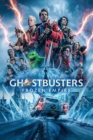 | Yes | 2024-03-20 | Ghost Corps | Unknown | Unknown | Unknown | [source](FEL.txt (curated Profile 7 FEL list)) | [TMDB](https://www.themoviedb.org/movie/967847) |
| Love Lies Bleeding |  | Yes | 2024-03-07 | Film4 Productions | Unknown | Unknown | Unknown | [source](https://github.com/iammarxg/FEL) | [TMDB](https://www.themoviedb.org/movie/948549) |
| Imaginary |  | Yes | 2024-03-06 | Blumhouse Productions | Unknown | Unknown | Unknown | [source](https://old.reddit.com/r/CoreELEC/comments/1jamlw6/list_of_dolby_vision_p7fel_films/) | [TMDB](https://www.themoviedb.org/movie/1125311) |
| Kung Fu Panda 4 |  | Yes | 2024-03-02 | DreamWorks Animation | Unknown | Unknown | Unknown | [source](https://github.com/iammarxg/FEL) | [TMDB](https://www.themoviedb.org/movie/1011985) |
| Arthur the King |  | Yes | 2024-02-22 | Entertainment One | Unknown | Unknown | Unknown | [source](https://github.com/iammarxg/FEL) | [TMDB](https://www.themoviedb.org/movie/618588) |
| Exhuma |  | Yes | 2024-02-22 | Showbox | Unknown | Unknown | Unknown | [source](FEL.txt (curated Profile 7 FEL list)) | [TMDB](https://www.themoviedb.org/movie/838209) |
| Bob Marley: One Love |  | Yes | 2024-02-14 | Paramount Pictures | Unknown | Unknown | Unknown | [source](https://web.archive.org/web/20250308162437/https://discourse.coreelec.org/t/list-of-dolby-vision-p7-fel-films/52523) | [TMDB](https://www.themoviedb.org/movie/802219) |
| Madame Web |  | Yes | 2024-02-14 | Columbia Pictures | Unknown | Unknown | Unknown | [source](FEL.txt (curated Profile 7 FEL list)) | [TMDB](https://www.themoviedb.org/movie/634492) |
| The Beekeeper |  | Yes | 2024-01-08 | Miramax | Unknown | Unknown | Unknown | [source](https://github.com/iammarxg/FEL) | [TMDB](https://www.themoviedb.org/movie/866398) |
| Longma jingshen |  | Yes | 2023 | Unknown | Unknown | Unknown | Unknown | [source](https://old.reddit.com/r/CoreELEC/comments/1jamlw6/list_of_dolby_vision_p7fel_films/) |  |
| All of Us Strangers |  | Yes | 2023-12-22 | Film4 Productions | Unknown | Unknown | Unknown | [source](https://github.com/iammarxg/FEL) | [TMDB](https://www.themoviedb.org/movie/994108) |
| The Iron Claw |  | Yes | 2023-12-21 | House Productions | Unknown | Unknown | Unknown | [source](https://github.com/iammarxg/FEL) | [TMDB](https://www.themoviedb.org/movie/850165) |
| Ferrari |  | Yes | 2023-12-14 | STXfilms | Unknown | Unknown | Unknown | [source](https://forum.blu-ray.com/showthread.php?t=327042&page=43) | [TMDB](https://www.themoviedb.org/movie/365620) |
| The Three Musketeers: Milady |  | Yes | 2023-12-13 | Pathé | Unknown | Unknown | Unknown | [source](https://github.com/iammarxg/FEL) | [TMDB](https://www.themoviedb.org/movie/845111) |
| Mr. Monk's Last Case: A Monk Movie |  | Yes | 2023-12-08 | UCP | Unknown | Unknown | Unknown | [source](FEL.txt (curated Profile 7 FEL list)) | [TMDB](https://www.themoviedb.org/movie/1100795) |
| Migration |  | Yes | 2023-12-06 | Universal Pictures | Unknown | Unknown | Unknown | [source](https://github.com/iammarxg/FEL) | [TMDB](https://www.themoviedb.org/movie/940551) |
| Silent Night |  | Yes | 2023-11-30 | Thunder Road | Unknown | Unknown | Unknown | [source](https://github.com/iammarxg/FEL) | [TMDB](https://www.themoviedb.org/movie/891699) |
| The Hunger Games: The Ballad of Songbirds & Snakes |  | Yes | 2023-11-15 | Lionsgate | Unknown | Unknown | Unknown | [source](https://web.archive.org/web/20250308162437/https://discourse.coreelec.org/t/list-of-dolby-vision-p7-fel-films/52523) | [TMDB](https://www.themoviedb.org/movie/695721) |
| Perfect Days |  | Yes | 2023-11-10 | Master Mind | Unknown | Unknown | Unknown | [source](https://old.reddit.com/r/CoreELEC/comments/1jamlw6/list_of_dolby_vision_p7fel_films/) | [TMDB](https://www.themoviedb.org/movie/976893) |
| Godzilla Minus One |  | Yes | 2023-11-03 | TOHO | Unknown | Unknown | Unknown | [source](https://forum.blu-ray.com/showthread.php?t=327042&page=49) | [TMDB](https://www.themoviedb.org/movie/940721) |
| The Holdovers |  | Yes | 2023-10-27 | Miramax | Unknown | Unknown | Unknown | [source](https://forum.blu-ray.com/showthread.php?t=372842&page=2) | [TMDB](https://www.themoviedb.org/movie/840430) |
| White Bird |  | Yes | 2023-10-25 | Participant | Unknown | Unknown | Unknown | [source](https://old.reddit.com/r/CoreELEC/comments/1jamlw6/list_of_dolby_vision_p7fel_films/) | [TMDB](https://www.themoviedb.org/movie/779816) |
| Killers of the Flower Moon |  | Yes | 2023-10-18 | Apple Studios | Unknown | Unknown | Unknown | [source](https://web.archive.org/web/20250308162437/https://discourse.coreelec.org/t/list-of-dolby-vision-p7-fel-films/52523) | [TMDB](https://www.themoviedb.org/movie/466420) |
| The Animal Kingdom |  | Yes | 2023-10-04 | StudioCanal | Unknown | Unknown | Unknown | [source](https://github.com/iammarxg/FEL) | [TMDB](https://www.themoviedb.org/movie/943134) |
| The Exorcist: Believer |  | Yes | 2023-10-04 | Universal Pictures | Unknown | Unknown | Unknown | [source](https://web.archive.org/web/20250308162437/https://discourse.coreelec.org/t/list-of-dolby-vision-p7-fel-films/52523) | [TMDB](https://www.themoviedb.org/movie/807172) |
| Expend4bles |  | Yes | 2023-09-15 | Millennium Media | Unknown | Unknown | Unknown | [source](https://docs.google.com/spreadsheets/d/15i0a84uiBtWiHZ5CXZZ7wygLFXwYOd84/edit?gid=828864432#gid=828864432) | [TMDB](https://www.themoviedb.org/movie/299054) |
| Coup de Chance |  | Yes | 2023-09-15 | Gravier Productions | Unknown | Unknown | Unknown | [source](https://old.reddit.com/r/CoreELEC/comments/1jamlw6/list_of_dolby_vision_p7fel_films/) | [TMDB](https://www.themoviedb.org/movie/859235) |
| The Kill Room |  | Yes | 2023-09-14 | Yale Productions | Unknown | Unknown | Unknown | [source](https://github.com/iammarxg/FEL) | [TMDB](https://www.themoviedb.org/movie/958006) |
| Retribution |  | Yes | 2023-08-23 | The Picture Company | Unknown | Unknown | Unknown | [source](https://github.com/iammarxg/FEL) | [TMDB](https://www.themoviedb.org/movie/762430) |
| Blue Beetle |  | Yes | 2023-08-16 | Warner Bros. Pictures | Unknown | Unknown | Unknown | [source](https://github.com/iammarxg/FEL) | [TMDB](https://www.themoviedb.org/movie/565770) |
| The Last Voyage of the Demeter |  | Yes | 2023-08-09 | Phoenix Pictures | Unknown | Unknown | Unknown | [source](https://github.com/iammarxg/FEL) | [TMDB](https://www.themoviedb.org/movie/635910) |
| Teenage Mutant Ninja Turtles: Mutant Mayhem | 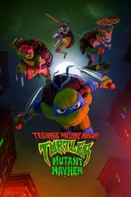 | Yes | 2023-07-31 | Paramount Pictures | Unknown | Unknown | Unknown | [source](https://web.archive.org/web/20250308162437/https://discourse.coreelec.org/t/list-of-dolby-vision-p7-fel-films/52523) | [TMDB](https://www.themoviedb.org/movie/614930) |
| Haunted Mansion |  | Yes | 2023-07-26 | Walt Disney Pictures | Unknown | Unknown | Unknown | [source](https://github.com/iammarxg/FEL) | [TMDB](https://www.themoviedb.org/movie/616747) |
| Justice League: Warworld |  | Yes | 2023-07-25 | Warner Bros. Animation | Unknown | Unknown | Unknown | [source](FEL.txt (curated Profile 7 FEL list)) | [TMDB](https://www.themoviedb.org/movie/1003581) |
| Barbie |  | Yes | 2023-07-19 | LuckyChap Entertainment | Unknown | Unknown | Unknown | [source](https://forum.blu-ray.com/showthread.php?t=327042&page=46) | [TMDB](https://www.themoviedb.org/movie/346698) |
| The Boy and the Heron |  | Yes | 2023-07-14 | Studio Ghibli | Unknown | Unknown | Unknown | [source](https://github.com/iammarxg/FEL) | [TMDB](https://www.themoviedb.org/movie/508883) |
| Mission: Impossible - Dead Reckoning Part One |  | Yes | 2023-07-08 | Paramount Pictures | Unknown | Unknown | Unknown | [source](https://web.archive.org/web/20250308162437/https://discourse.coreelec.org/t/list-of-dolby-vision-p7-fel-films/52523) | [TMDB](https://www.themoviedb.org/movie/575264) |
| God Is a Bullet |  | Yes | 2023-06-22 | Patriot Pictures | Unknown | Unknown | Unknown | [source](FEL.txt (curated Profile 7 FEL list)) | [TMDB](https://www.themoviedb.org/movie/808396) |
| Transformers: Rise of the Beasts |  | Yes | 2023-06-06 | Skydance Media | Unknown | Unknown | Unknown | [source](https://web.archive.org/web/20250308162437/https://discourse.coreelec.org/t/list-of-dolby-vision-p7-fel-films/52523) | [TMDB](https://www.themoviedb.org/movie/667538) |
| Past Lives |  | Yes | 2023-06-02 | A24 | Unknown | Unknown | Unknown | [source](https://forum.blu-ray.com/showthread.php?t=373287) | [TMDB](https://www.themoviedb.org/movie/666277) |
| Spider-Man: Across the Spider-Verse |  | Yes | 2023-05-31 | Columbia Pictures | Unknown | Unknown | Unknown | [source](FEL.txt (curated Profile 7 FEL list)) | [TMDB](https://www.themoviedb.org/movie/569094) |
| Fast X |  | Yes | 2023-05-17 | Universal Pictures | Unknown | Unknown | Unknown | [source](https://github.com/iammarxg/FEL) | [TMDB](https://www.themoviedb.org/movie/385687) |
| Guardians of the Galaxy Vol. 3 |  | Yes | 2023-05-03 | Marvel Studios | Unknown | Unknown | Unknown | [source](FEL.txt (curated Profile 7 FEL list)) | [TMDB](https://www.themoviedb.org/movie/447365) |
| Beau Is Afraid |  | Yes | 2023-04-14 | A24 | Unknown | Unknown | Unknown | [source](https://github.com/iammarxg/FEL) | [TMDB](https://www.themoviedb.org/movie/798286) |
| Evil Dead Rise |  | Yes | 2023-04-12 | Pacific Renaissance Pictures | Unknown | Unknown | Unknown | [source](https://forum.blu-ray.com/showthread.php?t=276448&page=174) | [TMDB](https://www.themoviedb.org/movie/713704) |
| Renfield |  | Yes | 2023-04-07 | Skybound Entertainment | Unknown | Unknown | Unknown | [source](FEL.txt (curated Profile 7 FEL list)) | [TMDB](https://www.themoviedb.org/movie/649609) |
| Ride On |  | Yes | 2023-04-07 | Alibaba Pictures Group | Unknown | Unknown | Unknown | [source](https://old.reddit.com/r/CoreElecOS/comments/1j3lgw2/list_of_dolby_vision_p7fel_films/) | [TMDB](https://www.themoviedb.org/movie/931102) |
| Showing Up |  | Yes | 2023-04-07 | A24 | Unknown | Unknown | Unknown | [source](https://old.reddit.com/r/CoreELEC/comments/1jamlw6/list_of_dolby_vision_p7fel_films/) | [TMDB](https://www.themoviedb.org/movie/790416) |
| The Super Mario Bros Movie |  | Yes | 2023-04-05 | Universal Pictures | Unknown | Unknown | Unknown | [source](https://docs.google.com/spreadsheets/d/15i0a84uiBtWiHZ5CXZZ7wygLFXwYOd84/edit?gid=828864432#gid=828864432) | [TMDB](https://www.themoviedb.org/movie/502356) |
| The Three Musketeers: D'Artagnan |  | Yes | 2023-04-05 | Pathé | Unknown | Unknown | Unknown | [source](https://github.com/iammarxg/FEL) | [TMDB](https://www.themoviedb.org/movie/796185) |
| Dungeons & Dragons: Honor Among Thieves |  | Yes | 2023-03-23 | Entertainment One | Unknown | Unknown | Unknown | [source](https://web.archive.org/web/20250308162437/https://discourse.coreelec.org/t/list-of-dolby-vision-p7-fel-films/52523) | [TMDB](https://www.themoviedb.org/movie/493529) |
| John Wick: Chapter 4 |  | Yes | 2023-03-21 | Thunder Road | Unknown | Unknown | Unknown | [source](https://docs.google.com/spreadsheets/d/15i0a84uiBtWiHZ5CXZZ7wygLFXwYOd84/edit?gid=828864432#gid=828864432) | [TMDB](https://www.themoviedb.org/movie/603692) |
| Shin Kamen Rider |  | Yes | 2023-03-17 | khara | Unknown | Unknown | Unknown | [source](https://github.com/iammarxg/FEL) | [TMDB](https://www.themoviedb.org/movie/813477) |
| Batman: The Doom That Came to Gotham |  | Yes | 2023-03-10 | Warner Bros. Animation | Unknown | Unknown | Unknown | [source](FEL.txt (curated Profile 7 FEL list)) | [TMDB](https://www.themoviedb.org/movie/1003579) |
| Scream VI |  | Yes | 2023-03-08 | Radio Silence | Unknown | Unknown | Unknown | [source](https://forum.blu-ray.com/showthread.php?page=7&t=360081) | [TMDB](https://www.themoviedb.org/movie/934433) |
| Cocaine Bear |  | Yes | 2023-02-22 | Universal Pictures | Unknown | Unknown | Unknown | [source](https://forum.blu-ray.com/showthread.php?t=360081&page=2) | [TMDB](https://www.themoviedb.org/movie/804150) |
| Ant-Man and the Wasp: Quantumania | 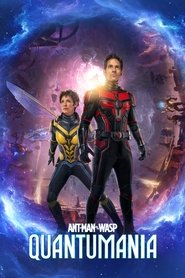 | Yes | 2023-02-15 | Marvel Studios | Unknown | Unknown | Unknown | [source](FEL.txt (curated Profile 7 FEL list)) | [TMDB](https://www.themoviedb.org/movie/640146) |
| Legion of Super-Heroes |  | Yes | 2023-02-07 | Warner Bros. Animation | Unknown | Unknown | Unknown | [source](FEL.txt (curated Profile 7 FEL list)) | [TMDB](https://www.themoviedb.org/movie/1003580) |
| Asterix & Obelix: The Middle Kingdom |  | Yes | 2023-02-01 | Les Éditions Albert René | Unknown | Unknown | Unknown | [source](FEL.txt (curated Profile 7 FEL list)) | [TMDB](https://www.themoviedb.org/movie/643215) |
| Knock at the Cabin |  | Yes | 2023-02-01 | Blinding Edge Pictures | Unknown | Unknown | Unknown | [source](https://forum.blu-ray.com/showthread.php?t=327042&page=35) | [TMDB](https://www.themoviedb.org/movie/631842) |
| The Wandering Earth II |  | Yes | 2023-01-22 | Guo Fan Culture and Media | Unknown | Unknown | Unknown | [source](https://old.reddit.com/r/CoreELEC/comments/1jamlw6/list_of_dolby_vision_p7fel_films/) | [TMDB](https://www.themoviedb.org/movie/842675) |
| Plane |  | Yes | 2023-01-11 | MadRiver Pictures | Unknown | Unknown | Unknown | [source](https://forum.blu-ray.com/showthread.php?t=276448) | [TMDB](https://www.themoviedb.org/movie/646389) |
| Operation Fortune: Ruse de Guerre |  | Yes | 2023-01-04 | Miramax | Unknown | Unknown | Unknown | [source](https://web.archive.org/web/20250308162437/https://discourse.coreelec.org/t/list-of-dolby-vision-p7-fel-films/52523) | [TMDB](https://www.themoviedb.org/movie/739405) |
| Shotgun Wedding |  | Yes | 2022-12-28 | Mandeville Films | Unknown | Unknown | Unknown | [source](https://github.com/iammarxg/FEL) | [TMDB](https://www.themoviedb.org/movie/758009) |
| Babylon |  | Yes | 2022-12-22 | Paramount Pictures | Unknown | Unknown | Unknown | [source](https://forum.blu-ray.com/showthread.php?t=276448&page=174) | [TMDB](https://www.themoviedb.org/movie/615777) |
| Avatar: The Way of Water |  | Yes | 2022-12-14 | 20th Century Studios | Unknown | Unknown | Unknown | [source](https://web.archive.org/web/20250308162437/https://discourse.coreelec.org/t/list-of-dolby-vision-p7-fel-films/52523) | [TMDB](https://www.themoviedb.org/movie/76600) |
| The Whale |  | Yes | 2022-12-09 | A24 | Unknown | Unknown | Unknown | [source](https://github.com/iammarxg/FEL) | [TMDB](https://www.themoviedb.org/movie/785084) |
| Puss in Boots: The Last Wish |  | Yes | 2022-12-07 | DreamWorks Animation | Unknown | Unknown | Unknown | [source](FEL.txt (curated Profile 7 FEL list)) | [TMDB](https://www.themoviedb.org/movie/315162) |
| The First Slam Dunk |  | Yes | 2022-12-03 | Toei Animation | Unknown | Unknown | Unknown | [source](https://forum.blu-ray.com/showthread.php?p=22886667) | [TMDB](https://www.themoviedb.org/movie/783675) |
| The Fabelmans |  | Yes | 2022-11-11 | Amblin Entertainment | Unknown | Unknown | Unknown | [source](https://github.com/iammarxg/FEL) | [TMDB](https://www.themoviedb.org/movie/804095) |
| Guillermo del Toro's Pinocchio |  | Yes | 2022-11-09 | The Jim Henson Company | Unknown | Unknown | Unknown | [source](https://web.archive.org/web/20250308162437/https://discourse.coreelec.org/t/list-of-dolby-vision-p7-fel-films/52523) | [TMDB](https://www.themoviedb.org/movie/555604) |
| Talk to Me |  | Yes | 2022-10-24 | IESAV | Unknown | Unknown | Unknown | [source](https://github.com/iammarxg/FEL) | [TMDB](https://www.themoviedb.org/movie/1118584) |
| Prey for the Devil |  | Yes | 2022-10-23 | Lionsgate | Unknown | Unknown | Unknown | [source](https://github.com/iammarxg/FEL) | [TMDB](https://www.themoviedb.org/movie/676547) |
| Black Adam |  | Yes | 2022-10-19 | New Line Cinema | Unknown | Unknown | Unknown | [source](https://forum.blu-ray.com/showthread.php?t=276448&page=173) | [TMDB](https://www.themoviedb.org/movie/436270) |
| Halloween Ends |  | Yes | 2022-10-12 | Universal Pictures | Unknown | Unknown | Unknown | [source](https://forum.blu-ray.com/showthread.php?t=327042&page=49) | [TMDB](https://www.themoviedb.org/movie/616820) |
| November |  | Yes | 2022-10-05 | Chi-Fou-Mi Productions | Unknown | Unknown | Unknown | [source](https://old.reddit.com/r/CoreELEC/comments/1jamlw6/list_of_dolby_vision_p7fel_films/) | [TMDB](https://www.themoviedb.org/movie/823951) |
| Hellraiser |  | Yes | 2022-09-28 | Phantom Four | Unknown | Unknown | Unknown | [source](https://forum.blu-ray.com/showthread.php?t=377093&page=8) | [TMDB](https://www.themoviedb.org/movie/338947) |
| Amsterdam |  | Yes | 2022-09-27 | DreamCrew | Unknown | Unknown | Unknown | [source](FEL.txt (curated Profile 7 FEL list)) | [TMDB](https://www.themoviedb.org/movie/664469) |
| Smile |  | Yes | 2022-09-23 | Paramount Players | Unknown | Unknown | Unknown | [source](https://forum.blu-ray.com/showthread.php?p=20658059) | [TMDB](https://www.themoviedb.org/movie/882598) |
| Don't Worry Darling |  | Yes | 2022-09-21 | Vertigo Entertainment | Unknown | Unknown | Unknown | [source](FEL.txt (curated Profile 7 FEL list)) | [TMDB](https://www.themoviedb.org/movie/619730) |
| Pearl |  | Yes | 2022-09-16 | A24 | Unknown | Unknown | Unknown | [source](https://forum.blu-ray.com/showthread.php?t=276448) | [TMDB](https://www.themoviedb.org/movie/949423) |
| Jeepers Creepers: Reborn |  | Yes | 2022-09-15 | Orwo Studios (US) | Unknown | Unknown | Unknown | [source](https://web.archive.org/web/20250308162437/https://discourse.coreelec.org/t/list-of-dolby-vision-p7-fel-films/52523) | [TMDB](https://www.themoviedb.org/movie/717728) |
| Sick |  | Yes | 2022-09-11 | Miramax | Unknown | Unknown | Unknown | [source](https://github.com/iammarxg/FEL) | [TMDB](https://www.themoviedb.org/movie/829410) |
| Sisu |  | Yes | 2022-09-09 | Subzero Film Entertainment | Unknown | Unknown | Unknown | [source](https://github.com/iammarxg/FEL) | [TMDB](https://www.themoviedb.org/movie/840326) |
| Weird: The Al Yankovic Story |  | Yes | 2022-09-08 | Tango Entertainment | Unknown | Unknown | Unknown | [source](https://web.archive.org/web/20250308162437/https://discourse.coreelec.org/t/list-of-dolby-vision-p7-fel-films/52523) | [TMDB](https://www.themoviedb.org/movie/928344) |
| Bodies Bodies Bodies |  | Yes | 2022-08-05 | A24 | Unknown | Unknown | Unknown | [source](https://old.reddit.com/r/CoreELEC/comments/1jamlw6/list_of_dolby_vision_p7fel_films/) | [TMDB](https://www.themoviedb.org/movie/520023) |
| Green Lantern: Beware My Power |  | Yes | 2022-07-26 | Warner Bros. Animation | Unknown | Unknown | Unknown | [source](FEL.txt (curated Profile 7 FEL list)) | [TMDB](https://www.themoviedb.org/movie/887357) |
| Laid-Back Camp the Movie |  | Yes | 2022-07-01 | C-Station | Unknown | Unknown | Unknown | [source](https://old.reddit.com/r/CoreELEC/comments/1jamlw6/list_of_dolby_vision_p7fel_films/) | [TMDB](https://www.themoviedb.org/movie/566466) |
| Minions: The Rise of Gru |  | Yes | 2022-06-29 | Universal Pictures | Unknown | Unknown | Unknown | [source](https://docs.google.com/spreadsheets/d/15i0a84uiBtWiHZ5CXZZ7wygLFXwYOd84/edit?gid=828864432#gid=828864432) | [TMDB](https://www.themoviedb.org/movie/438148) |
| Marcel the Shell with Shoes On |  | Yes | 2022-06-24 | Cinereach | Unknown | Unknown | Unknown | [source](https://forum.blu-ray.com/showthread.php?t=276448&page=171) | [TMDB](https://www.themoviedb.org/movie/869626) |
| Arrow Sworn |  | Yes | 2022-06-18 | Fresh Wave | Unknown | Unknown | Unknown | [source](https://forum.blu-ray.com/forumdisplay.php?f=203) | [TMDB](https://www.themoviedb.org/movie/990397) |
| Dragon Ball Super: Super Hero |  | Yes | 2022-06-11 | Toei Animation | Unknown | Unknown | Unknown | [source](https://old.reddit.com/r/CoreELEC/comments/1jamlw6/list_of_dolby_vision_p7fel_films/) | [TMDB](https://www.themoviedb.org/movie/610150) |
| Jurassic World Dominion |  | Yes | 2022-06-01 | Amblin Entertainment | Unknown | Unknown | Unknown | [source](https://docs.google.com/spreadsheets/d/15i0a84uiBtWiHZ5CXZZ7wygLFXwYOd84/edit?gid=828864432#gid=828864432) | [TMDB](https://www.themoviedb.org/movie/507086) |
| Crimes of the Future |  | Yes | 2022-05-25 | Serendipity Point Films | Unknown | Unknown | Unknown | [source](https://github.com/iammarxg/FEL) | [TMDB](https://www.themoviedb.org/movie/819876) |
| Top Gun: Maverick |  | Yes | 2022-05-21 | Skydance Media | Unknown | Unknown | Unknown | [source](https://discourse.coreelec.org/t/firecube-and-dolby-vision-profile-7/54019) | [TMDB](https://www.themoviedb.org/movie/361743) |
| Men |  | Yes | 2022-05-20 | A24 | Unknown | Unknown | Unknown | [source](https://old.reddit.com/r/CoreELEC/comments/1jamlw6/list_of_dolby_vision_p7fel_films/) | [TMDB](https://www.themoviedb.org/movie/780609) |
| Shin Ultraman |  | Yes | 2022-05-13 | Tsuburaya Productions | Unknown | Unknown | Unknown | [source](https://old.reddit.com/r/CoreELEC/comments/1jamlw6/list_of_dolby_vision_p7fel_films/) | [TMDB](https://www.themoviedb.org/movie/634429) |
| Corrective Measures |  | Yes | 2022-04-29 | The Exchange | Unknown | Unknown | Unknown | [source](FEL.txt (curated Profile 7 FEL list)) | [TMDB](https://www.themoviedb.org/movie/872177) |
| Downton Abbey: A New Era |  | Yes | 2022-04-27 | Carnival Films | Unknown | Unknown | Unknown | [source](https://old.reddit.com/r/CoreELEC/comments/1jamlw6/list_of_dolby_vision_p7fel_films/) | [TMDB](https://www.themoviedb.org/movie/820446) |
| The Unbearable Weight of Massive Talent | 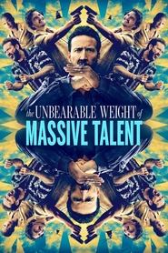 | Yes | 2022-04-20 | Saturn Films | Unknown | Unknown | Unknown | [source](https://github.com/iammarxg/FEL) | [TMDB](https://www.themoviedb.org/movie/648579) |
| The Northman |  | Yes | 2022-04-07 | Regency Enterprises | Unknown | Unknown | Unknown | [source](https://docs.google.com/spreadsheets/d/15i0a84uiBtWiHZ5CXZZ7wygLFXwYOd84/edit?gid=828864432#gid=828864432) | [TMDB](https://www.themoviedb.org/movie/639933) |
| Fantastic Beasts: The Secrets of Dumbledore |  | Yes | 2022-04-06 | Warner Bros. Pictures | Unknown | Unknown | Unknown | [source](https://forum.blu-ray.com/showthread.php?t=276448&page=168) | [TMDB](https://www.themoviedb.org/movie/338953) |
| Sonic the Hedgehog 2 |  | Yes | 2022-03-30 | Original Film | Unknown | Unknown | Unknown | [source](https://forum.blu-ray.com/showthread.php?t=276448&page=170) | [TMDB](https://www.themoviedb.org/movie/675353) |
| Everything Everywhere All at Once |  | Yes | 2022-03-24 | IAC Films | Unknown | Unknown | Unknown | [source](https://github.com/iammarxg/FEL) | [TMDB](https://www.themoviedb.org/movie/545611) |
| The Lost City |  | Yes | 2022-03-23 | Fortis Films | Unknown | Unknown | Unknown | [source](https://forum.blu-ray.com/showthread.php?t=276448&page=169) | [TMDB](https://www.themoviedb.org/movie/752623) |
| X |  | Yes | 2022-03-17 | A24 | Unknown | Unknown | Unknown | [source](https://old.reddit.com/r/CoreELEC/comments/1jamlw6/list_of_dolby_vision_p7fel_films/) | [TMDB](https://www.themoviedb.org/movie/760104) |
| Ambulance |  | Yes | 2022-03-16 | Bay Films | Unknown | Unknown | Unknown | [source](https://forum.blu-ray.com/showthread.php?t=276448&page=168) | [TMDB](https://www.themoviedb.org/movie/763285) |
| Notre-Dame on Fire |  | Yes | 2022-03-16 | Pathé | Unknown | Unknown | Unknown | [source](https://old.reddit.com/r/CoreELEC/comments/1jamlw6/list_of_dolby_vision_p7fel_films/) | [TMDB](https://www.themoviedb.org/movie/811596) |
| Catwoman: Hunted |  | Yes | 2022-02-07 | Warner Bros. Animation | Unknown | Unknown | Unknown | [source](FEL.txt (curated Profile 7 FEL list)) | [TMDB](https://www.themoviedb.org/movie/862491) |
| Moonfall |  | Yes | 2022-02-02 | Centropolis Entertainment | Unknown | Unknown | Unknown | [source](https://forum.blu-ray.com/showthread.php?t=276448&page=167) | [TMDB](https://www.themoviedb.org/movie/406759) |
| The 355 |  | Yes | 2022-01-05 | Freckle Films | Unknown | Unknown | Unknown | [source](https://github.com/iammarxg/FEL) | [TMDB](https://www.themoviedb.org/movie/522016) |
| Burning Sea |  | Yes | 2021 | Unknown | Unknown | Unknown | Unknown | [source](https://docs.google.com/spreadsheets/d/15i0a84uiBtWiHZ5CXZZ7wygLFXwYOd84/edit?gid=828864432#gid=828864432) |  |
| American Underdog |  | Yes | 2021-12-25 | Lionsgate | Unknown | Unknown | Unknown | [source](FEL.txt (curated Profile 7 FEL list)) | [TMDB](https://www.themoviedb.org/movie/673309) |
| Nightmare Alley |  | Yes | 2021-12-02 | Searchlight Pictures | Unknown | Unknown | Unknown | [source](https://forum.blu-ray.com/showthread.php?t=354888&page=13) | [TMDB](https://www.themoviedb.org/movie/597208) |
| Sing 2 |  | Yes | 2021-12-01 | Illumination | Unknown | Unknown | Unknown | [source](https://forum.blu-ray.com/showthread.php?t=276448&page=164) | [TMDB](https://www.themoviedb.org/movie/438695) |
| House of Gucci |  | Yes | 2021-11-24 | Metro-Goldwyn-Mayer | Unknown | Unknown | Unknown | [source](https://forum.blu-ray.com/showthread.php?t=387630&page=2) | [TMDB](https://www.themoviedb.org/movie/644495) |
| Resident Evil: Welcome to Raccoon City |  | Yes | 2021-11-24 | Constantin Film | Unknown | Unknown | Unknown | [source](https://forum.blu-ray.com/showthread.php?t=276448&page=162) | [TMDB](https://www.themoviedb.org/movie/460458) |
| Eternals |  | Yes | 2021-11-03 | Marvel Studios | Unknown | Unknown | Unknown | [source](https://forum.blu-ray.com/showthread.php?t=387630&page=3) | [TMDB](https://www.themoviedb.org/movie/524434) |
| The Burning Sea |  | Yes | 2021-10-29 | Fantefilm | Unknown | Unknown | Unknown | [source](https://docs.google.com/spreadsheets/d/1WiD-lECLFdOhCTW8_o9z92_-frsT-CSgo9xPuCcEpmQ/edit?usp=sharing) | [TMDB](https://www.themoviedb.org/movie/623511) |
| The Power of the Dog |  | Yes | 2021-10-25 | See-Saw Films | Unknown | Unknown | Unknown | [source](https://github.com/iammarxg/FEL) | [TMDB](https://www.themoviedb.org/movie/600583) |
| Last Night in Soho |  | Yes | 2021-10-21 | Focus Features | Unknown | Unknown | Unknown | [source](https://docs.google.com/spreadsheets/d/15i0a84uiBtWiHZ5CXZZ7wygLFXwYOd84/edit?gid=828864432#gid=828864432) | [TMDB](https://www.themoviedb.org/movie/576845) |
| The French Dispatch of the Liberty, Kansas Evening Sun |  | Yes | 2021-10-21 | Indian Paintbrush | Unknown | Unknown | Unknown | [source](https://old.reddit.com/r/CoreELEC/comments/1jamlw6/list_of_dolby_vision_p7fel_films/) | [TMDB](https://www.themoviedb.org/movie/542178) |
| Halloween Kills |  | Yes | 2021-10-14 | Blumhouse Productions | Unknown | Unknown | Unknown | [source](https://forum.blu-ray.com/showthread.php?t=276448&page=160) | [TMDB](https://www.themoviedb.org/movie/610253) |
| Ron's Gone Wrong |  | Yes | 2021-10-14 | Locksmith Animation | Unknown | Unknown | Unknown | [source](FEL.txt (curated Profile 7 FEL list)) | [TMDB](https://www.themoviedb.org/movie/482321) |
| No Time to Die |  | Yes | 2021-09-29 | EON Productions | Unknown | Unknown | Unknown | [source](https://forum.blu-ray.com/showthread.php?t=276448&page=159) | [TMDB](https://www.themoviedb.org/movie/370172) |
| Infinite |  | Yes | 2021-09-09 | di Bonaventura Pictures | Unknown | Unknown | Unknown | [source](https://forum.blu-ray.com/showthread.php?t=276448&page=162) | [TMDB](https://www.themoviedb.org/movie/581726) |
| Yakuza Princess |  | Yes | 2021-08-26 | Warner Bros. Pictures | Unknown | Unknown | Unknown | [source](https://forum.blu-ray.com/showthread.php?t=276448&page=157) | [TMDB](https://www.themoviedb.org/movie/661595) |
| The Protégé |  | Yes | 2021-08-19 | Millennium Media | Unknown | Unknown | Unknown | [source](https://github.com/iammarxg/FEL) | [TMDB](https://www.themoviedb.org/movie/645788) |
| Don't Breathe 2 |  | Yes | 2021-08-12 | Ghost House Pictures | Unknown | Unknown | Unknown | [source](FEL.txt (curated Profile 7 FEL list)) | [TMDB](https://www.themoviedb.org/movie/482373) |
| Free Guy |  | Yes | 2021-08-11 | Berlanti Productions | Unknown | Unknown | Unknown | [source](FEL.txt (curated Profile 7 FEL list)) | [TMDB](https://www.themoviedb.org/movie/550988) |
| The Green Knight |  | Yes | 2021-07-29 | A24 | Unknown | Unknown | Unknown | [source](https://docs.google.com/spreadsheets/d/15i0a84uiBtWiHZ5CXZZ7wygLFXwYOd84/edit?gid=828864432#gid=828864432) | [TMDB](https://www.themoviedb.org/movie/559907) |
| Escape from Mogadishu |  | Yes | 2021-07-28 | Filmmaker R&K | Unknown | Unknown | Unknown | [source](https://old.reddit.com/r/CoreELEC/comments/1jamlw6/list_of_dolby_vision_p7fel_films/) | [TMDB](https://www.themoviedb.org/movie/607844) |
| Snake Eyes: G.I. Joe Origins |  | Yes | 2021-07-22 | Paramount Pictures | Unknown | Unknown | Unknown | [source](FEL.txt (curated Profile 7 FEL list)) | [TMDB](https://www.themoviedb.org/movie/568620) |
| Kaamelott: The First Chapter |  | Yes | 2021-07-21 | SND | Unknown | Unknown | Unknown | [source](https://github.com/iammarxg/FEL) | [TMDB](https://www.themoviedb.org/movie/577242) |
| Old |  | Yes | 2021-07-21 | Universal Pictures | Unknown | Unknown | Unknown | [source](https://forum.blu-ray.com/showthread.php?t=276448) | [TMDB](https://www.themoviedb.org/movie/631843) |
| Belle |  | Yes | 2021-07-16 | Studio Chizu | Unknown | Unknown | Unknown | [source](https://forum.blu-ray.com/showthread.php?t=276448&page=162) | [TMDB](https://www.themoviedb.org/movie/776305) |
| Gunpowder Milkshake |  | Yes | 2021-07-14 | Studio Babelsberg | Unknown | Unknown | Unknown | [source](https://github.com/iammarxg/FEL) | [TMDB](https://www.themoviedb.org/movie/574060) |
| The Boss Baby: Family Business |  | Yes | 2021-07-01 | DreamWorks Animation | Unknown | Unknown | Unknown | [source](https://forum.blu-ray.com/showthread.php?t=276448) | [TMDB](https://www.themoviedb.org/movie/459151) |
| The Deep House |  | Yes | 2021-06-30 | Radar Films | Unknown | Unknown | Unknown | [source](https://github.com/iammarxg/FEL) | [TMDB](https://www.themoviedb.org/movie/672582) |
| Luca |  | Yes | 2021-06-17 | Pixar | Unknown | Unknown | Unknown | [source](FEL.txt (curated Profile 7 FEL list)) | [TMDB](https://www.themoviedb.org/movie/508943) |
| Hitman's Wife's Bodyguard |  | Yes | 2021-06-14 | Nu Boyana Film Studios | Unknown | Unknown | Unknown | [source](https://forum.blu-ray.com/showthread.php?t=276448) | [TMDB](https://www.themoviedb.org/movie/522931) |
| Cruella |  | Yes | 2021-05-26 | Walt Disney Pictures | Unknown | Unknown | Unknown | [source](https://forum.blu-ray.com/showthread.php?t=354888&page=60) | [TMDB](https://www.themoviedb.org/movie/337404) |
| A Quiet Place Part II |  | Yes | 2021-05-21 | Paramount Pictures | Unknown | Unknown | Unknown | [source](https://forum.blu-ray.com/showthread.php?t=276448) | [TMDB](https://www.themoviedb.org/movie/520763) |
| F9 |  | Yes | 2021-05-19 | Original Film | Unknown | Unknown | Unknown | [source](https://web.archive.org/web/20250308162437/https://discourse.coreelec.org/t/list-of-dolby-vision-p7-fel-films/52523) | [TMDB](https://www.themoviedb.org/movie/385128) |
| Incident 437 |  | Yes | 2021-04-10 | Unknown | Unknown | Unknown | Unknown | [source](FEL.txt (curated Profile 7 FEL list)) | [TMDB](https://www.themoviedb.org/movie/931985) |
| Mortal Kombat |  | Yes | 2021-04-07 | Atomic Monster | Unknown | Unknown | Unknown | [source](https://forum.blu-ray.com/forumdisplay.php?f=203) | [TMDB](https://www.themoviedb.org/movie/460465) |
| Barb and Star Go to Vista Del Mar |  | Yes | 2021-03-29 | Gloria Sanchez Productions | Unknown | Unknown | Unknown | [source](https://docs.google.com/spreadsheets/d/15i0a84uiBtWiHZ5CXZZ7wygLFXwYOd84/edit?gid=828864432#gid=828864432) | [TMDB](https://www.themoviedb.org/movie/595813) |
| Nobody |  | Yes | 2021-03-18 | 87North Productions | Unknown | Unknown | Unknown | [source](https://docs.google.com/spreadsheets/d/1WiD-lECLFdOhCTW8_o9z92_-frsT-CSgo9xPuCcEpmQ/edit?usp=sharing) | [TMDB](https://www.themoviedb.org/movie/615457) |
| Chaos Walking |  | Yes | 2021-02-24 | Quadrant Pictures | Unknown | Unknown | Unknown | [source](https://docs.google.com/spreadsheets/d/15i0a84uiBtWiHZ5CXZZ7wygLFXwYOd84/edit?gid=828864432#gid=828864432) | [TMDB](https://www.themoviedb.org/movie/412656) |
| Boss Level |  | Yes | 2021-02-19 | WarParty Films | Unknown | Unknown | Unknown | [source](https://github.com/iammarxg/FEL) | [TMDB](https://www.themoviedb.org/movie/513310) |
| A Writer's Odyssey |  | Yes | 2021-02-12 | United Entertainment Partners | Unknown | Unknown | Unknown | [source](https://old.reddit.com/r/CoreELEC/comments/1jamlw6/list_of_dolby_vision_p7fel_films/) | [TMDB](https://www.themoviedb.org/movie/611698) |
| Willy's Wonderland |  | Yes | 2021-02-12 | Saturn Films | Unknown | Unknown | Unknown | [source](FEL.txt (curated Profile 7 FEL list)) | [TMDB](https://www.themoviedb.org/movie/643586) |
| A Quiet Place Part II |  | Yes | 2020 | Unknown | Unknown | Unknown | Unknown | [source](https://docs.google.com/spreadsheets/d/15i0a84uiBtWiHZ5CXZZ7wygLFXwYOd84/edit?gid=828864432#gid=828864432) |  |
| Sun Sep 27 |  | Yes | 2020 | Unknown | Unknown | Unknown | Unknown | [source](https://forum.makemkv.com/forum/viewtopic.php?start=3150&style=4&t=18602) |  |
| Tue Sep 29 |  | Yes | 2020 | Unknown | Unknown | Unknown | Unknown | [source](https://forum.makemkv.com/forum/viewtopic.php?start=3150&style=4&t=18602) |  |
| Wed Sep 30 |  | Yes | 2020 | Unknown | Unknown | Unknown | Unknown | [source](https://forum.makemkv.com/forum/viewtopic.php?start=3150&style=4&t=18602) |  |
| typo, its |  | Yes | 2020 | Unknown | Unknown | Unknown | Unknown | [source](https://old.reddit.com/r/CoreElecOS/comments/1j3lgw2/list_of_dolby_vision_p7fel_films/) |  |
| Monster Hunter |  | Yes | 2020-12-03 | Capcom | Unknown | Unknown | Unknown | [source](FEL.txt (curated Profile 7 FEL list)) | [TMDB](https://www.themoviedb.org/movie/458576) |
| The Croods: A New Age |  | Yes | 2020-11-25 | DreamWorks Animation | Unknown | Unknown | enhancement_bitrate_mbps: 7.90 | [source](https://forum.blu-ray.com/showthread.php?t=276448) | [TMDB](https://www.themoviedb.org/movie/529203) |
| Love and Monsters |  | Yes | 2020-10-16 | 21 Laps Entertainment | Unknown | Unknown | enhancement_bitrate_mbps: 4.95 | [source](https://forum.blu-ray.com/showthread.php?t=276448) | [TMDB](https://www.themoviedb.org/movie/590223) |
| Violet Evergarden: The Movie |  | Yes | 2020-09-18 | Kyoto Animation | Unknown | Unknown | Unknown | [source](https://old.reddit.com/r/CoreELEC/comments/1jamlw6/list_of_dolby_vision_p7fel_films/) | [TMDB](https://www.themoviedb.org/movie/533514) |
| Antebellum |  | Yes | 2020-09-02 | Lionsgate | Unknown | Unknown | enhancement_bitrate_mbps: 7.46 | [source](https://forum.blu-ray.com/showthread.php?t=276448) | [TMDB](https://www.themoviedb.org/movie/627290) |
| Bill & Ted Face the Music |  | Yes | 2020-08-27 | Endeavor Content | Unknown | Unknown | Unknown | [source](FEL.txt (curated Profile 7 FEL list)) | [TMDB](https://www.themoviedb.org/movie/501979) |
| Tenet |  | Yes | 2020-08-22 | Warner Bros. Pictures | Unknown | Unknown | Unknown | [source](https://forum.blu-ray.com/showthread.php?t=327042&page=27) | [TMDB](https://www.themoviedb.org/movie/577922) |
| 2011 |  | Yes | 2020-08-20 | Unknown | Unknown | Unknown | Unknown | [source](FEL.txt (curated Profile 7 FEL list)) | [TMDB](https://www.themoviedb.org/movie/730339) |
| Unhinged |  | Yes | 2020-07-16 | Solstice Studios | Unknown | Unknown | enhancement_bitrate_mbps: 15.92 | [source](https://forum.blu-ray.com/showthread.php?t=276448) | [TMDB](https://www.themoviedb.org/movie/625568) |
| Peninsula |  | Yes | 2020-07-15 | Next Entertainment World | Unknown | Unknown | Unknown | [source](https://github.com/iammarxg/FEL) | [TMDB](https://www.themoviedb.org/movie/581392) |
| Trolls World Tour |  | Yes | 2020-03-11 | DreamWorks Animation | Unknown | Unknown | enhancement_bitrate_mbps: 6.15 | [source](https://forum.blu-ray.com/showthread.php?t=276448) | [TMDB](https://www.themoviedb.org/movie/446893) |
| The Invisible Man |  | Yes | 2020-02-26 | Blumhouse Productions | Unknown | Unknown | enhancement_bitrate_mbps: 7.08 | [source](https://forum.blu-ray.com/showthread.php?t=276448) | [TMDB](https://www.themoviedb.org/movie/570670) |
| Sonic the Hedgehog |  | Yes | 2020-02-12 | Original Film | Unknown | Unknown | enhancement_bitrate_mbps: 4.96 | [source](https://forum.blu-ray.com/showthread.php?t=276448) | [TMDB](https://www.themoviedb.org/movie/454626) |
| Dolittle |  | Yes | 2020-01-02 | Universal Pictures | Unknown | Unknown | enhancement_bitrate_mbps: 5.96 | [source](https://forum.blu-ray.com/showthread.php?t=276448) | [TMDB](https://www.themoviedb.org/movie/448119) |
| Game of Thrones: The Complete Eighth Season |  | Yes | 2019 | Unknown | Unknown | Unknown | enhancement_bitrate_mbps: 4.08 | [source](https://forum.blu-ray.com/showthread.php?t=276448) |  |
| FEL - 6.95 Mbps |  | Yes | 2019 | Unknown | Unknown | Unknown | Unknown | [source](https://forum.blu-ray.com/showthread.php?t=276448&page=135) |  |
| Hellboy III: Rise of the Blood Queen |  | Yes | 2019 | Unknown | Unknown | Unknown | Unknown | [source](https://github.com/iammarxg/FEL) |  |
| Yuyeolui eumagaelbeom |  | Yes | 2019 | Unknown | Unknown | Unknown | Unknown | [source](https://old.reddit.com/r/CoreELEC/comments/1jamlw6/list_of_dolby_vision_p7fel_films/) |  |
| 1917 |  | Yes | 2019-12-25 | DreamWorks Pictures | Unknown | Unknown | enhancement_bitrate_mbps: 7.27 | [source](https://forum.blu-ray.com/showthread.php?t=276448) | [TMDB](https://www.themoviedb.org/movie/530915) |
| Ip Man 4: The Finale |  | Yes | 2019-12-19 | Mandarin Films | Unknown | Unknown | Unknown | [source](https://github.com/iammarxg/FEL) | [TMDB](https://www.themoviedb.org/movie/449924) |
| Spies in Disguise |  | Yes | 2019-12-04 | Chernin Entertainment | Unknown | Unknown | Unknown | [source](FEL.txt (curated Profile 7 FEL list)) | [TMDB](https://www.themoviedb.org/movie/431693) |
| Knives Out |  | Yes | 2019-11-27 | MRC | Unknown | Unknown | enhancement_bitrate_mbps: 5.59 | [source](https://forum.blu-ray.com/showthread.php?t=276448) | [TMDB](https://www.themoviedb.org/movie/546554) |
| Ford v Ferrari |  | Yes | 2019-11-13 | 20th Century Fox | Unknown | Unknown | Unknown | [source](FEL.txt (curated Profile 7 FEL list)) | [TMDB](https://www.themoviedb.org/movie/359724) |
| Midway |  | Yes | 2019-11-06 | AGC Studios | Unknown | Unknown | enhancement_bitrate_mbps: 7.51 | [source](https://forum.blu-ray.com/showthread.php?t=276448) | [TMDB](https://www.themoviedb.org/movie/522162) |
| Terminator: Dark Fate |  | Yes | 2019-10-23 | 20th Century Fox | Unknown | Unknown | enhancement_bitrate_mbps: 5.13 | [source](https://forum.blu-ray.com/showthread.php?t=276448) | [TMDB](https://www.themoviedb.org/movie/290859) |
| The Lighthouse |  | Yes | 2019-10-18 | RT Features | Unknown | Unknown | Unknown | [source](https://github.com/iammarxg/FEL) | [TMDB](https://www.themoviedb.org/movie/503919) |
| Maleficent: Mistress of Evil |  | Yes | 2019-10-16 | Walt Disney Pictures | Unknown | Unknown | Unknown | [source](FEL.txt (curated Profile 7 FEL list)) | [TMDB](https://www.themoviedb.org/movie/420809) |
| A Shaun the Sheep Movie: Farmageddon |  | Yes | 2019-09-26 | StudioCanal | Unknown | Unknown | enhancement_bitrate_mbps: 7.01 | [source](https://forum.blu-ray.com/showthread.php?t=276448) | [TMDB](https://www.themoviedb.org/movie/422803) |
| Rambo: Last Blood |  | Yes | 2019-09-18 | Millennium Media | Unknown | Unknown | enhancement_bitrate_mbps: 5.88 | [source](https://forum.blu-ray.com/showthread.php?t=276448) | [TMDB](https://www.themoviedb.org/movie/522938) |
| Ad Astra |  | Yes | 2019-09-17 | New Regency Productions | Unknown | Unknown | Unknown | [source](https://forum.blu-ray.com/showthread.php?t=327042&page=23) | [TMDB](https://www.themoviedb.org/movie/419704) |
| Downton Abbey |  | Yes | 2019-09-12 | Focus Features | Unknown | Unknown | Unknown | [source](https://forum.blu-ray.com/showthread.php?t=276448&page=163) | [TMDB](https://www.themoviedb.org/movie/535544) |
| Uncut Gems |  | Yes | 2019-08-30 | A24 | Unknown | Unknown | Unknown | [source](https://forum.blu-ray.com/showthread.php?t=276448&page=153) | [TMDB](https://www.themoviedb.org/movie/473033) |
| Angel Has Fallen |  | Yes | 2019-08-21 | Campbell Grobman Films | Unknown | Unknown | enhancement_bitrate_mbps: 7.85 | [source](https://forum.blu-ray.com/showthread.php?t=276448) | [TMDB](https://www.themoviedb.org/movie/423204) |
| Scary Stories to Tell in the Dark |  | Yes | 2019-08-08 | 1212 Entertainment | Unknown | Unknown | enhancement_bitrate_mbps: 7.96 | [source](https://forum.blu-ray.com/showthread.php?t=276448) | [TMDB](https://www.themoviedb.org/movie/417384) |
| Fast & Furious Presents: Hobbs & Shaw |  | Yes | 2019-07-31 | Chris Morgan Productions | Unknown | Unknown | enhancement_bitrate_mbps: 6.99 | [source](https://forum.blu-ray.com/showthread.php?t=276448) | [TMDB](https://www.themoviedb.org/movie/384018) |
| Ne Zha |  | Yes | 2019-07-26 | Beijing Enlight Pictures | Unknown | Unknown | Unknown | [source](https://old.reddit.com/r/CoreELEC/comments/1jamlw6/list_of_dolby_vision_p7fel_films/) | [TMDB](https://www.themoviedb.org/movie/615453) |
| Once Upon a Time... in Hollywood | 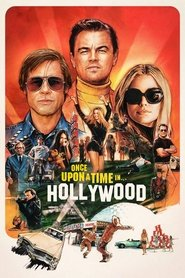 | Yes | 2019-07-24 | Heyday Films | Unknown | Unknown | Unknown | [source](FEL.txt (curated Profile 7 FEL list)) | [TMDB](https://www.themoviedb.org/movie/466272) |
| Weathering with You |  | Yes | 2019-07-19 | CoMix Wave Films | Unknown | Unknown | enhancement_bitrate_mbps: 7.13 | [source](https://forum.blu-ray.com/showthread.php?t=276448) | [TMDB](https://www.themoviedb.org/movie/568160) |
| Crawl |  | Yes | 2019-07-10 | Raimi Productions | Unknown | Unknown | Unknown | [source](https://github.com/iammarxg/FEL) | [TMDB](https://www.themoviedb.org/movie/511987) |
| Midsommar |  | Yes | 2019-07-03 | B-Reel Films | Unknown | Unknown | enhancement_bitrate_mbps: 6.59 | [source](https://forum.blu-ray.com/showthread.php?t=276448) | [TMDB](https://www.themoviedb.org/movie/530385) |
| Anna |  | Yes | 2019-06-19 | EuropaCorp | Unknown | Unknown | enhancement_bitrate_mbps: 8.02 | [source](https://forum.blu-ray.com/showthread.php?t=276448) | [TMDB](https://www.themoviedb.org/movie/484641) |
| Child's Play |  | Yes | 2019-06-19 | KatzSmith Productions | Unknown | Unknown | Unknown | [source](https://forum.blu-ray.com/showthread.php?t=327042&page=55) | [TMDB](https://www.themoviedb.org/movie/533642) |
| The Last Black Man in San Francisco |  | Yes | 2019-06-07 | Longshot | Unknown | Unknown | Unknown | [source](https://github.com/iammarxg/FEL) | [TMDB](https://www.themoviedb.org/movie/522039) |
| Parasite |  | Yes | 2019-05-30 | Barunson E&A | Unknown | Unknown | enhancement_bitrate_mbps: 6.26 | [source](https://forum.blu-ray.com/showthread.php?t=276448) | [TMDB](https://www.themoviedb.org/movie/496243) |
| The Secret Life of Pets 2 |  | Yes | 2019-05-24 | Universal Pictures | Unknown | Unknown | enhancement_bitrate_mbps: 7.47 | [source](https://forum.blu-ray.com/showthread.php?t=276448) | [TMDB](https://www.themoviedb.org/movie/412117) |
| Rocketman |  | Yes | 2019-05-17 | Paramount Pictures | Unknown | Unknown | enhancement_bitrate_mbps: 7.67 | [source](https://forum.blu-ray.com/showthread.php?t=276448) | [TMDB](https://www.themoviedb.org/movie/504608) |
| John Wick: Chapter 3 - Parabellum |  | Yes | 2019-05-15 | Thunder Road | Unknown | Unknown | enhancement_bitrate_mbps: 7.63 | [source](https://forum.blu-ray.com/showthread.php?t=276448) | [TMDB](https://www.themoviedb.org/movie/458156) |
| Brightburn |  | Yes | 2019-05-09 | Troll Court Entertainment | Unknown | Unknown | Unknown | [source](FEL.txt (curated Profile 7 FEL list)) | [TMDB](https://www.themoviedb.org/movie/531309) |
| Pokémon Detective Pikachu |  | Yes | 2019-05-03 | Legendary Pictures | Unknown | Unknown | Unknown | [source](https://forum.blu-ray.com/showthread.php?t=276448&page=119) | [TMDB](https://www.themoviedb.org/movie/447404) |
| Hellboy |  | Yes | 2019-04-10 | Campbell Grobman Films | Unknown | Unknown | enhancement_bitrate_mbps: 7.65 | [source](https://forum.blu-ray.com/showthread.php?t=276448) | [TMDB](https://www.themoviedb.org/movie/456740) |
| Pet Sematary |  | Yes | 2019-04-04 | di Bonaventura Pictures | Unknown | Unknown | enhancement_bitrate_mbps: 6.75 | [source](https://forum.blu-ray.com/showthread.php?t=276448) | [TMDB](https://www.themoviedb.org/movie/157433) |
| Us |  | Yes | 2019-03-14 | Monkeypaw Productions | Unknown | Unknown | enhancement_bitrate_mbps: 10.79 | [source](https://forum.blu-ray.com/showthread.php?t=276448) | [TMDB](https://www.themoviedb.org/movie/458723) |
| Cold Pursuit | 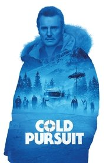 | Yes | 2019-02-07 | StudioCanal | Unknown | Unknown | enhancement_bitrate_mbps: 7.70 | [source](https://forum.blu-ray.com/showthread.php?t=276448) | [TMDB](https://www.themoviedb.org/movie/438650) |
| The Wandering Earth |  | Yes | 2019-02-05 | Beijing Jingxi Culture | Unknown | Unknown | Unknown | [source](https://old.reddit.com/r/CoreELEC/comments/1jamlw6/list_of_dolby_vision_p7fel_films/) | [TMDB](https://www.themoviedb.org/movie/535167) |
| Glass |  | Yes | 2019-01-16 | Blinding Edge Pictures | Unknown | Unknown | Unknown | [source](https://forum.blu-ray.com/showthread.php?t=276448&page=113) | [TMDB](https://www.themoviedb.org/movie/450465) |
| Paddington 2 |  | Yes | 2018 | Unknown | Unknown | Unknown | enhancement_bitrate_mbps: 8.13 | [source](https://forum.blu-ray.com/showthread.php?t=276448) |  |
| FEL 12.031 Mbps Higher Power |  | Yes | 2018 | Unknown | Unknown | Unknown | Unknown | [source](FEL.txt (curated Profile 7 FEL list)) |  |
| Mary Queen of Scots |  | Yes | 2018-12-07 | Focus Features | Unknown | Unknown | enhancement_bitrate_mbps: 8.32 | [source](https://forum.blu-ray.com/showthread.php?t=276448) | [TMDB](https://www.themoviedb.org/movie/457136) |
| Spider-Man: Into the Spider-Verse |  | Yes | 2018-12-06 | Columbia Pictures | Unknown | Unknown | Unknown | [source](FEL.txt (curated Profile 7 FEL list)) | [TMDB](https://www.themoviedb.org/movie/324857) |
| Mortal Engines |  | Yes | 2018-11-27 | Scholastic Productions | Unknown | Unknown | enhancement_bitrate_mbps: 7.92 | [source](https://forum.blu-ray.com/showthread.php?t=276448) | [TMDB](https://www.themoviedb.org/movie/428078) |
| Bumblebee |  | Yes | 2018-11-22 | Paramount Pictures | Unknown | Unknown | enhancement_bitrate_mbps: 5.58 | [source](https://forum.blu-ray.com/showthread.php?t=276448) | [TMDB](https://www.themoviedb.org/movie/424783) |
| Fantastic Beasts: The Crimes of Grindelwald |  | Yes | 2018-11-14 | Warner Bros. Pictures | Unknown | Unknown | Unknown | [source](FEL.txt (curated Profile 7 FEL list)) | [TMDB](https://www.themoviedb.org/movie/338952) |
| Dr. Seuss' The Grinch |  | Yes | 2018-11-08 | Illumination | Unknown | Unknown | enhancement_bitrate_mbps: 7.57 | [source](https://forum.blu-ray.com/showthread.php?t=276448) | [TMDB](https://www.themoviedb.org/movie/360920) |
| The Grinch |  | Yes | 2018-11-08 | Illumination | Unknown | Unknown | Unknown | [source](https://forum.blu-ray.com/showthread.php?t=276448) | [TMDB](https://www.themoviedb.org/movie/360920) |
| Robin Hood |  | Yes | 2018-11-03 | Appian Way | Unknown | Unknown | enhancement_bitrate_mbps: 12.02 | [source](https://forum.blu-ray.com/showthread.php?t=276448) | [TMDB](https://www.themoviedb.org/movie/375588) |
| Overlord | 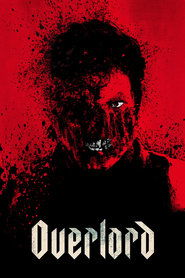 | Yes | 2018-11-01 | Bad Robot | Unknown | Unknown | enhancement_bitrate_mbps: 5.22 | [source](https://forum.blu-ray.com/showthread.php?t=276448) | [TMDB](https://www.themoviedb.org/movie/438799) |
| Hunter Killer |  | Yes | 2018-10-19 | Original Film | Unknown | Unknown | enhancement_bitrate_mbps: 7.70 | [source](https://forum.blu-ray.com/showthread.php?t=276448) | [TMDB](https://www.themoviedb.org/movie/399402) |
| First Man |  | Yes | 2018-10-10 | Universal Pictures | Unknown | Unknown | enhancement_bitrate_mbps: 6.61 | [source](https://forum.blu-ray.com/showthread.php?t=276448) | [TMDB](https://www.themoviedb.org/movie/369972) |
| Hell Fest |  | Yes | 2018-09-27 | Valhalla Motion Pictures | Unknown | Unknown | enhancement_bitrate_mbps: 7.63 | [source](https://forum.blu-ray.com/showthread.php?t=276448) | [TMDB](https://www.themoviedb.org/movie/429476) |
| A Simple Favor |  | Yes | 2018-09-13 | Feigco Entertainment | Unknown | Unknown | enhancement_bitrate_mbps: 8.03 | [source](https://forum.blu-ray.com/showthread.php?t=276448) | [TMDB](https://www.themoviedb.org/movie/484247) |
| Kin |  | Yes | 2018-08-29 | 21 Laps Entertainment | Unknown | Unknown | enhancement_bitrate_mbps: 7.66 | [source](https://forum.blu-ray.com/showthread.php?t=276448) | [TMDB](https://www.themoviedb.org/movie/425505) |
| Crazy Rich Asians |  | Yes | 2018-08-15 | SK Global Entertainment | Unknown | Unknown | Unknown | [source](FEL.txt (curated Profile 7 FEL list)) | [TMDB](https://www.themoviedb.org/movie/455207) |
| BlacKkKlansman |  | Yes | 2018-08-09 | Legendary Pictures | Unknown | Unknown | enhancement_bitrate_mbps: 7.34 | [source](https://forum.blu-ray.com/showthread.php?t=276448) | [TMDB](https://www.themoviedb.org/movie/487558) |
| The Spy Who Dumped Me |  | Yes | 2018-08-02 | Imagine Entertainment | Unknown | Unknown | enhancement_bitrate_mbps: 7.60 | [source](https://forum.blu-ray.com/showthread.php?t=276448) | [TMDB](https://www.themoviedb.org/movie/454992) |
| Mission: Impossible - Fallout |  | Yes | 2018-07-25 | Paramount Pictures | Unknown | Unknown | enhancement_bitrate_mbps: 6.99 | [source](https://forum.blu-ray.com/showthread.php?t=276448) | [TMDB](https://www.themoviedb.org/movie/353081) |
| Mamma Mia! Here We Go Again |  | Yes | 2018-07-18 | Littlestar | Unknown | Unknown | enhancement_bitrate_mbps: 5.06 | [source](https://forum.blu-ray.com/showthread.php?t=276448) | [TMDB](https://www.themoviedb.org/movie/458423) |
| Skyscraper |  | Yes | 2018-07-11 | Flynn Picture Company | Unknown | Unknown | enhancement_bitrate_mbps: 12.15 | [source](https://forum.blu-ray.com/showthread.php?t=276448) | [TMDB](https://www.themoviedb.org/movie/447200) |
| Sicario 2 (Sicario: Day of the Soldado) |  | Yes | 2018-06-27 | Thunder Road | Unknown | Unknown | enhancement_bitrate_mbps: 11.54 | [source](https://forum.blu-ray.com/showthread.php?t=276448) | [TMDB](https://www.themoviedb.org/movie/400535) |
| Uncle Drew |  | Yes | 2018-06-27 | Lionsgate | Unknown | Unknown | enhancement_bitrate_mbps: 8.09 | [source](https://forum.blu-ray.com/showthread.php?t=276448) | [TMDB](https://www.themoviedb.org/movie/474335) |
| Sicario: Day of the Soldado |  | Yes | 2018-06-27 | Thunder Road | Unknown | Unknown | Unknown | [source](https://forum.blu-ray.com/showthread.php?t=276448) | [TMDB](https://www.themoviedb.org/movie/400535) |
| Hereditary |  | Yes | 2018-06-07 | PalmStar Media | Unknown | Unknown | enhancement_bitrate_mbps: 7.15 | [source](https://forum.blu-ray.com/showthread.php?t=276448) | [TMDB](https://www.themoviedb.org/movie/493922) |
| Jurassic World: Fallen Kingdom |  | Yes | 2018-06-06 | Amblin Entertainment | Unknown | Unknown | enhancement_bitrate_mbps: 5.16 | [source](https://forum.blu-ray.com/showthread.php?t=276448) | [TMDB](https://www.themoviedb.org/movie/351286) |
| Upgrade |  | Yes | 2018-05-31 | Goalpost Pictures | Unknown | Unknown | Unknown | [source](https://github.com/iammarxg/FEL) | [TMDB](https://www.themoviedb.org/movie/500664) |
| Solo: A Star Wars Story |  | Yes | 2018-05-15 | Lucasfilm Ltd. | Unknown | Unknown | Unknown | [source](FEL.txt (curated Profile 7 FEL list)) | [TMDB](https://www.themoviedb.org/movie/348350) |
| Higher Power |  | Yes | 2018-05-11 | Break Media | Unknown | Unknown | enhancement_bitrate_mbps: 7.45 | [source](https://forum.blu-ray.com/showthread.php?t=276448) | [TMDB](https://www.themoviedb.org/movie/513324) |
| A Quiet Place |  | Yes | 2018-04-03 | Paramount Pictures | Unknown | Unknown | enhancement_bitrate_mbps: 7.64 | [source](https://forum.blu-ray.com/showthread.php?t=276448) | [TMDB](https://www.themoviedb.org/movie/447332) |
| Isle of Dogs |  | Yes | 2018-03-23 | Studio Babelsberg | Unknown | Unknown | Unknown | [source](https://forum.blu-ray.com/showthread.php?t=354888&page=11) | [TMDB](https://www.themoviedb.org/movie/399174) |
| Pacific Rim: Uprising |  | Yes | 2018-03-21 | Legendary Pictures | Unknown | Unknown | enhancement_bitrate_mbps: 7.80 | [source](https://forum.blu-ray.com/showthread.php?t=276448) | [TMDB](https://www.themoviedb.org/movie/268896) |
| A Wrinkle in Time |  | Yes | 2018-03-08 | Whitaker Entertainment | Unknown | Unknown | Unknown | [source](FEL.txt (curated Profile 7 FEL list)) | [TMDB](https://www.themoviedb.org/movie/407451) |
| Death Wish |  | Yes | 2018-03-01 | Metro-Goldwyn-Mayer | Unknown | Unknown | enhancement_bitrate_mbps: 13.47 | [source](https://forum.blu-ray.com/showthread.php?t=276448) | [TMDB](https://www.themoviedb.org/movie/395990) |
| Annihilation |  | Yes | 2018-02-22 | Paramount Pictures | Unknown | Unknown | enhancement_bitrate_mbps: 5.07 | [source](https://forum.blu-ray.com/showthread.php?t=276448) | [TMDB](https://www.themoviedb.org/movie/300668) |
| Black Panther |  | Yes | 2018-02-13 | Marvel Studios | Unknown | Unknown | enhancement_bitrate_mbps: 3.41 | [source](https://forum.blu-ray.com/showthread.php?t=276448) | [TMDB](https://www.themoviedb.org/movie/284054) |
| Early Man |  | Yes | 2018-01-26 | StudioCanal | Unknown | Unknown | enhancement_bitrate_mbps: 7.07 | [source](https://forum.blu-ray.com/showthread.php?t=276448) | [TMDB](https://www.themoviedb.org/movie/387592) |
| Den of Thieves |  | Yes | 2018-01-18 | Atmosphere Entertainment MM | Unknown | Unknown | Unknown | [source](https://github.com/iammarxg/FEL) | [TMDB](https://www.themoviedb.org/movie/449443) |
| Daddys Home.2 |  | Yes | 2017 | Unknown | Unknown | Unknown | Unknown | [source](https://docs.google.com/spreadsheets/d/15i0a84uiBtWiHZ5CXZZ7wygLFXwYOd84/edit?gid=828864432#gid=828864432) |  |
| Downsizing |  | Yes | 2017-12-22 | Ad Hominem Enterprises | Unknown | Unknown | enhancement_bitrate_mbps: 7.84 | [source](https://forum.blu-ray.com/showthread.php?t=276448) | [TMDB](https://www.themoviedb.org/movie/301337) |
| Jumanji: Welcome to the Jungle |  | Yes | 2017-12-09 | Matt Tolmach Productions | Unknown | Unknown | Unknown | [source](https://forum.blu-ray.com/showthread.php?t=276448&page=115) | [TMDB](https://www.themoviedb.org/movie/353486) |
| Wonder |  | Yes | 2017-11-13 | Lionsgate | Unknown | Unknown | enhancement_bitrate_mbps: 7.72 | [source](https://forum.blu-ray.com/showthread.php?t=276448) | [TMDB](https://www.themoviedb.org/movie/406997) |
| Daddy's Home 2 |  | Yes | 2017-11-09 | Red Granite Pictures | Unknown | Unknown | enhancement_bitrate_mbps: 6.05 | [source](https://forum.blu-ray.com/showthread.php?t=276448) | [TMDB](https://www.themoviedb.org/movie/419680) |
| Paddington 2 |  | Yes | 2017-11-09 | StudioCanal | Unknown | Unknown | enhancement_bitrate_mbps: 8.13 | [source](https://docs.google.com/spreadsheets/d/15i0a84uiBtWiHZ5CXZZ7wygLFXwYOd84/edit?gid=828864432#gid=828864432) | [TMDB](https://www.themoviedb.org/movie/346648) |
| Jigsaw |  | Yes | 2017-10-25 | Twisted Pictures | Unknown | Unknown | enhancement_bitrate_mbps: 12.33 | [source](https://forum.blu-ray.com/showthread.php?t=276448) | [TMDB](https://www.themoviedb.org/movie/298250) |
| Cult of Chucky |  | Yes | 2017-10-12 | Universal 1440 Entertainment | Unknown | Unknown | Unknown | [source](FEL.txt (curated Profile 7 FEL list)) | [TMDB](https://www.themoviedb.org/movie/393345) |
| Hans Zimmer: Live in Prague |  | Yes | 2017-10-01 | Eagle Rock Film Productions | Unknown | Unknown | Unknown | [source](https://old.reddit.com/r/CoreELEC/comments/1jamlw6/list_of_dolby_vision_p7fel_films/) | [TMDB](https://www.themoviedb.org/movie/435011) |
| Only the Brave (No Way Out) |  | Yes | 2017-09-22 | di Bonaventura Pictures | Unknown | Unknown | enhancement_bitrate_mbps: 10.04 | [source](https://forum.blu-ray.com/showthread.php?t=276448) | [TMDB](https://www.themoviedb.org/movie/395991) |
| Only the Brave |  | Yes | 2017-09-22 | di Bonaventura Pictures | Unknown | Unknown | Unknown | [source](https://forum.blu-ray.com/showthread.php?t=276448) | [TMDB](https://www.themoviedb.org/movie/395991) |
| mother! |  | Yes | 2017-09-13 | Paramount Pictures | Unknown | Unknown | enhancement_bitrate_mbps: 5.82 | [source](https://forum.blu-ray.com/showthread.php?t=276448) | [TMDB](https://www.themoviedb.org/movie/381283) |
| The Hitman's Bodyguard |  | Yes | 2017-08-16 | Campbell Grobman Films | Unknown | Unknown | enhancement_bitrate_mbps: 7.69 | [source](https://forum.blu-ray.com/showthread.php?t=276448) | [TMDB](https://www.themoviedb.org/movie/390043) |
| Earth: One Amazing Day |  | Yes | 2017-08-04 | Earth Film Productions | Unknown | Unknown | enhancement_bitrate_mbps: 7.83 | [source](https://forum.blu-ray.com/showthread.php?t=276448) | [TMDB](https://www.themoviedb.org/movie/464593) |
| Wind River |  | Yes | 2017-08-03 | Savvy Media Holdings | Unknown | Unknown | Unknown | [source](https://docs.google.com/spreadsheets/d/15i0a84uiBtWiHZ5CXZZ7wygLFXwYOd84/edit?gid=828864432#gid=828864432) | [TMDB](https://www.themoviedb.org/movie/395834) |
| Atomic Blonde |  | Yes | 2017-07-26 | Focus Features | Unknown | Unknown | enhancement_bitrate_mbps: 8.02 | [source](https://forum.blu-ray.com/showthread.php?t=276448) | [TMDB](https://www.themoviedb.org/movie/341013) |
| Valerian and the City of a Thousand Planets |  | Yes | 2017-07-19 | Belga Films | Unknown | Unknown | enhancement_bitrate_mbps: 8.26 | [source](https://forum.blu-ray.com/showthread.php?t=276448) | [TMDB](https://www.themoviedb.org/movie/339964) |
| American Assassin |  | Yes | 2017-07-14 | TIK Films | Unknown | Unknown | enhancement_bitrate_mbps: 7.97 | [source](https://forum.blu-ray.com/showthread.php?t=276448) | [TMDB](https://www.themoviedb.org/movie/415842) |
| Spider-Man: Homecoming |  | Yes | 2017-07-05 | Marvel Studios | Unknown | Unknown | Unknown | [source](https://forum.blu-ray.com/showthread.php?t=276448&page=56) | [TMDB](https://www.themoviedb.org/movie/315635) |
| Okja |  | Yes | 2017-06-28 | Kate Street Picture Company | Unknown | Unknown | Unknown | [source](https://docs.google.com/spreadsheets/d/15i0a84uiBtWiHZ5CXZZ7wygLFXwYOd84/edit?gid=828864432#gid=828864432) | [TMDB](https://www.themoviedb.org/movie/387426) |
| Transformers: The Last Knight |  | Yes | 2017-06-16 | Paramount Pictures | Unknown | Unknown | enhancement_bitrate_mbps: 6.96 | [source](https://forum.blu-ray.com/showthread.php?t=276448) | [TMDB](https://www.themoviedb.org/movie/335988) |
| Despicable Me 3 |  | Yes | 2017-06-15 | Illumination | Unknown | Unknown | enhancement_bitrate_mbps: 6.09 | [source](https://forum.blu-ray.com/showthread.php?t=276448) | [TMDB](https://www.themoviedb.org/movie/324852) |
| Wonder Woman |  | Yes | 2017-05-30 | Atlas Entertainment | Unknown | Unknown | Unknown | [source](https://forum.blu-ray.com/showthread.php?t=276448) | [TMDB](https://www.themoviedb.org/movie/297762) |
| Baywatch |  | Yes | 2017-05-25 | Uncharted | Unknown | Unknown | Unknown | [source](https://forum.blu-ray.com/showthread.php?t=276448&page=11) | [TMDB](https://www.themoviedb.org/movie/339846) |
| The Fate of the Furious |  | Yes | 2017-04-12 | Original Film | Unknown | Unknown | enhancement_bitrate_mbps: 5.63 | [source](https://forum.blu-ray.com/showthread.php?t=276448) | [TMDB](https://www.themoviedb.org/movie/337339) |
| Power Rangers |  | Yes | 2017-03-23 | Lionsgate | Unknown | Unknown | enhancement_bitrate_mbps: 7.84 | [source](https://forum.blu-ray.com/showthread.php?t=276448) | [TMDB](https://www.themoviedb.org/movie/305470) |
| Life |  | Yes | 2017-03-22 | Columbia Pictures | Unknown | Unknown | Unknown | [source](FEL.txt (curated Profile 7 FEL list)) | [TMDB](https://www.themoviedb.org/movie/395992) |
| The Lost City of Z |  | Yes | 2017-03-15 | Northern Ireland Screen | Unknown | Unknown | Unknown | [source](https://github.com/iammarxg/FEL) | [TMDB](https://www.themoviedb.org/movie/314095) |
| Kong: Skull Island |  | Yes | 2017-03-08 | Legendary Pictures | Unknown | Unknown | Unknown | [source](https://forum.blu-ray.com/showthread.php?t=276448&page=85) | [TMDB](https://www.themoviedb.org/movie/293167) |
| John Wick: Chapter 2 |  | Yes | 2017-02-08 | Thunder Road | Unknown | Unknown | Unknown | [source](https://web.archive.org/web/20250308162437/https://discourse.coreelec.org/t/list-of-dolby-vision-p7-fel-films/52523) | [TMDB](https://www.themoviedb.org/movie/324552) |
| Rings |  | Yes | 2017-02-01 | Paramount Pictures | Unknown | Unknown | Unknown | [source](https://forum.blu-ray.com/showthread.php?t=276448) | [TMDB](https://www.themoviedb.org/movie/14564) |
| Passengers |  | Yes | 2016-12-21 | Columbia Pictures | Unknown | Unknown | Unknown | [source](FEL.txt (curated Profile 7 FEL list)) | [TMDB](https://www.themoviedb.org/movie/274870) |
| Rogue One: A Star Wars Story |  | Yes | 2016-12-14 | Lucasfilm Ltd. | Unknown | Unknown | Unknown | [source](FEL.txt (curated Profile 7 FEL list)) | [TMDB](https://www.themoviedb.org/movie/330459) |
| La La Land |  | Yes | 2016-12-01 | Summit Entertainment | Unknown | Unknown | Unknown | [source](https://docs.google.com/spreadsheets/d/15i0a84uiBtWiHZ5CXZZ7wygLFXwYOd84/edit?gid=828864432#gid=828864432) | [TMDB](https://www.themoviedb.org/movie/313369) |
| Office Christmas Party |  | Yes | 2016-11-25 | Bluegrass Films | Unknown | Unknown | Unknown | [source](https://docs.google.com/spreadsheets/d/15i0a84uiBtWiHZ5CXZZ7wygLFXwYOd84/edit?gid=828864432#gid=828864432) | [TMDB](https://www.themoviedb.org/movie/384682) |
| Arrival |  | Yes | 2016-11-10 | FilmNation Entertainment | Unknown | Unknown | Unknown | [source](https://forum.blu-ray.com/showthread.php?t=276448&page=31) | [TMDB](https://www.themoviedb.org/movie/329865) |
| Jack Reacher: Never Go Back |  | Yes | 2016-10-19 | Skydance Media | Unknown | Unknown | Unknown | [source](FEL.txt (curated Profile 7 FEL list)) | [TMDB](https://www.themoviedb.org/movie/343611) |
| Inferno |  | Yes | 2016-10-13 | Columbia Pictures | Unknown | Unknown | Unknown | [source](FEL.txt (curated Profile 7 FEL list)) | [TMDB](https://www.themoviedb.org/movie/207932) |
| Moana |  | Yes | 2016-10-13 | Walt Disney Animation Studios | Unknown | Unknown | Unknown | [source](https://forum.blu-ray.com/showthread.php?t=327042&page=15) | [TMDB](https://www.themoviedb.org/movie/277834) |
| Deepwater Horizon |  | Yes | 2016-09-28 | Summit Entertainment | Unknown | Unknown | Unknown | [source](https://docs.google.com/spreadsheets/d/15i0a84uiBtWiHZ5CXZZ7wygLFXwYOd84/edit?gid=828864432#gid=828864432) | [TMDB](https://www.themoviedb.org/movie/296524) |
| The Stranger |  | Yes | 2016-09-23 | Carroña Films | Unknown | Unknown | Unknown | [source](https://github.com/iammarxg/FEL) | [TMDB](https://www.themoviedb.org/movie/1413713) |
| Snowden |  | Yes | 2016-09-15 | KrautPack Entertainment | Unknown | Unknown | Unknown | [source](https://old.reddit.com/r/CoreELEC/comments/1jamlw6/list_of_dolby_vision_p7fel_films/) | [TMDB](https://www.themoviedb.org/movie/302401) |
| Mechanic: Resurrection |  | Yes | 2016-08-25 | Davis Films | Unknown | Unknown | Unknown | [source](https://web.archive.org/web/20250308162437/https://discourse.coreelec.org/t/list-of-dolby-vision-p7-fel-films/52523) | [TMDB](https://www.themoviedb.org/movie/278924) |
| Kubo and the Two Strings |  | Yes | 2016-08-18 | LAIKA | Unknown | Unknown | Unknown | [source](https://github.com/iammarxg/FEL) | [TMDB](https://www.themoviedb.org/movie/313297) |
| Hell or High Water |  | Yes | 2016-08-11 | Sidney Kimmel Entertainment | Unknown | Unknown | enhancement_bitrate_mbps: 7.72 | [source](https://forum.blu-ray.com/showthread.php?t=276448) | [TMDB](https://www.themoviedb.org/movie/338766) |
| Jason Bourne |  | Yes | 2016-07-27 | The Kennedy/Marshall Company | Unknown | Unknown | Unknown | [source](FEL.txt (curated Profile 7 FEL list)) | [TMDB](https://www.themoviedb.org/movie/324668) |
| Train to Busan |  | Yes | 2016-07-20 | Next Entertainment World | Unknown | Unknown | Unknown | [source](https://github.com/iammarxg/FEL) | [TMDB](https://www.themoviedb.org/movie/396535) |
| Sausage Party |  | Yes | 2016-07-11 | Columbia Pictures | Unknown | Unknown | Unknown | [source](FEL.txt (curated Profile 7 FEL list)) | [TMDB](https://www.themoviedb.org/movie/223702) |
| Kingsglaive: Final Fantasy XV |  | Yes | 2016-07-09 | Visual Works | Unknown | Unknown | Unknown | [source](https://old.reddit.com/r/CoreELEC/comments/1jamlw6/list_of_dolby_vision_p7fel_films/) | [TMDB](https://www.themoviedb.org/movie/390734) |
| Central Intelligence |  | Yes | 2016-06-15 | New Line Cinema | Unknown | Unknown | Unknown | [source](FEL.txt (curated Profile 7 FEL list)) | [TMDB](https://www.themoviedb.org/movie/302699) |
| The Wailing |  | Yes | 2016-05-12 | Fox International Productions | Unknown | Unknown | Unknown | [source](https://github.com/iammarxg/FEL) | [TMDB](https://www.themoviedb.org/movie/293670) |
| The Angry Birds Movie |  | Yes | 2016-05-11 | Columbia Pictures | Unknown | Unknown | Unknown | [source](FEL.txt (curated Profile 7 FEL list)) | [TMDB](https://www.themoviedb.org/movie/153518) |
| Captain America: Civil War |  | Yes | 2016-04-27 | Marvel Studios | Unknown | Unknown | Unknown | [source](FEL.txt (curated Profile 7 FEL list)) | [TMDB](https://www.themoviedb.org/movie/271110) |
| Green Room |  | Yes | 2016-04-15 | filmscience | Unknown | Unknown | Unknown | [source](https://github.com/iammarxg/FEL) | [TMDB](https://www.themoviedb.org/movie/313922) |
| 10 Cloverfield Lane |  | Yes | 2016-03-10 | Bad Robot | Unknown | Unknown | enhancement_bitrate_mbps: 5.86 | [source](https://forum.blu-ray.com/showthread.php?t=276448) | [TMDB](https://www.themoviedb.org/movie/333371) |
| Allegiant |  | Yes | 2016-03-09 | Mandeville Films | Unknown | Unknown | Unknown | [source](https://docs.google.com/spreadsheets/d/15i0a84uiBtWiHZ5CXZZ7wygLFXwYOd84/edit?gid=828864432#gid=828864432) | [TMDB](https://www.themoviedb.org/movie/262504) |
| London Has Fallen |  | Yes | 2016-03-02 | Millennium Media | Unknown | Unknown | enhancement_bitrate_mbps: 14.04 | [source](https://forum.blu-ray.com/showthread.php?t=276448) | [TMDB](https://www.themoviedb.org/movie/267860) |
| Risen |  | Yes | 2016-02-18 | Patrick Aiello Productions | Unknown | Unknown | Unknown | [source](FEL.txt (curated Profile 7 FEL list)) | [TMDB](https://www.themoviedb.org/movie/335778) |
| Hail, Caesar! |  | Yes | 2016-02-05 | Working Title Films | Unknown | Unknown | Unknown | [source](https://old.reddit.com/r/CoreELEC/comments/1jamlw6/list_of_dolby_vision_p7fel_films/) | [TMDB](https://www.themoviedb.org/movie/270487) |
| Kung Fu Panda 3 |  | Yes | 2016-01-23 | DreamWorks Animation | Unknown | Unknown | Unknown | [source](https://old.reddit.com/r/CoreELEC/comments/1jamlw6/list_of_dolby_vision_p7fel_films/) | [TMDB](https://www.themoviedb.org/movie/140300) |
| The Boy |  | Yes | 2016-01-22 | Lakeshore Entertainment | Unknown | Unknown | Unknown | [source](https://forum.blu-ray.com/showthread.php?p=22886667) | [TMDB](https://www.themoviedb.org/movie/321258) |
| Dirty Grandpa |  | Yes | 2016-01-20 | Covert Media | Unknown | Unknown | enhancement_bitrate_mbps: 7.82 | [source](https://forum.blu-ray.com/showthread.php?t=276448) | [TMDB](https://www.themoviedb.org/movie/291870) |
| 13 Hours: The Secret Soldiers of Benghazi |  | Yes | 2016-01-14 | Paramount Pictures | Unknown | Unknown | enhancement_bitrate_mbps: 7.31 | [source](https://forum.blu-ray.com/showthread.php?t=276448) | [TMDB](https://www.themoviedb.org/movie/300671) |
| Daddys Home |  | Yes | 2015 | Unknown | Unknown | Unknown | Unknown | [source](https://docs.google.com/spreadsheets/d/15i0a84uiBtWiHZ5CXZZ7wygLFXwYOd84/edit?gid=828864432#gid=828864432) |  |
| Point Break |  | Yes | 2015 | Unknown | Unknown | Unknown | Unknown | [source](https://docs.google.com/spreadsheets/d/15i0a84uiBtWiHZ5CXZZ7wygLFXwYOd84/edit?gid=828864432#gid=828864432) |  |
| The VVitch |  | Yes | 2015 | Unknown | Unknown | Unknown | Unknown | [source](https://github.com/iammarxg/FEL) |  |
| Daddy's Home |  | Yes | 2015-12-25 | Paramount Pictures | Unknown | Unknown | enhancement_bitrate_mbps: 7.34 | [source](https://forum.blu-ray.com/showthread.php?t=276448) | [TMDB](https://www.themoviedb.org/movie/274167) |
| Ip Man 3 |  | Yes | 2015-12-24 | Dreams Salon Entertainment Culture | Unknown | Unknown | Unknown | [source](https://github.com/iammarxg/FEL) | [TMDB](https://www.themoviedb.org/movie/365222) |
| Krampus |  | Yes | 2015-11-26 | Universal Pictures | Unknown | Unknown | Unknown | [source](https://forum.blu-ray.com/showthread.php?t=276448&page=158) | [TMDB](https://www.themoviedb.org/movie/287903) |
| Creed |  | Yes | 2015-11-25 | Metro-Goldwyn-Mayer | Unknown | Unknown | Unknown | [source](https://forum.blu-ray.com/showthread.php?t=276448) | [TMDB](https://www.themoviedb.org/movie/312221) |
| The Hunger Games: Mockingjay - Part 2 |  | Yes | 2015-11-18 | Lionsgate | Unknown | Unknown | Unknown | [source](https://docs.google.com/spreadsheets/d/15i0a84uiBtWiHZ5CXZZ7wygLFXwYOd84/edit?gid=828864432#gid=828864432) | [TMDB](https://www.themoviedb.org/movie/131634) |
| Spotlight |  | Yes | 2015-11-06 | Participant | Unknown | Unknown | Unknown | [source](https://old.reddit.com/r/CoreELEC/comments/1jamlw6/list_of_dolby_vision_p7fel_films/) | [TMDB](https://www.themoviedb.org/movie/314365) |
| The Last Witch Hunter |  | Yes | 2015-10-21 | NeoReel | Unknown | Unknown | Unknown | [source](https://docs.google.com/spreadsheets/d/15i0a84uiBtWiHZ5CXZZ7wygLFXwYOd84/edit?gid=828864432#gid=828864432) | [TMDB](https://www.themoviedb.org/movie/274854) |
| The Man from U.N.C.L.E. |  | Yes | 2015-08-13 | Wigram Productions | Unknown | Unknown | Unknown | [source](FEL.txt (curated Profile 7 FEL list)) | [TMDB](https://www.themoviedb.org/movie/203801) |
| Fantastic Four |  | Yes | 2015-08-05 | 20th Century Fox | Unknown | Unknown | Unknown | [source](https://forum.blu-ray.com/showthread.php?t=387630&page=13) | [TMDB](https://www.themoviedb.org/movie/166424) |
| Mission: Impossible - Rogue Nation |  | Yes | 2015-07-28 | Paramount Pictures | Unknown | Unknown | enhancement_bitrate_mbps: 4.84 | [source](https://forum.blu-ray.com/showthread.php?t=276448) | [TMDB](https://www.themoviedb.org/movie/177677) |
| Southpaw |  | Yes | 2015-07-22 | Fuqua Films | Unknown | Unknown | Unknown | [source](https://old.reddit.com/r/CoreELEC/comments/1jamlw6/list_of_dolby_vision_p7fel_films/) | [TMDB](https://www.themoviedb.org/movie/307081) |
| Ant-Man |  | Yes | 2015-07-14 | Marvel Studios | Unknown | Unknown | Unknown | [source](https://forum.blu-ray.com/showthread.php?t=276448&page=113) | [TMDB](https://www.themoviedb.org/movie/102899) |
| Knock Knock |  | Yes | 2015-06-26 | Sobras International Pictures | Unknown | Unknown | Unknown | [source](https://forum.blu-ray.com/showthread.php?t=276448&page=42) | [TMDB](https://www.themoviedb.org/movie/263472) |
| Terminator: Genisys |  | Yes | 2015-06-23 | Paramount Pictures | Unknown | Unknown | enhancement_bitrate_mbps: 5.66 | [source](https://forum.blu-ray.com/showthread.php?t=276448) | [TMDB](https://www.themoviedb.org/movie/87101) |
| The Witch |  | Yes | 2015-06-23 | Unknown | Unknown | Unknown | enhancement_bitrate_mbps: 7.51 | [source](https://forum.blu-ray.com/showthread.php?t=276448) | [TMDB](https://www.themoviedb.org/movie/526667) |
| Our Little Sister |  | Yes | 2015-06-13 | Shogakukan | Unknown | Unknown | Unknown | [source](https://old.reddit.com/r/CoreELEC/comments/1jamlw6/list_of_dolby_vision_p7fel_films/) | [TMDB](https://www.themoviedb.org/movie/315846) |
| Jurassic World |  | Yes | 2015-06-06 | Amblin Entertainment | Unknown | Unknown | Unknown | [source](https://forum.blu-ray.com/showpost.php?p=23223067) | [TMDB](https://www.themoviedb.org/movie/135397) |
| San Andreas |  | Yes | 2015-05-27 | New Line Cinema | Unknown | Unknown | Unknown | [source](FEL.txt (curated Profile 7 FEL list)) | [TMDB](https://www.themoviedb.org/movie/254128) |
| Mad Max: Fury Road |  | Yes | 2015-05-13 | Warner Bros. Pictures | Unknown | Unknown | Unknown | [source](https://forum.blu-ray.com/showthread.php?t=276448&page=169) | [TMDB](https://www.themoviedb.org/movie/76341) |
| Furious 7 |  | Yes | 2015-04-01 | Original Film | Unknown | Unknown | Unknown | [source](FEL.txt (curated Profile 7 FEL list)) | [TMDB](https://www.themoviedb.org/movie/168259) |
| Insurgent |  | Yes | 2015-03-18 | Summit Entertainment | Unknown | Unknown | Unknown | [source](https://docs.google.com/spreadsheets/d/15i0a84uiBtWiHZ5CXZZ7wygLFXwYOd84/edit?gid=828864432#gid=828864432) | [TMDB](https://www.themoviedb.org/movie/262500) |
| Cinderella |  | Yes | 2015-03-06 | Walt Disney Pictures | Unknown | Unknown | Unknown | [source](https://forum.blu-ray.com/showthread.php?t=327042&page=40) | [TMDB](https://www.themoviedb.org/movie/150689) |
| Divergente |  | Yes | 2014 | Unknown | Unknown | Unknown | Unknown | [source](https://docs.google.com/spreadsheets/d/15i0a84uiBtWiHZ5CXZZ7wygLFXwYOd84/edit?gid=828864432#gid=828864432) |  |
| Expendables.3 |  | Yes | 2014 | Unknown | Unknown | Unknown | Unknown | [source](https://docs.google.com/spreadsheets/d/15i0a84uiBtWiHZ5CXZZ7wygLFXwYOd84/edit?gid=828864432#gid=828864432) |  |
| Captain America WS |  | Yes | 2014 | Unknown | Unknown | Unknown | Unknown | [source](FEL.txt (curated Profile 7 FEL list)) |  |
| Paddington |  | Yes | 2014-11-24 | StudioCanal | Unknown | Unknown | Unknown | [source](https://docs.google.com/spreadsheets/d/1WiD-lECLFdOhCTW8_o9z92_-frsT-CSgo9xPuCcEpmQ/edit?usp=sharing) | [TMDB](https://www.themoviedb.org/movie/116149) |
| The Hunger Games: Mockingjay - Part 1 |  | Yes | 2014-11-19 | Lionsgate | Unknown | Unknown | Unknown | [source](https://docs.google.com/spreadsheets/d/15i0a84uiBtWiHZ5CXZZ7wygLFXwYOd84/edit?gid=828864432#gid=828864432) | [TMDB](https://www.themoviedb.org/movie/131631) |
| Ouija |  | Yes | 2014-10-24 | Platinum Dunes | Unknown | Unknown | Unknown | [source](https://old.reddit.com/r/CoreELEC/comments/1jamlw6/list_of_dolby_vision_p7fel_films/) | [TMDB](https://www.themoviedb.org/movie/242512) |
| Nightcrawler |  | Yes | 2014-10-23 | Sierra/Affinity | Unknown | Unknown | Unknown | [source](https://old.reddit.com/r/CoreELEC/comments/1jamlw6/list_of_dolby_vision_p7fel_films/) | [TMDB](https://www.themoviedb.org/movie/242582) |
| John Wick |  | Yes | 2014-10-16 | 87Eleven | Unknown | Unknown | Unknown | [source](https://docs.google.com/spreadsheets/d/15i0a84uiBtWiHZ5CXZZ7wygLFXwYOd84/edit?gid=828864432#gid=828864432) | [TMDB](https://www.themoviedb.org/movie/245891) |
| Fury |  | Yes | 2014-10-15 | Columbia Pictures | Unknown | Unknown | Unknown | [source](FEL.txt (curated Profile 7 FEL list)) | [TMDB](https://www.themoviedb.org/movie/228150) |
| The Boxtrolls |  | Yes | 2014-09-10 | LAIKA | Unknown | Unknown | Unknown | [source](https://old.reddit.com/r/CoreELEC/comments/1jamlw6/list_of_dolby_vision_p7fel_films/) | [TMDB](https://www.themoviedb.org/movie/170687) |
| Teenage Mutant Ninja Turtles |  | Yes | 2014-08-07 | Nickelodeon Movies | Unknown | Unknown | enhancement_bitrate_mbps: 6.53 | [source](https://forum.blu-ray.com/showthread.php?t=276448) | [TMDB](https://www.themoviedb.org/movie/98566) |
| The Expendables 3 |  | Yes | 2014-08-07 | Davis Films | Unknown | Unknown | Unknown | [source](https://github.com/iammarxg/FEL) | [TMDB](https://www.themoviedb.org/movie/138103) |
| Guardians of the Galaxy |  | Yes | 2014-07-30 | Marvel Studios | Unknown | Unknown | Unknown | [source](https://forum.blu-ray.com/showthread.php?t=276448&page=11) | [TMDB](https://www.themoviedb.org/movie/118340) |
| Lucy |  | Yes | 2014-07-25 | EuropaCorp | Unknown | Unknown | Unknown | [source](FEL.txt (curated Profile 7 FEL list)) | [TMDB](https://www.themoviedb.org/movie/240832) |
| Transformers: Age of Extinction |  | Yes | 2014-06-25 | di Bonaventura Pictures | Unknown | Unknown | enhancement_bitrate_mbps: 6.46 | [source](https://forum.blu-ray.com/showthread.php?t=276448) | [TMDB](https://www.themoviedb.org/movie/91314) |
| Divergent |  | Yes | 2014-03-14 | Summit Entertainment | Unknown | Unknown | Unknown | [source](https://docs.google.com/spreadsheets/d/1WiD-lECLFdOhCTW8_o9z92_-frsT-CSgo9xPuCcEpmQ/edit?usp=sharing) | [TMDB](https://www.themoviedb.org/movie/157350) |
| The Grand Budapest Hotel |  | Yes | 2014-02-26 | Fox Searchlight Pictures | Unknown | Unknown | Unknown | [source](https://old.reddit.com/r/CoreELEC/comments/1jamlw6/list_of_dolby_vision_p7fel_films/) | [TMDB](https://www.themoviedb.org/movie/120467) |
| Jack Ryan: Shadow Recruit |  | Yes | 2014-01-15 | di Bonaventura Pictures | Unknown | Unknown | enhancement_bitrate_mbps: 6.36 | [source](https://forum.blu-ray.com/showthread.php?t=276448) | [TMDB](https://www.themoviedb.org/movie/137094) |
| The Wolf of Wall Street |  | Yes | 2013-12-25 | Red Granite Pictures | Unknown | Unknown | Unknown | [source](https://web.archive.org/web/20250308162437/https://discourse.coreelec.org/t/list-of-dolby-vision-p7-fel-films/52523) | [TMDB](https://www.themoviedb.org/movie/106646) |
| Lone Survivor |  | Yes | 2013-12-24 | EFO Films | Unknown | Unknown | Unknown | [source](https://docs.google.com/spreadsheets/d/15i0a84uiBtWiHZ5CXZZ7wygLFXwYOd84/edit?gid=828864432#gid=828864432) | [TMDB](https://www.themoviedb.org/movie/193756) |
| The Hunger Games: Catching Fire |  | Yes | 2013-11-15 | Lionsgate | Unknown | Unknown | Unknown | [source](https://docs.google.com/spreadsheets/d/15i0a84uiBtWiHZ5CXZZ7wygLFXwYOd84/edit?gid=828864432#gid=828864432) | [TMDB](https://www.themoviedb.org/movie/101299) |
| Ender's Game |  | Yes | 2013-10-24 | Digital Domain | Unknown | Unknown | Unknown | [source](https://forum.blu-ray.com/showthread.php?t=276448&page=55) | [TMDB](https://www.themoviedb.org/movie/80274) |
| Captain Phillips |  | Yes | 2013-10-10 | Columbia Pictures | Unknown | Unknown | Unknown | [source](FEL.txt (curated Profile 7 FEL list)) | [TMDB](https://www.themoviedb.org/movie/109424) |
| Escape Plan | 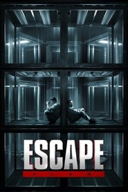 | Yes | 2013-10-09 | Knightsbridge Entertainment | Unknown | Unknown | enhancement_bitrate_mbps: 7.89 | [source](https://forum.blu-ray.com/showthread.php?t=276448) | [TMDB](https://www.themoviedb.org/movie/107846) |
| Blue Is the Warmest Color |  | Yes | 2013-10-09 | Wild Bunch | Unknown | Unknown | Unknown | [source](https://letterboxd.com/mikimajk/list/list-of-dolby-vision-p7-fel-films/) | [TMDB](https://www.themoviedb.org/movie/152584) |
| Curse of Chucky |  | Yes | 2013-10-08 | Universal 1440 Entertainment | Unknown | Unknown | Unknown | [source](FEL.txt (curated Profile 7 FEL list)) | [TMDB](https://www.themoviedb.org/movie/167032) |
| Riddick |  | Yes | 2013-09-02 | One Race | Unknown | Unknown | Unknown | [source](https://github.com/iammarxg/FEL) | [TMDB](https://www.themoviedb.org/movie/87421) |
| Rush |  | Yes | 2013-09-02 | Revolution Films | Unknown | Unknown | Unknown | [source](https://old.reddit.com/r/CoreELEC/comments/1jamlw6/list_of_dolby_vision_p7fel_films/) | [TMDB](https://www.themoviedb.org/movie/96721) |
| You're Next |  | Yes | 2013-08-22 | Snoot Entertainment | Unknown | Unknown | Unknown | [source](FEL.txt (curated Profile 7 FEL list)) | [TMDB](https://www.themoviedb.org/movie/83899) |
| Elysium |  | Yes | 2013-08-07 | TriStar Pictures | Unknown | Unknown | Unknown | [source](https://forum.blu-ray.com/showthread.php?t=276448&page=40) | [TMDB](https://www.themoviedb.org/movie/68724) |
| 2 Guns | 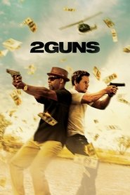 | Yes | 2013-08-02 | Universal Pictures | Unknown | Unknown | Unknown | [source](FEL.txt (curated Profile 7 FEL list)) | [TMDB](https://www.themoviedb.org/movie/136400) |
| Snowpiercer |  | Yes | 2013-08-01 | Opus Pictures | Unknown | Unknown | Unknown | [source](https://github.com/iammarxg/FEL) | [TMDB](https://www.themoviedb.org/movie/110415) |
| RED 2 |  | Yes | 2013-07-18 | di Bonaventura Pictures | Unknown | Unknown | enhancement_bitrate_mbps: 7.61 | [source](https://forum.blu-ray.com/showthread.php?t=276448) | [TMDB](https://www.themoviedb.org/movie/146216) |
| Despicable Me 2 |  | Yes | 2013-06-26 | Illumination | Unknown | Unknown | enhancement_bitrate_mbps: 3.07 | [source](https://forum.blu-ray.com/showthread.php?t=276448) | [TMDB](https://www.themoviedb.org/movie/93456) |
| World War Z |  | Yes | 2013-06-19 | GK Films | Unknown | Unknown | Unknown | [source](https://github.com/iammarxg/FEL) | [TMDB](https://www.themoviedb.org/movie/72190) |
| Man of Steel |  | Yes | 2013-06-12 | Syncopy | Unknown | Unknown | Unknown | [source](https://forum.blu-ray.com/showthread.php?t=387630&page=13) | [TMDB](https://www.themoviedb.org/movie/49521) |
| Now You See Me |  | Yes | 2013-05-29 | Summit Entertainment | Unknown | Unknown | Unknown | [source](https://docs.google.com/spreadsheets/d/15i0a84uiBtWiHZ5CXZZ7wygLFXwYOd84/edit?gid=828864432#gid=828864432) | [TMDB](https://www.themoviedb.org/movie/75656) |
| Iron Man 3 |  | Yes | 2013-04-18 | Marvel Studios | Unknown | Unknown | Unknown | [source](FEL.txt (curated Profile 7 FEL list)) | [TMDB](https://www.themoviedb.org/movie/68721) |
| G I Joe Retaliation |  | Yes | 2013-03-27 | Paramount Pictures | Unknown | Unknown | enhancement_bitrate_mbps: 5.99 | [source](https://forum.blu-ray.com/showthread.php?t=276448) | [TMDB](https://www.themoviedb.org/movie/72559) |
| Olympus Has Fallen |  | Yes | 2013-03-20 | Millennium Media | Unknown | Unknown | enhancement_bitrate_mbps: 12.04 | [source](https://forum.blu-ray.com/showthread.php?t=276448) | [TMDB](https://www.themoviedb.org/movie/117263) |
| The Place Beyond the Pines |  | Yes | 2013-03-20 | Sidney Kimmel Entertainment | Unknown | Unknown | Unknown | [source](https://old.reddit.com/r/CoreELEC/comments/1jamlw6/list_of_dolby_vision_p7fel_films/) | [TMDB](https://www.themoviedb.org/movie/97367) |
| Warm Bodies |  | Yes | 2013-01-31 | Summit Entertainment | Unknown | Unknown | enhancement_bitrate_mbps: 7.61 | [source](https://forum.blu-ray.com/showthread.php?t=276448) | [TMDB](https://www.themoviedb.org/movie/82654) |
| Hansel and Gretel Witch Hunters |  | Yes | 2013-01-17 | Paramount Pictures | Unknown | Unknown | enhancement_bitrate_mbps: 7.76 | [source](https://forum.blu-ray.com/showthread.php?t=276448) | [TMDB](https://www.themoviedb.org/movie/60304) |
| Mama |  | Yes | 2013-01-17 | Toma 78 | Unknown | Unknown | Unknown | [source](https://old.reddit.com/r/CoreELEC/comments/1jamlw6/list_of_dolby_vision_p7fel_films/) | [TMDB](https://www.themoviedb.org/movie/132232) |
| Jack Reacher |  | Yes | 2012-12-20 | Paramount Pictures | Unknown | Unknown | enhancement_bitrate_mbps: 5.06 | [source](https://forum.blu-ray.com/showthread.php?t=276448) | [TMDB](https://www.themoviedb.org/movie/75780) |
| Les Misérables |  | Yes | 2012-12-18 | Universal Pictures | Unknown | Unknown | Unknown | [source](FEL.txt (curated Profile 7 FEL list)) | [TMDB](https://www.themoviedb.org/movie/82695) |
| The Twilight Saga: Breaking Dawn - Part 2 |  | Yes | 2012-11-13 | Summit Entertainment | Unknown | Unknown | Unknown | [source](https://github.com/iammarxg/FEL) | [TMDB](https://www.themoviedb.org/movie/50620) |
| Cloud Atlas |  | Yes | 2012-10-26 | Cloud Atlas Productions | Unknown | Unknown | Unknown | [source](https://old.reddit.com/r/CoreELEC/comments/1jamlw6/list_of_dolby_vision_p7fel_films/) | [TMDB](https://www.themoviedb.org/movie/83542) |
| Looper |  | Yes | 2012-09-26 | Endgame Entertainment | Unknown | Unknown | Unknown | [source](https://forum.blu-ray.com/showthread.php?t=276448&page=163) | [TMDB](https://www.themoviedb.org/movie/59967) |
| End of Watch | 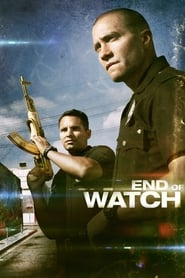 | Yes | 2012-09-20 | 5150 Action | Unknown | Unknown | Unknown | [source](https://old.reddit.com/r/CoreELEC/comments/1jamlw6/list_of_dolby_vision_p7fel_films/) | [TMDB](https://www.themoviedb.org/movie/77016) |
| Dredd |  | Yes | 2012-09-07 | Rena Film | Unknown | Unknown | enhancement_bitrate_mbps: 14.04 | [source](https://forum.blu-ray.com/showthread.php?t=276448) | [TMDB](https://www.themoviedb.org/movie/49049) |
| The Expendables 2 |  | Yes | 2012-08-08 | Millennium Media | Unknown | Unknown | Unknown | [source](https://old.reddit.com/r/CoreELEC/comments/1jamlw6/list_of_dolby_vision_p7fel_films/) | [TMDB](https://www.themoviedb.org/movie/76163) |
| ParaNorman | 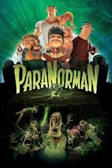 | Yes | 2012-08-03 | LAIKA | Unknown | Unknown | Unknown | [source](https://forum.blu-ray.com/showthread.php?t=276448&page=172) | [TMDB](https://www.themoviedb.org/movie/77174) |
| Savages |  | Yes | 2012-07-06 | Universal Pictures | Unknown | Unknown | Unknown | [source](https://old.reddit.com/r/CoreELEC/comments/1jamlw6/list_of_dolby_vision_p7fel_films/) | [TMDB](https://www.themoviedb.org/movie/82525) |
| Ted |  | Yes | 2012-06-29 | Universal Pictures | Unknown | Unknown | Unknown | [source](https://old.reddit.com/r/CoreELEC/comments/1jamlw6/list_of_dolby_vision_p7fel_films/) | [TMDB](https://www.themoviedb.org/movie/72105) |
| Magic Mike |  | Yes | 2012-06-28 | Iron Horse Entertainment | Unknown | Unknown | Unknown | [source](FEL.txt (curated Profile 7 FEL list)) | [TMDB](https://www.themoviedb.org/movie/77930) |
| Men in Black 3 |  | Yes | 2012-05-23 | Columbia Pictures | Unknown | Unknown | Unknown | [source](FEL.txt (curated Profile 7 FEL list)) | [TMDB](https://www.themoviedb.org/movie/41154) |
| Moonrise Kingdom |  | Yes | 2012-05-16 | Indian Paintbrush | Unknown | Unknown | Unknown | [source](https://forum.blu-ray.com/showthread.php?t=354888&page=31) | [TMDB](https://www.themoviedb.org/movie/83666) |
| The Cabin in the Woods |  | Yes | 2012-04-12 | Mutant Enemy Productions | Unknown | Unknown | enhancement_bitrate_mbps: 7.79 | [source](https://forum.blu-ray.com/showthread.php?t=276448) | [TMDB](https://www.themoviedb.org/movie/22970) |
| The Hunger Games |  | Yes | 2012-03-12 | Lionsgate | Unknown | Unknown | Unknown | [source](https://github.com/iammarxg/FEL) | [TMDB](https://www.themoviedb.org/movie/70160) |
| Man on a Ledge |  | Yes | 2012-01-13 | Summit Entertainment | Unknown | Unknown | enhancement_bitrate_mbps: 7.54 | [source](https://forum.blu-ray.com/showthread.php?t=276448) | [TMDB](https://www.themoviedb.org/movie/49527) |
| Game of Thrones: The Complete First Season |  | Yes | 2011 | Unknown | Unknown | Unknown | enhancement_bitrate_mbps: 3.48 | [source](https://forum.blu-ray.com/showthread.php?t=276448) |  |
| Harry Potter DH Part.2. |  | Yes | 2011 | Unknown | Unknown | Unknown | Unknown | [source](FEL.txt (curated Profile 7 FEL list)) |  |
| Sherlock Holmes.2.GOS |  | Yes | 2011 | Unknown | Unknown | Unknown | Unknown | [source](FEL.txt (curated Profile 7 FEL list)) |  |
| Mission: Impossible - Ghost Protocol |  | Yes | 2011-12-07 | Paramount Pictures | Unknown | Unknown | enhancement_bitrate_mbps: 4.86 | [source](https://forum.blu-ray.com/showthread.php?t=276448) | [TMDB](https://www.themoviedb.org/movie/56292) |
| The Twilight Saga: Breaking Dawn - Part 1 |  | Yes | 2011-11-16 | Summit Entertainment | Unknown | Unknown | Unknown | [source](https://github.com/iammarxg/FEL) | [TMDB](https://www.themoviedb.org/movie/50619) |
| Puss in Boots |  | Yes | 2011-10-27 | DreamWorks Animation | Unknown | Unknown | Unknown | [source](FEL.txt (curated Profile 7 FEL list)) | [TMDB](https://www.themoviedb.org/movie/417859) |
| Tinker Tailor Soldier Spy |  | Yes | 2011-09-16 | StudioCanal | Unknown | Unknown | Unknown | [source](https://forum.blu-ray.com/showthread.php?t=276448&page=158) | [TMDB](https://www.themoviedb.org/movie/49517) |
| Drive |  | Yes | 2011-09-15 | FilmDistrict | Unknown | Unknown | Unknown | [source](https://docs.google.com/spreadsheets/d/1WiD-lECLFdOhCTW8_o9z92_-frsT-CSgo9xPuCcEpmQ/edit?usp=sharing) | [TMDB](https://www.themoviedb.org/movie/64690) |
| Contagion |  | Yes | 2011-09-08 | Participant | Unknown | Unknown | Unknown | [source](FEL.txt (curated Profile 7 FEL list)) | [TMDB](https://www.themoviedb.org/movie/39538) |
| Transformers: Dark of the Moon |  | Yes | 2011-06-28 | Paramount Pictures | Unknown | Unknown | enhancement_bitrate_mbps: 6.86 | [source](https://forum.blu-ray.com/showthread.php?t=276448) | [TMDB](https://www.themoviedb.org/movie/38356) |
| Super 8 |  | Yes | 2011-06-09 | Paramount Pictures | Unknown | Unknown | Unknown | [source](https://forum.blu-ray.com/showthread.php?t=276448) | [TMDB](https://www.themoviedb.org/movie/37686) |
| Kung Fu Panda 2 |  | Yes | 2011-05-25 | DreamWorks Animation | Unknown | Unknown | Unknown | [source](https://old.reddit.com/r/CoreELEC/comments/1jamlw6/list_of_dolby_vision_p7fel_films/) | [TMDB](https://www.themoviedb.org/movie/49444) |
| Bridesmaids |  | Yes | 2011-05-13 | Apatow Productions | Unknown | Unknown | Unknown | [source](https://docs.google.com/spreadsheets/d/15i0a84uiBtWiHZ5CXZZ7wygLFXwYOd84/edit?gid=828864432#gid=828864432) | [TMDB](https://www.themoviedb.org/movie/55721) |
| Source Code |  | Yes | 2011-03-30 | The Mark Gordon Company | Unknown | Unknown | enhancement_bitrate_mbps: 7.67 | [source](https://forum.blu-ray.com/showthread.php?t=276448) | [TMDB](https://www.themoviedb.org/movie/45612) |
| Rango |  | Yes | 2011-03-02 | Paramount Pictures | Unknown | Unknown | Unknown | [source](https://github.com/iammarxg/FEL) | [TMDB](https://www.themoviedb.org/movie/44896) |
| Paul |  | Yes | 2011-02-14 | Relativity Media | Unknown | Unknown | Unknown | [source](https://old.reddit.com/r/CoreELEC/comments/1jamlw6/list_of_dolby_vision_p7fel_films/) | [TMDB](https://www.themoviedb.org/movie/39513) |
| Sanctum |  | Yes | 2011-02-03 | Universal Pictures | Unknown | Unknown | Unknown | [source](https://github.com/iammarxg/FEL) | [TMDB](https://www.themoviedb.org/movie/48340) |
| Documenting the Grey Man |  | Yes | 2011-01-31 | Unknown | Unknown | Unknown | Unknown | [source](https://old.reddit.com/r/CoreELEC/comments/1jamlw6/list_of_dolby_vision_p7fel_films/) | [TMDB](https://www.themoviedb.org/movie/120881) |
| Harry Potter DH Part.1. |  | Yes | 2010 | Unknown | Unknown | Unknown | Unknown | [source](FEL.txt (curated Profile 7 FEL list)) |  |
| TRON: Legacy |  | Yes | 2010-12-14 | Walt Disney Pictures | Unknown | Unknown | Unknown | [source](https://forum.blu-ray.com/showthread.php?t=354888&page=18) | [TMDB](https://www.themoviedb.org/movie/20526) |
| Skyline | 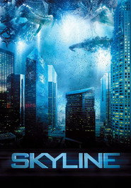 | Yes | 2010-11-11 | RAT Entertainment | Unknown | Unknown | Unknown | [source](https://forum.blu-ray.com/showthread.php?t=327042&page=64) | [TMDB](https://www.themoviedb.org/movie/42684) |
| RED |  | Yes | 2010-10-13 | di Bonaventura Pictures | Unknown | Unknown | enhancement_bitrate_mbps: 7.58 | [source](https://forum.blu-ray.com/showthread.php?t=276448) | [TMDB](https://www.themoviedb.org/movie/39514) |
| Devil | 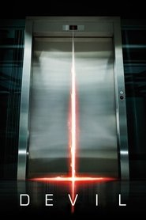 | Yes | 2010-09-16 | Universal Pictures | Unknown | Unknown | Unknown | [source](https://forum.blu-ray.com/showthread.php?t=276448) | [TMDB](https://www.themoviedb.org/movie/44040) |
| Scott Pilgrim vs. the World |  | Yes | 2010-08-12 | Marc Platt Productions | Unknown | Unknown | Unknown | [source](https://forum.blu-ray.com/showthread.php?t=276448&page=152) | [TMDB](https://www.themoviedb.org/movie/22538) |
| The Expendables |  | Yes | 2010-08-07 | Nimar Studios | Unknown | Unknown | Unknown | [source](https://github.com/iammarxg/FEL) | [TMDB](https://www.themoviedb.org/movie/27578) |
| The Man from Nowhere |  | Yes | 2010-08-04 | Opus Pictures | Unknown | Unknown | Unknown | [source](https://github.com/iammarxg/FEL) | [TMDB](https://www.themoviedb.org/movie/51608) |
| Salt |  | Yes | 2010-07-21 | Wintergreen Productions | Unknown | Unknown | Unknown | [source](FEL.txt (curated Profile 7 FEL list)) | [TMDB](https://www.themoviedb.org/movie/27576) |
| Despicable Me |  | Yes | 2010-07-08 | Illumination | Unknown | Unknown | enhancement_bitrate_mbps: 3.03 | [source](https://forum.blu-ray.com/showthread.php?t=276448) | [TMDB](https://www.themoviedb.org/movie/20352) |
| The Twilight Saga: Eclipse |  | Yes | 2010-06-23 | Summit Entertainment | Unknown | Unknown | Unknown | [source](https://github.com/iammarxg/FEL) | [TMDB](https://www.themoviedb.org/movie/24021) |
| Ip Man 2 |  | Yes | 2010-04-29 | Mandarin Films | Unknown | Unknown | Unknown | [source](https://github.com/iammarxg/FEL) | [TMDB](https://www.themoviedb.org/movie/37472) |
| Iron Man 2 |  | Yes | 2010-04-28 | Marvel Studios | Unknown | Unknown | Unknown | [source](FEL.txt (curated Profile 7 FEL list)) | [TMDB](https://www.themoviedb.org/movie/10138) |
| Kick-Ass |  | Yes | 2010-03-26 | Plan B Entertainment | Unknown | Unknown | enhancement_bitrate_mbps: 7.67 | [source](https://forum.blu-ray.com/showthread.php?t=276448) | [TMDB](https://www.themoviedb.org/movie/23483) |
| The Crazies |  | Yes | 2010-02-26 | Penn Station Entertainment | Unknown | Unknown | Unknown | [source](FEL.txt (curated Profile 7 FEL list)) | [TMDB](https://www.themoviedb.org/movie/29427) |
| Shutter Island |  | Yes | 2010-02-14 | Paramount Pictures | Unknown | Unknown | enhancement_bitrate_mbps: 4.46 | [source](https://forum.blu-ray.com/showthread.php?t=276448) | [TMDB](https://www.themoviedb.org/movie/11324) |
| The Wolfman |  | Yes | 2010-02-10 | Universal Pictures | Unknown | Unknown | Unknown | [source](https://old.reddit.com/r/CoreELEC/comments/1jamlw6/list_of_dolby_vision_p7fel_films/) | [TMDB](https://www.themoviedb.org/movie/7978) |
| Daybreakers | 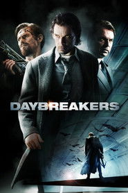 | Yes | 2010-01-06 | Lionsgate | Unknown | Unknown | enhancement_bitrate_mbps: 8.09 | [source](https://forum.blu-ray.com/showthread.php?t=276448) | [TMDB](https://www.themoviedb.org/movie/19901) |
| Daybreakers |  | Yes | 2009 | Unknown | Unknown | Unknown | enhancement_bitrate_mbps: 8.09 | [source](https://forum.blu-ray.com/showthread.php?t=276448) |  |
| Harry Potter HBP |  | Yes | 2009 | Unknown | Unknown | Unknown | Unknown | [source](FEL.txt (curated Profile 7 FEL list)) |  |
| Sherlock Holmes |  | Yes | 2009-12-23 | Warner Bros. Pictures | Unknown | Unknown | Unknown | [source](https://forum.blu-ray.com/showthread.php?t=327042&page=18) | [TMDB](https://www.themoviedb.org/movie/10528) |
| Avatar |  | Yes | 2009-12-16 | Dune Entertainment | Unknown | Unknown | Unknown | [source](https://forum.blu-ray.com/forumdisplay.php?f=203) | [TMDB](https://www.themoviedb.org/movie/19995) |
| The Twilight Saga: New Moon |  | Yes | 2009-11-18 | Summit Entertainment | Unknown | Unknown | Unknown | [source](https://github.com/iammarxg/FEL) | [TMDB](https://www.themoviedb.org/movie/18239) |
| Dogtooth |  | Yes | 2009-10-22 | Greek Film Centre | Unknown | Unknown | Unknown | [source](https://old.reddit.com/r/CoreELEC/comments/1jamlw6/list_of_dolby_vision_p7fel_films/) | [TMDB](https://www.themoviedb.org/movie/38810) |
| Law Abiding Citizen |  | Yes | 2009-10-15 | The Film Department | Unknown | Unknown | enhancement_bitrate_mbps: 7.74 | [source](https://forum.blu-ray.com/showthread.php?t=276448) | [TMDB](https://www.themoviedb.org/movie/22803) |
| Fantastic Mr. Fox |  | Yes | 2009-10-14 | Regency Enterprises | Unknown | Unknown | Unknown | [source](https://forum.blu-ray.com/showthread.php?t=354888&page=31) | [TMDB](https://www.themoviedb.org/movie/10315) |
| 2012 |  | Yes | 2009-10-10 | Columbia Pictures | Unknown | Unknown | Unknown | [source](https://forum.blu-ray.com/showthread.php?t=327042&page=37) | [TMDB](https://www.themoviedb.org/movie/14161) |
| Gamer |  | Yes | 2009-09-03 | Lakeshore Entertainment | Unknown | Unknown | Unknown | [source](https://forum.blu-ray.com/showthread.php?p=20658059) | [TMDB](https://www.themoviedb.org/movie/18501) |
| G I Joe The Rise of Cobra |  | Yes | 2009-08-03 | Paramount Pictures | Unknown | Unknown | enhancement_bitrate_mbps: 5.56 | [source](https://forum.blu-ray.com/showthread.php?t=276448) | [TMDB](https://www.themoviedb.org/movie/14869) |
| Transformers: Revenge of the Fallen |  | Yes | 2009-06-19 | DreamWorks Pictures | Unknown | Unknown | enhancement_bitrate_mbps: 6.95 | [source](https://forum.blu-ray.com/showthread.php?t=276448) | [TMDB](https://www.themoviedb.org/movie/8373) |
| Drag Me to Hell |  | Yes | 2009-05-27 | Universal Pictures | Unknown | Unknown | Unknown | [source](https://old.reddit.com/r/CoreELEC/comments/1jamlw6/list_of_dolby_vision_p7fel_films/) | [TMDB](https://www.themoviedb.org/movie/16871) |
| Angels and Demons | 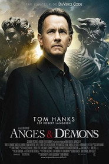 | Yes | 2009-05-15 | Unknown | Unknown | Unknown | Unknown | [source](FEL.txt (curated Profile 7 FEL list)) | [TMDB](https://www.themoviedb.org/movie/1221148) |
| Knowing |  | Yes | 2009-03-19 | Summit Entertainment | Unknown | Unknown | enhancement_bitrate_mbps: 8.14 | [source](https://forum.blu-ray.com/showthread.php?t=276448) | [TMDB](https://www.themoviedb.org/movie/13811) |
| Watchmen | 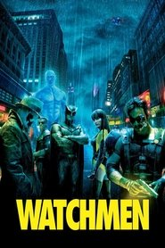 | Yes | 2009-03-04 | Warner Bros. Pictures | Unknown | Unknown | enhancement_bitrate_mbps: 4.96 | [source](https://forum.blu-ray.com/showthread.php?t=276448) | [TMDB](https://www.themoviedb.org/movie/13183) |
| Coraline |  | Yes | 2009-02-05 | LAIKA | Unknown | Unknown | Unknown | [source](https://forum.blu-ray.com/showthread.php?t=276448&page=172) | [TMDB](https://www.themoviedb.org/movie/14836) |
| Push |  | Yes | 2009-02-04 | Summit Entertainment | Unknown | Unknown | enhancement_bitrate_mbps: 7.84 | [source](https://forum.blu-ray.com/showthread.php?t=276448) | [TMDB](https://www.themoviedb.org/movie/13455) |
| Yip Man |  | Yes | 2008 | Unknown | Unknown | Unknown | Unknown | [source](https://github.com/iammarxg/FEL) |  |
| Punisher: War Zone |  | Yes | 2008-12-05 | Lionsgate | Unknown | Unknown | enhancement_bitrate_mbps: 7.95 | [source](https://forum.blu-ray.com/showthread.php?t=276448) | [TMDB](https://www.themoviedb.org/movie/13056) |
| Transporter 3 |  | Yes | 2008-11-26 | Grive Productions | Unknown | Unknown | enhancement_bitrate_mbps: 7.57 | [source](https://forum.blu-ray.com/showthread.php?t=276448) | [TMDB](https://www.themoviedb.org/movie/13387) |
| Twilight |  | Yes | 2008-11-20 | Summit Entertainment | Unknown | Unknown | enhancement_bitrate_mbps: 7.67 | [source](https://forum.blu-ray.com/showthread.php?t=276448) | [TMDB](https://www.themoviedb.org/movie/8966) |
| The Hurt Locker |  | Yes | 2008-10-10 | First Light | Unknown | Unknown | Unknown | [source](https://docs.google.com/spreadsheets/d/15i0a84uiBtWiHZ5CXZZ7wygLFXwYOd84/edit?gid=828864432#gid=828864432) | [TMDB](https://www.themoviedb.org/movie/12162) |
| Eden Lake |  | Yes | 2008-09-12 | Rollercoaster Films | Unknown | Unknown | Unknown | [source](https://github.com/iammarxg/FEL) | [TMDB](https://www.themoviedb.org/movie/13510) |
| Tropic Thunder |  | Yes | 2008-08-09 | DreamWorks Pictures | Unknown | Unknown | Unknown | [source](https://forum.blu-ray.com/showthread.php?t=327042&page=27) | [TMDB](https://www.themoviedb.org/movie/7446) |
| Pineapple Express |  | Yes | 2008-08-06 | Columbia Pictures | Unknown | Unknown | Unknown | [source](https://forum.blu-ray.com/showthread.php?t=276448&page=40) | [TMDB](https://www.themoviedb.org/movie/10189) |
| WALL·E |  | Yes | 2008-06-26 | Pixar | Unknown | Unknown | Unknown | [source](https://forum.blu-ray.com/showthread.php?t=354888&page=10) | [TMDB](https://www.themoviedb.org/movie/10681) |
| Wanted |  | Yes | 2008-06-19 | Kickstart Entertainment | Unknown | Unknown | Unknown | [source](https://forum.blu-ray.com/showthread.php?t=387117&page=10) | [TMDB](https://www.themoviedb.org/movie/8909) |
| The Incredible Hulk |  | Yes | 2008-06-12 | Marvel Studios | Unknown | Unknown | enhancement_bitrate_mbps: 5.68 | [source](https://forum.blu-ray.com/showthread.php?t=276448) | [TMDB](https://www.themoviedb.org/movie/1724) |
| Kung Fu Panda |  | Yes | 2008-06-04 | DreamWorks Animation | Unknown | Unknown | Unknown | [source](https://github.com/iammarxg/FEL) | [TMDB](https://www.themoviedb.org/movie/9502) |
| The Strangers |  | Yes | 2008-05-29 | Intrepid Pictures | Unknown | Unknown | Unknown | [source](https://github.com/iammarxg/FEL) | [TMDB](https://www.themoviedb.org/movie/10665) |
| Indiana Jones and the Kingdom of the Crystal Skull |  | Yes | 2008-05-21 | Paramount Pictures | Unknown | Unknown | Unknown | [source](https://github.com/iammarxg/FEL) | [TMDB](https://www.themoviedb.org/movie/217) |
| Iron Man |  | Yes | 2008-04-30 | Marvel Studios | Unknown | Unknown | enhancement_bitrate_mbps: 5.68 | [source](https://forum.blu-ray.com/showthread.php?t=276448) | [TMDB](https://www.themoviedb.org/movie/1726) |
| The Forbidden Kingdom |  | Yes | 2008-04-17 | Casey Silver Productions | Unknown | Unknown | Unknown | [source](https://github.com/iammarxg/FEL) | [TMDB](https://www.themoviedb.org/movie/1729) |
| Doomsday |  | Yes | 2008-03-14 | Rogue Pictures | Unknown | Unknown | Unknown | [source](https://forum.blu-ray.com/showthread.php?t=276448&page=73) | [TMDB](https://www.themoviedb.org/movie/13460) |
| In Bruges |  | Yes | 2008-02-08 | Twins Financing | Unknown | Unknown | Unknown | [source](https://old.reddit.com/r/CoreELEC/comments/1jamlw6/list_of_dolby_vision_p7fel_films/) | [TMDB](https://www.themoviedb.org/movie/8321) |
| Rambo |  | Yes | 2008-01-24 | Millennium Media | Unknown | Unknown | enhancement_bitrate_mbps: 6.03 | [source](https://forum.blu-ray.com/showthread.php?t=276448) | [TMDB](https://www.themoviedb.org/movie/7555) |
| Cloverfield |  | Yes | 2008-01-15 | Bad Robot | Unknown | Unknown | enhancement_bitrate_mbps: 7.67 | [source](https://forum.blu-ray.com/showthread.php?t=276448) | [TMDB](https://www.themoviedb.org/movie/7191) |
| Harry Potter OP |  | Yes | 2007 | Unknown | Unknown | Unknown | Unknown | [source](FEL.txt (curated Profile 7 FEL list)) |  |
| Transofmers |  | Yes | 2007 | Unknown | Unknown | Unknown | Unknown | [source](FEL.txt (curated Profile 7 FEL list)) |  |
| Sweeney Todd: The Demon Barber of Fleet Street |  | Yes | 2007-12-21 | DreamWorks Pictures | Unknown | Unknown | Unknown | [source](https://docs.google.com/spreadsheets/d/15i0a84uiBtWiHZ5CXZZ7wygLFXwYOd84/edit?gid=828864432#gid=828864432) | [TMDB](https://www.themoviedb.org/movie/13885) |
| The Mist |  | Yes | 2007-11-21 | Darkwoods Productions | Unknown | Unknown | Unknown | [source](https://github.com/iammarxg/FEL) | [TMDB](https://www.themoviedb.org/movie/5876) |
| No Country for Old Men |  | Yes | 2007-11-09 | Miramax | Unknown | Unknown | Unknown | [source](https://github.com/iammarxg/FEL) | [TMDB](https://www.themoviedb.org/movie/6977) |
| Saw IV |  | Yes | 2007-10-25 | Twisted Pictures | Unknown | Unknown | Unknown | [source](https://old.reddit.com/r/CoreELEC/comments/1jamlw6/list_of_dolby_vision_p7fel_films/) | [TMDB](https://www.themoviedb.org/movie/663) |
| Resident Evil: Extinction |  | Yes | 2007-09-20 | Screen Gems | Unknown | Unknown | Unknown | [source](https://old.reddit.com/r/CoreELEC/comments/1jamlw6/list_of_dolby_vision_p7fel_films/) | [TMDB](https://www.themoviedb.org/movie/7737) |
| Eastern Promises |  | Yes | 2007-09-14 | Focus Features | Unknown | Unknown | Unknown | [source](https://forum.blu-ray.com/showthread.php?t=276448&page=164) | [TMDB](https://www.themoviedb.org/movie/2252) |
| The Darjeeling Limited |  | Yes | 2007-09-07 | Fox Searchlight Pictures | Unknown | Unknown | Unknown | [source](https://old.reddit.com/r/CoreELEC/comments/1jamlw6/list_of_dolby_vision_p7fel_films/) | [TMDB](https://www.themoviedb.org/movie/4538) |
| Stardust |  | Yes | 2007-08-10 | Paramount Pictures | Unknown | Unknown | Unknown | [source](https://docs.google.com/spreadsheets/d/15i0a84uiBtWiHZ5CXZZ7wygLFXwYOd84/edit?gid=828864432#gid=828864432) | [TMDB](https://www.themoviedb.org/movie/2270) |
| Transformers | 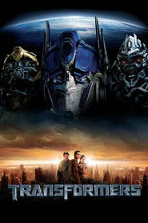 | Yes | 2007-06-27 | DreamWorks Pictures | Unknown | Unknown | enhancement_bitrate_mbps: 7.13 | [source](https://forum.blu-ray.com/showthread.php?t=276448) | [TMDB](https://www.themoviedb.org/movie/1858) |
| 1408 |  | Yes | 2007-06-22 | Dimension Films | Unknown | Unknown | Unknown | [source](https://letterboxd.com/mikimajk/list/list-of-dolby-vision-p7-fel-films/) | [TMDB](https://www.themoviedb.org/movie/3021) |
| Hellboy Animated |  | Yes | 2007-06-12 | Starz | Unknown | Unknown | enhancement_bitrate_mbps: 12.33 | [source](https://forum.blu-ray.com/showthread.php?t=276448) | [TMDB](https://www.themoviedb.org/movie/154207) |
| Hellboy Animated: Iron Shoes |  | Yes | 2007-06-12 | Starz | Unknown | Unknown | Unknown | [source](https://forum.blu-ray.com/showthread.php?t=276448) | [TMDB](https://www.themoviedb.org/movie/154207) |
| Ocean's Thirteen |  | Yes | 2007-06-05 | Warner Bros. Pictures | Unknown | Unknown | Unknown | [source](FEL.txt (curated Profile 7 FEL list)) | [TMDB](https://www.themoviedb.org/movie/298) |
| Spider-Man 3 |  | Yes | 2007-05-01 | Laura Ziskin Productions | Unknown | Unknown | Unknown | [source](FEL.txt (curated Profile 7 FEL list)) | [TMDB](https://www.themoviedb.org/movie/559) |
| Shooter |  | Yes | 2007-03-22 | Paramount Pictures | Unknown | Unknown | Unknown | [source](https://forum.blu-ray.com/showthread.php?t=276448&page=163) | [TMDB](https://www.themoviedb.org/movie/7485) |
| Dead Silence |  | Yes | 2007-03-16 | Evolution Entertainment | Unknown | Unknown | Unknown | [source](https://old.reddit.com/r/CoreELEC/comments/1jamlw6/list_of_dolby_vision_p7fel_films/) | [TMDB](https://www.themoviedb.org/movie/14001) |
| Hellboy Animated: Blood and Iron |  | Yes | 2007-03-10 | IDT Entertainment | Unknown | Unknown | Unknown | [source](https://github.com/iammarxg/FEL) | [TMDB](https://www.themoviedb.org/movie/13204) |
| Zodiac | 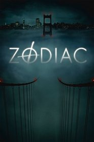 | Yes | 2007-03-02 | Paramount Pictures | Unknown | Unknown | Unknown | [source](https://docs.google.com/spreadsheets/d/15i0a84uiBtWiHZ5CXZZ7wygLFXwYOd84/edit?gid=828864432#gid=828864432) | [TMDB](https://www.themoviedb.org/movie/1949) |
| Saw III |  | Yes | 2006-10-26 | Twisted Pictures | Unknown | Unknown | Unknown | [source](https://old.reddit.com/r/CoreELEC/comments/1jamlw6/list_of_dolby_vision_p7fel_films/) | [TMDB](https://www.themoviedb.org/movie/214) |
| Pan's Labyrinth |  | Yes | 2006-10-11 | Estudios Picasso | Unknown | Unknown | Unknown | [source](FEL.txt (curated Profile 7 FEL list)) | [TMDB](https://www.themoviedb.org/movie/1417) |
| Paprika |  | Yes | 2006-10-01 | Madhouse | Unknown | Unknown | Unknown | [source](https://forum.blu-ray.com/showthread.php?t=327042&page=49) | [TMDB](https://www.themoviedb.org/movie/4977) |
| Crank |  | Yes | 2006-08-31 | Lakeshore Entertainment | Unknown | Unknown | enhancement_bitrate_mbps: 8.04 | [source](https://forum.blu-ray.com/showthread.php?t=276448) | [TMDB](https://www.themoviedb.org/movie/1948) |
| World Trade Center |  | Yes | 2006-08-09 | Paramount Pictures | Unknown | Unknown | Unknown | [source](https://old.reddit.com/r/CoreELEC/comments/1jamlw6/list_of_dolby_vision_p7fel_films/) | [TMDB](https://www.themoviedb.org/movie/1852) |
| The Girl Who Leapt Through Time |  | Yes | 2006-07-15 | Madhouse | Unknown | Unknown | Unknown | [source](https://old.reddit.com/r/CoreELEC/comments/1jamlw6/list_of_dolby_vision_p7fel_films/) | [TMDB](https://www.themoviedb.org/movie/14069) |
| Nacho Libre |  | Yes | 2006-06-16 | Paramount Pictures | Unknown | Unknown | Unknown | [source](https://old.reddit.com/r/CoreELEC/comments/1jamlw6/list_of_dolby_vision_p7fel_films/) | [TMDB](https://www.themoviedb.org/movie/9353) |
| Home Movies 300-1 |  | Yes | 2006-06-13 | Unknown | Unknown | Unknown | Unknown | [source](FEL.txt (curated Profile 7 FEL list)) | [TMDB](https://www.themoviedb.org/movie/719963) |
| Film Bug I | 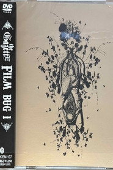 | Yes | 2006-06-07 | Unknown | Unknown | Unknown | Unknown | [source](https://old.reddit.com/r/CoreELEC/comments/1jamlw6/list_of_dolby_vision_p7fel_films/) | [TMDB](https://www.themoviedb.org/movie/552414) |
| The Da Vinci Code |  | Yes | 2006-05-17 | Imagine Entertainment | Unknown | Unknown | Unknown | [source](FEL.txt (curated Profile 7 FEL list)) | [TMDB](https://www.themoviedb.org/movie/591) |
| Mission: Impossible III | 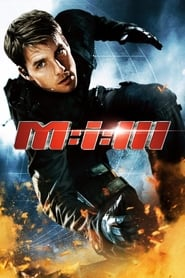 | Yes | 2006-04-25 | Paramount Pictures | Unknown | Unknown | enhancement_bitrate_mbps: 5.27 | [source](https://forum.blu-ray.com/showthread.php?t=276448) | [TMDB](https://www.themoviedb.org/movie/956) |
| Aeon Flux |  | Yes | 2005 | Unknown | Unknown | Unknown | Unknown | [source](https://docs.google.com/spreadsheets/d/15i0a84uiBtWiHZ5CXZZ7wygLFXwYOd84/edit?gid=828864432#gid=828864432) |  |
| Æon Flux |  | Yes | 2005-11-30 | Paramount Pictures | Unknown | Unknown | Unknown | [source](https://old.reddit.com/r/CoreELEC/comments/1jamlw6/list_of_dolby_vision_p7fel_films/) | [TMDB](https://www.themoviedb.org/movie/8202) |
| Jarhead |  | Yes | 2005-11-04 | Red Wagon Entertainment | Unknown | Unknown | Unknown | [source](https://old.reddit.com/r/CoreELEC/comments/1jamlw6/list_of_dolby_vision_p7fel_films/) | [TMDB](https://www.themoviedb.org/movie/25) |
| Saw II |  | Yes | 2005-10-28 | Twisted Pictures | Unknown | Unknown | Unknown | [source](https://old.reddit.com/r/CoreELEC/comments/1jamlw6/list_of_dolby_vision_p7fel_films/) | [TMDB](https://www.themoviedb.org/movie/215) |
| Brokeback Mountain |  | Yes | 2005-10-22 | Focus Features | Unknown | Unknown | Unknown | [source](https://github.com/iammarxg/FEL) | [TMDB](https://www.themoviedb.org/movie/142) |
| A History of Violence |  | Yes | 2005-09-23 | New Line Cinema | Unknown | Unknown | Unknown | [source](https://old.reddit.com/r/CoreELEC/comments/1jamlw6/list_of_dolby_vision_p7fel_films/) | [TMDB](https://www.themoviedb.org/movie/59) |
| Lord of War |  | Yes | 2005-09-16 | Endgame Entertainment | Unknown | Unknown | enhancement_bitrate_mbps: 7.46 | [source](https://forum.blu-ray.com/showthread.php?t=276448) | [TMDB](https://www.themoviedb.org/movie/1830) |
| Pride & Prejudice |  | Yes | 2005-09-16 | StudioCanal | Unknown | Unknown | Unknown | [source](FEL.txt (curated Profile 7 FEL list)) | [TMDB](https://www.themoviedb.org/movie/4348) |
| The 40 Year Old Virgin |  | Yes | 2005-08-11 | Universal Pictures | Unknown | Unknown | Unknown | [source](https://docs.google.com/spreadsheets/d/15i0a84uiBtWiHZ5CXZZ7wygLFXwYOd84/edit?gid=828864432#gid=828864432) | [TMDB](https://www.themoviedb.org/movie/6957) |
| Red Eye |  | Yes | 2005-08-10 | DreamWorks Pictures | Unknown | Unknown | Unknown | [source](https://docs.google.com/spreadsheets/d/15i0a84uiBtWiHZ5CXZZ7wygLFXwYOd84/edit?gid=828864432#gid=828864432) | [TMDB](https://www.themoviedb.org/movie/11460) |
| Hustle & Flow |  | Yes | 2005-07-22 | New Deal Productions | Unknown | Unknown | Unknown | [source](https://web.archive.org/web/20250308162437/https://discourse.coreelec.org/t/list-of-dolby-vision-p7-fel-films/52523) | [TMDB](https://www.themoviedb.org/movie/10476) |
| The Devil's Rejects |  | Yes | 2005-07-22 | Cinerenta | Unknown | Unknown | Unknown | [source](FEL.txt (curated Profile 7 FEL list)) | [TMDB](https://www.themoviedb.org/movie/1696) |
| The Descent |  | Yes | 2005-07-08 | Celador Films | Unknown | Unknown | Unknown | [source](https://old.reddit.com/r/CoreELEC/comments/1jamlw6/list_of_dolby_vision_p7fel_films/) | [TMDB](https://www.themoviedb.org/movie/9392) |
| War of the Worlds |  | Yes | 2005-06-28 | Paramount Pictures | Unknown | Unknown | enhancement_bitrate_mbps: 4.27 | [source](https://forum.blu-ray.com/showthread.php?t=276448) | [TMDB](https://www.themoviedb.org/movie/74) |
| Land of the Dead |  | Yes | 2005-06-18 | Romero-Grunwald Productions | Unknown | Unknown | Unknown | [source](https://github.com/iammarxg/FEL) | [TMDB](https://www.themoviedb.org/movie/11683) |
| Brick Vision |  | Yes | 2005-06-17 | Unknown | Unknown | Unknown | Unknown | [source](https://forum.blu-ray.com/showthread.php?t=327042&page=49) | [TMDB](https://www.themoviedb.org/movie/345308) |
| Cinderella Man |  | Yes | 2005-06-02 | Universal Pictures | Unknown | Unknown | Unknown | [source](https://docs.google.com/spreadsheets/d/15i0a84uiBtWiHZ5CXZZ7wygLFXwYOd84/edit?gid=828864432#gid=828864432) | [TMDB](https://www.themoviedb.org/movie/921) |
| Madagascar |  | Yes | 2005-05-25 | Pacific Data Images | Unknown | Unknown | Unknown | [source](https://docs.google.com/spreadsheets/d/15i0a84uiBtWiHZ5CXZZ7wygLFXwYOd84/edit?gid=828864432#gid=828864432) | [TMDB](https://www.themoviedb.org/movie/953) |
| Kingdom of Heaven |  | Yes | 2005-05-03 | Scott Free Productions | Unknown | Unknown | Unknown | [source](https://old.reddit.com/r/CoreELEC/comments/1jamlw6/list_of_dolby_vision_p7fel_films/) | [TMDB](https://www.themoviedb.org/movie/1495) |
| The Amityville Horror |  | Yes | 2005-04-14 | Metro-Goldwyn-Mayer | Unknown | Unknown | Unknown | [source](https://forum.blu-ray.com/showthread.php?t=327042&page=49) | [TMDB](https://www.themoviedb.org/movie/10065) |
| The Ring Two |  | Yes | 2005-03-10 | DreamWorks Pictures | Unknown | Unknown | Unknown | [source](https://forum.blu-ray.com/showthread.php?t=327042&page=49) | [TMDB](https://www.themoviedb.org/movie/10320) |
| Constantine |  | Yes | 2005-02-08 | Village Roadshow Pictures | Unknown | Unknown | Unknown | [source](FEL.txt (curated Profile 7 FEL list)) | [TMDB](https://www.themoviedb.org/movie/561) |
| Harry Potter POA |  | Yes | 2004 | Unknown | Unknown | Unknown | Unknown | [source](FEL.txt (curated Profile 7 FEL list)) |  |
| MakeMKV shows Collateral |  | Yes | 2004 | Unknown | Unknown | Unknown | Unknown | [source](https://old.reddit.com/r/CoreElecOS/comments/1j3lgw2/list_of_dolby_vision_p7fel_films/) |  |
| Meet the Fockers |  | Yes | 2004-12-22 | Universal Pictures | Unknown | Unknown | Unknown | [source](https://old.reddit.com/r/CoreELEC/comments/1jamlw6/list_of_dolby_vision_p7fel_films/) | [TMDB](https://www.themoviedb.org/movie/693) |
| The Life Aquatic with Steve Zissou |  | Yes | 2004-12-10 | American Empirical Pictures | Unknown | Unknown | Unknown | [source](https://old.reddit.com/r/CoreELEC/comments/1jamlw6/list_of_dolby_vision_p7fel_films/) | [TMDB](https://www.themoviedb.org/movie/421) |
| 36th Precinct | 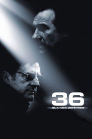 | Yes | 2004-11-24 | Gaumont | Unknown | Unknown | Unknown | [source](https://old.reddit.com/r/CoreELEC/comments/1jamlw6/list_of_dolby_vision_p7fel_films/) | [TMDB](https://www.themoviedb.org/movie/7291) |
| The SpongeBob SquarePants Movie |  | Yes | 2004-11-19 | Paramount Pictures | Unknown | Unknown | Unknown | [source](https://github.com/iammarxg/FEL) | [TMDB](https://www.themoviedb.org/movie/11836) |
| Seed of Chucky |  | Yes | 2004-11-12 | David Kirschner Productions | Unknown | Unknown | Unknown | [source](FEL.txt (curated Profile 7 FEL list)) | [TMDB](https://www.themoviedb.org/movie/11249) |
| Birth |  | Yes | 2004-10-29 | Academy Films | Unknown | Unknown | Unknown | [source](https://forum.blu-ray.com/showthread.php?t=276448&page=100) | [TMDB](https://www.themoviedb.org/movie/10740) |
| Ray |  | Yes | 2004-10-29 | Bristol Bay Productions | Unknown | Unknown | Unknown | [source](https://old.reddit.com/r/CoreELEC/comments/1jamlw6/list_of_dolby_vision_p7fel_films/) | [TMDB](https://www.themoviedb.org/movie/1677) |
| Team America: World Police |  | Yes | 2004-10-10 | Paramount Pictures | Unknown | Unknown | Unknown | [source](https://docs.google.com/spreadsheets/d/15i0a84uiBtWiHZ5CXZZ7wygLFXwYOd84/edit?gid=828864432#gid=828864432) | [TMDB](https://www.themoviedb.org/movie/3989) |
| Saw |  | Yes | 2004-10-01 | Twisted Pictures | Unknown | Unknown | Unknown | [source](https://docs.google.com/spreadsheets/d/15i0a84uiBtWiHZ5CXZZ7wygLFXwYOd84/edit?gid=828864432#gid=828864432) | [TMDB](https://www.themoviedb.org/movie/176) |
| Sky Captain and the World of Tomorrow |  | Yes | 2004-09-17 | Filmauro | Unknown | Unknown | Unknown | [source](https://old.reddit.com/r/CoreELEC/comments/1jamlw6/list_of_dolby_vision_p7fel_films/) | [TMDB](https://www.themoviedb.org/movie/5137) |
| Resident Evil: Apocalypse |  | Yes | 2004-09-10 | Davis Films/Impact Pictures | Unknown | Unknown | Unknown | [source](https://old.reddit.com/r/CoreELEC/comments/1jamlw6/list_of_dolby_vision_p7fel_films/) | [TMDB](https://www.themoviedb.org/movie/1577) |
| Suspect Zero |  | Yes | 2004-08-27 | Paramount Pictures | Unknown | Unknown | Unknown | [source](https://old.reddit.com/r/CoreELEC/comments/1jamlw6/list_of_dolby_vision_p7fel_films/) | [TMDB](https://www.themoviedb.org/movie/8080) |
| Collateral |  | Yes | 2004-08-04 | Paramount Pictures | Unknown | Unknown | enhancement_bitrate_mbps: 4.34 | [source](https://forum.blu-ray.com/showthread.php?t=276448) | [TMDB](https://www.themoviedb.org/movie/1538) |
| Throw Down |  | Yes | 2004-07-08 | Milkyway Image | Unknown | Unknown | Unknown | [source](https://old.reddit.com/r/CoreELEC/comments/1jamlw6/list_of_dolby_vision_p7fel_films/) | [TMDB](https://www.themoviedb.org/movie/25664) |
| Anchorman: The Legend of Ron Burgundy |  | Yes | 2004-06-28 | DreamWorks Pictures | Unknown | Unknown | Unknown | [source](https://web.archive.org/web/20250308162437/https://discourse.coreelec.org/t/list-of-dolby-vision-p7-fel-films/52523) | [TMDB](https://www.themoviedb.org/movie/8699) |
| Spider-Man 2 |  | Yes | 2004-06-25 | Marvel Enterprises | Unknown | Unknown | Unknown | [source](FEL.txt (curated Profile 7 FEL list)) | [TMDB](https://www.themoviedb.org/movie/558) |
| Shrek 2 |  | Yes | 2004-05-19 | DreamWorks Animation | Unknown | Unknown | Unknown | [source](FEL.txt (curated Profile 7 FEL list)) | [TMDB](https://www.themoviedb.org/movie/809) |
| Mean Girls |  | Yes | 2004-04-30 | Broadway Video | Unknown | Unknown | Unknown | [source](https://forum.blu-ray.com/showthread.php?page=4&t=372842) | [TMDB](https://www.themoviedb.org/movie/10625) |
| Kill Bill: Vol. 2 |  | Yes | 2004-04-16 | Super Cool ManChu | Unknown | Unknown | Unknown | [source](FEL.txt (curated Profile 7 FEL list)) | [TMDB](https://www.themoviedb.org/movie/393) |
| The Punisher |  | Yes | 2004-04-15 | Lions Gate Films | Unknown | Unknown | enhancement_bitrate_mbps: 7.58 | [source](https://forum.blu-ray.com/showthread.php?t=276448) | [TMDB](https://www.themoviedb.org/movie/7220) |
| Shaun of the Dead |  | Yes | 2004-04-09 | WT² Productions | Unknown | Unknown | Unknown | [source](https://forum.blu-ray.com/showthread.php?t=276448&page=124) | [TMDB](https://www.themoviedb.org/movie/747) |
| Hellboy |  | Yes | 2004-04-02 | Revolution Studios | Unknown | Unknown | Unknown | [source](https://forum.blu-ray.com/showthread.php?p=23318439) | [TMDB](https://www.themoviedb.org/movie/1487) |
| Walking Tall |  | Yes | 2004-04-02 | Mandeville Films | Unknown | Unknown | Unknown | [source](https://old.reddit.com/r/CoreELEC/comments/1jamlw6/list_of_dolby_vision_p7fel_films/) | [TMDB](https://www.themoviedb.org/movie/11358) |
| Dawn of the Dead |  | Yes | 2004-03-19 | New Amsterdam Entertainment | Unknown | Unknown | Unknown | [source](https://forum.blu-ray.com/showthread.php?t=327042&page=64) | [TMDB](https://www.themoviedb.org/movie/924) |
| Eternal Sunshine of the Spotless Mind |  | Yes | 2004-03-19 | Focus Features | Unknown | Unknown | Unknown | [source](https://forum.blu-ray.com/showthread.php?t=276448&page=169) | [TMDB](https://www.themoviedb.org/movie/38) |
| The Italian Job |  | Yes | 2003 | Unknown | Unknown | Unknown | Unknown | [source](https://docs.google.com/spreadsheets/d/15i0a84uiBtWiHZ5CXZZ7wygLFXwYOd84/edit?gid=828864432#gid=828864432) |  |
| Pirates of the Caribbean CBP |  | Yes | 2003 | Unknown | Unknown | Unknown | Unknown | [source](FEL.txt (curated Profile 7 FEL list)) |  |
| Big Fish |  | Yes | 2003-12-10 | Columbia Pictures | Unknown | Unknown | Unknown | [source](FEL.txt (curated Profile 7 FEL list)) | [TMDB](https://www.themoviedb.org/movie/587) |
| Master and Commander: The Far Side of the World |  | Yes | 2003-11-14 | 20th Century Fox | Unknown | Unknown | Unknown | [source](https://old.reddit.com/r/CoreELEC/comments/1jamlw6/list_of_dolby_vision_p7fel_films/) | [TMDB](https://www.themoviedb.org/movie/8619) |
| Kill Bill: Vol. 1 |  | Yes | 2003-10-10 | Miramax | Unknown | Unknown | Unknown | [source](FEL.txt (curated Profile 7 FEL list)) | [TMDB](https://www.themoviedb.org/movie/24) |
| The Rundown |  | Yes | 2003-09-26 | Columbia Pictures | Unknown | Unknown | Unknown | [source](https://old.reddit.com/r/CoreELEC/comments/1jamlw6/list_of_dolby_vision_p7fel_films/) | [TMDB](https://www.themoviedb.org/movie/10159) |
| Love Actually |  | Yes | 2003-09-07 | Working Title Films | Unknown | Unknown | Unknown | [source](https://old.reddit.com/r/CoreELEC/comments/1jamlw6/list_of_dolby_vision_p7fel_films/) | [TMDB](https://www.themoviedb.org/movie/508) |
| Cabin Fever |  | Yes | 2003-08-15 | Tonic Films | Unknown | Unknown | Unknown | [source](https://old.reddit.com/r/CoreELEC/comments/1jamlw6/list_of_dolby_vision_p7fel_films/) | [TMDB](https://www.themoviedb.org/movie/11547) |
| Lara Croft: Tomb Raider - The Cradle of Life |  | Yes | 2003-07-21 | Paramount Pictures | Unknown | Unknown | enhancement_bitrate_mbps: 6.45 | [source](https://forum.blu-ray.com/showthread.php?t=276448) | [TMDB](https://www.themoviedb.org/movie/1996) |
| Bad Boys II |  | Yes | 2003-07-18 | Columbia Pictures | Unknown | Unknown | Unknown | [source](FEL.txt (curated Profile 7 FEL list)) | [TMDB](https://www.themoviedb.org/movie/8961) |
| The Core |  | Yes | 2003-03-28 | Paramount Pictures | Unknown | Unknown | Unknown | [source](https://docs.google.com/spreadsheets/d/15i0a84uiBtWiHZ5CXZZ7wygLFXwYOd84/edit?gid=828864432#gid=828864432) | [TMDB](https://www.themoviedb.org/movie/9341) |
| The Hunted |  | Yes | 2003-03-11 | Alphaville Films | Unknown | Unknown | Unknown | [source](https://github.com/iammarxg/FEL) | [TMDB](https://www.themoviedb.org/movie/10632) |
| Van wilder |  | Yes | 2002 | Unknown | Unknown | Unknown | Unknown | [source](https://docs.google.com/spreadsheets/d/15i0a84uiBtWiHZ5CXZZ7wygLFXwYOd84/edit?gid=828864432#gid=828864432) |  |
| Catch Me If You Can |  | Yes | 2002-12-16 | Kemp Company | Unknown | Unknown | Unknown | [source](https://old.reddit.com/r/CoreELEC/comments/1jamlw6/list_of_dolby_vision_p7fel_films/) | [TMDB](https://www.themoviedb.org/movie/640) |
| Star Trek: Nemesis |  | Yes | 2002-12-13 | Paramount Pictures | Unknown | Unknown | Unknown | [source](https://github.com/iammarxg/FEL) | [TMDB](https://www.themoviedb.org/movie/201) |
| The Ring |  | Yes | 2002-10-18 | DreamWorks Pictures | Unknown | Unknown | Unknown | [source](https://forum.blu-ray.com/showthread.php?p=22543294) | [TMDB](https://www.themoviedb.org/movie/565) |
| Punch-Drunk Love |  | Yes | 2002-10-11 | Revolution Studios | Unknown | Unknown | Unknown | [source](https://github.com/iammarxg/FEL) | [TMDB](https://www.themoviedb.org/movie/8051) |
| Red Dragon |  | Yes | 2002-10-02 | Universal Pictures | Unknown | Unknown | Unknown | [source](https://forum.blu-ray.com/showthread.php?t=327042&page=46) | [TMDB](https://www.themoviedb.org/movie/9533) |
| Cypher |  | Yes | 2002-10-01 | Miramax | Unknown | Unknown | Unknown | [source](https://old.reddit.com/r/CoreELEC/comments/1jamlw6/list_of_dolby_vision_p7fel_films/) | [TMDB](https://www.themoviedb.org/movie/10133) |
| The Pianist |  | Yes | 2002-09-17 | R.P. Productions | Unknown | Unknown | Unknown | [source](https://github.com/iammarxg/FEL) | [TMDB](https://www.themoviedb.org/movie/423) |
| Below |  | Yes | 2002-08-11 | Protozoa Pictures | Unknown | Unknown | Unknown | [source](https://forum.blu-ray.com/showthread.php?t=276448&page=14) | [TMDB](https://www.themoviedb.org/movie/12590) |
| Signs |  | Yes | 2002-08-02 | Touchstone Pictures | Unknown | Unknown | Unknown | [source](https://forum.blu-ray.com/showthread.php?t=354888&page=7) | [TMDB](https://www.themoviedb.org/movie/2675) |
| K-19: The Widowmaker |  | Yes | 2002-07-19 | Intermedia Films | Unknown | Unknown | Unknown | [source](https://github.com/iammarxg/FEL) | [TMDB](https://www.themoviedb.org/movie/8665) |
| Undisputed | 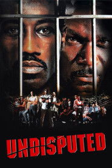 | Yes | 2002-07-17 | Miramax | Unknown | Unknown | Unknown | [source](https://old.reddit.com/r/CoreELEC/comments/1jamlw6/list_of_dolby_vision_p7fel_films/) | [TMDB](https://www.themoviedb.org/movie/15070) |
| Men in Black II |  | Yes | 2002-07-03 | Columbia Pictures | Unknown | Unknown | Unknown | [source](FEL.txt (curated Profile 7 FEL list)) | [TMDB](https://www.themoviedb.org/movie/608) |
| Halloween: Resurrection |  | Yes | 2002-07-01 | Dimension Films | Unknown | Unknown | Unknown | [source](https://old.reddit.com/r/CoreELEC/comments/1jamlw6/list_of_dolby_vision_p7fel_films/) | [TMDB](https://www.themoviedb.org/movie/11442) |
| Lilo & Stitch |  | Yes | 2002-06-21 | Walt Disney Pictures | Unknown | Unknown | Unknown | [source](FEL.txt (curated Profile 7 FEL list)) | [TMDB](https://www.themoviedb.org/movie/11544) |
| Minority Report |  | Yes | 2002-06-20 | Digital Image Associates | Unknown | Unknown | Unknown | [source](https://old.reddit.com/r/CoreELEC/comments/1jamlw6/list_of_dolby_vision_p7fel_films/) | [TMDB](https://www.themoviedb.org/movie/180) |
| Bubba Ho-tep |  | Yes | 2002-06-09 | Silver Sphere Corporation | Unknown | Unknown | Unknown | [source](https://old.reddit.com/r/CoreELEC/comments/1jamlw6/list_of_dolby_vision_p7fel_films/) | [TMDB](https://www.themoviedb.org/movie/9707) |
| The Sum of All Fears |  | Yes | 2002-05-31 | Paramount Pictures | Unknown | Unknown | enhancement_bitrate_mbps: 5.27 | [source](https://forum.blu-ray.com/showthread.php?t=276448) | [TMDB](https://www.themoviedb.org/movie/4614) |
| Star Wars: Episode II - Attack of the Clones |  | Yes | 2002-05-15 | Lucasfilm Ltd. | Unknown | Unknown | Unknown | [source](FEL.txt (curated Profile 7 FEL list)) | [TMDB](https://www.themoviedb.org/movie/1894) |
| Spider-Man |  | Yes | 2002-05-01 | Marvel Enterprises | Unknown | Unknown | Unknown | [source](https://forum.blu-ray.com/showthread.php?t=276448) | [TMDB](https://www.themoviedb.org/movie/557) |
| Frailty |  | Yes | 2002-04-12 | Cinerenta | Unknown | Unknown | Unknown | [source](https://old.reddit.com/r/CoreELEC/comments/1jamlw6/list_of_dolby_vision_p7fel_films/) | [TMDB](https://www.themoviedb.org/movie/12149) |
| Changing Lanes |  | Yes | 2002-04-07 | Paramount Pictures | Unknown | Unknown | Unknown | [source](https://github.com/iammarxg/FEL) | [TMDB](https://www.themoviedb.org/movie/1537) |
| National Lampoon's Van Wilder |  | Yes | 2002-03-29 | Tapestry Films | Unknown | Unknown | enhancement_bitrate_mbps: 7.47 | [source](https://forum.blu-ray.com/showthread.php?t=276448) | [TMDB](https://www.themoviedb.org/movie/11452) |
| Resident Evil |  | Yes | 2002-03-15 | Impact Pictures | Unknown | Unknown | Unknown | [source](https://docs.google.com/spreadsheets/d/15i0a84uiBtWiHZ5CXZZ7wygLFXwYOd84/edit?gid=828864432#gid=828864432) | [TMDB](https://www.themoviedb.org/movie/1576) |
| We Were Soldiers |  | Yes | 2002-03-01 | Wheelhouse Entertainment | Unknown | Unknown | Unknown | [source](https://old.reddit.com/r/CoreELEC/comments/1jamlw6/list_of_dolby_vision_p7fel_films/) | [TMDB](https://www.themoviedb.org/movie/10590) |
| Asterix & Obelix: Mission Cleopatra |  | Yes | 2002-01-30 | Pathé | Unknown | Unknown | Unknown | [source](FEL.txt (curated Profile 7 FEL list)) | [TMDB](https://www.themoviedb.org/movie/2899) |
| Harry Potter SS |  | Yes | 2001 | Unknown | Unknown | Unknown | Unknown | [source](FEL.txt (curated Profile 7 FEL list)) |  |
| A Beautiful Mind |  | Yes | 2001-12-14 | Universal Pictures | Unknown | Unknown | Unknown | [source](https://old.reddit.com/r/CoreELEC/comments/1jamlw6/list_of_dolby_vision_p7fel_films/) | [TMDB](https://www.themoviedb.org/movie/453) |
| Vanilla Sky |  | Yes | 2001-12-14 | Paramount Pictures | Unknown | Unknown | Unknown | [source](https://github.com/iammarxg/FEL) | [TMDB](https://www.themoviedb.org/movie/1903) |
| Monsters, Inc. |  | Yes | 2001-11-01 | Pixar | Unknown | Unknown | Unknown | [source](FEL.txt (curated Profile 7 FEL list)) | [TMDB](https://www.themoviedb.org/movie/585) |
| The Last Castle |  | Yes | 2001-10-19 | DreamWorks Pictures | Unknown | Unknown | Unknown | [source](https://github.com/iammarxg/FEL) | [TMDB](https://www.themoviedb.org/movie/2100) |
| Read My Lips |  | Yes | 2001-10-17 | Ciné B | Unknown | Unknown | Unknown | [source](https://old.reddit.com/r/CoreELEC/comments/1jamlw6/list_of_dolby_vision_p7fel_films/) | [TMDB](https://www.themoviedb.org/movie/6173) |
| The Royal Tenenbaums |  | Yes | 2001-10-05 | Touchstone Pictures | Unknown | Unknown | Unknown | [source](https://forum.blu-ray.com/showthread.php?t=354888&page=11) | [TMDB](https://www.themoviedb.org/movie/9428) |
| Jurassic Park III |  | Yes | 2001-07-18 | Universal Pictures | Unknown | Unknown | Unknown | [source](https://docs.google.com/spreadsheets/d/15i0a84uiBtWiHZ5CXZZ7wygLFXwYOd84/edit?gid=828864432#gid=828864432) | [TMDB](https://www.themoviedb.org/movie/331) |
| The Score |  | Yes | 2001-07-13 | Horseshoe Bay Productions | Unknown | Unknown | Unknown | [source](https://github.com/iammarxg/FEL) | [TMDB](https://www.themoviedb.org/movie/11371) |
| Lara Croft: Tomb Raider |  | Yes | 2001-06-15 | Paramount Pictures | Unknown | Unknown | enhancement_bitrate_mbps: 7.63 | [source](https://forum.blu-ray.com/showthread.php?t=276448) | [TMDB](https://www.themoviedb.org/movie/1995) |
| Mulholland Drive |  | Yes | 2001-06-06 | StudioCanal | Unknown | Unknown | Unknown | [source](https://forum.blu-ray.com/showthread.php?t=276448) | [TMDB](https://www.themoviedb.org/movie/1018) |
| Bridget Jones's Diary |  | Yes | 2001-04-13 | Universal Pictures | Unknown | Unknown | Unknown | [source](https://github.com/iammarxg/FEL) | [TMDB](https://www.themoviedb.org/movie/634) |
| Enemy at the Gates |  | Yes | 2001-02-28 | Paramount Pictures | Unknown | Unknown | Unknown | [source](FEL.txt (curated Profile 7 FEL list)) | [TMDB](https://www.themoviedb.org/movie/853) |
| Hannibal |  | Yes | 2001-02-08 | The De Laurentiis Company | Unknown | Unknown | enhancement_bitrate_mbps: 7.23 | [source](https://forum.blu-ray.com/showthread.php?t=276448) | [TMDB](https://www.themoviedb.org/movie/9740) |
| Brotherhood of the Wolf |  | Yes | 2001-01-31 | Davis Films | Unknown | Unknown | Unknown | [source](https://docs.google.com/spreadsheets/d/15i0a84uiBtWiHZ5CXZZ7wygLFXwYOd84/edit?gid=828864432#gid=828864432) | [TMDB](https://www.themoviedb.org/movie/6312) |
| Donnie Darko |  | Yes | 2001-01-19 | Flower Films | Unknown | Unknown | Unknown | [source](https://forum.blu-ray.com/showthread.php?t=276448) | [TMDB](https://www.themoviedb.org/movie/141) |
| NASA: A Space Odyssey Vol. 3 |  | Yes | 2001-01-01 | Control Productions | Unknown | Unknown | Unknown | [source](https://forum.blu-ray.com/showthread.php?t=276448) | [TMDB](https://www.themoviedb.org/movie/516753) |
| The Emperor's New Groove |  | Yes | 2000-12-15 | Walt Disney Feature Animation | Unknown | Unknown | Unknown | [source](https://www.blu-ray.com/movies/Rabid-4K-Blu-ray/397990/) | [TMDB](https://www.themoviedb.org/movie/11688) |
| How the Grinch Stole Christmas |  | Yes | 2000-11-17 | Universal Pictures | Unknown | Unknown | Unknown | [source](https://old.reddit.com/r/CoreELEC/comments/1jamlw6/list_of_dolby_vision_p7fel_films/) | [TMDB](https://www.themoviedb.org/movie/8871) |
| Charlie's Angels |  | Yes | 2000-11-02 | Columbia Pictures | Unknown | Unknown | Unknown | [source](FEL.txt (curated Profile 7 FEL list)) | [TMDB](https://www.themoviedb.org/movie/4327) |
| Requiem for a Dream |  | Yes | 2000-10-06 | Artisan Entertainment | Unknown | Unknown | enhancement_bitrate_mbps: 8.41 | [source](https://forum.blu-ray.com/showthread.php?t=276448) | [TMDB](https://www.themoviedb.org/movie/641) |
| Meet The Parents |  | Yes | 2000-10-06 | Universal Pictures | Unknown | Unknown | Unknown | [source](https://docs.google.com/spreadsheets/d/15i0a84uiBtWiHZ5CXZZ7wygLFXwYOd84/edit?gid=828864432#gid=828864432) | [TMDB](https://www.themoviedb.org/movie/1597) |
| The Crimson Rivers |  | Yes | 2000-09-27 | Gaumont | Unknown | Unknown | Unknown | [source](https://github.com/iammarxg/FEL) | [TMDB](https://www.themoviedb.org/movie/60670) |
| Almost Famous |  | Yes | 2000-09-15 | DreamWorks Pictures | Unknown | Unknown | Unknown | [source](https://forum.blu-ray.com/showthread.php?t=276448) | [TMDB](https://www.themoviedb.org/movie/786) |
| The Way of the Gun |  | Yes | 2000-09-08 | Artisan Entertainment | Unknown | Unknown | Unknown | [source](https://old.reddit.com/r/CoreELEC/comments/1jamlw6/list_of_dolby_vision_p7fel_films/) | [TMDB](https://www.themoviedb.org/movie/1619) |
| Bring It On |  | Yes | 2000-08-25 | Universal Pictures | Unknown | Unknown | Unknown | [source](https://old.reddit.com/r/CoreELEC/comments/1jamlw6/list_of_dolby_vision_p7fel_films/) | [TMDB](https://www.themoviedb.org/movie/1588) |
| What Lies Beneath |  | Yes | 2000-07-21 | DreamWorks Pictures | Unknown | Unknown | Unknown | [source](https://old.reddit.com/r/CoreELEC/comments/1jamlw6/list_of_dolby_vision_p7fel_films/) | [TMDB](https://www.themoviedb.org/movie/2655) |
| But I'm a Cheerleader |  | Yes | 2000-07-07 | Ignite Entertainment | Unknown | Unknown | Unknown | [source](FEL.txt (curated Profile 7 FEL list)) | [TMDB](https://www.themoviedb.org/movie/20770) |
| Amores Perros |  | Yes | 2000-06-16 | Altavista Films | Unknown | Unknown | Unknown | [source](https://old.reddit.com/r/CoreELEC/comments/1jamlw6/list_of_dolby_vision_p7fel_films/) | [TMDB](https://www.themoviedb.org/movie/55) |
| Mission: Impossible II |  | Yes | 2000-05-24 | Paramount Pictures | Unknown | Unknown | enhancement_bitrate_mbps: 5.50 | [source](https://forum.blu-ray.com/showthread.php?t=276448) | [TMDB](https://www.themoviedb.org/movie/955) |
| Road Trip |  | Yes | 2000-05-19 | DreamWorks Pictures | Unknown | Unknown | Unknown | [source](https://old.reddit.com/r/CoreELEC/comments/1jamlw6/list_of_dolby_vision_p7fel_films/) | [TMDB](https://www.themoviedb.org/movie/9285) |
| Gladiator |  | Yes | 2000-05-04 | Universal Pictures | Unknown | Unknown | enhancement_bitrate_mbps: 6.82 | [source](https://forum.blu-ray.com/showthread.php?t=276448) | [TMDB](https://www.themoviedb.org/movie/98) |
| U-571 |  | Yes | 2000-04-20 | Universal Pictures | Unknown | Unknown | Unknown | [source](https://web.archive.org/web/20250308162437/https://discourse.coreelec.org/t/list-of-dolby-vision-p7-fel-films/52523) | [TMDB](https://www.themoviedb.org/movie/3536) |
| American Psycho |  | Yes | 2000-04-13 | Lionsgate | Unknown | Unknown | enhancement_bitrate_mbps: 7.53 | [source](https://forum.blu-ray.com/showthread.php?t=276448) | [TMDB](https://www.themoviedb.org/movie/1359) |
| Rules of Engagement | 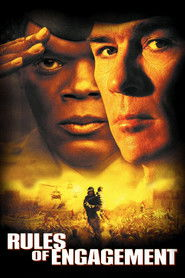 | Yes | 2000-04-07 | Paramount Pictures | Unknown | Unknown | Unknown | [source](FEL.txt (curated Profile 7 FEL list)) | [TMDB](https://www.themoviedb.org/movie/10479) |
| Erin Brockovich |  | Yes | 2000-03-17 | Jersey Films | Unknown | Unknown | Unknown | [source](https://docs.google.com/spreadsheets/d/15i0a84uiBtWiHZ5CXZZ7wygLFXwYOd84/edit?gid=828864432#gid=828864432) | [TMDB](https://www.themoviedb.org/movie/462) |
| You Can Count on Me |  | Yes | 2000-03-03 | Crush Entertainment | Unknown | Unknown | Unknown | [source](https://old.reddit.com/r/CoreELEC/comments/1jamlw6/list_of_dolby_vision_p7fel_films/) | [TMDB](https://www.themoviedb.org/movie/14295) |
| Reindeer Games |  | Yes | 2000-02-25 | Dimension Films | Unknown | Unknown | Unknown | [source](https://github.com/iammarxg/FEL) | [TMDB](https://www.themoviedb.org/movie/2155) |
| Scream 3 |  | Yes | 2000-02-04 | Dimension Films | Unknown | Unknown | Unknown | [source](https://forum.blu-ray.com/showthread.php?page=7&t=360081) | [TMDB](https://www.themoviedb.org/movie/4234) |
| Galaxy Quest |  | Yes | 1999-12-25 | DreamWorks Pictures | Unknown | Unknown | Unknown | [source](https://github.com/iammarxg/FEL) | [TMDB](https://www.themoviedb.org/movie/926) |
| End of Days | 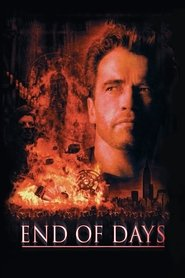 | Yes | 1999-11-24 | Beacon Communications | Unknown | Unknown | Unknown | [source](https://old.reddit.com/r/CoreELEC/comments/1jamlw6/list_of_dolby_vision_p7fel_films/) | [TMDB](https://www.themoviedb.org/movie/9946) |
| Sleepy Hollow |  | Yes | 1999-11-19 | Paramount Pictures | Unknown | Unknown | Unknown | [source](https://github.com/iammarxg/FEL) | [TMDB](https://www.themoviedb.org/movie/2668) |
| The Bone Collector |  | Yes | 1999-11-04 | Universal Pictures | Unknown | Unknown | Unknown | [source](https://old.reddit.com/r/CoreELEC/comments/1jamlw6/list_of_dolby_vision_p7fel_films/) | [TMDB](https://www.themoviedb.org/movie/9481) |
| Bringing Out the Dead |  | Yes | 1999-10-22 | Scott Rudin Productions | Unknown | Unknown | Unknown | [source](https://old.reddit.com/r/CoreELEC/comments/1jamlw6/list_of_dolby_vision_p7fel_films/) | [TMDB](https://www.themoviedb.org/movie/8649) |
| The Limey |  | Yes | 1999-10-08 | Artisan Entertainment | Unknown | Unknown | enhancement_bitrate_mbps: 6.07 | [source](https://forum.blu-ray.com/showthread.php?t=276448) | [TMDB](https://www.themoviedb.org/movie/10388) |
| Double Jeopardy |  | Yes | 1999-09-24 | Paramount Pictures | Unknown | Unknown | Unknown | [source](https://forum.blu-ray.com/showthread.php?page=4&t=372842) | [TMDB](https://www.themoviedb.org/movie/10398) |
| Stir of Echoes |  | Yes | 1999-09-10 | Artisan Entertainment | Unknown | Unknown | Unknown | [source](https://forum.blu-ray.com/forumdisplay.php?f=203) | [TMDB](https://www.themoviedb.org/movie/11601) |
| The Ninth Gate |  | Yes | 1999-08-25 | R.P. Productions | Unknown | Unknown | Unknown | [source](https://forum.blu-ray.com/forumdisplay.php?f=203) | [TMDB](https://www.themoviedb.org/movie/622) |
| Mystery Men | 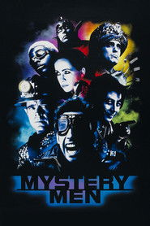 | Yes | 1999-08-06 | Universal Pictures | Unknown | Unknown | Unknown | [source](https://github.com/iammarxg/FEL) | [TMDB](https://www.themoviedb.org/movie/9824) |
| The Haunting |  | Yes | 1999-07-23 | DreamWorks Pictures | Unknown | Unknown | Unknown | [source](https://old.reddit.com/r/CoreELEC/comments/1jamlw6/list_of_dolby_vision_p7fel_films/) | [TMDB](https://www.themoviedb.org/movie/11618) |
| South Park Bigger Longer and Uncut |  | Yes | 1999-06-24 | Paramount Pictures | Unknown | Unknown | Unknown | [source](https://docs.google.com/spreadsheets/d/15i0a84uiBtWiHZ5CXZZ7wygLFXwYOd84/edit?gid=828864432#gid=828864432) | [TMDB](https://www.themoviedb.org/movie/9473) |
| The General's Daughter |  | Yes | 1999-06-18 | MFP Munich Film Partners GmbH & Company I. Produktions KG | Unknown | Unknown | Unknown | [source](FEL.txt (curated Profile 7 FEL list)) | [TMDB](https://www.themoviedb.org/movie/2275) |
| Election |  | Yes | 1999-04-23 | Paramount Pictures | Unknown | Unknown | Unknown | [source](https://docs.google.com/spreadsheets/d/15i0a84uiBtWiHZ5CXZZ7wygLFXwYOd84/edit?gid=828864432#gid=828864432) | [TMDB](https://www.themoviedb.org/movie/9451) |
| Gamera 3: Revenge of Iris |  | Yes | 1999-03-06 | Daiei Film | Unknown | Unknown | Unknown | [source](https://old.reddit.com/r/CoreELEC/comments/1jamlw6/list_of_dolby_vision_p7fel_films/) | [TMDB](https://www.themoviedb.org/movie/60159) |
| Varsity Blues |  | Yes | 1999-01-15 | MTV Films | Unknown | Unknown | Unknown | [source](https://docs.google.com/spreadsheets/d/15i0a84uiBtWiHZ5CXZZ7wygLFXwYOd84/edit?gid=828864432#gid=828864432) | [TMDB](https://www.themoviedb.org/movie/14709) |
| The Faculty |  | Yes | 1998-12-25 | Los Hooligans Productions | Unknown | Unknown | Unknown | [source](https://github.com/iammarxg/FEL) | [TMDB](https://www.themoviedb.org/movie/9276) |
| Star Trek: Insurrection |  | Yes | 1998-12-11 | Paramount Pictures | Unknown | Unknown | Unknown | [source](https://docs.google.com/spreadsheets/d/15i0a84uiBtWiHZ5CXZZ7wygLFXwYOd84/edit?gid=828864432#gid=828864432) | [TMDB](https://www.themoviedb.org/movie/200) |
| Rushmore |  | Yes | 1998-12-11 | Touchstone Pictures | Unknown | Unknown | Unknown | [source](https://forum.blu-ray.com/showthread.php?t=354888&page=2) | [TMDB](https://www.themoviedb.org/movie/11545) |
| A Bug's Life |  | Yes | 1998-11-25 | Pixar | Unknown | Unknown | Unknown | [source](FEL.txt (curated Profile 7 FEL list)) | [TMDB](https://www.themoviedb.org/movie/9487) |
| Babe: Pig in the City |  | Yes | 1998-11-25 | Kennedy Miller Productions | Unknown | Unknown | Unknown | [source](https://letterboxd.com/mikimajk/list/list-of-dolby-vision-p7-fel-films/) | [TMDB](https://www.themoviedb.org/movie/9447) |
| Belly |  | Yes | 1998-11-04 | Big Dog Films | Unknown | Unknown | Unknown | [source](https://github.com/iammarxg/FEL) | [TMDB](https://www.themoviedb.org/movie/12888) |
| Vampires |  | Yes | 1998-10-30 | Largo Entertainment | Unknown | Unknown | Unknown | [source](https://github.com/iammarxg/FEL) | [TMDB](https://www.themoviedb.org/movie/9945) |
| Bride of Chucky |  | Yes | 1998-10-15 | Universal Pictures | Unknown | Unknown | Unknown | [source](FEL.txt (curated Profile 7 FEL list)) | [TMDB](https://www.themoviedb.org/movie/11932) |
| Happiness |  | Yes | 1998-10-11 | Good Machine | Unknown | Unknown | Unknown | [source](https://github.com/iammarxg/FEL) | [TMDB](https://www.themoviedb.org/movie/10683) |
| Ronin |  | Yes | 1998-09-25 | United Artists | Unknown | Unknown | Unknown | [source](https://forum.blu-ray.com/showthread.php?t=327042&page=43) | [TMDB](https://www.themoviedb.org/movie/8195) |
| Blade | 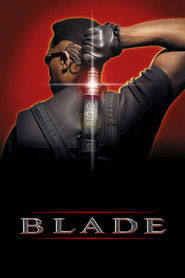 | Yes | 1998-08-21 | New Line Cinema | Unknown | Unknown | Unknown | [source](https://forum.blu-ray.com/showthread.php?t=276448&page=11) | [TMDB](https://www.themoviedb.org/movie/36647) |
| Snake Eyes |  | Yes | 1998-08-07 | Paramount Pictures | Unknown | Unknown | Unknown | [source](https://forum.blu-ray.com/showthread.php?t=276448) | [TMDB](https://www.themoviedb.org/movie/8688) |
| Halloween H20: 20 Years Later |  | Yes | 1998-08-05 | Dimension Films | Unknown | Unknown | Unknown | [source](https://forum.blu-ray.com/showthread.php?t=327042&page=49) | [TMDB](https://www.themoviedb.org/movie/11675) |
| Saving Private Ryan |  | Yes | 1998-07-24 | DreamWorks Pictures | Unknown | Unknown | enhancement_bitrate_mbps: 5.80 | [source](https://forum.blu-ray.com/showthread.php?t=276448) | [TMDB](https://www.themoviedb.org/movie/857) |
| Pi |  | Yes | 1998-07-10 | Harvest Filmworks | Unknown | Unknown | Unknown | [source](FEL.txt (curated Profile 7 FEL list)) | [TMDB](https://www.themoviedb.org/movie/473) |
| Small Soldiers |  | Yes | 1998-07-10 | DreamWorks Pictures | Unknown | Unknown | Unknown | [source](https://old.reddit.com/r/CoreELEC/comments/1jamlw6/list_of_dolby_vision_p7fel_films/) | [TMDB](https://www.themoviedb.org/movie/11551) |
| Out of Sight |  | Yes | 1998-06-26 | Universal Pictures | Unknown | Unknown | Unknown | [source](https://docs.google.com/spreadsheets/d/15i0a84uiBtWiHZ5CXZZ7wygLFXwYOd84/edit?gid=828864432#gid=828864432) | [TMDB](https://www.themoviedb.org/movie/1389) |
| The Truman Show |  | Yes | 1998-06-04 | Paramount Pictures | Unknown | Unknown | Unknown | [source](https://docs.google.com/spreadsheets/d/15i0a84uiBtWiHZ5CXZZ7wygLFXwYOd84/edit?gid=828864432#gid=828864432) | [TMDB](https://www.themoviedb.org/movie/37165) |
| Black Cat, White Cat |  | Yes | 1998-06-01 | CiBy 2000 | Unknown | Unknown | Unknown | [source](https://github.com/iammarxg/FEL) | [TMDB](https://www.themoviedb.org/movie/1075) |
| Fear and Loathing in Las Vegas |  | Yes | 1998-05-22 | Summit Entertainment | Unknown | Unknown | Unknown | [source](https://forum.blu-ray.com/showthread.php?t=327042&page=29) | [TMDB](https://www.themoviedb.org/movie/1878) |
| Deep Impact | 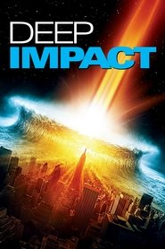 | Yes | 1998-05-08 | Paramount Pictures | Unknown | Unknown | Unknown | [source](https://docs.google.com/spreadsheets/d/15i0a84uiBtWiHZ5CXZZ7wygLFXwYOd84/edit?gid=828864432#gid=828864432) | [TMDB](https://www.themoviedb.org/movie/8656) |
| Species II |  | Yes | 1998-04-10 | Metro-Goldwyn-Mayer | Unknown | Unknown | Unknown | [source](https://old.reddit.com/r/CoreELEC/comments/1jamlw6/list_of_dolby_vision_p7fel_films/) | [TMDB](https://www.themoviedb.org/movie/10216) |
| The Man in the Iron Mask |  | Yes | 1998-03-12 | United Artists | Unknown | Unknown | Unknown | [source](https://github.com/iammarxg/FEL) | [TMDB](https://www.themoviedb.org/movie/9313) |
| Phantoms |  | Yes | 1998-01-23 | Dimension Films | Unknown | Unknown | Unknown | [source](https://github.com/iammarxg/FEL) | [TMDB](https://www.themoviedb.org/movie/9827) |
| Jackie Brown |  | Yes | 1997-12-25 | Miramax | Unknown | Unknown | Unknown | [source](https://github.com/iammarxg/FEL) | [TMDB](https://www.themoviedb.org/movie/184) |
| MouseHunt |  | Yes | 1997-12-19 | DreamWorks Pictures | Unknown | Unknown | Unknown | [source](https://old.reddit.com/r/CoreELEC/comments/1jamlw6/list_of_dolby_vision_p7fel_films/) | [TMDB](https://www.themoviedb.org/movie/6283) |
| Titanic |  | Yes | 1997-12-18 | Paramount Pictures | Unknown | Unknown | Unknown | [source](https://forum.blu-ray.com/showthread.php?t=276448&page=26) | [TMDB](https://www.themoviedb.org/movie/597) |
| Scream 2 |  | Yes | 1997-12-12 | Dimension Films | Unknown | Unknown | Unknown | [source](https://forum.blu-ray.com/showthread.php?t=276448&page=165) | [TMDB](https://www.themoviedb.org/movie/4233) |
| Gummo |  | Yes | 1997-10-17 | Independent Pictures | Unknown | Unknown | Unknown | [source](https://github.com/iammarxg/FEL) | [TMDB](https://www.themoviedb.org/movie/18415) |
| The Devil's Advocate |  | Yes | 1997-10-17 | Monarchy Enterprises B.V. | Unknown | Unknown | Unknown | [source](FEL.txt (curated Profile 7 FEL list)) | [TMDB](https://www.themoviedb.org/movie/1813) |
| The Peacemaker |  | Yes | 1997-09-26 | DreamWorks Pictures | Unknown | Unknown | Unknown | [source](https://old.reddit.com/r/CoreELEC/comments/1jamlw6/list_of_dolby_vision_p7fel_films/) | [TMDB](https://www.themoviedb.org/movie/6623) |
| In & Out |  | Yes | 1997-09-10 | Paramount Pictures | Unknown | Unknown | Unknown | [source](FEL.txt (curated Profile 7 FEL list)) | [TMDB](https://www.themoviedb.org/movie/10806) |
| Mimic |  | Yes | 1997-08-22 | Dimension Films | Unknown | Unknown | Unknown | [source](https://old.reddit.com/r/CoreELEC/comments/1jamlw6/list_of_dolby_vision_p7fel_films/) | [TMDB](https://www.themoviedb.org/movie/4961) |
| Event Horizon | 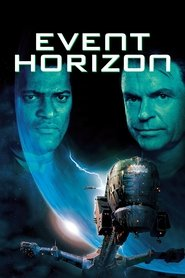 | Yes | 1997-08-15 | Impact Pictures | Unknown | Unknown | Unknown | [source](https://docs.google.com/spreadsheets/d/15i0a84uiBtWiHZ5CXZZ7wygLFXwYOd84/edit?gid=828864432#gid=828864432) | [TMDB](https://www.themoviedb.org/movie/8413) |
| Face/Off |  | Yes | 1997-06-27 | WCG Entertainment Productions | Unknown | Unknown | Unknown | [source](https://github.com/iammarxg/FEL) | [TMDB](https://www.themoviedb.org/movie/754) |
| Batman & Robin |  | Yes | 1997-06-20 | Warner Bros. Pictures | Unknown | Unknown | Unknown | [source](FEL.txt (curated Profile 7 FEL list)) | [TMDB](https://www.themoviedb.org/movie/415) |
| The Lost World: Jurassic Park |  | Yes | 1997-05-23 | Universal Pictures | Unknown | Unknown | Unknown | [source](https://docs.google.com/spreadsheets/d/15i0a84uiBtWiHZ5CXZZ7wygLFXwYOd84/edit?gid=828864432#gid=828864432) | [TMDB](https://www.themoviedb.org/movie/330) |
| Breakdown | 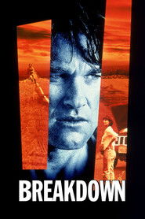 | Yes | 1997-05-02 | The De Laurentiis Company | Unknown | Unknown | Unknown | [source](https://docs.google.com/spreadsheets/d/15i0a84uiBtWiHZ5CXZZ7wygLFXwYOd84/edit?gid=828864432#gid=828864432) | [TMDB](https://www.themoviedb.org/movie/2163) |
| Anaconda |  | Yes | 1997-04-11 | St. Tropez Films | Unknown | Unknown | Unknown | [source](FEL.txt (curated Profile 7 FEL list)) | [TMDB](https://www.themoviedb.org/movie/9360) |
| Dante's Peak |  | Yes | 1997-02-07 | Pacific Western | Unknown | Unknown | Unknown | [source](FEL.txt (curated Profile 7 FEL list)) | [TMDB](https://www.themoviedb.org/movie/9619) |
| Lost Highway |  | Yes | 1997-01-15 | CiBy 2000 | Unknown | Unknown | Unknown | [source](https://forum.blu-ray.com/showthread.php?t=327042&page=29) | [TMDB](https://www.themoviedb.org/movie/638) |
| Turbulence | 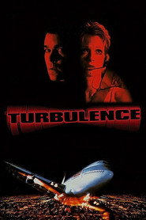 | Yes | 1997-01-09 | Rysher Entertainment | Unknown | Unknown | Unknown | [source](https://github.com/iammarxg/FEL) | [TMDB](https://www.themoviedb.org/movie/34314) |
| Things to Do in Denver |  | Yes | 1996 | Unknown | Unknown | Unknown | Unknown | [source](https://old.reddit.com/r/CoreELEC/comments/1jamlw6/list_of_dolby_vision_p7fel_films/) |  |
| Scream |  | Yes | 1996-12-20 | Dimension Films | Unknown | Unknown | Unknown | [source](https://docs.google.com/spreadsheets/d/15i0a84uiBtWiHZ5CXZZ7wygLFXwYOd84/edit?gid=828864432#gid=828864432) | [TMDB](https://www.themoviedb.org/movie/4232) |
| Daylight |  | Yes | 1996-12-06 | Davis Entertainment | Unknown | Unknown | Unknown | [source](https://docs.google.com/spreadsheets/d/1WiD-lECLFdOhCTW8_o9z92_-frsT-CSgo9xPuCcEpmQ/edit?usp=sharing) | [TMDB](https://www.themoviedb.org/movie/11228) |
| Star Trek: First Contact |  | Yes | 1996-11-22 | Paramount Pictures | Unknown | Unknown | Unknown | [source](https://docs.google.com/spreadsheets/d/1WiD-lECLFdOhCTW8_o9z92_-frsT-CSgo9xPuCcEpmQ/edit?usp=sharing) | [TMDB](https://www.themoviedb.org/movie/199) |
| Space Jam |  | Yes | 1996-11-15 | Warner Bros. Family Entertainment | Unknown | Unknown | Unknown | [source](FEL.txt (curated Profile 7 FEL list)) | [TMDB](https://www.themoviedb.org/movie/2300) |
| Uncle Sam |  | Yes | 1996-11-13 | A-Pix Entertainment | Unknown | Unknown | Unknown | [source](https://old.reddit.com/r/CoreELEC/comments/1jamlw6/list_of_dolby_vision_p7fel_films/) | [TMDB](https://www.themoviedb.org/movie/9680) |
| Bound |  | Yes | 1996-09-13 | The De Laurentiis Company | Unknown | Unknown | Unknown | [source](https://forum.blu-ray.com/showthread.php?t=327042&page=49) | [TMDB](https://www.themoviedb.org/movie/9303) |
| Curdled |  | Yes | 1996-09-06 | Tinderbox Films | Unknown | Unknown | Unknown | [source](https://old.reddit.com/r/CoreELEC/comments/1jamlw6/list_of_dolby_vision_p7fel_films/) | [TMDB](https://www.themoviedb.org/movie/12241) |
| Basquiat |  | Yes | 1996-08-09 | Eleventh Street Production | Unknown | Unknown | Unknown | [source](https://letterboxd.com/mikimajk/list/list-of-dolby-vision-p7-fel-films/) | [TMDB](https://www.themoviedb.org/movie/549) |
| Escape from L.A. | 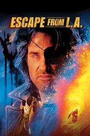 | Yes | 1996-08-09 | Paramount Pictures | Unknown | Unknown | Unknown | [source](FEL.txt (curated Profile 7 FEL list)) | [TMDB](https://www.themoviedb.org/movie/10061) |
| Gamera 2: Attack of Legion |  | Yes | 1996-07-12 | Tokuma International | Unknown | Unknown | Unknown | [source](https://old.reddit.com/r/CoreELEC/comments/1jamlw6/list_of_dolby_vision_p7fel_films/) | [TMDB](https://www.themoviedb.org/movie/59480) |
| Kingpin |  | Yes | 1996-07-04 | Motion Picture Corporation of America | Unknown | Unknown | Unknown | [source](https://old.reddit.com/r/CoreELEC/comments/1jamlw6/list_of_dolby_vision_p7fel_films/) | [TMDB](https://www.themoviedb.org/movie/11543) |
| Lone Star |  | Yes | 1996-06-21 | Castle Rock Entertainment | Unknown | Unknown | Unknown | [source](https://github.com/iammarxg/FEL) | [TMDB](https://www.themoviedb.org/movie/26748) |
| The Phantom |  | Yes | 1996-06-06 | Paramount Pictures | Unknown | Unknown | Unknown | [source](https://forum.blu-ray.com/showthread.php?t=276448&page=30) | [TMDB](https://www.themoviedb.org/movie/9826) |
| DragonHeart |  | Yes | 1996-05-31 | Universal Pictures | Unknown | Unknown | Unknown | [source](https://github.com/iammarxg/FEL) | [TMDB](https://www.themoviedb.org/movie/8840) |
| Mission: Impossible |  | Yes | 1996-05-22 | Paramount Pictures | Unknown | Unknown | enhancement_bitrate_mbps: 6.34 | [source](https://forum.blu-ray.com/showthread.php?t=276448) | [TMDB](https://www.themoviedb.org/movie/954) |
| Primal Fear |  | Yes | 1996-04-03 | Paramount Pictures | Unknown | Unknown | Unknown | [source](https://docs.google.com/spreadsheets/d/15i0a84uiBtWiHZ5CXZZ7wygLFXwYOd84/edit?gid=828864432#gid=828864432) | [TMDB](https://www.themoviedb.org/movie/1592) |
| Fargo | 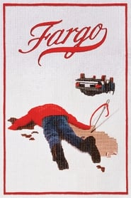 | Yes | 1996-03-08 | PolyGram Filmed Entertainment | Unknown | Unknown | Unknown | [source](https://forum.blu-ray.com/showthread.php?t=327042&page=21) | [TMDB](https://www.themoviedb.org/movie/275) |
| Trainspotting |  | Yes | 1996-02-23 | Figment Films | Unknown | Unknown | Unknown | [source](https://forum.blu-ray.com/showthread.php?t=327042&page=49) | [TMDB](https://www.themoviedb.org/movie/627) |
| Bottle Rocket |  | Yes | 1996-02-21 | Gracie Films | Unknown | Unknown | Unknown | [source](https://old.reddit.com/r/CoreELEC/comments/1jamlw6/list_of_dolby_vision_p7fel_films/) | [TMDB](https://www.themoviedb.org/movie/13685) |
| Happy Gilmore |  | Yes | 1996-02-16 | Universal Pictures | Unknown | Unknown | Unknown | [source](https://old.reddit.com/r/CoreELEC/comments/1jamlw6/list_of_dolby_vision_p7fel_films/) | [TMDB](https://www.themoviedb.org/movie/9614) |
| Black Sheep |  | Yes | 1996-02-02 | Paramount Pictures | Unknown | Unknown | Unknown | [source](https://letterboxd.com/mikimajk/list/list-of-dolby-vision-p7-fel-films/) | [TMDB](https://www.themoviedb.org/movie/13997) |
| FEL 7.13 Mbps La Haine |  | Yes | 1995 | Unknown | Unknown | Unknown | Unknown | [source](FEL.txt (curated Profile 7 FEL list)) |  |
| Cutthroat Island |  | Yes | 1995-12-22 | Carolco Pictures | Unknown | Unknown | Unknown | [source](FEL.txt (curated Profile 7 FEL list)) | [TMDB](https://www.themoviedb.org/movie/1408) |
| Things to Do in Denver When You're Dead |  | Yes | 1995-12-01 | Miramax | Unknown | Unknown | Unknown | [source](FEL.txt (curated Profile 7 FEL list)) | [TMDB](https://www.themoviedb.org/movie/400) |
| Ghost in the Shell |  | Yes | 1995-11-18 | Bandai Visual | Unknown | Unknown | enhancement_bitrate_mbps: 14.94 | [source](https://forum.blu-ray.com/showthread.php?t=276448) | [TMDB](https://www.themoviedb.org/movie/9323) |
| Leaving Las Vegas | 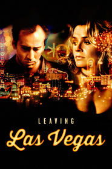 | Yes | 1995-10-27 | Initial Productions | Unknown | Unknown | Unknown | [source](https://old.reddit.com/r/CoreELEC/comments/1jamlw6/list_of_dolby_vision_p7fel_films/) | [TMDB](https://www.themoviedb.org/movie/451) |
| Sudden Death | 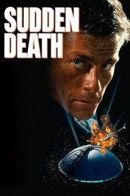 | Yes | 1995-10-27 | Shattered Productions | Unknown | Unknown | Unknown | [source](https://github.com/iammarxg/FEL) | [TMDB](https://www.themoviedb.org/movie/9091) |
| Devil in a Blue Dress |  | Yes | 1995-09-29 | Mundy Lane Entertainment | Unknown | Unknown | Unknown | [source](https://github.com/iammarxg/FEL) | [TMDB](https://www.themoviedb.org/movie/8512) |
| Halloween: The Curse of Michael Myers |  | Yes | 1995-09-29 | Halloween VI Productions | Unknown | Unknown | Unknown | [source](https://forum.blu-ray.com/showthread.php?t=360081&page=3) | [TMDB](https://www.themoviedb.org/movie/10987) |
| To Die For |  | Yes | 1995-09-22 | Columbia Pictures | Unknown | Unknown | Unknown | [source](https://github.com/iammarxg/FEL) | [TMDB](https://www.themoviedb.org/movie/577) |
| Hackers |  | Yes | 1995-09-14 | Suftley | Unknown | Unknown | Unknown | [source](https://github.com/iammarxg/FEL) | [TMDB](https://www.themoviedb.org/movie/10428) |
| Clueless |  | Yes | 1995-07-19 | Paramount Pictures | Unknown | Unknown | Unknown | [source](https://old.reddit.com/r/CoreELEC/comments/1jamlw6/list_of_dolby_vision_p7fel_films/) | [TMDB](https://www.themoviedb.org/movie/9603) |
| The Usual Suspects | 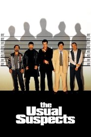 | Yes | 1995-07-19 | Bad Hat Harry Productions | Unknown | Unknown | Unknown | [source](https://forum.blu-ray.com/showthread.php?t=276448&page=171) | [TMDB](https://www.themoviedb.org/movie/629) |
| Babe |  | Yes | 1995-07-18 | Universal Pictures | Unknown | Unknown | Unknown | [source](https://letterboxd.com/mikimajk/list/list-of-dolby-vision-p7-fel-films/) | [TMDB](https://www.themoviedb.org/movie/9598) |
| Species |  | Yes | 1995-07-07 | Metro-Goldwyn-Mayer | Unknown | Unknown | Unknown | [source](https://old.reddit.com/r/CoreELEC/comments/1jamlw6/list_of_dolby_vision_p7fel_films/) | [TMDB](https://www.themoviedb.org/movie/9348) |
| Batman Forever | 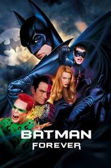 | Yes | 1995-06-16 | Warner Bros. Pictures | Unknown | Unknown | Unknown | [source](FEL.txt (curated Profile 7 FEL list)) | [TMDB](https://www.themoviedb.org/movie/414) |
| La Haine |  | Yes | 1995-05-31 | Kasso Productions | Unknown | Unknown | enhancement_bitrate_mbps: 3.93 | [source](https://forum.blu-ray.com/showthread.php?t=276448) | [TMDB](https://www.themoviedb.org/movie/406) |
| Casper |  | Yes | 1995-05-26 | The Harvey Entertainment Company | Unknown | Unknown | Unknown | [source](https://forum.blu-ray.com/showthread.php?t=387117&page=10) | [TMDB](https://www.themoviedb.org/movie/8839) |
| Braveheart |  | Yes | 1995-05-24 | The Ladd Company | Unknown | Unknown | enhancement_bitrate_mbps: 5.86 | [source](https://forum.blu-ray.com/showthread.php?t=276448) | [TMDB](https://www.themoviedb.org/movie/197) |
| Village of the Damned |  | Yes | 1995-04-28 | Universal Pictures | Unknown | Unknown | Unknown | [source](https://old.reddit.com/r/CoreELEC/comments/1jamlw6/list_of_dolby_vision_p7fel_films/) | [TMDB](https://www.themoviedb.org/movie/12122) |
| Bad Boys |  | Yes | 1995-04-07 | Columbia Pictures | Unknown | Unknown | Unknown | [source](https://forum.blu-ray.com/showthread.php?t=327042&page=15) | [TMDB](https://www.themoviedb.org/movie/9737) |
| Tank Girl |  | Yes | 1995-03-31 | Trilogy Entertainment Group | Unknown | Unknown | Unknown | [source](https://old.reddit.com/r/CoreElecOS/comments/1j3lgw2/list_of_dolby_vision_p7fel_films/) | [TMDB](https://www.themoviedb.org/movie/9067) |
| Tommy Boy |  | Yes | 1995-03-31 | Paramount Pictures | Unknown | Unknown | Unknown | [source](https://forum.blu-ray.com/showthread.php?t=387117&page=3) | [TMDB](https://www.themoviedb.org/movie/11381) |
| Gamera: Guardian of the Universe | 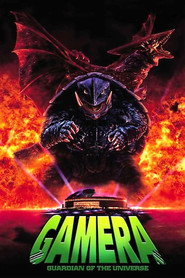 | Yes | 1995-03-11 | Nippon Television Network Corporation | Unknown | Unknown | Unknown | [source](https://old.reddit.com/r/CoreELEC/comments/1jamlw6/list_of_dolby_vision_p7fel_films/) | [TMDB](https://www.themoviedb.org/movie/54433) |
| Outbreak |  | Yes | 1995-03-10 | Kopelson Entertainment | Unknown | Unknown | Unknown | [source](https://old.reddit.com/r/CoreELEC/comments/1jamlw6/list_of_dolby_vision_p7fel_films/) | [TMDB](https://www.themoviedb.org/movie/6950) |
| Billy Madison |  | Yes | 1995-02-10 | Jack Giarraputo Productions | Unknown | Unknown | Unknown | [source](https://forum.blu-ray.com/showthread.php?t=387630&page=9) | [TMDB](https://www.themoviedb.org/movie/11017) |
| Murder in the First |  | Yes | 1995-01-20 | Wolper Organization | Unknown | Unknown | Unknown | [source](https://old.reddit.com/r/CoreELEC/comments/1jamlw6/list_of_dolby_vision_p7fel_films/) | [TMDB](https://www.themoviedb.org/movie/8438) |
| Nobody's Fool |  | Yes | 1994-12-23 | Capella International | Unknown | Unknown | Unknown | [source](https://forum.blu-ray.com/showthread.php?t=327042&page=27) | [TMDB](https://www.themoviedb.org/movie/11593) |
| Little Women |  | Yes | 1994-12-21 | Di Novi Pictures | Unknown | Unknown | Unknown | [source](https://old.reddit.com/r/CoreELEC/comments/1jamlw6/list_of_dolby_vision_p7fel_films/) | [TMDB](https://www.themoviedb.org/movie/9587) |
| Star Trek: Generations |  | Yes | 1994-11-18 | Paramount Pictures | Unknown | Unknown | Unknown | [source](https://docs.google.com/spreadsheets/d/15i0a84uiBtWiHZ5CXZZ7wygLFXwYOd84/edit?gid=828864432#gid=828864432) | [TMDB](https://www.themoviedb.org/movie/193) |
| Timecop | 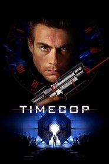 | Yes | 1994-09-15 | Renaissance Pictures | Unknown | Unknown | Unknown | [source](https://old.reddit.com/r/CoreELEC/comments/1jamlw6/list_of_dolby_vision_p7fel_films/) | [TMDB](https://www.themoviedb.org/movie/8831) |
| Léon: The Professional |  | Yes | 1994-09-14 | Gaumont | Unknown | Unknown | enhancement_bitrate_mbps: 14.21 | [source](https://forum.blu-ray.com/showthread.php?t=276448) | [TMDB](https://www.themoviedb.org/movie/101) |
| Pulp Fiction |  | Yes | 1994-09-10 | Miramax | Unknown | Unknown | Unknown | [source](https://forum.blu-ray.com/showthread.php?t=276448&page=172) | [TMDB](https://www.themoviedb.org/movie/680) |
| Natural Born Killers |  | Yes | 1994-08-26 | Warner Bros. Pictures | Unknown | Unknown | Unknown | [source](https://github.com/iammarxg/FEL) | [TMDB](https://www.themoviedb.org/movie/241) |
| The Adventures of Priscilla, Queen of the Desert |  | Yes | 1994-08-10 | PolyGram Filmed Entertainment | Unknown | Unknown | Unknown | [source](https://github.com/iammarxg/FEL) | [TMDB](https://www.themoviedb.org/movie/2759) |
| Clear and Present Danger |  | Yes | 1994-08-03 | Paramount Pictures | Unknown | Unknown | enhancement_bitrate_mbps: 7.60 | [source](https://forum.blu-ray.com/showthread.php?t=276448) | [TMDB](https://www.themoviedb.org/movie/9331) |
| True Lies |  | Yes | 1994-07-15 | Lightstorm Entertainment | Unknown | Unknown | Unknown | [source](https://forum.blu-ray.com/showthread.php?t=327042&page=52) | [TMDB](https://www.themoviedb.org/movie/36955) |
| Blown Away | 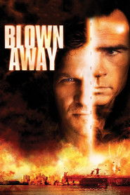 | Yes | 1994-07-01 | Trilogy Entertainment Group | Unknown | Unknown | Unknown | [source](https://github.com/iammarxg/FEL) | [TMDB](https://www.themoviedb.org/movie/178) |
| Forrest Gump |  | Yes | 1994-06-23 | Paramount Pictures | Unknown | Unknown | enhancement_bitrate_mbps: 7.44 | [source](https://forum.blu-ray.com/showthread.php?t=276448) | [TMDB](https://www.themoviedb.org/movie/13) |
| Beverly Hills Cop III |  | Yes | 1994-05-24 | Eddie Murphy Productions | Unknown | Unknown | Unknown | [source](https://docs.google.com/spreadsheets/d/15i0a84uiBtWiHZ5CXZZ7wygLFXwYOd84/edit?gid=828864432#gid=828864432) | [TMDB](https://www.themoviedb.org/movie/306) |
| Three Colors: Red |  | Yes | 1994-05-12 | MK2 Films | Unknown | Unknown | Unknown | [source](https://github.com/iammarxg/FEL) | [TMDB](https://www.themoviedb.org/movie/110) |
| The Crow |  | Yes | 1994-05-11 | Entertainment Media Investment | Unknown | Unknown | Unknown | [source](https://github.com/iammarxg/FEL) | [TMDB](https://www.themoviedb.org/movie/9495) |
| Ace Ventura: Pet Detective |  | Yes | 1994-02-04 | Morgan Creek Entertainment | Unknown | Unknown | Unknown | [source](https://letterboxd.com/mikimajk/list/list-of-dolby-vision-p7-fel-films/) | [TMDB](https://www.themoviedb.org/movie/3049) |
| Three Colors: White |  | Yes | 1994-01-26 | MK2 Films | Unknown | Unknown | Unknown | [source](https://github.com/iammarxg/FEL) | [TMDB](https://www.themoviedb.org/movie/109) |
| Schindlers List |  | Yes | 1993 | Unknown | Unknown | Unknown | Unknown | [source](https://docs.google.com/spreadsheets/d/15i0a84uiBtWiHZ5CXZZ7wygLFXwYOd84/edit?gid=828864432#gid=828864432) |  |
| Tombstone | 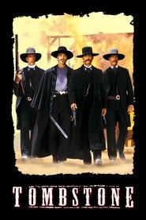 | Yes | 1993-12-25 | Cinergi Pictures | Unknown | Unknown | Unknown | [source](https://forum.blu-ray.com/showthread.php?t=354888&page=15) | [TMDB](https://www.themoviedb.org/movie/11969) |
| Philadelphia |  | Yes | 1993-12-22 | TriStar Pictures | Unknown | Unknown | Unknown | [source](https://forum.blu-ray.com/showthread.php?t=276448&page=18) | [TMDB](https://www.themoviedb.org/movie/9800) |
| Schindler's List |  | Yes | 1993-12-15 | Amblin Entertainment | Unknown | Unknown | enhancement_bitrate_mbps: 6.09 | [source](https://forum.blu-ray.com/showthread.php?t=276448) | [TMDB](https://www.themoviedb.org/movie/424) |
| Wayne's World 2 |  | Yes | 1993-12-10 | Paramount Pictures | Unknown | Unknown | Unknown | [source](FEL.txt (curated Profile 7 FEL list)) | [TMDB](https://www.themoviedb.org/movie/8873) |
| Little Buddha |  | Yes | 1993-12-01 | Recorded Picture Company | Unknown | Unknown | Unknown | [source](https://old.reddit.com/r/CoreELEC/comments/1jamlw6/list_of_dolby_vision_p7fel_films/) | [TMDB](https://www.themoviedb.org/movie/1689) |
| Addams Family Values |  | Yes | 1993-11-19 | Scott Rudin Productions | Unknown | Unknown | Unknown | [source](https://docs.google.com/spreadsheets/d/15i0a84uiBtWiHZ5CXZZ7wygLFXwYOd84/edit?gid=828864432#gid=828864432) | [TMDB](https://www.themoviedb.org/movie/2758) |
| Cronos |  | Yes | 1993-11-05 | Consejo Nacional para la Cultura y las Artes | Unknown | Unknown | Unknown | [source](https://github.com/iammarxg/FEL) | [TMDB](https://www.themoviedb.org/movie/11655) |
| A Bronx Tale | 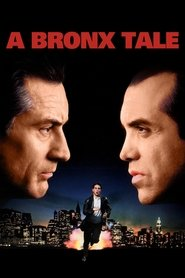 | Yes | 1993-10-01 | Price Entertainment | Unknown | Unknown | Unknown | [source](https://github.com/iammarxg/FEL) | [TMDB](https://www.themoviedb.org/movie/1607) |
| Dazed and Confused |  | Yes | 1993-09-24 | Gramercy Pictures | Unknown | Unknown | Unknown | [source](https://forum.blu-ray.com/showthread.php?t=276448&page=174) | [TMDB](https://www.themoviedb.org/movie/9571) |
| Three Colors: Blue |  | Yes | 1993-09-08 | MK2 Films | Unknown | Unknown | Unknown | [source](https://github.com/iammarxg/FEL) | [TMDB](https://www.themoviedb.org/movie/108) |
| Needful Things |  | Yes | 1993-08-27 | New Line Cinema | Unknown | Unknown | Unknown | [source](https://github.com/iammarxg/FEL) | [TMDB](https://www.themoviedb.org/movie/10657) |
| Coneheads |  | Yes | 1993-07-23 | Paramount Pictures | Unknown | Unknown | Unknown | [source](FEL.txt (curated Profile 7 FEL list)) | [TMDB](https://www.themoviedb.org/movie/9612) |
| The Firm |  | Yes | 1993-06-30 | Mirage Enterprises | Unknown | Unknown | Unknown | [source](https://docs.google.com/spreadsheets/d/15i0a84uiBtWiHZ5CXZZ7wygLFXwYOd84/edit?gid=828864432#gid=828864432) | [TMDB](https://www.themoviedb.org/movie/37233) |
| Jurassic Park |  | Yes | 1993-06-11 | Universal Pictures | Unknown | Unknown | Unknown | [source](https://docs.google.com/spreadsheets/d/15i0a84uiBtWiHZ5CXZZ7wygLFXwYOd84/edit?gid=828864432#gid=828864432) | [TMDB](https://www.themoviedb.org/movie/329) |
| Cliffhanger | 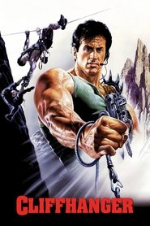 | Yes | 1993-05-28 | Carolco Pictures | Unknown | Unknown | enhancement_bitrate_mbps: 11.67 | [source](https://forum.blu-ray.com/showthread.php?t=276448) | [TMDB](https://www.themoviedb.org/movie/9350) |
| Menace II Society |  | Yes | 1993-05-26 | New Line Cinema | Unknown | Unknown | Unknown | [source](https://forum.blu-ray.com/showthread.php?t=276448) | [TMDB](https://www.themoviedb.org/movie/9516) |
| The Piano |  | Yes | 1993-05-18 | CiBy 2000 | Unknown | Unknown | Unknown | [source](https://forum.blu-ray.com/showthread.php?t=276448&page=161) | [TMDB](https://www.themoviedb.org/movie/713) |
| Hard Target |  | Yes | 1993-04-27 | Alphaville Films | Unknown | Unknown | Unknown | [source](https://forum.blu-ray.com/showthread.php?t=276448&page=159) | [TMDB](https://www.themoviedb.org/movie/2019) |
| Indecent Proposal |  | Yes | 1993-04-07 | Paramount Pictures | Unknown | Unknown | Unknown | [source](https://github.com/iammarxg/FEL) | [TMDB](https://www.themoviedb.org/movie/4478) |
| Groundhog Day |  | Yes | 1993-02-11 | Columbia Pictures | Unknown | Unknown | Unknown | [source](https://forum.blu-ray.com/showthread.php?t=276448&page=173) | [TMDB](https://www.themoviedb.org/movie/137) |
| Matinee | 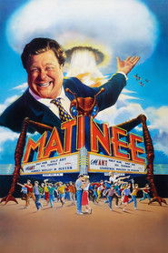 | Yes | 1993-01-29 | Falcon Productions | Unknown | Unknown | Unknown | [source](https://forum.blu-ray.com/showthread.php?t=372842&page=5) | [TMDB](https://www.themoviedb.org/movie/25389) |
| Leprechaun |  | Yes | 1993-01-08 | Trimark Pictures | Unknown | Unknown | Unknown | [source](https://old.reddit.com/r/CoreELEC/comments/1jamlw6/list_of_dolby_vision_p7fel_films/) | [TMDB](https://www.themoviedb.org/movie/11811) |
| Arizona Dream |  | Yes | 1993-01-06 | Constellation | Unknown | Unknown | Unknown | [source](https://github.com/iammarxg/FEL) | [TMDB](https://www.themoviedb.org/movie/11044) |
| Waynes world |  | Yes | 1992 | Unknown | Unknown | Unknown | Unknown | [source](https://docs.google.com/spreadsheets/d/15i0a84uiBtWiHZ5CXZZ7wygLFXwYOd84/edit?gid=828864432#gid=828864432) |  |
| Malcom X |  | Yes | 1992 | Unknown | Unknown | Unknown | Unknown | [source](https://forum.blu-ray.com/showthread.php?t=354888&page=8) |  |
| Maniac Cop 3: Badge of Silence |  | Yes | 1992-12-10 | NEO Motion Pictures | Unknown | Unknown | Unknown | [source](https://forum.blu-ray.com/showthread.php?t=276448) | [TMDB](https://www.themoviedb.org/movie/50687) |
| Bad Lieutenant |  | Yes | 1992-11-20 | Pressman Film | Unknown | Unknown | Unknown | [source](https://github.com/iammarxg/FEL) | [TMDB](https://www.themoviedb.org/movie/12143) |
| Malcolm X |  | Yes | 1992-11-18 | Warner Bros. Pictures | Unknown | Unknown | Unknown | [source](https://forum.blu-ray.com/showthread.php?p=20658059) | [TMDB](https://www.themoviedb.org/movie/1883) |
| Army of Darkness | 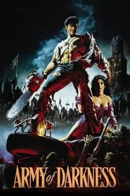 | Yes | 1992-10-31 | Renaissance Pictures | Unknown | Unknown | Unknown | [source](https://forum.blu-ray.com/showthread.php?t=327042&page=49) | [TMDB](https://www.themoviedb.org/movie/766) |
| Sneakers |  | Yes | 1992-09-09 | Universal Pictures | Unknown | Unknown | Unknown | [source](https://old.reddit.com/r/CoreELEC/comments/1jamlw6/list_of_dolby_vision_p7fel_films/) | [TMDB](https://www.themoviedb.org/movie/2322) |
| RESERVOIR DOGS |  | Yes | 1992-09-02 | Live Entertainment | Unknown | Unknown | Unknown | [source](https://docs.google.com/spreadsheets/d/15i0a84uiBtWiHZ5CXZZ7wygLFXwYOd84/edit?gid=828864432#gid=828864432) | [TMDB](https://www.themoviedb.org/movie/500) |
| Death Becomes Her |  | Yes | 1992-07-30 | Universal Pictures | Unknown | Unknown | Unknown | [source](https://github.com/iammarxg/FEL) | [TMDB](https://www.themoviedb.org/movie/9374) |
| Universal Soldier |  | Yes | 1992-07-10 | Carolco Pictures | Unknown | Unknown | enhancement_bitrate_mbps: 16.04 | [source](https://forum.blu-ray.com/showthread.php?t=276448) | [TMDB](https://www.themoviedb.org/movie/9349) |
| Patriot Games |  | Yes | 1992-06-04 | Paramount Pictures | Unknown | Unknown | enhancement_bitrate_mbps: 7.67 | [source](https://forum.blu-ray.com/showthread.php?t=276448) | [TMDB](https://www.themoviedb.org/movie/9869) |
| Far and Away |  | Yes | 1992-05-22 | Imagine Entertainment | Unknown | Unknown | Unknown | [source](https://github.com/iammarxg/FEL) | [TMDB](https://www.themoviedb.org/movie/11259) |
| Puppet Master III: Toulon's Revenge | 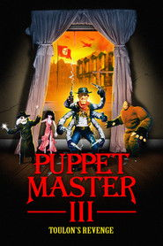 | Yes | 1992-05-01 | Full Moon Entertainment | Unknown | Unknown | Unknown | [source](https://github.com/iammarxg/FEL) | [TMDB](https://www.themoviedb.org/movie/26956) |
| Hard Boiled |  | Yes | 1992-04-16 | Golden Princess Film Productions | Unknown | Unknown | Unknown | [source](https://forum.blu-ray.com/showthread.php?t=327042&page=64) | [TMDB](https://www.themoviedb.org/movie/11782) |
| Basic Instinct |  | Yes | 1992-03-20 | Carolco Pictures | Unknown | Unknown | Unknown | [source](https://forum.blu-ray.com/showthread.php?t=276448) | [TMDB](https://www.themoviedb.org/movie/402) |
| Wayne's World |  | Yes | 1992-02-14 | Paramount Pictures | Unknown | Unknown | Unknown | [source](https://github.com/iammarxg/FEL) | [TMDB](https://www.themoviedb.org/movie/8872) |
| Juice |  | Yes | 1992-01-17 | Paramount Pictures | Unknown | Unknown | Unknown | [source](https://forum.blu-ray.com/showthread.php?t=276448&page=161) | [TMDB](https://www.themoviedb.org/movie/16136) |
| Jian yu feng yun II: Tao fan |  | Yes | 1991 | Unknown | Unknown | Unknown | Unknown | [source](https://old.reddit.com/r/CoreELEC/comments/1jamlw6/list_of_dolby_vision_p7fel_films/) |  |
| JFK |  | Yes | 1991-12-20 | Warner Bros. Pictures | Unknown | Unknown | Unknown | [source](https://github.com/iammarxg/FEL) | [TMDB](https://www.themoviedb.org/movie/820) |
| Star Trek VI: The Undiscovered Country |  | Yes | 1991-12-06 | Paramount Pictures | Unknown | Unknown | Unknown | [source](https://docs.google.com/spreadsheets/d/15i0a84uiBtWiHZ5CXZZ7wygLFXwYOd84/edit?gid=828864432#gid=828864432) | [TMDB](https://www.themoviedb.org/movie/174) |
| The Addams Family |  | Yes | 1991-11-22 | Paramount Pictures | Unknown | Unknown | Unknown | [source](https://forum.blu-ray.com/showthread.php?t=276448&page=158) | [TMDB](https://www.themoviedb.org/movie/2907) |
| The People Under the Stairs |  | Yes | 1991-11-01 | Alive Films | Unknown | Unknown | Unknown | [source](https://github.com/iammarxg/FEL) | [TMDB](https://www.themoviedb.org/movie/13122) |
| One False Move |  | Yes | 1991-10-12 | IRS Media | Unknown | Unknown | Unknown | [source](https://github.com/iammarxg/FEL) | [TMDB](https://www.themoviedb.org/movie/21128) |
| K2 |  | Yes | 1991-10-10 | Majestic Films International | Unknown | Unknown | Unknown | [source](https://old.reddit.com/r/CoreELEC/comments/1jamlw6/list_of_dolby_vision_p7fel_films/) | [TMDB](https://www.themoviedb.org/movie/24734) |
| The Fisher King |  | Yes | 1991-09-20 | TriStar Pictures | Unknown | Unknown | Unknown | [source](https://forum.blu-ray.com/showthread.php?t=354888&page=31) | [TMDB](https://www.themoviedb.org/movie/177) |
| Freddy's Dead: The Final Nightmare | 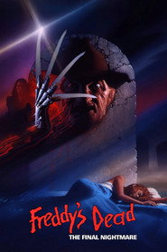 | Yes | 1991-09-05 | New Line Cinema | Unknown | Unknown | Unknown | [source](FEL.txt (curated Profile 7 FEL list)) | [TMDB](https://www.themoviedb.org/movie/11284) |
| Dead Again |  | Yes | 1991-08-23 | Mirage Enterprises | Unknown | Unknown | Unknown | [source](https://old.reddit.com/r/CoreELEC/comments/1jamlw6/list_of_dolby_vision_p7fel_films/) | [TMDB](https://www.themoviedb.org/movie/11498) |
| Body Parts |  | Yes | 1991-08-02 | Unknown | Unknown | Unknown | Unknown | [source](https://github.com/iammarxg/FEL) | [TMDB](https://www.themoviedb.org/movie/32146) |
| Bill & Ted's Bogus Journey |  | Yes | 1991-07-19 | Nelson Entertainment | Unknown | Unknown | Unknown | [source](FEL.txt (curated Profile 7 FEL list)) | [TMDB](https://www.themoviedb.org/movie/1649) |
| Point Break |  | Yes | 1991-07-12 | Largo Entertainment | Unknown | Unknown | Unknown | [source](https://discourse.coreelec.org/t/firecube-and-dolby-vision-profile-7/54019) | [TMDB](https://www.themoviedb.org/movie/1089) |
| Thelma & Louise |  | Yes | 1991-05-24 | Scott Free Productions | Unknown | Unknown | Unknown | [source](https://forum.blu-ray.com/showthread.php?t=327042&page=26) | [TMDB](https://www.themoviedb.org/movie/1541) |
| Stone Cold | 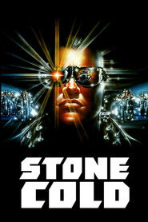 | Yes | 1991-05-17 | Stone Group Pictures | Unknown | Unknown | Unknown | [source](https://old.reddit.com/r/CoreELEC/comments/1jamlw6/list_of_dolby_vision_p7fel_films/) | [TMDB](https://www.themoviedb.org/movie/21338) |
| The Double Life of Véronique |  | Yes | 1991-05-15 | Sidéral Productions | Unknown | Unknown | Unknown | [source](https://github.com/iammarxg/FEL) | [TMDB](https://www.themoviedb.org/movie/1600) |
| Delicatessen |  | Yes | 1991-04-17 | Constellation | Unknown | Unknown | Unknown | [source](https://old.reddit.com/r/CoreELEC/comments/1jamlw6/list_of_dolby_vision_p7fel_films/) | [TMDB](https://www.themoviedb.org/movie/892) |
| Career Opportunities |  | Yes | 1991-03-29 | Hughes Entertainment | Unknown | Unknown | Unknown | [source](https://old.reddit.com/r/CoreELEC/comments/1jamlw6/list_of_dolby_vision_p7fel_films/) | [TMDB](https://www.themoviedb.org/movie/16270) |
| The Doors |  | Yes | 1991-03-01 | Carolco Pictures | Unknown | Unknown | enhancement_bitrate_mbps: 5.42 | [source](https://forum.blu-ray.com/showthread.php?t=276448) | [TMDB](https://www.themoviedb.org/movie/10537) |
| The Silence of the Lambs |  | Yes | 1991-02-14 | Orion Pictures | Unknown | Unknown | Unknown | [source](https://forum.blu-ray.com/showthread.php?t=276448) | [TMDB](https://www.themoviedb.org/movie/274) |
| Once a Thief |  | Yes | 1991-02-02 | Golden Princess Film Productions | Unknown | Unknown | Unknown | [source](https://old.reddit.com/r/CoreELEC/comments/1jamlw6/list_of_dolby_vision_p7fel_films/) | [TMDB](https://www.themoviedb.org/movie/47423) |
| The Godfather Part III |  | Yes | 1990-12-25 | Paramount Pictures | Unknown | Unknown | Unknown | [source](https://docs.google.com/spreadsheets/d/1WiD-lECLFdOhCTW8_o9z92_-frsT-CSgo9xPuCcEpmQ/edit?usp=sharing) | [TMDB](https://www.themoviedb.org/movie/242) |
| Arbor Day |  | Yes | 1990-12-22 | Unknown | Unknown | Unknown | Unknown | [source](https://letterboxd.com/mikimajk/list/list-of-dolby-vision-p7-fel-films/) | [TMDB](https://www.themoviedb.org/movie/1120025) |
| Kindergarten Cop |  | Yes | 1990-12-21 | Universal Pictures | Unknown | Unknown | Unknown | [source](https://old.reddit.com/r/CoreELEC/comments/1jamlw6/list_of_dolby_vision_p7fel_films/) | [TMDB](https://www.themoviedb.org/movie/951) |
| Edward Scissorhands |  | Yes | 1990-12-07 | 20th Century Fox | Unknown | Unknown | Unknown | [source](https://old.reddit.com/r/CoreELEC/comments/1jamlw6/list_of_dolby_vision_p7fel_films/) | [TMDB](https://www.themoviedb.org/movie/162) |
| Misery | 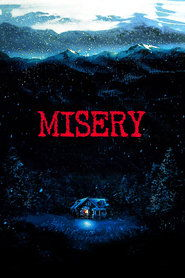 | Yes | 1990-11-30 | Castle Rock Entertainment | Unknown | Unknown | Unknown | [source](https://docs.google.com/spreadsheets/d/15i0a84uiBtWiHZ5CXZZ7wygLFXwYOd84/edit?gid=828864432#gid=828864432) | [TMDB](https://www.themoviedb.org/movie/1700) |
| Jacob's Ladder |  | Yes | 1990-11-02 | Carolco Pictures | Unknown | Unknown | Unknown | [source](FEL.txt (curated Profile 7 FEL list)) | [TMDB](https://www.themoviedb.org/movie/2291) |
| Graveyard Shift |  | Yes | 1990-10-26 | Paramount Pictures | Unknown | Unknown | Unknown | [source](https://github.com/iammarxg/FEL) | [TMDB](https://www.themoviedb.org/movie/19158) |
| Night of the Living Dead |  | Yes | 1990-10-19 | 21st Century Film Corporation | Unknown | Unknown | Unknown | [source](https://forum.blu-ray.com/showthread.php?t=387117&page=14) | [TMDB](https://www.themoviedb.org/movie/19185) |
| Quigley Down Under |  | Yes | 1990-10-17 | MGM-Pathé Communications | Unknown | Unknown | Unknown | [source](https://old.reddit.com/r/CoreELEC/comments/1jamlw6/list_of_dolby_vision_p7fel_films/) | [TMDB](https://www.themoviedb.org/movie/9588) |
| Darkman |  | Yes | 1990-08-24 | Universal Pictures | Unknown | Unknown | Unknown | [source](https://github.com/iammarxg/FEL) | [TMDB](https://www.themoviedb.org/movie/9556) |
| Bullet in the Head |  | Yes | 1990-08-17 | Golden Princess Film Productions | Unknown | Unknown | Unknown | [source](https://old.reddit.com/r/CoreElecOS/comments/1j3lgw2/list_of_dolby_vision_p7fel_films/) | [TMDB](https://www.themoviedb.org/movie/11909) |
| The Exorcist III |  | Yes | 1990-08-17 | Morgan Creek Entertainment | Unknown | Unknown | Unknown | [source](https://old.reddit.com/r/CoreELEC/comments/1jamlw6/list_of_dolby_vision_p7fel_films/) | [TMDB](https://www.themoviedb.org/movie/11587) |
| Air America |  | Yes | 1990-08-10 | IndieProd Company Productions | Unknown | Unknown | Unknown | [source](https://letterboxd.com/mikimajk/list/list-of-dolby-vision-p7-fel-films/) | [TMDB](https://www.themoviedb.org/movie/11856) |
| The Grifters |  | Yes | 1990-08-08 | Cineplex-Odeon Films | Unknown | Unknown | Unknown | [source](https://github.com/iammarxg/FEL) | [TMDB](https://www.themoviedb.org/movie/18129) |
| Maniac Cop 2 | 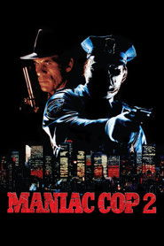 | Yes | 1990-07-18 | Overseas FilmGroup | Unknown | Unknown | Unknown | [source](https://forum.blu-ray.com/showthread.php?t=276448) | [TMDB](https://www.themoviedb.org/movie/28090) |
| Ghost |  | Yes | 1990-07-13 | Paramount Pictures | Unknown | Unknown | Unknown | [source](https://docs.google.com/spreadsheets/d/1WiD-lECLFdOhCTW8_o9z92_-frsT-CSgo9xPuCcEpmQ/edit?usp=sharing) | [TMDB](https://www.themoviedb.org/movie/251) |
| Days of Thunder |  | Yes | 1990-06-27 | Paramount Pictures | Unknown | Unknown | enhancement_bitrate_mbps: 6.36 | [source](https://forum.blu-ray.com/showthread.php?t=276448) | [TMDB](https://www.themoviedb.org/movie/2119) |
| RoboCop 2 | 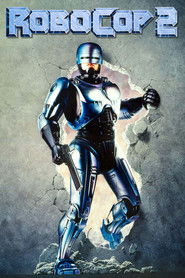 | Yes | 1990-06-22 | Orion Pictures | Unknown | Unknown | Unknown | [source](https://github.com/iammarxg/FEL) | [TMDB](https://www.themoviedb.org/movie/5549) |
| A Moment of Romance |  | Yes | 1990-06-14 | Paka Hill Film Production Co. | Unknown | Unknown | Unknown | [source](https://github.com/iammarxg/FEL) | [TMDB](https://www.themoviedb.org/movie/81128) |
| Another 48 hrs |  | Yes | 1990-06-08 | Paramount Pictures | Unknown | Unknown | Unknown | [source](https://docs.google.com/spreadsheets/d/15i0a84uiBtWiHZ5CXZZ7wygLFXwYOd84/edit?gid=828864432#gid=828864432) | [TMDB](https://www.themoviedb.org/movie/11595) |
| Total Recall |  | Yes | 1990-06-01 | Carolco Pictures | Unknown | Unknown | enhancement_bitrate_mbps: 3.11 | [source](https://forum.blu-ray.com/showthread.php?t=276448) | [TMDB](https://www.themoviedb.org/movie/861) |
| Back to the Future Part III |  | Yes | 1990-05-25 | Universal Pictures | Unknown | Unknown | enhancement_bitrate_mbps: 5.50 | [source](https://forum.blu-ray.com/showthread.php?t=276448) | [TMDB](https://www.themoviedb.org/movie/196) |
| Tales from the Darkside: The Movie |  | Yes | 1990-05-03 | Paramount Pictures | Unknown | Unknown | Unknown | [source](https://old.reddit.com/r/CoreELEC/comments/1jamlw6/list_of_dolby_vision_p7fel_films/) | [TMDB](https://www.themoviedb.org/movie/20701) |
| Cry-Baby |  | Yes | 1990-04-06 | Universal Pictures | Unknown | Unknown | Unknown | [source](https://old.reddit.com/r/CoreELEC/comments/1jamlw6/list_of_dolby_vision_p7fel_films/) | [TMDB](https://www.themoviedb.org/movie/9768) |
| Swordsman |  | Yes | 1990-04-05 | Film Workshop | Unknown | Unknown | Unknown | [source](https://old.reddit.com/r/CoreELEC/comments/1jamlw6/list_of_dolby_vision_p7fel_films/) | [TMDB](https://www.themoviedb.org/movie/18860) |
| The Hunt for Red October |  | Yes | 1990-03-02 | Paramount Pictures | Unknown | Unknown | Unknown | [source](https://docs.google.com/spreadsheets/d/15i0a84uiBtWiHZ5CXZZ7wygLFXwYOd84/edit?gid=828864432#gid=828864432) | [TMDB](https://www.themoviedb.org/movie/1669) |
| Nightbreed |  | Yes | 1990-02-16 | Seraphim Films | Unknown | Unknown | Unknown | [source](https://github.com/iammarxg/FEL) | [TMDB](https://www.themoviedb.org/movie/20481) |
| Dark Angel |  | Yes | 1990-01-26 | Vision International | Unknown | Unknown | Unknown | [source](https://old.reddit.com/r/CoreELEC/comments/1jamlw6/list_of_dolby_vision_p7fel_films/) | [TMDB](https://www.themoviedb.org/movie/19384) |
| Two Evil Eyes |  | Yes | 1990-01-25 | ADC Films | Unknown | Unknown | Unknown | [source](https://github.com/iammarxg/FEL) | [TMDB](https://www.themoviedb.org/movie/29514) |
| House Party |  | Yes | 1990-01-20 | New Line Cinema | Unknown | Unknown | Unknown | [source](https://old.reddit.com/r/CoreELEC/comments/1jamlw6/list_of_dolby_vision_p7fel_films/) | [TMDB](https://www.themoviedb.org/movie/16094) |
| Internal Affairs |  | Yes | 1990-01-12 | Paramount Pictures | Unknown | Unknown | Unknown | [source](https://github.com/iammarxg/FEL) | [TMDB](https://www.themoviedb.org/movie/11060) |
| Bill and ted excellent adventures |  | Yes | 1989 | Unknown | Unknown | Unknown | Unknown | [source](FEL.txt (curated Profile 7 FEL list)) |  |
| Born on the Fourth of July |  | Yes | 1989-12-20 | Universal Pictures | Unknown | Unknown | Unknown | [source](https://old.reddit.com/r/CoreELEC/comments/1jamlw6/list_of_dolby_vision_p7fel_films/) | [TMDB](https://www.themoviedb.org/movie/2604) |
| Glory |  | Yes | 1989-12-15 | Freddie Fields Productions | Unknown | Unknown | Unknown | [source](https://forum.blu-ray.com/showthread.php?t=276448&page=170) | [TMDB](https://www.themoviedb.org/movie/9665) |
| Back to the Future Part II |  | Yes | 1989-11-22 | Universal Pictures | Unknown | Unknown | enhancement_bitrate_mbps: 7.29 | [source](https://forum.blu-ray.com/showthread.php?t=276448) | [TMDB](https://www.themoviedb.org/movie/165) |
| For All Mankind |  | Yes | 1989-11-01 | Apollo Associates | Unknown | Unknown | Unknown | [source](https://forum.blu-ray.com/showthread.php?t=276448&page=161) | [TMDB](https://www.themoviedb.org/movie/20423) |
| A Better Tomorrow III: Love and Death in Saigon |  | Yes | 1989-10-20 | Film Workshop | Unknown | Unknown | Unknown | [source](https://letterboxd.com/mikimajk/list/list-of-dolby-vision-p7-fel-films/) | [TMDB](https://www.themoviedb.org/movie/41244) |
| Halloween 5: The Revenge of Michael Myers |  | Yes | 1989-10-12 | Magnum Pictures Inc. | Unknown | Unknown | Unknown | [source](https://forum.blu-ray.com/showthread.php?t=276448) | [TMDB](https://www.themoviedb.org/movie/11361) |
| Sea of Love |  | Yes | 1989-09-15 | Universal Pictures | Unknown | Unknown | Unknown | [source](https://github.com/iammarxg/FEL) | [TMDB](https://www.themoviedb.org/movie/12150) |
| Uncle Buck |  | Yes | 1989-08-16 | Hughes Entertainment | Unknown | Unknown | Unknown | [source](https://github.com/iammarxg/FEL) | [TMDB](https://www.themoviedb.org/movie/2616) |
| Lock Up |  | Yes | 1989-08-04 | Carolco Pictures | Unknown | Unknown | enhancement_bitrate_mbps: 3.27 | [source](https://forum.blu-ray.com/showthread.php?t=276448) | [TMDB](https://www.themoviedb.org/movie/9972) |
| UHF |  | Yes | 1989-07-21 | Cinecorp | Unknown | Unknown | Unknown | [source](https://github.com/iammarxg/FEL) | [TMDB](https://www.themoviedb.org/movie/11959) |
| Batman |  | Yes | 1989-06-21 | Warner Bros. Pictures | Unknown | Unknown | Unknown | [source](https://discourse.coreelec.org/t/firecube-and-dolby-vision-profile-7/54019) | [TMDB](https://www.themoviedb.org/movie/268) |
| The Karate Kid Part III |  | Yes | 1989-06-16 | Columbia Pictures | Unknown | Unknown | Unknown | [source](https://github.com/iammarxg/FEL) | [TMDB](https://www.themoviedb.org/movie/10495) |
| Star Trek V: The Final Frontier |  | Yes | 1989-06-09 | Paramount Pictures | Unknown | Unknown | Unknown | [source](https://docs.google.com/spreadsheets/d/15i0a84uiBtWiHZ5CXZZ7wygLFXwYOd84/edit?gid=828864432#gid=828864432) | [TMDB](https://www.themoviedb.org/movie/172) |
| Indiana Jones and the Last Crusade |  | Yes | 1989-05-24 | Paramount Pictures | Unknown | Unknown | Unknown | [source](https://forum.blu-ray.com/showthread.php?t=276448&page=150) | [TMDB](https://www.themoviedb.org/movie/89) |
| The Return of Swamp Thing |  | Yes | 1989-05-11 | Lightyear Entertainment | Unknown | Unknown | Unknown | [source](https://old.reddit.com/r/CoreELEC/comments/1jamlw6/list_of_dolby_vision_p7fel_films/) | [TMDB](https://www.themoviedb.org/movie/19142) |
| Pet Sematary |  | Yes | 1989-04-21 | Paramount Pictures | Unknown | Unknown | enhancement_bitrate_mbps: 6.21 | [source](https://forum.blu-ray.com/showthread.php?t=276448) | [TMDB](https://www.themoviedb.org/movie/8913) |
| Kickboxer |  | Yes | 1989-04-20 | Kings Road Entertainment | Unknown | Unknown | Unknown | [source](https://github.com/iammarxg/FEL) | [TMDB](https://www.themoviedb.org/movie/10222) |
| The Killer |  | Yes | 1989-03-24 | Film Workshop | Unknown | Unknown | Unknown | [source](https://old.reddit.com/r/CoreELEC/comments/1jamlw6/list_of_dolby_vision_p7fel_films/) | [TMDB](https://www.themoviedb.org/movie/10835) |
| Shocker |  | Yes | 1989-03-23 | Alive Films | Unknown | Unknown | Unknown | [source](https://forum.blu-ray.com/showthread.php?t=327042&page=22) | [TMDB](https://www.themoviedb.org/movie/12521) |
| Leviathan |  | Yes | 1989-03-17 | Gordon Company | Unknown | Unknown | Unknown | [source](https://github.com/iammarxg/FEL) | [TMDB](https://www.themoviedb.org/movie/14372) |
| Major League |  | Yes | 1989-02-16 | Mirage Enterprises | Unknown | Unknown | Unknown | [source](https://github.com/iammarxg/FEL) | [TMDB](https://www.themoviedb.org/movie/9942) |
| DeepStar Six |  | Yes | 1989-01-13 | TriStar Pictures | Unknown | Unknown | Unknown | [source](https://old.reddit.com/r/CoreELEC/comments/1jamlw6/list_of_dolby_vision_p7fel_films/) | [TMDB](https://www.themoviedb.org/movie/11607) |
| Rain Man |  | Yes | 1988-12-12 | United Artists | Unknown | Unknown | Unknown | [source](https://github.com/iammarxg/FEL) | [TMDB](https://www.themoviedb.org/movie/380) |
| The Adventures of Baron Munchausen |  | Yes | 1988-12-07 | Columbia Pictures | Unknown | Unknown | Unknown | [source](https://github.com/iammarxg/FEL) | [TMDB](https://www.themoviedb.org/movie/14506) |
| The Naked Gun: From the Files of Police Squad! |  | Yes | 1988-12-02 | Paramount Pictures | Unknown | Unknown | Unknown | [source](https://web.archive.org/web/20250308162437/https://discourse.coreelec.org/t/list-of-dolby-vision-p7-fel-films/52523) | [TMDB](https://www.themoviedb.org/movie/37136) |
| Scrooged |  | Yes | 1988-11-22 | Paramount Pictures | Unknown | Unknown | Unknown | [source](https://forum.blu-ray.com/showthread.php?t=276448&page=176) | [TMDB](https://www.themoviedb.org/movie/9647) |
| They Live |  | Yes | 1988-11-04 | Alive Films | Unknown | Unknown | enhancement_bitrate_mbps: 9.82 | [source](https://forum.blu-ray.com/showthread.php?t=276448) | [TMDB](https://www.themoviedb.org/movie/8337) |
| Halloween 4: The Return of Michael Myers |  | Yes | 1988-10-21 | Trancas International Films | Unknown | Unknown | Unknown | [source](https://forum.blu-ray.com/showthread.php?t=276448) | [TMDB](https://www.themoviedb.org/movie/11357) |
| Night of the Demons |  | Yes | 1988-10-14 | Meridian Productions | Unknown | Unknown | Unknown | [source](https://old.reddit.com/r/CoreELEC/comments/1jamlw6/list_of_dolby_vision_p7fel_films/) | [TMDB](https://www.themoviedb.org/movie/24924) |
| The Big Heat |  | Yes | 1988-09-22 | Film Workshop | Unknown | Unknown | Unknown | [source](https://old.reddit.com/r/CoreELEC/comments/1jamlw6/list_of_dolby_vision_p7fel_films/) | [TMDB](https://www.themoviedb.org/movie/104259) |
| Crossing Delancey |  | Yes | 1988-08-17 | Warner Bros. Pictures | Unknown | Unknown | Unknown | [source](https://github.com/iammarxg/FEL) | [TMDB](https://www.themoviedb.org/movie/27397) |
| Young Guns |  | Yes | 1988-08-12 | Morgan Creek Entertainment | Unknown | Unknown | Unknown | [source](https://github.com/iammarxg/FEL) | [TMDB](https://www.themoviedb.org/movie/11967) |
| Monkey Shines |  | Yes | 1988-07-29 | Orion Pictures | Unknown | Unknown | Unknown | [source](https://old.reddit.com/r/CoreELEC/comments/1jamlw6/list_of_dolby_vision_p7fel_films/) | [TMDB](https://www.themoviedb.org/movie/29787) |
| Midnight Run |  | Yes | 1988-07-20 | Universal Pictures | Unknown | Unknown | Unknown | [source](https://old.reddit.com/r/CoreELEC/comments/1jamlw6/list_of_dolby_vision_p7fel_films/) | [TMDB](https://www.themoviedb.org/movie/9013) |
| Coming to America |  | Yes | 1988-06-29 | Eddie Murphy Productions | Unknown | Unknown | enhancement_bitrate_mbps: 4.34 | [source](https://forum.blu-ray.com/showthread.php?t=276448) | [TMDB](https://www.themoviedb.org/movie/9602) |
| Red Heat |  | Yes | 1988-06-17 | Carolco Pictures | Unknown | Unknown | enhancement_bitrate_mbps: 3.15 | [source](https://forum.blu-ray.com/showthread.php?t=276448) | [TMDB](https://www.themoviedb.org/movie/9604) |
| The Great Outdoors |  | Yes | 1988-06-17 | Universal Pictures | Unknown | Unknown | Unknown | [source](https://forum.blu-ray.com/forumdisplay.php?f=203) | [TMDB](https://www.themoviedb.org/movie/2617) |
| Pumpkinhead |  | Yes | 1988-06-09 | DEG | Unknown | Unknown | Unknown | [source](https://forum.blu-ray.com/showthread.php?t=327042&page=49) | [TMDB](https://www.themoviedb.org/movie/26515) |
| Killer Klowns from Outer Space |  | Yes | 1988-05-27 | Sarlui / Diamant Production | Unknown | Unknown | Unknown | [source](https://old.reddit.com/r/CoreELEC/comments/1jamlw6/list_of_dolby_vision_p7fel_films/) | [TMDB](https://www.themoviedb.org/movie/16296) |
| Willow |  | Yes | 1988-05-20 | Metro-Goldwyn-Mayer | Unknown | Unknown | Unknown | [source](https://github.com/iammarxg/FEL) | [TMDB](https://www.themoviedb.org/movie/847) |
| Beetlejuice |  | Yes | 1988-03-30 | Geffen Pictures | Unknown | Unknown | Unknown | [source](FEL.txt (curated Profile 7 FEL list)) | [TMDB](https://www.themoviedb.org/movie/4011) |
| The Big Blue |  | Yes | 1988-02-13 | ZDF | Unknown | Unknown | Unknown | [source](https://old.reddit.com/r/CoreELEC/comments/1jamlw6/list_of_dolby_vision_p7fel_films/) | [TMDB](https://www.themoviedb.org/movie/657524) |
| Evil Dead II (Dead by Dawn |  | Yes | 1987 | Unknown | Unknown | Unknown | Unknown | [source](https://docs.google.com/spreadsheets/d/15i0a84uiBtWiHZ5CXZZ7wygLFXwYOd84/edit?gid=828864432#gid=828864432) |  |
| Chau tin dik tung wa |  | Yes | 1987 | Unknown | Unknown | Unknown | Unknown | [source](https://old.reddit.com/r/CoreELEC/comments/1jamlw6/list_of_dolby_vision_p7fel_films/) |  |
| Chou tin dik tong wah |  | Yes | 1987 | Unknown | Unknown | Unknown | Unknown | [source](https://github.com/iammarxg/FEL) |  |
| Gaam yuk fung wan |  | Yes | 1987 | Unknown | Unknown | Unknown | Unknown | [source](https://old.reddit.com/r/CoreELEC/comments/1jamlw6/list_of_dolby_vision_p7fel_films/) |  |
| The Last Emperor Criterion Collection |  | Yes | 1987 | Unknown | Unknown | Unknown | Unknown | [source](https://web.archive.org/web/20250308162437/https://discourse.coreelec.org/t/list-of-dolby-vision-p7-fel-films/52523) |  |
| A Better Tomorrow II |  | Yes | 1987-12-17 | Film Workshop | Unknown | Unknown | Unknown | [source](https://letterboxd.com/mikimajk/list/list-of-dolby-vision-p7-fel-films/) | [TMDB](https://www.themoviedb.org/movie/18305) |
| Throw Momma from the Train |  | Yes | 1987-12-11 | Orion Pictures | Unknown | Unknown | Unknown | [source](https://old.reddit.com/r/CoreELEC/comments/1jamlw6/list_of_dolby_vision_p7fel_films/) | [TMDB](https://www.themoviedb.org/movie/11896) |
| Planes, Trains, and Automobiles |  | Yes | 1987-11-26 | Paramount Pictures | Unknown | Unknown | Unknown | [source](https://docs.google.com/spreadsheets/d/15i0a84uiBtWiHZ5CXZZ7wygLFXwYOd84/edit?gid=828864432#gid=828864432) | [TMDB](https://www.themoviedb.org/movie/2609) |
| The Running Man |  | Yes | 1987-11-13 | Braveworld Productions | Unknown | Unknown | Unknown | [source](https://docs.google.com/spreadsheets/d/15i0a84uiBtWiHZ5CXZZ7wygLFXwYOd84/edit?gid=828864432#gid=828864432) | [TMDB](https://www.themoviedb.org/movie/865) |
| Prince of Darkness |  | Yes | 1987-10-23 | Alive Films | Unknown | Unknown | enhancement_bitrate_mbps: 9.81 | [source](https://forum.blu-ray.com/showthread.php?t=276448) | [TMDB](https://www.themoviedb.org/movie/8852) |
| The Last Emperor |  | Yes | 1987-10-04 | Soprofilms | Unknown | Unknown | Unknown | [source](https://github.com/iammarxg/FEL) | [TMDB](https://www.themoviedb.org/movie/746) |
| The Princess Bride |  | Yes | 1987-09-25 | The Princess Bride | Unknown | Unknown | enhancement_bitrate_mbps: 4.34 | [source](https://forum.blu-ray.com/showthread.php?t=276448) | [TMDB](https://www.themoviedb.org/movie/2493) |
| Fatal Attraction |  | Yes | 1987-09-18 | Paramount Pictures | Unknown | Unknown | Unknown | [source](https://old.reddit.com/r/CoreELEC/comments/1jamlw6/list_of_dolby_vision_p7fel_films/) | [TMDB](https://www.themoviedb.org/movie/10998) |
| The Dead |  | Yes | 1987-09-03 | Liffey Films | Unknown | Unknown | Unknown | [source](https://old.reddit.com/r/CoreELEC/comments/1jamlw6/list_of_dolby_vision_p7fel_films/) | [TMDB](https://www.themoviedb.org/movie/39507) |
| Dirty Dancing |  | Yes | 1987-08-21 | Great American Films Limited Partnership | Unknown | Unknown | Unknown | [source](https://forum.blu-ray.com/showthread.php?t=276448) | [TMDB](https://www.themoviedb.org/movie/88) |
| No Way Out |  | Yes | 1987-08-14 | Orion Pictures | Unknown | Unknown | Unknown | [source](https://forum.blu-ray.com/showthread.php?t=276448) | [TMDB](https://www.themoviedb.org/movie/10083) |
| The Monster Squad |  | Yes | 1987-08-14 | Keith Barish Productions | Unknown | Unknown | Unknown | [source](https://old.reddit.com/r/CoreELEC/comments/1jamlw6/list_of_dolby_vision_p7fel_films/) | [TMDB](https://www.themoviedb.org/movie/13509) |
| Ghoulies II |  | Yes | 1987-07-31 | Taryn Productions Inc. | Unknown | Unknown | Unknown | [source](FEL.txt (curated Profile 7 FEL list)) | [TMDB](https://www.themoviedb.org/movie/28605) |
| RoboCop |  | Yes | 1987-07-17 | Orion Pictures | Unknown | Unknown | Unknown | [source](https://forum.blu-ray.com/showthread.php?t=276448&page=166) | [TMDB](https://www.themoviedb.org/movie/5548) |
| An Autumn's Tale |  | Yes | 1987-07-16 | D & B Films | Unknown | Unknown | Unknown | [source](FEL.txt (curated Profile 7 FEL list)) | [TMDB](https://www.themoviedb.org/movie/64015) |
| Spaceballs |  | Yes | 1987-06-24 | Metro-Goldwyn-Mayer | Unknown | Unknown | Unknown | [source](https://forum.blu-ray.com/showthread.php?t=276448) | [TMDB](https://www.themoviedb.org/movie/957) |
| Deathstalker II: Duel of the Titans |  | Yes | 1987-06-03 | Aries Film International | Unknown | Unknown | Unknown | [source](https://old.reddit.com/r/CoreELEC/comments/1jamlw6/list_of_dolby_vision_p7fel_films/) | [TMDB](https://www.themoviedb.org/movie/28218) |
| The Untouchables |  | Yes | 1987-06-03 | Paramount Pictures | Unknown | Unknown | Unknown | [source](https://forum.blu-ray.com/forumdisplay.php?f=203) | [TMDB](https://www.themoviedb.org/movie/117) |
| Beverly Hills Cop II |  | Yes | 1987-05-18 | Eddie Murphy Productions | Unknown | Unknown | Unknown | [source](https://forum.blu-ray.com/showthread.php?t=276448&page=167) | [TMDB](https://www.themoviedb.org/movie/96) |
| Evil Dead 2 |  | Yes | 1987-03-13 | Rosebud Releasing Corporation | Unknown | Unknown | enhancement_bitrate_mbps: 13.87 | [source](https://forum.blu-ray.com/showthread.php?t=276448) | [TMDB](https://www.themoviedb.org/movie/765) |
| Evil Dead II |  | Yes | 1987-03-13 | Rosebud Releasing Corporation | Unknown | Unknown | Unknown | [source](https://forum.blu-ray.com/showthread.php?t=276448) | [TMDB](https://www.themoviedb.org/movie/765) |
| The Stepfather |  | Yes | 1987-01-23 | ITC Entertainment | Unknown | Unknown | Unknown | [source](https://old.reddit.com/r/CoreELEC/comments/1jamlw6/list_of_dolby_vision_p7fel_films/) | [TMDB](https://www.themoviedb.org/movie/25155) |
| Fu Rong Zhen |  | Yes | 1986 | Unknown | Unknown | Unknown | Unknown | [source](https://old.reddit.com/r/CoreELEC/comments/1jamlw6/list_of_dolby_vision_p7fel_films/) |  |
| Kyabarê |  | Yes | 1986 | Unknown | Unknown | Unknown | Unknown | [source](https://old.reddit.com/r/CoreELEC/comments/1jamlw6/list_of_dolby_vision_p7fel_films/) |  |
| Ying hung boon sik |  | Yes | 1986 | Unknown | Unknown | Unknown | Unknown | [source](https://old.reddit.com/r/CoreELEC/comments/1jamlw6/list_of_dolby_vision_p7fel_films/) |  |
| Platoon |  | Yes | 1986-12-19 | Hemdale Film Corporation | Unknown | Unknown | Unknown | [source](https://forum.blu-ray.com/showthread.php?t=276448&page=170) | [TMDB](https://www.themoviedb.org/movie/792) |
| Star Trek IV: The Voyage Home |  | Yes | 1986-11-26 | Paramount Pictures | Unknown | Unknown | Unknown | [source](https://docs.google.com/spreadsheets/d/15i0a84uiBtWiHZ5CXZZ7wygLFXwYOd84/edit?gid=828864432#gid=828864432) | [TMDB](https://www.themoviedb.org/movie/168) |
| Blue Velvet |  | Yes | 1986-09-19 | DEG | Unknown | Unknown | Unknown | [source](https://forum.blu-ray.com/showthread.php?t=327042&page=57) | [TMDB](https://www.themoviedb.org/movie/793) |
| Peking Opera Blues |  | Yes | 1986-09-06 | Film Workshop | Unknown | Unknown | Unknown | [source](https://old.reddit.com/r/CoreELEC/comments/1jamlw6/list_of_dolby_vision_p7fel_films/) | [TMDB](https://www.themoviedb.org/movie/39776) |
| Night of the Creeps |  | Yes | 1986-08-21 | TriStar Pictures | Unknown | Unknown | Unknown | [source](https://old.reddit.com/r/CoreELEC/comments/1jamlw6/list_of_dolby_vision_p7fel_films/) | [TMDB](https://www.themoviedb.org/movie/15762) |
| The Transformers: The Movie |  | Yes | 1986-08-08 | Marvel Productions | Unknown | Unknown | Unknown | [source](https://forum.blu-ray.com/showthread.php?t=276448) | [TMDB](https://www.themoviedb.org/movie/1857) |
| The Karate Kid Part II |  | Yes | 1986-06-18 | Columbia Pictures | Unknown | Unknown | Unknown | [source](https://github.com/iammarxg/FEL) | [TMDB](https://www.themoviedb.org/movie/8856) |
| Ferris Bueller's Day Off |  | Yes | 1986-06-11 | Paramount Pictures | Unknown | Unknown | Unknown | [source](https://forum.blu-ray.com/showthread.php?t=327042&page=43) | [TMDB](https://www.themoviedb.org/movie/9377) |
| Raw Deal |  | Yes | 1986-06-06 | DEG | Unknown | Unknown | Unknown | [source](https://old.reddit.com/r/CoreELEC/comments/1jamlw6/list_of_dolby_vision_p7fel_films/) | [TMDB](https://www.themoviedb.org/movie/2099) |
| Poltergeist II: The Other Side |  | Yes | 1986-05-23 | Metro-Goldwyn-Mayer | Unknown | Unknown | Unknown | [source](https://web.archive.org/web/20250308162437/https://discourse.coreelec.org/t/list-of-dolby-vision-p7-fel-films/52523) | [TMDB](https://www.themoviedb.org/movie/11133) |
| Top Gun |  | Yes | 1986-05-16 | Paramount Pictures | Unknown | Unknown | enhancement_bitrate_mbps: 4.79 | [source](https://forum.blu-ray.com/showthread.php?t=276448) | [TMDB](https://www.themoviedb.org/movie/744) |
| Jo Jo Dancer, Your Life Is Calling |  | Yes | 1986-05-02 | Columbia Pictures | Unknown | Unknown | Unknown | [source](https://old.reddit.com/r/CoreELEC/comments/1jamlw6/list_of_dolby_vision_p7fel_films/) | [TMDB](https://www.themoviedb.org/movie/63510) |
| Salvador |  | Yes | 1986-04-23 | Hemdale | Unknown | Unknown | Unknown | [source](https://old.reddit.com/r/CoreELEC/comments/1jamlw6/list_of_dolby_vision_p7fel_films/) | [TMDB](https://www.themoviedb.org/movie/6106) |
| April Fool's Day |  | Yes | 1986-03-27 | YCTM | Unknown | Unknown | Unknown | [source](FEL.txt (curated Profile 7 FEL list)) | [TMDB](https://www.themoviedb.org/movie/24913) |
| Highlander |  | Yes | 1986-03-07 | Davis-Panzer Productions | Unknown | Unknown | Unknown | [source](https://old.reddit.com/r/CoreElecOS/comments/1j3lgw2/list_of_dolby_vision_p7fel_films/) | [TMDB](https://www.themoviedb.org/movie/8009) |
| Pretty in Pink |  | Yes | 1986-02-28 | Paramount Pictures | Unknown | Unknown | Unknown | [source](https://github.com/iammarxg/FEL) | [TMDB](https://www.themoviedb.org/movie/11522) |
| The Delta Force |  | Yes | 1986-02-14 | The Cannon Group | Unknown | Unknown | Unknown | [source](https://github.com/iammarxg/FEL) | [TMDB](https://www.themoviedb.org/movie/16113) |
| L E The Breakfast Club |  | Yes | 1985 | Unknown | Unknown | Unknown | Unknown | [source](FEL.txt (curated Profile 7 FEL list)) |  |
| Out of Africa |  | Yes | 1985-12-20 | Universal Pictures | Unknown | Unknown | Unknown | [source](https://docs.google.com/spreadsheets/d/15i0a84uiBtWiHZ5CXZZ7wygLFXwYOd84/edit?gid=828864432#gid=828864432) | [TMDB](https://www.themoviedb.org/movie/606) |
| Clue |  | Yes | 1985-12-13 | Debra Hill Productions | Unknown | Unknown | Unknown | [source](https://old.reddit.com/r/CoreELEC/comments/1jamlw6/list_of_dolby_vision_p7fel_films/) | [TMDB](https://www.themoviedb.org/movie/15196) |
| Runaway Train |  | Yes | 1985-11-15 | Golan-Globus Productions | Unknown | Unknown | Unknown | [source](https://old.reddit.com/r/CoreELEC/comments/1jamlw6/list_of_dolby_vision_p7fel_films/) | [TMDB](https://www.themoviedb.org/movie/11893) |
| Death Wish 3 |  | Yes | 1985-11-01 | The Cannon Group | Unknown | Unknown | Unknown | [source](https://forum.blu-ray.com/showthread.php?t=360081&page=9) | [TMDB](https://www.themoviedb.org/movie/24873) |
| To Live and Die in L.A. |  | Yes | 1985-11-01 | SLM Production Group | Unknown | Unknown | Unknown | [source](FEL.txt (curated Profile 7 FEL list)) | [TMDB](https://www.themoviedb.org/movie/9846) |
| Remo Williams: The Adventure Begins |  | Yes | 1985-10-11 | Orion Pictures | Unknown | Unknown | Unknown | [source](https://old.reddit.com/r/CoreELEC/comments/1jamlw6/list_of_dolby_vision_p7fel_films/) | [TMDB](https://www.themoviedb.org/movie/10553) |
| Silver Bullet |  | Yes | 1985-10-10 | International Film Corporation (II) | Unknown | Unknown | Unknown | [source](https://forum.blu-ray.com/showthread.php?t=327042&page=49) | [TMDB](https://www.themoviedb.org/movie/17898) |
| After Hours |  | Yes | 1985-09-13 | Double Play | Unknown | Unknown | Unknown | [source](https://forum.blu-ray.com/showthread.php?t=327042&page=32) | [TMDB](https://www.themoviedb.org/movie/10843) |
| Better Off Dead... |  | Yes | 1985-08-23 | A&M Films | Unknown | Unknown | Unknown | [source](https://letterboxd.com/mikimajk/list/list-of-dolby-vision-p7-fel-films/) | [TMDB](https://www.themoviedb.org/movie/13667) |
| Kiss of the Spider Woman |  | Yes | 1985-07-26 | HB Filmes | Unknown | Unknown | Unknown | [source](https://old.reddit.com/r/CoreELEC/comments/1jamlw6/list_of_dolby_vision_p7fel_films/) | [TMDB](https://www.themoviedb.org/movie/11703) |
| Pee-wee's Big Adventure |  | Yes | 1985-07-26 | Aspen Film Society | Unknown | Unknown | Unknown | [source](FEL.txt (curated Profile 7 FEL list)) | [TMDB](https://www.themoviedb.org/movie/5683) |
| Back to the Future |  | Yes | 1985-07-03 | Universal Pictures | Unknown | Unknown | enhancement_bitrate_mbps: 5.24 | [source](https://forum.blu-ray.com/showthread.php?t=276448) | [TMDB](https://www.themoviedb.org/movie/105) |
| Pale Rider |  | Yes | 1985-06-28 | Warner Bros. Pictures | Unknown | Unknown | Unknown | [source](FEL.txt (curated Profile 7 FEL list)) | [TMDB](https://www.themoviedb.org/movie/8879) |
| Lifeforce |  | Yes | 1985-06-21 | Golan-Globus Productions | Unknown | Unknown | Unknown | [source](https://github.com/iammarxg/FEL) | [TMDB](https://www.themoviedb.org/movie/11954) |
| Let Him Rest in Peace |  | Yes | 1985-06-14 | KADOKAWA | Unknown | Unknown | Unknown | [source](https://old.reddit.com/r/CoreELEC/comments/1jamlw6/list_of_dolby_vision_p7fel_films/) | [TMDB](https://www.themoviedb.org/movie/226860) |
| Ran |  | Yes | 1985-06-01 | Nippon Herald Films | Unknown | Unknown | Unknown | [source](https://forum.blu-ray.com/showthread.php?t=276448) | [TMDB](https://www.themoviedb.org/movie/11645) |
| Subway |  | Yes | 1985-04-10 | Gaumont | Unknown | Unknown | Unknown | [source](https://old.reddit.com/r/CoreELEC/comments/1jamlw6/list_of_dolby_vision_p7fel_films/) | [TMDB](https://www.themoviedb.org/movie/10656) |
| Red Sonja |  | Yes | 1985-04-09 | The De Laurentiis Company | Unknown | Unknown | Unknown | [source](https://old.reddit.com/r/CoreELEC/comments/1jamlw6/list_of_dolby_vision_p7fel_films/) | [TMDB](https://www.themoviedb.org/movie/9626) |
| Brazil |  | Yes | 1985-02-20 | Embassy International Pictures | Unknown | Unknown | Unknown | [source](https://forum.blu-ray.com/forumdisplay.php?f=203) | [TMDB](https://www.themoviedb.org/movie/68) |
| The Breakfast Club |  | Yes | 1985-02-15 | Universal Pictures | Unknown | Unknown | Unknown | [source](https://old.reddit.com/r/CoreELEC/comments/1jamlw6/list_of_dolby_vision_p7fel_films/) | [TMDB](https://www.themoviedb.org/movie/2108) |
| Blood Simple |  | Yes | 1985-01-18 | River Road Productions | Unknown | Unknown | Unknown | [source](https://github.com/iammarxg/FEL) | [TMDB](https://www.themoviedb.org/movie/11368) |
| Ghoulies |  | Yes | 1985-01-18 | Empire Pictures | Unknown | Unknown | Unknown | [source](FEL.txt (curated Profile 7 FEL list)) | [TMDB](https://www.themoviedb.org/movie/18498) |
| Talking heads - stop making sense from |  | Yes | 1984 | Unknown | Unknown | Unknown | Unknown | [source](https://old.reddit.com/r/CoreElecOS/comments/1j3lgw2/list_of_dolby_vision_p7fel_films/) |  |
| Beverly Hills Cop |  | Yes | 1984-12-05 | Paramount Pictures | Unknown | Unknown | enhancement_bitrate_mbps: 5.75 | [source](https://forum.blu-ray.com/showthread.php?t=276448) | [TMDB](https://www.themoviedb.org/movie/90) |
| Night of the Comet |  | Yes | 1984-11-16 | Thomas Coleman and Michael Rosenblatt Productions | Unknown | Unknown | Unknown | [source](https://old.reddit.com/r/CoreELEC/comments/1jamlw6/list_of_dolby_vision_p7fel_films/) | [TMDB](https://www.themoviedb.org/movie/18462) |
| Stop Making Sense |  | Yes | 1984-10-19 | Talking Heads Films | Unknown | Unknown | Unknown | [source](https://old.reddit.com/r/CoreELEC/comments/1jamlw6/list_of_dolby_vision_p7fel_films/) | [TMDB](https://www.themoviedb.org/movie/24128) |
| Ninja III: The Domination |  | Yes | 1984-09-14 | The Cannon Group | Unknown | Unknown | Unknown | [source](https://old.reddit.com/r/CoreELEC/comments/1jamlw6/list_of_dolby_vision_p7fel_films/) | [TMDB](https://www.themoviedb.org/movie/28148) |
| Choose Me |  | Yes | 1984-08-29 | Island Alive | Unknown | Unknown | Unknown | [source](https://old.reddit.com/r/CoreELEC/comments/1jamlw6/list_of_dolby_vision_p7fel_films/) | [TMDB](https://www.themoviedb.org/movie/42086) |
| Red Dawn |  | Yes | 1984-08-10 | United Artists | Unknown | Unknown | Unknown | [source](https://forum.blu-ray.com/showthread.php?t=276448&page=170) | [TMDB](https://www.themoviedb.org/movie/1880) |
| Paris, Texas |  | Yes | 1984-07-16 | Road Movies | Unknown | Unknown | Unknown | [source](https://github.com/iammarxg/FEL) | [TMDB](https://www.themoviedb.org/movie/655) |
| UFOria |  | Yes | 1984-07-10 | Melvin Simon Productions | Unknown | Unknown | Unknown | [source](https://old.reddit.com/r/CoreELEC/comments/1jamlw6/list_of_dolby_vision_p7fel_films/) | [TMDB](https://www.themoviedb.org/movie/6696) |
| Top Secret! |  | Yes | 1984-06-22 | Paramount Pictures | Unknown | Unknown | Unknown | [source](https://docs.google.com/spreadsheets/d/15i0a84uiBtWiHZ5CXZZ7wygLFXwYOd84/edit?gid=828864432#gid=828864432) | [TMDB](https://www.themoviedb.org/movie/8764) |
| The Karate Kid |  | Yes | 1984-06-22 | Columbia Pictures | Unknown | Unknown | Unknown | [source](https://forum.blu-ray.com/showthread.php?t=276448&page=158) | [TMDB](https://www.themoviedb.org/movie/1885) |
| Gremlins |  | Yes | 1984-06-08 | Amblin Entertainment | Unknown | Unknown | Unknown | [source](https://forum.blu-ray.com/showthread.php?t=276448&page=121) | [TMDB](https://www.themoviedb.org/movie/927) |
| Star Trek III: The Search for Spock |  | Yes | 1984-06-01 | Paramount Pictures | Unknown | Unknown | Unknown | [source](https://docs.google.com/spreadsheets/d/15i0a84uiBtWiHZ5CXZZ7wygLFXwYOd84/edit?gid=828864432#gid=828864432) | [TMDB](https://www.themoviedb.org/movie/157) |
| Streets of Fire |  | Yes | 1984-06-01 | Universal Pictures | Unknown | Unknown | Unknown | [source](https://old.reddit.com/r/CoreELEC/comments/1jamlw6/list_of_dolby_vision_p7fel_films/) | [TMDB](https://www.themoviedb.org/movie/14746) |
| Indiana Jones and the Temple of Doom |  | Yes | 1984-05-23 | Paramount Pictures | Unknown | Unknown | Unknown | [source](https://forum.blu-ray.com/showthread.php?t=276448&page=150) | [TMDB](https://www.themoviedb.org/movie/87) |
| Children of the Corn |  | Yes | 1984-03-09 | Planet Productions | Unknown | Unknown | Unknown | [source](https://forum.blu-ray.com/showthread.php?t=276448&page=156) | [TMDB](https://www.themoviedb.org/movie/10823) |
| Repo Man |  | Yes | 1984-03-02 | Edge City Productions | Unknown | Unknown | Unknown | [source](https://github.com/iammarxg/FEL) | [TMDB](https://www.themoviedb.org/movie/13820) |
| This Is Spinal Tap |  | Yes | 1984-03-02 | Spinal Tap Prod. | Unknown | Unknown | Unknown | [source](https://old.reddit.com/r/CoreELEC/comments/1jamlw6/list_of_dolby_vision_p7fel_films/) | [TMDB](https://www.themoviedb.org/movie/11031) |
| FOOTLOOSE |  | Yes | 1984-02-17 | Paramount Pictures | Unknown | Unknown | Unknown | [source](https://docs.google.com/spreadsheets/d/15i0a84uiBtWiHZ5CXZZ7wygLFXwYOd84/edit?gid=828864432#gid=828864432) | [TMDB](https://www.themoviedb.org/movie/1788) |
| Terms of Endearment |  | Yes | 1983-11-20 | Paramount Pictures | Unknown | Unknown | Unknown | [source](https://github.com/iammarxg/FEL) | [TMDB](https://www.themoviedb.org/movie/11050) |
| A Christmas Story |  | Yes | 1983-11-18 | Metro-Goldwyn-Mayer | Unknown | Unknown | Unknown | [source](FEL.txt (curated Profile 7 FEL list)) | [TMDB](https://www.themoviedb.org/movie/850) |
| The Dead Zone |  | Yes | 1983-10-21 | The De Laurentiis Company | Unknown | Unknown | Unknown | [source](https://old.reddit.com/r/CoreELEC/comments/1jamlw6/list_of_dolby_vision_p7fel_films/) | [TMDB](https://www.themoviedb.org/movie/11336) |
| Revenge of the Ninja |  | Yes | 1983-09-07 | The Cannon Group | Unknown | Unknown | Unknown | [source](https://old.reddit.com/r/CoreELEC/comments/1jamlw6/list_of_dolby_vision_p7fel_films/) | [TMDB](https://www.themoviedb.org/movie/17386) |
| Deathstalker |  | Yes | 1983-09-02 | Palo Alto Productions | Unknown | Unknown | Unknown | [source](https://old.reddit.com/r/CoreELEC/comments/1jamlw6/list_of_dolby_vision_p7fel_films/) | [TMDB](https://www.themoviedb.org/movie/15895) |
| Cujo |  | Yes | 1983-08-10 | Sunn Classic Pictures | Unknown | Unknown | Unknown | [source](https://github.com/iammarxg/FEL) | [TMDB](https://www.themoviedb.org/movie/10489) |
| Risky Business |  | Yes | 1983-08-05 | Geffen Pictures | Unknown | Unknown | Unknown | [source](https://github.com/iammarxg/FEL) | [TMDB](https://www.themoviedb.org/movie/9346) |
| National Lampoon's Vacation |  | Yes | 1983-07-29 | Warner Bros. Pictures | Unknown | Unknown | Unknown | [source](FEL.txt (curated Profile 7 FEL list)) | [TMDB](https://www.themoviedb.org/movie/11153) |
| Jaws 3-D |  | Yes | 1983-07-22 | MCA  Theatricals | Unknown | Unknown | Unknown | [source](FEL.txt (curated Profile 7 FEL list)) | [TMDB](https://www.themoviedb.org/movie/17692) |
| Detective Story |  | Yes | 1983-07-16 | Toei Company | Unknown | Unknown | Unknown | [source](https://old.reddit.com/r/CoreELEC/comments/1jamlw6/list_of_dolby_vision_p7fel_films/) | [TMDB](https://www.themoviedb.org/movie/292674) |
| Staying Alive |  | Yes | 1983-07-11 | Paramount Pictures | Unknown | Unknown | Unknown | [source](https://old.reddit.com/r/CoreELEC/comments/1jamlw6/list_of_dolby_vision_p7fel_films/) | [TMDB](https://www.themoviedb.org/movie/10805) |
| Trading Places |  | Yes | 1983-06-07 | Cinema Group Ventures | Unknown | Unknown | Unknown | [source](https://docs.google.com/spreadsheets/d/15i0a84uiBtWiHZ5CXZZ7wygLFXwYOd84/edit?gid=828864432#gid=828864432) | [TMDB](https://www.themoviedb.org/movie/1621) |
| Flashdance |  | Yes | 1983-04-14 | Paramount Pictures | Unknown | Unknown | Unknown | [source](https://docs.google.com/spreadsheets/d/15i0a84uiBtWiHZ5CXZZ7wygLFXwYOd84/edit?gid=828864432#gid=828864432) | [TMDB](https://www.themoviedb.org/movie/535) |
| 10 to Midnight |  | Yes | 1983-03-11 | Y & M Productions | Unknown | Unknown | Unknown | [source](https://forum.blu-ray.com/forumdisplay.php?f=203) | [TMDB](https://www.themoviedb.org/movie/18587) |
| Uncommon Valor |  | Yes | 1983-01-22 | Unknown | Unknown | Unknown | Unknown | [source](https://old.reddit.com/r/CoreELEC/comments/1jamlw6/list_of_dolby_vision_p7fel_films/) | [TMDB](https://www.themoviedb.org/movie/358165) |
| Secrets of the Heavenly Book |  | Yes | 1983-01-01 | Shanghai Animation Film Studio | Unknown | Unknown | Unknown | [source](https://old.reddit.com/r/CoreELEC/comments/1jamlw6/list_of_dolby_vision_p7fel_films/) | [TMDB](https://www.themoviedb.org/movie/134575) |
| Kaseki no kouya |  | Yes | 1982 | Unknown | Unknown | Unknown | Unknown | [source](https://old.reddit.com/r/CoreELEC/comments/1jamlw6/list_of_dolby_vision_p7fel_films/) |  |
| Ninja Wars |  | Yes | 1982-12-18 | Toei Company | Unknown | Unknown | Unknown | [source](https://github.com/iammarxg/FEL) | [TMDB](https://www.themoviedb.org/movie/52970) |
| The Last Hero |  | Yes | 1982-12-18 | Toei Company | Unknown | Unknown | Unknown | [source](https://old.reddit.com/r/CoreELEC/comments/1jamlw6/list_of_dolby_vision_p7fel_films/) | [TMDB](https://www.themoviedb.org/movie/547151) |
| The Dark Crystal |  | Yes | 1982-12-17 | ITC Entertainment | Unknown | Unknown | Unknown | [source](https://forum.blu-ray.com/showthread.php?t=327042&page=57) | [TMDB](https://www.themoviedb.org/movie/11639) |
| Airplane II: The Sequel |  | Yes | 1982-12-10 | Paramount Pictures | Unknown | Unknown | Unknown | [source](https://letterboxd.com/mikimajk/list/list-of-dolby-vision-p7-fel-films/) | [TMDB](https://www.themoviedb.org/movie/2665) |
| 48 Hrs. |  | Yes | 1982-12-07 | Paramount Pictures | Unknown | Unknown | Unknown | [source](https://docs.google.com/spreadsheets/d/15i0a84uiBtWiHZ5CXZZ7wygLFXwYOd84/edit?gid=828864432#gid=828864432) | [TMDB](https://www.themoviedb.org/movie/150) |
| Gandhi |  | Yes | 1982-12-01 | Goldcrest | Unknown | Unknown | Unknown | [source](https://forum.blu-ray.com/showthread.php?t=327042) | [TMDB](https://www.themoviedb.org/movie/783) |
| The Last Unicorn |  | Yes | 1982-11-19 | Rankin/Bass Productions | Unknown | Unknown | Unknown | [source](https://github.com/iammarxg/FEL) | [TMDB](https://www.themoviedb.org/movie/10150) |
| Creepshow |  | Yes | 1982-11-10 | Laurel Entertainment | Unknown | Unknown | Unknown | [source](https://github.com/iammarxg/FEL) | [TMDB](https://www.themoviedb.org/movie/16281) |
| Halloween III: Season of the Witch |  | Yes | 1982-10-22 | The De Laurentiis Company | Unknown | Unknown | Unknown | [source](https://forum.blu-ray.com/showthread.php?t=276448) | [TMDB](https://www.themoviedb.org/movie/10676) |
| Tron |  | Yes | 1982-07-09 | Lisberger/Kushner Productions | Unknown | Unknown | Unknown | [source](https://old.reddit.com/r/CoreELEC/comments/1jamlw6/list_of_dolby_vision_p7fel_films/) | [TMDB](https://www.themoviedb.org/movie/97) |
| Blade Runner |  | Yes | 1982-06-25 | Shaw Brothers | Unknown | Unknown | Unknown | [source](FEL.txt (curated Profile 7 FEL list)) | [TMDB](https://www.themoviedb.org/movie/78) |
| Star Trek II: The Wrath of Khan |  | Yes | 1982-06-04 | Paramount Pictures | Unknown | Unknown | Unknown | [source](https://docs.google.com/spreadsheets/d/15i0a84uiBtWiHZ5CXZZ7wygLFXwYOd84/edit?gid=828864432#gid=828864432) | [TMDB](https://www.themoviedb.org/movie/154) |
| Forbidden World |  | Yes | 1982-05-07 | New World Pictures | Unknown | Unknown | Unknown | [source](https://old.reddit.com/r/CoreELEC/comments/1jamlw6/list_of_dolby_vision_p7fel_films/) | [TMDB](https://www.themoviedb.org/movie/42251) |
| Cat People |  | Yes | 1982-04-02 | Universal Pictures | Unknown | Unknown | Unknown | [source](https://github.com/iammarxg/FEL) | [TMDB](https://www.themoviedb.org/movie/6217) |
| The Sword and the Sorcerer |  | Yes | 1982-04-01 | Sorcerer Productions | Unknown | Unknown | Unknown | [source](https://forum.blu-ray.com/showthread.php?t=276448&page=163) | [TMDB](https://www.themoviedb.org/movie/13945) |
| Vigilante |  | Yes | 1982-03-18 | New Kim Cinematografica S.r.l. | Unknown | Unknown | enhancement_bitrate_mbps: 6.73 | [source](https://forum.blu-ray.com/showthread.php?t=276448) | [TMDB](https://www.themoviedb.org/movie/306529) |
| Vigili e vigilesse |  | Yes | 1982-03-18 | New Kim Cinematografica S.r.l. | Unknown | Unknown | Unknown | [source](https://forum.blu-ray.com/showthread.php?t=276448) | [TMDB](https://www.themoviedb.org/movie/306529) |
| The New York Ripper |  | Yes | 1982-03-04 | Fulvia Film | Unknown | Unknown | enhancement_bitrate_mbps: 6.85 | [source](https://forum.blu-ray.com/showthread.php?t=276448) | [TMDB](https://www.themoviedb.org/movie/30874) |
| Swamp Thing |  | Yes | 1982-02-19 | Melniker-Uslan Productions | Unknown | Unknown | Unknown | [source](https://github.com/iammarxg/FEL) | [TMDB](https://www.themoviedb.org/movie/17918) |
| Shaolin Temple |  | Yes | 1982-01-21 | Chung Yuen Motion Picture Co. | Unknown | Unknown | Unknown | [source](https://github.com/iammarxg/FEL) | [TMDB](https://www.themoviedb.org/movie/10275) |
| Evil Dead |  | Yes | 1981 | Unknown | Unknown | Unknown | Unknown | [source](https://docs.google.com/spreadsheets/d/15i0a84uiBtWiHZ5CXZZ7wygLFXwYOd84/edit?gid=828864432#gid=828864432) |  |
| Venom |  | Yes | 1981-11-28 | Morison Film Group | Unknown | Unknown | Unknown | [source](https://forum.blu-ray.com/showthread.php?t=276448) | [TMDB](https://www.themoviedb.org/movie/30789) |
| Halloween II |  | Yes | 1981-10-30 | The De Laurentiis Company | Unknown | Unknown | Unknown | [source](https://docs.google.com/spreadsheets/d/1WiD-lECLFdOhCTW8_o9z92_-frsT-CSgo9xPuCcEpmQ/edit?usp=sharing) | [TMDB](https://www.themoviedb.org/movie/11281) |
| The Evil Dead |  | Yes | 1981-10-15 | Renaissance Pictures | Unknown | Unknown | enhancement_bitrate_mbps: 7.49 | [source](https://forum.blu-ray.com/showthread.php?t=276448) | [TMDB](https://www.themoviedb.org/movie/764) |
| Galaxy of Terror |  | Yes | 1981-10-01 | New World Pictures | Unknown | Unknown | Unknown | [source](https://github.com/iammarxg/FEL) | [TMDB](https://www.themoviedb.org/movie/28893) |
| The Boogens |  | Yes | 1981-09-25 | Taft International Pictures | Unknown | Unknown | Unknown | [source](https://old.reddit.com/r/CoreELEC/comments/1jamlw6/list_of_dolby_vision_p7fel_films/) | [TMDB](https://www.themoviedb.org/movie/33721) |
| An American Werewolf in London |  | Yes | 1981-08-21 | Lyncanthrope Films | Unknown | Unknown | Unknown | [source](https://forum.blu-ray.com/showthread.php?t=276448) | [TMDB](https://www.themoviedb.org/movie/814) |
| The House by the Cemetery |  | Yes | 1981-08-14 | Fulvia Film | Unknown | Unknown | enhancement_bitrate_mbps: 4.73 | [source](https://forum.blu-ray.com/showthread.php?t=276448) | [TMDB](https://www.themoviedb.org/movie/28794) |
| Blow Out |  | Yes | 1981-07-24 | Cinema 77 | Unknown | Unknown | Unknown | [source](https://forum.blu-ray.com/showthread.php?t=327042&page=27) | [TMDB](https://www.themoviedb.org/movie/11644) |
| Enter the Ninja |  | Yes | 1981-07-17 | City Film | Unknown | Unknown | Unknown | [source](https://old.reddit.com/r/CoreELEC/comments/1jamlw6/list_of_dolby_vision_p7fel_films/) | [TMDB](https://www.themoviedb.org/movie/17205) |
| Suddenly in the Dark |  | Yes | 1981-07-17 | Nam-a Pictures | Unknown | Unknown | Unknown | [source](https://old.reddit.com/r/CoreELEC/comments/1jamlw6/list_of_dolby_vision_p7fel_films/) | [TMDB](https://www.themoviedb.org/movie/124310) |
| Time Bandits |  | Yes | 1981-07-13 | Handmade Films | Unknown | Unknown | Unknown | [source](https://github.com/iammarxg/FEL) | [TMDB](https://www.themoviedb.org/movie/36819) |
| Dragonslayer |  | Yes | 1981-06-26 | Paramount Pictures | Unknown | Unknown | Unknown | [source](https://docs.google.com/spreadsheets/d/15i0a84uiBtWiHZ5CXZZ7wygLFXwYOd84/edit?gid=828864432#gid=828864432) | [TMDB](https://www.themoviedb.org/movie/848) |
| Raiders of the Lost Ark |  | Yes | 1981-06-12 | Paramount Pictures | Unknown | Unknown | Unknown | [source](https://forum.blu-ray.com/showthread.php?t=327042&page=38) | [TMDB](https://www.themoviedb.org/movie/85) |
| Dead & Buried |  | Yes | 1981-05-29 | Barclays Mercantile Industrial Finance | Unknown | Unknown | Unknown | [source](FEL.txt (curated Profile 7 FEL list)) | [TMDB](https://www.themoviedb.org/movie/24274) |
| Escape from New York |  | Yes | 1981-05-23 | AVCO Embassy Pictures | Unknown | Unknown | enhancement_bitrate_mbps: 8.98 | [source](https://forum.blu-ray.com/showthread.php?t=276448) | [TMDB](https://www.themoviedb.org/movie/1103) |
| The Burning |  | Yes | 1981-05-08 | Miramax | Unknown | Unknown | Unknown | [source](https://github.com/iammarxg/FEL) | [TMDB](https://www.themoviedb.org/movie/24124) |
| Friday the 13th Part 2 |  | Yes | 1981-05-01 | Georgetown Productions | Unknown | Unknown | Unknown | [source](https://docs.google.com/spreadsheets/d/15i0a84uiBtWiHZ5CXZZ7wygLFXwYOd84/edit?gid=828864432#gid=828864432) | [TMDB](https://www.themoviedb.org/movie/9725) |
| Lion of the Desert |  | Yes | 1981-04-17 | Falcon International Productions | Unknown | Unknown | Unknown | [source](https://old.reddit.com/r/CoreELEC/comments/1jamlw6/list_of_dolby_vision_p7fel_films/) | [TMDB](https://www.themoviedb.org/movie/26843) |
| Thief |  | Yes | 1981-03-27 | Mann/Caan Productions | Unknown | Unknown | Unknown | [source](https://forum.blu-ray.com/showthread.php?t=354888&page=55) | [TMDB](https://www.themoviedb.org/movie/11524) |
| The Funhouse |  | Yes | 1981-03-13 | Mace Neufeld Productions | Unknown | Unknown | Unknown | [source](https://www.blu-ray.com/movies/Rabid-4K-Blu-ray/397990/) | [TMDB](https://www.themoviedb.org/movie/13555) |
| Diva |  | Yes | 1981-03-11 | Les Films Galaxie | Unknown | Unknown | Unknown | [source](https://old.reddit.com/r/CoreELEC/comments/1jamlw6/list_of_dolby_vision_p7fel_films/) | [TMDB](https://www.themoviedb.org/movie/4485) |
| My Bloody Valentine |  | Yes | 1981-02-11 | Secret Films | Unknown | Unknown | Unknown | [source](https://old.reddit.com/r/CoreELEC/comments/1jamlw6/list_of_dolby_vision_p7fel_films/) | [TMDB](https://www.themoviedb.org/movie/39874) |
| The Howling |  | Yes | 1981-01-21 | AVCO Embassy Pictures | Unknown | Unknown | Unknown | [source](https://forum.blu-ray.com/showthread.php?t=276448) | [TMDB](https://www.themoviedb.org/movie/11298) |
| L E Night of the Juggler |  | Yes | 1980 | Unknown | Unknown | Unknown | Unknown | [source](FEL.txt (curated Profile 7 FEL list)) |  |
| Altered States |  | Yes | 1980-12-25 | Warner Bros. Pictures | Unknown | Unknown | Unknown | [source](https://letterboxd.com/mikimajk/list/list-of-dolby-vision-p7-fel-films/) | [TMDB](https://www.themoviedb.org/movie/11542) |
| Maniac |  | Yes | 1980-11-14 | Magnum Motion Pictures Inc. | Unknown | Unknown | enhancement_bitrate_mbps: 4.76 | [source](https://forum.blu-ray.com/showthread.php?t=276448) | [TMDB](https://www.themoviedb.org/movie/27346) |
| The Beast to Die |  | Yes | 1980-10-04 | KADOKAWA | Unknown | Unknown | Unknown | [source](https://letterboxd.com/mikimajk/list/list-of-dolby-vision-p7-fel-films/) | [TMDB](https://www.themoviedb.org/movie/43964) |
| Somewhere in Time |  | Yes | 1980-10-02 | Universal Pictures | Unknown | Unknown | Unknown | [source](https://old.reddit.com/r/CoreELEC/comments/1jamlw6/list_of_dolby_vision_p7fel_films/) | [TMDB](https://www.themoviedb.org/movie/16633) |
| Motel Hell |  | Yes | 1980-08-14 | Camp Hill | Unknown | Unknown | Unknown | [source](FEL.txt (curated Profile 7 FEL list)) | [TMDB](https://www.themoviedb.org/movie/30924) |
| Xanadu |  | Yes | 1980-08-08 | Universal Pictures | Unknown | Unknown | Unknown | [source](https://old.reddit.com/r/CoreELEC/comments/1jamlw6/list_of_dolby_vision_p7fel_films/) | [TMDB](https://www.themoviedb.org/movie/15668) |
| Dressed to Kill |  | Yes | 1980-07-25 | Filmways Pictures | Unknown | Unknown | Unknown | [source](https://forum.blu-ray.com/showthread.php?t=276448&page=172) | [TMDB](https://www.themoviedb.org/movie/11033) |
| Used Cars |  | Yes | 1980-07-11 | Columbia Pictures | Unknown | Unknown | Unknown | [source](https://github.com/iammarxg/FEL) | [TMDB](https://www.themoviedb.org/movie/14475) |
| Airplane! |  | Yes | 1980-06-27 | Paramount Pictures | Unknown | Unknown | Unknown | [source](https://docs.google.com/spreadsheets/d/15i0a84uiBtWiHZ5CXZZ7wygLFXwYOd84/edit?gid=828864432#gid=828864432) | [TMDB](https://www.themoviedb.org/movie/813) |
| Night of the Juggler |  | Yes | 1980-06-06 | GCC Productions | Unknown | Unknown | Unknown | [source](https://old.reddit.com/r/CoreElecOS/comments/1j3lgw2/list_of_dolby_vision_p7fel_films/) | [TMDB](https://www.themoviedb.org/movie/44686) |
| Friday the 13th |  | Yes | 1980-05-09 | Sean S. Cunningham Films | Unknown | Unknown | Unknown | [source](https://forum.blu-ray.com/showthread.php?t=327042&page=22) | [TMDB](https://www.themoviedb.org/movie/4488) |
| Coal Miner's Daughter |  | Yes | 1980-03-07 | Universal Pictures | Unknown | Unknown | Unknown | [source](FEL.txt (curated Profile 7 FEL list)) | [TMDB](https://www.themoviedb.org/movie/16769) |
| The Fog |  | Yes | 1980-02-01 | AVCO Embassy Pictures | Unknown | Unknown | enhancement_bitrate_mbps: 11.24 | [source](https://forum.blu-ray.com/showthread.php?t=276448) | [TMDB](https://www.themoviedb.org/movie/790) |
| The Final Countdown |  | Yes | 1980-01-31 | Bryna Productions | Unknown | Unknown | Unknown | [source](https://forum.blu-ray.com/showthread.php?t=276448) | [TMDB](https://www.themoviedb.org/movie/8738) |
| Yomigaeru kinrô |  | Yes | 1979 | Unknown | Unknown | Unknown | Unknown | [source](https://old.reddit.com/r/CoreELEC/comments/1jamlw6/list_of_dolby_vision_p7fel_films/) |  |
| Star Trek: The Motion Picture |  | Yes | 1979-12-07 | Paramount Pictures | Unknown | Unknown | Unknown | [source](https://docs.google.com/spreadsheets/d/15i0a84uiBtWiHZ5CXZZ7wygLFXwYOd84/edit?gid=828864432#gid=828864432) | [TMDB](https://www.themoviedb.org/movie/152) |
| G.I. Samurai |  | Yes | 1979-09-17 | KADOKAWA | Unknown | Unknown | Unknown | [source](https://old.reddit.com/r/CoreELEC/comments/1jamlw6/list_of_dolby_vision_p7fel_films/) | [TMDB](https://www.themoviedb.org/movie/73990) |
| Prophecy |  | Yes | 1979-09-14 | Paramount Pictures | Unknown | Unknown | Unknown | [source](https://old.reddit.com/r/CoreELEC/comments/1jamlw6/list_of_dolby_vision_p7fel_films/) | [TMDB](https://www.themoviedb.org/movie/31915) |
| Zombie |  | Yes | 1979-08-25 | Variety Film Production | Unknown | Unknown | enhancement_bitrate_mbps: 6.76 | [source](https://forum.blu-ray.com/showthread.php?t=276448) | [TMDB](https://www.themoviedb.org/movie/7219) |
| Zombie Flesh Eaters |  | Yes | 1979-08-25 | Variety Film Production | Unknown | Unknown | Unknown | [source](https://forum.blu-ray.com/showthread.php?t=276448) | [TMDB](https://www.themoviedb.org/movie/7219) |
| Caligula |  | Yes | 1979-08-14 | Penthouse Films International | Unknown | Unknown | Unknown | [source](https://old.reddit.com/r/CoreELEC/comments/1jamlw6/list_of_dolby_vision_p7fel_films/) | [TMDB](https://www.themoviedb.org/movie/9453) |
| North Dallas Forty |  | Yes | 1979-08-03 | Frank Yablans Presentations | Unknown | Unknown | Unknown | [source](https://old.reddit.com/r/CoreELEC/comments/1jamlw6/list_of_dolby_vision_p7fel_films/) | [TMDB](https://www.themoviedb.org/movie/29786) |
| Meatballs |  | Yes | 1979-06-28 | Canadian Film Development Corporation | Unknown | Unknown | Unknown | [source](https://old.reddit.com/r/CoreELEC/comments/1jamlw6/list_of_dolby_vision_p7fel_films/) | [TMDB](https://www.themoviedb.org/movie/14035) |
| Escape from Alcatraz |  | Yes | 1979-06-22 | Paramount Pictures | Unknown | Unknown | Unknown | [source](https://forum.blu-ray.com/showthread.php?t=276448&page=172) | [TMDB](https://www.themoviedb.org/movie/10734) |
| Apocalypse Now |  | Yes | 1979-05-19 | American Zoetrope | Unknown | Unknown | enhancement_bitrate_mbps: 7.58 | [source](https://forum.blu-ray.com/showthread.php?t=276448) | [TMDB](https://www.themoviedb.org/movie/28) |
| Mad Max |  | Yes | 1979-04-12 | Kennedy Miller Productions | Unknown | Unknown | enhancement_bitrate_mbps: 8.80 | [source](https://forum.blu-ray.com/showthread.php?t=276448) | [TMDB](https://www.themoviedb.org/movie/9659) |
| Love on the Run |  | Yes | 1979-01-24 | Les Films du Carrosse | Unknown | Unknown | Unknown | [source](FEL.txt (curated Profile 7 FEL list)) | [TMDB](https://www.themoviedb.org/movie/259) |
| The Deer Hunter |  | Yes | 1978-12-08 | Universal Pictures | Unknown | Unknown | enhancement_bitrate_mbps: 8.11 | [source](https://forum.blu-ray.com/showthread.php?t=276448) | [TMDB](https://www.themoviedb.org/movie/11778) |
| Halloween |  | Yes | 1978-10-24 | Compass International Pictures | Unknown | Unknown | enhancement_bitrate_mbps: 7.30 | [source](https://forum.blu-ray.com/showthread.php?t=276448) | [TMDB](https://www.themoviedb.org/movie/948) |
| The Wiz |  | Yes | 1978-10-24 | Motown Productions | Unknown | Unknown | Unknown | [source](https://forum.blu-ray.com/showthread.php?t=276448) | [TMDB](https://www.themoviedb.org/movie/24961) |
| Never Give Up |  | Yes | 1978-10-07 | KADOKAWA | Unknown | Unknown | Unknown | [source](https://old.reddit.com/r/CoreELEC/comments/1jamlw6/list_of_dolby_vision_p7fel_films/) | [TMDB](https://www.themoviedb.org/movie/26868) |
| Days of Heaven |  | Yes | 1978-09-13 | Paramount Pictures | Unknown | Unknown | Unknown | [source](https://forum.blu-ray.com/showthread.php?t=327042&page=49) | [TMDB](https://www.themoviedb.org/movie/16642) |
| Piranha |  | Yes | 1978-08-03 | New World Pictures | Unknown | Unknown | Unknown | [source](https://github.com/iammarxg/FEL) | [TMDB](https://www.themoviedb.org/movie/24831) |
| Foul Play |  | Yes | 1978-07-14 | Paramount Pictures | Unknown | Unknown | Unknown | [source](https://old.reddit.com/r/CoreELEC/comments/1jamlw6/list_of_dolby_vision_p7fel_films/) | [TMDB](https://www.themoviedb.org/movie/15659) |
| Grease |  | Yes | 1978-06-16 | Paramount Pictures | Unknown | Unknown | enhancement_bitrate_mbps: 6.24 | [source](https://forum.blu-ray.com/showthread.php?t=276448) | [TMDB](https://www.themoviedb.org/movie/621) |
| The Last Waltz |  | Yes | 1978-04-26 | FM Productions | Unknown | Unknown | Unknown | [source](https://old.reddit.com/r/CoreELEC/comments/1jamlw6/list_of_dolby_vision_p7fel_films/) | [TMDB](https://www.themoviedb.org/movie/13963) |
| The Toolbox Murders |  | Yes | 1978-03-03 | Tony DiDio Productions | Unknown | Unknown | Unknown | [source](https://forum.blu-ray.com/showthread.php?t=276448&page=160) | [TMDB](https://www.themoviedb.org/movie/27495) |
| Revenge of the Pink Panther |  | Yes | 1978-01-08 | United Artists | Unknown | Unknown | Unknown | [source](https://old.reddit.com/r/CoreELEC/comments/1jamlw6/list_of_dolby_vision_p7fel_films/) | [TMDB](https://www.themoviedb.org/movie/6081) |
| Saturday Night Fever |  | Yes | 1977-12-16 | Robert Stigwood Organization | Unknown | Unknown | Unknown | [source](https://forum.blu-ray.com/showthread.php?t=354888&page=53) | [TMDB](https://www.themoviedb.org/movie/11009) |
| Rolling Thunder |  | Yes | 1977-11-02 | American International Pictures | Unknown | Unknown | Unknown | [source](https://github.com/iammarxg/FEL) | [TMDB](https://www.themoviedb.org/movie/21948) |
| Proof of the Man |  | Yes | 1977-10-08 | KADOKAWA | Unknown | Unknown | Unknown | [source](https://old.reddit.com/r/CoreELEC/comments/1jamlw6/list_of_dolby_vision_p7fel_films/) | [TMDB](https://www.themoviedb.org/movie/287765) |
| Orca |  | Yes | 1977-07-22 | DDL Cinematografica | Unknown | Unknown | Unknown | [source](https://github.com/iammarxg/FEL) | [TMDB](https://www.themoviedb.org/movie/12707) |
| Sorcerer |  | Yes | 1977-06-24 | Paramount Pictures | Unknown | Unknown | Unknown | [source](https://forum.blu-ray.com/showthread.php?t=276448&page=163) | [TMDB](https://www.themoviedb.org/movie/38985) |
| Rabid |  | Yes | 1977-04-08 | Canadian Film Development Corporation | Unknown | Unknown | Unknown | [source](https://forum.blu-ray.com/forumdisplay.php?f=203) | [TMDB](https://www.themoviedb.org/movie/29437) |
| Last Cannibal World |  | Yes | 1977-02-08 | Erre Cinematograsica S.r.l. | Unknown | Unknown | Unknown | [source](https://old.reddit.com/r/CoreELEC/comments/1jamlw6/list_of_dolby_vision_p7fel_films/) | [TMDB](https://www.themoviedb.org/movie/30876) |
| Carrie |  | Yes | 1976-11-03 | United Artists | Unknown | Unknown | Unknown | [source](https://forum.blu-ray.com/showthread.php?t=276448&page=172) | [TMDB](https://www.themoviedb.org/movie/7340) |
| God Told Me To |  | Yes | 1976-10-22 | Larco Productions | Unknown | Unknown | Unknown | [source](https://old.reddit.com/r/CoreELEC/comments/1jamlw6/list_of_dolby_vision_p7fel_films/) | [TMDB](https://www.themoviedb.org/movie/31579) |
| Marathon Man |  | Yes | 1976-10-08 | Paramount Pictures | Unknown | Unknown | Unknown | [source](https://github.com/iammarxg/FEL) | [TMDB](https://www.themoviedb.org/movie/10518) |
| The Pink Panther Strikes Again |  | Yes | 1976-09-16 | Amjo Productions | Unknown | Unknown | Unknown | [source](https://old.reddit.com/r/CoreELEC/comments/1jamlw6/list_of_dolby_vision_p7fel_films/) | [TMDB](https://www.themoviedb.org/movie/12268) |
| King Kong |  | Yes | 1976-09-08 | The De Laurentiis Company | Unknown | Unknown | Unknown | [source](https://forum.blu-ray.com/showthread.php?t=327042) | [TMDB](https://www.themoviedb.org/movie/10730) |
| The Message |  | Yes | 1976-03-09 | Filmco International Productions | Unknown | Unknown | Unknown | [source](https://old.reddit.com/r/CoreELEC/comments/1jamlw6/list_of_dolby_vision_p7fel_films/) | [TMDB](https://www.themoviedb.org/movie/26842) |
| Manhunt |  | Yes | 1976-02-11 | Daiei Film | Unknown | Unknown | Unknown | [source](https://github.com/iammarxg/FEL) | [TMDB](https://www.themoviedb.org/movie/69846) |
| Barry Lyndon |  | Yes | 1975-12-18 | Warner Bros. Pictures | Unknown | Unknown | Unknown | [source](https://letterboxd.com/mikimajk/list/list-of-dolby-vision-p7-fel-films/) | [TMDB](https://www.themoviedb.org/movie/3175) |
| Three Days of the Condor |  | Yes | 1975-09-24 | The De Laurentiis Company | Unknown | Unknown | enhancement_bitrate_mbps: 7.43 | [source](https://forum.blu-ray.com/showthread.php?t=276448) | [TMDB](https://www.themoviedb.org/movie/11963) |
| The Rocky Horror Picture Show |  | Yes | 1975-08-14 | 20th Century Fox | Unknown | Unknown | Unknown | [source](https://old.reddit.com/r/CoreELEC/comments/1jamlw6/list_of_dolby_vision_p7fel_films/) | [TMDB](https://www.themoviedb.org/movie/36685) |
| Rollerball |  | Yes | 1975-06-25 | United Artists | Unknown | Unknown | Unknown | [source](https://old.reddit.com/r/CoreELEC/comments/1jamlw6/list_of_dolby_vision_p7fel_films/) | [TMDB](https://www.themoviedb.org/movie/11484) |
| Jaws |  | Yes | 1975-06-20 | The Zanuck/Brown Company | Unknown | Unknown | enhancement_bitrate_mbps: 5.57 | [source](https://forum.blu-ray.com/showthread.php?t=276448) | [TMDB](https://www.themoviedb.org/movie/578) |
| Night Moves |  | Yes | 1975-06-11 | Layton Productions | Unknown | Unknown | Unknown | [source](https://old.reddit.com/r/CoreELEC/comments/1jamlw6/list_of_dolby_vision_p7fel_films/) | [TMDB](https://www.themoviedb.org/movie/32042) |
| The Eiger Sanction |  | Yes | 1975-05-21 | Universal Pictures | Unknown | Unknown | Unknown | [source](https://github.com/iammarxg/FEL) | [TMDB](https://www.themoviedb.org/movie/20187) |
| Tommy |  | Yes | 1975-03-19 | Robert Stigwood Organization | Unknown | Unknown | Unknown | [source](https://forum.blu-ray.com/showthread.php?t=354888&page=39) | [TMDB](https://www.themoviedb.org/movie/11326) |
| The Godfather Part II |  | Yes | 1974-12-20 | Paramount Pictures | Unknown | Unknown | Unknown | [source](https://docs.google.com/spreadsheets/d/1WiD-lECLFdOhCTW8_o9z92_-frsT-CSgo9xPuCcEpmQ/edit?usp=sharing) | [TMDB](https://www.themoviedb.org/movie/240) |
| Murder on the Orient Express |  | Yes | 1974-11-22 | EMI Films | Unknown | Unknown | Unknown | [source](https://github.com/iammarxg/FEL) | [TMDB](https://www.themoviedb.org/movie/4176) |
| Black Christmas |  | Yes | 1974-10-11 | August Films | Unknown | Unknown | Unknown | [source](https://forum.blu-ray.com/showthread.php?t=327042&page=49) | [TMDB](https://www.themoviedb.org/movie/16938) |
| The Taking of Pelham One Two Three |  | Yes | 1974-10-02 | Palomar Pictures International | Unknown | Unknown | Unknown | [source](https://forum.blu-ray.com/showthread.php?t=276448&page=173) | [TMDB](https://www.themoviedb.org/movie/8333) |
| Dead of Night |  | Yes | 1974-08-29 | Impact Films | Unknown | Unknown | Unknown | [source](https://old.reddit.com/r/CoreELEC/comments/1jamlw6/list_of_dolby_vision_p7fel_films/) | [TMDB](https://www.themoviedb.org/movie/38996) |
| The Longest Yard |  | Yes | 1974-08-21 | Paramount Pictures | Unknown | Unknown | Unknown | [source](https://github.com/iammarxg/FEL) | [TMDB](https://www.themoviedb.org/movie/4985) |
| Death Wish |  | Yes | 1974-07-24 | Landers-Roberts Productions | Unknown | Unknown | Unknown | [source](https://forum.blu-ray.com/showthread.php?t=276448) | [TMDB](https://www.themoviedb.org/movie/13939) |
| Chinatown |  | Yes | 1974-06-20 | Paramount Pictures | Unknown | Unknown | Unknown | [source](https://forum.blu-ray.com/showthread.php?page=4&t=372842) | [TMDB](https://www.themoviedb.org/movie/829) |
| Thunderbolt and Lightfoot |  | Yes | 1974-05-23 | Malpaso Productions | Unknown | Unknown | Unknown | [source](https://old.reddit.com/r/CoreELEC/comments/1jamlw6/list_of_dolby_vision_p7fel_films/) | [TMDB](https://www.themoviedb.org/movie/8348) |
| The Sugarland Express |  | Yes | 1974-03-31 | Universal Pictures | Unknown | Unknown | Unknown | [source](https://github.com/iammarxg/FEL) | [TMDB](https://www.themoviedb.org/movie/5121) |
| Dark Star |  | Yes | 1974-03-30 | Jack H. Harris Enterprises | Unknown | Unknown | Unknown | [source](https://old.reddit.com/r/CoreELEC/comments/1jamlw6/list_of_dolby_vision_p7fel_films/) | [TMDB](https://www.themoviedb.org/movie/1410) |
| Pat Garrett and Billy the Kid 50th Anniversary Cut |  | Yes | 1973 | Unknown | Unknown | Unknown | Unknown | [source](https://web.archive.org/web/20250308162437/https://discourse.coreelec.org/t/list-of-dolby-vision-p7-fel-films/52523) |  |
| Serpico |  | Yes | 1973-12-18 | Artists Entertainment Complex | Unknown | Unknown | enhancement_bitrate_mbps: 6.93 | [source](https://forum.blu-ray.com/showthread.php?t=276448) | [TMDB](https://www.themoviedb.org/movie/9040) |
| The Last Detail |  | Yes | 1973-12-11 | Acrobat Productions | Unknown | Unknown | Unknown | [source](https://old.reddit.com/r/CoreELEC/comments/1jamlw6/list_of_dolby_vision_p7fel_films/) | [TMDB](https://www.themoviedb.org/movie/14886) |
| The Three Musketeers |  | Yes | 1973-12-11 | Film Trust S.A. | Unknown | Unknown | Unknown | [source](https://github.com/iammarxg/FEL) | [TMDB](https://www.themoviedb.org/movie/2926) |
| The Magnificent One |  | Yes | 1973-11-23 | Mondex Films | Unknown | Unknown | Unknown | [source](https://github.com/iammarxg/FEL) | [TMDB](https://www.themoviedb.org/movie/19562) |
| Mean Streets |  | Yes | 1973-10-14 | Taplin-Perry-Scorsese Productions | Unknown | Unknown | Unknown | [source](https://forum.blu-ray.com/showthread.php?t=365211&page=7) | [TMDB](https://www.themoviedb.org/movie/203) |
| High Crime |  | Yes | 1973-08-12 | Capitolina Produzioni Cinematografiche | Unknown | Unknown | Unknown | [source](https://github.com/iammarxg/FEL) | [TMDB](https://www.themoviedb.org/movie/87362) |
| Pat Garrett & Billy the Kid |  | Yes | 1973-05-23 | Metro-Goldwyn-Mayer | Unknown | Unknown | Unknown | [source](FEL.txt (curated Profile 7 FEL list)) | [TMDB](https://www.themoviedb.org/movie/11577) |
| Paper Moon |  | Yes | 1973-05-09 | The Directors Company | Unknown | Unknown | Unknown | [source](https://forum.blu-ray.com/showthread.php?t=365211&page=1) | [TMDB](https://www.themoviedb.org/movie/11293) |
| High Plains Drifter |  | Yes | 1973-04-19 | Malpaso Productions | Unknown | Unknown | Unknown | [source](https://forum.blu-ray.com/showthread.php?t=276448&page=172) | [TMDB](https://www.themoviedb.org/movie/11901) |
| Ludwig |  | Yes | 1973-03-07 | Cinétel | Unknown | Unknown | Unknown | [source](https://old.reddit.com/r/CoreELEC/comments/1jamlw6/list_of_dolby_vision_p7fel_films/) | [TMDB](https://www.themoviedb.org/movie/3478) |
| Aguirre, the Wrath of God |  | Yes | 1972-12-29 | Werner Herzog Filmproduktion | Unknown | Unknown | Unknown | [source](https://github.com/iammarxg/FEL) | [TMDB](https://www.themoviedb.org/movie/2000) |
| Death Line |  | Yes | 1972-10-13 | Harbor Ventures | Unknown | Unknown | Unknown | [source](https://old.reddit.com/r/CoreELEC/comments/1jamlw6/list_of_dolby_vision_p7fel_films/) | [TMDB](https://www.themoviedb.org/movie/3581) |
| The Mechanic |  | Yes | 1972-10-06 | Carlino Productions | Unknown | Unknown | Unknown | [source](https://github.com/iammarxg/FEL) | [TMDB](https://www.themoviedb.org/movie/19403) |
| Prime Cut |  | Yes | 1972-06-01 | Cinema Center Films | Unknown | Unknown | Unknown | [source](https://github.com/iammarxg/FEL) | [TMDB](https://www.themoviedb.org/movie/27292) |
| The Godfather |  | Yes | 1972-03-14 | Paramount Pictures | Unknown | Unknown | Unknown | [source](https://docs.google.com/spreadsheets/d/1WiD-lECLFdOhCTW8_o9z92_-frsT-CSgo9xPuCcEpmQ/edit?usp=sharing) | [TMDB](https://www.themoviedb.org/movie/238) |
| Dirty Harry |  | Yes | 1971-12-23 | Malpaso Productions | Unknown | Unknown | Unknown | [source](https://forum.blu-ray.com/showthread.php?t=327042&page=62) | [TMDB](https://www.themoviedb.org/movie/984) |
| Duel |  | Yes | 1971-11-13 | Universal Television | Unknown | Unknown | Unknown | [source](https://docs.google.com/spreadsheets/d/15i0a84uiBtWiHZ5CXZZ7wygLFXwYOd84/edit?gid=828864432#gid=828864432) | [TMDB](https://www.themoviedb.org/movie/839) |
| The Last Picture Show |  | Yes | 1971-10-03 | BBS Productions | Unknown | Unknown | Unknown | [source](https://forum.blu-ray.com/showthread.php?page=9&t=365211) | [TMDB](https://www.themoviedb.org/movie/25188) |
| Play Misty for Me |  | Yes | 1971-10-01 | Universal Pictures | Unknown | Unknown | Unknown | [source](https://github.com/iammarxg/FEL) | [TMDB](https://www.themoviedb.org/movie/15393) |
| Goodbye Uncle Tom |  | Yes | 1971-09-23 | Euro International Films | Unknown | Unknown | Unknown | [source](https://old.reddit.com/r/CoreELEC/comments/1jamlw6/list_of_dolby_vision_p7fel_films/) | [TMDB](https://www.themoviedb.org/movie/48691) |
| Shadow Girl |  | Yes | 1971-09-10 | Shaw Brothers | Unknown | Unknown | Unknown | [source](https://github.com/iammarxg/FEL) | [TMDB](https://www.themoviedb.org/movie/187050) |
| Walkabout |  | Yes | 1971-07-01 | Si Litvinoff Film Production | Unknown | Unknown | Unknown | [source](https://github.com/iammarxg/FEL) | [TMDB](https://www.themoviedb.org/movie/36040) |
| Shaft |  | Yes | 1971-06-23 | Shaft Productions | Unknown | Unknown | Unknown | [source](https://github.com/iammarxg/FEL) | [TMDB](https://www.themoviedb.org/movie/482) |
| Daughters of Darkness |  | Yes | 1971-05-28 | Showking Films | Unknown | Unknown | enhancement_bitrate_mbps: 4.37 | [source](https://forum.blu-ray.com/showthread.php?t=276448) | [TMDB](https://www.themoviedb.org/movie/46175) |
| Der Hauptmann |  | Yes | 1971-02-11 | Unknown | Unknown | Unknown | Unknown | [source](https://github.com/iammarxg/FEL) | [TMDB](https://www.themoviedb.org/movie/508015) |
| Scars of Dracula |  | Yes | 1970-11-08 | Hammer Film Productions | Unknown | Unknown | Unknown | [source](https://old.reddit.com/r/CoreELEC/comments/1jamlw6/list_of_dolby_vision_p7fel_films/) | [TMDB](https://www.themoviedb.org/movie/34479) |
| Le Cercle Rouge |  | Yes | 1970-10-19 | Euro International Films | Unknown | Unknown | Unknown | [source](https://old.reddit.com/r/CoreELEC/comments/1jamlw6/list_of_dolby_vision_p7fel_films/) | [TMDB](https://www.themoviedb.org/movie/11657) |
| Bed and Board |  | Yes | 1970-09-09 | Valoria Films | Unknown | Unknown | Unknown | [source](https://forum.blu-ray.com/showthread.php?t=276448&page=161) | [TMDB](https://www.themoviedb.org/movie/258) |
| Performance |  | Yes | 1970-08-03 | Goodtimes Enterprises | Unknown | Unknown | Unknown | [source](https://forum.blu-ray.com/showthread.php?t=387117&page=5) | [TMDB](https://www.themoviedb.org/movie/26606) |
| Catch-22 |  | Yes | 1970-06-24 | Paramount Pictures | Unknown | Unknown | Unknown | [source](https://old.reddit.com/r/CoreELEC/comments/1jamlw6/list_of_dolby_vision_p7fel_films/) | [TMDB](https://www.themoviedb.org/movie/10364) |
| Quiet Days in Clichy |  | Yes | 1970-06-01 | SBA | Unknown | Unknown | Unknown | [source](https://old.reddit.com/r/CoreELEC/comments/1jamlw6/list_of_dolby_vision_p7fel_films/) | [TMDB](https://www.themoviedb.org/movie/62759) |
| Two Mules for Sister Sara |  | Yes | 1970-03-02 | Sanen Productions | Unknown | Unknown | Unknown | [source](https://github.com/iammarxg/FEL) | [TMDB](https://www.themoviedb.org/movie/11916) |
| Eugenie |  | Yes | 1970-02-20 | Video-Tel International Productions | Unknown | Unknown | Unknown | [source](https://old.reddit.com/r/CoreELEC/comments/1jamlw6/list_of_dolby_vision_p7fel_films/) | [TMDB](https://www.themoviedb.org/movie/87503) |
| Paint Your Wagon |  | Yes | 1969-10-15 | Paramount Pictures | Unknown | Unknown | Unknown | [source](https://github.com/iammarxg/FEL) | [TMDB](https://www.themoviedb.org/movie/20391) |
| Army of Shadows |  | Yes | 1969-09-10 | Fono Roma | Unknown | Unknown | Unknown | [source](https://github.com/iammarxg/FEL) | [TMDB](https://www.themoviedb.org/movie/15383) |
| The Italian Job |  | Yes | 1969-06-02 | Oakhurst Productions | Unknown | Unknown | Unknown | [source](https://docs.google.com/spreadsheets/d/1WiD-lECLFdOhCTW8_o9z92_-frsT-CSgo9xPuCcEpmQ/edit?usp=sharing) | [TMDB](https://www.themoviedb.org/movie/10536) |
| The Castle of Fu Manchu |  | Yes | 1969-05-29 | Balcázar | Unknown | Unknown | Unknown | [source](https://old.reddit.com/r/CoreELEC/comments/1jamlw6/list_of_dolby_vision_p7fel_films/) | [TMDB](https://www.themoviedb.org/movie/3485) |
| Midnight Cowboy |  | Yes | 1969-05-25 | Florin Productions | Unknown | Unknown | Unknown | [source](https://old.reddit.com/r/CoreELEC/comments/1jamlw6/list_of_dolby_vision_p7fel_films/) | [TMDB](https://www.themoviedb.org/movie/3116) |
| Marquis de Sade: Justine |  | Yes | 1969-04-03 | Etablissement Sargon | Unknown | Unknown | Unknown | [source](https://old.reddit.com/r/CoreELEC/comments/1jamlw6/list_of_dolby_vision_p7fel_films/) | [TMDB](https://www.themoviedb.org/movie/72309) |
| The Girl from Rio |  | Yes | 1969-03-14 | Terra-Filmkunst | Unknown | Unknown | Unknown | [source](https://old.reddit.com/r/CoreELEC/comments/1jamlw6/list_of_dolby_vision_p7fel_films/) | [TMDB](https://www.themoviedb.org/movie/42620) |
| The Swimming Pool |  | Yes | 1969-01-31 | Société Nouvelle de Cinématographie | Unknown | Unknown | Unknown | [source](https://forum.blu-ray.com/showthread.php?t=276448&page=154) | [TMDB](https://www.themoviedb.org/movie/4946) |
| ONCE UPON A TIME IN THE WEST |  | Yes | 1968-12-21 | Paramount Pictures | Unknown | Unknown | Unknown | [source](https://docs.google.com/spreadsheets/d/15i0a84uiBtWiHZ5CXZZ7wygLFXwYOd84/edit?gid=828864432#gid=828864432) | [TMDB](https://www.themoviedb.org/movie/335) |
| Oliver! |  | Yes | 1968-09-26 | Warwick Film Productions | Unknown | Unknown | Unknown | [source](https://forum.blu-ray.com/showthread.php?t=354888&page=1) | [TMDB](https://www.themoviedb.org/movie/17917) |
| Funny Girl |  | Yes | 1968-09-19 | Columbia Pictures | Unknown | Unknown | Unknown | [source](https://github.com/iammarxg/FEL) | [TMDB](https://www.themoviedb.org/movie/16085) |
| Stolen Kisses |  | Yes | 1968-09-04 | Les Films du Carrosse | Unknown | Unknown | Unknown | [source](https://old.reddit.com/r/CoreELEC/comments/1jamlw6/list_of_dolby_vision_p7fel_films/) | [TMDB](https://www.themoviedb.org/movie/255) |
| Rosemary's Baby |  | Yes | 1968-06-12 | William Castle Productions | Unknown | Unknown | Unknown | [source](https://docs.google.com/spreadsheets/d/15i0a84uiBtWiHZ5CXZZ7wygLFXwYOd84/edit?gid=828864432#gid=828864432) | [TMDB](https://www.themoviedb.org/movie/805) |
| Long men ke zhen |  | Yes | 1967 | Unknown | Unknown | Unknown | Unknown | [source](https://github.com/iammarxg/FEL) |  |
| The Million Eyes of Sumuru |  | Yes | 1967-05-05 | Sumuru Films | Unknown | Unknown | Unknown | [source](https://old.reddit.com/r/CoreELEC/comments/1jamlw6/list_of_dolby_vision_p7fel_films/) | [TMDB](https://www.themoviedb.org/movie/37960) |
| Alphaville |  | Yes | 1965-05-05 | Filmstudio | Unknown | Unknown | Unknown | [source](https://letterboxd.com/mikimajk/list/list-of-dolby-vision-p7-fel-films/) | [TMDB](https://www.themoviedb.org/movie/8072) |
| The Sound of Music |  | Yes | 1965-03-29 | Robert Wise Productions | Unknown | Unknown | Unknown | [source](https://forum.blu-ray.com/forumdisplay.php?f=203) | [TMDB](https://www.themoviedb.org/movie/15121) |
| My Fair Lady |  | Yes | 1964-12-01 | Warner Bros. Pictures | Unknown | Unknown | Unknown | [source](https://docs.google.com/spreadsheets/d/15i0a84uiBtWiHZ5CXZZ7wygLFXwYOd84/edit?gid=828864432#gid=828864432) | [TMDB](https://www.themoviedb.org/movie/11113) |
| The Train |  | Yes | 1964-09-24 | Les Productions Artistes Associés | Unknown | Unknown | Unknown | [source](https://forum.blu-ray.com/showthread.php?t=327042&page=57) | [TMDB](https://www.themoviedb.org/movie/3482) |
| Le Gendarme de Saint-Tropez |  | Yes | 1964-09-08 | SNC | Unknown | Unknown | Unknown | [source](https://github.com/iammarxg/FEL) | [TMDB](https://www.themoviedb.org/movie/4727) |
| A Hard Day's Night |  | Yes | 1964-07-07 | Proscenium Films | Unknown | Unknown | Unknown | [source](https://forum.blu-ray.com/showthread.php?t=327042&page=54) | [TMDB](https://www.themoviedb.org/movie/704) |
| A Shot in the Dark |  | Yes | 1964-06-23 | United Artists | Unknown | Unknown | Unknown | [source](https://old.reddit.com/r/CoreELEC/comments/1jamlw6/list_of_dolby_vision_p7fel_films/) | [TMDB](https://www.themoviedb.org/movie/1594) |
| Two Stage Sisters |  | Yes | 1964-02-07 | Tianma Film Studio 天马电影制片厂 | Unknown | Unknown | Unknown | [source](https://old.reddit.com/r/CoreELEC/comments/1jamlw6/list_of_dolby_vision_p7fel_films/) | [TMDB](https://www.themoviedb.org/movie/154633) |
| The Pink Panther |  | Yes | 1963-12-18 | United Artists | Unknown | Unknown | Unknown | [source](https://old.reddit.com/r/CoreELEC/comments/1jamlw6/list_of_dolby_vision_p7fel_films/) | [TMDB](https://www.themoviedb.org/movie/936) |
| Contempt |  | Yes | 1963-10-29 | Rome-Paris Films | Unknown | Unknown | Unknown | [source](https://github.com/iammarxg/FEL) | [TMDB](https://www.themoviedb.org/movie/266) |
| Donovan's Reef |  | Yes | 1963-06-12 | Paramount Pictures | Unknown | Unknown | Unknown | [source](FEL.txt (curated Profile 7 FEL list)) | [TMDB](https://www.themoviedb.org/movie/15875) |
| The Nutty Professor |  | Yes | 1963-06-04 | Paramount Pictures | Unknown | Unknown | Unknown | [source](https://github.com/iammarxg/FEL) | [TMDB](https://www.themoviedb.org/movie/18331) |
| The Manchurian Candidate |  | Yes | 1962-10-24 | MC Productions | Unknown | Unknown | Unknown | [source](https://forum.blu-ray.com/showthread.php?t=327042&page=61) | [TMDB](https://www.themoviedb.org/movie/982) |
| The Trial |  | Yes | 1962-08-25 | Hisa-Film | Unknown | Unknown | Unknown | [source](https://old.reddit.com/r/CoreELEC/comments/1jamlw6/list_of_dolby_vision_p7fel_films/) | [TMDB](https://www.themoviedb.org/movie/3009) |
| Antoine and Colette |  | Yes | 1962-06-22 | Les Films du Carrosse | Unknown | Unknown | Unknown | [source](https://old.reddit.com/r/CoreELEC/comments/1jamlw6/list_of_dolby_vision_p7fel_films/) | [TMDB](https://www.themoviedb.org/movie/256) |
| Hatari! |  | Yes | 1962-06-19 | Paramount Pictures | Unknown | Unknown | Unknown | [source](https://github.com/iammarxg/FEL) | [TMDB](https://www.themoviedb.org/movie/11385) |
| The Man Who Shot Liberty Valance |  | Yes | 1962-04-13 | John Ford Productions | Unknown | Unknown | Unknown | [source](https://forum.blu-ray.com/showthread.php?t=276448&page=167) | [TMDB](https://www.themoviedb.org/movie/11697) |
| Spartacus |  | Yes | 1960-10-13 | Bryna Productions | Unknown | Unknown | enhancement_bitrate_mbps: 4.49 | [source](https://forum.blu-ray.com/showthread.php?t=276448) | [TMDB](https://www.themoviedb.org/movie/967) |
| The Magnificent Seven |  | Yes | 1960-10-12 | Alpha Productions | Unknown | Unknown | Unknown | [source](https://forum.blu-ray.com/showthread.php?t=276448&page=174) | [TMDB](https://www.themoviedb.org/movie/966) |
| The Apartment |  | Yes | 1960-06-21 | The Mirisch Company | Unknown | Unknown | Unknown | [source](FEL.txt (curated Profile 7 FEL list)) | [TMDB](https://www.themoviedb.org/movie/284) |
| Breathless |  | Yes | 1960-03-16 | Les Films Impéria | Unknown | Unknown | Unknown | [source](https://github.com/iammarxg/FEL) | [TMDB](https://www.themoviedb.org/movie/269) |
| Comanche Station |  | Yes | 1960-01-31 | Ranown Pictures | Unknown | Unknown | Unknown | [source](https://forum.blu-ray.com/showthread.php?t=276448&page=174) | [TMDB](https://www.themoviedb.org/movie/1673) |
| The 400 Blows |  | Yes | 1959-06-03 | Les Films du Carrosse | Unknown | Unknown | Unknown | [source](https://github.com/iammarxg/FEL) | [TMDB](https://www.themoviedb.org/movie/147) |
| Some Like It Hot |  | Yes | 1959-03-19 | The Mirisch Company | Unknown | Unknown | Unknown | [source](https://forum.blu-ray.com/showthread.php?t=276448&page=162) | [TMDB](https://www.themoviedb.org/movie/239) |
| Ride Lonesome |  | Yes | 1959-02-01 | Ranown Pictures | Unknown | Unknown | Unknown | [source](https://forum.blu-ray.com/showthread.php?t=276448&page=174) | [TMDB](https://www.themoviedb.org/movie/27644) |
| Buchanan Rides Alone |  | Yes | 1958-08-01 | Producers-Actors Corporation | Unknown | Unknown | Unknown | [source](https://forum.blu-ray.com/showthread.php?t=276448&page=174) | [TMDB](https://www.themoviedb.org/movie/43114) |
| Touch of Evil |  | Yes | 1958-03-30 | Universal International Pictures | Unknown | Unknown | Unknown | [source](https://forum.blu-ray.com/showthread.php?t=276448&page=163) | [TMDB](https://www.themoviedb.org/movie/1480) |
| Decision at Sundown |  | Yes | 1957-11-10 | Producers-Actors Corporation | Unknown | Unknown | Unknown | [source](https://forum.blu-ray.com/showthread.php?t=276448&page=174) | [TMDB](https://www.themoviedb.org/movie/39557) |
| 3:10 to Yuma |  | Yes | 1957-08-07 | Columbia Pictures | Unknown | Unknown | Unknown | [source](https://letterboxd.com/mikimajk/list/list-of-dolby-vision-p7-fel-films/) | [TMDB](https://www.themoviedb.org/movie/14168) |
| Gunfight at the O.K. Corral |  | Yes | 1957-05-30 | Wallis-Hazen Inc. | Unknown | Unknown | Unknown | [source](https://web.archive.org/web/20250308162437/https://discourse.coreelec.org/t/list-of-dolby-vision-p7-fel-films/52523) | [TMDB](https://www.themoviedb.org/movie/22201) |
| 12 Angry Men |  | Yes | 1957-04-10 | Orion-Nova Productions | Unknown | Unknown | Unknown | [source](https://forum.blu-ray.com/showthread.php?t=276448&page=174) | [TMDB](https://www.themoviedb.org/movie/389) |
| The Tall T |  | Yes | 1957-04-02 | Producers-Actors Corporation | Unknown | Unknown | Unknown | [source](https://forum.blu-ray.com/showthread.php?t=276448&page=174) | [TMDB](https://www.themoviedb.org/movie/43253) |
| Giant |  | Yes | 1956-11-08 | Warner Bros. Pictures | Unknown | Unknown | Unknown | [source](https://forum.blu-ray.com/showthread.php?t=276448) | [TMDB](https://www.themoviedb.org/movie/1712) |
| The Killing |  | Yes | 1956-06-06 | United Artists | Unknown | Unknown | Unknown | [source](https://forum.blu-ray.com/showthread.php?t=276448&page=169) | [TMDB](https://www.themoviedb.org/movie/247) |
| Invasion of the Body Snatchers |  | Yes | 1956-02-05 | Allied Artists Pictures | Unknown | Unknown | Unknown | [source](https://forum.blu-ray.com/showthread.php?t=276448&page=158) | [TMDB](https://www.themoviedb.org/movie/11549) |
| To Catch a Thief |  | Yes | 1955-08-03 | Paramount Pictures | Unknown | Unknown | Unknown | [source](https://forum.blu-ray.com/showthread.php?t=354888&page=55) | [TMDB](https://www.themoviedb.org/movie/381) |
| The Night of the Hunter |  | Yes | 1955-07-26 | Paul Gregory Productions | Unknown | Unknown | Unknown | [source](https://forum.blu-ray.com/showthread.php?t=327042&page=57) | [TMDB](https://www.themoviedb.org/movie/3112) |
| White Christmas |  | Yes | 1954-10-14 | Paramount Pictures | Unknown | Unknown | Unknown | [source](https://old.reddit.com/r/CoreELEC/comments/1jamlw6/list_of_dolby_vision_p7fel_films/) | [TMDB](https://www.themoviedb.org/movie/13368) |
| Sabrina |  | Yes | 1954-09-01 | Paramount Pictures | Unknown | Unknown | Unknown | [source](https://old.reddit.com/r/CoreELEC/comments/1jamlw6/list_of_dolby_vision_p7fel_films/) | [TMDB](https://www.themoviedb.org/movie/6620) |
| The Big Heat |  | Yes | 1953-10-14 | Columbia Pictures | Unknown | Unknown | Unknown | [source](https://letterboxd.com/mikimajk/list/list-of-dolby-vision-p7-fel-films/) | [TMDB](https://www.themoviedb.org/movie/14580) |
| Roman Holiday |  | Yes | 1953-08-26 | Paramount Pictures | Unknown | Unknown | Unknown | [source](https://old.reddit.com/r/CoreELEC/comments/1jamlw6/list_of_dolby_vision_p7fel_films/) | [TMDB](https://www.themoviedb.org/movie/804) |
| Abbott and Costello Meet Dr. Jekyll and Mr. Hyde |  | Yes | 1953-08-01 | Universal Pictures | Unknown | Unknown | Unknown | [source](FEL.txt (curated Profile 7 FEL list)) | [TMDB](https://www.themoviedb.org/movie/3023) |
| Stalag 17 |  | Yes | 1953-05-29 | Paramount Pictures | Unknown | Unknown | Unknown | [source](https://forum.blu-ray.com/showthread.php?t=327042&page=49) | [TMDB](https://www.themoviedb.org/movie/632) |
| The War of the Worlds |  | Yes | 1953-04-03 | Paramount Pictures | Unknown | Unknown | Unknown | [source](https://forum.blu-ray.com/showthread.php?t=276448&page=171) | [TMDB](https://www.themoviedb.org/movie/8974) |
| Fear and Desire |  | Yes | 1953-03-31 | Stanley Kubrick Productions | Unknown | Unknown | Unknown | [source](https://old.reddit.com/r/CoreELEC/comments/1jamlw6/list_of_dolby_vision_p7fel_films/) | [TMDB](https://www.themoviedb.org/movie/10165) |
| High Noon |  | Yes | 1952-06-09 | Stanley Kramer Productions | Unknown | Unknown | Unknown | [source](https://old.reddit.com/r/CoreELEC/comments/1jamlw6/list_of_dolby_vision_p7fel_films/) | [TMDB](https://www.themoviedb.org/movie/288) |
| Singin' in the Rain |  | Yes | 1952-04-10 | Metro-Goldwyn-Mayer | Unknown | Unknown | Unknown | [source](FEL.txt (curated Profile 7 FEL list)) | [TMDB](https://www.themoviedb.org/movie/872) |
| L E Alice in Wonderland |  | Yes | 1951 | Unknown | Unknown | Unknown | Unknown | [source](FEL.txt (curated Profile 7 FEL list)) |  |
| Alice in Wonderland |  | Yes | 1951-08-09 | Walt Disney Productions | Unknown | Unknown | Unknown | [source](https://forum.blu-ray.com/forumdisplay.php?f=203) | [TMDB](https://www.themoviedb.org/movie/12092) |
| Bud Abbott and Lou Costello Meet the Invisible Man |  | Yes | 1951-03-14 | Universal Pictures | Unknown | Unknown | Unknown | [source](https://old.reddit.com/r/CoreELEC/comments/1jamlw6/list_of_dolby_vision_p7fel_films/) | [TMDB](https://www.themoviedb.org/movie/33475) |
| Harvey |  | Yes | 1950-12-04 | Universal International Pictures | Unknown | Unknown | Unknown | [source](https://old.reddit.com/r/CoreELEC/comments/1jamlw6/list_of_dolby_vision_p7fel_films/) | [TMDB](https://www.themoviedb.org/movie/11787) |
| Sunset Boulevard |  | Yes | 1950-08-10 | Paramount Pictures | Unknown | Unknown | Unknown | [source](https://old.reddit.com/r/CoreELEC/comments/1jamlw6/list_of_dolby_vision_p7fel_films/) | [TMDB](https://www.themoviedb.org/movie/599) |
| Sands of Iwo Jima |  | Yes | 1950-01-01 | Republic Pictures | Unknown | Unknown | Unknown | [source](https://old.reddit.com/r/CoreELEC/comments/1jamlw6/list_of_dolby_vision_p7fel_films/) | [TMDB](https://www.themoviedb.org/movie/18712) |
| The Red Shoes |  | Yes | 1948-09-06 | The Archers | Unknown | Unknown | Unknown | [source](https://forum.blu-ray.com/showthread.php?t=276448&page=155) | [TMDB](https://www.themoviedb.org/movie/19542) |
| It's a Wonderful Life |  | Yes | 1946-12-20 | Liberty Films | Unknown | Unknown | enhancement_bitrate_mbps: 5.07 | [source](https://forum.blu-ray.com/showthread.php?t=276448) | [TMDB](https://www.themoviedb.org/movie/1585) |
| Scarlet Street |  | Yes | 1945-12-25 | Diana Productions | Unknown | Unknown | Unknown | [source](https://old.reddit.com/r/CoreELEC/comments/1jamlw6/list_of_dolby_vision_p7fel_films/) | [TMDB](https://www.themoviedb.org/movie/17058) |
| Double Indemnity |  | Yes | 1944-07-06 | Paramount Pictures | Unknown | Unknown | Unknown | [source](https://forum.blu-ray.com/showthread.php?t=276448&page=168) | [TMDB](https://www.themoviedb.org/movie/996) |
| Hold That Ghost |  | Yes | 1941-08-07 | Universal Pictures | Unknown | Unknown | Unknown | [source](https://old.reddit.com/r/CoreELEC/comments/1jamlw6/list_of_dolby_vision_p7fel_films/) | [TMDB](https://www.themoviedb.org/movie/14604) |
| Citizen Kane |  | Yes | 1941-04-17 | Mercury Productions | Unknown | Unknown | Unknown | [source](https://caps-a-holic.com/c.php?c=6165&d1=16781&d2=17055) | [TMDB](https://www.themoviedb.org/movie/15) |
| His Girl Friday |  | Yes | 1940-01-18 | Columbia Pictures | Unknown | Unknown | Unknown | [source](https://old.reddit.com/r/CoreELEC/comments/1jamlw6/list_of_dolby_vision_p7fel_films/) | [TMDB](https://www.themoviedb.org/movie/3085) |
| The Roaring Twenties |  | Yes | 1939-10-28 | Warner Bros. Pictures | Unknown | Unknown | Unknown | [source](https://old.reddit.com/r/CoreELEC/comments/1jamlw6/list_of_dolby_vision_p7fel_films/) | [TMDB](https://www.themoviedb.org/movie/37698) |
| Port of Shadows |  | Yes | 1938-05-17 | Ciné-Alliance | Unknown | Unknown | Unknown | [source](https://old.reddit.com/r/CoreELEC/comments/1jamlw6/list_of_dolby_vision_p7fel_films/) | [TMDB](https://www.themoviedb.org/movie/46326) |
| Atomic Blonde |  | Yes | Unknown | Unknown | Unknown | Unknown | Unknown | [source](https://docs.google.com/spreadsheets/d/15i0a84uiBtWiHZ5CXZZ7wygLFXwYOd84/edit?gid=828864432#gid=828864432) |  |
| Godfather Trilogy |  | Yes | Unknown | Unknown | Unknown | Unknown | Unknown | [source](https://docs.google.com/spreadsheets/d/15i0a84uiBtWiHZ5CXZZ7wygLFXwYOd84/edit?gid=828864432#gid=828864432) |  |
| John Wick Chapter.2 |  | Yes | Unknown | Unknown | Unknown | Unknown | Unknown | [source](https://docs.google.com/spreadsheets/d/15i0a84uiBtWiHZ5CXZZ7wygLFXwYOd84/edit?gid=828864432#gid=828864432) |  |
| Mission Impossible Ghost protocol |  | Yes | Unknown | Unknown | Unknown | Unknown | Unknown | [source](https://docs.google.com/spreadsheets/d/15i0a84uiBtWiHZ5CXZZ7wygLFXwYOd84/edit?gid=828864432#gid=828864432) |  |
| Nobody.2.2025. |  | Yes | Unknown | Unknown | Unknown | Unknown | Unknown | [source](https://docs.google.com/spreadsheets/d/15i0a84uiBtWiHZ5CXZZ7wygLFXwYOd84/edit?gid=828864432#gid=828864432) |  |
| Rango.2011. |  | Yes | Unknown | Unknown | Unknown | Unknown | Unknown | [source](https://docs.google.com/spreadsheets/d/15i0a84uiBtWiHZ5CXZZ7wygLFXwYOd84/edit?gid=828864432#gid=828864432) |  |
| Star Trek First Contact |  | Yes | Unknown | Unknown | Unknown | Unknown | Unknown | [source](https://docs.google.com/spreadsheets/d/15i0a84uiBtWiHZ5CXZZ7wygLFXwYOd84/edit?gid=828864432#gid=828864432) |  |
