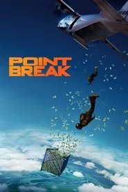
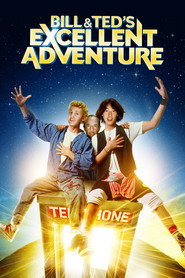
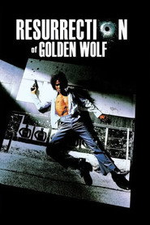

# FEL List

Confirmed Dolby Vision Profile 7 FEL physical media releases.

| Movie | Poster | FEL | Release Date | Studio | Audio | English Audio | HDR | Additional | Source | TMDB | Blu-ray |
| --- | --- | --- | --- | --- | --- | --- | --- | --- | --- | --- | --- |
| Good Luck, Have Fun, Don't Die |  | Yes | 2026-02-13 | Constantin Film | Unknown | Unknown | Unknown | Unknown | [source](FEL.txt (curated Profile 7 FEL list)) | [TMDB](https://www.themoviedb.org/movie/1119449) |  |
| Send Help |  | Yes | 2026-01-22 | Raimi Productions | Dolby TrueHD/Atmos 7.1, DD+ 7.1, DTS 5.1 | Yes | Dolby Vision, HDR10 | Unknown | [source](https://old.reddit.com/r/CoreELEC/comments/1jamlw6/list_of_dolby_vision_p7fel_films/) | [TMDB](https://www.themoviedb.org/movie/1198994) | [blu-ray](https://www.blu-ray.com/movies/Send-Help-4K-Blu-ray/405659/) |
| Mercy |  | Yes | 2026-01-20 | Atlas Entertainment | Dolby TrueHD/Atmos 7.1, DTS-HD MA 5.1, DD 5.1 | Yes | Dolby Vision, HDR10 | Unknown | [source](FEL.txt (curated Profile 7 FEL list)) | [TMDB](https://www.themoviedb.org/movie/1236153) | [blu-ray](https://www.blu-ray.com/movies/Mercy-4K-Blu-ray/405111/) |
| 28 Years Later: The Bone Temple |  | Yes | 2026-01-14 | Columbia Pictures | Dolby TrueHD/Atmos 7.1, DTS-HD MA 5.1, DD 5.1 | Yes | Dolby Vision, HDR10 | Unknown | [source](FEL.txt (curated Profile 7 FEL list)) | [TMDB](https://www.themoviedb.org/movie/1272837) | [blu-ray](https://www.blu-ray.com/movies/28-Years-Later-The-Bone-Temple-4K-Blu-ray/404741/) |
| Is This Thing On? |  | Yes | 2025-12-19 | Searchlight Pictures | Dolby TrueHD/Atmos 7.1 | Yes | Dolby Vision | Unknown | [source](https://old.reddit.com/r/CoreELEC/comments/1jamlw6/list_of_dolby_vision_p7fel_films/) | [TMDB](https://www.themoviedb.org/movie/1140498) | [blu-ray](https://www.blu-ray.com/movies/Is-This-Thing-On-4K-Blu-ray/406051/) |
| Marty Supreme |  | Yes | 2025-12-19 | A24 | Dolby TrueHD/Atmos 7.1 | Yes | Dolby Vision, HDR10 | Unknown | [source](https://old.reddit.com/r/CoreElecOS/comments/1j3lgw2/list_of_dolby_vision_p7fel_films/) | [TMDB](https://www.themoviedb.org/movie/1317288) | [blu-ray](https://www.blu-ray.com/movies/Marty-Supreme-4K-Blu-ray/400840/) |
| The Housemaid |  | Yes | 2025-12-18 | Lionsgate | Dolby TrueHD/Atmos 7.1, DD 5.1 | Yes | Dolby Vision, HDR10 | Unknown | [source](https://old.reddit.com/r/CoreELEC/comments/1jamlw6/list_of_dolby_vision_p7fel_films/) | [TMDB](https://www.themoviedb.org/movie/1368166) | [blu-ray](https://www.blu-ray.com/movies/The-Housemaid-4K-Blu-ray/406021/) |
| Five Nights at Freddy's 2 |  | Yes | 2025-12-03 | Blumhouse Productions | Unknown | Unknown | Unknown | Unknown | [source](FEL.txt (curated Profile 7 FEL list)) | [TMDB](https://www.themoviedb.org/movie/1228246) |  |
| Hamnet |  | Yes | 2025-11-26 | Hera Pictures | Dolby TrueHD/Atmos 7.1, DD 5.1 | Yes | Dolby Vision, HDR10 | Unknown | [source](https://old.reddit.com/r/CoreELEC/comments/1jamlw6/list_of_dolby_vision_p7fel_films/) | [TMDB](https://www.themoviedb.org/movie/858024) | [blu-ray](https://www.blu-ray.com/movies/Hamnet-4K-Blu-ray/403789/) |
| Zootopia 2 |  | Yes | 2025-11-26 | Walt Disney Animation Studios | Dolby TrueHD/Atmos 7.1, DD+ 7.1 | Yes | Dolby Vision, HDR10 | Unknown | [source](https://old.reddit.com/r/CoreELEC/comments/1jamlw6/list_of_dolby_vision_p7fel_films/) | [TMDB](https://www.themoviedb.org/movie/1084242) | [blu-ray](https://www.blu-ray.com/movies/Zootopia-2-4K-Blu-ray/405335/) |
| Wicked: For Good |  | Yes | 2025-11-19 | Universal Pictures | Dolby TrueHD/Atmos 7.1, DD+ 7.1 | Yes | Dolby Vision, HDR10 | Unknown | [source](https://forum.blu-ray.com/forumdisplay.php?f=203) | [TMDB](https://www.themoviedb.org/movie/967941) | [blu-ray](https://www.blu-ray.com/movies/Wicked-For-Good-4K-Blu-ray/390121/) |
| Now You See Me: Now You Don't |  | Yes | 2025-11-12 | Lionsgate | Unknown | Unknown | Unknown | Unknown | [source](FEL.txt (curated Profile 7 FEL list)) | [TMDB](https://www.themoviedb.org/movie/425274) |  |
| Nuremberg |  | Yes | 2025-11-06 | Bluestone Entertainment | Unknown | Unknown | Unknown | Unknown | [source](https://old.reddit.com/r/CoreELEC/comments/1jamlw6/list_of_dolby_vision_p7fel_films/) | [TMDB](https://www.themoviedb.org/movie/1214931) |  |
| Predator: Badlands |  | Yes | 2025-11-05 | 20th Century Studios | Dolby TrueHD/Atmos 7.1, DD+ 7.1 | Yes | Dolby Vision, HDR10 | Unknown | [source](https://forum.blu-ray.com/showpost.php?p=23851523&postcount=169) | [TMDB](https://www.themoviedb.org/movie/1242898) | [blu-ray](https://www.blu-ray.com/movies/Predator-Badlands-4K-Blu-ray/387005/) |
| Arco |  | Yes | 2025-10-22 | Remembers | DTS-HD MA 5.1, DTS-HD MA 7.1 | Yes | Dolby Vision, HDR10 | Unknown | [source](https://old.reddit.com/r/CoreELEC/comments/1jamlw6/list_of_dolby_vision_p7fel_films/) | [TMDB](https://www.themoviedb.org/movie/804370) | [blu-ray](https://www.blu-ray.com/movies/Arco-4K-Blu-ray/408058/) |
| Kaamelott: The Second Chapter (Part I) |  | Yes | 2025-10-22 | Regular Production | Unknown | Unknown | Unknown | Unknown | [source](https://old.reddit.com/r/CoreELEC/comments/1jamlw6/list_of_dolby_vision_p7fel_films/) | [TMDB](https://www.themoviedb.org/movie/1076897) |  |
| Springsteen: Deliver Me from Nowhere |  | Yes | 2025-10-22 | 20th Century Studios | Dolby TrueHD/Atmos 7.1, DD+ 7.1 | Yes | Dolby Vision, HDR10 | Unknown | [source](https://old.reddit.com/r/CoreELEC/comments/1jamlw6/list_of_dolby_vision_p7fel_films/) | [TMDB](https://www.themoviedb.org/movie/1230368) | [blu-ray](https://www.blu-ray.com/movies/Springsteen-Deliver-Me-from-Nowhere-4K-Blu-ray/402914/) |
| Black Phone 2 |  | Yes | 2025-10-15 | Blumhouse Productions | Dolby TrueHD/Atmos 7.1, Dolby Atmos tracks have a Dolby TrueHD 7.1 core not a DTS-HD Master Audio 7.1 | Yes | Dolby Vision, HDR10 | Unknown | [source](https://letterboxd.com/mikimajk/list/list-of-dolby-vision-p7-fel-films/) | [TMDB](https://www.themoviedb.org/movie/1197137) | [blu-ray](https://www.blu-ray.com/movies/Black-Phone-2-4K-Blu-ray/399162/) |
| Dog 51 |  | Yes | 2025-10-15 | Chi-Fou-Mi Productions | Unknown | Unknown | Unknown | Unknown | [source](https://old.reddit.com/r/CoreELEC/comments/1jamlw6/list_of_dolby_vision_p7fel_films/) | [TMDB](https://www.themoviedb.org/movie/1266798) |  |
| Good Fortune |  | Yes | 2025-10-14 | Lionsgate | Dolby TrueHD/Atmos 7.1, DD 5.1 | Yes | Dolby Vision, HDR10 | Unknown | [source](https://old.reddit.com/r/CoreELEC/comments/1jamlw6/list_of_dolby_vision_p7fel_films/) | [TMDB](https://www.themoviedb.org/movie/1114967) | [blu-ray](https://www.blu-ray.com/movies/Good-Fortune-4K-Blu-ray/399678/) |
| Roofman |  | Yes | 2025-10-08 | Limelight | Dolby TrueHD 5.1, DD 5.1 | Yes | Dolby Vision, HDR10 | Unknown | [source](https://old.reddit.com/r/CoreELEC/comments/1jamlw6/list_of_dolby_vision_p7fel_films/) | [TMDB](https://www.themoviedb.org/movie/1242419) | [blu-ray](https://www.blu-ray.com/movies/Roofman-4K-Blu-ray/399009/) |
| TRON: Ares |  | Yes | 2025-10-08 | Walt Disney Pictures | Dolby TrueHD/Atmos 7.1, DD+ 7.1 | Yes | Dolby Vision, HDR10 | Unknown | [source](https://old.reddit.com/r/CoreELEC/comments/1jamlw6/list_of_dolby_vision_p7fel_films/) | [TMDB](https://www.themoviedb.org/movie/533533) | [blu-ray](https://www.blu-ray.com/movies/TRON-Ares-4K-Blu-ray/401610/) |
| Good Boy |  | Yes | 2025-10-01 | What’s Wrong with Your Dog? | Unknown | Unknown | Unknown | Unknown | [source](https://old.reddit.com/r/CoreELEC/comments/1jamlw6/list_of_dolby_vision_p7fel_films/) | [TMDB](https://www.themoviedb.org/movie/1422096) |  |
| The Smashing Machine |  | Yes | 2025-10-01 | A24 | Dolby TrueHD/Atmos 7.1 | Yes | Dolby Vision, HDR10 | Unknown | [source](https://old.reddit.com/r/CoreELEC/comments/1jamlw6/list_of_dolby_vision_p7fel_films/) | [TMDB](https://www.themoviedb.org/movie/760329) | [blu-ray](https://www.blu-ray.com/movies/The-Smashing-Machine-4K-Blu-ray/400389/) |
| HIM |  | Yes | 2025-09-18 | Monkeypaw Productions | Dolby TrueHD/Atmos 7.1, DD+ 7.1 | Yes | Dolby Vision, HDR10 | Unknown | [source](https://old.reddit.com/r/CoreELEC/comments/1jamlw6/list_of_dolby_vision_p7fel_films/) | [TMDB](https://www.themoviedb.org/movie/986097) | [blu-ray](https://www.blu-ray.com/movies/Him-4K-Blu-ray/397210/) |
| Downton Abbey: The Grand Finale |  | Yes | 2025-09-10 | Carnival Films | Dolby TrueHD/Atmos 7.1, DD+ 7.1, DD 5.1 | Yes | Dolby Vision, HDR10 | Unknown | [source](https://old.reddit.com/r/CoreELEC/comments/1jamlw6/list_of_dolby_vision_p7fel_films/) | [TMDB](https://www.themoviedb.org/movie/1289936) | [blu-ray](https://www.blu-ray.com/movies/Downton-Abbey-The-Grand-Finale-4K-Blu-ray/396697/) |
| The Long Walk |  | Yes | 2025-09-10 | Lionsgate | Dolby TrueHD/Atmos 7.1, DD 5.1 | Yes | Dolby Vision, HDR10 | Unknown | [source](https://old.reddit.com/r/CoreELEC/comments/1jamlw6/list_of_dolby_vision_p7fel_films/) | [TMDB](https://www.themoviedb.org/movie/604079) | [blu-ray](https://www.blu-ray.com/movies/The-Long-Walk-4K-Blu-ray/401895/) |
| Caught Stealing |  | Yes | 2025-08-26 | Protozoa Pictures | Dolby TrueHD/Atmos 7.1, DTS-HD MA 5.1, DD 5.1 | Yes | Dolby Vision, HDR10 | Unknown | [source](FEL.txt (curated Profile 7 FEL list)) | [TMDB](https://www.themoviedb.org/movie/1245993) | [blu-ray](https://www.blu-ray.com/movies/Caught-Stealing-4K-Blu-ray/395744/) |
| Highest 2 Lowest |  | Yes | 2025-08-14 | A24 | Dolby TrueHD/Atmos 7.1 | Yes | Dolby Vision, HDR10 | Unknown | [source](https://old.reddit.com/r/CoreELEC/comments/1jamlw6/list_of_dolby_vision_p7fel_films/) | [TMDB](https://www.themoviedb.org/movie/1242434) | [blu-ray](https://www.blu-ray.com/movies/Highest-2-Lowest-4K-Blu-ray/409252/) |
| Nobody 2 |  | Yes | 2025-08-13 | Universal Pictures | Dolby TrueHD/Atmos 7.1, DD+ 7.1 | Yes | Dolby Vision, HDR10 | Unknown | [source](https://docs.google.com/spreadsheets/d/15i0a84uiBtWiHZ5CXZZ7wygLFXwYOd84/edit?gid=828864432#gid=828864432) | [TMDB](https://www.themoviedb.org/movie/1007734) | [blu-ray](https://www.blu-ray.com/movies/Nobody-2-4K-Blu-ray/394409/) |
| The Naked Gun |  | Yes | 2025-07-30 | Fuzzy Door Productions | Dolby Atmos, DD 5.1 | Yes | Dolby Vision, HDR10 | Unknown | [source](https://github.com/iammarxg/FEL) | [TMDB](https://www.themoviedb.org/movie/1035259) | [blu-ray](https://www.blu-ray.com/movies/The-Naked-Gun-4K-Blu-ray/385701/) |
| The Bad Guys 2 |  | Yes | 2025-07-24 | DreamWorks Animation | Dolby TrueHD/Atmos 7.1, DD+ 7.1 | Yes | Dolby Vision, HDR10 | Unknown | [source](https://letterboxd.com/mikimajk/list/list-of-dolby-vision-p7-fel-films/) | [TMDB](https://www.themoviedb.org/movie/1175942) | [blu-ray](https://www.blu-ray.com/movies/The-Bad-Guys-2-4K-Blu-ray/393601/) |
| The Fantastic 4: First Steps |  | Yes | 2025-07-23 | Marvel Studios | Unknown | Unknown | Unknown | Unknown | [source](https://old.reddit.com/r/CoreELEC/comments/1jamlw6/list_of_dolby_vision_p7fel_films/) | [TMDB](https://www.themoviedb.org/movie/617126) |  |
| Eddington |  | Yes | 2025-07-16 | A24 | Dolby TrueHD/Atmos 7.1 | Yes | Dolby Vision, HDR10 | Unknown | [source](https://old.reddit.com/r/CoreElecOS/comments/1j3lgw2/list_of_dolby_vision_p7fel_films/) | [TMDB](https://www.themoviedb.org/movie/648878) | [blu-ray](https://www.blu-ray.com/movies/Eddington-4K-Blu-ray/392474/) |
| Jurassic World Rebirth |  | Yes | 2025-07-01 | Universal Pictures | Dolby TrueHD/Atmos 7.1, DD+ 7.1 | Yes | Dolby Vision, HDR10 | Unknown | [source](https://old.reddit.com/r/CoreELEC/comments/1jamlw6/list_of_dolby_vision_p7fel_films/) | [TMDB](https://www.themoviedb.org/movie/1234821) | [blu-ray](https://www.blu-ray.com/movies/Jurassic-World-Rebirth-4K-Blu-ray/381347/) |
| M3GAN 2.0 |  | Yes | 2025-06-25 | Blumhouse Productions | Dolby TrueHD/Atmos 7.1, DD+ 7.1 | Yes | Dolby Vision, HDR10 | Unknown | [source](https://docs.google.com/spreadsheets/d/15i0a84uiBtWiHZ5CXZZ7wygLFXwYOd84/edit?gid=828864432#gid=828864432) | [TMDB](https://www.themoviedb.org/movie/1071585) | [blu-ray](https://www.blu-ray.com/movies/M3GAN-2.0-4K-Blu-ray/391272/) |
| 28 Years Later |  | Yes | 2025-06-18 | Columbia Pictures | Dolby TrueHD/Atmos 7.1, DTS-HD MA 5.1 | Yes | Dolby Vision, HDR10 | Unknown | [source](FEL.txt (curated Profile 7 FEL list)) | [TMDB](https://www.themoviedb.org/movie/1100988) | [blu-ray](https://www.blu-ray.com/movies/28-Years-Later-4K-Blu-ray/377563/) |
| Elio |  | Yes | 2025-06-18 | Pixar | Dolby TrueHD/Atmos 7.1, DD+/Atmos 7.1, DD 5.1, DD 2.0, DD+ 7.1 | Yes | Dolby Vision, HDR10 | Unknown | [source](https://old.reddit.com/r/CoreELEC/comments/1jamlw6/list_of_dolby_vision_p7fel_films/) | [TMDB](https://www.themoviedb.org/movie/1022787) | [blu-ray](https://www.blu-ray.com/movies/Elio-4K-Blu-ray/392952/) |
| How to Train Your Dragon |  | Yes | 2025-06-06 | DreamWorks Animation | Dolby TrueHD/Atmos 7.1, DD+ 7.1 | Yes | Dolby Vision, HDR10 | Unknown | [source](https://forum.blu-ray.com/showthread.php?t=387117&page=2) | [TMDB](https://www.themoviedb.org/movie/1087192) | [blu-ray](https://www.blu-ray.com/movies/How-to-Train-Your-Dragon-4K-Blu-ray/390238/) |
| Ballerina |  | Yes | 2025-06-04 | Thunder Road | Dolby TrueHD/Atmos 7.1, DD 5.1 | Yes | Dolby Vision, HDR10 | Unknown | [source](https://forum.blu-ray.com/showthread.php?p=23456724) | [TMDB](https://www.themoviedb.org/movie/541671) | [blu-ray](https://www.blu-ray.com/movies/Ballerina-4K-Blu-ray/389708/) |
| Bring Her Back |  | Yes | 2025-05-28 | Causeway Films | Dolby TrueHD/Atmos 7.1 | Yes | Dolby Vision, HDR10 | Unknown | [source](https://old.reddit.com/r/CoreELEC/comments/1jamlw6/list_of_dolby_vision_p7fel_films/) | [TMDB](https://www.themoviedb.org/movie/1151031) | [blu-ray](https://www.blu-ray.com/movies/Bring-Her-Back-4K-Blu-ray/391536/) |
| The Phoenician Scheme |  | Yes | 2025-05-23 | American Empirical Pictures | Dolby Atmos, DD 5.1 | Yes | Dolby Vision, HDR10 | Unknown | [source](https://docs.google.com/spreadsheets/d/15i0a84uiBtWiHZ5CXZZ7wygLFXwYOd84/edit?gid=828864432#gid=828864432) | [TMDB](https://www.themoviedb.org/movie/1137350) | [blu-ray](https://www.blu-ray.com/movies/The-Phoenician-Scheme-4K-Blu-ray/390139/) |
| Lilo & Stitch |  | Yes | 2025-05-17 | Walt Disney Pictures | Dolby TrueHD/Atmos 7.1, DD+ 7.1, DD 2.0 | Yes | Dolby Vision, HDR10 | Unknown | [source](FEL.txt (curated Profile 7 FEL list)) | [TMDB](https://www.themoviedb.org/movie/552524) | [blu-ray](https://www.blu-ray.com/movies/Lilo-and-Stitch-4K-Blu-ray/392930/) |
| Mission: Impossible - The Final Reckoning |  | Yes | 2025-05-17 | Paramount Pictures | Dolby TrueHD/Atmos 7.1, DD 5.1, Dolby Atmos | Yes | Dolby Vision, HDR10 | Unknown | [source](https://old.reddit.com/r/CoreELEC/comments/1jamlw6/list_of_dolby_vision_p7fel_films/) | [TMDB](https://www.themoviedb.org/movie/575265) | [blu-ray](https://www.blu-ray.com/movies/Mission-Impossible-The-Final-Reckoning-4K-Blu-ray/375688/) |
| Final Destination Bloodlines |  | Yes | 2025-05-14 | New Line Cinema | Dolby TrueHD/Atmos 7.1, DD 5.1 | Yes | Dolby Vision, HDR10 | Unknown | [source](FEL.txt (curated Profile 7 FEL list)) | [TMDB](https://www.themoviedb.org/movie/574475) | [blu-ray](https://www.blu-ray.com/movies/Final-Destination-Bloodlines-4K-Blu-ray/381249/) |
| Thunderbolts* |  | Yes | 2025-04-30 | Marvel Studios | Dolby TrueHD/Atmos 7.1, DD+ 7.1, DD 5.1 | Yes | Dolby Vision, HDR10 | Unknown | [source](https://forum.blu-ray.com/showthread.php?p=23318439) | [TMDB](https://www.themoviedb.org/movie/986056) | [blu-ray](https://www.blu-ray.com/movies/Thunderbolts--4K-Blu-ray/389904/) |
| Sinners |  | Yes | 2025-04-16 | Warner Bros. Pictures | Dolby TrueHD/Atmos 7.1, DD 5.1 | Yes | Dolby Vision, HDR10 | Unknown | [source](https://forum.blu-ray.com/showthread.php?t=387117&page=16) | [TMDB](https://www.themoviedb.org/movie/1233413) | [blu-ray](https://www.blu-ray.com/movies/Sinners-4K-Blu-ray/384583/) |
| Drop |  | Yes | 2025-04-10 | Blumhouse Productions | Dolby TrueHD/Atmos 7.1, DD+ 7.1 | Yes | Dolby Vision, HDR10 | Unknown | [source](https://docs.google.com/spreadsheets/d/15i0a84uiBtWiHZ5CXZZ7wygLFXwYOd84/edit?gid=828864432#gid=828864432) | [TMDB](https://www.themoviedb.org/movie/1249213) | [blu-ray](https://www.blu-ray.com/movies/Drop-4K-Blu-ray/386100/) |
| The Amateur |  | Yes | 2025-04-09 | 20th Century Studios | Dolby TrueHD/Atmos 7.1, DD+ 7.1, DD 5.1, DTS 5.1 | Yes | Dolby Vision, HDR10 | Unknown | [source](https://forum.blu-ray.com/showthread.php?p=23318439) | [TMDB](https://www.themoviedb.org/movie/1087891) | [blu-ray](https://www.blu-ray.com/movies/The-Amateur-4K-Blu-ray/389456/) |
| Warfare |  | Yes | 2025-04-09 | DNA Films | Dolby TrueHD/Atmos 7.1 | Yes | Dolby Vision, HDR10 | Unknown | [source](https://old.reddit.com/r/CoreElecOS/comments/1j3lgw2/list_of_dolby_vision_p7fel_films/) | [TMDB](https://www.themoviedb.org/movie/1241436) | [blu-ray](https://www.blu-ray.com/movies/Warfare-4K-Blu-ray/386223/) |
| The Shrouds |  | Yes | 2025-04-03 | SBS Productions | Unknown | Unknown | Unknown | Unknown | [source](https://old.reddit.com/r/CoreELEC/comments/1jamlw6/list_of_dolby_vision_p7fel_films/) | [TMDB](https://www.themoviedb.org/movie/970947) |  |
| A Working Man |  | Yes | 2025-03-26 | Cedar Park Entertainment | Dolby TrueHD/Atmos 7.1, DD 5.1 | Yes | HDR10 | Unknown | [source](FEL.txt (curated Profile 7 FEL list)) | [TMDB](https://www.themoviedb.org/movie/1197306) | [blu-ray](https://www.blu-ray.com/movies/A-Working-Man-4K-Blu-ray/385181/) |
| Snow White |  | Yes | 2025-03-19 | Walt Disney Pictures | Dolby TrueHD/Atmos 7.1, DD 2.0, DD+ 7.1, DTS 5.1, DD 5.1 | Yes | Dolby Vision, HDR10 | Unknown | [source](https://forum.blu-ray.com/showthread.php?t=276448&page=5) | [TMDB](https://www.themoviedb.org/movie/447273) | [blu-ray](https://www.blu-ray.com/movies/Snow-White-4K-Blu-ray/387868/) |
| Novocaine |  | Yes | 2025-03-12 | Safehouse Pictures | Dolby Atmos, DD 5.1 | Yes | Dolby Vision, HDR10 | Unknown | [source](https://old.reddit.com/r/CoreELEC/comments/1jamlw6/list_of_dolby_vision_p7fel_films/) | [TMDB](https://www.themoviedb.org/movie/1195506) | [blu-ray](https://www.blu-ray.com/movies/Novocaine-4K-Blu-ray/384168/) |
| Mickey 17 |  | Yes | 2025-02-28 | Plan B Entertainment | Dolby TrueHD/Atmos 7.1, DD 5.1 | Yes | Dolby Vision, HDR10 | Unknown | [source](FEL.txt (curated Profile 7 FEL list)) | [TMDB](https://www.themoviedb.org/movie/696506) | [blu-ray](https://www.blu-ray.com/movies/Mickey-17-4K-Blu-ray/383608/) |
| Captain America: Brave New World |  | Yes | 2025-02-12 | Marvel Studios | Dolby TrueHD/Atmos 7.1, DTS-HD MA 7.1, DD+ 7.1, DD 5.1 | Yes | Dolby Vision, HDR10 | Unknown | [source](https://forum.blu-ray.com/showthread.php?t=387630&page=1) | [TMDB](https://www.themoviedb.org/movie/822119) | [blu-ray](https://www.blu-ray.com/movies/Captain-America-Brave-New-World-4K-Blu-ray/385906/) |
| Love Hurts |  | Yes | 2025-02-06 | 87North Productions | Dolby TrueHD/Atmos 7.1, DD+ 7.1, DD 5.1 | Yes | Dolby Vision, HDR10 | Unknown | [source](https://docs.google.com/spreadsheets/d/15i0a84uiBtWiHZ5CXZZ7wygLFXwYOd84/edit?gid=828864432#gid=828864432) | [TMDB](https://www.themoviedb.org/movie/1226406) | [blu-ray](https://www.blu-ray.com/movies/Love-Hurts-4K-Blu-ray/381684/) |
| Companion |  | Yes | 2025-01-22 | BoulderLight Pictures | Dolby TrueHD/Atmos 7.1 | Yes | HDR10 | Unknown | [source](FEL.txt (curated Profile 7 FEL list)) | [TMDB](https://www.themoviedb.org/movie/1084199) | [blu-ray](https://www.blu-ray.com/movies/Companion-4K-Blu-ray/380738/) |
| Star Trek: Section 31 |  | Yes | 2025-01-15 | Secret Hideout | Dolby TrueHD/Atmos 7.1, DD 5.1 | Yes | Dolby Vision, HDR10 | Unknown | [source](https://old.reddit.com/r/CoreELEC/comments/1jamlw6/list_of_dolby_vision_p7fel_films/) | [TMDB](https://www.themoviedb.org/movie/1114894) | [blu-ray](https://www.blu-ray.com/movies/Star-Trek-Section-31-4K-Blu-ray/380425/) |
| Den of Thieves 2: Pantera |  | Yes | 2025-01-08 | Diamond Film Productions | Dolby TrueHD/Atmos 7.1, DD 5.1 | Yes | Dolby Vision, HDR10 | Unknown | [source](https://github.com/iammarxg/FEL) | [TMDB](https://www.themoviedb.org/movie/604685) | [blu-ray](https://www.blu-ray.com/movies/Den-of-Thieves-2-Pantera-4K-Blu-ray/371043/) |
| Ng poon |  | Yes | 2024 | Unknown | Unknown | Unknown | Unknown | Unknown | [source](https://old.reddit.com/r/CoreELEC/comments/1jamlw6/list_of_dolby_vision_p7fel_films/) |  |  |
| Nosferatu |  | Yes | 2024-12-25 | Focus Features | Dolby TrueHD/Atmos 7.1, DD+ 7.1 | Yes | Dolby Vision, HDR10 | Unknown | [source](https://docs.google.com/spreadsheets/d/15i0a84uiBtWiHZ5CXZZ7wygLFXwYOd84/edit?gid=828864432#gid=828864432) | [TMDB](https://www.themoviedb.org/movie/426063) | [blu-ray](https://www.blu-ray.com/movies/Nosferatu-4K-Blu-ray/377214/) |
| A Complete Unknown |  | Yes | 2024-12-25 | Veritas Entertainment Group | Dolby TrueHD/Atmos 7.1, DTS-HD MA 2.0, DD 5.1 | Yes | Dolby Vision, HDR10 | Unknown | [source](https://old.reddit.com/r/CoreELEC/comments/1jamlw6/list_of_dolby_vision_p7fel_films/) | [TMDB](https://www.themoviedb.org/movie/661539) | [blu-ray](https://www.blu-ray.com/movies/A-Complete-Unknown-4K-Blu-ray/381924/) |
| Babygirl |  | Yes | 2024-12-25 | A24 | Dolby TrueHD/Atmos 7.1 | Yes | Dolby Vision, HDR10 | Unknown | [source](https://letterboxd.com/mikimajk/list/list-of-dolby-vision-p7-fel-films/) | [TMDB](https://www.themoviedb.org/movie/1097549) | [blu-ray](https://www.blu-ray.com/movies/Babygirl-4K-Blu-ray/380628/) |
| Sonic the Hedgehog 3 |  | Yes | 2024-12-19 | Paramount Pictures | Dolby TrueHD/Atmos 7.1, DD 5.1, DD+ 5.1 | Yes | Dolby Vision, HDR10 | Unknown | [source](https://old.reddit.com/r/CoreELEC/comments/1jamlw6/list_of_dolby_vision_p7fel_films/) | [TMDB](https://www.themoviedb.org/movie/939243) | [blu-ray](https://www.blu-ray.com/movies/Sonic-the-Hedgehog-3-4K-Blu-ray/378531/) |
| Mufasa: The Lion King |  | Yes | 2024-12-18 | Walt Disney Pictures | Dolby TrueHD/Atmos 7.1, DD 5.1, DD+ 7.1 | Yes | Dolby Vision, HDR10 | Unknown | [source](https://old.reddit.com/r/CoreELEC/comments/1jamlw6/list_of_dolby_vision_p7fel_films/) | [TMDB](https://www.themoviedb.org/movie/762509) | [blu-ray](https://www.blu-ray.com/movies/Mufasa-The-Lion-King-4K-Blu-ray/378810/) |
| Kraven the Hunter |  | Yes | 2024-12-11 | Columbia Pictures | Dolby TrueHD/Atmos 7.1, DTS-HD MA 5.1, DD 5.1 | Yes | Dolby Vision, HDR10 | Unknown | [source](FEL.txt (curated Profile 7 FEL list)) | [TMDB](https://www.themoviedb.org/movie/539972) | [blu-ray](https://www.blu-ray.com/movies/Kraven-the-Hunter-4K-Blu-ray/377877/) |
| The Prosecutor |  | Yes | 2024-12-08 | Mandarin Motion Pictures | Dolby TrueHD/Atmos 7.1, DTS-HD MA 5.1 | Yes | Dolby Vision, HDR10 | Unknown | [source](https://old.reddit.com/r/CoreELEC/comments/1jamlw6/list_of_dolby_vision_p7fel_films/) | [TMDB](https://www.themoviedb.org/movie/1128650) | [blu-ray](https://www.blu-ray.com/movies/The-Prosecutor-4K-Blu-ray/384202/) |
| Better Man |  | Yes | 2024-12-06 | RocketScience | Dolby TrueHD/Atmos 7.1, DD 5.1 | Yes | Dolby Vision, HDR10 | Unknown | [source](https://letterboxd.com/mikimajk/list/list-of-dolby-vision-p7-fel-films/) | [TMDB](https://www.themoviedb.org/movie/799766) | [blu-ray](https://www.blu-ray.com/movies/Better-Man-4K-Blu-ray/381809/) |
| Moana 2 |  | Yes | 2024-11-21 | Walt Disney Animation Studios | Dolby TrueHD/Atmos 7.1, DD+ 7.1 | Yes | Dolby Vision, HDR10 | Unknown | [source](https://old.reddit.com/r/CoreELEC/comments/1jamlw6/list_of_dolby_vision_p7fel_films/) | [TMDB](https://www.themoviedb.org/movie/1241982) | [blu-ray](https://www.blu-ray.com/movies/Moana-2-4K-Blu-ray/376731/) |
| Gladiator II |  | Yes | 2024-11-13 | Paramount Pictures | Dolby TrueHD/Atmos 7.1, DD 5.1 | Yes | Dolby Vision, HDR10 | Unknown | [source](https://github.com/iammarxg/FEL) | [TMDB](https://www.themoviedb.org/movie/558449) | [blu-ray](https://www.blu-ray.com/movies/Gladiator-II-4K-Blu-ray/365746/) |
| Paddington in Peru |  | Yes | 2024-11-08 | Kinoshita Group | Unknown | Unknown | Unknown | Unknown | [source](https://github.com/iammarxg/FEL) | [TMDB](https://www.themoviedb.org/movie/516729) |  |
| 11 Rebels |  | Yes | 2024-11-01 | Toei Company | Dolby TrueHD/Atmos 7.1, DTS-HD MA 5.1 | Yes | Dolby Vision, HDR10 | Unknown | [source](https://old.reddit.com/r/CoreELEC/comments/1jamlw6/list_of_dolby_vision_p7fel_films/) | [TMDB](https://www.themoviedb.org/movie/1310682) | [blu-ray](https://www.blu-ray.com/movies/11-Rebels-4K-Blu-ray/383816/) |
| Heretic |  | Yes | 2024-10-31 | A24 | Dolby TrueHD/Atmos 7.1 | Yes | Dolby Vision, HDR10 | Unknown | [source](https://old.reddit.com/r/CoreELEC/comments/1jamlw6/list_of_dolby_vision_p7fel_films/) | [TMDB](https://www.themoviedb.org/movie/1138194) | [blu-ray](https://www.blu-ray.com/movies/Heretic-4K-Blu-ray/377587/) |
| Red One |  | Yes | 2024-10-31 | Seven Bucks Productions | Dolby TrueHD/Atmos 7.1, DD 5.1 | Yes | Dolby Vision, HDR10 | Unknown | [source](FEL.txt (curated Profile 7 FEL list)) | [TMDB](https://www.themoviedb.org/movie/845781) | [blu-ray](https://www.blu-ray.com/movies/Red-One-4K-Blu-ray/375871/) |
| Beating Hearts |  | Yes | 2024-10-16 | Trésor Films | DTS-HD MA 2.0, Dolby Atmos | Unknown | HDR10 | Unknown | [source](https://letterboxd.com/mikimajk/list/list-of-dolby-vision-p7-fel-films/) | [TMDB](https://www.themoviedb.org/movie/959604) | [blu-ray](https://www.blu-ray.com/movies/Beating-Hearts-4K-Blu-ray/375041/) |
| Smile 2 |  | Yes | 2024-10-16 | Paramount Pictures | Dolby TrueHD/Atmos 7.1, DD 5.1 | Yes | Dolby Vision, HDR10 | Unknown | [source](https://github.com/iammarxg/FEL) | [TMDB](https://www.themoviedb.org/movie/1100782) | [blu-ray](https://www.blu-ray.com/movies/Smile-2-4K-Blu-ray/373370/) |
| Wicked |  | Yes | 2024-10-16 | Universal Pictures | Dolby TrueHD/Atmos 7.1, DD+ 7.1 | Yes | Dolby Vision, HDR10 | Unknown | [source](https://forum.blu-ray.com/forumdisplay.php?f=203) | [TMDB](https://www.themoviedb.org/movie/402431) | [blu-ray](https://www.blu-ray.com/movies/Wicked-4K-Blu-ray/376398/) |
| Terrifier 3 |  | Yes | 2024-10-09 | Dark Age Cinema | DTS-HD MA 5.1 | Yes | Unknown | Unknown | [source](https://github.com/iammarxg/FEL) | [TMDB](https://www.themoviedb.org/movie/1034541) | [blu-ray](https://www.blu-ray.com/movies/Terrifier-3-4K-Blu-ray/373283/) |
| Joker: Folie à Deux |  | Yes | 2024-10-01 | Warner Bros. Pictures | Dolby TrueHD/Atmos 7.1, DD 5.1 | Yes | Dolby Vision, HDR10 | Unknown | [source](https://github.com/iammarxg/FEL) | [TMDB](https://www.themoviedb.org/movie/889737) | [blu-ray](https://www.blu-ray.com/movies/Joker-Folie-a-Deux-4K-Blu-ray/359048/) |
| The Killer's Game |  | Yes | 2024-09-12 | Dogbone Entertainment | Unknown | Unknown | Unknown | Unknown | [source](FEL.txt (curated Profile 7 FEL list)) | [TMDB](https://www.themoviedb.org/movie/507241) |  |
| The Wild Robot |  | Yes | 2024-09-12 | DreamWorks Animation | Dolby TrueHD/Atmos 7.1, DD+ 7.1 | Yes | Dolby Vision, HDR10 | Unknown | [source](https://github.com/iammarxg/FEL) | [TMDB](https://www.themoviedb.org/movie/1184918) | [blu-ray](https://www.blu-ray.com/movies/The-Wild-Robot-4K-Blu-ray/371786/) |
| Speak No Evil |  | Yes | 2024-09-11 | Blumhouse Productions | Dolby TrueHD/Atmos 7.1 | Yes | Dolby Vision, HDR10 | Unknown | [source](https://old.reddit.com/r/CoreELEC/comments/1jamlw6/list_of_dolby_vision_p7fel_films/) | [TMDB](https://www.themoviedb.org/movie/1114513) | [blu-ray](https://www.blu-ray.com/movies/Speak-No-Evil-4K-Blu-ray/392979/) |
| Transformers One |  | Yes | 2024-09-11 | Paramount Animation | Dolby TrueHD/Atmos 7.1, DD 5.1 | Yes | Dolby Vision, HDR10 | Unknown | [source](https://forum.blu-ray.com/showthread.php?t=387630&page=9) | [TMDB](https://www.themoviedb.org/movie/698687) | [blu-ray](https://www.blu-ray.com/movies/Transformers-One-4K-Blu-ray/371724/) |
| The Substance |  | Yes | 2024-09-07 | Working Title Films | DTS-HD MA 5.1, DTS-HD MA 2.0, DD 2.0, DD 5.1 | Yes | Dolby Vision, HDR10 | Unknown | [source](https://old.reddit.com/r/CoreELEC/comments/1jamlw6/list_of_dolby_vision_p7fel_films/) | [TMDB](https://www.themoviedb.org/movie/933260) | [blu-ray](https://www.blu-ray.com/movies/The-Substance-4K-Blu-ray/374825/) |
| We The Surfers |  | Yes | 2024-08-29 | Unknown | Unknown | Unknown | Unknown | Unknown | [source](https://old.reddit.com/r/CoreELEC/comments/1jamlw6/list_of_dolby_vision_p7fel_films/) | [TMDB](https://www.themoviedb.org/movie/1430855) |  |
| Emilia Pérez |  | Yes | 2024-08-21 | Why Not Productions | Unknown | Unknown | Unknown | Unknown | [source](https://old.reddit.com/r/CoreELEC/comments/1jamlw6/list_of_dolby_vision_p7fel_films/) | [TMDB](https://www.themoviedb.org/movie/974950) |  |
| Alien: Romulus |  | Yes | 2024-08-13 | 20th Century Studios | Dolby TrueHD/Atmos 7.1, DD 5.1, DD+ 7.1 | Yes | Dolby Vision, HDR10 | Unknown | [source](https://github.com/iammarxg/FEL) | [TMDB](https://www.themoviedb.org/movie/945961) | [blu-ray](https://www.blu-ray.com/movies/Alien-Romulus-4K-Blu-ray/365794/) |
| Borderlands |  | Yes | 2024-08-07 | Lionsgate | Dolby TrueHD/Atmos 7.1, DD 2.0, DD 5.1 | Yes | Dolby Vision, HDR10 | Unknown | [source](https://old.reddit.com/r/CoreELEC/comments/1jamlw6/list_of_dolby_vision_p7fel_films/) | [TMDB](https://www.themoviedb.org/movie/365177) | [blu-ray](https://www.blu-ray.com/movies/Borderlands-4K-Blu-ray/367964/) |
| Deadpool & Wolverine |  | Yes | 2024-07-24 | Marvel Studios | Dolby TrueHD/Atmos 7.1, DD 5.1 | Yes | Dolby Vision, HDR10 | Unknown | [source](FEL.txt (curated Profile 7 FEL list)) | [TMDB](https://www.themoviedb.org/movie/533535) | [blu-ray](https://www.blu-ray.com/movies/Deadpool-and-Wolverine-4K-Blu-ray/355289/) |
| Twisters |  | Yes | 2024-07-10 | Universal Pictures | Dolby TrueHD/Atmos 7.1, DD 5.1, DD+ 7.1 | Yes | Dolby Vision, HDR10 | Unknown | [source](https://forum.blu-ray.com/showthread.php?t=327042&page=49) | [TMDB](https://www.themoviedb.org/movie/718821) | [blu-ray](https://www.blu-ray.com/movies/Twisters-4K-Blu-ray/366390/) |
| MaXXXine |  | Yes | 2024-07-04 | A24 | Dolby TrueHD/Atmos 7.1, DD 5.1 | Yes | Dolby Vision, HDR10 | Unknown | [source](https://github.com/iammarxg/FEL) | [TMDB](https://www.themoviedb.org/movie/1023922) | [blu-ray](https://www.blu-ray.com/movies/MaXXXine-4K-Blu-ray/365467/) |
| The Count of Monte Cristo |  | Yes | 2024-06-28 | Chapter 2 | DTS-HD MA 5.1 | Yes | Unknown | Unknown | [source](https://github.com/iammarxg/FEL) | [TMDB](https://www.themoviedb.org/movie/1084736) | [blu-ray](https://www.blu-ray.com/movies/The-Count-of-Monte-Cristo-4K-Blu-ray/399451/) |
| A Quiet Place: Day One |  | Yes | 2024-06-26 | Paramount Pictures | Dolby TrueHD/Atmos 7.1, DD 5.1 | Yes | Dolby Vision, HDR10 | Unknown | [source](https://github.com/iammarxg/FEL) | [TMDB](https://www.themoviedb.org/movie/762441) | [blu-ray](https://www.blu-ray.com/movies/A-Quiet-Place-Day-One-4K-Blu-ray/363803/) |
| Despicable Me 4 |  | Yes | 2024-06-20 | Universal Pictures | Dolby TrueHD/Atmos 7.1, DD+ 7.1 | Yes | Dolby Vision, HDR10 | Unknown | [source](https://github.com/iammarxg/FEL) | [TMDB](https://www.themoviedb.org/movie/519182) | [blu-ray](https://www.blu-ray.com/movies/Despicable-Me-4-4K-Blu-ray/355294/) |
| Inside Out 2 |  | Yes | 2024-06-11 | Pixar | Dolby TrueHD/Atmos 7.1, DD 5.1, DD+ 7.1 | Yes | HDR10 | Unknown | [source](FEL.txt (curated Profile 7 FEL list)) | [TMDB](https://www.themoviedb.org/movie/1022789) | [blu-ray](https://www.blu-ray.com/movies/Inside-Out-2-4K-Blu-ray/364807/) |
| The Strangers: Chapter 1 |  | Yes | 2024-05-15 | Fifth Element Productions | Dolby TrueHD/Atmos 7.1, DD 5.1 | Yes | Dolby Vision, HDR10 | Unknown | [source](https://github.com/iammarxg/FEL) | [TMDB](https://www.themoviedb.org/movie/1010600) | [blu-ray](https://www.blu-ray.com/movies/The-Strangers-Chapter-1-4K-Blu-ray/361684/) |
| IF |  | Yes | 2024-05-08 | Paramount Pictures | Dolby TrueHD/Atmos 7.1, DD 5.1 | Yes | Dolby Vision, HDR10 | Unknown | [source](https://github.com/iammarxg/FEL) | [TMDB](https://www.themoviedb.org/movie/639720) | [blu-ray](https://www.blu-ray.com/movies/IF-4K-Blu-ray/361683/) |
| Kingdom of the Planet of the Apes |  | Yes | 2024-05-08 | 20th Century Studios | Dolby TrueHD/Atmos 7.1, DD 5.1, DD+ 7.1 | Yes | HDR10 | Unknown | [source](FEL.txt (curated Profile 7 FEL list)) | [TMDB](https://www.themoviedb.org/movie/653346) | [blu-ray](https://www.blu-ray.com/movies/Kingdom-of-the-Planet-of-the-Apes-4K-Blu-ray/348790/) |
| Twilight of the Warriors: Walled In |  | Yes | 2024-05-01 | Entertaining Power | Dolby TrueHD/Atmos 7.1, DTS:X 7.1, DTS-HD MA 5.1 | Yes | Dolby Vision, HDR10 | Unknown | [source](https://old.reddit.com/r/CoreELEC/comments/1jamlw6/list_of_dolby_vision_p7fel_films/) | [TMDB](https://www.themoviedb.org/movie/923667) | [blu-ray](https://www.blu-ray.com/movies/Twilight-of-the-Warriors-Walled-In-4K-Blu-ray/367831/) |
| The Fall Guy |  | Yes | 2024-04-24 | 87North Productions | Dolby TrueHD/Atmos 7.1, DD 2.0, DD+ 7.1 | Yes | Dolby Vision, HDR10 | Unknown | [source](https://docs.google.com/spreadsheets/d/15i0a84uiBtWiHZ5CXZZ7wygLFXwYOd84/edit?gid=828864432#gid=828864432) | [TMDB](https://www.themoviedb.org/movie/746036) | [blu-ray](https://www.blu-ray.com/movies/The-Fall-Guy-4K-Blu-ray/355287/) |
| Back to Black |  | Yes | 2024-04-11 | Monumental Pictures | Unknown | Unknown | Unknown | Unknown | [source](https://letterboxd.com/mikimajk/list/list-of-dolby-vision-p7-fel-films/) | [TMDB](https://www.themoviedb.org/movie/998846) |  |
| Civil War |  | Yes | 2024-04-10 | DNA Films | Dolby TrueHD/Atmos 7.1, DD 5.1 | Yes | Dolby Vision, HDR10 | Unknown | [source](https://forum.blu-ray.com/showthread.php?t=276448&page=113) | [TMDB](https://www.themoviedb.org/movie/929590) | [blu-ray](https://www.blu-ray.com/movies/Civil-War-4K-Blu-ray/359450/) |
| Godzilla x Kong: The New Empire |  | Yes | 2024-03-27 | Legendary Pictures | Dolby TrueHD/Atmos 7.1, DD 5.1 | Yes | Dolby Vision, HDR10 | Unknown | [source](FEL.txt (curated Profile 7 FEL list)) | [TMDB](https://www.themoviedb.org/movie/823464) | [blu-ray](https://www.blu-ray.com/movies/Godzilla-x-Kong-The-New-Empire-4K-Blu-ray/350428/) |
| Ghostbusters: Frozen Empire |  | Yes | 2024-03-20 | Ghost Corps | Dolby TrueHD/Atmos 7.1, DTS-HD MA 5.1 | Yes | Dolby Vision, HDR10 | Unknown | [source](FEL.txt (curated Profile 7 FEL list)) | [TMDB](https://www.themoviedb.org/movie/967847) | [blu-ray](https://www.blu-ray.com/movies/Ghostbusters-Frozen-Empire-4K-Blu-ray/349055/) |
| Love Lies Bleeding |  | Yes | 2024-03-07 | Film4 Productions | Dolby TrueHD/Atmos 7.1 | Yes | Dolby Vision, HDR10 | Unknown | [source](https://github.com/iammarxg/FEL) | [TMDB](https://www.themoviedb.org/movie/948549) | [blu-ray](https://www.blu-ray.com/movies/Love-Lies-Bleeding-4K-Blu-ray/363070/) |
| Imaginary |  | Yes | 2024-03-06 | Blumhouse Productions | Dolby TrueHD/Atmos 7.1, DD 5.1 | Yes | Dolby Vision, HDR10 | Unknown | [source](https://old.reddit.com/r/CoreELEC/comments/1jamlw6/list_of_dolby_vision_p7fel_films/) | [TMDB](https://www.themoviedb.org/movie/1125311) | [blu-ray](https://www.blu-ray.com/movies/Imaginary-4K-Blu-ray/368666/) |
| Kung Fu Panda 4 |  | Yes | 2024-03-02 | DreamWorks Animation | Dolby TrueHD/Atmos 7.1, DD 5.1, DD+ 7.1 | Yes | Dolby Vision, HDR10 | Unknown | [source](https://github.com/iammarxg/FEL) | [TMDB](https://www.themoviedb.org/movie/1011985) | [blu-ray](https://www.blu-ray.com/movies/Kung-Fu-Panda-4-4K-Blu-ray/351125/) |
| Arthur the King |  | Yes | 2024-02-22 | Entertainment One | Unknown | Unknown | Unknown | Unknown | [source](https://github.com/iammarxg/FEL) | [TMDB](https://www.themoviedb.org/movie/618588) |  |
| Exhuma |  | Yes | 2024-02-22 | Showbox | Dolby TrueHD/Atmos 7.1, DTS-HD MA 5.1 | Yes | Dolby Vision, HDR10 | Unknown | [source](FEL.txt (curated Profile 7 FEL list)) | [TMDB](https://www.themoviedb.org/movie/838209) | [blu-ray](https://www.blu-ray.com/movies/Exhuma-4K-Blu-ray/361194/) |
| Bob Marley: One Love |  | Yes | 2024-02-14 | Paramount Pictures | Dolby TrueHD/Atmos 7.1, DD 5.1 | Yes | HDR10 | Unknown | [source](https://web.archive.org/web/20250308162437/https://discourse.coreelec.org/t/list-of-dolby-vision-p7-fel-films/52523) | [TMDB](https://www.themoviedb.org/movie/802219) | [blu-ray](https://www.blu-ray.com/movies/Bob-Marley-One-Love-4K-Blu-ray/355433/) |
| Madame Web |  | Yes | 2024-02-14 | Columbia Pictures | Dolby TrueHD/Atmos 7.1, DTS-HD MA 5.1 | Yes | Dolby Vision, HDR10 | Unknown | [source](FEL.txt (curated Profile 7 FEL list)) | [TMDB](https://www.themoviedb.org/movie/634492) | [blu-ray](https://www.blu-ray.com/movies/Madame-Web-4K-Blu-ray/355430/) |
| The Beekeeper |  | Yes | 2024-01-08 | Miramax | Dolby TrueHD/Atmos 7.1, DD 5.1 | Yes | HDR10 | Unknown | [source](https://github.com/iammarxg/FEL) | [TMDB](https://www.themoviedb.org/movie/866398) | [blu-ray](https://www.blu-ray.com/movies/The-Beekeeper-4K-Blu-ray/354572/) |
| Longma jingshen |  | Yes | 2023 | Unknown | Unknown | Unknown | Unknown | Unknown | [source](https://old.reddit.com/r/CoreELEC/comments/1jamlw6/list_of_dolby_vision_p7fel_films/) |  |  |
| All of Us Strangers |  | Yes | 2023-12-22 | Film4 Productions | DTS-HD MA 5.1, LPCM 2.0 | Yes | Dolby Vision, HDR10 | Unknown | [source](https://github.com/iammarxg/FEL) | [TMDB](https://www.themoviedb.org/movie/994108) | [blu-ray](https://www.blu-ray.com/movies/All-of-Us-Strangers-4K-Blu-ray/364177/) |
| The Iron Claw |  | Yes | 2023-12-21 | House Productions | Unknown | Unknown | Unknown | Unknown | [source](https://github.com/iammarxg/FEL) | [TMDB](https://www.themoviedb.org/movie/850165) |  |
| Ferrari |  | Yes | 2023-12-14 | STXfilms | Unknown | Unknown | HDR10 | Unknown | [source](https://forum.blu-ray.com/showthread.php?t=327042&page=43) | [TMDB](https://www.themoviedb.org/movie/365620) | [blu-ray](https://www.blu-ray.com/movies/Ferrari-4K-Blu-ray/352764/) |
| The Three Musketeers: Milady |  | Yes | 2023-12-13 | Pathé | Unknown | Unknown | Unknown | Unknown | [source](https://github.com/iammarxg/FEL) | [TMDB](https://www.themoviedb.org/movie/845111) |  |
| Mr. Monk's Last Case: A Monk Movie |  | Yes | 2023-12-08 | UCP | Unknown | Unknown | Unknown | Unknown | [source](FEL.txt (curated Profile 7 FEL list)) | [TMDB](https://www.themoviedb.org/movie/1100795) |  |
| Migration |  | Yes | 2023-12-06 | Universal Pictures | Dolby TrueHD/Atmos 7.1, DD+ 5.1, DD+ 7.1 | Yes | Dolby Vision, HDR10 | Unknown | [source](https://github.com/iammarxg/FEL) | [TMDB](https://www.themoviedb.org/movie/940551) | [blu-ray](https://www.blu-ray.com/movies/Migration-4K-Blu-ray/351584/) |
| Silent Night |  | Yes | 2023-11-30 | Thunder Road | Dolby TrueHD/Atmos 7.1, DD 5.1 | Yes | Dolby Vision, HDR10 | Unknown | [source](https://github.com/iammarxg/FEL) | [TMDB](https://www.themoviedb.org/movie/891699) | [blu-ray](https://www.blu-ray.com/movies/Silent-Night-4K-Blu-ray/350299/) |
| The Hunger Games: The Ballad of Songbirds & Snakes |  | Yes | 2023-11-15 | Lionsgate | Dolby TrueHD/Atmos 7.1, DD 5.1 | Yes | Dolby Vision, HDR10 | Unknown | [source](https://web.archive.org/web/20250308162437/https://discourse.coreelec.org/t/list-of-dolby-vision-p7-fel-films/52523) | [TMDB](https://www.themoviedb.org/movie/695721) | [blu-ray](https://www.blu-ray.com/movies/The-Hunger-Games-The-Ballad-of-Songbirds-and-Snakes-4K-Blu-ray/349229/) |
| Perfect Days |  | Yes | 2023-11-10 | Master Mind | DTS-HD MA 5.1 | Unknown | HDR10 | Unknown | [source](https://old.reddit.com/r/CoreELEC/comments/1jamlw6/list_of_dolby_vision_p7fel_films/) | [TMDB](https://www.themoviedb.org/movie/976893) | [blu-ray](https://www.blu-ray.com/movies/Perfect-Days-4K-Blu-ray/359328/) |
| Godzilla Minus One |  | Yes | 2023-11-03 | TOHO | Dolby TrueHD/Atmos 7.1, Dolby TrueHD 5.1 | Yes | Dolby Vision, HDR10 | Unknown | [source](https://forum.blu-ray.com/showthread.php?t=327042&page=49) | [TMDB](https://www.themoviedb.org/movie/940721) | [blu-ray](https://www.blu-ray.com/movies/Godzilla-Minus-One-4K-Blu-ray/367738/) |
| The Holdovers |  | Yes | 2023-10-27 | Miramax | DTS-HD MA 3.0, DTS-HD MA 2.0 Mono | Yes | Dolby Vision, HDR10 | Unknown | [source](https://forum.blu-ray.com/showthread.php?t=372842&page=2) | [TMDB](https://www.themoviedb.org/movie/840430) | [blu-ray](https://www.blu-ray.com/movies/The-Holdovers-4K-Blu-ray/371983/) |
| White Bird |  | Yes | 2023-10-25 | Participant | Unknown | Unknown | Unknown | Unknown | [source](https://old.reddit.com/r/CoreELEC/comments/1jamlw6/list_of_dolby_vision_p7fel_films/) | [TMDB](https://www.themoviedb.org/movie/779816) |  |
| Killers of the Flower Moon |  | Yes | 2023-10-18 | Apple Studios | Dolby TrueHD/Atmos 7.1 | Yes | Dolby Vision, HDR10 | Unknown | [source](https://web.archive.org/web/20250308162437/https://discourse.coreelec.org/t/list-of-dolby-vision-p7-fel-films/52523) | [TMDB](https://www.themoviedb.org/movie/466420) | [blu-ray](https://www.blu-ray.com/movies/Killers-of-the-Flower-Moon-4K-Blu-ray/402891/) |
| The Animal Kingdom |  | Yes | 2023-10-04 | StudioCanal | Unknown | Unknown | Unknown | Unknown | [source](https://github.com/iammarxg/FEL) | [TMDB](https://www.themoviedb.org/movie/943134) |  |
| The Exorcist: Believer |  | Yes | 2023-10-04 | Universal Pictures | Dolby TrueHD/Atmos 7.1, DD+ 7.1 | Yes | Dolby Vision, HDR10 | Unknown | [source](https://web.archive.org/web/20250308162437/https://discourse.coreelec.org/t/list-of-dolby-vision-p7-fel-films/52523) | [TMDB](https://www.themoviedb.org/movie/807172) | [blu-ray](https://www.blu-ray.com/movies/The-Exorcist-Believer-4K-Blu-ray/344760/) |
| Expend4bles |  | Yes | 2023-09-15 | Millennium Media | Dolby TrueHD/Atmos 7.1, DD 5.1 | Yes | Dolby Vision, HDR10 | Unknown | [source](https://docs.google.com/spreadsheets/d/15i0a84uiBtWiHZ5CXZZ7wygLFXwYOd84/edit?gid=828864432#gid=828864432) | [TMDB](https://www.themoviedb.org/movie/299054) | [blu-ray](https://www.blu-ray.com/movies/Expend4bles-4K-Blu-ray/339551/) |
| Coup de Chance |  | Yes | 2023-09-15 | Gravier Productions | Unknown | Unknown | Unknown | Unknown | [source](https://old.reddit.com/r/CoreELEC/comments/1jamlw6/list_of_dolby_vision_p7fel_films/) | [TMDB](https://www.themoviedb.org/movie/859235) |  |
| The Kill Room |  | Yes | 2023-09-14 | Yale Productions | DTS-HD MA 5.1, DTS-HD MA 2.0 | Yes | Dolby Vision, HDR10 | Unknown | [source](https://github.com/iammarxg/FEL) | [TMDB](https://www.themoviedb.org/movie/958006) | [blu-ray](https://www.blu-ray.com/movies/The-Kill-Room-4K-Blu-ray/346879/) |
| Retribution |  | Yes | 2023-08-23 | The Picture Company | Unknown | Unknown | Unknown | Unknown | [source](https://github.com/iammarxg/FEL) | [TMDB](https://www.themoviedb.org/movie/762430) |  |
| Blue Beetle |  | Yes | 2023-08-16 | Warner Bros. Pictures | Dolby TrueHD/Atmos 7.1, DD 5.1 | Yes | Dolby Vision, HDR10 | Unknown | [source](https://github.com/iammarxg/FEL) | [TMDB](https://www.themoviedb.org/movie/565770) | [blu-ray](https://www.blu-ray.com/movies/Blue-Beetle-4K-Blu-ray/340534/) |
| The Last Voyage of the Demeter |  | Yes | 2023-08-09 | Phoenix Pictures | Dolby TrueHD/Atmos 7.1, DD+ 7.1, DD 5.1 | Yes | Dolby Vision, HDR10 | Unknown | [source](https://github.com/iammarxg/FEL) | [TMDB](https://www.themoviedb.org/movie/635910) | [blu-ray](https://www.blu-ray.com/movies/The-Last-Voyage-of-the-Demeter-4K-Blu-ray/375089/) |
| Teenage Mutant Ninja Turtles: Mutant Mayhem |  | Yes | 2023-07-31 | Paramount Pictures | Dolby TrueHD/Atmos 7.1, DD 5.1 | Yes | Dolby Vision, HDR10 | Unknown | [source](https://web.archive.org/web/20250308162437/https://discourse.coreelec.org/t/list-of-dolby-vision-p7-fel-films/52523) | [TMDB](https://www.themoviedb.org/movie/614930) | [blu-ray](https://www.blu-ray.com/movies/Teenage-Mutant-Ninja-Turtles-Mutant-Mayhem-4K-Blu-ray/342880/) |
| Haunted Mansion |  | Yes | 2023-07-26 | Walt Disney Pictures | Dolby TrueHD/Atmos 7.1, DD 5.1, DD+ 7.1 | Yes | HDR10 | Unknown | [source](https://github.com/iammarxg/FEL) | [TMDB](https://www.themoviedb.org/movie/616747) | [blu-ray](https://www.blu-ray.com/movies/Haunted-Mansion-4K-Blu-ray/345719/) |
| Justice League: Warworld |  | Yes | 2023-07-25 | Warner Bros. Animation | DTS-HD MA 5.1 | Yes | HDR10 | Unknown | [source](FEL.txt (curated Profile 7 FEL list)) | [TMDB](https://www.themoviedb.org/movie/1003581) | [blu-ray](https://www.blu-ray.com/movies/Justice-League-Warworld-4K-Blu-ray/339417/) |
| Barbie |  | Yes | 2023-07-19 | LuckyChap Entertainment | Dolby TrueHD/Atmos 7.1, DD 5.1 | Yes | HDR10 | Unknown | [source](https://forum.blu-ray.com/showthread.php?t=327042&page=46) | [TMDB](https://www.themoviedb.org/movie/346698) | [blu-ray](https://www.blu-ray.com/movies/Barbie-4K-Blu-ray/342512/) |
| The Boy and the Heron |  | Yes | 2023-07-14 | Studio Ghibli | Dolby TrueHD/Atmos 7.1, DD 5.1 | Yes | Dolby Vision, HDR10 | Unknown | [source](https://github.com/iammarxg/FEL) | [TMDB](https://www.themoviedb.org/movie/508883) | [blu-ray](https://www.blu-ray.com/movies/The-Boy-and-the-Heron-4K-Blu-ray/360442/) |
| Mission: Impossible - Dead Reckoning Part One |  | Yes | 2023-07-08 | Paramount Pictures | Dolby TrueHD/Atmos 7.1, DD 5.1 | Yes | Dolby Vision, HDR10 | Unknown | [source](https://web.archive.org/web/20250308162437/https://discourse.coreelec.org/t/list-of-dolby-vision-p7-fel-films/52523) | [TMDB](https://www.themoviedb.org/movie/575264) | [blu-ray](https://www.blu-ray.com/movies/Mission-Impossible-Dead-Reckoning-Part-One-4K-Blu-ray/317284/) |
| God Is a Bullet |  | Yes | 2023-06-22 | Patriot Pictures | Unknown | Unknown | Unknown | Unknown | [source](FEL.txt (curated Profile 7 FEL list)) | [TMDB](https://www.themoviedb.org/movie/808396) |  |
| Transformers: Rise of the Beasts |  | Yes | 2023-06-06 | Skydance Media | Dolby TrueHD/Atmos 7.1, DD 5.1 | Yes | Dolby Vision, HDR10 | Unknown | [source](https://web.archive.org/web/20250308162437/https://discourse.coreelec.org/t/list-of-dolby-vision-p7-fel-films/52523) | [TMDB](https://www.themoviedb.org/movie/667538) | [blu-ray](https://www.blu-ray.com/movies/Transformers-Rise-of-the-Beasts-4K-Blu-ray/339864/) |
| Past Lives |  | Yes | 2023-06-02 | A24 | Unknown | Unknown | Unknown | Unknown | [source](https://forum.blu-ray.com/showthread.php?t=373287) | [TMDB](https://www.themoviedb.org/movie/666277) |  |
| Spider-Man: Across the Spider-Verse |  | Yes | 2023-05-31 | Columbia Pictures | Dolby TrueHD/Atmos 7.1, DD 5.1 | Yes | Dolby Vision, HDR10 | Unknown | [source](FEL.txt (curated Profile 7 FEL list)) | [TMDB](https://www.themoviedb.org/movie/569094) | [blu-ray](https://www.blu-ray.com/movies/Spider-Man-Across-the-Spider-Verse-4K-Blu-ray/339262/) |
| Fast X |  | Yes | 2023-05-17 | Universal Pictures | Dolby TrueHD/Atmos 7.1, DD+ 7.1 | Yes | Dolby Vision, HDR10 | Unknown | [source](https://github.com/iammarxg/FEL) | [TMDB](https://www.themoviedb.org/movie/385687) | [blu-ray](https://www.blu-ray.com/movies/Fast-X-4K-Blu-ray/338242/) |
| Guardians of the Galaxy Vol. 3 |  | Yes | 2023-05-03 | Marvel Studios | Dolby TrueHD/Atmos 7.1, DTS-HD MA 7.1, DD+ 7.1, DD 5.1 | Yes | HDR10 | Unknown | [source](FEL.txt (curated Profile 7 FEL list)) | [TMDB](https://www.themoviedb.org/movie/447365) | [blu-ray](https://www.blu-ray.com/movies/Guardians-of-the-Galaxy-Vol-3-4K-Blu-ray/302907/) |
| Beau Is Afraid |  | Yes | 2023-04-14 | A24 | Unknown | Unknown | Unknown | Unknown | [source](https://github.com/iammarxg/FEL) | [TMDB](https://www.themoviedb.org/movie/798286) |  |
| Evil Dead Rise |  | Yes | 2023-04-12 | Pacific Renaissance Pictures | Dolby TrueHD/Atmos 7.1, DTS-HD MA 5.1 | Yes | Dolby Vision, HDR10 | Unknown | [source](https://forum.blu-ray.com/showthread.php?t=276448&page=174) | [TMDB](https://www.themoviedb.org/movie/713704) | [blu-ray](https://www.blu-ray.com/movies/Evil-Dead-Rise-4K-Blu-ray/400063/) |
| Renfield |  | Yes | 2023-04-07 | Skybound Entertainment | Dolby TrueHD/Atmos 7.1 | Yes | Unknown | Unknown | [source](FEL.txt (curated Profile 7 FEL list)) | [TMDB](https://www.themoviedb.org/movie/649609) | [blu-ray](https://www.blu-ray.com/movies/Renfield-4K-Blu-ray/380717/) |
| Ride On |  | Yes | 2023-04-07 | Alibaba Pictures Group | Unknown | Unknown | Unknown | Unknown | [source](https://old.reddit.com/r/CoreElecOS/comments/1j3lgw2/list_of_dolby_vision_p7fel_films/) | [TMDB](https://www.themoviedb.org/movie/931102) |  |
| Showing Up |  | Yes | 2023-04-07 | A24 | Dolby TrueHD/Atmos 7.1 | Yes | Dolby Vision, HDR10 | Unknown | [source](https://old.reddit.com/r/CoreELEC/comments/1jamlw6/list_of_dolby_vision_p7fel_films/) | [TMDB](https://www.themoviedb.org/movie/790416) | [blu-ray](https://www.blu-ray.com/movies/Showing-Up-4K-Blu-ray/347997/) |
| The Super Mario Bros Movie |  | Yes | 2023-04-05 | Universal Pictures | Dolby TrueHD/Atmos 7.1, DD+ 7.1, DD 5.1 | Yes | Dolby Vision, HDR10 | Unknown | [source](https://docs.google.com/spreadsheets/d/15i0a84uiBtWiHZ5CXZZ7wygLFXwYOd84/edit?gid=828864432#gid=828864432) | [TMDB](https://www.themoviedb.org/movie/502356) | [blu-ray](https://www.blu-ray.com/movies/The-Super-Mario-Bros-Movie-4K-Blu-ray/326078/) |
| The Three Musketeers: D'Artagnan |  | Yes | 2023-04-05 | Pathé | Unknown | Unknown | Unknown | Unknown | [source](https://github.com/iammarxg/FEL) | [TMDB](https://www.themoviedb.org/movie/796185) |  |
| Dungeons & Dragons: Honor Among Thieves |  | Yes | 2023-03-23 | Entertainment One | Dolby TrueHD/Atmos 7.1, DD 5.1 | Yes | Dolby Vision, HDR10 | Unknown | [source](https://web.archive.org/web/20250308162437/https://discourse.coreelec.org/t/list-of-dolby-vision-p7-fel-films/52523) | [TMDB](https://www.themoviedb.org/movie/493529) | [blu-ray](https://www.blu-ray.com/movies/Dungeons-and-Dragons-Honor-Among-Thieves-4K-Blu-ray/331391/) |
| John Wick: Chapter 4 |  | Yes | 2023-03-21 | Thunder Road | Dolby TrueHD/Atmos 7.1, DD 5.1 | Yes | Dolby Vision, HDR10 | Unknown | [source](https://docs.google.com/spreadsheets/d/15i0a84uiBtWiHZ5CXZZ7wygLFXwYOd84/edit?gid=828864432#gid=828864432) | [TMDB](https://www.themoviedb.org/movie/603692) | [blu-ray](https://www.blu-ray.com/movies/John-Wick-Chapter-4-4K-Blu-ray/327215/) |
| Shin Kamen Rider |  | Yes | 2023-03-17 | khara | Unknown | Unknown | Unknown | Unknown | [source](https://github.com/iammarxg/FEL) | [TMDB](https://www.themoviedb.org/movie/813477) |  |
| Batman: The Doom That Came to Gotham |  | Yes | 2023-03-10 | Warner Bros. Animation | DTS-HD MA 5.1 | Yes | HDR10 | Unknown | [source](FEL.txt (curated Profile 7 FEL list)) | [TMDB](https://www.themoviedb.org/movie/1003579) | [blu-ray](https://www.blu-ray.com/movies/Batman-The-Doom-That-Came-to-Gotham-4K-Blu-ray/331204/) |
| Scream VI |  | Yes | 2023-03-08 | Radio Silence | Dolby TrueHD/Atmos 7.1, DD 5.1 | Yes | Dolby Vision, HDR10 | Unknown | [source](https://forum.blu-ray.com/showthread.php?page=7&t=360081) | [TMDB](https://www.themoviedb.org/movie/934433) | [blu-ray](https://www.blu-ray.com/movies/Scream-VI-4K-Blu-ray/334465/) |
| Cocaine Bear |  | Yes | 2023-02-22 | Universal Pictures | Dolby TrueHD/Atmos 7.1 | Yes | HDR10 | Unknown | [source](https://forum.blu-ray.com/showthread.php?t=360081&page=2) | [TMDB](https://www.themoviedb.org/movie/804150) | [blu-ray](https://www.blu-ray.com/movies/Cocaine-Bear-4K-Blu-ray/343643/) |
| Ant-Man and the Wasp: Quantumania |  | Yes | 2023-02-15 | Marvel Studios | Dolby TrueHD/Atmos 7.1, DD 5.1, DD+ 7.1 | Yes | HDR10 | Unknown | [source](FEL.txt (curated Profile 7 FEL list)) | [TMDB](https://www.themoviedb.org/movie/640146) | [blu-ray](https://www.blu-ray.com/movies/Ant-Man-and-the-Wasp-Quantumania-4K-Blu-ray/335907/) |
| Legion of Super-Heroes |  | Yes | 2023-02-07 | Warner Bros. Animation | DTS-HD MA 5.1, DD 5.1 | Yes | HDR10 | Unknown | [source](FEL.txt (curated Profile 7 FEL list)) | [TMDB](https://www.themoviedb.org/movie/1003580) | [blu-ray](https://www.blu-ray.com/movies/Legion-of-Super-Heroes-4K-Blu-ray/327549/) |
| Asterix & Obelix: The Middle Kingdom |  | Yes | 2023-02-01 | Les Éditions Albert René | Unknown | Unknown | Unknown | Unknown | [source](FEL.txt (curated Profile 7 FEL list)) | [TMDB](https://www.themoviedb.org/movie/643215) |  |
| Knock at the Cabin |  | Yes | 2023-02-01 | Blinding Edge Pictures | Dolby TrueHD/Atmos 7.1, DD 5.1 | Yes | Dolby Vision, HDR10 | Unknown | [source](https://forum.blu-ray.com/showthread.php?t=327042&page=35) | [TMDB](https://www.themoviedb.org/movie/631842) | [blu-ray](https://www.blu-ray.com/movies/Knock-at-the-Cabin-4K-Blu-ray/331763/) |
| The Wandering Earth II |  | Yes | 2023-01-22 | Guo Fan Culture and Media | Unknown | Unknown | Unknown | Unknown | [source](https://old.reddit.com/r/CoreELEC/comments/1jamlw6/list_of_dolby_vision_p7fel_films/) | [TMDB](https://www.themoviedb.org/movie/842675) |  |
| Plane |  | Yes | 2023-01-11 | MadRiver Pictures | Dolby TrueHD/Atmos 7.1, DD 5.1 | Yes | Dolby Vision, HDR10 | Unknown | [source](https://forum.blu-ray.com/showthread.php?t=276448) | [TMDB](https://www.themoviedb.org/movie/646389) | [blu-ray](https://www.blu-ray.com/movies/Plane-4K-Blu-ray/383343/) |
| Operation Fortune: Ruse de Guerre |  | Yes | 2023-01-04 | Miramax | Dolby TrueHD/Atmos 7.1 | Yes | Dolby Vision, HDR10 | Unknown | [source](https://web.archive.org/web/20250308162437/https://discourse.coreelec.org/t/list-of-dolby-vision-p7-fel-films/52523) | [TMDB](https://www.themoviedb.org/movie/739405) | [blu-ray](https://www.blu-ray.com/movies/Operation-Fortune-Ruse-de-Guerre-4K-Blu-ray/306929/) |
| Shotgun Wedding |  | Yes | 2022-12-28 | Mandeville Films | Unknown | Unknown | Unknown | Unknown | [source](https://github.com/iammarxg/FEL) | [TMDB](https://www.themoviedb.org/movie/758009) |  |
| Babylon |  | Yes | 2022-12-22 | Paramount Pictures | Dolby TrueHD/Atmos 7.1, DD 5.1 | Yes | Dolby Vision, HDR10 | Unknown | [source](https://forum.blu-ray.com/showthread.php?t=276448&page=174) | [TMDB](https://www.themoviedb.org/movie/615777) | [blu-ray](https://www.blu-ray.com/movies/Babylon-4K-Blu-ray/328736/) |
| Avatar: The Way of Water |  | Yes | 2022-12-14 | 20th Century Studios | Dolby TrueHD/Atmos 7.1, DTS-HD MA 2.0, DD 5.1, DD+ 7.1 | Yes | HDR10 | Unknown | [source](https://web.archive.org/web/20250308162437/https://discourse.coreelec.org/t/list-of-dolby-vision-p7-fel-films/52523) | [TMDB](https://www.themoviedb.org/movie/76600) | [blu-ray](https://www.blu-ray.com/movies/Avatar-The-Way-of-Water-4K-Blu-ray/316453/) |
| The Whale |  | Yes | 2022-12-09 | A24 | Unknown | Unknown | Unknown | Unknown | [source](https://github.com/iammarxg/FEL) | [TMDB](https://www.themoviedb.org/movie/785084) |  |
| Puss in Boots: The Last Wish |  | Yes | 2022-12-07 | DreamWorks Animation | Dolby TrueHD/Atmos 7.1, DD+ 7.1, DD 5.1 | Yes | HDR10 | Unknown | [source](FEL.txt (curated Profile 7 FEL list)) | [TMDB](https://www.themoviedb.org/movie/315162) | [blu-ray](https://www.blu-ray.com/movies/Puss-in-Boots-The-Last-Wish-4K-Blu-ray/328365/) |
| The First Slam Dunk |  | Yes | 2022-12-03 | Toei Animation | Dolby TrueHD/Atmos 7.1 | Yes | Dolby Vision, HDR10 | Unknown | [source](https://forum.blu-ray.com/showthread.php?p=22886667) | [TMDB](https://www.themoviedb.org/movie/783675) | [blu-ray](https://www.blu-ray.com/movies/The-First-Slam-Dunk-4K-Blu-ray/376879/) |
| The Fabelmans |  | Yes | 2022-11-11 | Amblin Entertainment | Dolby TrueHD 7.1, DD+ 7.1, DD 5.1 | Yes | Dolby Vision, HDR10 | Unknown | [source](https://github.com/iammarxg/FEL) | [TMDB](https://www.themoviedb.org/movie/804095) | [blu-ray](https://www.blu-ray.com/movies/The-Fabelmans-4K-Blu-ray/325730/) |
| Guillermo del Toro's Pinocchio |  | Yes | 2022-11-09 | The Jim Henson Company | Unknown | Unknown | Unknown | Unknown | [source](https://web.archive.org/web/20250308162437/https://discourse.coreelec.org/t/list-of-dolby-vision-p7-fel-films/52523) | [TMDB](https://www.themoviedb.org/movie/555604) |  |
| Talk to Me |  | Yes | 2022-10-24 | IESAV | Dolby TrueHD/Atmos 7.1 | Yes | Dolby Vision, HDR10 | Unknown | [source](https://github.com/iammarxg/FEL) | [TMDB](https://www.themoviedb.org/movie/1118584) | [blu-ray](https://www.blu-ray.com/movies/Talk-to-Me-4K-Blu-ray/343196/) |
| Prey for the Devil |  | Yes | 2022-10-23 | Lionsgate | Dolby TrueHD/Atmos 7.1, DD 5.1 | Yes | Dolby Vision, HDR10 | Unknown | [source](https://github.com/iammarxg/FEL) | [TMDB](https://www.themoviedb.org/movie/676547) | [blu-ray](https://www.blu-ray.com/movies/Prey-for-the-Devil-4K-Blu-ray/327427/) |
| Black Adam |  | Yes | 2022-10-19 | New Line Cinema | Dolby TrueHD/Atmos 7.1, DD 5.1 | Yes | Dolby Vision, HDR10 | Unknown | [source](https://forum.blu-ray.com/showthread.php?t=276448&page=173) | [TMDB](https://www.themoviedb.org/movie/436270) | [blu-ray](https://www.blu-ray.com/movies/Black-Adam-4K-Blu-ray/325063/) |
| Halloween Ends |  | Yes | 2022-10-12 | Universal Pictures | Dolby TrueHD/Atmos 7.1, DD 2.0, DD+ 7.1, DD 5.1 | Yes | Dolby Vision, HDR10 | Unknown | [source](https://forum.blu-ray.com/showthread.php?t=327042&page=49) | [TMDB](https://www.themoviedb.org/movie/616820) | [blu-ray](https://www.blu-ray.com/movies/Halloween-Ends-4K-Blu-ray/320562/) |
| November |  | Yes | 2022-10-05 | Chi-Fou-Mi Productions | Unknown | Unknown | Unknown | Unknown | [source](https://old.reddit.com/r/CoreELEC/comments/1jamlw6/list_of_dolby_vision_p7fel_films/) | [TMDB](https://www.themoviedb.org/movie/823951) |  |
| Hellraiser |  | Yes | 2022-09-28 | Phantom Four | Unknown | Unknown | Unknown | Unknown | [source](https://forum.blu-ray.com/showthread.php?t=377093&page=8) | [TMDB](https://www.themoviedb.org/movie/338947) |  |
| Amsterdam |  | Yes | 2022-09-27 | DreamCrew | Dolby TrueHD/Atmos 7.1, DTS-HD MA 7.1, DD+ 7.1, DD 5.1 | Yes | HDR10 | Unknown | [source](FEL.txt (curated Profile 7 FEL list)) | [TMDB](https://www.themoviedb.org/movie/664469) | [blu-ray](https://www.blu-ray.com/movies/Amsterdam-4K-Blu-ray/325710/) |
| Smile |  | Yes | 2022-09-23 | Paramount Players | Dolby TrueHD/Atmos 7.1, DD 5.1 | Yes | Dolby Vision, HDR10 | Unknown | [source](https://forum.blu-ray.com/showthread.php?p=20658059) | [TMDB](https://www.themoviedb.org/movie/882598) | [blu-ray](https://www.blu-ray.com/movies/Smile-4K-Blu-ray/324910/) |
| Don't Worry Darling |  | Yes | 2022-09-21 | Vertigo Entertainment | Unknown | Unknown | Unknown | Unknown | [source](FEL.txt (curated Profile 7 FEL list)) | [TMDB](https://www.themoviedb.org/movie/619730) |  |
| Pearl |  | Yes | 2022-09-16 | A24 | Dolby TrueHD/Atmos 7.1 | Yes | Dolby Vision, HDR10 | Unknown | [source](https://forum.blu-ray.com/showthread.php?t=276448) | [TMDB](https://www.themoviedb.org/movie/949423) | [blu-ray](https://www.blu-ray.com/movies/Pearl-4K-Blu-ray/397041/) |
| Jeepers Creepers: Reborn |  | Yes | 2022-09-15 | Orwo Studios (US) | Unknown | Unknown | Unknown | Unknown | [source](https://web.archive.org/web/20250308162437/https://discourse.coreelec.org/t/list-of-dolby-vision-p7-fel-films/52523) | [TMDB](https://www.themoviedb.org/movie/717728) |  |
| Sick |  | Yes | 2022-09-11 | Miramax | Dolby TrueHD/Atmos 7.1, DTS-HD MA 5.1, DTS-HD MA 2.0 | Yes | Dolby Vision, HDR10 | Unknown | [source](https://github.com/iammarxg/FEL) | [TMDB](https://www.themoviedb.org/movie/829410) | [blu-ray](https://www.blu-ray.com/movies/Sick-4K-Blu-ray/376982/) |
| Sisu |  | Yes | 2022-09-09 | Subzero Film Entertainment | Dolby TrueHD 5.1, DD 5.1 | Yes | Dolby Vision, HDR10 | Unknown | [source](https://github.com/iammarxg/FEL) | [TMDB](https://www.themoviedb.org/movie/840326) | [blu-ray](https://www.blu-ray.com/movies/Sisu-4K-Blu-ray/333344/) |
| Weird: The Al Yankovic Story |  | Yes | 2022-09-08 | Tango Entertainment | Dolby TrueHD/Atmos 7.1, DTS-HD MA 5.1, DTS-HD MA 2.0 | Yes | Dolby Vision, HDR10 | Unknown | [source](https://web.archive.org/web/20250308162437/https://discourse.coreelec.org/t/list-of-dolby-vision-p7-fel-films/52523) | [TMDB](https://www.themoviedb.org/movie/928344) | [blu-ray](https://www.blu-ray.com/movies/Weird-The-Al-Yankovic-Story-4K-Blu-ray/344600/) |
| Bodies Bodies Bodies |  | Yes | 2022-08-05 | A24 | Dolby TrueHD/Atmos 7.1 | Yes | Dolby Vision, HDR10 | Unknown | [source](https://old.reddit.com/r/CoreELEC/comments/1jamlw6/list_of_dolby_vision_p7fel_films/) | [TMDB](https://www.themoviedb.org/movie/520023) | [blu-ray](https://www.blu-ray.com/movies/Bodies-Bodies-Bodies-4K-Blu-ray/323527/) |
| Green Lantern: Beware My Power |  | Yes | 2022-07-26 | Warner Bros. Animation | DTS-HD MA 5.1, DD 5.1 | Yes | HDR10 | Unknown | [source](FEL.txt (curated Profile 7 FEL list)) | [TMDB](https://www.themoviedb.org/movie/887357) | [blu-ray](https://www.blu-ray.com/movies/Green-Lantern-Beware-My-Power-4K-Blu-ray/316204/) |
| Laid-Back Camp the Movie |  | Yes | 2022-07-01 | C-Station | Dolby TrueHD 7.1, LPCM 5.1 | Unknown | Dolby Vision, HDR10 | Unknown | [source](https://old.reddit.com/r/CoreELEC/comments/1jamlw6/list_of_dolby_vision_p7fel_films/) | [TMDB](https://www.themoviedb.org/movie/566466) | [blu-ray](https://www.blu-ray.com/movies/Laid-Back-Camp-The-Movie-4K-Blu-ray/331943/) |
| Minions: The Rise of Gru |  | Yes | 2022-06-29 | Universal Pictures | Dolby TrueHD/Atmos 7.1, DD+ 7.1, DD 5.1 | Yes | Dolby Vision, HDR10 | Unknown | [source](https://docs.google.com/spreadsheets/d/15i0a84uiBtWiHZ5CXZZ7wygLFXwYOd84/edit?gid=828864432#gid=828864432) | [TMDB](https://www.themoviedb.org/movie/438148) | [blu-ray](https://www.blu-ray.com/movies/Minions-The-Rise-of-Gru-4K-Blu-ray/319649/) |
| Marcel the Shell with Shoes On |  | Yes | 2022-06-24 | Cinereach | Dolby TrueHD/Atmos 7.1 | Yes | Dolby Vision, HDR10 | Unknown | [source](https://forum.blu-ray.com/showthread.php?t=276448&page=171) | [TMDB](https://www.themoviedb.org/movie/869626) | [blu-ray](https://www.blu-ray.com/movies/Marcel-the-Shell-With-Shoes-On-4K-Blu-ray/325190/) |
| Arrow Sworn |  | Yes | 2022-06-18 | Fresh Wave | Unknown | Unknown | Unknown | Unknown | [source](https://forum.blu-ray.com/forumdisplay.php?f=203) | [TMDB](https://www.themoviedb.org/movie/990397) |  |
| Dragon Ball Super: Super Hero |  | Yes | 2022-06-11 | Toei Animation | Dolby TrueHD/Atmos 7.1, Dolby TrueHD/Atmos 5.1, Dolby TrueHD 5.1 | Yes | Dolby Vision, HDR10 | Unknown | [source](https://old.reddit.com/r/CoreELEC/comments/1jamlw6/list_of_dolby_vision_p7fel_films/) | [TMDB](https://www.themoviedb.org/movie/610150) | [blu-ray](https://www.blu-ray.com/movies/Dragon-Ball-Super-Super-Hero-4K-Blu-ray/343894/) |
| Jurassic World Dominion |  | Yes | 2022-06-01 | Amblin Entertainment | DTS:X 7.1, DTS-HD HR 7.1 | Yes | Dolby Vision, HDR10 | Unknown | [source](https://docs.google.com/spreadsheets/d/15i0a84uiBtWiHZ5CXZZ7wygLFXwYOd84/edit?gid=828864432#gid=828864432) | [TMDB](https://www.themoviedb.org/movie/507086) | [blu-ray](https://www.blu-ray.com/movies/Jurassic-World-Dominion-4K-Blu-ray/310939/) |
| Crimes of the Future |  | Yes | 2022-05-25 | Serendipity Point Films | DTS-HD MA 5.1 | Yes | Dolby Vision, HDR10 | Unknown | [source](https://github.com/iammarxg/FEL) | [TMDB](https://www.themoviedb.org/movie/819876) | [blu-ray](https://www.blu-ray.com/movies/Crimes-of-the-Future-4K-Blu-ray/323160/) |
| Top Gun: Maverick |  | Yes | 2022-05-21 | Skydance Media | Dolby TrueHD/Atmos 7.1, DD 5.1 | Yes | Dolby Vision, HDR10 | Unknown | [source](https://discourse.coreelec.org/t/firecube-and-dolby-vision-profile-7/54019) | [TMDB](https://www.themoviedb.org/movie/361743) | [blu-ray](https://www.blu-ray.com/movies/Top-Gun-Maverick-4K-Blu-ray/258948/) |
| Men |  | Yes | 2022-05-20 | A24 | Unknown | Unknown | Unknown | Unknown | [source](https://old.reddit.com/r/CoreELEC/comments/1jamlw6/list_of_dolby_vision_p7fel_films/) | [TMDB](https://www.themoviedb.org/movie/780609) |  |
| Shin Ultraman |  | Yes | 2022-05-13 | Tsuburaya Productions | Unknown | Unknown | Unknown | Unknown | [source](https://old.reddit.com/r/CoreELEC/comments/1jamlw6/list_of_dolby_vision_p7fel_films/) | [TMDB](https://www.themoviedb.org/movie/634429) |  |
| Corrective Measures |  | Yes | 2022-04-29 | The Exchange | DTS-HD MA 5.1 | Yes | Dolby Vision, HDR10 | Unknown | [source](FEL.txt (curated Profile 7 FEL list)) | [TMDB](https://www.themoviedb.org/movie/872177) | [blu-ray](https://www.blu-ray.com/movies/Corrective-Measures-4K-Blu-ray/342590/) |
| Downton Abbey: A New Era |  | Yes | 2022-04-27 | Carnival Films | Dolby TrueHD/Atmos 7.1, DD 5.1 | Yes | Dolby Vision, HDR10 | Unknown | [source](https://old.reddit.com/r/CoreELEC/comments/1jamlw6/list_of_dolby_vision_p7fel_films/) | [TMDB](https://www.themoviedb.org/movie/820446) | [blu-ray](https://www.blu-ray.com/movies/Downton-Abbey-A-New-Era-4K-Blu-ray/317188/) |
| The Unbearable Weight of Massive Talent |  | Yes | 2022-04-20 | Saturn Films | Dolby TrueHD/Atmos 7.1, DD 5.1 | Yes | Dolby Vision, HDR10 | Unknown | [source](https://github.com/iammarxg/FEL) | [TMDB](https://www.themoviedb.org/movie/648579) | [blu-ray](https://www.blu-ray.com/movies/The-Unbearable-Weight-of-Massive-Talent-4K-Blu-ray/307175/) |
| The Northman |  | Yes | 2022-04-07 | Regency Enterprises | Dolby TrueHD/Atmos 7.1, DD+ 7.1, DD 5.1 | Yes | Dolby Vision, HDR10 | Unknown | [source](https://docs.google.com/spreadsheets/d/15i0a84uiBtWiHZ5CXZZ7wygLFXwYOd84/edit?gid=828864432#gid=828864432) | [TMDB](https://www.themoviedb.org/movie/639933) | [blu-ray](https://www.blu-ray.com/movies/The-Northman-4K-Blu-ray/314414/) |
| Fantastic Beasts: The Secrets of Dumbledore |  | Yes | 2022-04-06 | Warner Bros. Pictures | Dolby TrueHD/Atmos 7.1, DD 5.1 | Yes | Dolby Vision, HDR10 | Unknown | [source](https://forum.blu-ray.com/showthread.php?t=276448&page=168) | [TMDB](https://www.themoviedb.org/movie/338953) | [blu-ray](https://www.blu-ray.com/movies/Fantastic-Beasts-The-Secrets-of-Dumbledore-4K-Blu-ray/307109/) |
| Sonic the Hedgehog 2 |  | Yes | 2022-03-30 | Original Film | Dolby TrueHD/Atmos 7.1, DD 5.1 | Yes | Dolby Vision, HDR10 | Unknown | [source](https://forum.blu-ray.com/showthread.php?t=276448&page=170) | [TMDB](https://www.themoviedb.org/movie/675353) | [blu-ray](https://www.blu-ray.com/movies/Sonic-the-Hedgehog-2-4K-Blu-ray/310760/) |
| Everything Everywhere All at Once |  | Yes | 2022-03-24 | IAC Films | Dolby TrueHD/Atmos 7.1 | Yes | Dolby Vision, HDR10 | Unknown | [source](https://github.com/iammarxg/FEL) | [TMDB](https://www.themoviedb.org/movie/545611) | [blu-ray](https://www.blu-ray.com/movies/Everything-Everywhere-All-At-Once-4K-Blu-ray/315406/) |
| The Lost City |  | Yes | 2022-03-23 | Fortis Films | Dolby TrueHD/Atmos 7.1, DD 5.1 | Yes | Dolby Vision, HDR10 | Unknown | [source](https://forum.blu-ray.com/showthread.php?t=276448&page=169) | [TMDB](https://www.themoviedb.org/movie/752623) | [blu-ray](https://www.blu-ray.com/movies/The-Lost-City-4K-Blu-ray/314182/) |
| X |  | Yes | 2022-03-17 | A24 | Unknown | Unknown | Unknown | Unknown | [source](https://old.reddit.com/r/CoreELEC/comments/1jamlw6/list_of_dolby_vision_p7fel_films/) | [TMDB](https://www.themoviedb.org/movie/760104) |  |
| Ambulance |  | Yes | 2022-03-16 | Bay Films | Dolby TrueHD/Atmos 7.1, DD 5.1, DD+ 7.1 | Yes | Dolby Vision, HDR10 | Unknown | [source](https://forum.blu-ray.com/showthread.php?t=276448&page=168) | [TMDB](https://www.themoviedb.org/movie/763285) | [blu-ray](https://www.blu-ray.com/movies/Ambulance-4K-Blu-ray/303829/) |
| Notre-Dame on Fire |  | Yes | 2022-03-16 | Pathé | Unknown | Unknown | Unknown | Unknown | [source](https://old.reddit.com/r/CoreELEC/comments/1jamlw6/list_of_dolby_vision_p7fel_films/) | [TMDB](https://www.themoviedb.org/movie/811596) |  |
| Catwoman: Hunted |  | Yes | 2022-02-07 | Warner Bros. Animation | DTS-HD MA 5.1 | Yes | HDR10 | Unknown | [source](FEL.txt (curated Profile 7 FEL list)) | [TMDB](https://www.themoviedb.org/movie/862491) | [blu-ray](https://www.blu-ray.com/movies/Catwoman-Hunted-4K-Blu-ray/303451/) |
| Moonfall |  | Yes | 2022-02-02 | Centropolis Entertainment | Dolby TrueHD/Atmos 7.1, DD 5.1 | Yes | Dolby Vision, HDR10 | Unknown | [source](https://forum.blu-ray.com/showthread.php?t=276448&page=167) | [TMDB](https://www.themoviedb.org/movie/406759) | [blu-ray](https://www.blu-ray.com/movies/Moonfall-4K-Blu-ray/310953/) |
| The 355 |  | Yes | 2022-01-05 | Freckle Films | Dolby TrueHD/Atmos 7.1 | Yes | HDR10 | Unknown | [source](https://github.com/iammarxg/FEL) | [TMDB](https://www.themoviedb.org/movie/522016) | [blu-ray](https://www.blu-ray.com/movies/The-355-4K-Blu-ray/352652/) |
| American Underdog |  | Yes | 2021-12-25 | Lionsgate | Dolby TrueHD/Atmos 7.1, DD 5.1 | Yes | Dolby Vision, HDR10 | Unknown | [source](FEL.txt (curated Profile 7 FEL list)) | [TMDB](https://www.themoviedb.org/movie/673309) | [blu-ray](https://www.blu-ray.com/movies/American-Underdog-4K-Blu-ray/309062/) |
| Nightmare Alley |  | Yes | 2021-12-02 | Searchlight Pictures | Dolby TrueHD/Atmos 7.1, DTS-HD MA 5.1 | Yes | Dolby Vision, HDR10 | Unknown | [source](https://forum.blu-ray.com/showthread.php?t=354888&page=13) | [TMDB](https://www.themoviedb.org/movie/597208) | [blu-ray](https://www.blu-ray.com/movies/Nightmare-Alley-4K-Blu-ray/392500/) |
| Sing 2 |  | Yes | 2021-12-01 | Illumination | Dolby TrueHD/Atmos 7.1, DD+ 7.1, DD 5.1 | Yes | Dolby Vision, HDR10 | Unknown | [source](https://forum.blu-ray.com/showthread.php?t=276448&page=164) | [TMDB](https://www.themoviedb.org/movie/438695) | [blu-ray](https://www.blu-ray.com/movies/Sing-2-4K-Blu-ray/307063/) |
| House of Gucci |  | Yes | 2021-11-24 | Metro-Goldwyn-Mayer | DTS-HD MA 7.1, DTS-HD MA 2.0 | Yes | Dolby Vision, HDR10 | Unknown | [source](https://forum.blu-ray.com/showthread.php?t=387630&page=2) | [TMDB](https://www.themoviedb.org/movie/644495) | [blu-ray](https://www.blu-ray.com/movies/House-of-Gucci-4K-Blu-ray/304421/) |
| Resident Evil: Welcome to Raccoon City |  | Yes | 2021-11-24 | Constantin Film | Dolby TrueHD/Atmos 7.1, DTS-HD MA 5.1, DD 5.1 | Yes | Dolby Vision, HDR10 | Unknown | [source](https://forum.blu-ray.com/showthread.php?t=276448&page=162) | [TMDB](https://www.themoviedb.org/movie/460458) | [blu-ray](https://www.blu-ray.com/movies/Resident-Evil-Welcome-to-Raccoon-City-4K-Blu-ray/302912/) |
| Eternals |  | Yes | 2021-11-03 | Marvel Studios | Dolby TrueHD/Atmos 7.1, DD 5.1, DD+ 7.1 | Yes | HDR10 | Unknown | [source](https://forum.blu-ray.com/showthread.php?t=387630&page=3) | [TMDB](https://www.themoviedb.org/movie/524434) | [blu-ray](https://www.blu-ray.com/movies/Eternals-4K-Blu-ray/268266/) |
| The Burning Sea |  | Yes | 2021-10-29 | Fantefilm | Dolby TrueHD/Atmos 7.1 | Yes | Dolby Vision | Unknown | [source](https://docs.google.com/spreadsheets/d/15i0a84uiBtWiHZ5CXZZ7wygLFXwYOd84/edit?gid=828864432#gid=828864432) | [TMDB](https://www.themoviedb.org/movie/623511) | [blu-ray](https://www.blu-ray.com/movies/The-Burning-Sea-4K-Blu-ray/312130/) |
| The Power of the Dog |  | Yes | 2021-10-25 | See-Saw Films | Dolby TrueHD/Atmos 7.1 | Yes | Dolby Vision, HDR10 | Unknown | [source](https://github.com/iammarxg/FEL) | [TMDB](https://www.themoviedb.org/movie/600583) | [blu-ray](https://www.blu-ray.com/movies/The-Power-of-the-Dog-4K-Blu-ray/322291/) |
| Last Night in Soho |  | Yes | 2021-10-21 | Focus Features | Dolby TrueHD/Atmos 7.1, DD+ 7.1, DD 5.1 | Yes | Dolby Vision, HDR10 | Unknown | [source](https://docs.google.com/spreadsheets/d/15i0a84uiBtWiHZ5CXZZ7wygLFXwYOd84/edit?gid=828864432#gid=828864432) | [TMDB](https://www.themoviedb.org/movie/576845) | [blu-ray](https://www.blu-ray.com/movies/Last-Night-in-Soho-4K-Blu-ray/304274/) |
| The French Dispatch of the Liberty, Kansas Evening Sun |  | Yes | 2021-10-21 | Indian Paintbrush | DTS-HD MA 5.1 | Yes | Dolby Vision, HDR10 | Unknown | [source](https://old.reddit.com/r/CoreELEC/comments/1jamlw6/list_of_dolby_vision_p7fel_films/) | [TMDB](https://www.themoviedb.org/movie/542178) | [blu-ray](https://www.blu-ray.com/movies/The-French-Dispatch-of-the-Liberty-Kansas-Evening-Sun-4K-Blu-ray/389100/) |
| Halloween Kills |  | Yes | 2021-10-14 | Blumhouse Productions | Dolby TrueHD/Atmos 7.1, DD 5.1, DD+ 7.1 | Yes | Dolby Vision, HDR10 | Unknown | [source](https://forum.blu-ray.com/showthread.php?t=276448&page=160) | [TMDB](https://www.themoviedb.org/movie/610253) | [blu-ray](https://www.blu-ray.com/movies/Halloween-Kills-4K-Blu-ray/296480/) |
| Ron's Gone Wrong |  | Yes | 2021-10-14 | Locksmith Animation | Unknown | Unknown | Unknown | Unknown | [source](FEL.txt (curated Profile 7 FEL list)) | [TMDB](https://www.themoviedb.org/movie/482321) |  |
| No Time to Die |  | Yes | 2021-09-29 | EON Productions | Dolby TrueHD/Atmos 7.1, DD+ 7.1 | Yes | Dolby Vision, HDR10 | Unknown | [source](https://forum.blu-ray.com/showthread.php?t=276448&page=159) | [TMDB](https://www.themoviedb.org/movie/370172) | [blu-ray](https://www.blu-ray.com/movies/No-Time-to-Die-4K-Blu-ray/349214/) |
| Infinite |  | Yes | 2021-09-09 | di Bonaventura Pictures | Dolby TrueHD/Atmos 7.1, DD 5.1 | Yes | Dolby Vision, HDR10 | Unknown | [source](https://forum.blu-ray.com/showthread.php?t=276448&page=162) | [TMDB](https://www.themoviedb.org/movie/581726) | [blu-ray](https://www.blu-ray.com/movies/Infinite-4K-Blu-ray/312414/) |
| Yakuza Princess |  | Yes | 2021-08-26 | Warner Bros. Pictures | Dolby TrueHD/Atmos 7.1 | Yes | Dolby Vision, HDR10 | Unknown | [source](https://forum.blu-ray.com/showthread.php?t=276448&page=157) | [TMDB](https://www.themoviedb.org/movie/661595) | [blu-ray](https://www.blu-ray.com/movies/Yakuza-Princess-4K-Blu-ray/299963/) |
| The Protégé |  | Yes | 2021-08-19 | Millennium Media | Dolby TrueHD/Atmos 7.1, DD 5.1 | Yes | Dolby Vision, HDR10 | Unknown | [source](https://github.com/iammarxg/FEL) | [TMDB](https://www.themoviedb.org/movie/645788) | [blu-ray](https://www.blu-ray.com/movies/The-Protege-4K-Blu-ray/300253/) |
| Don't Breathe 2 |  | Yes | 2021-08-12 | Ghost House Pictures | Unknown | Unknown | Unknown | Unknown | [source](FEL.txt (curated Profile 7 FEL list)) | [TMDB](https://www.themoviedb.org/movie/482373) |  |
| Free Guy |  | Yes | 2021-08-11 | Berlanti Productions | Dolby TrueHD/Atmos 7.1, DD 5.1, DD+ 7.1 | Yes | HDR10 | Unknown | [source](FEL.txt (curated Profile 7 FEL list)) | [TMDB](https://www.themoviedb.org/movie/550988) | [blu-ray](https://www.blu-ray.com/movies/Free-Guy-4K-Blu-ray/296271/) |
| The Green Knight |  | Yes | 2021-07-29 | A24 | Dolby TrueHD/Atmos 7.1 | Yes | Dolby Vision, HDR10 | Unknown | [source](https://docs.google.com/spreadsheets/d/15i0a84uiBtWiHZ5CXZZ7wygLFXwYOd84/edit?gid=828864432#gid=828864432) | [TMDB](https://www.themoviedb.org/movie/559907) | [blu-ray](https://www.blu-ray.com/movies/The-Green-Knight-4K-Blu-ray/297785/) |
| Escape from Mogadishu |  | Yes | 2021-07-28 | Filmmaker R&K | Unknown | Unknown | Unknown | Unknown | [source](https://old.reddit.com/r/CoreELEC/comments/1jamlw6/list_of_dolby_vision_p7fel_films/) | [TMDB](https://www.themoviedb.org/movie/607844) |  |
| Snake Eyes: G.I. Joe Origins |  | Yes | 2021-07-22 | Paramount Pictures | Unknown | Unknown | Unknown | Unknown | [source](FEL.txt (curated Profile 7 FEL list)) | [TMDB](https://www.themoviedb.org/movie/568620) |  |
| Kaamelott: The First Chapter |  | Yes | 2021-07-21 | SND | Unknown | Unknown | Unknown | Unknown | [source](https://github.com/iammarxg/FEL) | [TMDB](https://www.themoviedb.org/movie/577242) |  |
| Old |  | Yes | 2021-07-21 | Universal Pictures | Dolby TrueHD/Atmos 7.1, DD 5.1, DD+ 7.1 | Yes | Dolby Vision, HDR10 | Unknown | [source](https://forum.blu-ray.com/showthread.php?t=276448) | [TMDB](https://www.themoviedb.org/movie/631843) | [blu-ray](https://www.blu-ray.com/movies/Old-4K-Blu-ray/295341/) |
| Belle |  | Yes | 2021-07-16 | Studio Chizu | Dolby TrueHD/Atmos 7.1 | Yes | Dolby Vision, HDR10 | Unknown | [source](https://forum.blu-ray.com/showthread.php?t=276448&page=162) | [TMDB](https://www.themoviedb.org/movie/776305) | [blu-ray](https://www.blu-ray.com/movies/Belle-4K-Blu-ray/315781/) |
| Gunpowder Milkshake |  | Yes | 2021-07-14 | Studio Babelsberg | Dolby TrueHD/Atmos 7.1 | Yes | Dolby Vision, HDR10 | Unknown | [source](https://github.com/iammarxg/FEL) | [TMDB](https://www.themoviedb.org/movie/574060) | [blu-ray](https://www.blu-ray.com/movies/Gunpowder-Milkshake-4K-Blu-ray/309323/) |
| The Boss Baby: Family Business |  | Yes | 2021-07-01 | DreamWorks Animation | Dolby TrueHD/Atmos 7.1, DD 2.0, DD 5.1, DD+ 7.1 | Yes | Dolby Vision, HDR10 | Unknown | [source](https://forum.blu-ray.com/showthread.php?t=276448) | [TMDB](https://www.themoviedb.org/movie/459151) | [blu-ray](https://www.blu-ray.com/movies/The-Boss-Baby-Family-Business-4K-Blu-ray/293896/) |
| The Deep House |  | Yes | 2021-06-30 | Radar Films | Unknown | Unknown | Unknown | Unknown | [source](https://github.com/iammarxg/FEL) | [TMDB](https://www.themoviedb.org/movie/672582) |  |
| Luca |  | Yes | 2021-06-17 | Pixar | Dolby TrueHD/Atmos 7.1, DD+/Atmos 7.1, DD 5.1, DD 2.0, DD+ 7.1 | Yes | HDR10 | Unknown | [source](FEL.txt (curated Profile 7 FEL list)) | [TMDB](https://www.themoviedb.org/movie/508943) | [blu-ray](https://www.blu-ray.com/movies/Luca-4K-Blu-ray/289395/) |
| Hitman's Wife's Bodyguard |  | Yes | 2021-06-14 | Nu Boyana Film Studios | Unknown | Unknown | Unknown | Unknown | [source](https://forum.blu-ray.com/showthread.php?t=276448) | [TMDB](https://www.themoviedb.org/movie/522931) |  |
| Cruella |  | Yes | 2021-05-26 | Walt Disney Pictures | Dolby TrueHD/Atmos 7.1, DD 5.1, DD+ 7.1 | Yes | HDR10 | Unknown | [source](https://forum.blu-ray.com/showthread.php?t=354888&page=60) | [TMDB](https://www.themoviedb.org/movie/337404) | [blu-ray](https://www.blu-ray.com/movies/Cruella-4K-Blu-ray/289320/) |
| A Quiet Place Part II |  | Yes | 2021-05-21 | Paramount Pictures | Dolby TrueHD/Atmos 7.1, DD 5.1 | Yes | Dolby Vision, HDR10 | Unknown | [source](https://docs.google.com/spreadsheets/d/15i0a84uiBtWiHZ5CXZZ7wygLFXwYOd84/edit?gid=828864432#gid=828864432) | [TMDB](https://www.themoviedb.org/movie/520763) | [blu-ray](https://www.blu-ray.com/movies/A-Quiet-Place-Part-II-4K-Blu-ray/265100/) |
| F9 |  | Yes | 2021-05-19 | Original Film | Unknown | Unknown | Unknown | Unknown | [source](https://web.archive.org/web/20250308162437/https://discourse.coreelec.org/t/list-of-dolby-vision-p7-fel-films/52523) | [TMDB](https://www.themoviedb.org/movie/385128) |  |
| Incident 437 |  | Yes | 2021-04-10 | Unknown | Unknown | Unknown | Unknown | Unknown | [source](FEL.txt (curated Profile 7 FEL list)) | [TMDB](https://www.themoviedb.org/movie/931985) |  |
| Mortal Kombat |  | Yes | 2021-04-07 | Atomic Monster | Dolby TrueHD/Atmos 7.1, DD 5.1 | Yes | HDR10 | Unknown | [source](https://forum.blu-ray.com/forumdisplay.php?f=203) | [TMDB](https://www.themoviedb.org/movie/460465) | [blu-ray](https://www.blu-ray.com/movies/Mortal-Kombat-4K-Blu-ray/288407/) |
| Barb and Star Go to Vista Del Mar |  | Yes | 2021-03-29 | Gloria Sanchez Productions | DTS-HD MA 5.1 | Yes | Dolby Vision, HDR10 | Unknown | [source](https://docs.google.com/spreadsheets/d/15i0a84uiBtWiHZ5CXZZ7wygLFXwYOd84/edit?gid=828864432#gid=828864432) | [TMDB](https://www.themoviedb.org/movie/595813) | [blu-ray](https://www.blu-ray.com/movies/Barb-and-Star-Go-to-Vista-Del-Mar-4K-Blu-ray/317667/) |
| Nobody |  | Yes | 2021-03-18 | 87North Productions | Dolby TrueHD/Atmos 7.1, DD 5.1, DD+ 7.1 | Yes | Dolby Vision, HDR10 | Unknown | [source](https://docs.google.com/spreadsheets/d/1WiD-lECLFdOhCTW8_o9z92_-frsT-CSgo9xPuCcEpmQ/edit?usp=sharing) | [TMDB](https://www.themoviedb.org/movie/615457) | [blu-ray](https://www.blu-ray.com/movies/Nobody-4K-Blu-ray/288854/) |
| Chaos Walking |  | Yes | 2021-02-24 | Quadrant Pictures | Dolby TrueHD/Atmos 7.1, DD 5.1 | Yes | Dolby Vision, HDR10 | Unknown | [source](https://docs.google.com/spreadsheets/d/15i0a84uiBtWiHZ5CXZZ7wygLFXwYOd84/edit?gid=828864432#gid=828864432) | [TMDB](https://www.themoviedb.org/movie/412656) | [blu-ray](https://www.blu-ray.com/movies/Chaos-Walking-4K-Blu-ray/288984/) |
| Boss Level |  | Yes | 2021-02-19 | WarParty Films | DTS-HD MA 5.1 | Yes | Dolby Vision, HDR10 | Unknown | [source](https://github.com/iammarxg/FEL) | [TMDB](https://www.themoviedb.org/movie/513310) | [blu-ray](https://www.blu-ray.com/movies/Boss-Level-4K-Blu-ray/312665/) |
| A Writer's Odyssey |  | Yes | 2021-02-12 | United Entertainment Partners | Unknown | Unknown | Unknown | Unknown | [source](https://old.reddit.com/r/CoreELEC/comments/1jamlw6/list_of_dolby_vision_p7fel_films/) | [TMDB](https://www.themoviedb.org/movie/611698) |  |
| Willy's Wonderland |  | Yes | 2021-02-12 | Saturn Films | Unknown | Unknown | Unknown | Unknown | [source](FEL.txt (curated Profile 7 FEL list)) | [TMDB](https://www.themoviedb.org/movie/643586) |  |
| Monster Hunter |  | Yes | 2020-12-03 | Capcom | Dolby TrueHD/Atmos 7.1, DD 5.1 | Yes | HDR10 | Unknown | [source](FEL.txt (curated Profile 7 FEL list)) | [TMDB](https://www.themoviedb.org/movie/458576) | [blu-ray](https://www.blu-ray.com/movies/Monster-Hunter-4K-Blu-ray/283114/) |
| The Croods: A New Age |  | Yes | 2020-11-25 | DreamWorks Animation | Dolby TrueHD/Atmos 7.1, DD+ 7.1, DD 5.1 | Yes | Dolby Vision, HDR10 | enhancement_bitrate_mbps: 7.90 | [source](https://forum.blu-ray.com/showthread.php?t=276448) | [TMDB](https://www.themoviedb.org/movie/529203) | [blu-ray](https://www.blu-ray.com/movies/The-Croods-A-New-Age-4K-Blu-ray/280723/) |
| Love and Monsters |  | Yes | 2020-10-16 | 21 Laps Entertainment | DTS-HD MA 7.1 | Yes | Dolby Vision, HDR10 | enhancement_bitrate_mbps: 4.95 | [source](https://forum.blu-ray.com/showthread.php?t=276448) | [TMDB](https://www.themoviedb.org/movie/590223) | [blu-ray](https://www.blu-ray.com/movies/Love-and-Monsters-4K-Blu-ray/278744/) |
| Violet Evergarden: The Movie |  | Yes | 2020-09-18 | Kyoto Animation | Dolby TrueHD/Atmos 7.1, DD 5.1 | Yes | Dolby Vision, HDR10 | Unknown | [source](https://old.reddit.com/r/CoreELEC/comments/1jamlw6/list_of_dolby_vision_p7fel_films/) | [TMDB](https://www.themoviedb.org/movie/533514) | [blu-ray](https://www.blu-ray.com/movies/Violet-Evergarden-The-Movie-4K-Blu-ray/333126/) |
| Antebellum |  | Yes | 2020-09-02 | Lionsgate | Dolby TrueHD/Atmos 7.1, DD 5.1 | Yes | Dolby Vision, HDR10 | enhancement_bitrate_mbps: 7.46 | [source](https://forum.blu-ray.com/showthread.php?t=276448) | [TMDB](https://www.themoviedb.org/movie/627290) | [blu-ray](https://www.blu-ray.com/movies/Antebellum-4K-Blu-ray/278434/) |
| Bill & Ted Face the Music |  | Yes | 2020-08-27 | Endeavor Content | DTS-HD MA 5.1, DTS-HD MA 2.0 | Yes | Dolby Vision, HDR10 | Unknown | [source](FEL.txt (curated Profile 7 FEL list)) | [TMDB](https://www.themoviedb.org/movie/501979) | [blu-ray](https://www.blu-ray.com/movies/Bill-and-Ted-Face-the-Music-4K-Blu-ray/362973/) |
| Tenet |  | Yes | 2020-08-22 | Warner Bros. Pictures | DTS-HD MA 5.1, DD 5.1 | Yes | HDR10 | Unknown | [source](https://forum.blu-ray.com/showthread.php?t=327042&page=27) | [TMDB](https://www.themoviedb.org/movie/577922) | [blu-ray](https://www.blu-ray.com/movies/Tenet-4K-Blu-ray/269861/) |
| 2011 |  | Yes | 2020-08-20 | Unknown | Unknown | Unknown | Unknown | Unknown | [source](FEL.txt (curated Profile 7 FEL list)) | [TMDB](https://www.themoviedb.org/movie/730339) |  |
| Unhinged |  | Yes | 2020-07-16 | Solstice Studios | Unknown | Unknown | Unknown | enhancement_bitrate_mbps: 15.92 | [source](https://forum.blu-ray.com/showthread.php?t=276448) | [TMDB](https://www.themoviedb.org/movie/625568) |  |
| Peninsula |  | Yes | 2020-07-15 | Next Entertainment World | Unknown | Unknown | Unknown | Unknown | [source](https://github.com/iammarxg/FEL) | [TMDB](https://www.themoviedb.org/movie/581392) |  |
| Trolls World Tour |  | Yes | 2020-03-11 | DreamWorks Animation | Dolby TrueHD/Atmos 7.1, DD 5.1, DD+ 7.1 | Yes | Dolby Vision, HDR10+ | enhancement_bitrate_mbps: 6.15 | [source](https://forum.blu-ray.com/showthread.php?t=276448) | [TMDB](https://www.themoviedb.org/movie/446893) | [blu-ray](https://www.blu-ray.com/movies/Trolls-World-Tour-4K-Blu-ray/267036/) |
| The Invisible Man |  | Yes | 2020-02-26 | Blumhouse Productions | Dolby TrueHD/Atmos 7.1, DD 5.1, DD+ 7.1 | Yes | Dolby Vision, HDR10+ | enhancement_bitrate_mbps: 7.08 | [source](https://forum.blu-ray.com/showthread.php?t=276448) | [TMDB](https://www.themoviedb.org/movie/570670) | [blu-ray](https://www.blu-ray.com/movies/The-Invisible-Man-4K-Blu-ray/264594/) |
| Sonic the Hedgehog |  | Yes | 2020-02-12 | Original Film | Dolby TrueHD/Atmos 7.1, DD 5.1 | Yes | Dolby Vision, HDR10 | enhancement_bitrate_mbps: 4.96 | [source](https://forum.blu-ray.com/showthread.php?t=276448) | [TMDB](https://www.themoviedb.org/movie/454626) | [blu-ray](https://www.blu-ray.com/movies/Sonic-the-Hedgehog-4K-Blu-ray/258952/) |
| Dolittle |  | Yes | 2020-01-02 | Universal Pictures | Dolby TrueHD/Atmos 7.1, DD+ 7.1 | Yes | Dolby Vision, HDR10+ | enhancement_bitrate_mbps: 5.96 | [source](https://forum.blu-ray.com/showthread.php?t=276448) | [TMDB](https://www.themoviedb.org/movie/448119) | [blu-ray](https://www.blu-ray.com/movies/Dolittle-4K-Blu-ray/260609/) |
| 1917 |  | Yes | 2019-12-25 | DreamWorks Pictures | Dolby TrueHD/Atmos 7.1, DD+ 7.1 | Yes | Dolby Vision, HDR10+ | enhancement_bitrate_mbps: 7.27 | [source](https://forum.blu-ray.com/showthread.php?t=276448) | [TMDB](https://www.themoviedb.org/movie/530915) | [blu-ray](https://www.blu-ray.com/movies/1917-4K-Blu-ray/259242/) |
| Ip Man 4: The Finale |  | Yes | 2019-12-19 | Mandarin Films | Dolby TrueHD/Atmos 7.1, DTS-HD MA 5.1 | Yes | Dolby Vision, HDR10 | Unknown | [source](https://github.com/iammarxg/FEL) | [TMDB](https://www.themoviedb.org/movie/449924) | [blu-ray](https://www.blu-ray.com/movies/Ip-Man-4-The-Finale-4K-Blu-ray/260362/) |
| Spies in Disguise |  | Yes | 2019-12-04 | Chernin Entertainment | Dolby TrueHD/Atmos 7.1, DD 5.1 | Yes | HDR10 | Unknown | [source](FEL.txt (curated Profile 7 FEL list)) | [TMDB](https://www.themoviedb.org/movie/431693) | [blu-ray](https://www.blu-ray.com/movies/Spies-in-Disguise-4K-Blu-ray/259667/) |
| Knives Out |  | Yes | 2019-11-27 | MRC | Dolby TrueHD/Atmos 7.1, DD 5.1 | Yes | Dolby Vision, HDR10 | enhancement_bitrate_mbps: 5.59 | [source](https://forum.blu-ray.com/showthread.php?t=276448) | [TMDB](https://www.themoviedb.org/movie/546554) | [blu-ray](https://www.blu-ray.com/movies/Knives-Out-4K-Blu-ray/257761/) |
| Ford v Ferrari |  | Yes | 2019-11-13 | 20th Century Fox | Dolby TrueHD/Atmos 7.1, DTS-HD MA 2.0, DD 5.1 | Yes | HDR10 | Unknown | [source](FEL.txt (curated Profile 7 FEL list)) | [TMDB](https://www.themoviedb.org/movie/359724) | [blu-ray](https://www.blu-ray.com/movies/Ford-v-Ferrari-4K-Blu-ray/254573/) |
| Midway |  | Yes | 2019-11-06 | AGC Studios | Dolby TrueHD/Atmos 7.1, DD 5.1 | Yes | Dolby Vision, HDR10 | enhancement_bitrate_mbps: 7.51 | [source](https://forum.blu-ray.com/showthread.php?t=276448) | [TMDB](https://www.themoviedb.org/movie/522162) | [blu-ray](https://www.blu-ray.com/movies/Midway-4K-Blu-ray/256916/) |
| Terminator: Dark Fate |  | Yes | 2019-10-23 | 20th Century Fox | Dolby TrueHD/Atmos 7.1, DD 5.1 | Yes | Dolby Vision, HDR10 | enhancement_bitrate_mbps: 5.13 | [source](https://forum.blu-ray.com/showthread.php?t=276448) | [TMDB](https://www.themoviedb.org/movie/290859) | [blu-ray](https://www.blu-ray.com/movies/Terminator-Dark-Fate-4K-Blu-ray/254561/) |
| The Lighthouse |  | Yes | 2019-10-18 | RT Features | DTS-HD MA 5.1 | Yes | Dolby Vision, HDR10 | Unknown | [source](https://github.com/iammarxg/FEL) | [TMDB](https://www.themoviedb.org/movie/503919) | [blu-ray](https://www.blu-ray.com/movies/The-Lighthouse-4K-Blu-ray/335116/) |
| Maleficent: Mistress of Evil |  | Yes | 2019-10-16 | Walt Disney Pictures | Dolby TrueHD/Atmos 7.1, DD 5.1, DD+ 7.1 | Yes | HDR10 | Unknown | [source](FEL.txt (curated Profile 7 FEL list)) | [TMDB](https://www.themoviedb.org/movie/420809) | [blu-ray](https://www.blu-ray.com/movies/Maleficent-Mistress-of-Evil-4K-Blu-ray/253753/) |
| A Shaun the Sheep Movie: Farmageddon |  | Yes | 2019-09-26 | StudioCanal | Unknown | Unknown | Unknown | enhancement_bitrate_mbps: 7.01 | [source](https://forum.blu-ray.com/showthread.php?t=276448) | [TMDB](https://www.themoviedb.org/movie/422803) |  |
| Rambo: Last Blood |  | Yes | 2019-09-18 | Millennium Media | Dolby TrueHD/Atmos 7.1, DD 5.1 | Yes | Dolby Vision, HDR10 | enhancement_bitrate_mbps: 5.88 | [source](https://forum.blu-ray.com/showthread.php?t=276448) | [TMDB](https://www.themoviedb.org/movie/522938) | [blu-ray](https://www.blu-ray.com/movies/Rambo-Last-Blood-4K-Blu-ray/251564/) |
| Ad Astra |  | Yes | 2019-09-17 | New Regency Productions | Dolby TrueHD/Atmos 7.1, DTS 5.1, DD 5.1 | Yes | HDR10 | Unknown | [source](https://forum.blu-ray.com/showthread.php?t=327042&page=23) | [TMDB](https://www.themoviedb.org/movie/419704) | [blu-ray](https://www.blu-ray.com/movies/Ad-Astra-4K-Blu-ray/252161/) |
| Downton Abbey |  | Yes | 2019-09-12 | Focus Features | Dolby TrueHD/Atmos 7.1, DTS 5.1 | Yes | Dolby Vision, HDR10 | Unknown | [source](https://forum.blu-ray.com/showthread.php?t=276448&page=163) | [TMDB](https://www.themoviedb.org/movie/535544) | [blu-ray](https://www.blu-ray.com/movies/Downton-Abbey-4K-Blu-ray/309207/) |
| Uncut Gems |  | Yes | 2019-08-30 | A24 | Dolby TrueHD/Atmos 7.1 | Yes | Dolby Vision, HDR10 | Unknown | [source](https://forum.blu-ray.com/showthread.php?t=276448&page=153) | [TMDB](https://www.themoviedb.org/movie/473033) | [blu-ray](https://www.blu-ray.com/movies/Uncut-Gems-4K-Blu-ray/299751/) |
| Tune in for Love |  | Yes | 2019-08-28 | Jung Ji-woo Film | DTS-HD MA 5.1 | Unknown | Dolby Vision, HDR10+ | Unknown | [source](https://old.reddit.com/r/CoreELEC/comments/1jamlw6/list_of_dolby_vision_p7fel_films/) | [TMDB](https://www.themoviedb.org/movie/570503) | [blu-ray](https://www.blu-ray.com/movies/Tune-in-for-Love-4K-Blu-ray/376311/) |
| Angel Has Fallen |  | Yes | 2019-08-21 | Campbell Grobman Films | Dolby TrueHD/Atmos 7.1, DD 2.0, DD 5.1 | Yes | Dolby Vision, HDR10 | enhancement_bitrate_mbps: 7.85 | [source](https://forum.blu-ray.com/showthread.php?t=276448) | [TMDB](https://www.themoviedb.org/movie/423204) | [blu-ray](https://www.blu-ray.com/movies/Angel-Has-Fallen-4K-Blu-ray/254412/) |
| Scary Stories to Tell in the Dark |  | Yes | 2019-08-08 | 1212 Entertainment | Dolby TrueHD 5.1, DD 5.1 | Yes | Dolby Vision, HDR10 | enhancement_bitrate_mbps: 7.96 | [source](https://forum.blu-ray.com/showthread.php?t=276448) | [TMDB](https://www.themoviedb.org/movie/417384) | [blu-ray](https://www.blu-ray.com/movies/Scary-Stories-to-Tell-in-the-Dark-4K-Blu-ray/253241/) |
| Fast & Furious Presents: Hobbs & Shaw |  | Yes | 2019-07-31 | Chris Morgan Productions | Dolby TrueHD/Atmos 7.1, DD+ 7.1 | Yes | Dolby Vision, HDR10+ | enhancement_bitrate_mbps: 6.99 | [source](https://forum.blu-ray.com/showthread.php?t=276448) | [TMDB](https://www.themoviedb.org/movie/384018) | [blu-ray](https://www.blu-ray.com/movies/Fast-and-Furious-Presents-Hobbs-and-Shaw-4K-Blu-ray/249093/) |
| Ne Zha |  | Yes | 2019-07-26 | Beijing Enlight Pictures | Dolby TrueHD/Atmos 7.1, DTS-HD MA 5.1 | Yes | Dolby Vision, HDR10 | Unknown | [source](https://old.reddit.com/r/CoreELEC/comments/1jamlw6/list_of_dolby_vision_p7fel_films/) | [TMDB](https://www.themoviedb.org/movie/615453) | [blu-ray](https://www.blu-ray.com/movies/Ne-Zha-4K-Blu-ray/254413/) |
| Once Upon a Time... in Hollywood |  | Yes | 2019-07-24 | Heyday Films | DTS-HD MA 7.1, DD 5.1 | Yes | HDR10 | Unknown | [source](FEL.txt (curated Profile 7 FEL list)) | [TMDB](https://www.themoviedb.org/movie/466272) | [blu-ray](https://www.blu-ray.com/movies/Once-Upon-a-Time-in-Hollywood-4K-Blu-ray/248778/) |
| Weathering with You |  | Yes | 2019-07-19 | CoMix Wave Films | DTS-HD MA 5.1, DD 5.1 | Yes | Dolby Vision, HDR10 | enhancement_bitrate_mbps: 7.13 | [source](https://forum.blu-ray.com/showthread.php?t=276448) | [TMDB](https://www.themoviedb.org/movie/568160) | [blu-ray](https://www.blu-ray.com/movies/Weathering-with-You-4K-Blu-ray/304482/) |
| Crawl |  | Yes | 2019-07-10 | Raimi Productions | DTS-HD MA 7.1, DD 5.1 | Yes | Dolby Vision, HDR10 | Unknown | [source](https://github.com/iammarxg/FEL) | [TMDB](https://www.themoviedb.org/movie/511987) | [blu-ray](https://www.blu-ray.com/movies/Crawl-4K-Blu-ray/412714/) |
| Midsommar |  | Yes | 2019-07-03 | B-Reel Films | DTS-HD MA 5.1 | Yes | Dolby Vision, HDR10 | enhancement_bitrate_mbps: 6.59 | [source](https://forum.blu-ray.com/showthread.php?t=276448) | [TMDB](https://www.themoviedb.org/movie/530385) | [blu-ray](https://www.blu-ray.com/movies/Midsommar-4K-Blu-ray/251760/) |
| Anna |  | Yes | 2019-06-19 | EuropaCorp | Dolby TrueHD/Atmos 7.1, DD 5.1 | Yes | Dolby Vision, HDR10 | enhancement_bitrate_mbps: 8.02 | [source](https://forum.blu-ray.com/showthread.php?t=276448) | [TMDB](https://www.themoviedb.org/movie/484641) | [blu-ray](https://www.blu-ray.com/movies/Anna-4K-Blu-ray/249638/) |
| Child's Play |  | Yes | 2019-06-19 | KatzSmith Productions | Unknown | Unknown | Unknown | Unknown | [source](https://forum.blu-ray.com/showthread.php?t=327042&page=55) | [TMDB](https://www.themoviedb.org/movie/533642) |  |
| The Last Black Man in San Francisco |  | Yes | 2019-06-07 | Longshot | DTS-HD MA 5.1 | Yes | Dolby Vision, HDR10 | Unknown | [source](https://github.com/iammarxg/FEL) | [TMDB](https://www.themoviedb.org/movie/522039) | [blu-ray](https://www.blu-ray.com/movies/The-Last-Black-Man-in-San-Francisco-4K-Blu-ray/301615/) |
| Parasite |  | Yes | 2019-05-30 | Barunson E&A | Dolby TrueHD/Atmos 7.1, DD 5.1 | Unknown | HDR10+ | enhancement_bitrate_mbps: 6.26 | [source](https://forum.blu-ray.com/showthread.php?t=276448) | [TMDB](https://www.themoviedb.org/movie/496243) | [blu-ray](https://www.blu-ray.com/movies/Parasite-4K-Blu-ray/265925/) |
| The Secret Life of Pets 2 |  | Yes | 2019-05-24 | Universal Pictures | Dolby TrueHD/Atmos 7.1, DD+ 7.1 | Yes | Dolby Vision, HDR10+ | enhancement_bitrate_mbps: 7.47 | [source](https://forum.blu-ray.com/showthread.php?t=276448) | [TMDB](https://www.themoviedb.org/movie/412117) | [blu-ray](https://www.blu-ray.com/movies/The-Secret-Life-of-Pets-2-4K-Blu-ray/244602/) |
| Rocketman |  | Yes | 2019-05-17 | Paramount Pictures | Dolby TrueHD/Atmos 7.1, DD 5.1 | Yes | Dolby Vision, HDR10 | enhancement_bitrate_mbps: 7.67 | [source](https://forum.blu-ray.com/showthread.php?t=276448) | [TMDB](https://www.themoviedb.org/movie/504608) | [blu-ray](https://www.blu-ray.com/movies/Rocketman-4K-Blu-ray/242969/) |
| John Wick: Chapter 3 - Parabellum |  | Yes | 2019-05-15 | Thunder Road | Dolby TrueHD/Atmos 7.1, DD 2.0, DD 5.1 | Yes | Dolby Vision, HDR10 | enhancement_bitrate_mbps: 7.63 | [source](https://forum.blu-ray.com/showthread.php?t=276448) | [TMDB](https://www.themoviedb.org/movie/458156) | [blu-ray](https://www.blu-ray.com/movies/John-Wick-Chapter-3-Parabellum-4K-Blu-ray/242809/) |
| Brightburn |  | Yes | 2019-05-09 | Troll Court Entertainment | Dolby TrueHD/Atmos 7.1, DD 5.1, DTS-HD MA 5.1 | Yes | HDR10 | Unknown | [source](FEL.txt (curated Profile 7 FEL list)) | [TMDB](https://www.themoviedb.org/movie/531309) | [blu-ray](https://www.blu-ray.com/movies/Brightburn-4K-Blu-ray/243432/) |
| Pokémon Detective Pikachu |  | Yes | 2019-05-03 | Legendary Pictures | Dolby TrueHD/Atmos 7.1, DD 5.1 | Yes | HDR10 | Unknown | [source](https://forum.blu-ray.com/showthread.php?t=276448&page=119) | [TMDB](https://www.themoviedb.org/movie/447404) | [blu-ray](https://www.blu-ray.com/movies/Pokemon-Detective-Pikachu-4K-Blu-ray/242383/) |
| Hellboy |  | Yes | 2019-04-10 | Campbell Grobman Films | Dolby TrueHD/Atmos 7.1, DD 5.1 | Yes | Dolby Vision, HDR10 | enhancement_bitrate_mbps: 7.65 | [source](https://forum.blu-ray.com/showthread.php?t=276448) | [TMDB](https://www.themoviedb.org/movie/456740) | [blu-ray](https://www.blu-ray.com/movies/Hellboy-4K-Blu-ray/240058/) |
| Pet Sematary |  | Yes | 2019-04-04 | di Bonaventura Pictures | Dolby TrueHD/Atmos 7.1, DD 5.1 | Yes | Dolby Vision, HDR10 | enhancement_bitrate_mbps: 6.75 | [source](https://forum.blu-ray.com/showthread.php?t=276448) | [TMDB](https://www.themoviedb.org/movie/157433) | [blu-ray](https://www.blu-ray.com/movies/Pet-Sematary-4K-Blu-ray/239489/) |
| Us |  | Yes | 2019-03-14 | Monkeypaw Productions | Dolby TrueHD/Atmos 7.1, DD+ 7.1 | Yes | Dolby Vision, HDR10 | enhancement_bitrate_mbps: 10.79 | [source](https://forum.blu-ray.com/showthread.php?t=276448) | [TMDB](https://www.themoviedb.org/movie/458723) | [blu-ray](https://www.blu-ray.com/movies/Us-4K-Blu-ray/238780/) |
| Cold Pursuit |  | Yes | 2019-02-07 | StudioCanal | Dolby TrueHD/Atmos 7.1, DD 5.1 | Yes | Dolby Vision, HDR10 | enhancement_bitrate_mbps: 7.70 | [source](https://forum.blu-ray.com/showthread.php?t=276448) | [TMDB](https://www.themoviedb.org/movie/438650) | [blu-ray](https://www.blu-ray.com/movies/Cold-Pursuit-4K-Blu-ray/238643/) |
| The Wandering Earth |  | Yes | 2019-02-05 | Beijing Jingxi Culture | Unknown | Unknown | Unknown | Unknown | [source](https://old.reddit.com/r/CoreELEC/comments/1jamlw6/list_of_dolby_vision_p7fel_films/) | [TMDB](https://www.themoviedb.org/movie/535167) |  |
| Glass |  | Yes | 2019-01-16 | Blinding Edge Pictures | Dolby TrueHD/Atmos 7.1, DD 5.1 | Yes | HDR10 | Unknown | [source](https://forum.blu-ray.com/showthread.php?t=276448&page=113) | [TMDB](https://www.themoviedb.org/movie/450465) | [blu-ray](https://www.blu-ray.com/movies/Glass-4K-Blu-ray/230313/) |
| Mary Queen of Scots |  | Yes | 2018-12-07 | Focus Features | Dolby TrueHD/Atmos 7.1, DD+ 7.1, DD 5.1 | Yes | Dolby Vision, HDR10 | enhancement_bitrate_mbps: 8.32 | [source](https://forum.blu-ray.com/showthread.php?t=276448) | [TMDB](https://www.themoviedb.org/movie/457136) | [blu-ray](https://www.blu-ray.com/movies/Mary-Queen-of-Scots-4K-Blu-ray/226400/) |
| Spider-Man: Into the Spider-Verse |  | Yes | 2018-12-06 | Columbia Pictures | Dolby TrueHD/Atmos 7.1, DD 5.1 | Yes | HDR10 | Unknown | [source](FEL.txt (curated Profile 7 FEL list)) | [TMDB](https://www.themoviedb.org/movie/324857) | [blu-ray](https://www.blu-ray.com/movies/Spider-Man-Into-the-Spider-Verse-4K-Blu-ray/263727/) |
| Mortal Engines |  | Yes | 2018-11-27 | Scholastic Productions | Dolby TrueHD/Atmos 7.1, DD+ 7.1 | Yes | Dolby Vision, HDR10 | enhancement_bitrate_mbps: 7.92 | [source](https://forum.blu-ray.com/showthread.php?t=276448) | [TMDB](https://www.themoviedb.org/movie/428078) | [blu-ray](https://www.blu-ray.com/movies/Mortal-Engines-4K-Blu-ray/226399/) |
| Bumblebee |  | Yes | 2018-11-22 | Paramount Pictures | Dolby TrueHD/Atmos 7.1, DD 5.1 | Yes | Dolby Vision, HDR10 | enhancement_bitrate_mbps: 5.58 | [source](https://forum.blu-ray.com/showthread.php?t=276448) | [TMDB](https://www.themoviedb.org/movie/424783) | [blu-ray](https://www.blu-ray.com/movies/Bumblebee-4K-Blu-ray/222812/) |
| Fantastic Beasts: The Crimes of Grindelwald |  | Yes | 2018-11-14 | Warner Bros. Pictures | Dolby TrueHD/Atmos 7.1, DD 5.1 | Yes | Dolby Vision, HDR10 | Unknown | [source](FEL.txt (curated Profile 7 FEL list)) | [TMDB](https://www.themoviedb.org/movie/338952) | [blu-ray](https://www.blu-ray.com/movies/Fantastic-Beasts-The-Crimes-of-Grindelwald-4K-Blu-ray/220236/) |
| The Grinch |  | Yes | 2018-11-08 | Illumination | Dolby TrueHD/Atmos 7.1, DD+ 7.1, DD 5.1 | Yes | Dolby Vision, HDR10 | enhancement_bitrate_mbps: 7.57 | [source](https://forum.blu-ray.com/showthread.php?t=276448) | [TMDB](https://www.themoviedb.org/movie/360920) | [blu-ray](https://www.blu-ray.com/movies/Dr-Seuss-The-Grinch-4K-Blu-ray/221767/) |
| Robin Hood |  | Yes | 2018-11-03 | Appian Way | Dolby TrueHD/Atmos 7.1, DD 5.1 | Yes | Dolby Vision, HDR10+ | enhancement_bitrate_mbps: 12.02 | [source](https://forum.blu-ray.com/showthread.php?t=276448) | [TMDB](https://www.themoviedb.org/movie/375588) | [blu-ray](https://www.blu-ray.com/movies/Robin-Hood-4K-Blu-ray/229309/) |
| Overlord |  | Yes | 2018-11-01 | Bad Robot | Dolby TrueHD/Atmos 7.1, Dolby Atmos, DD 5.1 | Yes | Dolby Vision, HDR10 | enhancement_bitrate_mbps: 5.22 | [source](https://forum.blu-ray.com/showthread.php?t=276448) | [TMDB](https://www.themoviedb.org/movie/438799) | [blu-ray](https://www.blu-ray.com/movies/Overlord-4K-Blu-ray/413094/) |
| Hunter Killer |  | Yes | 2018-10-19 | Original Film | Dolby TrueHD/Atmos 7.1, DD 5.1 | Yes | Dolby Vision, HDR10 | enhancement_bitrate_mbps: 7.70 | [source](https://forum.blu-ray.com/showthread.php?t=276448) | [TMDB](https://www.themoviedb.org/movie/399402) | [blu-ray](https://www.blu-ray.com/movies/Hunter-Killer-4K-Blu-ray/225402/) |
| First Man |  | Yes | 2018-10-10 | Universal Pictures | Dolby TrueHD/Atmos 7.1, DD 5.1, DD 2.0, DD+ 7.1 | Yes | Dolby Vision, HDR10 | enhancement_bitrate_mbps: 6.61 | [source](https://forum.blu-ray.com/showthread.php?t=276448) | [TMDB](https://www.themoviedb.org/movie/369972) | [blu-ray](https://www.blu-ray.com/movies/First-Man-4K-Blu-ray/218025/) |
| Hell Fest |  | Yes | 2018-09-27 | Valhalla Motion Pictures | DTS:X 7.1, DD 2.0, DD 5.1 | Yes | Dolby Vision, HDR10 | enhancement_bitrate_mbps: 7.63 | [source](https://forum.blu-ray.com/showthread.php?t=276448) | [TMDB](https://www.themoviedb.org/movie/429476) | [blu-ray](https://www.blu-ray.com/movies/Hell-Fest-4K-Blu-ray/222272/) |
| A Simple Favor |  | Yes | 2018-09-13 | Feigco Entertainment | Dolby TrueHD 7.1, DD 5.1 | Yes | Dolby Vision, HDR10 | enhancement_bitrate_mbps: 8.03 | [source](https://forum.blu-ray.com/showthread.php?t=276448) | [TMDB](https://www.themoviedb.org/movie/484247) | [blu-ray](https://www.blu-ray.com/movies/A-Simple-Favor-4K-Blu-ray/216330/) |
| Kin |  | Yes | 2018-08-29 | 21 Laps Entertainment | Unknown | Unknown | Unknown | enhancement_bitrate_mbps: 7.66 | [source](https://forum.blu-ray.com/showthread.php?t=276448) | [TMDB](https://www.themoviedb.org/movie/425505) |  |
| Crazy Rich Asians |  | Yes | 2018-08-15 | SK Global Entertainment | DTS-HD MA 5.1, DD 5.1 | Yes | HDR10 | Unknown | [source](FEL.txt (curated Profile 7 FEL list)) | [TMDB](https://www.themoviedb.org/movie/455207) | [blu-ray](https://www.blu-ray.com/movies/Crazy-Rich-Asians-4K-Blu-ray/220762/) |
| BlacKkKlansman |  | Yes | 2018-08-09 | Legendary Pictures | Dolby TrueHD/Atmos 7.1, DD 5.1, DD+ 7.1 | Yes | Dolby Vision, HDR10 | enhancement_bitrate_mbps: 7.34 | [source](https://forum.blu-ray.com/showthread.php?t=276448) | [TMDB](https://www.themoviedb.org/movie/487558) | [blu-ray](https://www.blu-ray.com/movies/BlacKkKlansman-4K-Blu-ray/212208/) |
| The Spy Who Dumped Me |  | Yes | 2018-08-02 | Imagine Entertainment | Dolby TrueHD/Atmos 7.1, DD 5.1 | Yes | Dolby Vision, HDR10 | enhancement_bitrate_mbps: 7.60 | [source](https://forum.blu-ray.com/showthread.php?t=276448) | [TMDB](https://www.themoviedb.org/movie/454992) | [blu-ray](https://www.blu-ray.com/movies/The-Spy-Who-Dumped-Me-4K-Blu-ray/212136/) |
| Mission: Impossible - Fallout |  | Yes | 2018-07-25 | Paramount Pictures | Dolby TrueHD/Atmos 7.1, DD 5.1 | Yes | Dolby Vision, HDR10 | enhancement_bitrate_mbps: 6.99 | [source](https://forum.blu-ray.com/showthread.php?t=276448) | [TMDB](https://www.themoviedb.org/movie/353081) | [blu-ray](https://www.blu-ray.com/movies/Mission-Impossible-Fallout-4K-Blu-ray/205013/) |
| Mamma Mia! Here We Go Again |  | Yes | 2018-07-18 | Littlestar | Dolby TrueHD/Atmos 7.1, DD+ 7.1 | Yes | Dolby Vision, HDR10 | enhancement_bitrate_mbps: 5.06 | [source](https://forum.blu-ray.com/showthread.php?t=276448) | [TMDB](https://www.themoviedb.org/movie/458423) | [blu-ray](https://www.blu-ray.com/movies/Mamma-Mia-Here-We-Go-Again-4K-Blu-ray/209990/) |
| Skyscraper |  | Yes | 2018-07-11 | Flynn Picture Company | Dolby TrueHD/Atmos 7.1, DD+ 7.1 | Yes | Dolby Vision, HDR10 | enhancement_bitrate_mbps: 12.15 | [source](https://forum.blu-ray.com/showthread.php?t=276448) | [TMDB](https://www.themoviedb.org/movie/447200) | [blu-ray](https://www.blu-ray.com/movies/Skyscraper-4K-Blu-ray/209271/) |
| Sicario 2 (Sicario: Day of the Soldado) |  | Yes | 2018-06-27 | Thunder Road | Unknown | Unknown | Unknown | enhancement_bitrate_mbps: 11.54 | [source](https://forum.blu-ray.com/showthread.php?t=276448) | [TMDB](https://www.themoviedb.org/movie/400535) |  |
| Uncle Drew |  | Yes | 2018-06-27 | Lionsgate | Dolby TrueHD/Atmos 7.1, DD 2.0 | Yes | Dolby Vision, HDR10 | enhancement_bitrate_mbps: 8.09 | [source](https://forum.blu-ray.com/showthread.php?t=276448) | [TMDB](https://www.themoviedb.org/movie/474335) | [blu-ray](https://www.blu-ray.com/movies/Uncle-Drew-4K-Blu-ray/209993/) |
| Hereditary |  | Yes | 2018-06-07 | PalmStar Media | DTS-HD MA 5.1 | Yes | Dolby Vision, HDR10 | enhancement_bitrate_mbps: 7.15 | [source](https://forum.blu-ray.com/showthread.php?t=276448) | [TMDB](https://www.themoviedb.org/movie/493922) | [blu-ray](https://www.blu-ray.com/movies/Hereditary-4K-Blu-ray/210247/) |
| Jurassic World: Fallen Kingdom |  | Yes | 2018-06-06 | Amblin Entertainment | DTS:X 7.1, DTS-HD HR 7.1 | Yes | Dolby Vision, HDR10 | enhancement_bitrate_mbps: 5.16 | [source](https://forum.blu-ray.com/showthread.php?t=276448) | [TMDB](https://www.themoviedb.org/movie/351286) | [blu-ray](https://www.blu-ray.com/movies/Jurassic-World-Fallen-Kingdom-4K-Blu-ray/313395/) |
| Upgrade |  | Yes | 2018-05-31 | Goalpost Pictures | DTS-HD MA 5.1, DTS-HD MA 2.0 | Yes | Dolby Vision, HDR10 | Unknown | [source](https://github.com/iammarxg/FEL) | [TMDB](https://www.themoviedb.org/movie/500664) | [blu-ray](https://www.blu-ray.com/movies/Upgrade-4K-Blu-ray/337411/) |
| Solo: A Star Wars Story |  | Yes | 2018-05-15 | Lucasfilm Ltd. | Dolby TrueHD/Atmos 7.1, DD+ 7.1, DD 5.1 | Yes | HDR10 | Unknown | [source](FEL.txt (curated Profile 7 FEL list)) | [TMDB](https://www.themoviedb.org/movie/348350) | [blu-ray](https://www.blu-ray.com/movies/Solo-A-Star-Wars-Story-4K-Blu-ray/205706/) |
| Higher Power |  | Yes | 2018-05-11 | Break Media | Dolby TrueHD/Atmos 7.1 | Yes | Dolby Vision, HDR10 | enhancement_bitrate_mbps: 7.45 | [source](https://forum.blu-ray.com/showthread.php?t=276448) | [TMDB](https://www.themoviedb.org/movie/513324) | [blu-ray](https://www.blu-ray.com/movies/Higher-Power-4K-Blu-ray/206637/) |
| A Quiet Place |  | Yes | 2018-04-03 | Paramount Pictures | Dolby TrueHD/Atmos 7.1, DD 5.1 | Yes | Dolby Vision, HDR10 | enhancement_bitrate_mbps: 7.64 | [source](https://forum.blu-ray.com/showthread.php?t=276448) | [TMDB](https://www.themoviedb.org/movie/447332) | [blu-ray](https://www.blu-ray.com/movies/A-Quiet-Place-4K-Blu-ray/202646/) |
| Isle of Dogs |  | Yes | 2018-03-23 | Studio Babelsberg | DTS-HD MA 5.1 | Yes | Dolby Vision, HDR10 | Unknown | [source](https://forum.blu-ray.com/showthread.php?t=354888&page=11) | [TMDB](https://www.themoviedb.org/movie/399174) | [blu-ray](https://www.blu-ray.com/movies/Isle-of-Dogs-4K-Blu-ray/201230/) |
| Pacific Rim: Uprising |  | Yes | 2018-03-21 | Legendary Pictures | Dolby TrueHD/Atmos 7.1, DD 5.1, DD+ 7.1 | Yes | Dolby Vision, HDR10 | enhancement_bitrate_mbps: 7.80 | [source](https://forum.blu-ray.com/showthread.php?t=276448) | [TMDB](https://www.themoviedb.org/movie/268896) | [blu-ray](https://www.blu-ray.com/movies/Pacific-Rim-Uprising-4K-Blu-ray/201642/) |
| A Wrinkle in Time |  | Yes | 2018-03-08 | Whitaker Entertainment | Dolby TrueHD/Atmos 7.1, DD+/Atmos 7.1, DD+ 7.1 | Yes | HDR10 | Unknown | [source](FEL.txt (curated Profile 7 FEL list)) | [TMDB](https://www.themoviedb.org/movie/407451) | [blu-ray](https://www.blu-ray.com/movies/A-Wrinkle-in-Time-4K-Blu-ray/200995/) |
| Death Wish |  | Yes | 2018-03-01 | Metro-Goldwyn-Mayer | DTS-HD MA 5.1, DTS-HD MA 2.0 | Yes | Dolby Vision, HDR10 | enhancement_bitrate_mbps: 13.47 | [source](https://forum.blu-ray.com/showthread.php?t=276448) | [TMDB](https://www.themoviedb.org/movie/395990) | [blu-ray](https://www.blu-ray.com/movies/Death-Wish-4K-Blu-ray/202086/) |
| Annihilation |  | Yes | 2018-02-22 | Paramount Pictures | Dolby TrueHD/Atmos 7.1, DD 5.1 | Yes | Dolby Vision, HDR10 | enhancement_bitrate_mbps: 5.07 | [source](https://forum.blu-ray.com/showthread.php?t=276448) | [TMDB](https://www.themoviedb.org/movie/300668) | [blu-ray](https://www.blu-ray.com/movies/Annihilation-4K-Blu-ray/203374/) |
| Black Panther |  | Yes | 2018-02-13 | Marvel Studios | Dolby TrueHD/Atmos 7.1, DD+/Atmos 7.1, DD 5.1, DD+ 7.1 | Yes | Dolby Vision, HDR10 | enhancement_bitrate_mbps: 3.41 | [source](https://forum.blu-ray.com/showthread.php?t=276448) | [TMDB](https://www.themoviedb.org/movie/284054) | [blu-ray](https://www.blu-ray.com/movies/Black-Panther-4K-Blu-ray/198323/) |
| Early Man |  | Yes | 2018-01-26 | StudioCanal | Unknown | Unknown | Unknown | enhancement_bitrate_mbps: 7.07 | [source](https://forum.blu-ray.com/showthread.php?t=276448) | [TMDB](https://www.themoviedb.org/movie/387592) |  |
| Den of Thieves |  | Yes | 2018-01-18 | Atmosphere Entertainment MM | Dolby TrueHD/Atmos 7.1 | Yes | Dolby Vision, HDR10 | Unknown | [source](https://github.com/iammarxg/FEL) | [TMDB](https://www.themoviedb.org/movie/449443) | [blu-ray](https://www.blu-ray.com/movies/Den-of-Thieves-4K-Blu-ray/380660/) |
| Downsizing |  | Yes | 2017-12-22 | Ad Hominem Enterprises | DTS-HD MA 7.1, DD 5.1 | Yes | Dolby Vision, HDR10 | enhancement_bitrate_mbps: 7.84 | [source](https://forum.blu-ray.com/showthread.php?t=276448) | [TMDB](https://www.themoviedb.org/movie/301337) | [blu-ray](https://www.blu-ray.com/movies/Downsizing-4K-Blu-ray/195643/) |
| Jumanji: Welcome to the Jungle |  | Yes | 2017-12-09 | Matt Tolmach Productions | Dolby TrueHD/Atmos 7.1, DD 5.1, DTS-HD MA 5.1 | Yes | Dolby Vision, HDR10 | Unknown | [source](https://forum.blu-ray.com/showthread.php?t=276448&page=115) | [TMDB](https://www.themoviedb.org/movie/353486) | [blu-ray](https://www.blu-ray.com/movies/Jumanji-Welcome-to-the-Jungle-4K-Blu-ray/194075/) |
| Wonder |  | Yes | 2017-11-13 | Lionsgate | Dolby TrueHD 7.1, DD 2.0, DD 5.1 | Yes | Dolby Vision, HDR10 | enhancement_bitrate_mbps: 7.72 | [source](https://forum.blu-ray.com/showthread.php?t=276448) | [TMDB](https://www.themoviedb.org/movie/406997) | [blu-ray](https://www.blu-ray.com/movies/Wonder-4K-Blu-ray/196326/) |
| Paddington 2 |  | Yes | 2017-11-09 | StudioCanal | Dolby TrueHD/Atmos 7.1 | Yes | Dolby Vision, HDR10 | enhancement_bitrate_mbps: 8.13 | [source](https://forum.blu-ray.com/showthread.php?t=276448) | [TMDB](https://www.themoviedb.org/movie/346648) | [blu-ray](https://www.blu-ray.com/movies/Paddington-2-4K-Blu-ray/380371/) |
| Daddy's Home 2 |  | Yes | 2017-11-09 | Red Granite Pictures | Unknown | Unknown | Unknown | enhancement_bitrate_mbps: 6.05 | [source](https://docs.google.com/spreadsheets/d/15i0a84uiBtWiHZ5CXZZ7wygLFXwYOd84/edit?gid=828864432#gid=828864432) | [TMDB](https://www.themoviedb.org/movie/419680) |  |
| Jigsaw |  | Yes | 2017-10-25 | Twisted Pictures | Dolby TrueHD/Atmos 7.1, DD 2.0, DD 5.1 | Yes | Dolby Vision, HDR10 | enhancement_bitrate_mbps: 12.33 | [source](https://forum.blu-ray.com/showthread.php?t=276448) | [TMDB](https://www.themoviedb.org/movie/298250) | [blu-ray](https://www.blu-ray.com/movies/Jigsaw-4K-Blu-ray/192920/) |
| Cult of Chucky |  | Yes | 2017-10-12 | Universal 1440 Entertainment | DTS-HD MA 5.1, DTS-HD MA 2.0 | Yes | Dolby Vision, HDR10 | Unknown | [source](FEL.txt (curated Profile 7 FEL list)) | [TMDB](https://www.themoviedb.org/movie/393345) | [blu-ray](https://www.blu-ray.com/movies/Cult-of-Chucky-4K-Blu-ray/337408/) |
| Hans Zimmer: Live in Prague |  | Yes | 2017-10-01 | Eagle Rock Film Productions | Dolby TrueHD/Atmos 7.1 | Yes | Dolby Vision, HDR10 | Unknown | [source](https://old.reddit.com/r/CoreELEC/comments/1jamlw6/list_of_dolby_vision_p7fel_films/) | [TMDB](https://www.themoviedb.org/movie/435011) | [blu-ray](https://www.blu-ray.com/movies/Hans-Zimmer-Live-in-Prague-4K-Blu-ray/380739/) |
| Only the Brave (No Way Out) |  | Yes | 2017-09-22 | di Bonaventura Pictures | Unknown | Unknown | Unknown | enhancement_bitrate_mbps: 10.04 | [source](https://forum.blu-ray.com/showthread.php?t=276448) | [TMDB](https://www.themoviedb.org/movie/395991) |  |
| mother! |  | Yes | 2017-09-13 | Paramount Pictures | Dolby TrueHD/Atmos 7.1, DD 5.1 | Yes | Dolby Vision, HDR10 | enhancement_bitrate_mbps: 5.82 | [source](https://forum.blu-ray.com/showthread.php?t=276448) | [TMDB](https://www.themoviedb.org/movie/381283) | [blu-ray](https://www.blu-ray.com/movies/Mother-4K-Blu-ray/188163/) |
| The Hitman's Bodyguard |  | Yes | 2017-08-16 | Campbell Grobman Films | Unknown | Unknown | Unknown | enhancement_bitrate_mbps: 7.69 | [source](https://forum.blu-ray.com/showthread.php?t=276448) | [TMDB](https://www.themoviedb.org/movie/390043) |  |
| Earth: One Amazing Day |  | Yes | 2017-08-04 | Earth Film Productions | Dolby TrueHD/Atmos 7.1, DD 5.1 | Yes | Dolby Vision, HDR10 | enhancement_bitrate_mbps: 7.83 | [source](https://forum.blu-ray.com/showthread.php?t=276448) | [TMDB](https://www.themoviedb.org/movie/464593) | [blu-ray](https://www.blu-ray.com/movies/Earth-One-Amazing-Day-4K-Blu-ray/192393/) |
| Wind River |  | Yes | 2017-08-03 | Savvy Media Holdings | Dolby TrueHD/Atmos 7.1, Dolby TrueHD/Atmos 5.1 | Yes | Dolby Vision, HDR10 | Unknown | [source](https://docs.google.com/spreadsheets/d/15i0a84uiBtWiHZ5CXZZ7wygLFXwYOd84/edit?gid=828864432#gid=828864432) | [TMDB](https://www.themoviedb.org/movie/395834) | [blu-ray](https://www.blu-ray.com/movies/Wind-River-4K-Blu-ray/366678/) |
| Atomic Blonde |  | Yes | 2017-07-26 | Focus Features | DTS:X 7.1, DTS 5.1 | Yes | Dolby Vision, HDR10 | enhancement_bitrate_mbps: 8.02 | [source](https://forum.blu-ray.com/showthread.php?t=276448) | [TMDB](https://www.themoviedb.org/movie/341013) | [blu-ray](https://www.blu-ray.com/movies/Atomic-Blonde-4K-Blu-ray/184226/) |
| Valerian and the City of a Thousand Planets |  | Yes | 2017-07-19 | Belga Films | Dolby TrueHD/Atmos 7.1, DD 2.0, DD 5.1 | Yes | Dolby Vision, HDR10 | enhancement_bitrate_mbps: 8.26 | [source](https://forum.blu-ray.com/showthread.php?t=276448) | [TMDB](https://www.themoviedb.org/movie/339964) | [blu-ray](https://www.blu-ray.com/movies/Valerian-and-the-City-of-a-Thousand-Planets-4K-Blu-ray/188727/) |
| American Assassin |  | Yes | 2017-07-14 | TIK Films | Dolby TrueHD/Atmos 7.1, DD 2.0, DD 5.1 | Yes | Dolby Vision, HDR10 | enhancement_bitrate_mbps: 7.97 | [source](https://forum.blu-ray.com/showthread.php?t=276448) | [TMDB](https://www.themoviedb.org/movie/415842) | [blu-ray](https://www.blu-ray.com/movies/American-Assassin-4K-Blu-ray/190542/) |
| Spider-Man: Homecoming |  | Yes | 2017-07-05 | Marvel Studios | Dolby TrueHD/Atmos 7.1, DTS-HD MA 5.1, DD 5.1 | Yes | Dolby Vision, HDR10 | Unknown | [source](https://forum.blu-ray.com/showthread.php?t=276448&page=56) | [TMDB](https://www.themoviedb.org/movie/315635) | [blu-ray](https://www.blu-ray.com/movies/Spider-Man-Homecoming-4K-Blu-ray/181194/) |
| Okja |  | Yes | 2017-06-28 | Kate Street Picture Company | Dolby TrueHD/Atmos 7.1 | Yes | Dolby Vision, HDR10 | Unknown | [source](https://docs.google.com/spreadsheets/d/15i0a84uiBtWiHZ5CXZZ7wygLFXwYOd84/edit?gid=828864432#gid=828864432) | [TMDB](https://www.themoviedb.org/movie/387426) | [blu-ray](https://www.blu-ray.com/movies/Okja-4K-Blu-ray/315391/) |
| Transformers: The Last Knight |  | Yes | 2017-06-16 | Paramount Pictures | Dolby TrueHD/Atmos 7.1, DD 5.1, DD 2.0 | Yes | Dolby Vision, HDR10 | enhancement_bitrate_mbps: 6.96 | [source](https://forum.blu-ray.com/showthread.php?t=276448) | [TMDB](https://www.themoviedb.org/movie/335988) | [blu-ray](https://www.blu-ray.com/movies/Transformers-The-Last-Knight-4K-Blu-ray/182184/) |
| Despicable Me 3 |  | Yes | 2017-06-15 | Illumination | DTS:X 7.1, DTS Headphone:X, DTS 2.0, DTS 5.1, DTS-HD HR 7.1, DTS Headphone:X Lossy DTS @ 255kbps, DTS HR 7.1 LA Spanish @ 24/48 | Yes | Dolby Vision, HDR10 | enhancement_bitrate_mbps: 6.09 | [source](https://forum.blu-ray.com/showthread.php?t=276448) | [TMDB](https://www.themoviedb.org/movie/324852) | [blu-ray](https://www.blu-ray.com/movies/Despicable-Me-3-4K-Blu-ray/181188/) |
| Wonder Woman |  | Yes | 2017-05-30 | Atlas Entertainment | Dolby TrueHD/Atmos 7.1, DD 5.1 | Yes | HDR10 | Unknown | [source](https://forum.blu-ray.com/showthread.php?t=276448) | [TMDB](https://www.themoviedb.org/movie/297762) | [blu-ray](https://www.blu-ray.com/movies/Wonder-Woman-4K-Blu-ray/180524/) |
| Baywatch |  | Yes | 2017-05-25 | Uncharted | Dolby TrueHD/Atmos 7.1, DD 5.1 | Yes | HDR10 | Unknown | [source](https://forum.blu-ray.com/showthread.php?t=276448&page=11) | [TMDB](https://www.themoviedb.org/movie/339846) | [blu-ray](https://www.blu-ray.com/movies/Baywatch-4K-Blu-ray/179989/) |
| The Fate of the Furious |  | Yes | 2017-04-12 | Original Film | DTS:X 7.1, DTS Headphone:X, DTS 5.1 | Yes | Dolby Vision, HDR10 | enhancement_bitrate_mbps: 5.63 | [source](https://forum.blu-ray.com/showthread.php?t=276448) | [TMDB](https://www.themoviedb.org/movie/337339) | [blu-ray](https://www.blu-ray.com/movies/The-Fate-of-the-Furious-4K-Blu-ray/177286/) |
| Power Rangers |  | Yes | 2017-03-23 | Lionsgate | Dolby TrueHD/Atmos 7.1, DD 2.0, DD 5.1 | Yes | Dolby Vision, HDR10 | enhancement_bitrate_mbps: 7.84 | [source](https://forum.blu-ray.com/showthread.php?t=276448) | [TMDB](https://www.themoviedb.org/movie/305470) | [blu-ray](https://www.blu-ray.com/movies/Power-Rangers-4K-Blu-ray/175803/) |
| Life |  | Yes | 2017-03-22 | Columbia Pictures | Unknown | Unknown | Unknown | Unknown | [source](FEL.txt (curated Profile 7 FEL list)) | [TMDB](https://www.themoviedb.org/movie/395992) |  |
| The Lost City of Z |  | Yes | 2017-03-15 | Northern Ireland Screen | DTS-HD MA 5.1, DTS-HD MA 2.0 | Yes | Dolby Vision, HDR10 | Unknown | [source](https://github.com/iammarxg/FEL) | [TMDB](https://www.themoviedb.org/movie/314095) | [blu-ray](https://www.blu-ray.com/movies/The-Lost-City-of-Z-4K-Blu-ray/178905/) |
| Kong: Skull Island |  | Yes | 2017-03-08 | Legendary Pictures | Dolby TrueHD/Atmos 7.1, DTS-HD MA 5.1, DD 5.1 | Yes | HDR10 | Unknown | [source](https://forum.blu-ray.com/showthread.php?t=276448&page=85) | [TMDB](https://www.themoviedb.org/movie/293167) | [blu-ray](https://www.blu-ray.com/movies/Kong-Skull-Island-4K-Blu-ray/169937/) |
| John Wick: Chapter 2 |  | Yes | 2017-02-08 | Thunder Road | Dolby TrueHD/Atmos 7.1, DD 2.0, DD 5.1 | Yes | HDR10 | Unknown | [source](https://docs.google.com/spreadsheets/d/15i0a84uiBtWiHZ5CXZZ7wygLFXwYOd84/edit?gid=828864432#gid=828864432) | [TMDB](https://www.themoviedb.org/movie/324552) | [blu-ray](https://www.blu-ray.com/movies/John-Wick-Chapter-2-4K-Blu-ray/170797/) |
| Rings |  | Yes | 2017-02-01 | Paramount Pictures | DTS-HD MA 7.1, DTS-HD MA 2.0 | Yes | Dolby Vision, HDR10 | Unknown | [source](https://forum.blu-ray.com/showthread.php?t=276448) | [TMDB](https://www.themoviedb.org/movie/14564) | [blu-ray](https://www.blu-ray.com/movies/Rings-4K-Blu-ray/346874/) |
| Passengers |  | Yes | 2016-12-21 | Columbia Pictures | Dolby TrueHD/Atmos 7.1, DD 5.1 | Yes | HDR10 | Unknown | [source](FEL.txt (curated Profile 7 FEL list)) | [TMDB](https://www.themoviedb.org/movie/274870) | [blu-ray](https://www.blu-ray.com/movies/Passengers-4K-Blu-ray/314536/) |
| Rogue One: A Star Wars Story |  | Yes | 2016-12-14 | Lucasfilm Ltd. | Dolby TrueHD/Atmos 7.1, DD+ 7.1 | Yes | HDR10 | Unknown | [source](FEL.txt (curated Profile 7 FEL list)) | [TMDB](https://www.themoviedb.org/movie/330459) | [blu-ray](https://www.blu-ray.com/movies/Rogue-One-A-Star-Wars-Story-4K-Blu-ray/253474/) |
| La La Land |  | Yes | 2016-12-01 | Summit Entertainment | Dolby TrueHD/Atmos 7.1, DD 2.0, DD 5.1 | Yes | HDR10 | Unknown | [source](https://docs.google.com/spreadsheets/d/15i0a84uiBtWiHZ5CXZZ7wygLFXwYOd84/edit?gid=828864432#gid=828864432) | [TMDB](https://www.themoviedb.org/movie/313369) | [blu-ray](https://www.blu-ray.com/movies/La-La-Land-4K-Blu-ray/170219/) |
| Office Christmas Party |  | Yes | 2016-11-25 | Bluegrass Films | DTS-HD MA 5.1, DD 5.1 | Yes | Dolby Vision, HDR10 | Unknown | [source](https://docs.google.com/spreadsheets/d/15i0a84uiBtWiHZ5CXZZ7wygLFXwYOd84/edit?gid=828864432#gid=828864432) | [TMDB](https://www.themoviedb.org/movie/384682) | [blu-ray](https://www.blu-ray.com/movies/Office-Christmas-Party-4K-Blu-ray/346081/) |
| Arrival |  | Yes | 2016-11-10 | FilmNation Entertainment | DTS-HD MA 7.1, DD 5.1 | Yes | HDR10 | Unknown | [source](https://forum.blu-ray.com/showthread.php?t=276448&page=31) | [TMDB](https://www.themoviedb.org/movie/329865) | [blu-ray](https://www.blu-ray.com/movies/Arrival-4K-Blu-ray/168185/) |
| Jack Reacher: Never Go Back |  | Yes | 2016-10-19 | Skydance Media | Dolby TrueHD/Atmos 7.1, DD 5.1 | Yes | HDR10 | Unknown | [source](FEL.txt (curated Profile 7 FEL list)) | [TMDB](https://www.themoviedb.org/movie/343611) | [blu-ray](https://www.blu-ray.com/movies/Jack-Reacher-Never-Go-Back-4K-Blu-ray/166146/) |
| Inferno |  | Yes | 2016-10-13 | Columbia Pictures | Dolby TrueHD/Atmos 7.1, DD 5.1 | Yes | HDR10 | Unknown | [source](FEL.txt (curated Profile 7 FEL list)) | [TMDB](https://www.themoviedb.org/movie/207932) | [blu-ray](https://www.blu-ray.com/movies/Inferno-4K-Blu-ray/165675/) |
| Moana |  | Yes | 2016-10-13 | Walt Disney Animation Studios | Dolby TrueHD/Atmos 7.1, DD+ 7.1 | Yes | HDR10 | Unknown | [source](https://forum.blu-ray.com/showthread.php?t=327042&page=15) | [TMDB](https://www.themoviedb.org/movie/277834) | [blu-ray](https://www.blu-ray.com/movies/Moana-4K-Blu-ray/251272/) |
| Deepwater Horizon |  | Yes | 2016-09-28 | Summit Entertainment | Dolby TrueHD/Atmos 7.1, DD 2.0, DD 5.1 | Yes | HDR10 | Unknown | [source](https://docs.google.com/spreadsheets/d/15i0a84uiBtWiHZ5CXZZ7wygLFXwYOd84/edit?gid=828864432#gid=828864432) | [TMDB](https://www.themoviedb.org/movie/296524) | [blu-ray](https://www.blu-ray.com/movies/Deepwater-Horizon-4K-Blu-ray/165360/) |
| The Stranger |  | Yes | 2016-09-23 | Carroña Films | Unknown | Unknown | Unknown | Unknown | [source](https://github.com/iammarxg/FEL) | [TMDB](https://www.themoviedb.org/movie/1413713) |  |
| Snowden |  | Yes | 2016-09-15 | KrautPack Entertainment | DTS-HD MA 5.1, DTS-HD MA 2.0 | Yes | Dolby Vision, HDR10 | Unknown | [source](https://old.reddit.com/r/CoreELEC/comments/1jamlw6/list_of_dolby_vision_p7fel_films/) | [TMDB](https://www.themoviedb.org/movie/302401) | [blu-ray](https://www.blu-ray.com/movies/Snowden-4K-Blu-ray/395891/) |
| Mechanic: Resurrection |  | Yes | 2016-08-25 | Davis Films | Dolby TrueHD/Atmos 7.1, DD 2.0 | Yes | HDR10 | Unknown | [source](https://web.archive.org/web/20250308162437/https://discourse.coreelec.org/t/list-of-dolby-vision-p7-fel-films/52523) | [TMDB](https://www.themoviedb.org/movie/278924) | [blu-ray](https://www.blu-ray.com/movies/Mechanic-Resurrection-4K-Blu-ray/163026/) |
| Kubo and the Two Strings |  | Yes | 2016-08-18 | LAIKA | Dolby TrueHD/Atmos 7.1, DTS 5.1 | Yes | Dolby Vision, HDR10 | Unknown | [source](https://github.com/iammarxg/FEL) | [TMDB](https://www.themoviedb.org/movie/313297) | [blu-ray](https://www.blu-ray.com/movies/Kubo-and-the-Two-Strings-4K-Blu-ray/328473/) |
| Hell or High Water |  | Yes | 2016-08-11 | Sidney Kimmel Entertainment | DTS-HD MA 5.1, DD 2.0, DD 5.1 | Yes | Dolby Vision, HDR10 | enhancement_bitrate_mbps: 7.72 | [source](https://forum.blu-ray.com/showthread.php?t=276448) | [TMDB](https://www.themoviedb.org/movie/338766) | [blu-ray](https://www.blu-ray.com/movies/Hell-or-High-Water-4K-Blu-ray/166456/) |
| Jason Bourne |  | Yes | 2016-07-27 | The Kennedy/Marshall Company | DTS:X 7.1, DTS Headphone:X, DTS-HD HR 7.1, DTS 5.1 | Yes | HDR10 | Unknown | [source](FEL.txt (curated Profile 7 FEL list)) | [TMDB](https://www.themoviedb.org/movie/324668) | [blu-ray](https://www.blu-ray.com/movies/Jason-Bourne-4K-Blu-ray/154620/) |
| Train to Busan |  | Yes | 2016-07-20 | Next Entertainment World | Dolby TrueHD/Atmos 7.1, DTS-HD MA 5.1 | Yes | Dolby Vision, HDR10 | Unknown | [source](https://github.com/iammarxg/FEL) | [TMDB](https://www.themoviedb.org/movie/396535) | [blu-ray](https://www.blu-ray.com/movies/Train-to-Busan-4K-Blu-ray/325001/) |
| Sausage Party |  | Yes | 2016-07-11 | Columbia Pictures | Dolby TrueHD/Atmos 7.1, DD 5.1 | Yes | HDR10 | Unknown | [source](FEL.txt (curated Profile 7 FEL list)) | [TMDB](https://www.themoviedb.org/movie/223702) | [blu-ray](https://www.blu-ray.com/movies/Sausage-Party-4K-Blu-ray/162002/) |
| Kingsglaive: Final Fantasy XV |  | Yes | 2016-07-09 | Visual Works | DTS-HD MA 5.1, DD 5.1 | Yes | HDR10 | Unknown | [source](https://old.reddit.com/r/CoreELEC/comments/1jamlw6/list_of_dolby_vision_p7fel_films/) | [TMDB](https://www.themoviedb.org/movie/390734) | [blu-ray](https://www.blu-ray.com/movies/Kingsglaive-Final-Fantasy-XV-4K-Blu-ray/283115/) |
| Central Intelligence |  | Yes | 2016-06-15 | New Line Cinema | DTS-HD MA 5.1, DD 5.1 | Yes | HDR10 | Unknown | [source](FEL.txt (curated Profile 7 FEL list)) | [TMDB](https://www.themoviedb.org/movie/302699) | [blu-ray](https://www.blu-ray.com/movies/Central-Intelligence-4K-Blu-ray/160171/) |
| The Wailing |  | Yes | 2016-05-12 | Fox International Productions | DTS-HD MA 5.1 | Unknown | Dolby Vision, HDR10 | Unknown | [source](https://github.com/iammarxg/FEL) | [TMDB](https://www.themoviedb.org/movie/293670) | [blu-ray](https://www.blu-ray.com/movies/The-Wailing-4K-Blu-ray/347389/) |
| The Angry Birds Movie |  | Yes | 2016-05-11 | Columbia Pictures | Unknown | Unknown | Unknown | Unknown | [source](FEL.txt (curated Profile 7 FEL list)) | [TMDB](https://www.themoviedb.org/movie/153518) |  |
| Captain America: Civil War |  | Yes | 2016-04-27 | Marvel Studios | Dolby TrueHD/Atmos 7.1, DD 5.1, DD+ 7.1 | Yes | HDR10 | Unknown | [source](FEL.txt (curated Profile 7 FEL list)) | [TMDB](https://www.themoviedb.org/movie/271110) | [blu-ray](https://www.blu-ray.com/movies/Captain-America-Civil-War-4K-Blu-ray/232226/) |
| Green Room |  | Yes | 2016-04-15 | filmscience | Unknown | Unknown | Unknown | Unknown | [source](https://github.com/iammarxg/FEL) | [TMDB](https://www.themoviedb.org/movie/313922) |  |
| 10 Cloverfield Lane |  | Yes | 2016-03-10 | Bad Robot | Dolby TrueHD/Atmos 7.1, DD 5.1 | Yes | Dolby Vision, HDR10 | enhancement_bitrate_mbps: 5.86 | [source](https://forum.blu-ray.com/showthread.php?t=276448) | [TMDB](https://www.themoviedb.org/movie/333371) | [blu-ray](https://www.blu-ray.com/movies/10-Cloverfield-Lane-4K-Blu-ray/409268/) |
| Allegiant |  | Yes | 2016-03-09 | Mandeville Films | Dolby TrueHD/Atmos 7.1, DD 2.0, DD 5.1 | Yes | HDR10 | Unknown | [source](https://docs.google.com/spreadsheets/d/15i0a84uiBtWiHZ5CXZZ7wygLFXwYOd84/edit?gid=828864432#gid=828864432) | [TMDB](https://www.themoviedb.org/movie/262504) | [blu-ray](https://www.blu-ray.com/movies/Allegiant-4K-Blu-ray/152715/) |
| London Has Fallen |  | Yes | 2016-03-02 | Millennium Media | Unknown | Unknown | Unknown | enhancement_bitrate_mbps: 14.04 | [source](https://forum.blu-ray.com/showthread.php?t=276448) | [TMDB](https://www.themoviedb.org/movie/267860) |  |
| The Witch |  | Yes | 2016-02-19 | Very Special Projects | DTS-HD MA 5.1 | Yes | Dolby Vision, HDR10 | Unknown | [source](https://github.com/iammarxg/FEL) | [TMDB](https://www.themoviedb.org/movie/310131) | [blu-ray](https://www.blu-ray.com/movies/The-Witch-4K-Blu-ray/231318/) |
| Risen |  | Yes | 2016-02-18 | Patrick Aiello Productions | Dolby TrueHD/Atmos 7.1, DTS-HD MA 5.1, DD 5.1 | Yes | HDR10 | Unknown | [source](FEL.txt (curated Profile 7 FEL list)) | [TMDB](https://www.themoviedb.org/movie/335778) | [blu-ray](https://www.blu-ray.com/movies/Risen-4K-Blu-ray/153763/) |
| Hail, Caesar! |  | Yes | 2016-02-05 | Working Title Films | DTS-HD MA 5.1, DTS-HD MA 2.0 | Yes | Dolby Vision, HDR10 | Unknown | [source](https://old.reddit.com/r/CoreELEC/comments/1jamlw6/list_of_dolby_vision_p7fel_films/) | [TMDB](https://www.themoviedb.org/movie/270487) | [blu-ray](https://www.blu-ray.com/movies/Hail-Caesar-4K-Blu-ray/404049/) |
| Kung Fu Panda 3 |  | Yes | 2016-01-23 | DreamWorks Animation | Dolby TrueHD/Atmos 7.1 | Yes | Dolby Vision, HDR10 | Unknown | [source](https://old.reddit.com/r/CoreELEC/comments/1jamlw6/list_of_dolby_vision_p7fel_films/) | [TMDB](https://www.themoviedb.org/movie/140300) | [blu-ray](https://www.blu-ray.com/movies/Kung-Fu-Panda-3-4K-Blu-ray/404008/) |
| The Boy |  | Yes | 2016-01-22 | Lakeshore Entertainment | Dolby TrueHD/Atmos 7.1, DTS-HD MA 5.1, DTS-HD MA 2.0 | Yes | Dolby Vision, HDR10 | Unknown | [source](https://forum.blu-ray.com/showthread.php?p=22886667) | [TMDB](https://www.themoviedb.org/movie/321258) | [blu-ray](https://www.blu-ray.com/movies/The-Boy-4K-Blu-ray/365153/) |
| Dirty Grandpa |  | Yes | 2016-01-20 | Covert Media | Dolby TrueHD/Atmos 7.1, DD 5.1 | Yes | Dolby Vision, HDR10 | enhancement_bitrate_mbps: 7.82 | [source](https://forum.blu-ray.com/showthread.php?t=276448) | [TMDB](https://www.themoviedb.org/movie/291870) | [blu-ray](https://www.blu-ray.com/movies/Dirty-Grandpa-4K-Blu-ray/202736/) |
| 13 Hours: The Secret Soldiers of Benghazi |  | Yes | 2016-01-14 | Paramount Pictures | Dolby TrueHD/Atmos 7.1, DD 5.1, DD 2.0 | Yes | Dolby Vision, HDR10 | enhancement_bitrate_mbps: 7.31 | [source](https://forum.blu-ray.com/showthread.php?t=276448) | [TMDB](https://www.themoviedb.org/movie/300671) | [blu-ray](https://www.blu-ray.com/movies/13-Hours-The-Secret-Soldiers-of-Benghazi-4K-Blu-ray/238779/) |
| Daddy's Home |  | Yes | 2015-12-25 | Paramount Pictures | DTS:X 7.1, DTS Headphone:X, DD 5.1 | Yes | Dolby Vision, HDR10 | enhancement_bitrate_mbps: 7.34 | [source](https://docs.google.com/spreadsheets/d/15i0a84uiBtWiHZ5CXZZ7wygLFXwYOd84/edit?gid=828864432#gid=828864432) | [TMDB](https://www.themoviedb.org/movie/274167) | [blu-ray](https://www.blu-ray.com/movies/Daddys-Home-4K-Blu-ray/194285/) |
| Ip Man 3 |  | Yes | 2015-12-24 | Dreams Salon Entertainment Culture | Dolby TrueHD/Atmos 7.1, DTS-HD MA 5.1 | Yes | Dolby Vision, HDR10 | Unknown | [source](https://github.com/iammarxg/FEL) | [TMDB](https://www.themoviedb.org/movie/365222) | [blu-ray](https://www.blu-ray.com/movies/Ip-Man-3-4K-Blu-ray/325876/) |
| Point Break |  | Yes | 2015-12-03 | Studio Babelsberg | DTS-HD MA 7.1, DD 5.1 | Yes | HDR10 | Unknown | [source](https://docs.google.com/spreadsheets/d/15i0a84uiBtWiHZ5CXZZ7wygLFXwYOd84/edit?gid=828864432#gid=828864432) | [TMDB](https://www.themoviedb.org/movie/257088) | [blu-ray](https://www.blu-ray.com/movies/Point-Break-4K-Blu-ray/150849/) |
| Krampus |  | Yes | 2015-11-26 | Universal Pictures | Dolby TrueHD/Atmos 7.1, DTS-HD MA 5.1 | Yes | Dolby Vision, HDR10 | Unknown | [source](https://forum.blu-ray.com/showthread.php?t=276448&page=158) | [TMDB](https://www.themoviedb.org/movie/287903) | [blu-ray](https://www.blu-ray.com/movies/Krampus-4K-Blu-ray/369923/) |
| Creed |  | Yes | 2015-11-25 | Metro-Goldwyn-Mayer | DTS-HD MA 7.1, DD 5.1 | Yes | HDR10 | Unknown | [source](https://forum.blu-ray.com/showthread.php?t=276448) | [TMDB](https://www.themoviedb.org/movie/312221) | [blu-ray](https://www.blu-ray.com/movies/Creed-4K-Blu-ray/152404/) |
| The Hunger Games: Mockingjay - Part 2 |  | Yes | 2015-11-18 | Lionsgate | Dolby TrueHD/Atmos 7.1, DD 5.1 | Yes | HDR10 | Unknown | [source](https://docs.google.com/spreadsheets/d/15i0a84uiBtWiHZ5CXZZ7wygLFXwYOd84/edit?gid=828864432#gid=828864432) | [TMDB](https://www.themoviedb.org/movie/131634) | [blu-ray](https://www.blu-ray.com/movies/The-Hunger-Games-Mockingjay-Part-2-4K-Blu-ray/163460/) |
| Spotlight |  | Yes | 2015-11-06 | Participant | DTS-HD MA 5.1, DTS-HD MA 2.0 | Yes | Dolby Vision, HDR10 | Unknown | [source](https://old.reddit.com/r/CoreELEC/comments/1jamlw6/list_of_dolby_vision_p7fel_films/) | [TMDB](https://www.themoviedb.org/movie/314365) | [blu-ray](https://www.blu-ray.com/movies/Spotlight-4K-Blu-ray/395892/) |
| The Last Witch Hunter |  | Yes | 2015-10-21 | NeoReel | DTS:X 7.1, DD 5.1 | Yes | HDR10 | Unknown | [source](https://docs.google.com/spreadsheets/d/15i0a84uiBtWiHZ5CXZZ7wygLFXwYOd84/edit?gid=828864432#gid=828864432) | [TMDB](https://www.themoviedb.org/movie/274854) | [blu-ray](https://www.blu-ray.com/movies/The-Last-Witch-Hunter-4K-Blu-ray/377306/) |
| The Man from U.N.C.L.E. |  | Yes | 2015-08-13 | Wigram Productions | Unknown | Unknown | Unknown | Unknown | [source](FEL.txt (curated Profile 7 FEL list)) | [TMDB](https://www.themoviedb.org/movie/203801) |  |
| Fantastic Four |  | Yes | 2015-08-05 | 20th Century Fox | Unknown | Unknown | Unknown | Unknown | [source](https://forum.blu-ray.com/showthread.php?t=387630&page=13) | [TMDB](https://www.themoviedb.org/movie/166424) |  |
| Mission: Impossible - Rogue Nation |  | Yes | 2015-07-28 | Paramount Pictures | Dolby TrueHD/Atmos 7.1, DD 5.1 | Yes | Dolby Vision, HDR10 | enhancement_bitrate_mbps: 4.84 | [source](https://forum.blu-ray.com/showthread.php?t=276448) | [TMDB](https://www.themoviedb.org/movie/177677) | [blu-ray](https://www.blu-ray.com/movies/Mission-Impossible-Rogue-Nation-4K-Blu-ray/203027/) |
| Southpaw |  | Yes | 2015-07-22 | Fuqua Films | Dolby TrueHD/Atmos 7.1, DD 2.0 | Yes | Dolby Vision, HDR10 | Unknown | [source](https://old.reddit.com/r/CoreELEC/comments/1jamlw6/list_of_dolby_vision_p7fel_films/) | [TMDB](https://www.themoviedb.org/movie/307081) | [blu-ray](https://www.blu-ray.com/movies/Southpaw-4K-Blu-ray/399793/) |
| Ant-Man |  | Yes | 2015-07-14 | Marvel Studios | Dolby TrueHD/Atmos 7.1, DD+ 7.1, DD 5.1 | Yes | HDR10 | Unknown | [source](https://forum.blu-ray.com/showthread.php?t=276448&page=113) | [TMDB](https://www.themoviedb.org/movie/102899) | [blu-ray](https://www.blu-ray.com/movies/Ant-Man-4K-Blu-ray/245550/) |
| Knock Knock |  | Yes | 2015-06-26 | Sobras International Pictures | Dolby TrueHD/Atmos 7.1 | Yes | Dolby Vision, HDR10 | Unknown | [source](https://forum.blu-ray.com/showthread.php?t=276448&page=42) | [TMDB](https://www.themoviedb.org/movie/263472) | [blu-ray](https://www.blu-ray.com/movies/Knock-Knock-4K-Blu-ray/397020/) |
| Terminator: Genisys |  | Yes | 2015-06-23 | Paramount Pictures | Dolby TrueHD/Atmos 7.1, DD 5.1 | Yes | Dolby Vision, HDR10 | enhancement_bitrate_mbps: 5.66 | [source](https://forum.blu-ray.com/showthread.php?t=276448) | [TMDB](https://www.themoviedb.org/movie/87101) | [blu-ray](https://www.blu-ray.com/movies/Terminator-Genisys-4K-Blu-ray/176305/) |
| The Witch |  | Yes | 2015-06-23 | Unknown | DTS-HD MA 5.1 | Yes | Dolby Vision, HDR10 | enhancement_bitrate_mbps: 7.51 | [source](https://forum.blu-ray.com/showthread.php?t=276448) | [TMDB](https://www.themoviedb.org/movie/526667) | [blu-ray](https://www.blu-ray.com/movies/The-Witch-4K-Blu-ray/231318/) |
| Our Little Sister |  | Yes | 2015-06-13 | Shogakukan | DTS-HD MA 5.1 | Unknown | Dolby Vision, HDR10+ | Unknown | [source](https://old.reddit.com/r/CoreELEC/comments/1jamlw6/list_of_dolby_vision_p7fel_films/) | [TMDB](https://www.themoviedb.org/movie/315846) | [blu-ray](https://www.blu-ray.com/movies/Our-Little-Sister-4K-Blu-ray/365947/) |
| Jurassic World |  | Yes | 2015-06-06 | Amblin Entertainment | Dolby TrueHD/Atmos 7.1, DD 5.1 | Yes | Dolby Vision, HDR10 | Unknown | [source](https://forum.blu-ray.com/showpost.php?p=23223067) | [TMDB](https://www.themoviedb.org/movie/135397) | [blu-ray](https://www.blu-ray.com/movies/Jurassic-World-4K-Blu-ray/403651/) |
| San Andreas |  | Yes | 2015-05-27 | New Line Cinema | Dolby TrueHD/Atmos 7.1, DD 5.1 | Yes | HDR10 | Unknown | [source](FEL.txt (curated Profile 7 FEL list)) | [TMDB](https://www.themoviedb.org/movie/254128) | [blu-ray](https://www.blu-ray.com/movies/San-Andreas-4K-Blu-ray/147440/) |
| Mad Max: Fury Road |  | Yes | 2015-05-13 | Warner Bros. Pictures | Dolby TrueHD/Atmos 7.1, DD 5.1 | Yes | HDR10 | Unknown | [source](https://forum.blu-ray.com/showthread.php?t=276448&page=169) | [TMDB](https://www.themoviedb.org/movie/76341) | [blu-ray](https://www.blu-ray.com/movies/Mad-Max-Fury-Road-4K-Blu-ray/147183/) |
| Furious 7 |  | Yes | 2015-04-01 | Original Film | DTS-HD HR 7.1, DTS Headphone:X, DTS:X, DTS 5.1 | Yes | HDR10 | Unknown | [source](FEL.txt (curated Profile 7 FEL list)) | [TMDB](https://www.themoviedb.org/movie/168259) | [blu-ray](https://www.blu-ray.com/movies/Furious-7-4K-Blu-ray/171858/) |
| Insurgent |  | Yes | 2015-03-18 | Summit Entertainment | Dolby TrueHD/Atmos 7.1, DD 5.1 | Yes | HDR10 | Unknown | [source](https://docs.google.com/spreadsheets/d/15i0a84uiBtWiHZ5CXZZ7wygLFXwYOd84/edit?gid=828864432#gid=828864432) | [TMDB](https://www.themoviedb.org/movie/262500) | [blu-ray](https://www.blu-ray.com/movies/Insurgent-4K-Blu-ray/155901/) |
| Cinderella |  | Yes | 2015-03-06 | Walt Disney Pictures | Dolby TrueHD/Atmos 7.1, DD 5.1, DD+ 7.1 | Yes | HDR10 | Unknown | [source](https://forum.blu-ray.com/showthread.php?t=327042&page=40) | [TMDB](https://www.themoviedb.org/movie/150689) | [blu-ray](https://www.blu-ray.com/movies/Cinderella-4K-Blu-ray/240430/) |
| Paddington |  | Yes | 2014-11-24 | StudioCanal | Unknown | Unknown | Unknown | Unknown | [source](https://docs.google.com/spreadsheets/d/1WiD-lECLFdOhCTW8_o9z92_-frsT-CSgo9xPuCcEpmQ/edit?usp=sharing) | [TMDB](https://www.themoviedb.org/movie/116149) |  |
| The Hunger Games: Mockingjay - Part 1 |  | Yes | 2014-11-19 | Lionsgate | Dolby TrueHD/Atmos 7.1, DD 5.1 | Yes | HDR10 | Unknown | [source](https://docs.google.com/spreadsheets/d/15i0a84uiBtWiHZ5CXZZ7wygLFXwYOd84/edit?gid=828864432#gid=828864432) | [TMDB](https://www.themoviedb.org/movie/131631) | [blu-ray](https://www.blu-ray.com/movies/The-Hunger-Games-Mockingjay-Part-1-4K-Blu-ray/163461/) |
| Ouija |  | Yes | 2014-10-24 | Platinum Dunes | DTS-HD MA 5.1, DTS-HD MA 2.0 | Yes | Dolby Vision, HDR10 | Unknown | [source](https://old.reddit.com/r/CoreELEC/comments/1jamlw6/list_of_dolby_vision_p7fel_films/) | [TMDB](https://www.themoviedb.org/movie/242512) | [blu-ray](https://www.blu-ray.com/movies/Ouija-4K-Blu-ray/391434/) |
| Nightcrawler |  | Yes | 2014-10-23 | Sierra/Affinity | Dolby TrueHD/Atmos 7.1, DTS-HD MA 5.1, DTS-HD MA 2.0 | Yes | Dolby Vision, HDR10 | Unknown | [source](https://old.reddit.com/r/CoreELEC/comments/1jamlw6/list_of_dolby_vision_p7fel_films/) | [TMDB](https://www.themoviedb.org/movie/242582) | [blu-ray](https://www.blu-ray.com/movies/Nightcrawler-4K-Blu-ray/400504/) |
| John Wick |  | Yes | 2014-10-16 | 87Eleven | Unknown | Unknown | Dolby Vision, HDR10 | Unknown | [source](https://docs.google.com/spreadsheets/d/15i0a84uiBtWiHZ5CXZZ7wygLFXwYOd84/edit?gid=828864432#gid=828864432) | [TMDB](https://www.themoviedb.org/movie/245891) | [blu-ray](https://www.blu-ray.com/movies/John-Wick-4K-Blu-ray/372027/) |
| Fury |  | Yes | 2014-10-15 | Columbia Pictures | Dolby TrueHD/Atmos 7.1, DTS-HD MA 5.1, DD 5.1 | Yes | HDR10 | Unknown | [source](FEL.txt (curated Profile 7 FEL list)) | [TMDB](https://www.themoviedb.org/movie/228150) | [blu-ray](https://www.blu-ray.com/movies/Fury-4K-Blu-ray/200194/) |
| The Boxtrolls |  | Yes | 2014-09-10 | LAIKA | Dolby TrueHD/Atmos 7.1, DTS 5.1 | Yes | Dolby Vision, HDR10 | Unknown | [source](https://old.reddit.com/r/CoreELEC/comments/1jamlw6/list_of_dolby_vision_p7fel_films/) | [TMDB](https://www.themoviedb.org/movie/170687) | [blu-ray](https://www.blu-ray.com/movies/The-Boxtrolls-4K-Blu-ray/328472/) |
| The Expendables 3 |  | Yes | 2014-08-07 | Davis Films | Dolby TrueHD/Atmos 7.1, DD 5.1 | Yes | HDR10 | Unknown | [source](https://docs.google.com/spreadsheets/d/15i0a84uiBtWiHZ5CXZZ7wygLFXwYOd84/edit?gid=828864432#gid=828864432) | [TMDB](https://www.themoviedb.org/movie/138103) | [blu-ray](https://www.blu-ray.com/movies/The-Expendables-3-4K-Blu-ray/147733/) |
| Teenage Mutant Ninja Turtles |  | Yes | 2014-08-07 | Nickelodeon Movies | Dolby TrueHD/Atmos 7.1, DD 5.1 | Yes | Dolby Vision, HDR10 | enhancement_bitrate_mbps: 6.53 | [source](https://forum.blu-ray.com/showthread.php?t=276448) | [TMDB](https://www.themoviedb.org/movie/98566) | [blu-ray](https://www.blu-ray.com/movies/Teenage-Mutant-Ninja-Turtles-4K-Blu-ray/203972/) |
| Guardians of the Galaxy |  | Yes | 2014-07-30 | Marvel Studios | Dolby TrueHD/Atmos 7.1, DD 5.1, DD+ 7.1 | Yes | HDR10 | Unknown | [source](https://forum.blu-ray.com/showthread.php?t=276448&page=11) | [TMDB](https://www.themoviedb.org/movie/118340) | [blu-ray](https://www.blu-ray.com/movies/Guardians-of-the-Galaxy-4K-Blu-ray/245549/) |
| Lucy |  | Yes | 2014-07-25 | EuropaCorp | Dolby TrueHD/Atmos 7.1, DD 5.1 | Yes | HDR10 | Unknown | [source](FEL.txt (curated Profile 7 FEL list)) | [TMDB](https://www.themoviedb.org/movie/240832) | [blu-ray](https://www.blu-ray.com/movies/Lucy-4K-Blu-ray/154624/) |
| Transformers: Age of Extinction |  | Yes | 2014-06-25 | di Bonaventura Pictures | Dolby TrueHD/Atmos 7.1, DD 5.1, DD 2.0 | Yes | Dolby Vision, HDR10 | enhancement_bitrate_mbps: 6.46 | [source](https://forum.blu-ray.com/showthread.php?t=276448) | [TMDB](https://www.themoviedb.org/movie/91314) | [blu-ray](https://www.blu-ray.com/movies/Transformers-Age-of-Extinction-4K-Blu-ray/190956/) |
| Captain America: The Winter Soldier |  | Yes | 2014-03-20 | Marvel Studios | Dolby TrueHD/Atmos 7.1, DD 5.1, DD+ 7.1 | Yes | HDR10 | Unknown | [source](FEL.txt (curated Profile 7 FEL list)) | [TMDB](https://www.themoviedb.org/movie/100402) | [blu-ray](https://www.blu-ray.com/movies/Captain-America-The-Winter-Soldier-4K-Blu-ray/232225/) |
| Divergente |  | Yes | 2014-03-14 | Summit Entertainment | Unknown | Unknown | Unknown | Unknown | [source](https://docs.google.com/spreadsheets/d/15i0a84uiBtWiHZ5CXZZ7wygLFXwYOd84/edit?gid=828864432#gid=828864432) | [TMDB](https://www.themoviedb.org/movie/157350) |  |
| The Grand Budapest Hotel |  | Yes | 2014-02-26 | Fox Searchlight Pictures | DTS-HD MA 5.1 | Yes | Dolby Vision, HDR10 | Unknown | [source](https://old.reddit.com/r/CoreELEC/comments/1jamlw6/list_of_dolby_vision_p7fel_films/) | [TMDB](https://www.themoviedb.org/movie/120467) | [blu-ray](https://www.blu-ray.com/movies/The-Grand-Budapest-Hotel-4K-Blu-ray/389065/) |
| Jack Ryan: Shadow Recruit |  | Yes | 2014-01-15 | di Bonaventura Pictures | DTS-HD MA 7.1, DD 5.1 | Yes | Dolby Vision, HDR10 | enhancement_bitrate_mbps: 6.36 | [source](https://forum.blu-ray.com/showthread.php?t=276448) | [TMDB](https://www.themoviedb.org/movie/137094) | [blu-ray](https://www.blu-ray.com/movies/Jack-Ryan-Shadow-Recruit-4K-Blu-ray/206097/) |
| The Wolf of Wall Street |  | Yes | 2013-12-25 | Red Granite Pictures | DTS-HD MA 5.1, DD 5.1 | Yes | Dolby Vision, HDR10 | Unknown | [source](https://web.archive.org/web/20250308162437/https://discourse.coreelec.org/t/list-of-dolby-vision-p7-fel-films/52523) | [TMDB](https://www.themoviedb.org/movie/106646) | [blu-ray](https://www.blu-ray.com/movies/The-Wolf-of-Wall-Street-4K-Blu-ray/296891/) |
| Lone Survivor |  | Yes | 2013-12-24 | EFO Films | DTS:X 7.1, DTS Headphone:X, DTS 5.1 | Yes | HDR10 | Unknown | [source](https://docs.google.com/spreadsheets/d/15i0a84uiBtWiHZ5CXZZ7wygLFXwYOd84/edit?gid=828864432#gid=828864432) | [TMDB](https://www.themoviedb.org/movie/193756) | [blu-ray](https://www.blu-ray.com/movies/Lone-Survivor-4K-Blu-ray/154625/) |
| The Hunger Games: Catching Fire |  | Yes | 2013-11-15 | Lionsgate | Dolby TrueHD/Atmos 7.1, DD 5.1 | Yes | HDR10 | Unknown | [source](https://docs.google.com/spreadsheets/d/15i0a84uiBtWiHZ5CXZZ7wygLFXwYOd84/edit?gid=828864432#gid=828864432) | [TMDB](https://www.themoviedb.org/movie/101299) | [blu-ray](https://www.blu-ray.com/movies/The-Hunger-Games-Catching-Fire-4K-Blu-ray/163478/) |
| Ender's Game |  | Yes | 2013-10-24 | Digital Domain | Unknown | Unknown | Unknown | Unknown | [source](https://forum.blu-ray.com/showthread.php?t=276448&page=55) | [TMDB](https://www.themoviedb.org/movie/80274) |  |
| Captain Phillips |  | Yes | 2013-10-10 | Columbia Pictures | Dolby TrueHD/Atmos 7.1, DTS-HD MA 5.1, DD 5.1 | Yes | Dolby Vision, HDR10 | Unknown | [source](FEL.txt (curated Profile 7 FEL list)) | [TMDB](https://www.themoviedb.org/movie/109424) | [blu-ray](https://www.blu-ray.com/movies/Captain-Phillips-4K-Blu-ray/360441/) |
| Escape Plan |  | Yes | 2013-10-09 | Knightsbridge Entertainment | Dolby TrueHD/Atmos 7.1, DD 2.0, DD 5.1 | Yes | Dolby Vision, HDR10 | enhancement_bitrate_mbps: 7.89 | [source](https://forum.blu-ray.com/showthread.php?t=276448) | [TMDB](https://www.themoviedb.org/movie/107846) | [blu-ray](https://www.blu-ray.com/movies/Escape-Plan-4K-Blu-ray/202136/) |
| Blue Is the Warmest Color |  | Yes | 2013-10-09 | Wild Bunch | Unknown | Unknown | Unknown | Unknown | [source](https://letterboxd.com/mikimajk/list/list-of-dolby-vision-p7-fel-films/) | [TMDB](https://www.themoviedb.org/movie/152584) |  |
| Curse of Chucky |  | Yes | 2013-10-08 | Universal 1440 Entertainment | DTS-HD MA 5.1, DTS-HD MA 2.0 | Yes | Dolby Vision, HDR10 | Unknown | [source](FEL.txt (curated Profile 7 FEL list)) | [TMDB](https://www.themoviedb.org/movie/167032) | [blu-ray](https://www.blu-ray.com/movies/Curse-of-Chucky-4K-Blu-ray/337409/) |
| Riddick |  | Yes | 2013-09-02 | One Race | DTS-HD MA 5.1, DTS-HD MA 2.0 | Yes | Dolby Vision, HDR10 | Unknown | [source](https://github.com/iammarxg/FEL) | [TMDB](https://www.themoviedb.org/movie/87421) | [blu-ray](https://www.blu-ray.com/movies/Riddick-4K-Blu-ray/371957/) |
| Rush |  | Yes | 2013-09-02 | Revolution Films | Dolby TrueHD/Atmos 7.1, DTS-HD MA 5.1, DTS-HD MA 2.0 | Yes | Dolby Vision, HDR10 | Unknown | [source](https://old.reddit.com/r/CoreELEC/comments/1jamlw6/list_of_dolby_vision_p7fel_films/) | [TMDB](https://www.themoviedb.org/movie/96721) | [blu-ray](https://www.blu-ray.com/movies/Rush-4K-Blu-ray/369922/) |
| You're Next |  | Yes | 2013-08-22 | Snoot Entertainment | Unknown | Unknown | Unknown | Unknown | [source](FEL.txt (curated Profile 7 FEL list)) | [TMDB](https://www.themoviedb.org/movie/83899) |  |
| Elysium |  | Yes | 2013-08-07 | TriStar Pictures | Dolby TrueHD/Atmos 7.1, DTS-HD MA 7.1, DD 5.1, DD 2.0 | Yes | HDR10 | Unknown | [source](https://forum.blu-ray.com/showthread.php?t=276448&page=40) | [TMDB](https://www.themoviedb.org/movie/68724) | [blu-ray](https://www.blu-ray.com/movies/Elysium-4K-Blu-ray/279536/) |
| 2 Guns |  | Yes | 2013-08-02 | Universal Pictures | DTS:X 7.1 | Yes | HDR10 | Unknown | [source](FEL.txt (curated Profile 7 FEL list)) | [TMDB](https://www.themoviedb.org/movie/136400) | [blu-ray](https://www.blu-ray.com/movies/2-Guns-4K-Blu-ray/338523/) |
| Snowpiercer |  | Yes | 2013-08-01 | Opus Pictures | Dolby TrueHD/Atmos 7.1 | Yes | Dolby Vision, HDR10 | Unknown | [source](https://github.com/iammarxg/FEL) | [TMDB](https://www.themoviedb.org/movie/110415) | [blu-ray](https://www.blu-ray.com/movies/Snowpiercer-4K-Blu-ray/376264/) |
| RED 2 |  | Yes | 2013-07-18 | di Bonaventura Pictures | Dolby TrueHD/Atmos 7.1, DD 2.0, DD 5.1 | Yes | Dolby Vision, HDR10 | enhancement_bitrate_mbps: 7.61 | [source](https://forum.blu-ray.com/showthread.php?t=276448) | [TMDB](https://www.themoviedb.org/movie/146216) | [blu-ray](https://www.blu-ray.com/movies/RED-2-4K-Blu-ray/182747/) |
| Despicable Me 2 |  | Yes | 2013-06-26 | Illumination | DTS:X 7.1, DTS Headphone:X, DTS 2.0, DTS 5.1, DTS Headphone:X Lossy DTS @ 255kbps | Yes | Dolby Vision, HDR10 | enhancement_bitrate_mbps: 3.07 | [source](https://forum.blu-ray.com/showthread.php?t=276448) | [TMDB](https://www.themoviedb.org/movie/93456) | [blu-ray](https://www.blu-ray.com/movies/Despicable-Me-2-4K-Blu-ray/175705/) |
| World War Z |  | Yes | 2013-06-19 | GK Films | DTS-HD MA 5.1, DTS-HD MA 2.0 | Yes | Dolby Vision, HDR10 | Unknown | [source](https://github.com/iammarxg/FEL) | [TMDB](https://www.themoviedb.org/movie/72190) | [blu-ray](https://www.blu-ray.com/movies/World-War-Z-4K-Blu-ray/380121/) |
| Man of Steel |  | Yes | 2013-06-12 | Syncopy | Dolby TrueHD/Atmos 7.1, DD 5.1 | Yes | HDR10 | Unknown | [source](https://forum.blu-ray.com/showthread.php?t=387630&page=13) | [TMDB](https://www.themoviedb.org/movie/49521) | [blu-ray](https://www.blu-ray.com/movies/Man-of-Steel-4K-Blu-ray/147184/) |
| Now You See Me |  | Yes | 2013-05-29 | Summit Entertainment | Dolby TrueHD/Atmos 7.1, DD 5.1 | Yes | HDR10 | Unknown | [source](https://docs.google.com/spreadsheets/d/15i0a84uiBtWiHZ5CXZZ7wygLFXwYOd84/edit?gid=828864432#gid=828864432) | [TMDB](https://www.themoviedb.org/movie/75656) | [blu-ray](https://www.blu-ray.com/movies/Now-You-See-Me-4K-Blu-ray/153266/) |
| Iron Man 3 |  | Yes | 2013-04-18 | Marvel Studios | Dolby TrueHD/Atmos 7.1, DD 5.1, DD+ 7.1 | Yes | HDR10 | Unknown | [source](FEL.txt (curated Profile 7 FEL list)) | [TMDB](https://www.themoviedb.org/movie/68721) | [blu-ray](https://www.blu-ray.com/movies/Iron-Man-3-4K-Blu-ray/242622/) |
| G I Joe Retaliation |  | Yes | 2013-03-27 | Paramount Pictures | Unknown | Unknown | Unknown | enhancement_bitrate_mbps: 5.99 | [source](https://forum.blu-ray.com/showthread.php?t=276448) | [TMDB](https://www.themoviedb.org/movie/72559) |  |
| Olympus Has Fallen |  | Yes | 2013-03-20 | Millennium Media | Unknown | Unknown | Unknown | enhancement_bitrate_mbps: 12.04 | [source](https://forum.blu-ray.com/showthread.php?t=276448) | [TMDB](https://www.themoviedb.org/movie/117263) |  |
| The Place Beyond the Pines |  | Yes | 2013-03-20 | Sidney Kimmel Entertainment | DTS-HD MA 5.1, DTS-HD MA 2.0 | Yes | Dolby Vision, HDR10 | Unknown | [source](https://old.reddit.com/r/CoreELEC/comments/1jamlw6/list_of_dolby_vision_p7fel_films/) | [TMDB](https://www.themoviedb.org/movie/97367) | [blu-ray](https://www.blu-ray.com/movies/The-Place-Beyond-the-Pines-4K-Blu-ray/387009/) |
| Warm Bodies |  | Yes | 2013-01-31 | Summit Entertainment | Dolby TrueHD/Atmos 7.1, DD 5.1 | Yes | Dolby Vision, HDR10 | enhancement_bitrate_mbps: 7.61 | [source](https://forum.blu-ray.com/showthread.php?t=276448) | [TMDB](https://www.themoviedb.org/movie/82654) | [blu-ray](https://www.blu-ray.com/movies/Warm-Bodies-4K-Blu-ray/184670/) |
| Hansel and Gretel Witch Hunters |  | Yes | 2013-01-17 | Paramount Pictures | Dolby TrueHD 5.1, DD 5.1 | Yes | Dolby Vision, HDR10 | enhancement_bitrate_mbps: 7.76 | [source](https://forum.blu-ray.com/showthread.php?t=276448) | [TMDB](https://www.themoviedb.org/movie/60304) | [blu-ray](https://www.blu-ray.com/movies/Hansel-and-Gretel-Witch-Hunters-4K-Blu-ray/228673/) |
| Mama |  | Yes | 2013-01-17 | Toma 78 | DTS-HD MA 5.1, DTS-HD MA 2.0 | Yes | Dolby Vision, HDR10 | Unknown | [source](https://old.reddit.com/r/CoreELEC/comments/1jamlw6/list_of_dolby_vision_p7fel_films/) | [TMDB](https://www.themoviedb.org/movie/132232) | [blu-ray](https://www.blu-ray.com/movies/Mama-4K-Blu-ray/391495/) |
| Jack Reacher |  | Yes | 2012-12-20 | Paramount Pictures | DTS-HD MA 7.1, DD 5.1 | Yes | Dolby Vision, HDR10 | enhancement_bitrate_mbps: 5.06 | [source](https://forum.blu-ray.com/showthread.php?t=276448) | [TMDB](https://www.themoviedb.org/movie/75780) | [blu-ray](https://www.blu-ray.com/movies/Jack-Reacher-4K-Blu-ray/203236/) |
| Les Misérables |  | Yes | 2012-12-18 | Universal Pictures | Unknown | Unknown | Unknown | Unknown | [source](FEL.txt (curated Profile 7 FEL list)) | [TMDB](https://www.themoviedb.org/movie/82695) |  |
| The Twilight Saga: Breaking Dawn - Part 2 |  | Yes | 2012-11-13 | Summit Entertainment | Dolby TrueHD/Atmos 7.1, DD 5.1 | Yes | Unknown | Unknown | [source](https://github.com/iammarxg/FEL) | [TMDB](https://www.themoviedb.org/movie/50620) | [blu-ray](https://www.blu-ray.com/movies/The-Twilight-Saga-Breaking-Dawn-Part-2-4K-Blu-ray/346101/) |
| Cloud Atlas |  | Yes | 2012-10-26 | Cloud Atlas Productions | DTS-HD MA 5.1, DTS-HD MA 2.0 | Yes | Dolby Vision, HDR10 | Unknown | [source](https://old.reddit.com/r/CoreELEC/comments/1jamlw6/list_of_dolby_vision_p7fel_films/) | [TMDB](https://www.themoviedb.org/movie/83542) | [blu-ray](https://www.blu-ray.com/movies/Cloud-Atlas-4K-Blu-ray/409684/) |
| Looper |  | Yes | 2012-09-26 | Endgame Entertainment | Dolby TrueHD/Atmos 7.1, DTS-HD MA 5.1, DD 2.0 | Yes | Dolby Vision, HDR10 | Unknown | [source](https://forum.blu-ray.com/showthread.php?t=276448&page=163) | [TMDB](https://www.themoviedb.org/movie/59967) | [blu-ray](https://www.blu-ray.com/movies/Looper-4K-Blu-ray/279626/) |
| End of Watch |  | Yes | 2012-09-20 | 5150 Action | DTS-HD MA 5.1, DTS-HD MA 2.0 | Yes | Dolby Vision, HDR10 | Unknown | [source](https://old.reddit.com/r/CoreELEC/comments/1jamlw6/list_of_dolby_vision_p7fel_films/) | [TMDB](https://www.themoviedb.org/movie/77016) | [blu-ray](https://www.blu-ray.com/movies/End-of-Watch-4K-Blu-ray/412020/) |
| Dredd |  | Yes | 2012-09-07 | Rena Film | Unknown | Unknown | Unknown | enhancement_bitrate_mbps: 14.04 | [source](https://forum.blu-ray.com/showthread.php?t=276448) | [TMDB](https://www.themoviedb.org/movie/49049) |  |
| The Expendables 2 |  | Yes | 2012-08-08 | Millennium Media | Dolby TrueHD/Atmos 7.1, DD 2.0, DD 5.1 | Yes | HDR10 | Unknown | [source](https://old.reddit.com/r/CoreELEC/comments/1jamlw6/list_of_dolby_vision_p7fel_films/) | [TMDB](https://www.themoviedb.org/movie/76163) | [blu-ray](https://www.blu-ray.com/movies/The-Expendables-2-4K-Blu-ray/174339/) |
| ParaNorman |  | Yes | 2012-08-03 | LAIKA | Dolby TrueHD/Atmos 7.1, DTS 5.1 | Yes | Dolby Vision, HDR10 | Unknown | [source](https://forum.blu-ray.com/showthread.php?t=276448&page=172) | [TMDB](https://www.themoviedb.org/movie/77174) | [blu-ray](https://www.blu-ray.com/movies/ParaNorman-4K-Blu-ray/324152/) |
| Savages |  | Yes | 2012-07-06 | Universal Pictures | Dolby TrueHD/Atmos 7.1, DTS-HD MA 5.1, DTS-HD MA 2.0 | Yes | Dolby Vision, HDR10 | Unknown | [source](https://old.reddit.com/r/CoreELEC/comments/1jamlw6/list_of_dolby_vision_p7fel_films/) | [TMDB](https://www.themoviedb.org/movie/82525) | [blu-ray](https://www.blu-ray.com/movies/Savages-4K-Blu-ray/393811/) |
| Ted |  | Yes | 2012-06-29 | Universal Pictures | DTS-HD MA 5.1, DTS-HD MA 2.0 | Yes | Dolby Vision, HDR10 | Unknown | [source](https://old.reddit.com/r/CoreELEC/comments/1jamlw6/list_of_dolby_vision_p7fel_films/) | [TMDB](https://www.themoviedb.org/movie/72105) | [blu-ray](https://www.blu-ray.com/movies/Ted-4K-Blu-ray/371956/) |
| Magic Mike |  | Yes | 2012-06-28 | Iron Horse Entertainment | DTS-HD MA 5.1 | Yes | HDR10 | Unknown | [source](FEL.txt (curated Profile 7 FEL list)) | [TMDB](https://www.themoviedb.org/movie/77930) | [blu-ray](https://www.blu-ray.com/movies/Magic-Mike-4K-Blu-ray/359186/) |
| Men in Black 3 |  | Yes | 2012-05-23 | Columbia Pictures | Dolby TrueHD/Atmos 7.1, DTS-HD MA 5.1, DD 5.1 | Yes | HDR10 | Unknown | [source](FEL.txt (curated Profile 7 FEL list)) | [TMDB](https://www.themoviedb.org/movie/41154) | [blu-ray](https://www.blu-ray.com/movies/Men-in-Black-3-4K-Blu-ray/185991/) |
| Moonrise Kingdom |  | Yes | 2012-05-16 | Indian Paintbrush | DTS-HD MA 5.1 | Yes | Dolby Vision, HDR10 | Unknown | [source](https://forum.blu-ray.com/showthread.php?t=354888&page=31) | [TMDB](https://www.themoviedb.org/movie/83666) | [blu-ray](https://www.blu-ray.com/movies/Moonrise-Kingdom-4K-Blu-ray/389064/) |
| The Cabin in the Woods |  | Yes | 2012-04-12 | Mutant Enemy Productions | Dolby TrueHD/Atmos 7.1, DD 2.0, DD 5.1 EX | Yes | Dolby Vision, HDR10 | enhancement_bitrate_mbps: 7.79 | [source](https://forum.blu-ray.com/showthread.php?t=276448) | [TMDB](https://www.themoviedb.org/movie/22970) | [blu-ray](https://www.blu-ray.com/movies/The-Cabin-in-the-Woods-4K-Blu-ray/182749/) |
| The Hunger Games |  | Yes | 2012-03-12 | Lionsgate | Dolby TrueHD/Atmos 7.1, DD 5.1 | Yes | HDR10 | Unknown | [source](https://github.com/iammarxg/FEL) | [TMDB](https://www.themoviedb.org/movie/70160) | [blu-ray](https://www.blu-ray.com/movies/The-Hunger-Games-4K-Blu-ray/163462/) |
| Man on a Ledge |  | Yes | 2012-01-13 | Summit Entertainment | Dolby TrueHD/Atmos 7.1, DD 5.1 | Yes | Dolby Vision, HDR10 | enhancement_bitrate_mbps: 7.54 | [source](https://forum.blu-ray.com/showthread.php?t=276448) | [TMDB](https://www.themoviedb.org/movie/49527) | [blu-ray](https://www.blu-ray.com/movies/Man-on-a-Ledge-4K-Blu-ray/231685/) |
| Mission: Impossible - Ghost Protocol |  | Yes | 2011-12-07 | Paramount Pictures | Dolby TrueHD 7.1, DD 5.1 | Yes | Dolby Vision, HDR10 | enhancement_bitrate_mbps: 4.86 | [source](https://forum.blu-ray.com/showthread.php?t=276448) | [TMDB](https://www.themoviedb.org/movie/56292) | [blu-ray](https://www.blu-ray.com/movies/Mission-Impossible-Ghost-Protocol-4K-Blu-ray/336966/) |
| Sherlock Holmes: A Game of Shadows |  | Yes | 2011-11-22 | Village Roadshow Pictures | DTS-HD MA 5.1, DD 5.1 | Yes | HDR10 | Unknown | [source](FEL.txt (curated Profile 7 FEL list)) | [TMDB](https://www.themoviedb.org/movie/58574) | [blu-ray](https://www.blu-ray.com/movies/Sherlock-Holmes-A-Game-of-Shadows-4K-Blu-ray/264247/) |
| The Twilight Saga: Breaking Dawn - Part 1 |  | Yes | 2011-11-16 | Summit Entertainment | Dolby TrueHD/Atmos 7.1, DD 5.1 | Yes | Unknown | Unknown | [source](https://github.com/iammarxg/FEL) | [TMDB](https://www.themoviedb.org/movie/50619) | [blu-ray](https://www.blu-ray.com/movies/The-Twilight-Saga-Breaking-Dawn-Part-1-4K-Blu-ray/346102/) |
| Puss in Boots |  | Yes | 2011-10-27 | DreamWorks Animation | DTS:X 7.1, DTS 5.1 | Yes | HDR10 | Unknown | [source](FEL.txt (curated Profile 7 FEL list)) | [TMDB](https://www.themoviedb.org/movie/417859) | [blu-ray](https://www.blu-ray.com/movies/Puss-in-Boots-4K-Blu-ray/322754/) |
| Tinker Tailor Soldier Spy |  | Yes | 2011-09-16 | StudioCanal | DTS-HD MA 5.1, DTS-HD MA 2.0 | Yes | Dolby Vision, HDR10 | Unknown | [source](https://forum.blu-ray.com/showthread.php?t=276448&page=158) | [TMDB](https://www.themoviedb.org/movie/49517) | [blu-ray](https://www.blu-ray.com/movies/Tinker-Tailor-Soldier-Spy-4K-Blu-ray/302549/) |
| Drive |  | Yes | 2011-09-15 | FilmDistrict | Dolby TrueHD/Atmos 7.1, DTS-HD MA 5.1, DTS-HD MA 2.0 | Yes | Dolby Vision, HDR10 | Unknown | [source](https://docs.google.com/spreadsheets/d/1WiD-lECLFdOhCTW8_o9z92_-frsT-CSgo9xPuCcEpmQ/edit?usp=sharing) | [TMDB](https://www.themoviedb.org/movie/64690) | [blu-ray](https://www.blu-ray.com/movies/Drive-4K-Blu-ray/286635/) |
| Contagion |  | Yes | 2011-09-08 | Participant | DTS-HD MA 5.1, DD 5.1 | Yes | HDR10 | Unknown | [source](FEL.txt (curated Profile 7 FEL list)) | [TMDB](https://www.themoviedb.org/movie/39538) | [blu-ray](https://www.blu-ray.com/movies/Contagion-4K-Blu-ray/352317/) |
| Harry Potter and the Deathly Hallows: Part 2 |  | Yes | 2011-07-12 | Warner Bros. Pictures | DTS:X 7.1, DD 2.0, DD 5.1 | Yes | HDR10 | Unknown | [source](FEL.txt (curated Profile 7 FEL list)) | [TMDB](https://www.themoviedb.org/movie/12445) | [blu-ray](https://www.blu-ray.com/movies/Harry-Potter-and-the-Deathly-Hallows-Part-2-4K-Blu-ray/172660/) |
| Transformers: Dark of the Moon |  | Yes | 2011-06-28 | Paramount Pictures | Dolby TrueHD/Atmos 7.1, DD 5.1, DD 2.0 | Yes | Dolby Vision, HDR10 | enhancement_bitrate_mbps: 6.86 | [source](https://forum.blu-ray.com/showthread.php?t=276448) | [TMDB](https://www.themoviedb.org/movie/38356) | [blu-ray](https://www.blu-ray.com/movies/Transformers-Dark-of-the-Moon-4K-Blu-ray/190957/) |
| Super 8 |  | Yes | 2011-06-09 | Paramount Pictures | Dolby TrueHD 7.1, DD 5.1 | Yes | Dolby Vision, HDR10 | Unknown | [source](https://forum.blu-ray.com/showthread.php?t=276448) | [TMDB](https://www.themoviedb.org/movie/37686) | [blu-ray](https://www.blu-ray.com/movies/Super-8-4K-Blu-ray/411713/) |
| Kung Fu Panda 2 |  | Yes | 2011-05-25 | DreamWorks Animation | Dolby TrueHD/Atmos 7.1 | Yes | Dolby Vision, HDR10 | Unknown | [source](https://old.reddit.com/r/CoreELEC/comments/1jamlw6/list_of_dolby_vision_p7fel_films/) | [TMDB](https://www.themoviedb.org/movie/49444) | [blu-ray](https://www.blu-ray.com/movies/Kung-Fu-Panda-2-4K-Blu-ray/392514/) |
| Bridesmaids |  | Yes | 2011-05-13 | Apatow Productions | Dolby TrueHD/Atmos 7.1, DTS 5.1 | Yes | Dolby Vision, HDR10 | Unknown | [source](https://docs.google.com/spreadsheets/d/15i0a84uiBtWiHZ5CXZZ7wygLFXwYOd84/edit?gid=828864432#gid=828864432) | [TMDB](https://www.themoviedb.org/movie/55721) | [blu-ray](https://www.blu-ray.com/movies/Bridesmaids-4K-Blu-ray/408619/) |
| Source Code |  | Yes | 2011-03-30 | The Mark Gordon Company | Dolby TrueHD/Atmos 7.1, DD 5.1 | Yes | Dolby Vision, HDR10 | enhancement_bitrate_mbps: 7.67 | [source](https://forum.blu-ray.com/showthread.php?t=276448) | [TMDB](https://www.themoviedb.org/movie/45612) | [blu-ray](https://www.blu-ray.com/movies/Source-Code-4K-Blu-ray/200132/) |
| Rango |  | Yes | 2011-03-02 | Paramount Pictures | DTS-HD MA 5.1, DD 5.1 | Yes | Dolby Vision, HDR10 | Unknown | [source](https://docs.google.com/spreadsheets/d/15i0a84uiBtWiHZ5CXZZ7wygLFXwYOd84/edit?gid=828864432#gid=828864432) | [TMDB](https://www.themoviedb.org/movie/44896) | [blu-ray](https://www.blu-ray.com/movies/Rango-4K-Blu-ray/403683/) |
| Paul |  | Yes | 2011-02-14 | Relativity Media | DTS-HD MA 5.1, DTS-HD MA 2.0 | Yes | Dolby Vision, HDR10 | Unknown | [source](https://old.reddit.com/r/CoreELEC/comments/1jamlw6/list_of_dolby_vision_p7fel_films/) | [TMDB](https://www.themoviedb.org/movie/39513) | [blu-ray](https://www.blu-ray.com/movies/Paul-4K-Blu-ray/378913/) |
| Sanctum |  | Yes | 2011-02-03 | Universal Pictures | DTS-HD MA 5.1, DTS-HD MA 2.0 | Yes | Dolby Vision, HDR10 | Unknown | [source](https://github.com/iammarxg/FEL) | [TMDB](https://www.themoviedb.org/movie/48340) | [blu-ray](https://www.blu-ray.com/movies/Sanctum-4K-Blu-ray/375110/) |
| Documenting the Grey Man |  | Yes | 2011-01-31 | Unknown | Unknown | Unknown | Unknown | Unknown | [source](https://old.reddit.com/r/CoreELEC/comments/1jamlw6/list_of_dolby_vision_p7fel_films/) | [TMDB](https://www.themoviedb.org/movie/120881) |  |
| TRON: Legacy |  | Yes | 2010-12-14 | Walt Disney Pictures | Dolby TrueHD/Atmos 7.1, DTS-HD HR 7.1, DD 5.1, DTS 5.1 | Yes | Dolby Vision, HDR10 | Unknown | [source](https://forum.blu-ray.com/showthread.php?t=354888&page=18) | [TMDB](https://www.themoviedb.org/movie/20526) | [blu-ray](https://www.blu-ray.com/movies/TRON-Legacy-4K-Blu-ray/354079/) |
| Harry Potter and the Deathly Hallows: Part 1 |  | Yes | 2010-11-17 | Warner Bros. Pictures | DTS:X 7.1, DD 5.1 | Yes | HDR10 | Unknown | [source](FEL.txt (curated Profile 7 FEL list)) | [TMDB](https://www.themoviedb.org/movie/12444) | [blu-ray](https://www.blu-ray.com/movies/Harry-Potter-and-the-Deathly-Hallows-Part-1-4K-Blu-ray/172661/) |
| Skyline |  | Yes | 2010-11-11 | RAT Entertainment | DTS-HD MA 5.1, DTS-HD MA 2.0 | Yes | Dolby Vision, HDR10 | Unknown | [source](https://forum.blu-ray.com/showthread.php?t=327042&page=64) | [TMDB](https://www.themoviedb.org/movie/42684) | [blu-ray](https://www.blu-ray.com/movies/Skyline-4K-Blu-ray/333703/) |
| RED |  | Yes | 2010-10-13 | di Bonaventura Pictures | Unknown | Unknown | Unknown | enhancement_bitrate_mbps: 7.58 | [source](https://forum.blu-ray.com/showthread.php?t=276448) | [TMDB](https://www.themoviedb.org/movie/39514) |  |
| Devil |  | Yes | 2010-09-16 | Universal Pictures | Unknown | Unknown | Unknown | Unknown | [source](https://forum.blu-ray.com/showthread.php?t=276448) | [TMDB](https://www.themoviedb.org/movie/44040) |  |
| Scott Pilgrim vs. the World |  | Yes | 2010-08-12 | Marc Platt Productions | Dolby TrueHD/Atmos 7.1, DTS 5.1 | Yes | Dolby Vision, HDR10 | Unknown | [source](https://forum.blu-ray.com/showthread.php?t=276448&page=152) | [TMDB](https://www.themoviedb.org/movie/22538) | [blu-ray](https://www.blu-ray.com/movies/Scott-Pilgrim-vs-the-World-4K-Blu-ray/269844/) |
| The Expendables |  | Yes | 2010-08-07 | Nimar Studios | Dolby TrueHD/Atmos 7.1, DD 2.0, DD 5.1 | Yes | HDR10 | Unknown | [source](https://github.com/iammarxg/FEL) | [TMDB](https://www.themoviedb.org/movie/27578) | [blu-ray](https://www.blu-ray.com/movies/The-Expendables-4K-Blu-ray/174338/) |
| The Man from Nowhere |  | Yes | 2010-08-04 | Opus Pictures | DTS-HD MA 5.1 | Yes | Dolby Vision, HDR10 | Unknown | [source](https://github.com/iammarxg/FEL) | [TMDB](https://www.themoviedb.org/movie/51608) | [blu-ray](https://www.blu-ray.com/movies/The-Man-from-Nowhere-4K-Blu-ray/347621/) |
| Salt |  | Yes | 2010-07-21 | Wintergreen Productions | Dolby TrueHD/Atmos 7.1, DD 5.1, DD 2.0, DTS-HD MA 5.1 | Yes | HDR10 | Unknown | [source](FEL.txt (curated Profile 7 FEL list)) | [TMDB](https://www.themoviedb.org/movie/27576) | [blu-ray](https://www.blu-ray.com/movies/Salt-4K-Blu-ray/145674/) |
| Despicable Me |  | Yes | 2010-07-08 | Illumination | DTS:X 7.1, DTS Headphone:X, DTS 2.0, DTS 5.1, DTS Headphone:X Lossy DTS @ 255kbps | Yes | Dolby Vision, HDR10 | enhancement_bitrate_mbps: 3.03 | [source](https://forum.blu-ray.com/showthread.php?t=276448) | [TMDB](https://www.themoviedb.org/movie/20352) | [blu-ray](https://www.blu-ray.com/movies/Despicable-Me-4K-Blu-ray/175703/) |
| The Twilight Saga: Eclipse |  | Yes | 2010-06-23 | Summit Entertainment | Dolby TrueHD/Atmos 7.1, DD 5.1 | Yes | Unknown | Unknown | [source](https://github.com/iammarxg/FEL) | [TMDB](https://www.themoviedb.org/movie/24021) | [blu-ray](https://www.blu-ray.com/movies/The-Twilight-Saga-Eclipse-4K-Blu-ray/346103/) |
| Ip Man 2 |  | Yes | 2010-04-29 | Mandarin Films | Dolby TrueHD/Atmos 7.1, DTS-HD MA 5.1 | Yes | Dolby Vision, HDR10 | Unknown | [source](https://github.com/iammarxg/FEL) | [TMDB](https://www.themoviedb.org/movie/37472) | [blu-ray](https://www.blu-ray.com/movies/Ip-Man-2-4K-Blu-ray/280167/) |
| Iron Man 2 |  | Yes | 2010-04-28 | Marvel Studios | Dolby TrueHD/Atmos 7.1, DD 5.1, DD+ 7.1 | Yes | HDR10 | Unknown | [source](FEL.txt (curated Profile 7 FEL list)) | [TMDB](https://www.themoviedb.org/movie/10138) | [blu-ray](https://www.blu-ray.com/movies/Iron-Man-2-4K-Blu-ray/242623/) |
| Kick-Ass |  | Yes | 2010-03-26 | Plan B Entertainment | Dolby TrueHD/Atmos 7.1, DD 2.0, DD 5.1 | Yes | Dolby Vision, HDR10 | enhancement_bitrate_mbps: 7.67 | [source](https://forum.blu-ray.com/showthread.php?t=276448) | [TMDB](https://www.themoviedb.org/movie/23483) | [blu-ray](https://www.blu-ray.com/movies/Kick-Ass-4K-Blu-ray/184662/) |
| The Crazies |  | Yes | 2010-02-26 | Penn Station Entertainment | Dolby TrueHD/Atmos 7.1, DTS-HD MA 5.1 | Yes | Dolby Vision, HDR10 | Unknown | [source](FEL.txt (curated Profile 7 FEL list)) | [TMDB](https://www.themoviedb.org/movie/29427) | [blu-ray](https://www.blu-ray.com/movies/The-Crazies-4K-Blu-ray/386339/) |
| Shutter Island |  | Yes | 2010-02-14 | Paramount Pictures | DTS-HD MA 5.1, DD 5.1, DD 5.0 | Yes | Dolby Vision, HDR10 | enhancement_bitrate_mbps: 4.46 | [source](https://forum.blu-ray.com/showthread.php?t=276448) | [TMDB](https://www.themoviedb.org/movie/11324) | [blu-ray](https://www.blu-ray.com/movies/Shutter-Island-4K-Blu-ray/273294/) |
| The Wolfman |  | Yes | 2010-02-10 | Universal Pictures | Dolby TrueHD/Atmos 7.1, DTS-HD MA 5.1, DTS-HD MA 2.0 | Yes | Dolby Vision, HDR10 | Unknown | [source](https://old.reddit.com/r/CoreELEC/comments/1jamlw6/list_of_dolby_vision_p7fel_films/) | [TMDB](https://www.themoviedb.org/movie/7978) | [blu-ray](https://www.blu-ray.com/movies/The-Wolfman-4K-Blu-ray/367053/) |
| Daybreakers |  | Yes | 2010-01-06 | Lionsgate | Dolby TrueHD/Atmos 7.1 | Yes | Dolby Vision, HDR10 | enhancement_bitrate_mbps: 8.09 | [source](https://forum.blu-ray.com/showthread.php?t=276448) | [TMDB](https://www.themoviedb.org/movie/19901) | [blu-ray](https://www.blu-ray.com/movies/Daybreakers-4K-Blu-ray/247737/) |
| Sherlock Holmes |  | Yes | 2009-12-23 | Warner Bros. Pictures | DTS-HD MA 5.1, DD 5.1 | Yes | HDR10 | Unknown | [source](https://forum.blu-ray.com/showthread.php?t=327042&page=18) | [TMDB](https://www.themoviedb.org/movie/10528) | [blu-ray](https://www.blu-ray.com/movies/Sherlock-Holmes-4K-Blu-ray/264030/) |
| Avatar |  | Yes | 2009-12-16 | Dune Entertainment | Dolby TrueHD/Atmos 7.1, DTS-HD MA 5.1, DTS-HD MA 2.0, DD 5.1 | Yes | Dolby Vision, HDR10 | Unknown | [source](https://forum.blu-ray.com/forumdisplay.php?f=203) | [TMDB](https://www.themoviedb.org/movie/19995) | [blu-ray](https://www.blu-ray.com/movies/Avatar-4K-Blu-ray/349437/) |
| The Twilight Saga: New Moon |  | Yes | 2009-11-18 | Summit Entertainment | Dolby TrueHD/Atmos 7.1, DD 5.1 | Yes | Dolby Vision, HDR10 | Unknown | [source](https://github.com/iammarxg/FEL) | [TMDB](https://www.themoviedb.org/movie/18239) | [blu-ray](https://www.blu-ray.com/movies/The-Twilight-Saga-New-Moon-4K-Blu-ray/346104/) |
| Dogtooth |  | Yes | 2009-10-22 | Greek Film Centre | DTS-HD MA 5.1, DTS-HD MA 2.0 | Unknown | Dolby Vision, HDR10 | Unknown | [source](https://old.reddit.com/r/CoreELEC/comments/1jamlw6/list_of_dolby_vision_p7fel_films/) | [TMDB](https://www.themoviedb.org/movie/38810) | [blu-ray](https://www.blu-ray.com/movies/Dogtooth-4K-Blu-ray/390485/) |
| Law Abiding Citizen |  | Yes | 2009-10-15 | The Film Department | Dolby TrueHD/Atmos 7.1, DD 5.1, DD 2.0 | Yes | Dolby Vision, HDR10 | enhancement_bitrate_mbps: 7.74 | [source](https://forum.blu-ray.com/showthread.php?t=276448) | [TMDB](https://www.themoviedb.org/movie/22803) | [blu-ray](https://www.blu-ray.com/movies/Law-Abiding-Citizen-4K-Blu-ray/213833/) |
| Fantastic Mr. Fox |  | Yes | 2009-10-14 | Regency Enterprises | DTS-HD MA 5.1 | Yes | Dolby Vision, HDR10 | Unknown | [source](https://forum.blu-ray.com/showthread.php?t=354888&page=31) | [TMDB](https://www.themoviedb.org/movie/10315) | [blu-ray](https://www.blu-ray.com/movies/Fantastic-Mr-Fox-4K-Blu-ray/389063/) |
| 2012 |  | Yes | 2009-10-10 | Columbia Pictures | Dolby TrueHD/Atmos 7.1, DTS-HD MA 5.1, DD 5.1 | Yes | HDR10 | Unknown | [source](https://forum.blu-ray.com/showthread.php?t=327042&page=37) | [TMDB](https://www.themoviedb.org/movie/14161) | [blu-ray](https://www.blu-ray.com/movies/2012-4K-Blu-ray/279243/) |
| Gamer |  | Yes | 2009-09-03 | Lakeshore Entertainment | DTS-HD MA 5.1 | Yes | Unknown | Unknown | [source](https://forum.blu-ray.com/showthread.php?p=20658059) | [TMDB](https://www.themoviedb.org/movie/18501) | [blu-ray](https://www.blu-ray.com/movies/Gamer-4K-Blu-ray/317489/) |
| G I Joe The Rise of Cobra |  | Yes | 2009-08-03 | Paramount Pictures | Unknown | Unknown | Unknown | enhancement_bitrate_mbps: 5.56 | [source](https://forum.blu-ray.com/showthread.php?t=276448) | [TMDB](https://www.themoviedb.org/movie/14869) |  |
| Harry Potter and the Half-Blood Prince |  | Yes | 2009-07-15 | Warner Bros. Pictures | DTS:X 7.1, DD 2.0, DD 5.1, DTS-HD MA 5.1 | Yes | HDR10 | Unknown | [source](FEL.txt (curated Profile 7 FEL list)) | [TMDB](https://www.themoviedb.org/movie/767) | [blu-ray](https://www.blu-ray.com/movies/Harry-Potter-and-the-Half-Blood-Prince-4K-Blu-ray/172659/) |
| Transformers: Revenge of the Fallen |  | Yes | 2009-06-19 | DreamWorks Pictures | Dolby TrueHD/Atmos 7.1, DD 5.1, DD 2.0 | Yes | Dolby Vision, HDR10 | enhancement_bitrate_mbps: 6.95 | [source](https://forum.blu-ray.com/showthread.php?t=276448) | [TMDB](https://www.themoviedb.org/movie/8373) | [blu-ray](https://www.blu-ray.com/movies/Transformers-Revenge-of-the-Fallen-4K-Blu-ray/190958/) |
| Drag Me to Hell |  | Yes | 2009-05-27 | Universal Pictures | DTS-HD MA 5.1, DTS-HD MA 2.0 | Yes | Dolby Vision, HDR10 | Unknown | [source](https://old.reddit.com/r/CoreELEC/comments/1jamlw6/list_of_dolby_vision_p7fel_films/) | [TMDB](https://www.themoviedb.org/movie/16871) | [blu-ray](https://www.blu-ray.com/movies/Drag-Me-to-Hell-4K-Blu-ray/376128/) |
| Angels and Demons |  | Yes | 2009-05-15 | Unknown | Dolby TrueHD/Atmos 7.1, DD 5.1 | Yes | HDR10 | Unknown | [source](FEL.txt (curated Profile 7 FEL list)) | [TMDB](https://www.themoviedb.org/movie/1221148) | [blu-ray](https://www.blu-ray.com/movies/Angels-and-Demons-4K-Blu-ray/160247/) |
| Knowing |  | Yes | 2009-03-19 | Summit Entertainment | Dolby TrueHD/Atmos 7.1, DD 5.1 | Yes | Dolby Vision, HDR10 | enhancement_bitrate_mbps: 8.14 | [source](https://forum.blu-ray.com/showthread.php?t=276448) | [TMDB](https://www.themoviedb.org/movie/13811) | [blu-ray](https://www.blu-ray.com/movies/Knowing-4K-Blu-ray/198322/) |
| Watchmen |  | Yes | 2009-03-04 | Warner Bros. Pictures | Dolby TrueHD 5.1 | Yes | HDR10 | enhancement_bitrate_mbps: 4.96 | [source](https://forum.blu-ray.com/showthread.php?t=276448) | [TMDB](https://www.themoviedb.org/movie/13183) | [blu-ray](https://www.blu-ray.com/movies/Watchmen-4K-Blu-ray/157841/) |
| Coraline |  | Yes | 2009-02-05 | LAIKA | Dolby TrueHD/Atmos 7.1, DTS 5.1 | Yes | Dolby Vision, HDR10 | Unknown | [source](https://forum.blu-ray.com/showthread.php?t=276448&page=172) | [TMDB](https://www.themoviedb.org/movie/14836) | [blu-ray](https://www.blu-ray.com/movies/Coraline-4K-Blu-ray/324153/) |
| Push |  | Yes | 2009-02-04 | Summit Entertainment | Dolby TrueHD/Atmos 7.1, DD 5.1 | Yes | Dolby Vision, HDR10 | enhancement_bitrate_mbps: 7.84 | [source](https://forum.blu-ray.com/showthread.php?t=276448) | [TMDB](https://www.themoviedb.org/movie/13455) | [blu-ray](https://www.blu-ray.com/movies/Push-4K-Blu-ray/198320/) |
| Ip Man |  | Yes | 2008-12-12 | Mandarin Films | Dolby TrueHD/Atmos 7.1, DTS-HD MA 5.1, DD 2.0 | Yes | Dolby Vision, HDR10 | Unknown | [source](https://github.com/iammarxg/FEL) | [TMDB](https://www.themoviedb.org/movie/14756) | [blu-ray](https://www.blu-ray.com/movies/Ip-Man-4K-Blu-ray/280168/) |
| Punisher: War Zone |  | Yes | 2008-12-05 | Lionsgate | Dolby TrueHD/Atmos 7.1, DD 5.1 | Yes | Dolby Vision, HDR10 | enhancement_bitrate_mbps: 7.95 | [source](https://forum.blu-ray.com/showthread.php?t=276448) | [TMDB](https://www.themoviedb.org/movie/13056) | [blu-ray](https://www.blu-ray.com/movies/Punisher-War-Zone-4K-Blu-ray/208826/) |
| Transporter 3 |  | Yes | 2008-11-26 | Grive Productions | Dolby TrueHD/Atmos 7.1 | Yes | Dolby Vision, HDR10 | enhancement_bitrate_mbps: 7.57 | [source](https://forum.blu-ray.com/showthread.php?t=276448) | [TMDB](https://www.themoviedb.org/movie/13387) | [blu-ray](https://www.blu-ray.com/movies/Transporter-3-4K-Blu-ray/206289/) |
| Twilight |  | Yes | 2008-11-20 | Summit Entertainment | Dolby TrueHD/Atmos 7.1, DD 5.1 | Yes | Dolby Vision, HDR10 | enhancement_bitrate_mbps: 7.67 | [source](https://forum.blu-ray.com/showthread.php?t=276448) | [TMDB](https://www.themoviedb.org/movie/8966) | [blu-ray](https://www.blu-ray.com/movies/Twilight-4K-Blu-ray/213246/) |
| The Hurt Locker |  | Yes | 2008-10-10 | First Light | Dolby TrueHD/Atmos 7.1, Dolby TrueHD/Atmos 5.1, DD 5.1 | Yes | Dolby Vision, HDR10 | Unknown | [source](https://docs.google.com/spreadsheets/d/15i0a84uiBtWiHZ5CXZZ7wygLFXwYOd84/edit?gid=828864432#gid=828864432) | [TMDB](https://www.themoviedb.org/movie/12162) | [blu-ray](https://www.blu-ray.com/movies/The-Hurt-Locker-4K-Blu-ray/258732/) |
| Eden Lake |  | Yes | 2008-09-12 | Rollercoaster Films | Unknown | Unknown | Unknown | Unknown | [source](https://github.com/iammarxg/FEL) | [TMDB](https://www.themoviedb.org/movie/13510) |  |
| Tropic Thunder |  | Yes | 2008-08-09 | DreamWorks Pictures | DTS-HD MA 5.1, DTS-HD MA 2.0 | Yes | Dolby Vision, HDR10 | Unknown | [source](https://forum.blu-ray.com/showthread.php?t=327042&page=27) | [TMDB](https://www.themoviedb.org/movie/7446) | [blu-ray](https://www.blu-ray.com/movies/Tropic-Thunder-4K-Blu-ray/317247/) |
| Pineapple Express |  | Yes | 2008-08-06 | Columbia Pictures | Dolby TrueHD/Atmos 7.1, DTS-HD MA 5.1, DD 5.1 | Yes | HDR10 | Unknown | [source](https://forum.blu-ray.com/showthread.php?t=276448&page=40) | [TMDB](https://www.themoviedb.org/movie/10189) | [blu-ray](https://www.blu-ray.com/movies/Pineapple-Express-4K-Blu-ray/145675/) |
| WALL·E |  | Yes | 2008-06-26 | Pixar | Unknown | Unknown | Unknown | Unknown | [source](https://forum.blu-ray.com/showthread.php?t=354888&page=10) | [TMDB](https://www.themoviedb.org/movie/10681) |  |
| Wanted |  | Yes | 2008-06-19 | Kickstart Entertainment | DTS-HD MA 5.1, DTS-HD MA 2.0 | Yes | Dolby Vision, HDR10 | Unknown | [source](https://forum.blu-ray.com/showthread.php?t=387117&page=10) | [TMDB](https://www.themoviedb.org/movie/8909) | [blu-ray](https://www.blu-ray.com/movies/Wanted-4K-Blu-ray/383989/) |
| The Incredible Hulk |  | Yes | 2008-06-12 | Marvel Studios | DTS:X 7.1, DTS 5.1 | Yes | HDR10 | enhancement_bitrate_mbps: 5.68 | [source](https://forum.blu-ray.com/showthread.php?t=276448) | [TMDB](https://www.themoviedb.org/movie/1724) | [blu-ray](https://www.blu-ray.com/movies/The-Incredible-Hulk-4K-Blu-ray/198383/) |
| Kung Fu Panda |  | Yes | 2008-06-04 | DreamWorks Animation | Dolby TrueHD/Atmos 7.1, DD 5.1 | Yes | HDR10 | Unknown | [source](https://github.com/iammarxg/FEL) | [TMDB](https://www.themoviedb.org/movie/9502) | [blu-ray](https://www.blu-ray.com/movies/Kung-Fu-Panda-4K-Blu-ray/352609/) |
| The Strangers |  | Yes | 2008-05-29 | Intrepid Pictures | DTS-HD MA 5.1 | Yes | Dolby Vision, HDR10 | Unknown | [source](https://github.com/iammarxg/FEL) | [TMDB](https://www.themoviedb.org/movie/10665) | [blu-ray](https://www.blu-ray.com/movies/The-Strangers-4K-Blu-ray/365151/) |
| Indiana Jones and the Kingdom of the Crystal Skull |  | Yes | 2008-05-21 | Paramount Pictures | Dolby TrueHD/Atmos 7.1, DD 5.1 | Yes | Dolby Vision, HDR10 | Unknown | [source](https://github.com/iammarxg/FEL) | [TMDB](https://www.themoviedb.org/movie/217) | [blu-ray](https://www.blu-ray.com/movies/Indiana-Jones-and-the-Kingdom-of-the-Crystal-Skull-4K-Blu-ray/284285/) |
| Iron Man |  | Yes | 2008-04-30 | Marvel Studios | Dolby TrueHD/Atmos 7.1, DD+ 7.1 | Yes | HDR10 | enhancement_bitrate_mbps: 5.68 | [source](https://forum.blu-ray.com/showthread.php?t=276448) | [TMDB](https://www.themoviedb.org/movie/1726) | [blu-ray](https://www.blu-ray.com/movies/Iron-Man-4K-Blu-ray/242624/) |
| The Forbidden Kingdom |  | Yes | 2008-04-17 | Casey Silver Productions | Dolby TrueHD/Atmos 7.1 | Yes | Dolby Vision, HDR10 | Unknown | [source](https://github.com/iammarxg/FEL) | [TMDB](https://www.themoviedb.org/movie/1729) | [blu-ray](https://www.blu-ray.com/movies/The-Forbidden-Kingdom-4K-Blu-ray/379493/) |
| Doomsday |  | Yes | 2008-03-14 | Rogue Pictures | DTS-HD MA 5.1, DTS-HD MA 2.0 | Yes | Dolby Vision, HDR10 | Unknown | [source](https://forum.blu-ray.com/showthread.php?t=276448&page=73) | [TMDB](https://www.themoviedb.org/movie/13460) | [blu-ray](https://www.blu-ray.com/movies/Doomsday-4K-Blu-ray/365149/) |
| In Bruges |  | Yes | 2008-02-08 | Twins Financing | DTS-HD MA 5.1, DTS-HD MA 2.0 | Yes | Dolby Vision, HDR10 | Unknown | [source](https://old.reddit.com/r/CoreELEC/comments/1jamlw6/list_of_dolby_vision_p7fel_films/) | [TMDB](https://www.themoviedb.org/movie/8321) | [blu-ray](https://www.blu-ray.com/movies/In-Bruges-4K-Blu-ray/299524/) |
| Rambo |  | Yes | 2008-01-24 | Millennium Media | Dolby TrueHD/Atmos 7.1 | Yes | Dolby Vision, HDR10 | enhancement_bitrate_mbps: 6.03 | [source](https://forum.blu-ray.com/showthread.php?t=276448) | [TMDB](https://www.themoviedb.org/movie/7555) | [blu-ray](https://www.blu-ray.com/movies/Rambo-4K-Blu-ray/247168/) |
| Cloverfield |  | Yes | 2008-01-15 | Bad Robot | Dolby TrueHD 5.1, DD 5.1 | Yes | Dolby Vision, HDR10 | enhancement_bitrate_mbps: 7.67 | [source](https://forum.blu-ray.com/showthread.php?t=276448) | [TMDB](https://www.themoviedb.org/movie/7191) | [blu-ray](https://www.blu-ray.com/movies/Cloverfield-4K-Blu-ray/192346/) |
| Sweeney Todd: The Demon Barber of Fleet Street |  | Yes | 2007-12-21 | DreamWorks Pictures | Dolby TrueHD 5.1, DD 5.1 | Yes | Dolby Vision, HDR10 | Unknown | [source](https://docs.google.com/spreadsheets/d/15i0a84uiBtWiHZ5CXZZ7wygLFXwYOd84/edit?gid=828864432#gid=828864432) | [TMDB](https://www.themoviedb.org/movie/13885) | [blu-ray](https://www.blu-ray.com/movies/Sweeney-Todd-The-Demon-Barber-of-Fleet-Street-4K-Blu-ray/345308/) |
| The Mist |  | Yes | 2007-11-21 | Darkwoods Productions | Dolby TrueHD/Atmos 7.1 | Yes | Dolby Vision, HDR10 | Unknown | [source](https://github.com/iammarxg/FEL) | [TMDB](https://www.themoviedb.org/movie/5876) | [blu-ray](https://www.blu-ray.com/movies/The-Mist-4K-Blu-ray/343310/) |
| No Country for Old Men |  | Yes | 2007-11-09 | Miramax | DTS-HD MA 5.1 | Yes | Dolby Vision, HDR10 | Unknown | [source](https://github.com/iammarxg/FEL) | [TMDB](https://www.themoviedb.org/movie/6977) | [blu-ray](https://www.blu-ray.com/movies/No-Country-for-Old-Men-4K-Blu-ray/370764/) |
| Saw IV |  | Yes | 2007-10-25 | Twisted Pictures | Dolby TrueHD/Atmos 7.1 | Yes | Dolby Vision, HDR10 | Unknown | [source](https://old.reddit.com/r/CoreELEC/comments/1jamlw6/list_of_dolby_vision_p7fel_films/) | [TMDB](https://www.themoviedb.org/movie/663) | [blu-ray](https://www.blu-ray.com/movies/Saw-IV-4K-Blu-ray/394798/) |
| Resident Evil: Extinction |  | Yes | 2007-09-20 | Screen Gems | Dolby TrueHD/Atmos 7.1 | Yes | HDR10 | Unknown | [source](https://old.reddit.com/r/CoreELEC/comments/1jamlw6/list_of_dolby_vision_p7fel_films/) | [TMDB](https://www.themoviedb.org/movie/7737) | [blu-ray](https://www.blu-ray.com/movies/Resident-Evil-Extinction-4K-Blu-ray/274258/) |
| Eastern Promises |  | Yes | 2007-09-14 | Focus Features | DTS-HD MA 5.1, DTS-HD MA 2.0 | Yes | Dolby Vision, HDR10 | Unknown | [source](https://forum.blu-ray.com/showthread.php?t=276448&page=164) | [TMDB](https://www.themoviedb.org/movie/2252) | [blu-ray](https://www.blu-ray.com/movies/Eastern-Promises-4K-Blu-ray/290630/) |
| The Darjeeling Limited |  | Yes | 2007-09-07 | Fox Searchlight Pictures | DTS-HD MA 5.1 | Yes | Dolby Vision, HDR10 | Unknown | [source](https://old.reddit.com/r/CoreELEC/comments/1jamlw6/list_of_dolby_vision_p7fel_films/) | [TMDB](https://www.themoviedb.org/movie/4538) | [blu-ray](https://www.blu-ray.com/movies/The-Darjeeling-Limited-4K-Blu-ray/389062/) |
| Stardust |  | Yes | 2007-08-10 | Paramount Pictures | DTS-HD MA 5.1, DD 5.1 | Yes | Dolby Vision, HDR10 | Unknown | [source](https://docs.google.com/spreadsheets/d/15i0a84uiBtWiHZ5CXZZ7wygLFXwYOd84/edit?gid=828864432#gid=828864432) | [TMDB](https://www.themoviedb.org/movie/2270) | [blu-ray](https://www.blu-ray.com/movies/Stardust-4K-Blu-ray/406715/) |
| Harry Potter and the Order of the Phoenix |  | Yes | 2007-07-08 | Warner Bros. Pictures | DTS:X 7.1, DD 2.0, DD 5.1 | Yes | HDR10 | Unknown | [source](FEL.txt (curated Profile 7 FEL list)) | [TMDB](https://www.themoviedb.org/movie/675) | [blu-ray](https://www.blu-ray.com/movies/Harry-Potter-and-the-Order-of-the-Phoenix-4K-Blu-ray/172658/) |
| Transformers |  | Yes | 2007-06-27 | DreamWorks Pictures | Dolby TrueHD/Atmos 7.1, DD 5.1, DD 2.0 | Yes | Dolby Vision, HDR10 | enhancement_bitrate_mbps: 7.13 | [source](https://forum.blu-ray.com/showthread.php?t=276448) | [TMDB](https://www.themoviedb.org/movie/1858) | [blu-ray](https://www.blu-ray.com/movies/Transformers-4K-Blu-ray/190959/) |
| 1408 |  | Yes | 2007-06-22 | Dimension Films | Dolby TrueHD/Atmos 7.1, Dolby TrueHD/Atmos 5.1 | Yes | Dolby Vision, HDR10 | Unknown | [source](https://letterboxd.com/mikimajk/list/list-of-dolby-vision-p7-fel-films/) | [TMDB](https://www.themoviedb.org/movie/3021) | [blu-ray](https://www.blu-ray.com/movies/1408-4K-Blu-ray/401237/) |
| Hellboy Animated: Iron Shoes |  | Yes | 2007-06-12 | Starz | Dolby TrueHD/Atmos 7.1 | Yes | Dolby Vision, HDR10 | enhancement_bitrate_mbps: 12.33 | [source](https://forum.blu-ray.com/showthread.php?t=276448) | [TMDB](https://www.themoviedb.org/movie/154207) | [blu-ray](https://www.blu-ray.com/movies/Hellboy-Animated-4K-Blu-ray/231701/) |
| Ocean's Thirteen |  | Yes | 2007-06-05 | Warner Bros. Pictures | Unknown | Unknown | Unknown | Unknown | [source](FEL.txt (curated Profile 7 FEL list)) | [TMDB](https://www.themoviedb.org/movie/298) |  |
| Spider-Man 3 |  | Yes | 2007-05-01 | Laura Ziskin Productions | Dolby TrueHD/Atmos 7.1, DTS-HD MA 5.1, DD 5.1 | Yes | HDR10 | Unknown | [source](FEL.txt (curated Profile 7 FEL list)) | [TMDB](https://www.themoviedb.org/movie/559) | [blu-ray](https://www.blu-ray.com/movies/Spider-Man-3-4K-Blu-ray/187503/) |
| Shooter |  | Yes | 2007-03-22 | Paramount Pictures | DTS-HD MA 5.1, DD 5.1 | Yes | Dolby Vision, HDR10 | Unknown | [source](https://forum.blu-ray.com/showthread.php?t=276448&page=163) | [TMDB](https://www.themoviedb.org/movie/7485) | [blu-ray](https://www.blu-ray.com/movies/Shooter-4K-Blu-ray/307639/) |
| Dead Silence |  | Yes | 2007-03-16 | Evolution Entertainment | DTS-HD MA 5.1, DTS-HD MA 2.0 | Yes | Dolby Vision, HDR10 | Unknown | [source](https://old.reddit.com/r/CoreELEC/comments/1jamlw6/list_of_dolby_vision_p7fel_films/) | [TMDB](https://www.themoviedb.org/movie/14001) | [blu-ray](https://www.blu-ray.com/movies/Dead-Silence-4K-Blu-ray/401963/) |
| Hellboy Animated: Blood and Iron |  | Yes | 2007-03-10 | IDT Entertainment | Unknown | Unknown | Unknown | Unknown | [source](https://github.com/iammarxg/FEL) | [TMDB](https://www.themoviedb.org/movie/13204) |  |
| Zodiac |  | Yes | 2007-03-02 | Paramount Pictures | Dolby TrueHD 5.1 | Yes | Dolby Vision, HDR10 | Unknown | [source](https://docs.google.com/spreadsheets/d/15i0a84uiBtWiHZ5CXZZ7wygLFXwYOd84/edit?gid=828864432#gid=828864432) | [TMDB](https://www.themoviedb.org/movie/1949) | [blu-ray](https://www.blu-ray.com/movies/Zodiac-4K-Blu-ray/367613/) |
| Saw III |  | Yes | 2006-10-26 | Twisted Pictures | Dolby TrueHD/Atmos 7.1 | Yes | Dolby Vision, HDR10 | Unknown | [source](https://old.reddit.com/r/CoreELEC/comments/1jamlw6/list_of_dolby_vision_p7fel_films/) | [TMDB](https://www.themoviedb.org/movie/214) | [blu-ray](https://www.blu-ray.com/movies/Saw-III-4K-Blu-ray/394797/) |
| Pan's Labyrinth |  | Yes | 2006-10-11 | Estudios Picasso | Unknown | Unknown | Unknown | Unknown | [source](FEL.txt (curated Profile 7 FEL list)) | [TMDB](https://www.themoviedb.org/movie/1417) |  |
| Paprika |  | Yes | 2006-10-01 | Madhouse | Dolby TrueHD/Atmos 7.1, DTS-HD MA 5.1, DD 5.1 | Yes | Dolby Vision, HDR10 | Unknown | [source](https://forum.blu-ray.com/showthread.php?t=327042&page=49) | [TMDB](https://www.themoviedb.org/movie/4977) | [blu-ray](https://www.blu-ray.com/movies/Paprika-4K-Blu-ray/350937/) |
| Crank |  | Yes | 2006-08-31 | Lakeshore Entertainment | Dolby TrueHD/Atmos 7.1 | Yes | Dolby Vision, HDR10 | enhancement_bitrate_mbps: 8.04 | [source](https://forum.blu-ray.com/showthread.php?t=276448) | [TMDB](https://www.themoviedb.org/movie/1948) | [blu-ray](https://www.blu-ray.com/movies/Crank-4K-Blu-ray/237401/) |
| World Trade Center |  | Yes | 2006-08-09 | Paramount Pictures | Dolby TrueHD/Atmos 7.1, DTS-HD MA 5.1, DTS-HD MA 2.0 | Yes | Dolby Vision, HDR10 | Unknown | [source](https://old.reddit.com/r/CoreELEC/comments/1jamlw6/list_of_dolby_vision_p7fel_films/) | [TMDB](https://www.themoviedb.org/movie/1852) | [blu-ray](https://www.blu-ray.com/movies/World-Trade-Center-4K-Blu-ray/389265/) |
| The Girl Who Leapt Through Time |  | Yes | 2006-07-15 | Madhouse | DTS-HD MA 5.1 | Yes | HDR10 | Unknown | [source](https://old.reddit.com/r/CoreELEC/comments/1jamlw6/list_of_dolby_vision_p7fel_films/) | [TMDB](https://www.themoviedb.org/movie/14069) | [blu-ray](https://www.blu-ray.com/movies/The-Girl-Who-Leapt-Through-Time-4K-Blu-ray/384926/) |
| Nacho Libre |  | Yes | 2006-06-16 | Paramount Pictures | DTS-HD MA 5.1, DTS-HD MA 2.0 | Yes | Dolby Vision, HDR10 | Unknown | [source](https://old.reddit.com/r/CoreELEC/comments/1jamlw6/list_of_dolby_vision_p7fel_films/) | [TMDB](https://www.themoviedb.org/movie/9353) | [blu-ray](https://www.blu-ray.com/movies/Nacho-Libre-4K-Blu-ray/388460/) |
| Home Movies 300-1 |  | Yes | 2006-06-13 | Unknown | Unknown | Unknown | Unknown | Unknown | [source](FEL.txt (curated Profile 7 FEL list)) | [TMDB](https://www.themoviedb.org/movie/719963) |  |
| Film Bug I |  | Yes | 2006-06-07 | Unknown | Unknown | Unknown | Unknown | Unknown | [source](https://old.reddit.com/r/CoreELEC/comments/1jamlw6/list_of_dolby_vision_p7fel_films/) | [TMDB](https://www.themoviedb.org/movie/552414) |  |
| The Da Vinci Code |  | Yes | 2006-05-17 | Imagine Entertainment | Dolby TrueHD/Atmos 7.1, DTS-HD MA 5.1, DD 5.1 | Yes | Dolby Vision, HDR10 | Unknown | [source](FEL.txt (curated Profile 7 FEL list)) | [TMDB](https://www.themoviedb.org/movie/591) | [blu-ray](https://www.blu-ray.com/movies/The-Da-Vinci-Code-4K-Blu-ray/406417/) |
| Mission: Impossible III |  | Yes | 2006-04-25 | Paramount Pictures | Dolby TrueHD 5.1, DD 5.1 | Yes | Dolby Vision, HDR10 | enhancement_bitrate_mbps: 5.27 | [source](https://forum.blu-ray.com/showthread.php?t=276448) | [TMDB](https://www.themoviedb.org/movie/956) | [blu-ray](https://www.blu-ray.com/movies/Mission-Impossible-III-4K-Blu-ray/203025/) |
| Aeon Flux |  | Yes | 2005-11-30 | Paramount Pictures | DTS-HD MA 5.1, DD 5.1 | Yes | Dolby Vision, HDR10 | Unknown | [source](https://docs.google.com/spreadsheets/d/15i0a84uiBtWiHZ5CXZZ7wygLFXwYOd84/edit?gid=828864432#gid=828864432) | [TMDB](https://www.themoviedb.org/movie/8202) | [blu-ray](https://www.blu-ray.com/movies/Aeon-Flux-4K-Blu-ray/393332/) |
| Jarhead |  | Yes | 2005-11-04 | Red Wagon Entertainment | Dolby TrueHD/Atmos 7.1, DTS 5.1, DTS 2.0 | Yes | Dolby Vision, HDR10 | Unknown | [source](https://old.reddit.com/r/CoreELEC/comments/1jamlw6/list_of_dolby_vision_p7fel_films/) | [TMDB](https://www.themoviedb.org/movie/25) | [blu-ray](https://www.blu-ray.com/movies/Jarhead-4K-Blu-ray/398993/) |
| Saw II |  | Yes | 2005-10-28 | Twisted Pictures | Dolby Atmos | Yes | Dolby Vision, HDR10 | Unknown | [source](https://old.reddit.com/r/CoreELEC/comments/1jamlw6/list_of_dolby_vision_p7fel_films/) | [TMDB](https://www.themoviedb.org/movie/215) | [blu-ray](https://www.blu-ray.com/movies/Saw-II-4K-Blu-ray/394796/) |
| Brokeback Mountain |  | Yes | 2005-10-22 | Focus Features | DTS-HD MA 5.1, DTS-HD MA 2.0 | Yes | Dolby Vision, HDR10 | Unknown | [source](https://github.com/iammarxg/FEL) | [TMDB](https://www.themoviedb.org/movie/142) | [blu-ray](https://www.blu-ray.com/movies/Brokeback-Mountain-4K-Blu-ray/341319/) |
| A History of Violence |  | Yes | 2005-09-23 | New Line Cinema | DTS-HD MA 5.1 | Yes | Dolby Vision, HDR10 | Unknown | [source](https://old.reddit.com/r/CoreELEC/comments/1jamlw6/list_of_dolby_vision_p7fel_films/) | [TMDB](https://www.themoviedb.org/movie/59) | [blu-ray](https://www.blu-ray.com/movies/A-History-of-Violence-4K-Blu-ray/389954/) |
| Lord of War |  | Yes | 2005-09-16 | Endgame Entertainment | Dolby TrueHD/Atmos 7.1 | Yes | Dolby Vision, HDR10 | enhancement_bitrate_mbps: 7.46 | [source](https://forum.blu-ray.com/showthread.php?t=276448) | [TMDB](https://www.themoviedb.org/movie/1830) | [blu-ray](https://www.blu-ray.com/movies/Lord-of-War-4K-Blu-ray/229614/) |
| Pride & Prejudice |  | Yes | 2005-09-16 | StudioCanal | Dolby TrueHD/Atmos 7.1, DTS 5.1 | Yes | Dolby Vision, HDR10 | Unknown | [source](FEL.txt (curated Profile 7 FEL list)) | [TMDB](https://www.themoviedb.org/movie/4348) | [blu-ray](https://www.blu-ray.com/movies/Pride-and-Prejudice-4K-Blu-ray/398080/) |
| The 40 Year Old Virgin |  | Yes | 2005-08-11 | Universal Pictures | Dolby TrueHD/Atmos 7.1, DTS 5.1 | Yes | Dolby Vision, HDR10 | Unknown | [source](https://docs.google.com/spreadsheets/d/15i0a84uiBtWiHZ5CXZZ7wygLFXwYOd84/edit?gid=828864432#gid=828864432) | [TMDB](https://www.themoviedb.org/movie/6957) | [blu-ray](https://www.blu-ray.com/movies/The-40-Year-Old-Virgin-4K-Blu-ray/390552/) |
| Red Eye |  | Yes | 2005-08-10 | DreamWorks Pictures | DTS-HD MA 5.1, DD 5.1 | Yes | Dolby Vision, HDR10 | Unknown | [source](https://docs.google.com/spreadsheets/d/15i0a84uiBtWiHZ5CXZZ7wygLFXwYOd84/edit?gid=828864432#gid=828864432) | [TMDB](https://www.themoviedb.org/movie/11460) | [blu-ray](https://www.blu-ray.com/movies/Red-Eye-4K-Blu-ray/363710/) |
| Hustle & Flow |  | Yes | 2005-07-22 | New Deal Productions | Dolby TrueHD 5.1, DD 5.1 | Yes | Dolby Vision, HDR10 | Unknown | [source](https://web.archive.org/web/20250308162437/https://discourse.coreelec.org/t/list-of-dolby-vision-p7-fel-films/52523) | [TMDB](https://www.themoviedb.org/movie/10476) | [blu-ray](https://www.blu-ray.com/movies/Hustle-and-Flow-4K-Blu-ray/339863/) |
| The Devil's Rejects |  | Yes | 2005-07-22 | Cinerenta | Unknown | Unknown | Unknown | Unknown | [source](FEL.txt (curated Profile 7 FEL list)) | [TMDB](https://www.themoviedb.org/movie/1696) |  |
| The Descent |  | Yes | 2005-07-08 | Celador Films | DTS-HD MA 7.1, DD 2.0 | Yes | Dolby Vision, HDR10 | Unknown | [source](https://old.reddit.com/r/CoreELEC/comments/1jamlw6/list_of_dolby_vision_p7fel_films/) | [TMDB](https://www.themoviedb.org/movie/9392) | [blu-ray](https://www.blu-ray.com/movies/The-Descent-4K-Blu-ray/395837/) |
| War of the Worlds |  | Yes | 2005-06-28 | Paramount Pictures | Dolby TrueHD/Atmos 7.1, DD 5.1, DD 2.0 | Yes | Dolby Vision, HDR10 | enhancement_bitrate_mbps: 4.27 | [source](https://forum.blu-ray.com/showthread.php?t=276448) | [TMDB](https://www.themoviedb.org/movie/74) | [blu-ray](https://www.blu-ray.com/movies/War-of-the-Worlds-4K-Blu-ray/264977/) |
| Land of the Dead |  | Yes | 2005-06-18 | Romero-Grunwald Productions | DTS-HD MA 5.1, DTS-HD MA 2.0, Dolby TrueHD/Atmos 7.1 | Yes | Dolby Vision, HDR10 | Unknown | [source](https://github.com/iammarxg/FEL) | [TMDB](https://www.themoviedb.org/movie/11683) | [blu-ray](https://www.blu-ray.com/movies/Land-of-the-Dead-4K-Blu-ray/367055/) |
| Brick Vision |  | Yes | 2005-06-17 | Unknown | Unknown | Unknown | Unknown | Unknown | [source](https://forum.blu-ray.com/showthread.php?t=327042&page=49) | [TMDB](https://www.themoviedb.org/movie/345308) |  |
| Cinderella Man |  | Yes | 2005-06-02 | Universal Pictures | Dolby TrueHD/Atmos 7.1 | Yes | Dolby Vision, HDR10 | Unknown | [source](https://docs.google.com/spreadsheets/d/15i0a84uiBtWiHZ5CXZZ7wygLFXwYOd84/edit?gid=828864432#gid=828864432) | [TMDB](https://www.themoviedb.org/movie/921) | [blu-ray](https://www.blu-ray.com/movies/Cinderella-Man-4K-Blu-ray/392980/) |
| Madagascar |  | Yes | 2005-05-25 | Pacific Data Images | Dolby TrueHD/Atmos 7.1 | Yes | Dolby Vision, HDR10 | Unknown | [source](https://docs.google.com/spreadsheets/d/15i0a84uiBtWiHZ5CXZZ7wygLFXwYOd84/edit?gid=828864432#gid=828864432) | [TMDB](https://www.themoviedb.org/movie/953) | [blu-ray](https://www.blu-ray.com/movies/Madagascar-4K-Blu-ray/269510/) |
| Kingdom of Heaven |  | Yes | 2005-05-03 | Scott Free Productions | Dolby TrueHD/Atmos 7.1, DTS-HD HR 5.1 | Yes | Dolby Vision, HDR10 | Unknown | [source](https://old.reddit.com/r/CoreELEC/comments/1jamlw6/list_of_dolby_vision_p7fel_films/) | [TMDB](https://www.themoviedb.org/movie/1495) | [blu-ray](https://www.blu-ray.com/movies/Kingdom-of-Heaven-4K-Blu-ray/386028/) |
| The Amityville Horror |  | Yes | 2005-04-14 | Metro-Goldwyn-Mayer | DTS-HD MA 5.1, DTS-HD MA 2.0 | Yes | Dolby Vision, HDR10 | Unknown | [source](https://forum.blu-ray.com/showthread.php?t=327042&page=49) | [TMDB](https://www.themoviedb.org/movie/10065) | [blu-ray](https://www.blu-ray.com/movies/The-Amityville-Horror-4K-Blu-ray/365152/) |
| The Ring Two |  | Yes | 2005-03-10 | DreamWorks Pictures | DTS-HD MA 5.1, DTS-HD MA 2.0 | Yes | Dolby Vision, HDR10 | Unknown | [source](https://forum.blu-ray.com/showthread.php?t=327042&page=49) | [TMDB](https://www.themoviedb.org/movie/10320) | [blu-ray](https://www.blu-ray.com/movies/The-Ring-Two-4K-Blu-ray/346873/) |
| Constantine |  | Yes | 2005-02-08 | Village Roadshow Pictures | Dolby TrueHD/Atmos 7.1, DD 5.1, DD 2.0 | Yes | Dolby Vision, HDR10 | Unknown | [source](FEL.txt (curated Profile 7 FEL list)) | [TMDB](https://www.themoviedb.org/movie/561) | [blu-ray](https://www.blu-ray.com/movies/Constantine-4K-Blu-ray/376770/) |
| Meet the Fockers |  | Yes | 2004-12-22 | Universal Pictures | Dolby TrueHD/Atmos 7.1 | Yes | Dolby Vision, HDR10 | Unknown | [source](https://old.reddit.com/r/CoreELEC/comments/1jamlw6/list_of_dolby_vision_p7fel_films/) | [TMDB](https://www.themoviedb.org/movie/693) | [blu-ray](https://www.blu-ray.com/movies/Meet-the-Fockers-4K-Blu-ray/403653/) |
| The Life Aquatic with Steve Zissou |  | Yes | 2004-12-10 | American Empirical Pictures | DTS-HD MA 5.1 | Yes | Dolby Vision, HDR10 | Unknown | [source](https://old.reddit.com/r/CoreELEC/comments/1jamlw6/list_of_dolby_vision_p7fel_films/) | [TMDB](https://www.themoviedb.org/movie/421) | [blu-ray](https://www.blu-ray.com/movies/The-Life-Aquatic-with-Steve-Zissou-4K-Blu-ray/389061/) |
| 36th Precinct |  | Yes | 2004-11-24 | Gaumont | Unknown | Unknown | Unknown | Unknown | [source](https://old.reddit.com/r/CoreELEC/comments/1jamlw6/list_of_dolby_vision_p7fel_films/) | [TMDB](https://www.themoviedb.org/movie/7291) |  |
| The SpongeBob SquarePants Movie |  | Yes | 2004-11-19 | Paramount Pictures | DTS-HD MA 5.1, DD 2.0, DD 5.1 | Yes | Dolby Vision, HDR10 | Unknown | [source](https://github.com/iammarxg/FEL) | [TMDB](https://www.themoviedb.org/movie/11836) | [blu-ray](https://www.blu-ray.com/movies/The-SpongeBob-SquarePants-Movie-4K-Blu-ray/368632/) |
| Seed of Chucky |  | Yes | 2004-11-12 | David Kirschner Productions | DTS-HD MA 5.1, DTS-HD MA 2.0 | Yes | Dolby Vision, HDR10 | Unknown | [source](FEL.txt (curated Profile 7 FEL list)) | [TMDB](https://www.themoviedb.org/movie/11249) | [blu-ray](https://www.blu-ray.com/movies/Seed-of-Chucky-4K-Blu-ray/337412/) |
| Birth |  | Yes | 2004-10-29 | Academy Films | DTS-HD MA 5.1 | Yes | Dolby Vision, HDR10 | Unknown | [source](https://forum.blu-ray.com/showthread.php?t=276448&page=100) | [TMDB](https://www.themoviedb.org/movie/10740) | [blu-ray](https://www.blu-ray.com/movies/Birth-4K-Blu-ray/103535/) |
| Ray |  | Yes | 2004-10-29 | Bristol Bay Productions | DTS-HD MA 5.1, DTS-HD MA 2.0 | Yes | Dolby Vision, HDR10 | Unknown | [source](https://old.reddit.com/r/CoreELEC/comments/1jamlw6/list_of_dolby_vision_p7fel_films/) | [TMDB](https://www.themoviedb.org/movie/1677) | [blu-ray](https://www.blu-ray.com/movies/Ray-4K-Blu-ray/376067/) |
| Team America: World Police |  | Yes | 2004-10-10 | Paramount Pictures | DTS-HD MA 5.1, DD 5.1 | Yes | Dolby Vision, HDR10 | Unknown | [source](https://docs.google.com/spreadsheets/d/15i0a84uiBtWiHZ5CXZZ7wygLFXwYOd84/edit?gid=828864432#gid=828864432) | [TMDB](https://www.themoviedb.org/movie/3989) | [blu-ray](https://www.blu-ray.com/movies/Team-America-World-Police-4K-Blu-ray/357723/) |
| Saw |  | Yes | 2004-10-01 | Twisted Pictures | Dolby TrueHD/Atmos 7.1 | Yes | Dolby Vision, HDR10 | Unknown | [source](https://docs.google.com/spreadsheets/d/15i0a84uiBtWiHZ5CXZZ7wygLFXwYOd84/edit?gid=828864432#gid=828864432) | [TMDB](https://www.themoviedb.org/movie/176) | [blu-ray](https://www.blu-ray.com/movies/Saw-4K-Blu-ray/288586/) |
| Sky Captain and the World of Tomorrow |  | Yes | 2004-09-17 | Filmauro | DTS-HD MA 5.1, DTS-HD MA 2.0 | Yes | Dolby Vision, HDR10 | Unknown | [source](https://old.reddit.com/r/CoreELEC/comments/1jamlw6/list_of_dolby_vision_p7fel_films/) | [TMDB](https://www.themoviedb.org/movie/5137) | [blu-ray](https://www.blu-ray.com/movies/Sky-Captain-and-the-World-of-Tomorrow-4K-Blu-ray/405714/) |
| Resident Evil: Apocalypse |  | Yes | 2004-09-10 | Davis Films/Impact Pictures | Dolby TrueHD/Atmos 7.1, DTS-HD MA 5.1, DD 5.1 | Yes | HDR10 | Unknown | [source](https://old.reddit.com/r/CoreELEC/comments/1jamlw6/list_of_dolby_vision_p7fel_films/) | [TMDB](https://www.themoviedb.org/movie/1577) | [blu-ray](https://www.blu-ray.com/movies/Resident-Evil-Apocalypse-4K-Blu-ray/274256/) |
| Suspect Zero |  | Yes | 2004-08-27 | Paramount Pictures | DTS-HD MA 5.1, DTS-HD MA 2.0 | Yes | Dolby Vision, HDR10 | Unknown | [source](https://old.reddit.com/r/CoreELEC/comments/1jamlw6/list_of_dolby_vision_p7fel_films/) | [TMDB](https://www.themoviedb.org/movie/8080) | [blu-ray](https://www.blu-ray.com/movies/Suspect-Zero-4K-Blu-ray/341209/) |
| Collateral |  | Yes | 2004-08-04 | Paramount Pictures | DTS-HD MA 5.1, DD 5.1 | Yes | Dolby Vision, HDR10 | enhancement_bitrate_mbps: 4.34 | [source](https://forum.blu-ray.com/showthread.php?t=276448) | [TMDB](https://www.themoviedb.org/movie/1538) | [blu-ray](https://www.blu-ray.com/movies/Collateral-4K-Blu-ray/277928/) |
| Throw Down |  | Yes | 2004-07-08 | Milkyway Image | Unknown | Unknown | Unknown | Unknown | [source](https://old.reddit.com/r/CoreELEC/comments/1jamlw6/list_of_dolby_vision_p7fel_films/) | [TMDB](https://www.themoviedb.org/movie/25664) |  |
| Anchorman: The Legend of Ron Burgundy |  | Yes | 2004-06-28 | DreamWorks Pictures | DTS-HD MA 5.1, DD 5.1 | Yes | Dolby Vision, HDR10 | Unknown | [source](https://web.archive.org/web/20250308162437/https://discourse.coreelec.org/t/list-of-dolby-vision-p7-fel-films/52523) | [TMDB](https://www.themoviedb.org/movie/8699) | [blu-ray](https://www.blu-ray.com/movies/Anchorman-The-Legend-of-Ron-Burgundy-4K-Blu-ray/359927/) |
| Spider-Man 2 |  | Yes | 2004-06-25 | Marvel Enterprises | Dolby TrueHD/Atmos 7.1, DD 5.1 | Yes | HDR10 | Unknown | [source](FEL.txt (curated Profile 7 FEL list)) | [TMDB](https://www.themoviedb.org/movie/558) | [blu-ray](https://www.blu-ray.com/movies/Spider-Man-2-4K-Blu-ray/187504/) |
| Harry Potter and the Prisoner of Azkaban |  | Yes | 2004-05-31 | Warner Bros. Pictures | DTS:X 7.1, DD 5.1, DTS-HD MA 5.1 | Yes | HDR10 | Unknown | [source](FEL.txt (curated Profile 7 FEL list)) | [TMDB](https://www.themoviedb.org/movie/673) | [blu-ray](https://www.blu-ray.com/movies/Harry-Potter-and-the-Prisoner-of-Azkaban-4K-Blu-ray/172713/) |
| Shrek 2 |  | Yes | 2004-05-19 | DreamWorks Animation | DTS:X 7.1, DTS 5.1 | Yes | HDR10 | Unknown | [source](FEL.txt (curated Profile 7 FEL list)) | [TMDB](https://www.themoviedb.org/movie/809) | [blu-ray](https://www.blu-ray.com/movies/Shrek-2-4K-Blu-ray/62994/) |
| Mean Girls |  | Yes | 2004-04-30 | Broadway Video | Dolby TrueHD 5.1, DD 5.1, DD 2.0 | Yes | Dolby Vision, HDR10 | Unknown | [source](https://forum.blu-ray.com/showthread.php?page=4&t=372842) | [TMDB](https://www.themoviedb.org/movie/10625) | [blu-ray](https://www.blu-ray.com/movies/Mean-Girls-4K-Blu-ray/403668/) |
| Kill Bill: Vol. 2 |  | Yes | 2004-04-16 | Super Cool ManChu | Unknown | Unknown | Unknown | Unknown | [source](FEL.txt (curated Profile 7 FEL list)) | [TMDB](https://www.themoviedb.org/movie/393) |  |
| The Punisher |  | Yes | 2004-04-15 | Lions Gate Films | Dolby TrueHD/Atmos 7.1, DD 5.1 | Yes | Dolby Vision, HDR10 | enhancement_bitrate_mbps: 7.58 | [source](https://forum.blu-ray.com/showthread.php?t=276448) | [TMDB](https://www.themoviedb.org/movie/7220) | [blu-ray](https://www.blu-ray.com/movies/The-Punisher-4K-Blu-ray/208827/) |
| Shaun of the Dead |  | Yes | 2004-04-09 | WT² Productions | Dolby TrueHD/Atmos 7.1, DTS 5.1, DTS:X 7.1 | Yes | Dolby Vision, HDR10 | Unknown | [source](https://forum.blu-ray.com/showthread.php?t=276448&page=124) | [TMDB](https://www.themoviedb.org/movie/747) | [blu-ray](https://www.blu-ray.com/movies/Shaun-of-the-Dead-4K-Blu-ray/371379/) |
| Hellboy |  | Yes | 2004-04-02 | Revolution Studios | Dolby TrueHD/Atmos 7.1, DTS-HD MA 5.1, DD 5.1 | Yes | HDR10 | Unknown | [source](https://forum.blu-ray.com/showthread.php?p=23318439) | [TMDB](https://www.themoviedb.org/movie/1487) | [blu-ray](https://www.blu-ray.com/movies/Hellboy-4K-Blu-ray/214052/) |
| Walking Tall |  | Yes | 2004-04-02 | Mandeville Films | DTS-HD MA 5.1, DTS-HD MA 2.0 | Yes | Dolby Vision, HDR10 | Unknown | [source](https://old.reddit.com/r/CoreELEC/comments/1jamlw6/list_of_dolby_vision_p7fel_films/) | [TMDB](https://www.themoviedb.org/movie/11358) | [blu-ray](https://www.blu-ray.com/movies/Walking-Tall-4K-Blu-ray/391853/) |
| Dawn of the Dead |  | Yes | 2004-03-19 | New Amsterdam Entertainment | DTS-HD MA 5.1, DTS-HD MA 2.0 | Yes | Dolby Vision, HDR10 | Unknown | [source](https://forum.blu-ray.com/showthread.php?t=327042&page=64) | [TMDB](https://www.themoviedb.org/movie/924) | [blu-ray](https://www.blu-ray.com/movies/Dawn-of-the-Dead-4K-Blu-ray/397997/) |
| Eternal Sunshine of the Spotless Mind |  | Yes | 2004-03-19 | Focus Features | DTS-HD MA 5.1, DTS-HD MA 2.0 | Yes | Dolby Vision, HDR10 | Unknown | [source](https://forum.blu-ray.com/showthread.php?t=276448&page=169) | [TMDB](https://www.themoviedb.org/movie/38) | [blu-ray](https://www.blu-ray.com/movies/Eternal-Sunshine-of-the-Spotless-Mind-4K-Blu-ray/274903/) |
| Big Fish |  | Yes | 2003-12-10 | Columbia Pictures | Dolby TrueHD/Atmos 7.1, DTS-HD MA 5.1, DD 5.1, DD 2.0 | Yes | HDR10 | Unknown | [source](FEL.txt (curated Profile 7 FEL list)) | [TMDB](https://www.themoviedb.org/movie/587) | [blu-ray](https://www.blu-ray.com/movies/Big-Fish-4K-Blu-ray/286751/) |
| Master and Commander: The Far Side of the World |  | Yes | 2003-11-14 | 20th Century Fox | Dolby TrueHD/Atmos 7.1, DD 5.1, DD 2.0 | Yes | Dolby Vision, HDR10 | Unknown | [source](https://old.reddit.com/r/CoreELEC/comments/1jamlw6/list_of_dolby_vision_p7fel_films/) | [TMDB](https://www.themoviedb.org/movie/8619) | [blu-ray](https://www.blu-ray.com/movies/Master-and-Commander-The-Far-Side-of-the-World-4K-Blu-ray/392572/) |
| Kill Bill: Vol. 1 |  | Yes | 2003-10-10 | Miramax | Unknown | Unknown | Unknown | Unknown | [source](FEL.txt (curated Profile 7 FEL list)) | [TMDB](https://www.themoviedb.org/movie/24) |  |
| The Rundown |  | Yes | 2003-09-26 | Columbia Pictures | DTS-HD MA 5.1, DTS-HD MA 2.0 | Yes | Dolby Vision, HDR10 | Unknown | [source](https://old.reddit.com/r/CoreELEC/comments/1jamlw6/list_of_dolby_vision_p7fel_films/) | [TMDB](https://www.themoviedb.org/movie/10159) | [blu-ray](https://www.blu-ray.com/movies/The-Rundown-4K-Blu-ray/367035/) |
| Love Actually |  | Yes | 2003-09-07 | Working Title Films | Dolby TrueHD/Atmos 7.1, DTS 5.1 | Yes | HDR10 | Unknown | [source](https://old.reddit.com/r/CoreELEC/comments/1jamlw6/list_of_dolby_vision_p7fel_films/) | [TMDB](https://www.themoviedb.org/movie/508) | [blu-ray](https://www.blu-ray.com/movies/Love-Actually-4K-Blu-ray/348642/) |
| Cabin Fever |  | Yes | 2003-08-15 | Tonic Films | Dolby TrueHD/Atmos 7.1 | Yes | Dolby Vision, HDR10 | Unknown | [source](https://old.reddit.com/r/CoreELEC/comments/1jamlw6/list_of_dolby_vision_p7fel_films/) | [TMDB](https://www.themoviedb.org/movie/11547) | [blu-ray](https://www.blu-ray.com/movies/Cabin-Fever-4K-Blu-ray/402444/) |
| Lara Croft: Tomb Raider - The Cradle of Life |  | Yes | 2003-07-21 | Paramount Pictures | DTS-HD MA 5.1, DD 5.1 | Yes | Dolby Vision, HDR10 | enhancement_bitrate_mbps: 6.45 | [source](https://forum.blu-ray.com/showthread.php?t=276448) | [TMDB](https://www.themoviedb.org/movie/1996) | [blu-ray](https://www.blu-ray.com/movies/Lara-Croft-Tomb-Raider-The-Cradle-of-Life-4K-Blu-ray/194257/) |
| Bad Boys II |  | Yes | 2003-07-18 | Columbia Pictures | Dolby TrueHD/Atmos 7.1, DTS-HD MA 5.1, DD 5.1, DD 2.0 | Yes | HDR10 | Unknown | [source](FEL.txt (curated Profile 7 FEL list)) | [TMDB](https://www.themoviedb.org/movie/8961) | [blu-ray](https://www.blu-ray.com/movies/Bad-Boys-II-4K-Blu-ray/206493/) |
| Pirates of the Caribbean: The Curse of the Black Pearl |  | Yes | 2003-07-09 | Walt Disney Pictures | Dolby TrueHD/Atmos 7.1, LPCM 5.1, DD 5.1, DD+ 7.1 | Yes | HDR10 | Unknown | [source](FEL.txt (curated Profile 7 FEL list)) | [TMDB](https://www.themoviedb.org/movie/22) | [blu-ray](https://www.blu-ray.com/movies/Pirates-of-the-Caribbean-The-Curse-of-the-Black-Pearl-4K-Blu-ray/303535/) |
| The Italian Job |  | Yes | 2003-05-30 | De Line Pictures | DTS-HD MA 5.1, DD 5.1 | Yes | Dolby Vision, HDR10 | Unknown | [source](https://docs.google.com/spreadsheets/d/15i0a84uiBtWiHZ5CXZZ7wygLFXwYOd84/edit?gid=828864432#gid=828864432) | [TMDB](https://www.themoviedb.org/movie/9654) | [blu-ray](https://www.blu-ray.com/movies/The-Italian-Job-4K-Blu-ray/332025/) |
| The Core |  | Yes | 2003-03-28 | Paramount Pictures | DTS-HD MA 5.1, DD 5.1, DD 2.0 | Yes | Dolby Vision, HDR10 | Unknown | [source](https://docs.google.com/spreadsheets/d/15i0a84uiBtWiHZ5CXZZ7wygLFXwYOd84/edit?gid=828864432#gid=828864432) | [TMDB](https://www.themoviedb.org/movie/9341) | [blu-ray](https://www.blu-ray.com/movies/The-Core-4K-Blu-ray/331073/) |
| The Hunted |  | Yes | 2003-03-11 | Alphaville Films | DTS-HD MA 2.0, DTS-HD MA 5.1 | Yes | Dolby Vision, HDR10 | Unknown | [source](https://github.com/iammarxg/FEL) | [TMDB](https://www.themoviedb.org/movie/10632) | [blu-ray](https://www.blu-ray.com/movies/The-Hunted-4K-Blu-ray/365560/) |
| Catch Me If You Can |  | Yes | 2002-12-16 | Kemp Company | DTS-HD MA 5.1, DD 5.1 | Yes | Dolby Vision, HDR10 | Unknown | [source](https://old.reddit.com/r/CoreELEC/comments/1jamlw6/list_of_dolby_vision_p7fel_films/) | [TMDB](https://www.themoviedb.org/movie/640) | [blu-ray](https://www.blu-ray.com/movies/Catch-Me-If-You-Can-4K-Blu-ray/396804/) |
| Star Trek: Nemesis |  | Yes | 2002-12-13 | Paramount Pictures | Dolby TrueHD 7.1, Dolby TrueHD 5.1, DD 5.1 | Yes | Dolby Vision, HDR10 | Unknown | [source](https://github.com/iammarxg/FEL) | [TMDB](https://www.themoviedb.org/movie/201) | [blu-ray](https://www.blu-ray.com/movies/Star-Trek-Nemesis-4K-Blu-ray/331122/) |
| The Ring |  | Yes | 2002-10-18 | DreamWorks Pictures | DTS-HD MA 5.1, DD 5.1 | Yes | Dolby Vision, HDR10 | Unknown | [source](https://forum.blu-ray.com/showthread.php?p=22543294) | [TMDB](https://www.themoviedb.org/movie/565) | [blu-ray](https://www.blu-ray.com/movies/The-Ring-4K-Blu-ray/366639/) |
| Punch-Drunk Love |  | Yes | 2002-10-11 | Revolution Studios | Dolby TrueHD/Atmos 7.1 | Yes | Dolby Vision, HDR10 | Unknown | [source](https://github.com/iammarxg/FEL) | [TMDB](https://www.themoviedb.org/movie/8051) | [blu-ray](https://www.blu-ray.com/movies/Punch-Drunk-Love-4K-Blu-ray/376197/) |
| Red Dragon |  | Yes | 2002-10-02 | Universal Pictures | DTS-HD MA 5.1, DTS-HD MA 2.0 | Yes | Dolby Vision, HDR10 | Unknown | [source](https://forum.blu-ray.com/showthread.php?t=327042&page=46) | [TMDB](https://www.themoviedb.org/movie/9533) | [blu-ray](https://www.blu-ray.com/movies/Red-Dragon-4K-Blu-ray/322215/) |
| Cypher |  | Yes | 2002-10-01 | Miramax | DTS-HD MA 5.1, LPCM 2.0 | Yes | Dolby Vision, HDR10 | Unknown | [source](https://old.reddit.com/r/CoreELEC/comments/1jamlw6/list_of_dolby_vision_p7fel_films/) | [TMDB](https://www.themoviedb.org/movie/10133) | [blu-ray](https://www.blu-ray.com/movies/Cypher-4K-Blu-ray/388747/) |
| The Pianist |  | Yes | 2002-09-17 | R.P. Productions | Unknown | Unknown | Unknown | Unknown | [source](https://github.com/iammarxg/FEL) | [TMDB](https://www.themoviedb.org/movie/423) |  |
| Below |  | Yes | 2002-08-11 | Protozoa Pictures | DTS-HD MA 5.1, DTS-HD MA 2.0 | Yes | Dolby Vision, HDR10 | Unknown | [source](https://forum.blu-ray.com/showthread.php?t=276448&page=14) | [TMDB](https://www.themoviedb.org/movie/12590) | [blu-ray](https://www.blu-ray.com/movies/Below-4K-Blu-ray/355269/) |
| Signs |  | Yes | 2002-08-02 | Touchstone Pictures | DTS-HD MA 5.1, DTS-HD HR 5.1, DD 5.1, DTS 5.1 | Yes | HDR10 | Unknown | [source](https://forum.blu-ray.com/showthread.php?t=354888&page=7) | [TMDB](https://www.themoviedb.org/movie/2675) | [blu-ray](https://www.blu-ray.com/movies/Signs-4K-Blu-ray/369232/) |
| K-19: The Widowmaker |  | Yes | 2002-07-19 | Intermedia Films | DTS-HD MA 5.1, DTS-HD MA 2.0 | Yes | Dolby Vision, HDR10 | Unknown | [source](https://github.com/iammarxg/FEL) | [TMDB](https://www.themoviedb.org/movie/8665) | [blu-ray](https://www.blu-ray.com/movies/K-19-The-Widowmaker-4K-Blu-ray/352379/) |
| Undisputed |  | Yes | 2002-07-17 | Miramax | DTS-HD MA 5.1, DTS-HD MA 2.0 | Yes | Dolby Vision, HDR10 | Unknown | [source](https://old.reddit.com/r/CoreELEC/comments/1jamlw6/list_of_dolby_vision_p7fel_films/) | [TMDB](https://www.themoviedb.org/movie/15070) | [blu-ray](https://www.blu-ray.com/movies/Undisputed-4K-Blu-ray/374461/) |
| Men in Black II |  | Yes | 2002-07-03 | Columbia Pictures | Dolby TrueHD/Atmos 7.1, DD 5.1, DTS-HD MA 5.1 | Yes | HDR10 | Unknown | [source](FEL.txt (curated Profile 7 FEL list)) | [TMDB](https://www.themoviedb.org/movie/608) | [blu-ray](https://www.blu-ray.com/movies/Men-in-Black-II-4K-Blu-ray/185992/) |
| Halloween: Resurrection |  | Yes | 2002-07-01 | Dimension Films | DTS-HD MA 5.1, DTS-HD MA 2.0 | Yes | Dolby Vision, HDR10 | Unknown | [source](https://old.reddit.com/r/CoreELEC/comments/1jamlw6/list_of_dolby_vision_p7fel_films/) | [TMDB](https://www.themoviedb.org/movie/11442) | [blu-ray](https://www.blu-ray.com/movies/Halloween-Resurrection-4K-Blu-ray/318437/) |
| Lilo & Stitch |  | Yes | 2002-06-21 | Walt Disney Pictures | Dolby TrueHD/Atmos 7.1, DD 5.1, DTS-HD MA 5.1 | Yes | Dolby Vision, HDR10 | Unknown | [source](FEL.txt (curated Profile 7 FEL list)) | [TMDB](https://www.themoviedb.org/movie/11544) | [blu-ray](https://www.blu-ray.com/movies/Lilo-and-Stitch-4K-Blu-ray/385554/) |
| Minority Report |  | Yes | 2002-06-20 | Digital Image Associates | DTS-HD MA 5.1, DD 5.1, DD 2.0 | Yes | Dolby Vision, HDR10 | Unknown | [source](https://old.reddit.com/r/CoreELEC/comments/1jamlw6/list_of_dolby_vision_p7fel_films/) | [TMDB](https://www.themoviedb.org/movie/180) | [blu-ray](https://www.blu-ray.com/movies/Minority-Report-4K-Blu-ray/396780/) |
| Bubba Ho-tep |  | Yes | 2002-06-09 | Silver Sphere Corporation | DTS-HD MA 5.1, DTS-HD MA 2.0 | Yes | Dolby Vision, HDR10 | Unknown | [source](https://old.reddit.com/r/CoreELEC/comments/1jamlw6/list_of_dolby_vision_p7fel_films/) | [TMDB](https://www.themoviedb.org/movie/9707) | [blu-ray](https://www.blu-ray.com/movies/Bubba-Ho-Tep-4K-Blu-ray/409689/) |
| The Sum of All Fears |  | Yes | 2002-05-31 | Paramount Pictures | Dolby TrueHD 5.1, DD 5.1, DD 2.0 | Yes | Dolby Vision, HDR10 | enhancement_bitrate_mbps: 5.27 | [source](https://forum.blu-ray.com/showthread.php?t=276448) | [TMDB](https://www.themoviedb.org/movie/4614) | [blu-ray](https://www.blu-ray.com/movies/The-Sum-of-All-Fears-4K-Blu-ray/313236/) |
| Star Wars: Episode II - Attack of the Clones |  | Yes | 2002-05-15 | Lucasfilm Ltd. | Dolby TrueHD/Atmos 7.1, DD 5.1 EX, DD+ 7.1 | Yes | HDR10 | Unknown | [source](FEL.txt (curated Profile 7 FEL list)) | [TMDB](https://www.themoviedb.org/movie/1894) | [blu-ray](https://www.blu-ray.com/movies/Star-Wars-Episode-II-Attack-of-the-Clones-4K-Blu-ray/257144/) |
| Spider-Man |  | Yes | 2002-05-01 | Marvel Enterprises | Unknown | Unknown | Unknown | Unknown | [source](https://forum.blu-ray.com/showthread.php?t=276448) | [TMDB](https://www.themoviedb.org/movie/557) |  |
| Frailty |  | Yes | 2002-04-12 | Cinerenta | Dolby TrueHD/Atmos 7.1 | Yes | Dolby Vision, HDR10 | Unknown | [source](https://old.reddit.com/r/CoreELEC/comments/1jamlw6/list_of_dolby_vision_p7fel_films/) | [TMDB](https://www.themoviedb.org/movie/12149) | [blu-ray](https://www.blu-ray.com/movies/Frailty-4K-Blu-ray/389340/) |
| Changing Lanes |  | Yes | 2002-04-07 | Paramount Pictures | DTS-HD MA 5.1, DTS-HD MA 2.0 | Yes | Dolby Vision, HDR10 | Unknown | [source](https://github.com/iammarxg/FEL) | [TMDB](https://www.themoviedb.org/movie/1537) | [blu-ray](https://www.blu-ray.com/movies/Changing-Lanes-4K-Blu-ray/351358/) |
| National Lampoon's Van Wilder |  | Yes | 2002-03-29 | Tapestry Films | Unknown | Unknown | Unknown | enhancement_bitrate_mbps: 7.47 | [source](https://docs.google.com/spreadsheets/d/15i0a84uiBtWiHZ5CXZZ7wygLFXwYOd84/edit?gid=828864432#gid=828864432) | [TMDB](https://www.themoviedb.org/movie/11452) |  |
| Resident Evil |  | Yes | 2002-03-15 | Impact Pictures | Unknown | Unknown | Unknown | Unknown | [source](https://docs.google.com/spreadsheets/d/15i0a84uiBtWiHZ5CXZZ7wygLFXwYOd84/edit?gid=828864432#gid=828864432) | [TMDB](https://www.themoviedb.org/movie/1576) |  |
| We Were Soldiers |  | Yes | 2002-03-01 | Wheelhouse Entertainment | DTS-HD MA 5.1 | Yes | Dolby Vision, HDR10 | Unknown | [source](https://old.reddit.com/r/CoreELEC/comments/1jamlw6/list_of_dolby_vision_p7fel_films/) | [TMDB](https://www.themoviedb.org/movie/10590) | [blu-ray](https://www.blu-ray.com/movies/We-Were-Soldiers-4K-Blu-ray/368605/) |
| Asterix & Obelix: Mission Cleopatra |  | Yes | 2002-01-30 | Pathé | Unknown | Unknown | Unknown | Unknown | [source](FEL.txt (curated Profile 7 FEL list)) | [TMDB](https://www.themoviedb.org/movie/2899) |  |
| A Beautiful Mind |  | Yes | 2001-12-14 | Universal Pictures | Dolby TrueHD/Atmos 7.1, DTS 5.1 | Yes | Dolby Vision, HDR10 | Unknown | [source](https://old.reddit.com/r/CoreELEC/comments/1jamlw6/list_of_dolby_vision_p7fel_films/) | [TMDB](https://www.themoviedb.org/movie/453) | [blu-ray](https://www.blu-ray.com/movies/A-Beautiful-Mind-4K-Blu-ray/402468/) |
| Vanilla Sky |  | Yes | 2001-12-14 | Paramount Pictures | DTS-HD MA 5.1, DD 5.1 | Yes | Dolby Vision, HDR10 | Unknown | [source](https://github.com/iammarxg/FEL) | [TMDB](https://www.themoviedb.org/movie/1903) | [blu-ray](https://www.blu-ray.com/movies/Vanilla-Sky-4K-Blu-ray/336288/) |
| Harry Potter and the Philosopher's Stone |  | Yes | 2001-11-16 | Warner Bros. Pictures | Unknown | Unknown | Unknown | Unknown | [source](FEL.txt (curated Profile 7 FEL list)) | [TMDB](https://www.themoviedb.org/movie/671) |  |
| Monsters, Inc. |  | Yes | 2001-11-01 | Pixar | Dolby TrueHD/Atmos 7.1, DD+/Atmos 7.1, DD 5.1 EX, DD 2.0, DD+ 7.1 | Yes | HDR10 | Unknown | [source](FEL.txt (curated Profile 7 FEL list)) | [TMDB](https://www.themoviedb.org/movie/585) | [blu-ray](https://www.blu-ray.com/movies/Monsters-Inc-4K-Blu-ray/259133/) |
| The Last Castle |  | Yes | 2001-10-19 | DreamWorks Pictures | DTS-HD MA 5.1, DTS-HD MA 2.0 | Yes | Dolby Vision, HDR10 | Unknown | [source](https://github.com/iammarxg/FEL) | [TMDB](https://www.themoviedb.org/movie/2100) | [blu-ray](https://www.blu-ray.com/movies/The-Last-Castle-4K-Blu-ray/349311/) |
| Read My Lips |  | Yes | 2001-10-17 | Ciné B | DTS-HD MA 5.1 | Unknown | Dolby Vision, HDR10 | Unknown | [source](https://old.reddit.com/r/CoreELEC/comments/1jamlw6/list_of_dolby_vision_p7fel_films/) | [TMDB](https://www.themoviedb.org/movie/6173) | [blu-ray](https://www.blu-ray.com/movies/Read-My-Lips-4K-Blu-ray/390419/) |
| The Royal Tenenbaums |  | Yes | 2001-10-05 | Touchstone Pictures | DTS-HD MA 5.1 | Yes | Dolby Vision, HDR10 | Unknown | [source](https://forum.blu-ray.com/showthread.php?t=354888&page=11) | [TMDB](https://www.themoviedb.org/movie/9428) | [blu-ray](https://www.blu-ray.com/movies/The-Royal-Tenenbaums-4K-Blu-ray/389060/) |
| Jurassic Park III |  | Yes | 2001-07-18 | Universal Pictures | Dolby TrueHD/Atmos 7.1, DTS 5.1 | Yes | Dolby Vision, HDR10 | Unknown | [source](https://docs.google.com/spreadsheets/d/15i0a84uiBtWiHZ5CXZZ7wygLFXwYOd84/edit?gid=828864432#gid=828864432) | [TMDB](https://www.themoviedb.org/movie/331) | [blu-ray](https://www.blu-ray.com/movies/Jurassic-Park-III-4K-Blu-ray/403652/) |
| The Score |  | Yes | 2001-07-13 | Horseshoe Bay Productions | DTS-HD MA 5.1, DTS-HD MA 2.0 | Yes | Dolby Vision, HDR10 | Unknown | [source](https://github.com/iammarxg/FEL) | [TMDB](https://www.themoviedb.org/movie/11371) | [blu-ray](https://www.blu-ray.com/movies/The-Score-4K-Blu-ray/320813/) |
| Lara Croft: Tomb Raider |  | Yes | 2001-06-15 | Paramount Pictures | DTS-HD MA 5.1, DD 5.1 | Yes | Dolby Vision, HDR10 | enhancement_bitrate_mbps: 7.63 | [source](https://forum.blu-ray.com/showthread.php?t=276448) | [TMDB](https://www.themoviedb.org/movie/1995) | [blu-ray](https://www.blu-ray.com/movies/Lara-Croft-Tomb-Raider-4K-Blu-ray/194258/) |
| Mulholland Drive |  | Yes | 2001-06-06 | StudioCanal | DTS-HD MA 5.1 | Yes | Dolby Vision, HDR10 | Unknown | [source](https://forum.blu-ray.com/showthread.php?t=276448) | [TMDB](https://www.themoviedb.org/movie/1018) | [blu-ray](https://www.blu-ray.com/movies/Mulholland-Drive-4K-Blu-ray/297991/) |
| Bridget Jones's Diary |  | Yes | 2001-04-13 | Universal Pictures | Unknown | Unknown | Unknown | Unknown | [source](https://github.com/iammarxg/FEL) | [TMDB](https://www.themoviedb.org/movie/634) |  |
| Enemy at the Gates |  | Yes | 2001-02-28 | Paramount Pictures | DTS-HD MA 5.1 | Yes | Dolby Vision, HDR10 | Unknown | [source](FEL.txt (curated Profile 7 FEL list)) | [TMDB](https://www.themoviedb.org/movie/853) | [blu-ray](https://www.blu-ray.com/movies/Enemy-at-the-Gates-4K-Blu-ray/405521/) |
| Hannibal |  | Yes | 2001-02-08 | The De Laurentiis Company | DTS-HD MA 5.1, DTS-HD MA 2.0 | Yes | Dolby Vision, HDR10 | enhancement_bitrate_mbps: 7.23 | [source](https://forum.blu-ray.com/showthread.php?t=276448) | [TMDB](https://www.themoviedb.org/movie/9740) | [blu-ray](https://www.blu-ray.com/movies/Hannibal-4K-Blu-ray/232656/) |
| Brotherhood of the Wolf |  | Yes | 2001-01-31 | Davis Films | Dolby TrueHD/Atmos 7.1, DTS-HD MA 5.1, DTS-HD MA 2.0 | Yes | Dolby Vision, HDR10 | Unknown | [source](https://docs.google.com/spreadsheets/d/15i0a84uiBtWiHZ5CXZZ7wygLFXwYOd84/edit?gid=828864432#gid=828864432) | [TMDB](https://www.themoviedb.org/movie/6312) | [blu-ray](https://www.blu-ray.com/movies/Brotherhood-of-the-Wolf-4K-Blu-ray/329422/) |
| Donnie Darko |  | Yes | 2001-01-19 | Flower Films | DTS-HD MA 5.1 | Yes | Dolby Vision, HDR10 | Unknown | [source](https://forum.blu-ray.com/showthread.php?t=276448) | [TMDB](https://www.themoviedb.org/movie/141) | [blu-ray](https://www.blu-ray.com/movies/Donnie-Darko-4K-Blu-ray/304633/) |
| NASA: A Space Odyssey Vol. 3 |  | Yes | 2001-01-01 | Control Productions | Unknown | Unknown | Unknown | Unknown | [source](https://forum.blu-ray.com/showthread.php?t=276448) | [TMDB](https://www.themoviedb.org/movie/516753) |  |
| The Emperor's New Groove |  | Yes | 2000-12-15 | Walt Disney Feature Animation | Unknown | Unknown | Unknown | Unknown | [source](https://www.blu-ray.com/movies/Rabid-4K-Blu-ray/397990/) | [TMDB](https://www.themoviedb.org/movie/11688) |  |
| How the Grinch Stole Christmas |  | Yes | 2000-11-17 | Universal Pictures | Unknown | Unknown | Unknown | Unknown | [source](https://old.reddit.com/r/CoreELEC/comments/1jamlw6/list_of_dolby_vision_p7fel_films/) | [TMDB](https://www.themoviedb.org/movie/8871) |  |
| Charlie's Angels |  | Yes | 2000-11-02 | Columbia Pictures | Unknown | Unknown | Unknown | Unknown | [source](FEL.txt (curated Profile 7 FEL list)) | [TMDB](https://www.themoviedb.org/movie/4327) |  |
| Requiem for a Dream |  | Yes | 2000-10-06 | Artisan Entertainment | Dolby TrueHD/Atmos 7.1 | Yes | Dolby Vision, HDR10 | enhancement_bitrate_mbps: 8.41 | [source](https://forum.blu-ray.com/showthread.php?t=276448) | [TMDB](https://www.themoviedb.org/movie/641) | [blu-ray](https://www.blu-ray.com/movies/Requiem-for-a-Dream-4K-Blu-ray/266194/) |
| Meet The Parents |  | Yes | 2000-10-06 | Universal Pictures | Dolby TrueHD/Atmos 7.1, DTS-HD MA 5.1, DTS 5.1 | Yes | Dolby Vision, HDR10 | Unknown | [source](https://docs.google.com/spreadsheets/d/15i0a84uiBtWiHZ5CXZZ7wygLFXwYOd84/edit?gid=828864432#gid=828864432) | [TMDB](https://www.themoviedb.org/movie/1597) | [blu-ray](https://www.blu-ray.com/movies/Meet-the-Parents-4K-Blu-ray/389230/) |
| The Crimson Rivers |  | Yes | 2000-09-27 | Gaumont | Unknown | Unknown | Unknown | Unknown | [source](https://github.com/iammarxg/FEL) | [TMDB](https://www.themoviedb.org/movie/60670) |  |
| Almost Famous |  | Yes | 2000-09-15 | DreamWorks Pictures | DTS-HD MA 5.1, DD 5.1 | Yes | Dolby Vision, HDR10 | Unknown | [source](https://forum.blu-ray.com/showthread.php?t=276448) | [TMDB](https://www.themoviedb.org/movie/786) | [blu-ray](https://www.blu-ray.com/movies/Almost-Famous-4K-Blu-ray/304996/) |
| The Way of the Gun |  | Yes | 2000-09-08 | Artisan Entertainment | Dolby TrueHD/Atmos 7.1 | Yes | Dolby Vision, HDR10 | Unknown | [source](https://old.reddit.com/r/CoreELEC/comments/1jamlw6/list_of_dolby_vision_p7fel_films/) | [TMDB](https://www.themoviedb.org/movie/1619) | [blu-ray](https://www.blu-ray.com/movies/The-Way-of-the-Gun-4K-Blu-ray/388197/) |
| Bring It On |  | Yes | 2000-08-25 | Universal Pictures | DTS-HD MA 5.1, DTS-HD MA 2.0 | Yes | Dolby Vision, HDR10 | Unknown | [source](https://old.reddit.com/r/CoreELEC/comments/1jamlw6/list_of_dolby_vision_p7fel_films/) | [TMDB](https://www.themoviedb.org/movie/1588) | [blu-ray](https://www.blu-ray.com/movies/Bring-It-On-4K-Blu-ray/378849/) |
| What Lies Beneath |  | Yes | 2000-07-21 | DreamWorks Pictures | DTS-HD MA 5.1, DTS-HD MA 2.0 | Yes | Dolby Vision | Unknown | [source](https://old.reddit.com/r/CoreELEC/comments/1jamlw6/list_of_dolby_vision_p7fel_films/) | [TMDB](https://www.themoviedb.org/movie/2655) | [blu-ray](https://www.blu-ray.com/movies/What-Lies-Beneath-4K-Blu-ray/383342/) |
| But I'm a Cheerleader |  | Yes | 2000-07-07 | Ignite Entertainment | Unknown | Unknown | Unknown | Unknown | [source](FEL.txt (curated Profile 7 FEL list)) | [TMDB](https://www.themoviedb.org/movie/20770) |  |
| Amores Perros |  | Yes | 2000-06-16 | Altavista Films | Unknown | Unknown | Unknown | Unknown | [source](https://old.reddit.com/r/CoreELEC/comments/1jamlw6/list_of_dolby_vision_p7fel_films/) | [TMDB](https://www.themoviedb.org/movie/55) |  |
| Mission: Impossible II |  | Yes | 2000-05-24 | Paramount Pictures | Dolby TrueHD 5.1, DD 5.1, DD 2.0 | Yes | Dolby Vision, HDR10 | enhancement_bitrate_mbps: 5.50 | [source](https://forum.blu-ray.com/showthread.php?t=276448) | [TMDB](https://www.themoviedb.org/movie/955) | [blu-ray](https://www.blu-ray.com/movies/Mission-Impossible-II-4K-Blu-ray/203024/) |
| Road Trip |  | Yes | 2000-05-19 | DreamWorks Pictures | DTS-HD MA 5.1, DTS-HD MA 2.0 | Yes | Dolby Vision, HDR10 | Unknown | [source](https://old.reddit.com/r/CoreELEC/comments/1jamlw6/list_of_dolby_vision_p7fel_films/) | [TMDB](https://www.themoviedb.org/movie/9285) | [blu-ray](https://www.blu-ray.com/movies/Road-Trip-4K-Blu-ray/385368/) |
| Gladiator |  | Yes | 2000-05-04 | Universal Pictures | DTS:X 7.1, DTS Headphone:X, DTS:X 2.0, DD 5.1, DTS Headphone:X=DTS MSTR 2.0 | Yes | Dolby Vision, HDR10 | enhancement_bitrate_mbps: 6.82 | [source](https://forum.blu-ray.com/showthread.php?t=276448) | [TMDB](https://www.themoviedb.org/movie/98) | [blu-ray](https://www.blu-ray.com/movies/Gladiator-4K-Blu-ray/200174/) |
| U-571 |  | Yes | 2000-04-20 | Universal Pictures | DTS-HD MA 5.1 | Yes | Dolby Vision, HDR10 | Unknown | [source](https://web.archive.org/web/20250308162437/https://discourse.coreelec.org/t/list-of-dolby-vision-p7-fel-films/52523) | [TMDB](https://www.themoviedb.org/movie/3536) | [blu-ray](https://www.blu-ray.com/movies/U-571-4K-Blu-ray/396939/) |
| American Psycho |  | Yes | 2000-04-13 | Lionsgate | Dolby TrueHD/Atmos 7.1 | Yes | Dolby Vision, HDR10 | enhancement_bitrate_mbps: 7.53 | [source](https://forum.blu-ray.com/showthread.php?t=276448) | [TMDB](https://www.themoviedb.org/movie/1359) | [blu-ray](https://www.blu-ray.com/movies/American-Psycho-4K-Blu-ray/208828/) |
| Rules of Engagement |  | Yes | 2000-04-07 | Paramount Pictures | DTS-HD MA 5.1, DTS-HD MA 2.0 | Yes | Dolby Vision, HDR10 | Unknown | [source](FEL.txt (curated Profile 7 FEL list)) | [TMDB](https://www.themoviedb.org/movie/10479) | [blu-ray](https://www.blu-ray.com/movies/Rules-of-Engagement-4K-Blu-ray/362838/) |
| Erin Brockovich |  | Yes | 2000-03-17 | Jersey Films | Dolby TrueHD 5.1 | Yes | Dolby Vision, HDR10 | Unknown | [source](https://docs.google.com/spreadsheets/d/15i0a84uiBtWiHZ5CXZZ7wygLFXwYOd84/edit?gid=828864432#gid=828864432) | [TMDB](https://www.themoviedb.org/movie/462) | [blu-ray](https://www.blu-ray.com/movies/Erin-Brockovich-4K-Blu-ray/391155/) |
| You Can Count on Me |  | Yes | 2000-03-03 | Crush Entertainment | DTS-HD MA 5.1 | Yes | Dolby Vision, HDR10 | Unknown | [source](https://old.reddit.com/r/CoreELEC/comments/1jamlw6/list_of_dolby_vision_p7fel_films/) | [TMDB](https://www.themoviedb.org/movie/14295) | [blu-ray](https://www.blu-ray.com/movies/You-Can-Count-on-Me-4K-Blu-ray/386343/) |
| Reindeer Games |  | Yes | 2000-02-25 | Dimension Films | DTS-HD MA 5.1, DTS-HD MA 2.0 | Yes | Dolby Vision, HDR10 | Unknown | [source](https://github.com/iammarxg/FEL) | [TMDB](https://www.themoviedb.org/movie/2155) | [blu-ray](https://www.blu-ray.com/movies/Reindeer-Games-4K-Blu-ray/375036/) |
| Scream 3 |  | Yes | 2000-02-04 | Dimension Films | DTS-HD MA 5.1, DD 5.1, DD 2.0 | Yes | Dolby Vision, HDR10 | Unknown | [source](https://forum.blu-ray.com/showthread.php?page=7&t=360081) | [TMDB](https://www.themoviedb.org/movie/4234) | [blu-ray](https://www.blu-ray.com/movies/Scream-3-4K-Blu-ray/339506/) |
| Galaxy Quest |  | Yes | 1999-12-25 | DreamWorks Pictures | Dolby TrueHD/Atmos 7.1, DD 5.1, DD 2.0 | Yes | Dolby Vision, HDR10 | Unknown | [source](https://github.com/iammarxg/FEL) | [TMDB](https://www.themoviedb.org/movie/926) | [blu-ray](https://www.blu-ray.com/movies/Galaxy-Quest-4K-Blu-ray/370768/) |
| End of Days |  | Yes | 1999-11-24 | Beacon Communications | DTS-HD MA 5.1, DTS-HD MA 2.0 | Yes | Dolby Vision, HDR10 | Unknown | [source](https://old.reddit.com/r/CoreELEC/comments/1jamlw6/list_of_dolby_vision_p7fel_films/) | [TMDB](https://www.themoviedb.org/movie/9946) | [blu-ray](https://www.blu-ray.com/movies/End-of-Days-4K-Blu-ray/393815/) |
| Sleepy Hollow |  | Yes | 1999-11-19 | Paramount Pictures | DTS-HD MA 5.1, DD 5.1, DD 2.0 | Yes | Dolby Vision, HDR10 | Unknown | [source](https://github.com/iammarxg/FEL) | [TMDB](https://www.themoviedb.org/movie/2668) | [blu-ray](https://www.blu-ray.com/movies/Sleepy-Hollow-4K-Blu-ray/331981/) |
| The Bone Collector |  | Yes | 1999-11-04 | Universal Pictures | DTS-HD MA 5.1, LPCM 2.0 | Yes | Dolby Vision, HDR10 | Unknown | [source](https://old.reddit.com/r/CoreELEC/comments/1jamlw6/list_of_dolby_vision_p7fel_films/) | [TMDB](https://www.themoviedb.org/movie/9481) | [blu-ray](https://www.blu-ray.com/movies/The-Bone-Collector-4K-Blu-ray/376540/) |
| Bringing Out the Dead |  | Yes | 1999-10-22 | Scott Rudin Productions | Dolby TrueHD/Atmos 7.1 | Yes | Dolby Vision, HDR10 | Unknown | [source](https://old.reddit.com/r/CoreELEC/comments/1jamlw6/list_of_dolby_vision_p7fel_films/) | [TMDB](https://www.themoviedb.org/movie/8649) | [blu-ray](https://www.blu-ray.com/movies/Bringing-Out-the-Dead-4K-Blu-ray/399971/) |
| The Limey |  | Yes | 1999-10-08 | Artisan Entertainment | Dolby TrueHD 5.1 | Yes | Dolby Vision, HDR10 | enhancement_bitrate_mbps: 6.07 | [source](https://forum.blu-ray.com/showthread.php?t=276448) | [TMDB](https://www.themoviedb.org/movie/10388) | [blu-ray](https://www.blu-ray.com/movies/The-Limey-4K-Blu-ray/322282/) |
| Double Jeopardy |  | Yes | 1999-09-24 | Paramount Pictures | Dolby TrueHD 5.1, DD 5.1 | Yes | Dolby Vision, HDR10 | Unknown | [source](https://forum.blu-ray.com/showthread.php?page=4&t=372842) | [TMDB](https://www.themoviedb.org/movie/10398) | [blu-ray](https://www.blu-ray.com/movies/Double-Jeopardy-4K-Blu-ray/363730/) |
| Stir of Echoes |  | Yes | 1999-09-10 | Artisan Entertainment | Dolby TrueHD/Atmos 7.1 | Yes | Dolby Vision, HDR10 | Unknown | [source](https://forum.blu-ray.com/forumdisplay.php?f=203) | [TMDB](https://www.themoviedb.org/movie/11601) | [blu-ray](https://www.blu-ray.com/movies/Stir-of-Echoes-4K-Blu-ray/370767/) |
| The Ninth Gate |  | Yes | 1999-08-25 | R.P. Productions | Dolby TrueHD/Atmos 7.1, DD 5.1, LPCM 2.0 | Yes | Dolby Vision, HDR10 | Unknown | [source](https://forum.blu-ray.com/forumdisplay.php?f=203) | [TMDB](https://www.themoviedb.org/movie/622) | [blu-ray](https://www.blu-ray.com/movies/The-Ninth-Gate-4K-Blu-ray/408649/) |
| Mystery Men |  | Yes | 1999-08-06 | Universal Pictures | DTS-HD MA 5.1, DTS-HD MA 2.0 | Yes | Dolby Vision, HDR10 | Unknown | [source](https://github.com/iammarxg/FEL) | [TMDB](https://www.themoviedb.org/movie/9824) | [blu-ray](https://www.blu-ray.com/movies/Mystery-Men-4K-Blu-ray/293442/) |
| The Haunting |  | Yes | 1999-07-23 | DreamWorks Pictures | DTS-HD MA 5.1, DTS-HD MA 2.0 | Yes | Dolby Vision, HDR10 | Unknown | [source](https://old.reddit.com/r/CoreELEC/comments/1jamlw6/list_of_dolby_vision_p7fel_films/) | [TMDB](https://www.themoviedb.org/movie/11618) | [blu-ray](https://www.blu-ray.com/movies/The-Haunting-4K-Blu-ray/333742/) |
| South Park Bigger Longer and Uncut |  | Yes | 1999-06-24 | Paramount Pictures | Dolby TrueHD 5.1, DD 5.1 | Yes | Dolby Vision, HDR10 | Unknown | [source](https://docs.google.com/spreadsheets/d/15i0a84uiBtWiHZ5CXZZ7wygLFXwYOd84/edit?gid=828864432#gid=828864432) | [TMDB](https://www.themoviedb.org/movie/9473) | [blu-ray](https://www.blu-ray.com/movies/South-Park-Bigger-Longer-and-Uncut-4K-Blu-ray/412967/) |
| The General's Daughter |  | Yes | 1999-06-18 | MFP Munich Film Partners GmbH & Company I. Produktions KG | Unknown | Unknown | Unknown | Unknown | [source](FEL.txt (curated Profile 7 FEL list)) | [TMDB](https://www.themoviedb.org/movie/2275) |  |
| Election |  | Yes | 1999-04-23 | Paramount Pictures | Dolby TrueHD 5.1, DD 5.1, DD 2.0 Mono | Yes | Dolby Vision, HDR10 | Unknown | [source](https://docs.google.com/spreadsheets/d/15i0a84uiBtWiHZ5CXZZ7wygLFXwYOd84/edit?gid=828864432#gid=828864432) | [TMDB](https://www.themoviedb.org/movie/9451) | [blu-ray](https://www.blu-ray.com/movies/Election-4K-Blu-ray/361232/) |
| Gamera 3: Revenge of Iris |  | Yes | 1999-03-06 | Daiei Film | Unknown | Unknown | Unknown | Unknown | [source](https://old.reddit.com/r/CoreELEC/comments/1jamlw6/list_of_dolby_vision_p7fel_films/) | [TMDB](https://www.themoviedb.org/movie/60159) |  |
| Varsity Blues |  | Yes | 1999-01-15 | MTV Films | Dolby TrueHD 5.1, DD 5.1 | Yes | Dolby Vision, HDR10 | Unknown | [source](https://docs.google.com/spreadsheets/d/15i0a84uiBtWiHZ5CXZZ7wygLFXwYOd84/edit?gid=828864432#gid=828864432) | [TMDB](https://www.themoviedb.org/movie/14709) | [blu-ray](https://www.blu-ray.com/movies/Varsity-Blues-4K-Blu-ray/347481/) |
| The Faculty |  | Yes | 1998-12-25 | Los Hooligans Productions | DTS-HD MA 5.1, DTS-HD MA 2.0 | Yes | Dolby Vision, HDR10 | Unknown | [source](https://github.com/iammarxg/FEL) | [TMDB](https://www.themoviedb.org/movie/9276) | [blu-ray](https://www.blu-ray.com/movies/The-Faculty-4K-Blu-ray/353805/) |
| Star Trek: Insurrection |  | Yes | 1998-12-11 | Paramount Pictures | Dolby TrueHD 7.1, Dolby TrueHD 5.1, DD 5.1 | Yes | Dolby Vision, HDR10 | Unknown | [source](https://docs.google.com/spreadsheets/d/15i0a84uiBtWiHZ5CXZZ7wygLFXwYOd84/edit?gid=828864432#gid=828864432) | [TMDB](https://www.themoviedb.org/movie/200) | [blu-ray](https://www.blu-ray.com/movies/Star-Trek-Insurrection-4K-Blu-ray/331121/) |
| Rushmore |  | Yes | 1998-12-11 | Touchstone Pictures | DTS-HD MA 5.1 | Yes | Dolby Vision, HDR10 | Unknown | [source](https://forum.blu-ray.com/showthread.php?t=354888&page=2) | [TMDB](https://www.themoviedb.org/movie/11545) | [blu-ray](https://www.blu-ray.com/movies/Rushmore-4K-Blu-ray/389059/) |
| A Bug's Life |  | Yes | 1998-11-25 | Pixar | Unknown | Unknown | Unknown | Unknown | [source](FEL.txt (curated Profile 7 FEL list)) | [TMDB](https://www.themoviedb.org/movie/9487) |  |
| Babe: Pig in the City |  | Yes | 1998-11-25 | Kennedy Miller Productions | DTS-HD MA 5.1, DTS-HD MA 2.0 | Yes | Dolby Vision, HDR10 | Unknown | [source](https://letterboxd.com/mikimajk/list/list-of-dolby-vision-p7-fel-films/) | [TMDB](https://www.themoviedb.org/movie/9447) | [blu-ray](https://www.blu-ray.com/movies/Babe-Pig-in-the-City-4K-Blu-ray/373176/) |
| Belly |  | Yes | 1998-11-04 | Big Dog Films | Dolby TrueHD/Atmos 7.1 | Yes | Dolby Vision, HDR10 | Unknown | [source](https://github.com/iammarxg/FEL) | [TMDB](https://www.themoviedb.org/movie/12888) | [blu-ray](https://www.blu-ray.com/movies/Belly-4K-Blu-ray/328087/) |
| Vampires |  | Yes | 1998-10-30 | Largo Entertainment | DTS-HD MA 5.1, DTS-HD MA 2.0 | Yes | Dolby Vision, HDR10 | Unknown | [source](https://github.com/iammarxg/FEL) | [TMDB](https://www.themoviedb.org/movie/9945) | [blu-ray](https://www.blu-ray.com/movies/Vampires-4K-Blu-ray/375108/) |
| Bride of Chucky |  | Yes | 1998-10-15 | Universal Pictures | DTS-HD MA 5.1, DTS-HD MA 2.0 | Yes | Dolby Vision, HDR10 | Unknown | [source](FEL.txt (curated Profile 7 FEL list)) | [TMDB](https://www.themoviedb.org/movie/11932) | [blu-ray](https://www.blu-ray.com/movies/Bride-of-Chucky-4K-Blu-ray/337413/) |
| Happiness |  | Yes | 1998-10-11 | Good Machine | DTS-HD MA 2.0 | Yes | Dolby Vision, HDR10 | Unknown | [source](https://github.com/iammarxg/FEL) | [TMDB](https://www.themoviedb.org/movie/10683) | [blu-ray](https://www.blu-ray.com/movies/Happiness-4K-Blu-ray/364178/) |
| Ronin |  | Yes | 1998-09-25 | United Artists | DTS-HD MA 5.1, DTS-HD MA 2.0 | Yes | Dolby Vision, HDR10 | Unknown | [source](https://forum.blu-ray.com/showthread.php?t=327042&page=43) | [TMDB](https://www.themoviedb.org/movie/8195) | [blu-ray](https://www.blu-ray.com/movies/Ronin-4K-Blu-ray/316415/) |
| Blade |  | Yes | 1998-08-21 | New Line Cinema | Dolby TrueHD/Atmos 7.1, DD 5.1, DD 2.0 | Yes | HDR10 | Unknown | [source](https://forum.blu-ray.com/showthread.php?t=276448&page=11) | [TMDB](https://www.themoviedb.org/movie/36647) | [blu-ray](https://www.blu-ray.com/movies/Blade-4K-Blu-ray/276893/) |
| Snake Eyes |  | Yes | 1998-08-07 | Paramount Pictures | DTS-HD MA 5.1, DTS-HD MA 2.0 | Yes | Dolby Vision, HDR10 | Unknown | [source](https://forum.blu-ray.com/showthread.php?t=276448) | [TMDB](https://www.themoviedb.org/movie/8688) | [blu-ray](https://www.blu-ray.com/movies/Snake-Eyes-4K-Blu-ray/359270/) |
| Halloween H20: 20 Years Later |  | Yes | 1998-08-05 | Dimension Films | Unknown | Unknown | Unknown | Unknown | [source](https://forum.blu-ray.com/showthread.php?t=327042&page=49) | [TMDB](https://www.themoviedb.org/movie/11675) |  |
| Saving Private Ryan |  | Yes | 1998-07-24 | DreamWorks Pictures | Dolby TrueHD/Atmos 7.1, DD 5.1 | Yes | Dolby Vision, HDR10 | enhancement_bitrate_mbps: 5.80 | [source](https://forum.blu-ray.com/showthread.php?t=276448) | [TMDB](https://www.themoviedb.org/movie/857) | [blu-ray](https://www.blu-ray.com/movies/Saving-Private-Ryan-4K-Blu-ray/200172/) |
| Pi |  | Yes | 1998-07-10 | Harvest Filmworks | Unknown | Unknown | Unknown | Unknown | [source](FEL.txt (curated Profile 7 FEL list)) | [TMDB](https://www.themoviedb.org/movie/473) |  |
| Small Soldiers |  | Yes | 1998-07-10 | DreamWorks Pictures | DTS-HD MA 5.1 | Yes | Dolby Vision, HDR10 | Unknown | [source](https://old.reddit.com/r/CoreELEC/comments/1jamlw6/list_of_dolby_vision_p7fel_films/) | [TMDB](https://www.themoviedb.org/movie/11551) | [blu-ray](https://www.blu-ray.com/movies/Small-Soldiers-4K-Blu-ray/402376/) |
| Out of Sight |  | Yes | 1998-06-26 | Universal Pictures | DTS-HD MA 5.1, DTS-HD MA 2.0 | Yes | Dolby Vision, HDR10 | Unknown | [source](https://docs.google.com/spreadsheets/d/15i0a84uiBtWiHZ5CXZZ7wygLFXwYOd84/edit?gid=828864432#gid=828864432) | [TMDB](https://www.themoviedb.org/movie/1389) | [blu-ray](https://www.blu-ray.com/movies/Out-of-Sight-4K-Blu-ray/292097/) |
| The Truman Show |  | Yes | 1998-06-04 | Paramount Pictures | Dolby TrueHD/Atmos 7.1, DD 5.1, DD 2.0 | Yes | Dolby Vision, HDR10 | Unknown | [source](https://docs.google.com/spreadsheets/d/15i0a84uiBtWiHZ5CXZZ7wygLFXwYOd84/edit?gid=828864432#gid=828864432) | [TMDB](https://www.themoviedb.org/movie/37165) | [blu-ray](https://www.blu-ray.com/movies/The-Truman-Show-4K-Blu-ray/336821/) |
| Black Cat, White Cat |  | Yes | 1998-06-01 | CiBy 2000 | DTS-HD MA 5.1 | Unknown | Dolby Vision, HDR10 | Unknown | [source](https://github.com/iammarxg/FEL) | [TMDB](https://www.themoviedb.org/movie/1075) | [blu-ray](https://www.blu-ray.com/movies/Black-Cat-White-Cat-4K-Blu-ray/329044/) |
| Fear and Loathing in Las Vegas |  | Yes | 1998-05-22 | Summit Entertainment | DTS-HD MA 2.0, DTS-HD MA 5.1 | Yes | Dolby Vision, HDR10 | Unknown | [source](https://forum.blu-ray.com/showthread.php?t=327042&page=29) | [TMDB](https://www.themoviedb.org/movie/1878) | [blu-ray](https://www.blu-ray.com/movies/Fear-and-Loathing-in-Las-Vegas-4K-Blu-ray/357581/) |
| Deep Impact |  | Yes | 1998-05-08 | Paramount Pictures | Dolby TrueHD 5.1, DD 5.1 | Yes | Dolby Vision, HDR10 | Unknown | [source](https://docs.google.com/spreadsheets/d/15i0a84uiBtWiHZ5CXZZ7wygLFXwYOd84/edit?gid=828864432#gid=828864432) | [TMDB](https://www.themoviedb.org/movie/8656) | [blu-ray](https://www.blu-ray.com/movies/Deep-Impact-4K-Blu-ray/332124/) |
| Species II |  | Yes | 1998-04-10 | Metro-Goldwyn-Mayer | DTS-HD MA 5.1, DTS-HD MA 2.0 | Yes | Dolby Vision, HDR10 | Unknown | [source](https://old.reddit.com/r/CoreELEC/comments/1jamlw6/list_of_dolby_vision_p7fel_films/) | [TMDB](https://www.themoviedb.org/movie/10216) | [blu-ray](https://www.blu-ray.com/movies/Species-II-4K-Blu-ray/358599/) |
| The Man in the Iron Mask |  | Yes | 1998-03-12 | United Artists | DTS-HD MA 5.1, DTS-HD MA 2.0 | Yes | Dolby Vision, HDR10 | Unknown | [source](https://github.com/iammarxg/FEL) | [TMDB](https://www.themoviedb.org/movie/9313) | [blu-ray](https://www.blu-ray.com/movies/The-Man-in-the-Iron-Mask-4K-Blu-ray/346876/) |
| Phantoms |  | Yes | 1998-01-23 | Dimension Films | DTS-HD MA 5.1, DTS-HD MA 2.0 | Yes | Dolby Vision, HDR10 | Unknown | [source](https://github.com/iammarxg/FEL) | [TMDB](https://www.themoviedb.org/movie/9827) | [blu-ray](https://www.blu-ray.com/movies/Phantoms-4K-Blu-ray/360402/) |
| Jackie Brown |  | Yes | 1997-12-25 | Miramax | DTS-HD MA 5.1 | Yes | Dolby Vision, HDR10 | Unknown | [source](https://github.com/iammarxg/FEL) | [TMDB](https://www.themoviedb.org/movie/184) | [blu-ray](https://www.blu-ray.com/movies/Jackie-Brown-4K-Blu-ray/374253/) |
| MouseHunt |  | Yes | 1997-12-19 | DreamWorks Pictures | DTS-HD MA 5.1, DTS-HD MA 2.0 | Yes | Dolby Vision, HDR10 | Unknown | [source](https://old.reddit.com/r/CoreELEC/comments/1jamlw6/list_of_dolby_vision_p7fel_films/) | [TMDB](https://www.themoviedb.org/movie/6283) | [blu-ray](https://www.blu-ray.com/movies/MouseHunt-4K-Blu-ray/383772/) |
| Titanic |  | Yes | 1997-12-18 | Paramount Pictures | Dolby TrueHD/Atmos 7.1, DTS-HD MA 2.0, DD 5.1 | Yes | Dolby Vision, HDR10 | Unknown | [source](https://forum.blu-ray.com/showthread.php?t=276448&page=26) | [TMDB](https://www.themoviedb.org/movie/597) | [blu-ray](https://www.blu-ray.com/movies/Titanic-4K-Blu-ray/346844/) |
| Scream 2 |  | Yes | 1997-12-12 | Dimension Films | DTS-HD MA 5.1, DD 5.1, DD 2.0 | Yes | Dolby Vision, HDR10 | Unknown | [source](https://forum.blu-ray.com/showthread.php?t=276448&page=165) | [TMDB](https://www.themoviedb.org/movie/4233) | [blu-ray](https://www.blu-ray.com/movies/Scream-2-4K-Blu-ray/320462/) |
| Gummo |  | Yes | 1997-10-17 | Independent Pictures | DTS-HD MA 2.0 | Yes | Dolby Vision, HDR10 | Unknown | [source](https://github.com/iammarxg/FEL) | [TMDB](https://www.themoviedb.org/movie/18415) | [blu-ray](https://www.blu-ray.com/movies/Gummo-4K-Blu-ray/366071/) |
| The Devil's Advocate |  | Yes | 1997-10-17 | Monarchy Enterprises B.V. | Unknown | Unknown | Unknown | Unknown | [source](FEL.txt (curated Profile 7 FEL list)) | [TMDB](https://www.themoviedb.org/movie/1813) |  |
| The Peacemaker |  | Yes | 1997-09-26 | DreamWorks Pictures | DTS-HD MA 5.1, DTS-HD MA 2.0 | Yes | Dolby Vision, HDR10 | Unknown | [source](https://old.reddit.com/r/CoreELEC/comments/1jamlw6/list_of_dolby_vision_p7fel_films/) | [TMDB](https://www.themoviedb.org/movie/6623) | [blu-ray](https://www.blu-ray.com/movies/The-Peacemaker-4K-Blu-ray/384335/) |
| In & Out |  | Yes | 1997-09-10 | Paramount Pictures | DTS-HD MA 5.1, DTS-HD MA 2.0 | Yes | Dolby Vision, HDR10 | Unknown | [source](FEL.txt (curated Profile 7 FEL list)) | [TMDB](https://www.themoviedb.org/movie/10806) | [blu-ray](https://www.blu-ray.com/movies/In-and-Out-4K-Blu-ray/353502/) |
| Mimic |  | Yes | 1997-08-22 | Dimension Films | DTS-HD MA 5.1, DTS-HD MA 2.0 | Yes | Dolby Vision, HDR10 | Unknown | [source](https://old.reddit.com/r/CoreELEC/comments/1jamlw6/list_of_dolby_vision_p7fel_films/) | [TMDB](https://www.themoviedb.org/movie/4961) | [blu-ray](https://www.blu-ray.com/movies/Mimic-4K-Blu-ray/348660/) |
| Event Horizon |  | Yes | 1997-08-15 | Impact Pictures | Dolby TrueHD 5.1, DD 5.1 | Yes | Dolby Vision, HDR10 | Unknown | [source](https://docs.google.com/spreadsheets/d/15i0a84uiBtWiHZ5CXZZ7wygLFXwYOd84/edit?gid=828864432#gid=828864432) | [TMDB](https://www.themoviedb.org/movie/8413) | [blu-ray](https://www.blu-ray.com/movies/Event-Horizon-4K-Blu-ray/327555/) |
| Face/Off |  | Yes | 1997-06-27 | WCG Entertainment Productions | DTS-HD MA 5.1, DTS-HD MA 2.0 | Yes | Dolby Vision, HDR10 | Unknown | [source](https://github.com/iammarxg/FEL) | [TMDB](https://www.themoviedb.org/movie/754) | [blu-ray](https://www.blu-ray.com/movies/Face-Off-4K-Blu-ray/329642/) |
| Batman & Robin |  | Yes | 1997-06-20 | Warner Bros. Pictures | Dolby TrueHD/Atmos 7.1, DD 5.1, DD 2.0 | Yes | HDR10 | Unknown | [source](FEL.txt (curated Profile 7 FEL list)) | [TMDB](https://www.themoviedb.org/movie/415) | [blu-ray](https://www.blu-ray.com/movies/Batman-and-Robin-4K-Blu-ray/230458/) |
| The Lost World: Jurassic Park |  | Yes | 1997-05-23 | Universal Pictures | Dolby TrueHD/Atmos 7.1, DTS-HD MA 7.1, DTS 5.1 | Yes | Dolby Vision, HDR10 | Unknown | [source](https://docs.google.com/spreadsheets/d/15i0a84uiBtWiHZ5CXZZ7wygLFXwYOd84/edit?gid=828864432#gid=828864432) | [TMDB](https://www.themoviedb.org/movie/330) | [blu-ray](https://www.blu-ray.com/movies/The-Lost-World-Jurassic-Park-4K-Blu-ray/403648/) |
| Breakdown |  | Yes | 1997-05-02 | The De Laurentiis Company | Dolby TrueHD 5.1, DD 2.0 | Yes | Dolby Vision, HDR10 | Unknown | [source](https://docs.google.com/spreadsheets/d/15i0a84uiBtWiHZ5CXZZ7wygLFXwYOd84/edit?gid=828864432#gid=828864432) | [TMDB](https://www.themoviedb.org/movie/2163) | [blu-ray](https://www.blu-ray.com/movies/Breakdown-4K-Blu-ray/367047/) |
| Anaconda |  | Yes | 1997-04-11 | St. Tropez Films | Dolby TrueHD/Atmos 7.1, DTS-HD MA 5.1, DD 2.0, DD 5.1 | Yes | Dolby Vision, HDR10 | Unknown | [source](FEL.txt (curated Profile 7 FEL list)) | [TMDB](https://www.themoviedb.org/movie/9360) | [blu-ray](https://www.blu-ray.com/movies/Anaconda-4K-Blu-ray/397707/) |
| Dante's Peak |  | Yes | 1997-02-07 | Pacific Western | Unknown | Unknown | Unknown | Unknown | [source](FEL.txt (curated Profile 7 FEL list)) | [TMDB](https://www.themoviedb.org/movie/9619) |  |
| Lost Highway |  | Yes | 1997-01-15 | CiBy 2000 | DTS-HD MA 5.1, LPCM 2.0 | Yes | Dolby Vision, HDR10 | Unknown | [source](https://forum.blu-ray.com/showthread.php?t=327042&page=29) | [TMDB](https://www.themoviedb.org/movie/638) | [blu-ray](https://www.blu-ray.com/movies/Lost-Highway-4K-Blu-ray/314774/) |
| Turbulence |  | Yes | 1997-01-09 | Rysher Entertainment | DTS-HD MA 5.1, DTS-HD MA 2.0 | Yes | Dolby Vision, HDR10 | Unknown | [source](https://github.com/iammarxg/FEL) | [TMDB](https://www.themoviedb.org/movie/34314) | [blu-ray](https://www.blu-ray.com/movies/Turbulence-4K-Blu-ray/358858/) |
| Scream |  | Yes | 1996-12-20 | Dimension Films | DTS-HD MA 5.1, DD 5.1, DD 2.0 | Yes | Dolby Vision, HDR10 | Unknown | [source](https://docs.google.com/spreadsheets/d/15i0a84uiBtWiHZ5CXZZ7wygLFXwYOd84/edit?gid=828864432#gid=828864432) | [TMDB](https://www.themoviedb.org/movie/4232) | [blu-ray](https://www.blu-ray.com/movies/Scream-4K-Blu-ray/403315/) |
| Daylight |  | Yes | 1996-12-06 | Davis Entertainment | DTS-HD MA 5.1, DTS-HD MA 2.0 | Yes | Dolby Vision, HDR10 | Unknown | [source](https://docs.google.com/spreadsheets/d/1WiD-lECLFdOhCTW8_o9z92_-frsT-CSgo9xPuCcEpmQ/edit?usp=sharing) | [TMDB](https://www.themoviedb.org/movie/11228) | [blu-ray](https://www.blu-ray.com/movies/Daylight-4K-Blu-ray/372528/) |
| Star Trek: First Contact |  | Yes | 1996-11-22 | Paramount Pictures | Dolby TrueHD 7.1, Dolby TrueHD 5.1, DD 5.1 | Yes | Dolby Vision, HDR10 | Unknown | [source](https://docs.google.com/spreadsheets/d/15i0a84uiBtWiHZ5CXZZ7wygLFXwYOd84/edit?gid=828864432#gid=828864432) | [TMDB](https://www.themoviedb.org/movie/199) | [blu-ray](https://www.blu-ray.com/movies/Star-Trek-First-Contact-4K-Blu-ray/331120/) |
| Space Jam |  | Yes | 1996-11-15 | Warner Bros. Family Entertainment | Dolby TrueHD/Atmos 7.1, DD 5.1, DD 2.0 | Yes | HDR10 | Unknown | [source](FEL.txt (curated Profile 7 FEL list)) | [TMDB](https://www.themoviedb.org/movie/2300) | [blu-ray](https://www.blu-ray.com/movies/Space-Jam-4K-Blu-ray/284062/) |
| Uncle Sam |  | Yes | 1996-11-13 | A-Pix Entertainment | Dolby TrueHD/Atmos 7.1, DTS-HD MA 7.1 | Yes | Dolby Vision, HDR10 | Unknown | [source](https://old.reddit.com/r/CoreELEC/comments/1jamlw6/list_of_dolby_vision_p7fel_films/) | [TMDB](https://www.themoviedb.org/movie/9680) | [blu-ray](https://www.blu-ray.com/movies/Uncle-Sam-4K-Blu-ray/309524/) |
| Bound |  | Yes | 1996-09-13 | The De Laurentiis Company | DTS-HD MA 5.1 | Yes | Dolby Vision, HDR10 | Unknown | [source](https://forum.blu-ray.com/showthread.php?t=327042&page=49) | [TMDB](https://www.themoviedb.org/movie/9303) | [blu-ray](https://www.blu-ray.com/movies/Bound-4K-Blu-ray/356487/) |
| Curdled |  | Yes | 1996-09-06 | Tinderbox Films | DTS-HD MA 5.1, DTS-HD MA 2.0 | Yes | Dolby Vision, HDR10 | Unknown | [source](https://old.reddit.com/r/CoreELEC/comments/1jamlw6/list_of_dolby_vision_p7fel_films/) | [TMDB](https://www.themoviedb.org/movie/12241) | [blu-ray](https://www.blu-ray.com/movies/Curdled-4K-Blu-ray/378021/) |
| Basquiat |  | Yes | 1996-08-09 | Eleventh Street Production | DTS-HD MA 5.1 | Yes | Dolby Vision, HDR10 | Unknown | [source](https://letterboxd.com/mikimajk/list/list-of-dolby-vision-p7-fel-films/) | [TMDB](https://www.themoviedb.org/movie/549) | [blu-ray](https://www.blu-ray.com/movies/Basquiat-4K-Blu-ray/379733/) |
| Escape from L.A. |  | Yes | 1996-08-09 | Paramount Pictures | Unknown | Unknown | Unknown | Unknown | [source](FEL.txt (curated Profile 7 FEL list)) | [TMDB](https://www.themoviedb.org/movie/10061) |  |
| Gamera 2: Attack of Legion |  | Yes | 1996-07-12 | Tokuma International | Unknown | Unknown | Unknown | Unknown | [source](https://old.reddit.com/r/CoreELEC/comments/1jamlw6/list_of_dolby_vision_p7fel_films/) | [TMDB](https://www.themoviedb.org/movie/59480) |  |
| Kingpin |  | Yes | 1996-07-04 | Motion Picture Corporation of America | DTS-HD MA 5.1, DTS-HD MA 2.0 | Yes | Dolby Vision, HDR10 | Unknown | [source](https://old.reddit.com/r/CoreELEC/comments/1jamlw6/list_of_dolby_vision_p7fel_films/) | [TMDB](https://www.themoviedb.org/movie/11543) | [blu-ray](https://www.blu-ray.com/movies/Kingpin-4K-Blu-ray/383281/) |
| Lone Star |  | Yes | 1996-06-21 | Castle Rock Entertainment | DTS-HD MA 2.0 | Yes | Dolby Vision, HDR10 | Unknown | [source](https://github.com/iammarxg/FEL) | [TMDB](https://www.themoviedb.org/movie/26748) | [blu-ray](https://www.blu-ray.com/movies/Lone-Star-4K-Blu-ray/347738/) |
| The Phantom |  | Yes | 1996-06-06 | Paramount Pictures | DTS-HD MA 5.1, DTS-HD MA 2.0 | Yes | Dolby Vision, HDR10 | Unknown | [source](https://forum.blu-ray.com/showthread.php?t=276448&page=30) | [TMDB](https://www.themoviedb.org/movie/9826) | [blu-ray](https://www.blu-ray.com/movies/The-Phantom-4K-Blu-ray/387722/) |
| DragonHeart |  | Yes | 1996-05-31 | Universal Pictures | DTS-HD MA 5.1, DTS-HD MA 2.0 | Yes | Dolby Vision, HDR10 | Unknown | [source](https://github.com/iammarxg/FEL) | [TMDB](https://www.themoviedb.org/movie/8840) | [blu-ray](https://www.blu-ray.com/movies/DragonHeart-4K-Blu-ray/362984/) |
| Mission: Impossible |  | Yes | 1996-05-22 | Paramount Pictures | Dolby TrueHD 5.1, DD 5.1, DD Mono | Yes | Dolby Vision, HDR10 | enhancement_bitrate_mbps: 6.34 | [source](https://forum.blu-ray.com/showthread.php?t=276448) | [TMDB](https://www.themoviedb.org/movie/954) | [blu-ray](https://www.blu-ray.com/movies/Mission-Impossible-4K-Blu-ray/202922/) |
| Primal Fear |  | Yes | 1996-04-03 | Paramount Pictures | Dolby TrueHD 5.1, DD 5.1 | Yes | Dolby Vision, HDR10 | Unknown | [source](https://docs.google.com/spreadsheets/d/15i0a84uiBtWiHZ5CXZZ7wygLFXwYOd84/edit?gid=828864432#gid=828864432) | [TMDB](https://www.themoviedb.org/movie/1592) | [blu-ray](https://www.blu-ray.com/movies/Primal-Fear-4K-Blu-ray/352448/) |
| Fargo |  | Yes | 1996-03-08 | PolyGram Filmed Entertainment | DTS-HD MA 5.1, DTS-HD MA 2.0 | Yes | Dolby Vision, HDR10 | Unknown | [source](https://forum.blu-ray.com/showthread.php?t=327042&page=21) | [TMDB](https://www.themoviedb.org/movie/275) | [blu-ray](https://www.blu-ray.com/movies/Fargo-4K-Blu-ray/314754/) |
| Trainspotting |  | Yes | 1996-02-23 | Figment Films | DTS-HD MA 2.0, DTS-HD MA 5.1 | Yes | Dolby Vision, HDR10 | Unknown | [source](https://forum.blu-ray.com/showthread.php?t=327042&page=49) | [TMDB](https://www.themoviedb.org/movie/627) | [blu-ray](https://www.blu-ray.com/movies/Trainspotting-4K-Blu-ray/347733/) |
| Bottle Rocket |  | Yes | 1996-02-21 | Gracie Films | DTS-HD MA 5.1 | Yes | Dolby Vision, HDR10 | Unknown | [source](https://old.reddit.com/r/CoreELEC/comments/1jamlw6/list_of_dolby_vision_p7fel_films/) | [TMDB](https://www.themoviedb.org/movie/13685) | [blu-ray](https://www.blu-ray.com/movies/Bottle-Rocket-4K-Blu-ray/389058/) |
| Happy Gilmore |  | Yes | 1996-02-16 | Universal Pictures | DTS-HD MA 5.1, DTS-HD MA 2.0 | Yes | Dolby Vision, HDR10 | Unknown | [source](https://old.reddit.com/r/CoreELEC/comments/1jamlw6/list_of_dolby_vision_p7fel_films/) | [TMDB](https://www.themoviedb.org/movie/9614) | [blu-ray](https://www.blu-ray.com/movies/Happy-Gilmore-4K-Blu-ray/371291/) |
| Black Sheep |  | Yes | 1996-02-02 | Paramount Pictures | DTS-HD MA 5.1, DTS-HD MA 2.0 | Yes | Dolby Vision, HDR10+ | Unknown | [source](https://letterboxd.com/mikimajk/list/list-of-dolby-vision-p7-fel-films/) | [TMDB](https://www.themoviedb.org/movie/13997) | [blu-ray](https://www.blu-ray.com/movies/Black-Sheep-4K-Blu-ray/378750/) |
| Cutthroat Island |  | Yes | 1995-12-22 | Carolco Pictures | DTS-HD MA 5.1, LPCM 2.0 | Yes | Dolby Vision, HDR10 | Unknown | [source](FEL.txt (curated Profile 7 FEL list)) | [TMDB](https://www.themoviedb.org/movie/1408) | [blu-ray](https://www.blu-ray.com/movies/Cutthroat-Island-4K-Blu-ray/354942/) |
| Things to Do in Denver When You're Dead |  | Yes | 1995-12-01 | Miramax | Unknown | Unknown | Unknown | Unknown | [source](https://old.reddit.com/r/CoreELEC/comments/1jamlw6/list_of_dolby_vision_p7fel_films/) | [TMDB](https://www.themoviedb.org/movie/400) |  |
| Ghost in the Shell |  | Yes | 1995-11-18 | Bandai Visual | Dolby TrueHD/Atmos 7.1, LPCM 2.0, Dolby TrueHD/Atmos 5.1 | Yes | Dolby Vision, HDR10 | enhancement_bitrate_mbps: 14.94 | [source](https://forum.blu-ray.com/showthread.php?t=276448) | [TMDB](https://www.themoviedb.org/movie/9323) | [blu-ray](https://www.blu-ray.com/movies/Ghost-in-the-Shell-4K-Blu-ray/271781/) |
| Leaving Las Vegas |  | Yes | 1995-10-27 | Initial Productions | Dolby TrueHD/Atmos 7.1, DTS-HD MA 5.1, DTS-HD MA 2.0 | Yes | Dolby Vision, HDR10 | Unknown | [source](https://old.reddit.com/r/CoreELEC/comments/1jamlw6/list_of_dolby_vision_p7fel_films/) | [TMDB](https://www.themoviedb.org/movie/451) | [blu-ray](https://www.blu-ray.com/movies/Leaving-Las-Vegas-4K-Blu-ray/93662/) |
| Sudden Death |  | Yes | 1995-10-27 | Shattered Productions | DTS-HD MA 5.1, DTS-HD MA 2.0 | Yes | Dolby Vision, HDR10 | Unknown | [source](https://github.com/iammarxg/FEL) | [TMDB](https://www.themoviedb.org/movie/9091) | [blu-ray](https://www.blu-ray.com/movies/Sudden-Death-4K-Blu-ray/330973/) |
| Devil in a Blue Dress |  | Yes | 1995-09-29 | Mundy Lane Entertainment | DTS-HD MA 5.1 | Yes | Dolby Vision, HDR10 | Unknown | [source](https://github.com/iammarxg/FEL) | [TMDB](https://www.themoviedb.org/movie/8512) | [blu-ray](https://www.blu-ray.com/movies/Devil-in-a-Blue-Dress-4K-Blu-ray/315395/) |
| Halloween: The Curse of Michael Myers |  | Yes | 1995-09-29 | Halloween VI Productions | DTS-HD MA 5.1, DTS-HD MA 2.0 | Yes | Unknown | Unknown | [source](https://forum.blu-ray.com/showthread.php?t=360081&page=3) | [TMDB](https://www.themoviedb.org/movie/10987) | [blu-ray](https://www.blu-ray.com/movies/Halloween-The-Curse-of-Michael-Myers-4K-Blu-ray/321315/) |
| To Die For |  | Yes | 1995-09-22 | Columbia Pictures | DTS-HD MA 5.1 | Yes | Dolby Vision, HDR10 | Unknown | [source](https://github.com/iammarxg/FEL) | [TMDB](https://www.themoviedb.org/movie/577) | [blu-ray](https://www.blu-ray.com/movies/To-Die-For-4K-Blu-ray/351289/) |
| Hackers |  | Yes | 1995-09-14 | Suftley | DTS-HD MA 5.1, DTS-HD MA 2.0 | Yes | Dolby Vision, HDR10 | Unknown | [source](https://github.com/iammarxg/FEL) | [TMDB](https://www.themoviedb.org/movie/10428) | [blu-ray](https://www.blu-ray.com/movies/Hackers-4K-Blu-ray/339047/) |
| Clueless |  | Yes | 1995-07-19 | Paramount Pictures | DTS-HD MA 5.1, DD 2.0 | Yes | Dolby Vision, HDR10 | Unknown | [source](https://old.reddit.com/r/CoreELEC/comments/1jamlw6/list_of_dolby_vision_p7fel_films/) | [TMDB](https://www.themoviedb.org/movie/9603) | [blu-ray](https://www.blu-ray.com/movies/Clueless-4K-Blu-ray/386287/) |
| The Usual Suspects |  | Yes | 1995-07-19 | Bad Hat Harry Productions | DTS-HD MA 5.1, DTS-HD MA 2.0 | Yes | Dolby Vision, HDR10 | Unknown | [source](https://forum.blu-ray.com/showthread.php?t=276448&page=171) | [TMDB](https://www.themoviedb.org/movie/629) | [blu-ray](https://www.blu-ray.com/movies/The-Usual-Suspects-4K-Blu-ray/310659/) |
| Babe |  | Yes | 1995-07-18 | Universal Pictures | DTS-HD MA 5.1, DTS-HD MA 2.0 | Yes | Dolby Vision, HDR10 | Unknown | [source](https://letterboxd.com/mikimajk/list/list-of-dolby-vision-p7-fel-films/) | [TMDB](https://www.themoviedb.org/movie/9598) | [blu-ray](https://www.blu-ray.com/movies/Babe-4K-Blu-ray/373117/) |
| Species |  | Yes | 1995-07-07 | Metro-Goldwyn-Mayer | DTS-HD MA 5.1, DTS-HD MA 2.0 | Yes | Dolby Vision, HDR10 | Unknown | [source](https://old.reddit.com/r/CoreELEC/comments/1jamlw6/list_of_dolby_vision_p7fel_films/) | [TMDB](https://www.themoviedb.org/movie/9348) | [blu-ray](https://www.blu-ray.com/movies/Species-4K-Blu-ray/316055/) |
| Batman Forever |  | Yes | 1995-06-16 | Warner Bros. Pictures | Dolby TrueHD/Atmos 7.1, DD 5.1, DD 2.0 | Yes | HDR10 | Unknown | [source](FEL.txt (curated Profile 7 FEL list)) | [TMDB](https://www.themoviedb.org/movie/414) | [blu-ray](https://www.blu-ray.com/movies/Batman-Forever-4K-Blu-ray/230459/) |
| La Haine |  | Yes | 1995-05-31 | Kasso Productions | DTS-HD MA 2.0, DTS-HD MA 5.1 | Unknown | Dolby Vision, HDR10 | enhancement_bitrate_mbps: 3.93 | [source](https://forum.blu-ray.com/showthread.php?t=276448) | [TMDB](https://www.themoviedb.org/movie/406) | [blu-ray](https://www.blu-ray.com/movies/La-Haine-4K-Blu-ray/352955/) |
| Casper |  | Yes | 1995-05-26 | The Harvey Entertainment Company | Dolby TrueHD/Atmos 7.1, DTS 5.1 | Yes | Dolby Vision, HDR10 | Unknown | [source](https://forum.blu-ray.com/showthread.php?t=387117&page=10) | [TMDB](https://www.themoviedb.org/movie/8839) | [blu-ray](https://www.blu-ray.com/movies/Casper-4K-Blu-ray/389103/) |
| Braveheart |  | Yes | 1995-05-24 | The Ladd Company | Dolby TrueHD/Atmos 7.1, DD 5.1 | Yes | Dolby Vision, HDR10 | enhancement_bitrate_mbps: 5.86 | [source](https://forum.blu-ray.com/showthread.php?t=276448) | [TMDB](https://www.themoviedb.org/movie/197) | [blu-ray](https://www.blu-ray.com/movies/Braveheart-4K-Blu-ray/200176/) |
| Village of the Damned |  | Yes | 1995-04-28 | Universal Pictures | DTS-HD MA 5.1, DTS-HD MA 2.0 | Yes | Dolby Vision, HDR10 | Unknown | [source](https://old.reddit.com/r/CoreELEC/comments/1jamlw6/list_of_dolby_vision_p7fel_films/) | [TMDB](https://www.themoviedb.org/movie/12122) | [blu-ray](https://www.blu-ray.com/movies/Village-of-the-Damned-4K-Blu-ray/365147/) |
| Bad Boys |  | Yes | 1995-04-07 | Columbia Pictures | Unknown | Unknown | Unknown | Unknown | [source](https://forum.blu-ray.com/showthread.php?t=327042&page=15) | [TMDB](https://www.themoviedb.org/movie/9737) |  |
| Tank Girl |  | Yes | 1995-03-31 | Trilogy Entertainment Group | DTS-HD MA 5.1, DTS-HD MA 2.0 | Yes | Dolby Vision, HDR10 | Unknown | [source](https://old.reddit.com/r/CoreElecOS/comments/1j3lgw2/list_of_dolby_vision_p7fel_films/) | [TMDB](https://www.themoviedb.org/movie/9067) | [blu-ray](https://www.blu-ray.com/movies/Tank-Girl-4K-Blu-ray/403839/) |
| Tommy Boy |  | Yes | 1995-03-31 | Paramount Pictures | Dolby TrueHD 5.1, DD 2.0, DD 5.1 | Yes | Dolby Vision, HDR10 | Unknown | [source](https://forum.blu-ray.com/showthread.php?t=387117&page=3) | [TMDB](https://www.themoviedb.org/movie/11381) | [blu-ray](https://www.blu-ray.com/movies/Tommy-Boy-4K-Blu-ray/378623/) |
| Gamera: Guardian of the Universe |  | Yes | 1995-03-11 | Nippon Television Network Corporation | Unknown | Unknown | Unknown | Unknown | [source](https://old.reddit.com/r/CoreELEC/comments/1jamlw6/list_of_dolby_vision_p7fel_films/) | [TMDB](https://www.themoviedb.org/movie/54433) |  |
| Outbreak |  | Yes | 1995-03-10 | Kopelson Entertainment | DTS-HD MA 5.1, DTS-HD MA 2.0 | Yes | Dolby Vision, HDR10 | Unknown | [source](https://old.reddit.com/r/CoreELEC/comments/1jamlw6/list_of_dolby_vision_p7fel_films/) | [TMDB](https://www.themoviedb.org/movie/6950) | [blu-ray](https://www.blu-ray.com/movies/Outbreak-4K-Blu-ray/404063/) |
| Billy Madison |  | Yes | 1995-02-10 | Jack Giarraputo Productions | DTS-HD MA 5.1, DTS-HD MA 2.0 | Yes | Dolby Vision, HDR10 | Unknown | [source](https://forum.blu-ray.com/showthread.php?t=387630&page=9) | [TMDB](https://www.themoviedb.org/movie/11017) | [blu-ray](https://www.blu-ray.com/movies/Billy-Madison-4K-Blu-ray/371833/) |
| Murder in the First |  | Yes | 1995-01-20 | Wolper Organization | Unknown | Unknown | Unknown | Unknown | [source](https://old.reddit.com/r/CoreELEC/comments/1jamlw6/list_of_dolby_vision_p7fel_films/) | [TMDB](https://www.themoviedb.org/movie/8438) |  |
| Nobody's Fool |  | Yes | 1994-12-23 | Capella International | Unknown | Unknown | Unknown | Unknown | [source](https://forum.blu-ray.com/showthread.php?t=327042&page=27) | [TMDB](https://www.themoviedb.org/movie/11593) |  |
| Little Women |  | Yes | 1994-12-21 | Di Novi Pictures | DTS-HD MA 5.1, DTS-HD MA 2.0, DD 2.0, DD 5.1 | Yes | Dolby Vision, HDR10 | Unknown | [source](https://old.reddit.com/r/CoreELEC/comments/1jamlw6/list_of_dolby_vision_p7fel_films/) | [TMDB](https://www.themoviedb.org/movie/9587) | [blu-ray](https://www.blu-ray.com/movies/Little-Women-4K-Blu-ray/370573/) |
| Star Trek: Generations |  | Yes | 1994-11-18 | Paramount Pictures | Dolby TrueHD 7.1, Dolby TrueHD 5.1, DD 5.1 | Yes | Dolby Vision, HDR10 | Unknown | [source](https://docs.google.com/spreadsheets/d/15i0a84uiBtWiHZ5CXZZ7wygLFXwYOd84/edit?gid=828864432#gid=828864432) | [TMDB](https://www.themoviedb.org/movie/193) | [blu-ray](https://www.blu-ray.com/movies/Star-Trek-Generations-4K-Blu-ray/331119/) |
| Timecop |  | Yes | 1994-09-15 | Renaissance Pictures | DTS-HD MA 5.1, DTS-HD MA 2.0 | Yes | Dolby Vision, HDR10 | Unknown | [source](https://old.reddit.com/r/CoreELEC/comments/1jamlw6/list_of_dolby_vision_p7fel_films/) | [TMDB](https://www.themoviedb.org/movie/8831) | [blu-ray](https://www.blu-ray.com/movies/Timecop-4K-Blu-ray/380144/) |
| Léon: The Professional |  | Yes | 1994-09-14 | Gaumont | Dolby TrueHD/Atmos 7.1, DTS-HD MA 5.1, DTS-HD MA 2.0 | Yes | Dolby Vision, HDR10 | enhancement_bitrate_mbps: 14.21 | [source](https://forum.blu-ray.com/showthread.php?t=276448) | [TMDB](https://www.themoviedb.org/movie/101) | [blu-ray](https://www.blu-ray.com/movies/Leon-The-Professional-4K-Blu-ray/396855/) |
| Pulp Fiction |  | Yes | 1994-09-10 | Miramax | DTS-HD MA 5.1, DD 5.1, DD 2.0 | Yes | Dolby Vision, HDR10 | Unknown | [source](https://forum.blu-ray.com/showthread.php?t=276448&page=172) | [TMDB](https://www.themoviedb.org/movie/680) | [blu-ray](https://www.blu-ray.com/movies/Pulp-Fiction-4K-Blu-ray/252780/) |
| Natural Born Killers |  | Yes | 1994-08-26 | Warner Bros. Pictures | DTS-HD MA 5.1, DTS-HD MA 2.0 | Yes | Dolby Vision, HDR10 | Unknown | [source](https://github.com/iammarxg/FEL) | [TMDB](https://www.themoviedb.org/movie/241) | [blu-ray](https://www.blu-ray.com/movies/Natural-Born-Killers-4K-Blu-ray/339064/) |
| The Adventures of Priscilla, Queen of the Desert |  | Yes | 1994-08-10 | PolyGram Filmed Entertainment | Unknown | Unknown | Unknown | Unknown | [source](https://github.com/iammarxg/FEL) | [TMDB](https://www.themoviedb.org/movie/2759) |  |
| Clear and Present Danger |  | Yes | 1994-08-03 | Paramount Pictures | Dolby TrueHD 5.1, DD 5.1, DD 2.0, DD 2.0 Mono | Yes | Dolby Vision, HDR10 | enhancement_bitrate_mbps: 7.60 | [source](https://forum.blu-ray.com/showthread.php?t=276448) | [TMDB](https://www.themoviedb.org/movie/9331) | [blu-ray](https://www.blu-ray.com/movies/Clear-and-Present-Danger-4K-Blu-ray/206101/) |
| True Lies |  | Yes | 1994-07-15 | Lightstorm Entertainment | Dolby TrueHD/Atmos 7.1, DTS-HD MA 2.0, DTS-HD HR 5.1, DD 5.1 | Yes | Dolby Vision, HDR10 | Unknown | [source](https://forum.blu-ray.com/showthread.php?t=327042&page=52) | [TMDB](https://www.themoviedb.org/movie/36955) | [blu-ray](https://www.blu-ray.com/movies/True-Lies-4K-Blu-ray/191854/) |
| Blown Away |  | Yes | 1994-07-01 | Trilogy Entertainment Group | DTS-HD MA 5.1, DTS-HD MA 2.0 | Yes | Dolby Vision, HDR10 | Unknown | [source](https://github.com/iammarxg/FEL) | [TMDB](https://www.themoviedb.org/movie/178) | [blu-ray](https://www.blu-ray.com/movies/Blown-Away-4K-Blu-ray/341170/) |
| Forrest Gump |  | Yes | 1994-06-23 | Paramount Pictures | Dolby TrueHD/Atmos 7.1, DD 5.1, DD 2.0 | Yes | Dolby Vision, HDR10 | enhancement_bitrate_mbps: 7.44 | [source](https://forum.blu-ray.com/showthread.php?t=276448) | [TMDB](https://www.themoviedb.org/movie/13) | [blu-ray](https://www.blu-ray.com/movies/Forrest-Gump-4K-Blu-ray/238592/) |
| Beverly Hills Cop III |  | Yes | 1994-05-24 | Eddie Murphy Productions | DTS-HD MA 5.1, DD 5.1, DD 2.0 | Yes | Dolby Vision, HDR10 | Unknown | [source](https://docs.google.com/spreadsheets/d/15i0a84uiBtWiHZ5CXZZ7wygLFXwYOd84/edit?gid=828864432#gid=828864432) | [TMDB](https://www.themoviedb.org/movie/306) | [blu-ray](https://www.blu-ray.com/movies/Beverly-Hills-Cop-III-4K-Blu-ray/350180/) |
| Three Colors: Red |  | Yes | 1994-05-12 | MK2 Films | DTS-HD MA 5.1, DTS-HD MA 2.0 | Unknown | Dolby Vision, HDR10 | Unknown | [source](https://github.com/iammarxg/FEL) | [TMDB](https://www.themoviedb.org/movie/110) | [blu-ray](https://www.blu-ray.com/movies/Three-Colors-Red-4K-Blu-ray/327471/) |
| The Crow |  | Yes | 1994-05-11 | Entertainment Media Investment | DTS-HD MA 5.1, DD 5.1, DD 2.0 | Yes | Dolby Vision, HDR10 | Unknown | [source](https://github.com/iammarxg/FEL) | [TMDB](https://www.themoviedb.org/movie/9495) | [blu-ray](https://www.blu-ray.com/movies/The-Crow-4K-Blu-ray/356014/) |
| Ace Ventura: Pet Detective |  | Yes | 1994-02-04 | Morgan Creek Entertainment | DTS-HD MA 5.1, DTS-HD MA 2.0 | Yes | Dolby Vision, HDR10 | Unknown | [source](https://letterboxd.com/mikimajk/list/list-of-dolby-vision-p7-fel-films/) | [TMDB](https://www.themoviedb.org/movie/3049) | [blu-ray](https://www.blu-ray.com/movies/Ace-Ventura-Pet-Detective-4K-Blu-ray/387008/) |
| Three Colors: White |  | Yes | 1994-01-26 | MK2 Films | DTS-HD MA 5.1, DTS-HD MA 2.0 | Unknown | Dolby Vision, HDR10 | Unknown | [source](https://github.com/iammarxg/FEL) | [TMDB](https://www.themoviedb.org/movie/109) | [blu-ray](https://www.blu-ray.com/movies/Three-Colors-White-4K-Blu-ray/327470/) |
| Tombstone |  | Yes | 1993-12-25 | Cinergi Pictures | DTS-HD MA 5.1, DD 5.1, DD 2.0, DTS-HD HR 5.1 | Yes | Dolby Vision, HDR10 | Unknown | [source](https://forum.blu-ray.com/showthread.php?t=354888&page=15) | [TMDB](https://www.themoviedb.org/movie/11969) | [blu-ray](https://www.blu-ray.com/movies/Tombstone-4K-Blu-ray/384615/) |
| Philadelphia |  | Yes | 1993-12-22 | TriStar Pictures | Dolby TrueHD/Atmos 7.1, DTS-HD MA 5.0, DD 2.0, DD 5.1 | Yes | HDR10 | Unknown | [source](https://forum.blu-ray.com/showthread.php?t=276448&page=18) | [TMDB](https://www.themoviedb.org/movie/9800) | [blu-ray](https://www.blu-ray.com/movies/Philadelphia-4K-Blu-ray/211292/) |
| Schindler's List |  | Yes | 1993-12-15 | Amblin Entertainment | Dolby TrueHD/Atmos 7.1, DTS 5.1 | Yes | Dolby Vision, HDR10 | enhancement_bitrate_mbps: 6.09 | [source](https://docs.google.com/spreadsheets/d/15i0a84uiBtWiHZ5CXZZ7wygLFXwYOd84/edit?gid=828864432#gid=828864432) | [TMDB](https://www.themoviedb.org/movie/424) | [blu-ray](https://www.blu-ray.com/movies/Schindlers-List-4K-Blu-ray/207135/) |
| Wayne's World 2 |  | Yes | 1993-12-10 | Paramount Pictures | Unknown | Unknown | Unknown | Unknown | [source](FEL.txt (curated Profile 7 FEL list)) | [TMDB](https://www.themoviedb.org/movie/8873) |  |
| Little Buddha |  | Yes | 1993-12-01 | Recorded Picture Company | DTS-HD MA 5.1, DTS-HD MA 2.0 | Yes | Dolby Vision, HDR10 | Unknown | [source](https://old.reddit.com/r/CoreELEC/comments/1jamlw6/list_of_dolby_vision_p7fel_films/) | [TMDB](https://www.themoviedb.org/movie/1689) | [blu-ray](https://www.blu-ray.com/movies/Little-Buddha-4K-Blu-ray/356341/) |
| Addams Family Values |  | Yes | 1993-11-19 | Scott Rudin Productions | DTS-HD MA 5.1, DD 5.1, DD 2.0 | Yes | Dolby Vision, HDR10 | Unknown | [source](https://docs.google.com/spreadsheets/d/15i0a84uiBtWiHZ5CXZZ7wygLFXwYOd84/edit?gid=828864432#gid=828864432) | [TMDB](https://www.themoviedb.org/movie/2758) | [blu-ray](https://www.blu-ray.com/movies/Addams-Family-Values-4K-Blu-ray/367098/) |
| Cronos |  | Yes | 1993-11-05 | Consejo Nacional para la Cultura y las Artes | DTS-HD MA 2.0 | Unknown | Dolby Vision, HDR10 | Unknown | [source](https://github.com/iammarxg/FEL) | [TMDB](https://www.themoviedb.org/movie/11655) | [blu-ray](https://www.blu-ray.com/movies/Cronos-4K-Blu-ray/376198/) |
| A Bronx Tale |  | Yes | 1993-10-01 | Price Entertainment | DTS-HD MA 5.1 | Yes | Dolby Vision, HDR10 | Unknown | [source](https://github.com/iammarxg/FEL) | [TMDB](https://www.themoviedb.org/movie/1607) | [blu-ray](https://www.blu-ray.com/movies/A-Bronx-Tale-4K-Blu-ray/345936/) |
| Dazed and Confused |  | Yes | 1993-09-24 | Gramercy Pictures | DTS-HD MA 5.1 | Yes | Dolby Vision, HDR10 | Unknown | [source](https://forum.blu-ray.com/showthread.php?t=276448&page=174) | [TMDB](https://www.themoviedb.org/movie/9571) | [blu-ray](https://www.blu-ray.com/movies/Dazed-and-Confused-4K-Blu-ray/327468/) |
| Three Colors: Blue |  | Yes | 1993-09-08 | MK2 Films | DTS-HD MA 5.1, DTS-HD MA 2.0 | Unknown | Dolby Vision, HDR10 | Unknown | [source](https://github.com/iammarxg/FEL) | [TMDB](https://www.themoviedb.org/movie/108) | [blu-ray](https://www.blu-ray.com/movies/Three-Colors-Blue-4K-Blu-ray/327469/) |
| Needful Things |  | Yes | 1993-08-27 | New Line Cinema | DTS-HD MA 5.1, DTS-HD MA 2.0 | Yes | Dolby Vision, HDR10 | Unknown | [source](https://github.com/iammarxg/FEL) | [TMDB](https://www.themoviedb.org/movie/10657) | [blu-ray](https://www.blu-ray.com/movies/Needful-Things-4K-Blu-ray/323489/) |
| Coneheads |  | Yes | 1993-07-23 | Paramount Pictures | DTS-HD MA 5.1, DTS-HD MA 2.0 | Yes | Dolby Vision, HDR10 | Unknown | [source](FEL.txt (curated Profile 7 FEL list)) | [TMDB](https://www.themoviedb.org/movie/9612) | [blu-ray](https://www.blu-ray.com/movies/Coneheads-4K-Blu-ray/377432/) |
| The Firm |  | Yes | 1993-06-30 | Mirage Enterprises | Dolby TrueHD 5.1, DD 2.0, DD 5.1 | Yes | Dolby Vision, HDR10 | Unknown | [source](https://docs.google.com/spreadsheets/d/15i0a84uiBtWiHZ5CXZZ7wygLFXwYOd84/edit?gid=828864432#gid=828864432) | [TMDB](https://www.themoviedb.org/movie/37233) | [blu-ray](https://www.blu-ray.com/movies/The-Firm-4K-Blu-ray/335493/) |
| Jurassic Park |  | Yes | 1993-06-11 | Universal Pictures | DTS-HD MA 7.1, Dolby Atmos, DTS 5.1 | Yes | Dolby Vision, HDR10 | Unknown | [source](https://docs.google.com/spreadsheets/d/15i0a84uiBtWiHZ5CXZZ7wygLFXwYOd84/edit?gid=828864432#gid=828864432) | [TMDB](https://www.themoviedb.org/movie/329) | [blu-ray](https://www.blu-ray.com/movies/Jurassic-Park-4K-Blu-ray/403649/) |
| Cliffhanger |  | Yes | 1993-05-28 | Carolco Pictures | Dolby TrueHD/Atmos 7.1, DTS-HD MA 5.1, DD 5.1, DD 2.0 | Yes | HDR10 | enhancement_bitrate_mbps: 11.67 | [source](https://forum.blu-ray.com/showthread.php?t=276448) | [TMDB](https://www.themoviedb.org/movie/9350) | [blu-ray](https://www.blu-ray.com/movies/Cliffhanger-4K-Blu-ray/217843/) |
| Menace II Society |  | Yes | 1993-05-26 | New Line Cinema | DTS-HD MA 7.1, DTS-HD MA 2.0 | Yes | Dolby Vision, HDR10 | Unknown | [source](https://forum.blu-ray.com/showthread.php?t=276448) | [TMDB](https://www.themoviedb.org/movie/9516) | [blu-ray](https://www.blu-ray.com/movies/Menace-II-Society-4K-Blu-ray/297989/) |
| The Piano |  | Yes | 1993-05-18 | CiBy 2000 | DTS-HD MA 5.1 | Yes | Dolby Vision, HDR10 | Unknown | [source](https://forum.blu-ray.com/showthread.php?t=276448&page=161) | [TMDB](https://www.themoviedb.org/movie/713) | [blu-ray](https://www.blu-ray.com/movies/The-Piano-4K-Blu-ray/297990/) |
| Hard Target |  | Yes | 1993-04-27 | Alphaville Films | DTS-HD MA 5.1, DTS-HD MA 2.0 | Yes | Dolby Vision, HDR10 | Unknown | [source](https://forum.blu-ray.com/showthread.php?t=276448&page=159) | [TMDB](https://www.themoviedb.org/movie/2019) | [blu-ray](https://www.blu-ray.com/movies/Hard-Target-4K-Blu-ray/307846/) |
| Indecent Proposal |  | Yes | 1993-04-07 | Paramount Pictures | DTS-HD MA 5.1, DTS-HD MA 2.0 | Yes | Dolby Vision, HDR10 | Unknown | [source](https://github.com/iammarxg/FEL) | [TMDB](https://www.themoviedb.org/movie/4478) | [blu-ray](https://www.blu-ray.com/movies/Indecent-Proposal-4K-Blu-ray/318731/) |
| Groundhog Day |  | Yes | 1993-02-11 | Columbia Pictures | Dolby TrueHD/Atmos 7.1, DD 5.1, DD 2.0 | Yes | HDR10 | Unknown | [source](https://forum.blu-ray.com/showthread.php?t=276448&page=173) | [TMDB](https://www.themoviedb.org/movie/137) | [blu-ray](https://www.blu-ray.com/movies/Groundhog-Day-4K-Blu-ray/178887/) |
| Matinee |  | Yes | 1993-01-29 | Falcon Productions | Dolby TrueHD/Atmos 7.1, DTS-HD MA 5.1, DTS-HD MA 2.0 | Yes | Dolby Vision, HDR10 | Unknown | [source](https://forum.blu-ray.com/showthread.php?t=372842&page=5) | [TMDB](https://www.themoviedb.org/movie/25389) | [blu-ray](https://www.blu-ray.com/movies/Matinee-4K-Blu-ray/358600/) |
| Leprechaun |  | Yes | 1993-01-08 | Trimark Pictures | Dolby TrueHD 5.1, DD 2.0 | Yes | Dolby Vision, HDR10 | Unknown | [source](https://old.reddit.com/r/CoreELEC/comments/1jamlw6/list_of_dolby_vision_p7fel_films/) | [TMDB](https://www.themoviedb.org/movie/11811) | [blu-ray](https://www.blu-ray.com/movies/Leprechaun-4K-Blu-ray/406801/) |
| Arizona Dream |  | Yes | 1993-01-06 | Constellation | Unknown | Unknown | Unknown | Unknown | [source](https://github.com/iammarxg/FEL) | [TMDB](https://www.themoviedb.org/movie/11044) |  |
| Maniac Cop 3: Badge of Silence |  | Yes | 1992-12-10 | NEO Motion Pictures | Dolby TrueHD/Atmos 7.1, DTS-HD MA 2.0 | Yes | Dolby Vision, HDR10 | Unknown | [source](https://forum.blu-ray.com/showthread.php?t=276448) | [TMDB](https://www.themoviedb.org/movie/50687) | [blu-ray](https://www.blu-ray.com/movies/Maniac-Cop-3-Badge-of-Silence-4K-Blu-ray/291856/) |
| Bad Lieutenant |  | Yes | 1992-11-20 | Pressman Film | DTS-HD MA 5.1, DTS-HD MA 2.0 | Yes | Dolby Vision, HDR10 | Unknown | [source](https://github.com/iammarxg/FEL) | [TMDB](https://www.themoviedb.org/movie/12143) | [blu-ray](https://www.blu-ray.com/movies/Bad-Lieutenant-4K-Blu-ray/333238/) |
| Malcolm X |  | Yes | 1992-11-18 | Warner Bros. Pictures | DTS-HD MA 5.1 | Yes | Dolby Vision, HDR10 | Unknown | [source](https://forum.blu-ray.com/showthread.php?t=354888&page=8) | [TMDB](https://www.themoviedb.org/movie/1883) | [blu-ray](https://www.blu-ray.com/movies/Malcolm-X-4K-Blu-ray/322362/) |
| Army of Darkness |  | Yes | 1992-10-31 | Renaissance Pictures | DTS-HD MA 5.1, DTS-HD MA 2.0 | Yes | Dolby Vision, HDR10 | Unknown | [source](https://forum.blu-ray.com/showthread.php?t=327042&page=49) | [TMDB](https://www.themoviedb.org/movie/766) | [blu-ray](https://www.blu-ray.com/movies/Army-of-Darkness-4K-Blu-ray/277667/) |
| Sneakers |  | Yes | 1992-09-09 | Universal Pictures | DTS-HD MA 5.1, DTS-HD MA 2.0 | Yes | Dolby Vision, HDR10 | Unknown | [source](https://old.reddit.com/r/CoreELEC/comments/1jamlw6/list_of_dolby_vision_p7fel_films/) | [TMDB](https://www.themoviedb.org/movie/2322) | [blu-ray](https://www.blu-ray.com/movies/Sneakers-4K-Blu-ray/343185/) |
| RESERVOIR DOGS |  | Yes | 1992-09-02 | Live Entertainment | Dolby TrueHD 5.1, DD 2.0 | Yes | Dolby Vision, HDR10 | Unknown | [source](https://docs.google.com/spreadsheets/d/15i0a84uiBtWiHZ5CXZZ7wygLFXwYOd84/edit?gid=828864432#gid=828864432) | [TMDB](https://www.themoviedb.org/movie/500) | [blu-ray](https://www.blu-ray.com/movies/Reservoir-Dogs-4K-Blu-ray/321972/) |
| Death Becomes Her |  | Yes | 1992-07-30 | Universal Pictures | DTS-HD MA 5.1, DTS-HD MA 2.0 | Yes | Dolby Vision, HDR10 | Unknown | [source](https://github.com/iammarxg/FEL) | [TMDB](https://www.themoviedb.org/movie/9374) | [blu-ray](https://www.blu-ray.com/movies/Death-Becomes-Her-4K-Blu-ray/367054/) |
| Universal Soldier |  | Yes | 1992-07-10 | Carolco Pictures | DTS-HD MA 5.1, DTS 2.0 | Yes | Dolby Vision, HDR10 | enhancement_bitrate_mbps: 16.04 | [source](https://forum.blu-ray.com/showthread.php?t=276448) | [TMDB](https://www.themoviedb.org/movie/9349) | [blu-ray](https://www.blu-ray.com/movies/Universal-Soldier-4K-Blu-ray/253623/) |
| Patriot Games |  | Yes | 1992-06-04 | Paramount Pictures | Dolby TrueHD 5.1, DD 2.0, DD 5.1, DD Mono, DD 2.0 Mono | Yes | Dolby Vision, HDR10 | enhancement_bitrate_mbps: 7.67 | [source](https://forum.blu-ray.com/showthread.php?t=276448) | [TMDB](https://www.themoviedb.org/movie/9869) | [blu-ray](https://www.blu-ray.com/movies/Patriot-Games-4K-Blu-ray/313237/) |
| Far and Away |  | Yes | 1992-05-22 | Imagine Entertainment | Dolby TrueHD/Atmos 7.1, DTS-HD MA 5.1, DTS-HD MA 2.0 | Yes | Dolby Vision, HDR10 | Unknown | [source](https://github.com/iammarxg/FEL) | [TMDB](https://www.themoviedb.org/movie/11259) | [blu-ray](https://www.blu-ray.com/movies/Far-and-Away-4K-Blu-ray/371737/) |
| Puppet Master III: Toulon's Revenge |  | Yes | 1992-05-01 | Full Moon Entertainment | Unknown | Unknown | Unknown | Unknown | [source](https://github.com/iammarxg/FEL) | [TMDB](https://www.themoviedb.org/movie/26956) |  |
| Hard Boiled |  | Yes | 1992-04-16 | Golden Princess Film Productions | DTS-HD MA 2.0 Mono | Yes | Dolby Vision, HDR10 | Unknown | [source](https://forum.blu-ray.com/showthread.php?t=327042&page=64) | [TMDB](https://www.themoviedb.org/movie/11782) | [blu-ray](https://www.blu-ray.com/movies/Hard-Boiled-4K-Blu-ray/379668/) |
| Basic Instinct |  | Yes | 1992-03-20 | Carolco Pictures | DTS-HD MA 5.1, LPCM 2.0 | Yes | Dolby Vision, HDR10 | Unknown | [source](https://forum.blu-ray.com/showthread.php?t=276448) | [TMDB](https://www.themoviedb.org/movie/402) | [blu-ray](https://www.blu-ray.com/movies/Basic-Instinct-4K-Blu-ray/257344/) |
| Wayne's World |  | Yes | 1992-02-14 | Paramount Pictures | Dolby TrueHD/Atmos 7.1, DD 2.0, DD 2.0 Mono | Yes | Dolby Vision, HDR10 | Unknown | [source](https://docs.google.com/spreadsheets/d/15i0a84uiBtWiHZ5CXZZ7wygLFXwYOd84/edit?gid=828864432#gid=828864432) | [TMDB](https://www.themoviedb.org/movie/8872) | [blu-ray](https://www.blu-ray.com/movies/Waynes-World-4K-Blu-ray/323535/) |
| Juice |  | Yes | 1992-01-17 | Paramount Pictures | DTS-HD MA 5.1 | Yes | Dolby Vision, HDR10 | Unknown | [source](https://forum.blu-ray.com/showthread.php?t=276448&page=161) | [TMDB](https://www.themoviedb.org/movie/16136) | [blu-ray](https://www.blu-ray.com/movies/Juice-4K-Blu-ray/304102/) |
| JFK |  | Yes | 1991-12-20 | Warner Bros. Pictures | DTS-HD MA 5.1, DTS-HD MA 2.0 | Yes | Dolby Vision, HDR10 | Unknown | [source](https://github.com/iammarxg/FEL) | [TMDB](https://www.themoviedb.org/movie/820) | [blu-ray](https://www.blu-ray.com/movies/JFK-4K-Blu-ray/385372/) |
| Star Trek VI: The Undiscovered Country |  | Yes | 1991-12-06 | Paramount Pictures | Dolby TrueHD 7.1, Dolby TrueHD 5.1, DD 5.1 | Yes | Dolby Vision, HDR10 | Unknown | [source](https://docs.google.com/spreadsheets/d/15i0a84uiBtWiHZ5CXZZ7wygLFXwYOd84/edit?gid=828864432#gid=828864432) | [TMDB](https://www.themoviedb.org/movie/174) | [blu-ray](https://www.blu-ray.com/movies/Star-Trek-VI-The-Undiscovered-Country-4K-Blu-ray/318863/) |
| The Addams Family |  | Yes | 1991-11-22 | Paramount Pictures | DTS-HD MA 5.1, DD 2.0 | Yes | Dolby Vision, HDR10 | Unknown | [source](https://forum.blu-ray.com/showthread.php?t=276448&page=158) | [TMDB](https://www.themoviedb.org/movie/2907) | [blu-ray](https://www.blu-ray.com/movies/The-Addams-Family-4K-Blu-ray/293203/) |
| The People Under the Stairs |  | Yes | 1991-11-01 | Alive Films | DTS-HD MA 5.1, DTS-HD MA 2.0 | Yes | Dolby Vision, HDR10 | Unknown | [source](https://github.com/iammarxg/FEL) | [TMDB](https://www.themoviedb.org/movie/13122) | [blu-ray](https://www.blu-ray.com/movies/The-People-Under-the-Stairs-4K-Blu-ray/397994/) |
| One False Move |  | Yes | 1991-10-12 | IRS Media | DTS-HD MA 2.0 | Yes | Dolby Vision, HDR10 | Unknown | [source](https://github.com/iammarxg/FEL) | [TMDB](https://www.themoviedb.org/movie/21128) | [blu-ray](https://www.blu-ray.com/movies/One-False-Move-4K-Blu-ray/336583/) |
| K2 |  | Yes | 1991-10-10 | Majestic Films International | DTS-HD MA 5.1, DTS-HD MA 2.0 | Yes | Dolby Vision, HDR10 | Unknown | [source](https://old.reddit.com/r/CoreELEC/comments/1jamlw6/list_of_dolby_vision_p7fel_films/) | [TMDB](https://www.themoviedb.org/movie/24734) | [blu-ray](https://www.blu-ray.com/movies/K2-4K-Blu-ray/387805/) |
| The Fisher King |  | Yes | 1991-09-20 | TriStar Pictures | DTS-HD MA 5.1 | Yes | Dolby Vision, HDR10 | Unknown | [source](https://forum.blu-ray.com/showthread.php?t=354888&page=31) | [TMDB](https://www.themoviedb.org/movie/177) | [blu-ray](https://www.blu-ray.com/movies/The-Fisher-King-4K-Blu-ray/331029/) |
| Freddy's Dead: The Final Nightmare |  | Yes | 1991-09-05 | New Line Cinema | Unknown | Unknown | Unknown | Unknown | [source](FEL.txt (curated Profile 7 FEL list)) | [TMDB](https://www.themoviedb.org/movie/11284) |  |
| Dead Again |  | Yes | 1991-08-23 | Mirage Enterprises | Unknown | Unknown | Unknown | Unknown | [source](https://old.reddit.com/r/CoreELEC/comments/1jamlw6/list_of_dolby_vision_p7fel_films/) | [TMDB](https://www.themoviedb.org/movie/11498) | [blu-ray](https://www.blu-ray.com/movies/Dead-Again-4K-Blu-ray/384804/) |
| Body Parts |  | Yes | 1991-08-02 | Unknown | DTS-HD MA 5.1, DTS-HD MA 2.0 | Yes | Dolby Vision, HDR10 | Unknown | [source](https://github.com/iammarxg/FEL) | [TMDB](https://www.themoviedb.org/movie/32146) | [blu-ray](https://www.blu-ray.com/movies/Body-Parts-4K-Blu-ray/375106/) |
| Bill & Ted's Bogus Journey |  | Yes | 1991-07-19 | Nelson Entertainment | Unknown | Unknown | Unknown | Unknown | [source](FEL.txt (curated Profile 7 FEL list)) | [TMDB](https://www.themoviedb.org/movie/1649) |  |
| Point Break |  | Yes | 1991-07-12 | Largo Entertainment | DTS-HD MA 5.1, DTS-HD MA 2.0 | Yes | Dolby Vision, HDR10 | Unknown | [source](https://discourse.coreelec.org/t/firecube-and-dolby-vision-profile-7/54019) | [TMDB](https://www.themoviedb.org/movie/1089) | [blu-ray](https://www.blu-ray.com/movies/Point-Break-4K-Blu-ray/345870/) |
| Prison on Fire II |  | Yes | 1991-06-22 | Golden Princess Film Productions | DTS-HD MA 2.0 Mono | Yes | Dolby Vision, HDR10 | Unknown | [source](https://old.reddit.com/r/CoreELEC/comments/1jamlw6/list_of_dolby_vision_p7fel_films/) | [TMDB](https://www.themoviedb.org/movie/56251) | [blu-ray](https://www.blu-ray.com/movies/Prison-on-Fire-II-4K-Blu-ray/401962/) |
| Thelma & Louise |  | Yes | 1991-05-24 | Scott Free Productions | DTS-HD MA 5.1 | Yes | Dolby Vision, HDR10 | Unknown | [source](https://forum.blu-ray.com/showthread.php?t=327042&page=26) | [TMDB](https://www.themoviedb.org/movie/1541) | [blu-ray](https://www.blu-ray.com/movies/Thelma-and-Louise-4K-Blu-ray/332956/) |
| Stone Cold |  | Yes | 1991-05-17 | Stone Group Pictures | DTS-HD MA 5.1, DTS-HD MA 2.0 | Yes | Dolby Vision, HDR10 | Unknown | [source](https://old.reddit.com/r/CoreELEC/comments/1jamlw6/list_of_dolby_vision_p7fel_films/) | [TMDB](https://www.themoviedb.org/movie/21338) | [blu-ray](https://www.blu-ray.com/movies/Stone-Cold-4K-Blu-ray/392826/) |
| The Double Life of Véronique |  | Yes | 1991-05-15 | Sidéral Productions | Unknown | Unknown | Unknown | Unknown | [source](https://github.com/iammarxg/FEL) | [TMDB](https://www.themoviedb.org/movie/1600) |  |
| Delicatessen |  | Yes | 1991-04-17 | Constellation | DTS-HD MA 5.1, DTS-HD MA 2.0 | Unknown | Dolby Vision, HDR10 | Unknown | [source](https://old.reddit.com/r/CoreELEC/comments/1jamlw6/list_of_dolby_vision_p7fel_films/) | [TMDB](https://www.themoviedb.org/movie/892) | [blu-ray](https://www.blu-ray.com/movies/Delicatessen-4K-Blu-ray/375687/) |
| Career Opportunities |  | Yes | 1991-03-29 | Hughes Entertainment | DTS-HD MA 5.1, DTS-HD MA 2.0 | Yes | Dolby Vision, HDR10 | Unknown | [source](https://old.reddit.com/r/CoreELEC/comments/1jamlw6/list_of_dolby_vision_p7fel_films/) | [TMDB](https://www.themoviedb.org/movie/16270) | [blu-ray](https://www.blu-ray.com/movies/Career-Opportunities-4K-Blu-ray/372202/) |
| The Doors |  | Yes | 1991-03-01 | Carolco Pictures | Dolby TrueHD/Atmos 7.1 | Yes | Dolby Vision, HDR10 | enhancement_bitrate_mbps: 5.42 | [source](https://forum.blu-ray.com/showthread.php?t=276448) | [TMDB](https://www.themoviedb.org/movie/10537) | [blu-ray](https://www.blu-ray.com/movies/The-Doors-4K-Blu-ray/242570/) |
| The Silence of the Lambs |  | Yes | 1991-02-14 | Orion Pictures | DTS-HD MA 5.1, DTS-HD MA 2.0 | Yes | Dolby Vision, HDR10 | Unknown | [source](https://forum.blu-ray.com/showthread.php?t=276448) | [TMDB](https://www.themoviedb.org/movie/274) | [blu-ray](https://www.blu-ray.com/movies/The-Silence-of-the-Lambs-4K-Blu-ray/295727/) |
| Once a Thief |  | Yes | 1991-02-02 | Golden Princess Film Productions | DTS-HD MA 2.0 Mono | Yes | Dolby Vision, HDR10 | Unknown | [source](https://old.reddit.com/r/CoreELEC/comments/1jamlw6/list_of_dolby_vision_p7fel_films/) | [TMDB](https://www.themoviedb.org/movie/47423) | [blu-ray](https://www.blu-ray.com/movies/Once-a-Thief-4K-Blu-ray/400265/) |
| The Godfather Part III |  | Yes | 1990-12-25 | Paramount Pictures | Dolby TrueHD 5.1, DD 5.1 | Yes | Dolby Vision, HDR10 | Unknown | [source](https://docs.google.com/spreadsheets/d/1WiD-lECLFdOhCTW8_o9z92_-frsT-CSgo9xPuCcEpmQ/edit?usp=sharing) | [TMDB](https://www.themoviedb.org/movie/242) | [blu-ray](https://www.blu-ray.com/movies/The-Godfather-Part-III-4K-Blu-ray/307779/) |
| Arbor Day |  | Yes | 1990-12-22 | Unknown | Unknown | Unknown | Dolby Vision, HDR10 | Unknown | [source](https://letterboxd.com/mikimajk/list/list-of-dolby-vision-p7-fel-films/) | [TMDB](https://www.themoviedb.org/movie/1120025) | [blu-ray](https://www.blu-ray.com/movies/Arbor-Day-4K-Blu-ray/388542/) |
| Kindergarten Cop |  | Yes | 1990-12-21 | Universal Pictures | DTS-HD MA 5.1, DTS-HD MA 2.0 | Yes | Dolby Vision, HDR10 | Unknown | [source](https://old.reddit.com/r/CoreELEC/comments/1jamlw6/list_of_dolby_vision_p7fel_films/) | [TMDB](https://www.themoviedb.org/movie/951) | [blu-ray](https://www.blu-ray.com/movies/Kindergarten-Cop-4K-Blu-ray/331768/) |
| Edward Scissorhands |  | Yes | 1990-12-07 | 20th Century Fox | Dolby TrueHD/Atmos 7.1, DTS 5.1, DD 2.0, DD 5.1 | Yes | Dolby Vision, HDR10 | Unknown | [source](https://old.reddit.com/r/CoreELEC/comments/1jamlw6/list_of_dolby_vision_p7fel_films/) | [TMDB](https://www.themoviedb.org/movie/162) | [blu-ray](https://www.blu-ray.com/movies/Edward-Scissorhands-4K-Blu-ray/398145/) |
| Misery |  | Yes | 1990-11-30 | Castle Rock Entertainment | DTS-HD MA 5.1, DTS-HD MA 2.0 | Yes | Dolby Vision, HDR10 | Unknown | [source](https://docs.google.com/spreadsheets/d/15i0a84uiBtWiHZ5CXZZ7wygLFXwYOd84/edit?gid=828864432#gid=828864432) | [TMDB](https://www.themoviedb.org/movie/1700) | [blu-ray](https://www.blu-ray.com/movies/Misery-4K-Blu-ray/295276/) |
| Jacob's Ladder |  | Yes | 1990-11-02 | Carolco Pictures | Unknown | Unknown | Unknown | Unknown | [source](FEL.txt (curated Profile 7 FEL list)) | [TMDB](https://www.themoviedb.org/movie/2291) |  |
| Graveyard Shift |  | Yes | 1990-10-26 | Paramount Pictures | DTS-HD MA 5.1, DTS-HD MA 2.0 | Yes | Dolby Vision, HDR10 | Unknown | [source](https://github.com/iammarxg/FEL) | [TMDB](https://www.themoviedb.org/movie/19158) | [blu-ray](https://www.blu-ray.com/movies/Graveyard-Shift-4K-Blu-ray/365129/) |
| Night of the Living Dead |  | Yes | 1990-10-19 | 21st Century Film Corporation | Dolby TrueHD/Atmos 7.1, DTS-HD MA 5.1, DTS-HD MA 2.0 | Yes | Dolby Vision, HDR10 | Unknown | [source](https://forum.blu-ray.com/showthread.php?t=387117&page=14) | [TMDB](https://www.themoviedb.org/movie/19185) | [blu-ray](https://www.blu-ray.com/movies/Night-of-the-Living-Dead-4K-Blu-ray/391637/) |
| Quigley Down Under |  | Yes | 1990-10-17 | MGM-Pathé Communications | DTS-HD MA 2.0 | Yes | Dolby Vision, HDR10 | Unknown | [source](https://old.reddit.com/r/CoreELEC/comments/1jamlw6/list_of_dolby_vision_p7fel_films/) | [TMDB](https://www.themoviedb.org/movie/9588) | [blu-ray](https://www.blu-ray.com/movies/Quigley-Down-Under-4K-Blu-ray/352325/) |
| Darkman |  | Yes | 1990-08-24 | Universal Pictures | DTS-HD MA 5.1, DTS-HD MA 2.0 | Yes | Dolby Vision, HDR10 | Unknown | [source](https://github.com/iammarxg/FEL) | [TMDB](https://www.themoviedb.org/movie/9556) | [blu-ray](https://www.blu-ray.com/movies/Darkman-4K-Blu-ray/349975/) |
| Bullet in the Head |  | Yes | 1990-08-17 | Golden Princess Film Productions | DTS-HD MA 2.0 Mono | Yes | Dolby Vision, HDR10 | Unknown | [source](https://old.reddit.com/r/CoreElecOS/comments/1j3lgw2/list_of_dolby_vision_p7fel_films/) | [TMDB](https://www.themoviedb.org/movie/11909) | [blu-ray](https://www.blu-ray.com/movies/Bullet-in-the-Head-4K-Blu-ray/400266/) |
| The Exorcist III |  | Yes | 1990-08-17 | Morgan Creek Entertainment | DTS-HD MA 5.1, DTS-HD MA 2.0 | Yes | Dolby Vision, HDR10 | Unknown | [source](https://old.reddit.com/r/CoreELEC/comments/1jamlw6/list_of_dolby_vision_p7fel_films/) | [TMDB](https://www.themoviedb.org/movie/11587) | [blu-ray](https://www.blu-ray.com/movies/The-Exorcist-III-4K-Blu-ray/330296/) |
| Air America |  | Yes | 1990-08-10 | IndieProd Company Productions | DTS-HD MA 7.1 | Yes | Dolby Vision, HDR10 | Unknown | [source](https://letterboxd.com/mikimajk/list/list-of-dolby-vision-p7-fel-films/) | [TMDB](https://www.themoviedb.org/movie/11856) | [blu-ray](https://www.blu-ray.com/movies/Air-America-4K-Blu-ray/386951/) |
| The Grifters |  | Yes | 1990-08-08 | Cineplex-Odeon Films | DTS-HD MA 2.0 | Yes | Dolby Vision, HDR10 | Unknown | [source](https://github.com/iammarxg/FEL) | [TMDB](https://www.themoviedb.org/movie/18129) | [blu-ray](https://www.blu-ray.com/movies/The-Grifters-4K-Blu-ray/373381/) |
| Maniac Cop 2 |  | Yes | 1990-07-18 | Overseas FilmGroup | Dolby TrueHD/Atmos 7.1, DTS-HD MA 2.0 | Yes | Dolby Vision, HDR10 | Unknown | [source](https://forum.blu-ray.com/showthread.php?t=276448) | [TMDB](https://www.themoviedb.org/movie/28090) | [blu-ray](https://www.blu-ray.com/movies/Maniac-Cop-2-4K-Blu-ray/291867/) |
| Ghost |  | Yes | 1990-07-13 | Paramount Pictures | Unknown | Unknown | Unknown | Unknown | [source](https://docs.google.com/spreadsheets/d/1WiD-lECLFdOhCTW8_o9z92_-frsT-CSgo9xPuCcEpmQ/edit?usp=sharing) | [TMDB](https://www.themoviedb.org/movie/251) |  |
| Days of Thunder |  | Yes | 1990-06-27 | Paramount Pictures | Dolby TrueHD 5.1, DD 5.1, DD 2.0, DD 2.0 Mono | Yes | Dolby Vision, HDR10 | enhancement_bitrate_mbps: 6.36 | [source](https://forum.blu-ray.com/showthread.php?t=276448) | [TMDB](https://www.themoviedb.org/movie/2119) | [blu-ray](https://www.blu-ray.com/movies/Days-of-Thunder-4K-Blu-ray/265026/) |
| RoboCop 2 |  | Yes | 1990-06-22 | Orion Pictures | DTS-HD MA 5.1, DTS-HD MA 2.0 | Yes | Dolby Vision, HDR10 | Unknown | [source](https://github.com/iammarxg/FEL) | [TMDB](https://www.themoviedb.org/movie/5549) | [blu-ray](https://www.blu-ray.com/movies/RoboCop-2-4K-Blu-ray/387362/) |
| A Moment of Romance |  | Yes | 1990-06-14 | Paka Hill Film Production Co. | Unknown | Unknown | Unknown | Unknown | [source](https://github.com/iammarxg/FEL) | [TMDB](https://www.themoviedb.org/movie/81128) |  |
| Another 48 hrs |  | Yes | 1990-06-08 | Paramount Pictures | Dolby TrueHD 5.1, DD 2.0 | Yes | Dolby Vision, HDR10 | Unknown | [source](https://docs.google.com/spreadsheets/d/15i0a84uiBtWiHZ5CXZZ7wygLFXwYOd84/edit?gid=828864432#gid=828864432) | [TMDB](https://www.themoviedb.org/movie/11595) | [blu-ray](https://www.blu-ray.com/movies/Another-48-Hrs-4K-Blu-ray/323866/) |
| Total Recall |  | Yes | 1990-06-01 | Carolco Pictures | Dolby TrueHD/Atmos 7.1, DTS 2.0, DTS-HD MA 5.1, LPCM 2.0 | Yes | Dolby Vision, HDR10 | enhancement_bitrate_mbps: 3.11 | [source](https://forum.blu-ray.com/showthread.php?t=276448) | [TMDB](https://www.themoviedb.org/movie/861) | [blu-ray](https://www.blu-ray.com/movies/Total-Recall-4K-Blu-ray/257346/) |
| Back to the Future Part III |  | Yes | 1990-05-25 | Universal Pictures | Dolby TrueHD/Atmos 7.1, DTS 5.1 | Yes | Dolby Vision, HDR10+ | enhancement_bitrate_mbps: 5.50 | [source](https://forum.blu-ray.com/showthread.php?t=276448) | [TMDB](https://www.themoviedb.org/movie/196) | [blu-ray](https://www.blu-ray.com/movies/Back-to-the-Future-Part-III-4K-Blu-ray/395582/) |
| Tales from the Darkside: The Movie |  | Yes | 1990-05-03 | Paramount Pictures | DTS-HD MA 5.1, DTS-HD MA 2.0 | Yes | Dolby Vision, HDR10 | Unknown | [source](https://old.reddit.com/r/CoreELEC/comments/1jamlw6/list_of_dolby_vision_p7fel_films/) | [TMDB](https://www.themoviedb.org/movie/20701) | [blu-ray](https://www.blu-ray.com/movies/Tales-from-the-Darkside-The-Movie-4K-Blu-ray/345068/) |
| Cry-Baby |  | Yes | 1990-04-06 | Universal Pictures | DTS-HD MA 2.0, DTS-HD MA 5.1 | Yes | Dolby Vision, HDR10 | Unknown | [source](https://old.reddit.com/r/CoreELEC/comments/1jamlw6/list_of_dolby_vision_p7fel_films/) | [TMDB](https://www.themoviedb.org/movie/9768) | [blu-ray](https://www.blu-ray.com/movies/Cry-Baby-4K-Blu-ray/300158/) |
| Swordsman |  | Yes | 1990-04-05 | Film Workshop | DTS-HD MA 2.0 Mono | Yes | Dolby Vision, HDR10 | Unknown | [source](https://old.reddit.com/r/CoreELEC/comments/1jamlw6/list_of_dolby_vision_p7fel_films/) | [TMDB](https://www.themoviedb.org/movie/18860) | [blu-ray](https://www.blu-ray.com/movies/Swordsman-4K-Blu-ray/404152/) |
| The Hunt for Red October |  | Yes | 1990-03-02 | Paramount Pictures | Dolby TrueHD 5.1, DD 5.1, DD 2.0, DD 2.0 Mono | Yes | Dolby Vision, HDR10 | Unknown | [source](https://docs.google.com/spreadsheets/d/15i0a84uiBtWiHZ5CXZZ7wygLFXwYOd84/edit?gid=828864432#gid=828864432) | [TMDB](https://www.themoviedb.org/movie/1669) | [blu-ray](https://www.blu-ray.com/movies/The-Hunt-for-Red-October-4K-Blu-ray/411711/) |
| Nightbreed |  | Yes | 1990-02-16 | Seraphim Films | DTS-HD MA 5.1, DTS-HD MA 2.0 | Yes | Dolby Vision, HDR10 | Unknown | [source](https://github.com/iammarxg/FEL) | [TMDB](https://www.themoviedb.org/movie/20481) | [blu-ray](https://www.blu-ray.com/movies/Nightbreed-4K-Blu-ray/339046/) |
| Dark Angel |  | Yes | 1990-01-26 | Vision International | DTS-HD MA 5.1, DTS-HD MA 2.0 | Yes | Dolby Vision, HDR10 | Unknown | [source](https://old.reddit.com/r/CoreELEC/comments/1jamlw6/list_of_dolby_vision_p7fel_films/) | [TMDB](https://www.themoviedb.org/movie/19384) | [blu-ray](https://www.blu-ray.com/movies/Dark-Angel-4K-Blu-ray/360405/) |
| Two Evil Eyes |  | Yes | 1990-01-25 | ADC Films | Dolby TrueHD/Atmos 7.1, DTS-HD MA 2.0, DTS-HD MA Mono | Yes | Dolby Vision, HDR10 | Unknown | [source](https://github.com/iammarxg/FEL) | [TMDB](https://www.themoviedb.org/movie/29514) | [blu-ray](https://www.blu-ray.com/movies/Two-Evil-Eyes-4K-Blu-ray/289612/) |
| House Party |  | Yes | 1990-01-20 | New Line Cinema | DTS-HD MA 4.0 | Yes | Dolby Vision, HDR10 | Unknown | [source](https://old.reddit.com/r/CoreELEC/comments/1jamlw6/list_of_dolby_vision_p7fel_films/) | [TMDB](https://www.themoviedb.org/movie/16094) | [blu-ray](https://www.blu-ray.com/movies/House-Party-4K-Blu-ray/394011/) |
| Internal Affairs |  | Yes | 1990-01-12 | Paramount Pictures | DTS-HD MA 5.1, DTS-HD MA 2.0 | Yes | Dolby Vision, HDR10 | Unknown | [source](https://github.com/iammarxg/FEL) | [TMDB](https://www.themoviedb.org/movie/11060) | [blu-ray](https://www.blu-ray.com/movies/Internal-Affairs-4K-Blu-ray/364580/) |
| Born on the Fourth of July |  | Yes | 1989-12-20 | Universal Pictures | Dolby TrueHD/Atmos 7.1, DTS-HD MA 5.1, DTS-HD MA 2.0 | Yes | Dolby Vision, HDR10 | Unknown | [source](https://old.reddit.com/r/CoreELEC/comments/1jamlw6/list_of_dolby_vision_p7fel_films/) | [TMDB](https://www.themoviedb.org/movie/2604) | [blu-ray](https://www.blu-ray.com/movies/Born-on-the-Fourth-of-July-4K-Blu-ray/369920/) |
| Glory |  | Yes | 1989-12-15 | Freddie Fields Productions | Dolby TrueHD/Atmos 7.1, DTS-HD MA 5.1, DTS-HD MA 2.0, DD 5.1 | Yes | HDR10 | Unknown | [source](https://forum.blu-ray.com/showthread.php?t=276448&page=170) | [TMDB](https://www.themoviedb.org/movie/9665) | [blu-ray](https://www.blu-ray.com/movies/Glory-4K-Blu-ray/240867/) |
| Back to the Future Part II |  | Yes | 1989-11-22 | Universal Pictures | Dolby TrueHD/Atmos 7.1, DTS 5.1 | Yes | Dolby Vision, HDR10+ | enhancement_bitrate_mbps: 7.29 | [source](https://forum.blu-ray.com/showthread.php?t=276448) | [TMDB](https://www.themoviedb.org/movie/165) | [blu-ray](https://www.blu-ray.com/movies/Back-to-the-Future-Part-II-4K-Blu-ray/395583/) |
| For All Mankind |  | Yes | 1989-11-01 | Apollo Associates | DTS-HD MA 5.1 | Yes | Dolby Vision, HDR10 | Unknown | [source](https://forum.blu-ray.com/showthread.php?t=276448&page=161) | [TMDB](https://www.themoviedb.org/movie/20423) | [blu-ray](https://www.blu-ray.com/movies/For-All-Mankind-4K-Blu-ray/309418/) |
| A Better Tomorrow III: Love and Death in Saigon |  | Yes | 1989-10-20 | Film Workshop | DTS-HD MA Mono | Yes | Dolby Vision, HDR10 | Unknown | [source](https://letterboxd.com/mikimajk/list/list-of-dolby-vision-p7-fel-films/) | [TMDB](https://www.themoviedb.org/movie/41244) | [blu-ray](https://www.blu-ray.com/movies/A-Better-Tomorrow-III-Love-and-Death-in-Saigon-4K-Blu-ray/395898/) |
| Halloween 5: The Revenge of Michael Myers |  | Yes | 1989-10-12 | Magnum Pictures Inc. | Dolby TrueHD/Atmos 7.1, DTS-HD MA 5.1, DTS-HD MA 2.0 | Yes | Dolby Vision, HDR10 | Unknown | [source](https://forum.blu-ray.com/showthread.php?t=276448) | [TMDB](https://www.themoviedb.org/movie/11361) | [blu-ray](https://www.blu-ray.com/movies/Halloween-5-The-Revenge-of-Michael-Myers-4K-Blu-ray/294496/) |
| Sea of Love |  | Yes | 1989-09-15 | Universal Pictures | DTS-HD MA 2.0, DTS-HD MA 5.1 | Yes | Dolby Vision, HDR10 | Unknown | [source](https://github.com/iammarxg/FEL) | [TMDB](https://www.themoviedb.org/movie/12150) | [blu-ray](https://www.blu-ray.com/movies/Sea-of-Love-4K-Blu-ray/342673/) |
| Uncle Buck |  | Yes | 1989-08-16 | Hughes Entertainment | DTS-HD MA 5.1, DTS-HD MA 2.0 | Yes | Dolby Vision, HDR10 | Unknown | [source](https://github.com/iammarxg/FEL) | [TMDB](https://www.themoviedb.org/movie/2616) | [blu-ray](https://www.blu-ray.com/movies/Uncle-Buck-4K-Blu-ray/342214/) |
| Lock Up |  | Yes | 1989-08-04 | Carolco Pictures | DTS-HD MA 5.1, DTS-HD MA 2.0 | Yes | Dolby Vision, HDR10 | enhancement_bitrate_mbps: 3.27 | [source](https://forum.blu-ray.com/showthread.php?t=276448) | [TMDB](https://www.themoviedb.org/movie/9972) | [blu-ray](https://www.blu-ray.com/movies/Lock-Up-4K-Blu-ray/247009/) |
| UHF |  | Yes | 1989-07-21 | Cinecorp | DTS-HD MA 2.0 | Yes | Dolby Vision, HDR10 | Unknown | [source](https://github.com/iammarxg/FEL) | [TMDB](https://www.themoviedb.org/movie/11959) | [blu-ray](https://www.blu-ray.com/movies/UHF-4K-Blu-ray/360409/) |
| Batman |  | Yes | 1989-06-21 | Warner Bros. Pictures | Dolby TrueHD/Atmos 7.1, DD 5.1, DD 2.0, DD 2.0 Mono | Yes | HDR10 | Unknown | [source](https://discourse.coreelec.org/t/firecube-and-dolby-vision-profile-7/54019) | [TMDB](https://www.themoviedb.org/movie/268) | [blu-ray](https://www.blu-ray.com/movies/Batman-4K-Blu-ray/230456/) |
| The Karate Kid Part III |  | Yes | 1989-06-16 | Columbia Pictures | Dolby TrueHD/Atmos 7.1, DTS-HD MA 5.1, DTS-HD MA 2.0, DD 2.0 | Yes | Dolby Vision, HDR10 | Unknown | [source](https://github.com/iammarxg/FEL) | [TMDB](https://www.themoviedb.org/movie/10495) | [blu-ray](https://www.blu-ray.com/movies/The-Karate-Kid-Part-III-4K-Blu-ray/389840/) |
| Star Trek V: The Final Frontier |  | Yes | 1989-06-09 | Paramount Pictures | Dolby TrueHD 7.1, DD 5.1 | Yes | Dolby Vision, HDR10 | Unknown | [source](https://docs.google.com/spreadsheets/d/15i0a84uiBtWiHZ5CXZZ7wygLFXwYOd84/edit?gid=828864432#gid=828864432) | [TMDB](https://www.themoviedb.org/movie/172) | [blu-ray](https://www.blu-ray.com/movies/Star-Trek-V-The-Final-Frontier-4K-Blu-ray/318871/) |
| Indiana Jones and the Last Crusade |  | Yes | 1989-05-24 | Paramount Pictures | Dolby TrueHD/Atmos 7.1, DD 5.1, DD 2.0 | Yes | Dolby Vision, HDR10 | Unknown | [source](https://forum.blu-ray.com/showthread.php?t=276448&page=150) | [TMDB](https://www.themoviedb.org/movie/89) | [blu-ray](https://www.blu-ray.com/movies/Indiana-Jones-and-the-Last-Crusade-4K-Blu-ray/284283/) |
| The Return of Swamp Thing |  | Yes | 1989-05-11 | Lightyear Entertainment | DTS-HD MA 5.1, DTS-HD MA 2.0 | Yes | Dolby Vision, HDR10 | Unknown | [source](https://old.reddit.com/r/CoreELEC/comments/1jamlw6/list_of_dolby_vision_p7fel_films/) | [TMDB](https://www.themoviedb.org/movie/19142) | [blu-ray](https://www.blu-ray.com/movies/The-Return-of-Swamp-Thing-4K-Blu-ray/325422/) |
| Pet Sematary |  | Yes | 1989-04-21 | Paramount Pictures | DTS-HD MA 5.1, DD 2.0, DD Mono, DD 5.1 | Yes | Dolby Vision, HDR10 | enhancement_bitrate_mbps: 6.21 | [source](https://forum.blu-ray.com/showthread.php?t=276448) | [TMDB](https://www.themoviedb.org/movie/8913) | [blu-ray](https://www.blu-ray.com/movies/Pet-Sematary-4K-Blu-ray/229154/) |
| Kickboxer |  | Yes | 1989-04-20 | Kings Road Entertainment | Dolby TrueHD 5.1, DD 2.0 | Yes | Dolby Vision, HDR10 | Unknown | [source](https://github.com/iammarxg/FEL) | [TMDB](https://www.themoviedb.org/movie/10222) | [blu-ray](https://www.blu-ray.com/movies/Kickboxer-4K-Blu-ray/371462/) |
| The Killer |  | Yes | 1989-03-24 | Film Workshop | DTS-HD MA Mono | Yes | Dolby Vision, HDR10 | Unknown | [source](https://old.reddit.com/r/CoreELEC/comments/1jamlw6/list_of_dolby_vision_p7fel_films/) | [TMDB](https://www.themoviedb.org/movie/10835) | [blu-ray](https://www.blu-ray.com/movies/The-Killer-4K-Blu-ray/379720/) |
| Shocker |  | Yes | 1989-03-23 | Alive Films | Dolby TrueHD/Atmos 7.1, DTS-HD MA 5.1, DTS-HD MA 2.0 | Yes | Dolby Vision, HDR10 | Unknown | [source](https://forum.blu-ray.com/showthread.php?t=327042&page=22) | [TMDB](https://www.themoviedb.org/movie/12521) | [blu-ray](https://www.blu-ray.com/movies/Shocker-4K-Blu-ray/367058/) |
| Leviathan |  | Yes | 1989-03-17 | Gordon Company | DTS-HD MA 5.1, DTS-HD MA 2.0 | Yes | Dolby Vision, HDR10 | Unknown | [source](https://github.com/iammarxg/FEL) | [TMDB](https://www.themoviedb.org/movie/14372) | [blu-ray](https://www.blu-ray.com/movies/Leviathan-4K-Blu-ray/317601/) |
| Bill & Ted's Excellent Adventure |  | Yes | 1989-02-17 | DEG | Unknown | Unknown | Unknown | Unknown | [source](FEL.txt (curated Profile 7 FEL list)) | [TMDB](https://www.themoviedb.org/movie/1648) |  |
| Major League |  | Yes | 1989-02-16 | Mirage Enterprises | Dolby TrueHD 5.1, DD 2.0 | Yes | Dolby Vision, HDR10 | Unknown | [source](https://github.com/iammarxg/FEL) | [TMDB](https://www.themoviedb.org/movie/9942) | [blu-ray](https://www.blu-ray.com/movies/Major-League-4K-Blu-ray/352449/) |
| DeepStar Six |  | Yes | 1989-01-13 | TriStar Pictures | DTS-HD MA 2.0, DTS-HD MA 5.1 | Yes | Dolby Vision, HDR10 | Unknown | [source](https://old.reddit.com/r/CoreELEC/comments/1jamlw6/list_of_dolby_vision_p7fel_films/) | [TMDB](https://www.themoviedb.org/movie/11607) | [blu-ray](https://www.blu-ray.com/movies/DeepStar-Six-4K-Blu-ray/379020/) |
| Rain Man |  | Yes | 1988-12-12 | United Artists | DTS-HD MA 5.1, DD 2.0 Mono | Yes | Dolby Vision, HDR10 | Unknown | [source](https://github.com/iammarxg/FEL) | [TMDB](https://www.themoviedb.org/movie/380) | [blu-ray](https://www.blu-ray.com/movies/Rain-Man-4K-Blu-ray/325978/) |
| The Adventures of Baron Munchausen |  | Yes | 1988-12-07 | Columbia Pictures | DTS-HD MA 5.1 | Yes | Dolby Vision, HDR10 | Unknown | [source](https://github.com/iammarxg/FEL) | [TMDB](https://www.themoviedb.org/movie/14506) | [blu-ray](https://www.blu-ray.com/movies/The-Adventures-of-Baron-Munchausen-4K-Blu-ray/325924/) |
| The Naked Gun: From the Files of Police Squad! |  | Yes | 1988-12-02 | Paramount Pictures | DTS-HD MA 5.1, DD 2.0 Mono | Yes | Dolby Vision, HDR10 | Unknown | [source](https://web.archive.org/web/20250308162437/https://discourse.coreelec.org/t/list-of-dolby-vision-p7-fel-films/52523) | [TMDB](https://www.themoviedb.org/movie/37136) | [blu-ray](https://www.blu-ray.com/movies/The-Naked-Gun-From-the-Files-of-Police-Squad-4K-Blu-ray/395215/) |
| Scrooged |  | Yes | 1988-11-22 | Paramount Pictures | DTS-HD MA 5.1, DD 2.0, DD 2.0 Mono | Yes | Dolby Vision, HDR10 | Unknown | [source](https://forum.blu-ray.com/showthread.php?t=276448&page=176) | [TMDB](https://www.themoviedb.org/movie/9647) | [blu-ray](https://www.blu-ray.com/movies/Scrooged-4K-Blu-ray/341698/) |
| They Live |  | Yes | 1988-11-04 | Alive Films | Dolby TrueHD/Atmos 7.1, DTS-HD MA 5.1, DTS-HD MA 2.0 | Yes | Dolby Vision, HDR10 | enhancement_bitrate_mbps: 9.82 | [source](https://forum.blu-ray.com/showthread.php?t=276448) | [TMDB](https://www.themoviedb.org/movie/8337) | [blu-ray](https://www.blu-ray.com/movies/They-Live-4K-Blu-ray/326547/) |
| Halloween 4: The Return of Michael Myers |  | Yes | 1988-10-21 | Trancas International Films | Dolby TrueHD/Atmos 7.1, DTS-HD MA 5.1, DTS-HD MA 2.0, DD 5.1 | Yes | Dolby Vision, HDR10 | Unknown | [source](https://forum.blu-ray.com/showthread.php?t=276448) | [TMDB](https://www.themoviedb.org/movie/11357) | [blu-ray](https://www.blu-ray.com/movies/Halloween-4-The-Return-of-Michael-Myers-4K-Blu-ray/294497/) |
| Night of the Demons |  | Yes | 1988-10-14 | Meridian Productions | DTS-HD MA 2.0, DTS-HD MA 5.1 | Yes | Dolby Vision, HDR10 | Unknown | [source](https://old.reddit.com/r/CoreELEC/comments/1jamlw6/list_of_dolby_vision_p7fel_films/) | [TMDB](https://www.themoviedb.org/movie/24924) | [blu-ray](https://www.blu-ray.com/movies/Night-of-the-Demons-4K-Blu-ray/340580/) |
| The Big Heat |  | Yes | 1988-09-22 | Film Workshop | DTS-HD MA 2.0 Mono | Yes | Dolby Vision, HDR10 | Unknown | [source](https://old.reddit.com/r/CoreELEC/comments/1jamlw6/list_of_dolby_vision_p7fel_films/) | [TMDB](https://www.themoviedb.org/movie/104259) | [blu-ray](https://www.blu-ray.com/movies/The-Big-Heat-4K-Blu-ray/401950/) |
| Crossing Delancey |  | Yes | 1988-08-17 | Warner Bros. Pictures | DTS-HD MA 2.0 | Yes | Dolby Vision, HDR10 | Unknown | [source](https://github.com/iammarxg/FEL) | [TMDB](https://www.themoviedb.org/movie/27397) | [blu-ray](https://www.blu-ray.com/movies/Crossing-Delancey-4K-Blu-ray/376200/) |
| Young Guns |  | Yes | 1988-08-12 | Morgan Creek Entertainment | Dolby TrueHD/Atmos 7.1, LPCM 2.0 | Yes | Dolby Vision, HDR10 | Unknown | [source](https://github.com/iammarxg/FEL) | [TMDB](https://www.themoviedb.org/movie/11967) | [blu-ray](https://www.blu-ray.com/movies/Young-Guns-4K-Blu-ray/346057/) |
| Monkey Shines |  | Yes | 1988-07-29 | Orion Pictures | DTS-HD MA 5.1, DTS-HD MA 2.0 | Yes | Dolby Vision, HDR10 | Unknown | [source](https://old.reddit.com/r/CoreELEC/comments/1jamlw6/list_of_dolby_vision_p7fel_films/) | [TMDB](https://www.themoviedb.org/movie/29787) | [blu-ray](https://www.blu-ray.com/movies/Monkey-Shines-4K-Blu-ray/385318/) |
| Midnight Run |  | Yes | 1988-07-20 | Universal Pictures | DTS-HD MA 5.1, DTS-HD MA 2.0 | Yes | Dolby Vision, HDR10 | Unknown | [source](https://old.reddit.com/r/CoreELEC/comments/1jamlw6/list_of_dolby_vision_p7fel_films/) | [TMDB](https://www.themoviedb.org/movie/9013) | [blu-ray](https://www.blu-ray.com/movies/Midnight-Run-4K-Blu-ray/331733/) |
| Coming to America |  | Yes | 1988-06-29 | Eddie Murphy Productions | DTS-HD MA 5.1, DD 2.0 | Yes | Dolby Vision, HDR10 | enhancement_bitrate_mbps: 4.34 | [source](https://forum.blu-ray.com/showthread.php?t=276448) | [TMDB](https://www.themoviedb.org/movie/9602) | [blu-ray](https://www.blu-ray.com/movies/Coming-to-America-4K-Blu-ray/277494/) |
| Red Heat |  | Yes | 1988-06-17 | Carolco Pictures | DTS-HD MA 5.1, DTS-HD MA 2.0 Mono | Yes | Dolby Vision, HDR10 | enhancement_bitrate_mbps: 3.15 | [source](https://forum.blu-ray.com/showthread.php?t=276448) | [TMDB](https://www.themoviedb.org/movie/9604) | [blu-ray](https://www.blu-ray.com/movies/Red-Heat-4K-Blu-ray/249078/) |
| The Great Outdoors |  | Yes | 1988-06-17 | Universal Pictures | DTS-HD MA 2.0 | Yes | Dolby Vision, HDR10 | Unknown | [source](https://forum.blu-ray.com/forumdisplay.php?f=203) | [TMDB](https://www.themoviedb.org/movie/2617) | [blu-ray](https://www.blu-ray.com/movies/The-Great-Outdoors-4K-Blu-ray/399698/) |
| Pumpkinhead |  | Yes | 1988-06-09 | DEG | DTS-HD MA 5.1, DTS-HD MA 2.0 | Yes | Dolby Vision, HDR10 | Unknown | [source](https://forum.blu-ray.com/showthread.php?t=327042&page=49) | [TMDB](https://www.themoviedb.org/movie/26515) | [blu-ray](https://www.blu-ray.com/movies/Pumpkinhead-4K-Blu-ray/340579/) |
| Killer Klowns from Outer Space |  | Yes | 1988-05-27 | Sarlui / Diamant Production | DTS-HD MA 5.1, DTS-HD MA 2.0 | Yes | Dolby Vision, HDR10 | Unknown | [source](https://old.reddit.com/r/CoreELEC/comments/1jamlw6/list_of_dolby_vision_p7fel_films/) | [TMDB](https://www.themoviedb.org/movie/16296) | [blu-ray](https://www.blu-ray.com/movies/Killer-Klowns-from-Outer-Space-4K-Blu-ray/356858/) |
| Willow |  | Yes | 1988-05-20 | Metro-Goldwyn-Mayer | DTS-HD MA 5.1, DTS-HD HR 5.1, DTS 5.1, DD 5.1 | Yes | Dolby Vision, HDR10 | Unknown | [source](https://github.com/iammarxg/FEL) | [TMDB](https://www.themoviedb.org/movie/847) | [blu-ray](https://www.blu-ray.com/movies/Willow-4K-Blu-ray/375753/) |
| Beetlejuice |  | Yes | 1988-03-30 | Geffen Pictures | Dolby TrueHD/Atmos 7.1, DD 2.0, DD 5.1 | Yes | HDR10 | Unknown | [source](FEL.txt (curated Profile 7 FEL list)) | [TMDB](https://www.themoviedb.org/movie/4011) | [blu-ray](https://www.blu-ray.com/movies/Beetlejuice-4K-Blu-ray/270987/) |
| The Big Blue |  | Yes | 1988-02-13 | ZDF | DTS-HD MA 5.1, DTS-HD MA 2.0 | Yes | Dolby Vision, HDR10 | Unknown | [source](https://old.reddit.com/r/CoreELEC/comments/1jamlw6/list_of_dolby_vision_p7fel_films/) | [TMDB](https://www.themoviedb.org/movie/657524) | [blu-ray](https://www.blu-ray.com/movies/The-Big-Blue-4K-Blu-ray/396852/) |
| A Better Tomorrow II |  | Yes | 1987-12-17 | Film Workshop | DTS-HD MA Mono | Yes | Dolby Vision, HDR10 | Unknown | [source](https://letterboxd.com/mikimajk/list/list-of-dolby-vision-p7-fel-films/) | [TMDB](https://www.themoviedb.org/movie/18305) | [blu-ray](https://www.blu-ray.com/movies/A-Better-Tomorrow-II-4K-Blu-ray/395897/) |
| Throw Momma from the Train |  | Yes | 1987-12-11 | Orion Pictures | DTS-HD MA 5.1, DTS-HD MA 2.0 | Yes | Dolby Vision, HDR10 | Unknown | [source](https://old.reddit.com/r/CoreELEC/comments/1jamlw6/list_of_dolby_vision_p7fel_films/) | [TMDB](https://www.themoviedb.org/movie/11896) | [blu-ray](https://www.blu-ray.com/movies/Throw-Momma-from-the-Train-4K-Blu-ray/391406/) |
| Planes, Trains, and Automobiles |  | Yes | 1987-11-26 | Paramount Pictures | DTS-HD MA 5.1, DD Mono, DD 2.0 | Yes | Dolby Vision, HDR10 | Unknown | [source](https://docs.google.com/spreadsheets/d/15i0a84uiBtWiHZ5CXZZ7wygLFXwYOd84/edit?gid=828864432#gid=828864432) | [TMDB](https://www.themoviedb.org/movie/2609) | [blu-ray](https://www.blu-ray.com/movies/Planes-Trains-and-Automobiles-4K-Blu-ray/321472/) |
| Prison on Fire |  | Yes | 1987-11-13 | Cinema City Company Limited | DTS-HD MA 2.0 Mono | Yes | Dolby Vision, HDR10 | Unknown | [source](https://old.reddit.com/r/CoreELEC/comments/1jamlw6/list_of_dolby_vision_p7fel_films/) | [TMDB](https://www.themoviedb.org/movie/53653) | [blu-ray](https://www.blu-ray.com/movies/Prison-on-Fire-4K-Blu-ray/401961/) |
| The Running Man |  | Yes | 1987-11-13 | Braveworld Productions | DTS-HD MA 5.1, DD 2.0, DD 2.0 Mono | Yes | Dolby Vision, HDR10 | Unknown | [source](https://docs.google.com/spreadsheets/d/15i0a84uiBtWiHZ5CXZZ7wygLFXwYOd84/edit?gid=828864432#gid=828864432) | [TMDB](https://www.themoviedb.org/movie/865) | [blu-ray](https://www.blu-ray.com/movies/The-Running-Man-4K-Blu-ray/334666/) |
| Prince of Darkness |  | Yes | 1987-10-23 | Alive Films | Dolby TrueHD/Atmos 7.1, DTS-HD MA 5.1, DTS-HD MA 2.0 | Yes | Dolby Vision, HDR10 | enhancement_bitrate_mbps: 9.81 | [source](https://forum.blu-ray.com/showthread.php?t=276448) | [TMDB](https://www.themoviedb.org/movie/8852) | [blu-ray](https://www.blu-ray.com/movies/Prince-of-Darkness-4K-Blu-ray/278728/) |
| The Last Emperor |  | Yes | 1987-10-04 | Soprofilms | DTS-HD MA 2.0 | Yes | Dolby Vision, HDR10 | Unknown | [source](https://web.archive.org/web/20250308162437/https://discourse.coreelec.org/t/list-of-dolby-vision-p7-fel-films/52523) | [TMDB](https://www.themoviedb.org/movie/746) | [blu-ray](https://www.blu-ray.com/movies/The-Last-Emperor-4K-Blu-ray/361311/) |
| The Princess Bride |  | Yes | 1987-09-25 | The Princess Bride | DTS-HD MA 5.1 | Yes | Dolby Vision, HDR10 | enhancement_bitrate_mbps: 4.34 | [source](https://forum.blu-ray.com/showthread.php?t=276448) | [TMDB](https://www.themoviedb.org/movie/2493) | [blu-ray](https://www.blu-ray.com/movies/The-Princess-Bride-4K-Blu-ray/340045/) |
| Fatal Attraction |  | Yes | 1987-09-18 | Paramount Pictures | Dolby TrueHD 5.1, DD 2.0 | Yes | Dolby Vision, HDR10 | Unknown | [source](https://old.reddit.com/r/CoreELEC/comments/1jamlw6/list_of_dolby_vision_p7fel_films/) | [TMDB](https://www.themoviedb.org/movie/10998) | [blu-ray](https://www.blu-ray.com/movies/Fatal-Attraction-4K-Blu-ray/318821/) |
| The Dead |  | Yes | 1987-09-03 | Liffey Films | DTS-HD MA 4.0 | Yes | Dolby Vision, HDR10 | Unknown | [source](https://old.reddit.com/r/CoreELEC/comments/1jamlw6/list_of_dolby_vision_p7fel_films/) | [TMDB](https://www.themoviedb.org/movie/39507) | [blu-ray](https://www.blu-ray.com/movies/The-Dead-4K-Blu-ray/131730/) |
| Dirty Dancing |  | Yes | 1987-08-21 | Great American Films Limited Partnership | Dolby TrueHD/Atmos 7.1, DTS-HD MA 5.1, DD 2.0 | Yes | Dolby Vision, HDR10 | Unknown | [source](https://forum.blu-ray.com/showthread.php?t=276448) | [TMDB](https://www.themoviedb.org/movie/88) | [blu-ray](https://www.blu-ray.com/movies/Dirty-Dancing-4K-Blu-ray/319254/) |
| No Way Out |  | Yes | 1987-08-14 | Orion Pictures | DTS-HD MA 5.1, DTS-HD MA 2.0 | Yes | Dolby Vision, HDR10 | Unknown | [source](https://forum.blu-ray.com/showthread.php?t=276448) | [TMDB](https://www.themoviedb.org/movie/10083) | [blu-ray](https://www.blu-ray.com/movies/No-Way-Out-4K-Blu-ray/354242/) |
| The Monster Squad |  | Yes | 1987-08-14 | Keith Barish Productions | DTS-HD MA 5.1, DTS-HD MA 2.0 | Yes | Dolby Vision, HDR10 | Unknown | [source](https://old.reddit.com/r/CoreELEC/comments/1jamlw6/list_of_dolby_vision_p7fel_films/) | [TMDB](https://www.themoviedb.org/movie/13509) | [blu-ray](https://www.blu-ray.com/movies/The-Monster-Squad-4K-Blu-ray/340846/) |
| Ghoulies II |  | Yes | 1987-07-31 | Taryn Productions Inc. | DTS-HD MA 2.0 | Yes | Dolby Vision, HDR10 | Unknown | [source](FEL.txt (curated Profile 7 FEL list)) | [TMDB](https://www.themoviedb.org/movie/28605) | [blu-ray](https://www.blu-ray.com/movies/Ghoulies-II-4K-Blu-ray/358731/) |
| RoboCop |  | Yes | 1987-07-17 | Orion Pictures | Dolby TrueHD/Atmos 7.1, DTS-HD MA 5.1, DTS-HD MA 4.0, DTS-HD MA 2.0 | Yes | Dolby Vision, HDR10 | Unknown | [source](https://forum.blu-ray.com/showthread.php?t=276448&page=166) | [TMDB](https://www.themoviedb.org/movie/5548) | [blu-ray](https://www.blu-ray.com/movies/RoboCop-4K-Blu-ray/317382/) |
| An Autumn's Tale |  | Yes | 1987-07-16 | D & B Films | Unknown | Unknown | Unknown | Unknown | [source](https://old.reddit.com/r/CoreELEC/comments/1jamlw6/list_of_dolby_vision_p7fel_films/) | [TMDB](https://www.themoviedb.org/movie/64015) |  |
| Spaceballs |  | Yes | 1987-06-24 | Metro-Goldwyn-Mayer | DTS-HD MA 5.1, DTS-HD MA 2.0, DD 2.0 | Yes | Dolby Vision, HDR10 | Unknown | [source](https://forum.blu-ray.com/showthread.php?t=276448) | [TMDB](https://www.themoviedb.org/movie/957) | [blu-ray](https://www.blu-ray.com/movies/Spaceballs-4K-Blu-ray/276903/) |
| Deathstalker II: Duel of the Titans |  | Yes | 1987-06-03 | Aries Film International | Unknown | Unknown | Unknown | Unknown | [source](https://old.reddit.com/r/CoreELEC/comments/1jamlw6/list_of_dolby_vision_p7fel_films/) | [TMDB](https://www.themoviedb.org/movie/28218) |  |
| The Untouchables |  | Yes | 1987-06-03 | Paramount Pictures | Dolby TrueHD/Atmos 7.1, DD 5.1, DD Mono, DD 2.0 | Yes | Dolby Vision, HDR10 | Unknown | [source](https://forum.blu-ray.com/forumdisplay.php?f=203) | [TMDB](https://www.themoviedb.org/movie/117) | [blu-ray](https://www.blu-ray.com/movies/The-Untouchables-4K-Blu-ray/412666/) |
| Beverly Hills Cop II |  | Yes | 1987-05-18 | Eddie Murphy Productions | DTS-HD MA 5.1, DD 2.0, DD 5.1 | Yes | Dolby Vision, HDR10 | Unknown | [source](https://forum.blu-ray.com/showthread.php?t=276448&page=167) | [TMDB](https://www.themoviedb.org/movie/96) | [blu-ray](https://www.blu-ray.com/movies/Beverly-Hills-Cop-II-4K-Blu-ray/311848/) |
| Evil Dead II (Dead by Dawn |  | Yes | 1987-03-13 | Rosebud Releasing Corporation | DTS-HD MA 5.1, DTS-HD MA 2.0, DTS-HD MA Mono | Yes | Dolby Vision, HDR10 | enhancement_bitrate_mbps: 13.87 | [source](https://docs.google.com/spreadsheets/d/15i0a84uiBtWiHZ5CXZZ7wygLFXwYOd84/edit?gid=828864432#gid=828864432) | [TMDB](https://www.themoviedb.org/movie/765) | [blu-ray](https://www.blu-ray.com/movies/Evil-Dead-2-4K-Blu-ray/218687/) |
| Hibiscus Town |  | Yes | 1987-03-05 | Shanghai Film Studio | LPCM Mono | Unknown | Dolby Vision, HDR10 | Unknown | [source](https://old.reddit.com/r/CoreELEC/comments/1jamlw6/list_of_dolby_vision_p7fel_films/) | [TMDB](https://www.themoviedb.org/movie/122973) | [blu-ray](https://www.blu-ray.com/movies/Hibiscus-Town-4K-Blu-ray/297845/) |
| The Stepfather |  | Yes | 1987-01-23 | ITC Entertainment | DTS-HD MA 2.0 Mono | Yes | Dolby Vision, HDR10 | Unknown | [source](https://old.reddit.com/r/CoreELEC/comments/1jamlw6/list_of_dolby_vision_p7fel_films/) | [TMDB](https://www.themoviedb.org/movie/25155) | [blu-ray](https://www.blu-ray.com/movies/The-Stepfather-4K-Blu-ray/365150/) |
| Platoon |  | Yes | 1986-12-19 | Hemdale Film Corporation | DTS-HD MA 5.1, DTS-HD MA 2.0, DD 2.0 | Yes | Dolby Vision, HDR10 | Unknown | [source](https://forum.blu-ray.com/showthread.php?t=276448&page=170) | [TMDB](https://www.themoviedb.org/movie/792) | [blu-ray](https://www.blu-ray.com/movies/Platoon-4K-Blu-ray/319716/) |
| Star Trek IV: The Voyage Home |  | Yes | 1986-11-26 | Paramount Pictures | Dolby TrueHD 7.1, DD 2.0, Dolby TrueHD 2.0, DD 5.1 | Yes | Dolby Vision, HDR10 | Unknown | [source](https://docs.google.com/spreadsheets/d/15i0a84uiBtWiHZ5CXZZ7wygLFXwYOd84/edit?gid=828864432#gid=828864432) | [TMDB](https://www.themoviedb.org/movie/168) | [blu-ray](https://www.blu-ray.com/movies/Star-Trek-IV-The-Voyage-Home-4K-Blu-ray/294687/) |
| Blue Velvet |  | Yes | 1986-09-19 | DEG | DTS-HD MA 5.1, DTS-HD MA 2.0 | Yes | Dolby Vision, HDR10 | Unknown | [source](https://forum.blu-ray.com/showthread.php?t=327042&page=57) | [TMDB](https://www.themoviedb.org/movie/793) | [blu-ray](https://www.blu-ray.com/movies/Blue-Velvet-4K-Blu-ray/357572/) |
| Peking Opera Blues |  | Yes | 1986-09-06 | Film Workshop | DTS-HD MA 2.0 Mono | Yes | Dolby Vision, HDR10 | Unknown | [source](https://old.reddit.com/r/CoreELEC/comments/1jamlw6/list_of_dolby_vision_p7fel_films/) | [TMDB](https://www.themoviedb.org/movie/39776) | [blu-ray](https://www.blu-ray.com/movies/Peking-Opera-Blues-4K-Blu-ray/387361/) |
| Night of the Creeps |  | Yes | 1986-08-21 | TriStar Pictures | DTS-HD MA 5.1, DTS-HD MA 2.0 | Yes | Dolby Vision, HDR10 | Unknown | [source](https://old.reddit.com/r/CoreELEC/comments/1jamlw6/list_of_dolby_vision_p7fel_films/) | [TMDB](https://www.themoviedb.org/movie/15762) | [blu-ray](https://www.blu-ray.com/movies/Night-of-the-Creeps-4K-Blu-ray/363714/) |
| The Transformers: The Movie |  | Yes | 1986-08-08 | Marvel Productions | DTS-HD MA 5.1, DTS-HD MA 2.0 | Yes | Dolby Vision, HDR10 | Unknown | [source](https://forum.blu-ray.com/showthread.php?t=276448) | [TMDB](https://www.themoviedb.org/movie/1857) | [blu-ray](https://www.blu-ray.com/movies/The-Transformers-The-Movie-4K-Blu-ray/291476/) |
| A Better Tomorrow |  | Yes | 1986-08-02 | Cinema City | DTS-HD MA Mono | Yes | Dolby Vision, HDR10 | Unknown | [source](https://old.reddit.com/r/CoreELEC/comments/1jamlw6/list_of_dolby_vision_p7fel_films/) | [TMDB](https://www.themoviedb.org/movie/11471) | [blu-ray](https://www.blu-ray.com/movies/A-Better-Tomorrow-4K-Blu-ray/395895/) |
| The Karate Kid Part II |  | Yes | 1986-06-18 | Columbia Pictures | Unknown | Unknown | Dolby Vision, HDR10 | Unknown | [source](https://github.com/iammarxg/FEL) | [TMDB](https://www.themoviedb.org/movie/8856) | [blu-ray](https://www.blu-ray.com/movies/The-Karate-Kid-Part-II-4K-Blu-ray/389879/) |
| Ferris Bueller's Day Off |  | Yes | 1986-06-11 | Paramount Pictures | Unknown | Unknown | Unknown | Unknown | [source](https://forum.blu-ray.com/showthread.php?t=327042&page=43) | [TMDB](https://www.themoviedb.org/movie/9377) |  |
| Raw Deal |  | Yes | 1986-06-06 | DEG | Unknown | Unknown | Unknown | Unknown | [source](https://old.reddit.com/r/CoreELEC/comments/1jamlw6/list_of_dolby_vision_p7fel_films/) | [TMDB](https://www.themoviedb.org/movie/2099) |  |
| Poltergeist II: The Other Side |  | Yes | 1986-05-23 | Metro-Goldwyn-Mayer | Dolby TrueHD/Atmos 7.1, DTS-HD MA 5.1, DTS-HD MA 2.0 | Yes | Dolby Vision, HDR10 | Unknown | [source](https://web.archive.org/web/20250308162437/https://discourse.coreelec.org/t/list-of-dolby-vision-p7-fel-films/52523) | [TMDB](https://www.themoviedb.org/movie/11133) | [blu-ray](https://www.blu-ray.com/movies/Poltergeist-II-The-Other-Side-4K-Blu-ray/362978/) |
| Top Gun |  | Yes | 1986-05-16 | Paramount Pictures | Dolby TrueHD/Atmos 7.1, DD 5.1, DD 2.0, DD Mono | Yes | Dolby Vision, HDR10 | enhancement_bitrate_mbps: 4.79 | [source](https://forum.blu-ray.com/showthread.php?t=276448) | [TMDB](https://www.themoviedb.org/movie/744) | [blu-ray](https://www.blu-ray.com/movies/Top-Gun-4K-Blu-ray/407190/) |
| Jo Jo Dancer, Your Life Is Calling |  | Yes | 1986-05-02 | Columbia Pictures | DTS-HD MA 2.0 | Yes | Dolby Vision, HDR10 | Unknown | [source](https://old.reddit.com/r/CoreELEC/comments/1jamlw6/list_of_dolby_vision_p7fel_films/) | [TMDB](https://www.themoviedb.org/movie/63510) | [blu-ray](https://www.blu-ray.com/movies/Jo-Jo-Dancer-Your-Life-Is-Calling-4K-Blu-ray/373379/) |
| Cabaret |  | Yes | 1986-04-26 | KADOKAWA | Unknown | Unknown | Unknown | Unknown | [source](https://old.reddit.com/r/CoreELEC/comments/1jamlw6/list_of_dolby_vision_p7fel_films/) | [TMDB](https://www.themoviedb.org/movie/357299) |  |
| Salvador |  | Yes | 1986-04-23 | Hemdale | Dolby TrueHD/Atmos 7.1, DTS-HD MA 5.1, DTS-HD MA 2.0 Mono | Yes | Dolby Vision, HDR10 | Unknown | [source](https://old.reddit.com/r/CoreELEC/comments/1jamlw6/list_of_dolby_vision_p7fel_films/) | [TMDB](https://www.themoviedb.org/movie/6106) | [blu-ray](https://www.blu-ray.com/movies/Salvador-4K-Blu-ray/391480/) |
| April Fool's Day |  | Yes | 1986-03-27 | YCTM | Unknown | Unknown | Unknown | Unknown | [source](FEL.txt (curated Profile 7 FEL list)) | [TMDB](https://www.themoviedb.org/movie/24913) |  |
| Highlander |  | Yes | 1986-03-07 | Davis-Panzer Productions | DTS-HD MA 5.1, DTS-HD MA 2.0 | Yes | Dolby Vision, HDR10 | Unknown | [source](https://old.reddit.com/r/CoreElecOS/comments/1j3lgw2/list_of_dolby_vision_p7fel_films/) | [TMDB](https://www.themoviedb.org/movie/8009) | [blu-ray](https://www.blu-ray.com/movies/Highlander-4K-Blu-ray/296191/) |
| Pretty in Pink |  | Yes | 1986-02-28 | Paramount Pictures | DTS-HD MA 5.1, DD Mono, DD 2.0 | Yes | Dolby Vision, HDR10 | Unknown | [source](https://github.com/iammarxg/FEL) | [TMDB](https://www.themoviedb.org/movie/11522) | [blu-ray](https://www.blu-ray.com/movies/Pretty-in-Pink-4K-Blu-ray/376557/) |
| The Delta Force |  | Yes | 1986-02-14 | The Cannon Group | DTS-HD MA 5.1, DTS-HD MA 2.0 | Yes | Dolby Vision, HDR10 | Unknown | [source](https://github.com/iammarxg/FEL) | [TMDB](https://www.themoviedb.org/movie/16113) | [blu-ray](https://www.blu-ray.com/movies/The-Delta-Force-4K-Blu-ray/362982/) |
| Out of Africa |  | Yes | 1985-12-20 | Universal Pictures | Dolby TrueHD/Atmos 7.1, Dolby Atmos tracks have a Dolby TrueHD 7.1 core | Yes | Dolby Vision, HDR10 | Unknown | [source](https://docs.google.com/spreadsheets/d/15i0a84uiBtWiHZ5CXZZ7wygLFXwYOd84/edit?gid=828864432#gid=828864432) | [TMDB](https://www.themoviedb.org/movie/606) | [blu-ray](https://www.blu-ray.com/movies/Out-of-Africa-4K-Blu-ray/396916/) |
| Clue |  | Yes | 1985-12-13 | Debra Hill Productions | DTS-HD MA 2.0 Mono | Yes | Dolby Vision, HDR10 | Unknown | [source](https://old.reddit.com/r/CoreELEC/comments/1jamlw6/list_of_dolby_vision_p7fel_films/) | [TMDB](https://www.themoviedb.org/movie/15196) | [blu-ray](https://www.blu-ray.com/movies/Clue-4K-Blu-ray/340015/) |
| Runaway Train |  | Yes | 1985-11-15 | Golan-Globus Productions | DTS-HD MA 5.1, DTS-HD MA 2.0 | Yes | Dolby Vision, HDR10 | Unknown | [source](https://old.reddit.com/r/CoreELEC/comments/1jamlw6/list_of_dolby_vision_p7fel_films/) | [TMDB](https://www.themoviedb.org/movie/11893) | [blu-ray](https://www.blu-ray.com/movies/Runaway-Train-4K-Blu-ray/392356/) |
| Death Wish 3 |  | Yes | 1985-11-01 | The Cannon Group | DTS-HD MA 5.1, DTS-HD MA 2.0 Mono | Yes | Dolby Vision, HDR10 | Unknown | [source](https://forum.blu-ray.com/showthread.php?t=360081&page=9) | [TMDB](https://www.themoviedb.org/movie/24873) | [blu-ray](https://www.blu-ray.com/movies/Death-Wish-3-4K-Blu-ray/388091/) |
| To Live and Die in L.A. |  | Yes | 1985-11-01 | SLM Production Group | Unknown | Unknown | Unknown | Unknown | [source](FEL.txt (curated Profile 7 FEL list)) | [TMDB](https://www.themoviedb.org/movie/9846) |  |
| Remo Williams: The Adventure Begins |  | Yes | 1985-10-11 | Orion Pictures | DTS-HD MA 2.0, DTS-HD MA 5.1 | Yes | Dolby Vision, HDR10 | Unknown | [source](https://old.reddit.com/r/CoreELEC/comments/1jamlw6/list_of_dolby_vision_p7fel_films/) | [TMDB](https://www.themoviedb.org/movie/10553) | [blu-ray](https://www.blu-ray.com/movies/Remo-Williams-The-Adventure-Begins-4K-Blu-ray/392291/) |
| Silver Bullet |  | Yes | 1985-10-10 | International Film Corporation (II) | DTS-HD MA 2.0 Mono | Yes | Dolby Vision, HDR10 | Unknown | [source](https://forum.blu-ray.com/showthread.php?t=327042&page=49) | [TMDB](https://www.themoviedb.org/movie/17898) | [blu-ray](https://www.blu-ray.com/movies/Silver-Bullet-4K-Blu-ray/345077/) |
| After Hours |  | Yes | 1985-09-13 | Double Play | LPCM Mono | Yes | Dolby Vision, HDR10 | Unknown | [source](https://forum.blu-ray.com/showthread.php?t=327042&page=32) | [TMDB](https://www.themoviedb.org/movie/10843) | [blu-ray](https://www.blu-ray.com/movies/After-Hours-4K-Blu-ray/336582/) |
| Better Off Dead... |  | Yes | 1985-08-23 | A&M Films | DTS-HD MA 5.1, DD 2.0 Mono | Yes | Dolby Vision, HDR10 | Unknown | [source](https://letterboxd.com/mikimajk/list/list-of-dolby-vision-p7-fel-films/) | [TMDB](https://www.themoviedb.org/movie/13667) | [blu-ray](https://www.blu-ray.com/movies/Better-Off-Dead-4K-Blu-ray/387426/) |
| Kiss of the Spider Woman |  | Yes | 1985-07-26 | HB Filmes | DTS-HD MA 5.1, LPCM Mono | Yes | Dolby Vision, HDR10 | Unknown | [source](https://old.reddit.com/r/CoreELEC/comments/1jamlw6/list_of_dolby_vision_p7fel_films/) | [TMDB](https://www.themoviedb.org/movie/11703) | [blu-ray](https://www.blu-ray.com/movies/Kiss-of-the-Spider-Woman-4K-Blu-ray/399041/) |
| Pee-wee's Big Adventure |  | Yes | 1985-07-26 | Aspen Film Society | Unknown | Unknown | Unknown | Unknown | [source](FEL.txt (curated Profile 7 FEL list)) | [TMDB](https://www.themoviedb.org/movie/5683) |  |
| Back to the Future |  | Yes | 1985-07-03 | Universal Pictures | Dolby TrueHD/Atmos 7.1, DTS 5.1 | Yes | Dolby Vision, HDR10+ | enhancement_bitrate_mbps: 5.24 | [source](https://forum.blu-ray.com/showthread.php?t=276448) | [TMDB](https://www.themoviedb.org/movie/105) | [blu-ray](https://www.blu-ray.com/movies/Back-to-the-Future-4K-Blu-ray/395514/) |
| Pale Rider |  | Yes | 1985-06-28 | Warner Bros. Pictures | DTS-HD MA 2.0, Dolby Atmos, DD 2.0 | Yes | HDR10 | Unknown | [source](FEL.txt (curated Profile 7 FEL list)) | [TMDB](https://www.themoviedb.org/movie/8879) | [blu-ray](https://www.blu-ray.com/movies/Pale-Rider-4K-Blu-ray/382393/) |
| Lifeforce |  | Yes | 1985-06-21 | Golan-Globus Productions | Dolby TrueHD/Atmos 7.1, DTS-HD MA 5.1, DTS-HD MA 2.0 | Yes | Dolby Vision, HDR10 | Unknown | [source](https://github.com/iammarxg/FEL) | [TMDB](https://www.themoviedb.org/movie/11954) | [blu-ray](https://www.blu-ray.com/movies/Lifeforce-4K-Blu-ray/312366/) |
| Let Him Rest in Peace |  | Yes | 1985-06-14 | KADOKAWA | Unknown | Unknown | Unknown | Unknown | [source](https://old.reddit.com/r/CoreELEC/comments/1jamlw6/list_of_dolby_vision_p7fel_films/) | [TMDB](https://www.themoviedb.org/movie/226860) | [blu-ray](https://www.blu-ray.com/movies/Let-Him-Rest-in-Peace-4K-Blu-ray/360534/) |
| Ran |  | Yes | 1985-06-01 | Nippon Herald Films | Unknown | Unknown | Unknown | Unknown | [source](https://forum.blu-ray.com/showthread.php?t=276448) | [TMDB](https://www.themoviedb.org/movie/11645) |  |
| Subway |  | Yes | 1985-04-10 | Gaumont | DTS-HD MA 5.0, DTS-HD MA 2.0 | Yes | Dolby Vision, HDR10 | Unknown | [source](https://old.reddit.com/r/CoreELEC/comments/1jamlw6/list_of_dolby_vision_p7fel_films/) | [TMDB](https://www.themoviedb.org/movie/10656) | [blu-ray](https://www.blu-ray.com/movies/Subway-4K-Blu-ray/396851/) |
| Red Sonja |  | Yes | 1985-04-09 | The De Laurentiis Company | DTS-HD MA 5.1, DTS-HD MA 2.0 | Yes | Dolby Vision, HDR10 | Unknown | [source](https://old.reddit.com/r/CoreELEC/comments/1jamlw6/list_of_dolby_vision_p7fel_films/) | [TMDB](https://www.themoviedb.org/movie/9626) | [blu-ray](https://www.blu-ray.com/movies/Red-Sonja-4K-Blu-ray/73410/) |
| Brazil |  | Yes | 1985-02-20 | Embassy International Pictures | DTS-HD MA 2.0, DD 2.0 | Yes | Dolby Vision, HDR10 | Unknown | [source](https://forum.blu-ray.com/forumdisplay.php?f=203) | [TMDB](https://www.themoviedb.org/movie/68) | [blu-ray](https://www.blu-ray.com/movies/Brazil-4K-Blu-ray/384154/) |
| The Breakfast Club |  | Yes | 1985-02-15 | Universal Pictures | LPCM Mono, DTS-HD MA 5.1 | Yes | Dolby Vision, HDR10 | Unknown | [source](FEL.txt (curated Profile 7 FEL list)) | [TMDB](https://www.themoviedb.org/movie/2108) | [blu-ray](https://www.blu-ray.com/movies/The-Breakfast-Club-4K-Blu-ray/394738/) |
| Blood Simple |  | Yes | 1985-01-18 | River Road Productions | DTS-HD MA 5.1 | Yes | Dolby Vision, HDR10 | Unknown | [source](https://github.com/iammarxg/FEL) | [TMDB](https://www.themoviedb.org/movie/11368) | [blu-ray](https://www.blu-ray.com/movies/Blood-Simple-4K-Blu-ray/347737/) |
| Ghoulies |  | Yes | 1985-01-18 | Empire Pictures | DTS-HD MA 2.0 Mono | Yes | Dolby Vision, HDR10 | Unknown | [source](FEL.txt (curated Profile 7 FEL list)) | [TMDB](https://www.themoviedb.org/movie/18498) | [blu-ray](https://www.blu-ray.com/movies/Ghoulies-4K-Blu-ray/339195/) |
| Beverly Hills Cop |  | Yes | 1984-12-05 | Paramount Pictures | DTS-HD MA 5.1, DD 2.0, DD 5.1 | Yes | Dolby Vision, HDR10 | enhancement_bitrate_mbps: 5.75 | [source](https://forum.blu-ray.com/showthread.php?t=276448) | [TMDB](https://www.themoviedb.org/movie/90) | [blu-ray](https://www.blu-ray.com/movies/Beverly-Hills-Cop-4K-Blu-ray/277487/) |
| Night of the Comet |  | Yes | 1984-11-16 | Thomas Coleman and Michael Rosenblatt Productions | DTS-HD MA 5.1, DTS-HD MA 2.0 | Yes | Dolby Vision, HDR10 | Unknown | [source](https://old.reddit.com/r/CoreELEC/comments/1jamlw6/list_of_dolby_vision_p7fel_films/) | [TMDB](https://www.themoviedb.org/movie/18462) | [blu-ray](https://www.blu-ray.com/movies/Night-of-the-Comet-4K-Blu-ray/341268/) |
| Stop Making Sense |  | Yes | 1984-10-19 | Talking Heads Films | Dolby TrueHD/Atmos 7.1, DD 2.0 | Yes | Dolby Vision, HDR10 | Unknown | [source](https://old.reddit.com/r/CoreElecOS/comments/1j3lgw2/list_of_dolby_vision_p7fel_films/) | [TMDB](https://www.themoviedb.org/movie/24128) | [blu-ray](https://www.blu-ray.com/movies/Stop-Making-Sense-4K-Blu-ray/353080/) |
| Ninja III: The Domination |  | Yes | 1984-09-14 | The Cannon Group | DTS-HD MA 2.0, DTS-HD MA 5.1 | Yes | Dolby Vision, HDR10 | Unknown | [source](https://old.reddit.com/r/CoreELEC/comments/1jamlw6/list_of_dolby_vision_p7fel_films/) | [TMDB](https://www.themoviedb.org/movie/28148) | [blu-ray](https://www.blu-ray.com/movies/Ninja-III-The-Domination-4K-Blu-ray/388074/) |
| Choose Me |  | Yes | 1984-08-29 | Island Alive | LPCM Mono | Yes | Dolby Vision, HDR10 | Unknown | [source](https://old.reddit.com/r/CoreELEC/comments/1jamlw6/list_of_dolby_vision_p7fel_films/) | [TMDB](https://www.themoviedb.org/movie/42086) | [blu-ray](https://www.blu-ray.com/movies/Choose-Me-4K-Blu-ray/377870/) |
| Red Dawn |  | Yes | 1984-08-10 | United Artists | DTS-HD MA 5.1, DTS-HD MA 2.0 | Yes | Dolby Vision, HDR10 | Unknown | [source](https://forum.blu-ray.com/showthread.php?t=276448&page=170) | [TMDB](https://www.themoviedb.org/movie/1880) | [blu-ray](https://www.blu-ray.com/movies/Red-Dawn-4K-Blu-ray/317721/) |
| Paris, Texas |  | Yes | 1984-07-16 | Road Movies | DTS-HD MA 5.1 | Yes | Dolby Vision, HDR10 | Unknown | [source](https://github.com/iammarxg/FEL) | [TMDB](https://www.themoviedb.org/movie/655) | [blu-ray](https://www.blu-ray.com/movies/Paris-Texas-4K-Blu-ray/367902/) |
| UFOria |  | Yes | 1984-07-10 | Melvin Simon Productions | DTS-HD MA 2.0 | Yes | Dolby Vision, HDR10 | Unknown | [source](https://old.reddit.com/r/CoreELEC/comments/1jamlw6/list_of_dolby_vision_p7fel_films/) | [TMDB](https://www.themoviedb.org/movie/6696) | [blu-ray](https://www.blu-ray.com/movies/UFOria-4K-Blu-ray/366017/) |
| Top Secret! |  | Yes | 1984-06-22 | Paramount Pictures | DTS-HD MA 5.1, DD 2.0 Mono | Yes | Dolby Vision, HDR10 | Unknown | [source](https://docs.google.com/spreadsheets/d/15i0a84uiBtWiHZ5CXZZ7wygLFXwYOd84/edit?gid=828864432#gid=828864432) | [TMDB](https://www.themoviedb.org/movie/8764) | [blu-ray](https://www.blu-ray.com/movies/Top-Secret-4K-Blu-ray/370109/) |
| The Karate Kid |  | Yes | 1984-06-22 | Columbia Pictures | Dolby TrueHD/Atmos 7.1, DTS-HD MA 5.1, DTS-HD MA 2.0, DD 2.0, DD 5.1 | Yes | Dolby Vision, HDR10 | Unknown | [source](https://forum.blu-ray.com/showthread.php?t=276448&page=158) | [TMDB](https://www.themoviedb.org/movie/1885) | [blu-ray](https://www.blu-ray.com/movies/The-Karate-Kid-4K-Blu-ray/358370/) |
| Gremlins |  | Yes | 1984-06-08 | Amblin Entertainment | DTS-HD MA 5.1, DD 5.1, DD 2.0 | Yes | HDR10 | Unknown | [source](https://forum.blu-ray.com/showthread.php?t=276448&page=121) | [TMDB](https://www.themoviedb.org/movie/927) | [blu-ray](https://www.blu-ray.com/movies/Gremlins-4K-Blu-ray/244785/) |
| Star Trek III: The Search for Spock |  | Yes | 1984-06-01 | Paramount Pictures | Dolby TrueHD 7.1, DD 2.0, Dolby TrueHD 2.0, DD 5.1 | Yes | Dolby Vision, HDR10 | Unknown | [source](https://docs.google.com/spreadsheets/d/15i0a84uiBtWiHZ5CXZZ7wygLFXwYOd84/edit?gid=828864432#gid=828864432) | [TMDB](https://www.themoviedb.org/movie/157) | [blu-ray](https://www.blu-ray.com/movies/Star-Trek-III-The-Search-for-Spock-4K-Blu-ray/294688/) |
| Streets of Fire |  | Yes | 1984-06-01 | Universal Pictures | Dolby TrueHD/Atmos 7.1, DTS-HD MA 4.1, DTS-HD MA 2.0 | Yes | Dolby Vision, HDR10 | Unknown | [source](https://old.reddit.com/r/CoreELEC/comments/1jamlw6/list_of_dolby_vision_p7fel_films/) | [TMDB](https://www.themoviedb.org/movie/14746) | [blu-ray](https://www.blu-ray.com/movies/Streets-of-Fire-4K-Blu-ray/330297/) |
| Indiana Jones and the Temple of Doom |  | Yes | 1984-05-23 | Paramount Pictures | Dolby TrueHD/Atmos 7.1, DD 5.1, DD 2.0 | Yes | Dolby Vision, HDR10 | Unknown | [source](https://forum.blu-ray.com/showthread.php?t=276448&page=150) | [TMDB](https://www.themoviedb.org/movie/87) | [blu-ray](https://www.blu-ray.com/movies/Indiana-Jones-and-the-Temple-of-Doom-4K-Blu-ray/284282/) |
| Children of the Corn |  | Yes | 1984-03-09 | Planet Productions | DTS-HD MA 5.1, LPCM 2.0 | Yes | Dolby Vision, HDR10 | Unknown | [source](https://forum.blu-ray.com/showthread.php?t=276448&page=156) | [TMDB](https://www.themoviedb.org/movie/10823) | [blu-ray](https://www.blu-ray.com/movies/Children-of-the-Corn-4K-Blu-ray/293756/) |
| Repo Man |  | Yes | 1984-03-02 | Edge City Productions | LPCM Mono | Yes | Dolby Vision, HDR10 | Unknown | [source](https://github.com/iammarxg/FEL) | [TMDB](https://www.themoviedb.org/movie/13820) | [blu-ray](https://www.blu-ray.com/movies/Repo-Man-4K-Blu-ray/363990/) |
| This Is Spinal Tap |  | Yes | 1984-03-02 | Spinal Tap Prod. | DTS-HD MA 5.1, LPCM 2.0 | Yes | Dolby Vision, HDR10 | Unknown | [source](https://old.reddit.com/r/CoreELEC/comments/1jamlw6/list_of_dolby_vision_p7fel_films/) | [TMDB](https://www.themoviedb.org/movie/11031) | [blu-ray](https://www.blu-ray.com/movies/This-Is-Spinal-Tap-4K-Blu-ray/390421/) |
| FOOTLOOSE |  | Yes | 1984-02-17 | Paramount Pictures | DTS-HD MA 5.1, DD 2.0 | Yes | Dolby Vision, HDR10 | Unknown | [source](https://docs.google.com/spreadsheets/d/15i0a84uiBtWiHZ5CXZZ7wygLFXwYOd84/edit?gid=828864432#gid=828864432) | [TMDB](https://www.themoviedb.org/movie/1788) | [blu-ray](https://www.blu-ray.com/movies/Footloose-4K-Blu-ray/350145/) |
| Terms of Endearment |  | Yes | 1983-11-20 | Paramount Pictures | DTS-HD MA 5.1, DD 2.0 Mono | Yes | Dolby Vision, HDR10 | Unknown | [source](https://github.com/iammarxg/FEL) | [TMDB](https://www.themoviedb.org/movie/11050) | [blu-ray](https://www.blu-ray.com/movies/Terms-of-Endearment-4K-Blu-ray/345223/) |
| A Christmas Story |  | Yes | 1983-11-18 | Metro-Goldwyn-Mayer | DTS-HD MA 2.0 Mono, DD Mono | Yes | HDR10 | Unknown | [source](FEL.txt (curated Profile 7 FEL list)) | [TMDB](https://www.themoviedb.org/movie/850) | [blu-ray](https://www.blu-ray.com/movies/A-Christmas-Story-4K-Blu-ray/323012/) |
| The Dead Zone |  | Yes | 1983-10-21 | The De Laurentiis Company | DTS-HD MA 5.1, DTS-HD MA 2.0 | Yes | Dolby Vision, HDR10 | Unknown | [source](https://old.reddit.com/r/CoreELEC/comments/1jamlw6/list_of_dolby_vision_p7fel_films/) | [TMDB](https://www.themoviedb.org/movie/11336) | [blu-ray](https://www.blu-ray.com/movies/The-Dead-Zone-4K-Blu-ray/346159/) |
| Revenge of the Ninja |  | Yes | 1983-09-07 | The Cannon Group | DTS-HD MA 2.0, DTS-HD MA 5.1 | Yes | Dolby Vision, HDR10 | Unknown | [source](https://old.reddit.com/r/CoreELEC/comments/1jamlw6/list_of_dolby_vision_p7fel_films/) | [TMDB](https://www.themoviedb.org/movie/17386) | [blu-ray](https://www.blu-ray.com/movies/Revenge-of-the-Ninja-4K-Blu-ray/388076/) |
| Deathstalker |  | Yes | 1983-09-02 | Palo Alto Productions | DTS-HD MA 2.0 Mono | Yes | Dolby Vision, HDR10 | Unknown | [source](https://old.reddit.com/r/CoreELEC/comments/1jamlw6/list_of_dolby_vision_p7fel_films/) | [TMDB](https://www.themoviedb.org/movie/15895) | [blu-ray](https://www.blu-ray.com/movies/Deathstalker-4K-Blu-ray/389268/) |
| Cujo |  | Yes | 1983-08-10 | Sunn Classic Pictures | DTS-HD MA 2.0 Mono, DTS-HD MA 5.1 | Yes | Dolby Vision | Unknown | [source](https://github.com/iammarxg/FEL) | [TMDB](https://www.themoviedb.org/movie/10489) | [blu-ray](https://www.blu-ray.com/movies/Cujo-4K-Blu-ray/332377/) |
| Risky Business |  | Yes | 1983-08-05 | Geffen Pictures | DTS-HD MA 5.1 | Yes | Dolby Vision, HDR10 | Unknown | [source](https://github.com/iammarxg/FEL) | [TMDB](https://www.themoviedb.org/movie/9346) | [blu-ray](https://www.blu-ray.com/movies/Risky-Business-4K-Blu-ray/359326/) |
| National Lampoon's Vacation |  | Yes | 1983-07-29 | Warner Bros. Pictures | Unknown | Unknown | Unknown | Unknown | [source](FEL.txt (curated Profile 7 FEL list)) | [TMDB](https://www.themoviedb.org/movie/11153) |  |
| Jaws 3-D |  | Yes | 1983-07-22 | MCA  Theatricals | Unknown | Unknown | Unknown | Unknown | [source](FEL.txt (curated Profile 7 FEL list)) | [TMDB](https://www.themoviedb.org/movie/17692) |  |
| Detective Story |  | Yes | 1983-07-16 | Toei Company | Unknown | Unknown | Unknown | Unknown | [source](https://old.reddit.com/r/CoreELEC/comments/1jamlw6/list_of_dolby_vision_p7fel_films/) | [TMDB](https://www.themoviedb.org/movie/292674) |  |
| Staying Alive |  | Yes | 1983-07-11 | Paramount Pictures | DTS-HD MA 5.1, DTS-HD MA 2.0 | Yes | Dolby Vision, HDR10 | Unknown | [source](https://old.reddit.com/r/CoreELEC/comments/1jamlw6/list_of_dolby_vision_p7fel_films/) | [TMDB](https://www.themoviedb.org/movie/10805) | [blu-ray](https://www.blu-ray.com/movies/Staying-Alive-4K-Blu-ray/114041/) |
| Trading Places |  | Yes | 1983-06-07 | Cinema Group Ventures | Dolby TrueHD 5.1, DD 2.0 Mono | Yes | Dolby Vision, HDR10 | Unknown | [source](https://docs.google.com/spreadsheets/d/15i0a84uiBtWiHZ5CXZZ7wygLFXwYOd84/edit?gid=828864432#gid=828864432) | [TMDB](https://www.themoviedb.org/movie/1621) | [blu-ray](https://www.blu-ray.com/movies/Trading-Places-4K-Blu-ray/341641/) |
| Flashdance |  | Yes | 1983-04-14 | Paramount Pictures | DTS-HD MA 5.1, DD 2.0 | Yes | Dolby Vision, HDR10 | Unknown | [source](https://docs.google.com/spreadsheets/d/15i0a84uiBtWiHZ5CXZZ7wygLFXwYOd84/edit?gid=828864432#gid=828864432) | [TMDB](https://www.themoviedb.org/movie/535) | [blu-ray](https://www.blu-ray.com/movies/Flashdance-4K-Blu-ray/331200/) |
| 10 to Midnight |  | Yes | 1983-03-11 | Y & M Productions | DTS-HD MA 2.0 Mono, DTS-HD MA 5.1 | Yes | Dolby Vision, HDR10 | Unknown | [source](https://forum.blu-ray.com/forumdisplay.php?f=203) | [TMDB](https://www.themoviedb.org/movie/18587) | [blu-ray](https://www.blu-ray.com/movies/10-to-Midnight-4K-Blu-ray/394243/) |
| Uncommon Valor |  | Yes | 1983-01-22 | Unknown | DTS-HD MA 5.1, DTS-HD MA 2.0 | Yes | Dolby Vision, HDR10 | Unknown | [source](https://old.reddit.com/r/CoreELEC/comments/1jamlw6/list_of_dolby_vision_p7fel_films/) | [TMDB](https://www.themoviedb.org/movie/358165) | [blu-ray](https://www.blu-ray.com/movies/Uncommon-Valor-4K-Blu-ray/386231/) |
| Secrets of the Heavenly Book |  | Yes | 1983-01-01 | Shanghai Animation Film Studio | Unknown | Unknown | Unknown | Unknown | [source](https://old.reddit.com/r/CoreELEC/comments/1jamlw6/list_of_dolby_vision_p7fel_films/) | [TMDB](https://www.themoviedb.org/movie/134575) |  |
| Kaseki no kouya |  | Yes | 1982 | Unknown | Unknown | Unknown | Unknown | Unknown | [source](https://old.reddit.com/r/CoreELEC/comments/1jamlw6/list_of_dolby_vision_p7fel_films/) |  |  |
| Ninja Wars |  | Yes | 1982-12-18 | Toei Company | Unknown | Unknown | Unknown | Unknown | [source](https://github.com/iammarxg/FEL) | [TMDB](https://www.themoviedb.org/movie/52970) |  |
| The Last Hero |  | Yes | 1982-12-18 | Toei Company | Unknown | Unknown | Unknown | Unknown | [source](https://old.reddit.com/r/CoreELEC/comments/1jamlw6/list_of_dolby_vision_p7fel_films/) | [TMDB](https://www.themoviedb.org/movie/547151) |  |
| The Dark Crystal |  | Yes | 1982-12-17 | ITC Entertainment | Dolby TrueHD/Atmos 7.1, DTS-HD MA 2.0, DD 5.1 | Yes | Dolby Vision, HDR10 | Unknown | [source](https://forum.blu-ray.com/showthread.php?t=327042&page=57) | [TMDB](https://www.themoviedb.org/movie/11639) | [blu-ray](https://www.blu-ray.com/movies/The-Dark-Crystal-4K-Blu-ray/369885/) |
| Airplane II: The Sequel |  | Yes | 1982-12-10 | Paramount Pictures | DTS-HD MA 2.0, DTS-HD MA 5.1 | Yes | Dolby Vision, HDR10 | Unknown | [source](https://letterboxd.com/mikimajk/list/list-of-dolby-vision-p7-fel-films/) | [TMDB](https://www.themoviedb.org/movie/2665) | [blu-ray](https://www.blu-ray.com/movies/Airplane-II-The-Sequel-4K-Blu-ray/383824/) |
| 48 Hrs. |  | Yes | 1982-12-07 | Paramount Pictures | Dolby TrueHD 5.1, DD 2.0 | Yes | Dolby Vision, HDR10 | Unknown | [source](https://docs.google.com/spreadsheets/d/15i0a84uiBtWiHZ5CXZZ7wygLFXwYOd84/edit?gid=828864432#gid=828864432) | [TMDB](https://www.themoviedb.org/movie/150) | [blu-ray](https://www.blu-ray.com/movies/48-Hrs-4K-Blu-ray/322076/) |
| Gandhi |  | Yes | 1982-12-01 | Goldcrest | Dolby TrueHD/Atmos 7.1, DTS-HD MA 5.1, DTS-HD MA 2.0, DD 5.1 | Yes | Dolby Vision, HDR10 | Unknown | [source](https://forum.blu-ray.com/showthread.php?t=327042) | [TMDB](https://www.themoviedb.org/movie/783) | [blu-ray](https://www.blu-ray.com/movies/Gandhi-4K-Blu-ray/380848/) |
| The Last Unicorn |  | Yes | 1982-11-19 | Rankin/Bass Productions | DTS-HD MA 5.1, DTS-HD MA 2.0 | Yes | Dolby Vision, HDR10 | Unknown | [source](https://github.com/iammarxg/FEL) | [TMDB](https://www.themoviedb.org/movie/10150) | [blu-ray](https://www.blu-ray.com/movies/The-Last-Unicorn-4K-Blu-ray/363319/) |
| Creepshow |  | Yes | 1982-11-10 | Laurel Entertainment | DTS-HD MA 5.1, DTS-HD MA 2.0, Dolby Atmos | Yes | Dolby Vision, HDR10 | Unknown | [source](https://github.com/iammarxg/FEL) | [TMDB](https://www.themoviedb.org/movie/16281) | [blu-ray](https://www.blu-ray.com/movies/Creepshow-4K-Blu-ray/351294/) |
| Halloween III: Season of the Witch |  | Yes | 1982-10-22 | The De Laurentiis Company | DTS-HD MA Mono, Dolby Atmos | Yes | Dolby Vision, HDR10 | Unknown | [source](https://forum.blu-ray.com/showthread.php?t=276448) | [TMDB](https://www.themoviedb.org/movie/10676) | [blu-ray](https://www.blu-ray.com/movies/Halloween-III-Season-of-the-Witch-4K-Blu-ray/393813/) |
| Tron |  | Yes | 1982-07-09 | Lisberger/Kushner Productions | Dolby TrueHD/Atmos 7.1, DTS 5.1, DD 5.1, DD 2.0 | Yes | Dolby Vision, HDR10 | Unknown | [source](https://old.reddit.com/r/CoreELEC/comments/1jamlw6/list_of_dolby_vision_p7fel_films/) | [TMDB](https://www.themoviedb.org/movie/97) | [blu-ray](https://www.blu-ray.com/movies/TRON-4K-Blu-ray/395712/) |
| Blade Runner |  | Yes | 1982-06-25 | Shaw Brothers | Dolby TrueHD/Atmos 7.1, DD 5.1, DD 2.0 | Yes | HDR10 | Unknown | [source](FEL.txt (curated Profile 7 FEL list)) | [TMDB](https://www.themoviedb.org/movie/78) | [blu-ray](https://www.blu-ray.com/movies/Blade-Runner-4K-Blu-ray/181637/) |
| Star Trek II: The Wrath of Khan |  | Yes | 1982-06-04 | Paramount Pictures | Dolby TrueHD 7.1, DD 2.0, Dolby TrueHD 2.0, DD 5.1 | Yes | Dolby Vision, HDR10 | Unknown | [source](https://docs.google.com/spreadsheets/d/15i0a84uiBtWiHZ5CXZZ7wygLFXwYOd84/edit?gid=828864432#gid=828864432) | [TMDB](https://www.themoviedb.org/movie/154) | [blu-ray](https://www.blu-ray.com/movies/Star-Trek-II-The-Wrath-of-Khan-4K-Blu-ray/153729/) |
| Forbidden World |  | Yes | 1982-05-07 | New World Pictures | DTS-HD MA 2.0 Mono | Yes | Dolby Vision, HDR10 | Unknown | [source](https://old.reddit.com/r/CoreELEC/comments/1jamlw6/list_of_dolby_vision_p7fel_films/) | [TMDB](https://www.themoviedb.org/movie/42251) | [blu-ray](https://www.blu-ray.com/movies/Forbidden-World-4K-Blu-ray/379349/) |
| Cat People |  | Yes | 1982-04-02 | Universal Pictures | DTS-HD MA 5.1, DTS-HD MA 2.0 | Yes | Dolby Vision, HDR10 | Unknown | [source](https://github.com/iammarxg/FEL) | [TMDB](https://www.themoviedb.org/movie/6217) | [blu-ray](https://www.blu-ray.com/movies/Cat-People-4K-Blu-ray/314643/) |
| The Sword and the Sorcerer |  | Yes | 1982-04-01 | Sorcerer Productions | DTS-HD MA 2.0, DTS-HD MA 5.1 | Yes | Dolby Vision, HDR10 | Unknown | [source](https://forum.blu-ray.com/showthread.php?t=276448&page=163) | [TMDB](https://www.themoviedb.org/movie/13945) | [blu-ray](https://www.blu-ray.com/movies/The-Sword-and-the-Sorcerer-4K-Blu-ray/307294/) |
| Vigili e vigilesse |  | Yes | 1982-03-18 | New Kim Cinematografica S.r.l. | Dolby TrueHD/Atmos 7.1, DTS-HD MA 5.1, DTS-HD MA 2.0, DD 2.0 | Yes | Dolby Vision, HDR10 | enhancement_bitrate_mbps: 6.73 | [source](https://forum.blu-ray.com/showthread.php?t=276448) | [TMDB](https://www.themoviedb.org/movie/306529) | [blu-ray](https://www.blu-ray.com/movies/Vigilante-4K-Blu-ray/274101/) |
| The New York Ripper |  | Yes | 1982-03-04 | Fulvia Film | Dolby TrueHD/Atmos 7.1, DTS-HD MA 5.1, DTS-HD MA Mono, DD Mono | Yes | Dolby Vision, HDR10 | enhancement_bitrate_mbps: 6.85 | [source](https://forum.blu-ray.com/showthread.php?t=276448) | [TMDB](https://www.themoviedb.org/movie/30874) | [blu-ray](https://www.blu-ray.com/movies/The-New-York-Ripper-4K-Blu-ray/269503/) |
| Swamp Thing |  | Yes | 1982-02-19 | Melniker-Uslan Productions | DTS-HD MA 2.0 Mono, DD Mono | Yes | Dolby Vision, HDR10 | Unknown | [source](https://github.com/iammarxg/FEL) | [TMDB](https://www.themoviedb.org/movie/17918) | [blu-ray](https://www.blu-ray.com/movies/Swamp-Thing-4K-Blu-ray/328620/) |
| Shaolin Temple |  | Yes | 1982-01-21 | Chung Yuen Motion Picture Co. | Unknown | Unknown | Unknown | Unknown | [source](https://github.com/iammarxg/FEL) | [TMDB](https://www.themoviedb.org/movie/10275) |  |
| Venom |  | Yes | 1981-11-28 | Morison Film Group | Dolby TrueHD/Atmos 7.1, DTS-HD MA 5.1, DTS-HD MA 2.0 | Yes | Dolby Vision, HDR10+ | Unknown | [source](https://forum.blu-ray.com/showthread.php?t=276448) | [TMDB](https://www.themoviedb.org/movie/30789) | [blu-ray](https://www.blu-ray.com/movies/Venom-4K-Blu-ray/370580/) |
| Halloween II |  | Yes | 1981-10-30 | The De Laurentiis Company | Dolby TrueHD/Atmos 7.1, DTS-HD MA 5.1, DTS-HD MA 2.0, DD Mono | Yes | Dolby Vision, HDR10 | Unknown | [source](https://docs.google.com/spreadsheets/d/1WiD-lECLFdOhCTW8_o9z92_-frsT-CSgo9xPuCcEpmQ/edit?usp=sharing) | [TMDB](https://www.themoviedb.org/movie/11281) | [blu-ray](https://www.blu-ray.com/movies/Halloween-II-4K-Blu-ray/391433/) |
| The Evil Dead |  | Yes | 1981-10-15 | Renaissance Pictures | Unknown | Unknown | Dolby Vision, HDR10 | enhancement_bitrate_mbps: 7.49 | [source](https://docs.google.com/spreadsheets/d/15i0a84uiBtWiHZ5CXZZ7wygLFXwYOd84/edit?gid=828864432#gid=828864432) | [TMDB](https://www.themoviedb.org/movie/764) | [blu-ray](https://www.blu-ray.com/movies/The-Evil-Dead-4K-Blu-ray/411712/) |
| Galaxy of Terror |  | Yes | 1981-10-01 | New World Pictures | DTS-HD MA 2.0 Mono | Yes | Dolby Vision, HDR10 | Unknown | [source](https://github.com/iammarxg/FEL) | [TMDB](https://www.themoviedb.org/movie/28893) | [blu-ray](https://www.blu-ray.com/movies/Galaxy-of-Terror-4K-Blu-ray/376980/) |
| The Boogens |  | Yes | 1981-09-25 | Taft International Pictures | DTS-HD MA 2.0 Mono, DTS-HD MA 5.1 | Yes | Dolby Vision, HDR10 | Unknown | [source](https://old.reddit.com/r/CoreELEC/comments/1jamlw6/list_of_dolby_vision_p7fel_films/) | [TMDB](https://www.themoviedb.org/movie/33721) | [blu-ray](https://www.blu-ray.com/movies/The-Boogens-4K-Blu-ray/341446/) |
| An American Werewolf in London |  | Yes | 1981-08-21 | Lyncanthrope Films | DTS-HD MA 5.1, DTS-HD MA Mono | Yes | Dolby Vision, HDR10 | Unknown | [source](https://forum.blu-ray.com/showthread.php?t=276448) | [TMDB](https://www.themoviedb.org/movie/814) | [blu-ray](https://www.blu-ray.com/movies/An-American-Werewolf-in-London-4K-Blu-ray/317381/) |
| The House by the Cemetery |  | Yes | 1981-08-14 | Fulvia Film | Dolby TrueHD/Atmos 7.1, DTS-HD MA 5.1, DTS-HD MA Mono | Yes | Dolby Vision, HDR10 | enhancement_bitrate_mbps: 4.73 | [source](https://forum.blu-ray.com/showthread.php?t=276448) | [TMDB](https://www.themoviedb.org/movie/28794) | [blu-ray](https://www.blu-ray.com/movies/The-House-by-the-Cemetery-4K-Blu-ray/269504/) |
| Blow Out |  | Yes | 1981-07-24 | Cinema 77 | DTS-HD MA 2.0 | Yes | Dolby Vision, HDR10 | Unknown | [source](https://forum.blu-ray.com/showthread.php?t=327042&page=27) | [TMDB](https://www.themoviedb.org/movie/11644) | [blu-ray](https://www.blu-ray.com/movies/Blow-Out-4K-Blu-ray/318495/) |
| Enter the Ninja |  | Yes | 1981-07-17 | City Film | DTS-HD MA 2.0, DTS-HD MA 5.1 | Yes | Dolby Vision, HDR10 | Unknown | [source](https://old.reddit.com/r/CoreELEC/comments/1jamlw6/list_of_dolby_vision_p7fel_films/) | [TMDB](https://www.themoviedb.org/movie/17205) | [blu-ray](https://www.blu-ray.com/movies/Enter-the-Ninja-4K-Blu-ray/388075/) |
| Suddenly in the Dark |  | Yes | 1981-07-17 | Nam-a Pictures | DTS-HD MA 2.0 | Unknown | Dolby Vision, HDR10 | Unknown | [source](https://old.reddit.com/r/CoreELEC/comments/1jamlw6/list_of_dolby_vision_p7fel_films/) | [TMDB](https://www.themoviedb.org/movie/124310) | [blu-ray](https://www.blu-ray.com/movies/Suddenly-in-the-Dark-4K-Blu-ray/380730/) |
| Time Bandits |  | Yes | 1981-07-13 | Handmade Films | LPCM 2.0 | Yes | Dolby Vision, HDR10 | Unknown | [source](https://github.com/iammarxg/FEL) | [TMDB](https://www.themoviedb.org/movie/36819) | [blu-ray](https://www.blu-ray.com/movies/Time-Bandits-4K-Blu-ray/334775/) |
| Dragonslayer |  | Yes | 1981-06-26 | Paramount Pictures | Dolby TrueHD/Atmos 7.1, DD 2.0 Mono | Yes | Dolby Vision, HDR10 | Unknown | [source](https://docs.google.com/spreadsheets/d/15i0a84uiBtWiHZ5CXZZ7wygLFXwYOd84/edit?gid=828864432#gid=828864432) | [TMDB](https://www.themoviedb.org/movie/848) | [blu-ray](https://www.blu-ray.com/movies/Dragonslayer-4K-Blu-ray/328395/) |
| Raiders of the Lost Ark |  | Yes | 1981-06-12 | Paramount Pictures | Dolby TrueHD/Atmos 7.1, DD 5.1, DD 2.0 | Yes | Dolby Vision, HDR10 | Unknown | [source](https://forum.blu-ray.com/showthread.php?t=327042&page=38) | [TMDB](https://www.themoviedb.org/movie/85) | [blu-ray](https://www.blu-ray.com/movies/Raiders-of-the-Lost-Ark-4K-Blu-ray/284284/) |
| Dead & Buried |  | Yes | 1981-05-29 | Barclays Mercantile Industrial Finance | Dolby TrueHD/Atmos 7.1, DTS-HD MA 5.1, DTS-HD MA Mono | Yes | Dolby Vision, HDR10 | Unknown | [source](FEL.txt (curated Profile 7 FEL list)) | [TMDB](https://www.themoviedb.org/movie/24274) | [blu-ray](https://www.blu-ray.com/movies/Dead-and-Buried-4K-Blu-ray/335625/) |
| Escape from New York |  | Yes | 1981-05-23 | AVCO Embassy Pictures | Dolby TrueHD/Atmos 7.1, DTS-HD MA 5.1, DTS-HD MA 2.0 | Yes | Dolby Vision, HDR10 | enhancement_bitrate_mbps: 8.98 | [source](https://forum.blu-ray.com/showthread.php?t=276448) | [TMDB](https://www.themoviedb.org/movie/1103) | [blu-ray](https://www.blu-ray.com/movies/Escape-from-New-York-4K-Blu-ray/369921/) |
| The Burning |  | Yes | 1981-05-08 | Miramax | DTS-HD MA 2.0 Mono | Yes | Dolby Vision, HDR10 | Unknown | [source](https://github.com/iammarxg/FEL) | [TMDB](https://www.themoviedb.org/movie/24124) | [blu-ray](https://www.blu-ray.com/movies/The-Burning-4K-Blu-ray/337410/) |
| Friday the 13th Part 2 |  | Yes | 1981-05-01 | Georgetown Productions | Unknown | Unknown | Unknown | Unknown | [source](https://docs.google.com/spreadsheets/d/15i0a84uiBtWiHZ5CXZZ7wygLFXwYOd84/edit?gid=828864432#gid=828864432) | [TMDB](https://www.themoviedb.org/movie/9725) |  |
| Lion of the Desert |  | Yes | 1981-04-17 | Falcon International Productions | DTS-HD MA 5.1, DTS-HD MA 2.0 | Yes | Dolby Vision, HDR10 | Unknown | [source](https://old.reddit.com/r/CoreELEC/comments/1jamlw6/list_of_dolby_vision_p7fel_films/) | [TMDB](https://www.themoviedb.org/movie/26843) | [blu-ray](https://www.blu-ray.com/movies/Lion-of-the-Desert-4K-Blu-ray/305100/) |
| Thief |  | Yes | 1981-03-27 | Mann/Caan Productions | DTS-HD MA 5.1 | Yes | Dolby Vision, HDR10 | Unknown | [source](https://forum.blu-ray.com/showthread.php?t=354888&page=55) | [TMDB](https://www.themoviedb.org/movie/11524) | [blu-ray](https://www.blu-ray.com/movies/Thief-4K-Blu-ray/377849/) |
| The Funhouse |  | Yes | 1981-03-13 | Mace Neufeld Productions | DTS-HD MA 5.1, DTS-HD MA 2.0 | Yes | Dolby Vision, HDR10 | Unknown | [source](https://www.blu-ray.com/movies/Rabid-4K-Blu-ray/397990/) | [TMDB](https://www.themoviedb.org/movie/13555) | [blu-ray](https://www.blu-ray.com/movies/The-Funhouse-4K-Blu-ray/314644/) |
| Diva |  | Yes | 1981-03-11 | Les Films Galaxie | DTS-HD MA 2.0 Mono | Unknown | Dolby Vision, HDR10 | Unknown | [source](https://old.reddit.com/r/CoreELEC/comments/1jamlw6/list_of_dolby_vision_p7fel_films/) | [TMDB](https://www.themoviedb.org/movie/4485) | [blu-ray](https://www.blu-ray.com/movies/Diva-4K-Blu-ray/389978/) |
| My Bloody Valentine |  | Yes | 1981-02-11 | Secret Films | DTS-HD MA 2.0 Mono, DTS-HD MA 5.1 | Yes | Dolby Vision, HDR10 | Unknown | [source](https://old.reddit.com/r/CoreELEC/comments/1jamlw6/list_of_dolby_vision_p7fel_films/) | [TMDB](https://www.themoviedb.org/movie/39874) | [blu-ray](https://www.blu-ray.com/movies/My-Bloody-Valentine-4K-Blu-ray/341269/) |
| The Howling |  | Yes | 1981-01-21 | AVCO Embassy Pictures | DTS-HD MA 2.0 Mono, DTS-HD MA 5.1, DTS-HD MA 2.0 | Yes | Dolby Vision, HDR10 | Unknown | [source](https://forum.blu-ray.com/showthread.php?t=276448) | [TMDB](https://www.themoviedb.org/movie/11298) | [blu-ray](https://www.blu-ray.com/movies/The-Howling-4K-Blu-ray/305784/) |
| Altered States |  | Yes | 1980-12-25 | Warner Bros. Pictures | DTS-HD MA 2.0, DTS-HD MA 5.1 | Yes | Dolby Vision, HDR10 | Unknown | [source](https://letterboxd.com/mikimajk/list/list-of-dolby-vision-p7-fel-films/) | [TMDB](https://www.themoviedb.org/movie/11542) | [blu-ray](https://www.blu-ray.com/movies/Altered-States-4K-Blu-ray/205538/) |
| Maniac |  | Yes | 1980-11-14 | Magnum Motion Pictures Inc. | Dolby TrueHD/Atmos 7.1, DTS-HD MA 5.1, DTS-HD MA 2.0, DD 2.0 | Yes | Dolby Vision, HDR10 | enhancement_bitrate_mbps: 4.76 | [source](https://forum.blu-ray.com/showthread.php?t=276448) | [TMDB](https://www.themoviedb.org/movie/27346) | [blu-ray](https://www.blu-ray.com/movies/Maniac-4K-Blu-ray/265463/) |
| The Beast to Die |  | Yes | 1980-10-04 | KADOKAWA | Unknown | Unknown | Unknown | Unknown | [source](https://letterboxd.com/mikimajk/list/list-of-dolby-vision-p7-fel-films/) | [TMDB](https://www.themoviedb.org/movie/43964) |  |
| Somewhere in Time |  | Yes | 1980-10-02 | Universal Pictures | DTS-HD MA 2.0 Mono | Yes | Dolby Vision, HDR10 | Unknown | [source](https://old.reddit.com/r/CoreELEC/comments/1jamlw6/list_of_dolby_vision_p7fel_films/) | [TMDB](https://www.themoviedb.org/movie/16633) | [blu-ray](https://www.blu-ray.com/movies/Somewhere-in-Time-4K-Blu-ray/376766/) |
| Motel Hell |  | Yes | 1980-08-14 | Camp Hill | DTS-HD MA 2.0 | Yes | Dolby Vision, HDR10 | Unknown | [source](FEL.txt (curated Profile 7 FEL list)) | [TMDB](https://www.themoviedb.org/movie/30924) | [blu-ray](https://www.blu-ray.com/movies/Motel-Hell-4K-Blu-ray/376620/) |
| Xanadu |  | Yes | 1980-08-08 | Universal Pictures | DTS-HD MA 4.0, DTS-HD MA 5.1, DTS-HD MA 2.0 | Yes | Dolby Vision, HDR10 | Unknown | [source](https://old.reddit.com/r/CoreELEC/comments/1jamlw6/list_of_dolby_vision_p7fel_films/) | [TMDB](https://www.themoviedb.org/movie/15668) | [blu-ray](https://www.blu-ray.com/movies/Xanadu-4K-Blu-ray/367349/) |
| Dressed to Kill |  | Yes | 1980-07-25 | Filmways Pictures | DTS-HD MA 2.0 Mono, DTS-HD MA 5.1 | Yes | Dolby Vision, HDR10 | Unknown | [source](https://forum.blu-ray.com/showthread.php?t=276448&page=172) | [TMDB](https://www.themoviedb.org/movie/11033) | [blu-ray](https://www.blu-ray.com/movies/Dressed-to-Kill-4K-Blu-ray/304543/) |
| Used Cars |  | Yes | 1980-07-11 | Columbia Pictures | DTS-HD MA 5.1, DTS-HD MA 2.0 | Yes | Dolby Vision, HDR10 | Unknown | [source](https://github.com/iammarxg/FEL) | [TMDB](https://www.themoviedb.org/movie/14475) | [blu-ray](https://www.blu-ray.com/movies/Used-Cars-4K-Blu-ray/323019/) |
| Airplane! |  | Yes | 1980-06-27 | Paramount Pictures | DTS-HD MA 5.1, DD 2.0 Mono | Yes | Dolby Vision, HDR10 | Unknown | [source](https://docs.google.com/spreadsheets/d/15i0a84uiBtWiHZ5CXZZ7wygLFXwYOd84/edit?gid=828864432#gid=828864432) | [TMDB](https://www.themoviedb.org/movie/813) | [blu-ray](https://www.blu-ray.com/movies/Airplane-4K-Blu-ray/370108/) |
| Night of the Juggler |  | Yes | 1980-06-06 | GCC Productions | DTS-HD MA 5.1, DTS-HD MA 2.0 | Yes | Dolby Vision, HDR10 | Unknown | [source](FEL.txt (curated Profile 7 FEL list)) | [TMDB](https://www.themoviedb.org/movie/44686) | [blu-ray](https://www.blu-ray.com/movies/Night-of-the-Juggler-4K-Blu-ray/102177/) |
| Friday the 13th |  | Yes | 1980-05-09 | Sean S. Cunningham Films | DTS-HD MA 5.1, DD 2.0 Mono | Yes | Dolby Vision, HDR10 | Unknown | [source](https://forum.blu-ray.com/showthread.php?t=327042&page=22) | [TMDB](https://www.themoviedb.org/movie/4488) | [blu-ray](https://www.blu-ray.com/movies/Friday-the-13th-4K-Blu-ray/316656/) |
| Coal Miner's Daughter |  | Yes | 1980-03-07 | Universal Pictures | Unknown | Unknown | Unknown | Unknown | [source](FEL.txt (curated Profile 7 FEL list)) | [TMDB](https://www.themoviedb.org/movie/16769) |  |
| The Fog |  | Yes | 1980-02-01 | AVCO Embassy Pictures | Dolby TrueHD/Atmos 7.1, DTS-HD MA 5.1, DTS-HD MA 2.0, DTS-HD MA 2.0 Mono | Yes | Dolby Vision, HDR10 | enhancement_bitrate_mbps: 11.24 | [source](https://forum.blu-ray.com/showthread.php?t=276448) | [TMDB](https://www.themoviedb.org/movie/790) | [blu-ray](https://www.blu-ray.com/movies/The-Fog-4K-Blu-ray/319707/) |
| The Final Countdown |  | Yes | 1980-01-31 | Bryna Productions | Dolby TrueHD/Atmos 7.1, DTS-HD MA 5.1, DTS-HD MA 2.0 | Yes | Dolby Vision, HDR10 | Unknown | [source](https://forum.blu-ray.com/showthread.php?t=276448) | [TMDB](https://www.themoviedb.org/movie/8738) | [blu-ray](https://www.blu-ray.com/movies/The-Final-Countdown-4K-Blu-ray/327408/) |
| Star Trek: The Motion Picture |  | Yes | 1979-12-07 | Paramount Pictures | Dolby TrueHD/Atmos 7.1, DD 5.1 | Yes | Dolby Vision, HDR10 | Unknown | [source](https://docs.google.com/spreadsheets/d/15i0a84uiBtWiHZ5CXZZ7wygLFXwYOd84/edit?gid=828864432#gid=828864432) | [TMDB](https://www.themoviedb.org/movie/152) | [blu-ray](https://www.blu-ray.com/movies/Star-Trek-The-Motion-Picture-4K-Blu-ray/294699/) |
| G.I. Samurai |  | Yes | 1979-09-17 | KADOKAWA | Unknown | Unknown | Unknown | Unknown | [source](https://old.reddit.com/r/CoreELEC/comments/1jamlw6/list_of_dolby_vision_p7fel_films/) | [TMDB](https://www.themoviedb.org/movie/73990) |  |
| Prophecy |  | Yes | 1979-09-14 | Paramount Pictures | DTS-HD MA 2.0, DTS-HD MA 5.1 | Yes | Dolby Vision, HDR10 | Unknown | [source](https://old.reddit.com/r/CoreELEC/comments/1jamlw6/list_of_dolby_vision_p7fel_films/) | [TMDB](https://www.themoviedb.org/movie/31915) | [blu-ray](https://www.blu-ray.com/movies/Prophecy-4K-Blu-ray/378580/) |
| Zombie Flesh Eaters |  | Yes | 1979-08-25 | Variety Film Production | Dolby TrueHD/Atmos 7.1, DTS-HD MA Mono, DTS-HD MA 5.1, DTS-HD MA 7.1, DD Mono | Yes | Dolby Vision, HDR10 | enhancement_bitrate_mbps: 6.76 | [source](https://forum.blu-ray.com/showthread.php?t=276448) | [TMDB](https://www.themoviedb.org/movie/7219) | [blu-ray](https://www.blu-ray.com/movies/Zombie-4K-Blu-ray/264455/) |
| Caligula |  | Yes | 1979-08-14 | Penthouse Films International | DTS-HD MA 5.1 | Yes | Unknown | Unknown | [source](https://old.reddit.com/r/CoreELEC/comments/1jamlw6/list_of_dolby_vision_p7fel_films/) | [TMDB](https://www.themoviedb.org/movie/9453) | [blu-ray](https://www.blu-ray.com/movies/Caligula-4K-Blu-ray/355739/) |
| The Resurrection of the Golden Wolf |  | Yes | 1979-08-04 | KADOKAWA | LPCM 4.0, LPCM 2.0 Mono, Dolby Atmos | Unknown | Dolby Vision, HDR10 | Unknown | [source](https://old.reddit.com/r/CoreELEC/comments/1jamlw6/list_of_dolby_vision_p7fel_films/) | [TMDB](https://www.themoviedb.org/movie/43963) | [blu-ray](https://www.blu-ray.com/movies/The-Resurrection-of-the-Golden-Wolf-4K-Blu-ray/324680/) |
| North Dallas Forty |  | Yes | 1979-08-03 | Frank Yablans Presentations | DTS-HD MA 5.1, DTS-HD MA 2.0 | Yes | Dolby Vision, HDR10 | Unknown | [source](https://old.reddit.com/r/CoreELEC/comments/1jamlw6/list_of_dolby_vision_p7fel_films/) | [TMDB](https://www.themoviedb.org/movie/29786) | [blu-ray](https://www.blu-ray.com/movies/North-Dallas-Forty-4K-Blu-ray/339365/) |
| Meatballs |  | Yes | 1979-06-28 | Canadian Film Development Corporation | DTS-HD MA 2.0, DTS-HD MA Mono | Yes | Dolby Vision, HDR10 | Unknown | [source](https://old.reddit.com/r/CoreELEC/comments/1jamlw6/list_of_dolby_vision_p7fel_films/) | [TMDB](https://www.themoviedb.org/movie/14035) | [blu-ray](https://www.blu-ray.com/movies/Meatballs-4K-Blu-ray/394378/) |
| Escape from Alcatraz |  | Yes | 1979-06-22 | Paramount Pictures | DTS-HD MA 5.1, DTS-HD MA 2.0 | Yes | Dolby Vision, HDR10 | Unknown | [source](https://forum.blu-ray.com/showthread.php?t=276448&page=172) | [TMDB](https://www.themoviedb.org/movie/10734) | [blu-ray](https://www.blu-ray.com/movies/Escape-from-Alcatraz-4K-Blu-ray/317944/) |
| Apocalypse Now |  | Yes | 1979-05-19 | American Zoetrope | Dolby TrueHD/Atmos 7.1, DD 2.0 | Yes | Dolby Vision, HDR10 | enhancement_bitrate_mbps: 7.58 | [source](https://forum.blu-ray.com/showthread.php?t=276448) | [TMDB](https://www.themoviedb.org/movie/28) | [blu-ray](https://www.blu-ray.com/movies/Apocalypse-Now-4K-Blu-ray/241662/) |
| Mad Max |  | Yes | 1979-04-12 | Kennedy Miller Productions | DTS-HD MA 2.0 Mono, DTS-HD MA 5.1 | Yes | Dolby Vision, HDR10 | enhancement_bitrate_mbps: 8.80 | [source](https://forum.blu-ray.com/showthread.php?t=276448) | [TMDB](https://www.themoviedb.org/movie/9659) | [blu-ray](https://www.blu-ray.com/movies/Mad-Max-4K-Blu-ray/274995/) |
| Love on the Run |  | Yes | 1979-01-24 | Les Films du Carrosse | LPCM Mono | Unknown | Dolby Vision, HDR10 | Unknown | [source](FEL.txt (curated Profile 7 FEL list)) | [TMDB](https://www.themoviedb.org/movie/259) | [blu-ray](https://www.blu-ray.com/movies/Love-on-the-Run-4K-Blu-ray/386355/) |
| The Deer Hunter |  | Yes | 1978-12-08 | Universal Pictures | DTS-HD MA 5.1, DD 2.0 | Yes | Dolby Vision, HDR10 | enhancement_bitrate_mbps: 8.11 | [source](https://forum.blu-ray.com/showthread.php?t=276448) | [TMDB](https://www.themoviedb.org/movie/11778) | [blu-ray](https://www.blu-ray.com/movies/The-Deer-Hunter-4K-Blu-ray/405713/) |
| Halloween |  | Yes | 1978-10-24 | Compass International Pictures | Dolby TrueHD/Atmos 7.1, DTS-HD MA 5.1, DTS-HD MA 2.0 Mono | Yes | Dolby Vision, HDR10 | enhancement_bitrate_mbps: 7.30 | [source](https://forum.blu-ray.com/showthread.php?t=276448) | [TMDB](https://www.themoviedb.org/movie/948) | [blu-ray](https://www.blu-ray.com/movies/Halloween-4K-Blu-ray/294501/) |
| The Wiz |  | Yes | 1978-10-24 | Motown Productions | Dolby TrueHD/Atmos 7.1, DTS-HD MA 5.1 | Yes | Dolby Vision, HDR10 | Unknown | [source](https://forum.blu-ray.com/showthread.php?t=276448) | [TMDB](https://www.themoviedb.org/movie/24961) | [blu-ray](https://www.blu-ray.com/movies/The-Wiz-4K-Blu-ray/384156/) |
| Never Give Up |  | Yes | 1978-10-07 | KADOKAWA | Unknown | Unknown | Unknown | Unknown | [source](https://old.reddit.com/r/CoreELEC/comments/1jamlw6/list_of_dolby_vision_p7fel_films/) | [TMDB](https://www.themoviedb.org/movie/26868) |  |
| Days of Heaven |  | Yes | 1978-09-13 | Paramount Pictures | DTS-HD MA 5.1 | Yes | Dolby Vision, HDR10 | Unknown | [source](https://forum.blu-ray.com/showthread.php?t=327042&page=49) | [TMDB](https://www.themoviedb.org/movie/16642) | [blu-ray](https://www.blu-ray.com/movies/Days-of-Heaven-4K-Blu-ray/343733/) |
| Piranha |  | Yes | 1978-08-03 | New World Pictures | DTS-HD MA 2.0 Mono | Yes | Dolby Vision, HDR10 | Unknown | [source](https://github.com/iammarxg/FEL) | [TMDB](https://www.themoviedb.org/movie/24831) | [blu-ray](https://www.blu-ray.com/movies/Piranha-4K-Blu-ray/404067/) |
| Foul Play |  | Yes | 1978-07-14 | Paramount Pictures | DTS-HD MA 2.0 Mono, DTS-HD MA 5.1 | Yes | Dolby Vision, HDR10 | Unknown | [source](https://old.reddit.com/r/CoreELEC/comments/1jamlw6/list_of_dolby_vision_p7fel_films/) | [TMDB](https://www.themoviedb.org/movie/15659) | [blu-ray](https://www.blu-ray.com/movies/Foul-Play-4K-Blu-ray/375691/) |
| Grease |  | Yes | 1978-06-16 | Paramount Pictures | Dolby TrueHD 5.1, DD 5.1, DD 2.0 | Yes | Dolby Vision, HDR10 | enhancement_bitrate_mbps: 6.24 | [source](https://forum.blu-ray.com/showthread.php?t=276448) | [TMDB](https://www.themoviedb.org/movie/621) | [blu-ray](https://www.blu-ray.com/movies/Grease-4K-Blu-ray/199056/) |
| The Last Waltz |  | Yes | 1978-04-26 | FM Productions | DTS-HD MA 5.1, DTS-HD MA 2.0, LPCM 2.0 | Yes | Dolby Vision, HDR10 | Unknown | [source](https://old.reddit.com/r/CoreELEC/comments/1jamlw6/list_of_dolby_vision_p7fel_films/) | [TMDB](https://www.themoviedb.org/movie/13963) | [blu-ray](https://www.blu-ray.com/movies/The-Last-Waltz-4K-Blu-ray/307219/) |
| The Toolbox Murders |  | Yes | 1978-03-03 | Tony DiDio Productions | Dolby TrueHD/Atmos 7.1, DTS-HD MA 5.1, DTS-HD MA Mono | Yes | Dolby Vision, HDR10 | Unknown | [source](https://forum.blu-ray.com/showthread.php?t=276448&page=160) | [TMDB](https://www.themoviedb.org/movie/27495) | [blu-ray](https://www.blu-ray.com/movies/The-Toolbox-Murders-4K-Blu-ray/294165/) |
| Revenge of the Pink Panther |  | Yes | 1978-01-08 | United Artists | DTS-HD MA 5.1, DTS-HD MA 2.0 | Yes | Dolby Vision | Unknown | [source](https://old.reddit.com/r/CoreELEC/comments/1jamlw6/list_of_dolby_vision_p7fel_films/) | [TMDB](https://www.themoviedb.org/movie/6081) | [blu-ray](https://www.blu-ray.com/movies/Revenge-of-the-Pink-Panther-4K-Blu-ray/396365/) |
| Saturday Night Fever |  | Yes | 1977-12-16 | Robert Stigwood Organization | Dolby TrueHD 5.1, DD 5.1 | Yes | Dolby Vision, HDR10 | Unknown | [source](https://forum.blu-ray.com/showthread.php?t=354888&page=53) | [TMDB](https://www.themoviedb.org/movie/11009) | [blu-ray](https://www.blu-ray.com/movies/Saturday-Night-Fever-4K-Blu-ray/322491/) |
| Rolling Thunder |  | Yes | 1977-11-02 | American International Pictures | DTS-HD MA 2.0 Mono | Yes | Dolby Vision, HDR10 | Unknown | [source](https://github.com/iammarxg/FEL) | [TMDB](https://www.themoviedb.org/movie/21948) | [blu-ray](https://www.blu-ray.com/movies/Rolling-Thunder-4K-Blu-ray/353807/) |
| Proof of the Man |  | Yes | 1977-10-08 | KADOKAWA | Unknown | Unknown | Unknown | Unknown | [source](https://old.reddit.com/r/CoreELEC/comments/1jamlw6/list_of_dolby_vision_p7fel_films/) | [TMDB](https://www.themoviedb.org/movie/287765) |  |
| Orca |  | Yes | 1977-07-22 | DDL Cinematografica | DTS-HD MA 2.0 Mono, DTS-HD MA 5.1 | Yes | Dolby Vision, HDR10 | Unknown | [source](https://github.com/iammarxg/FEL) | [TMDB](https://www.themoviedb.org/movie/12707) | [blu-ray](https://www.blu-ray.com/movies/Orca-4K-Blu-ray/370175/) |
| Sorcerer |  | Yes | 1977-06-24 | Paramount Pictures | DTS-HD MA 5.1, DTS-HD MA 2.0 | Yes | Dolby Vision, HDR10 | Unknown | [source](https://forum.blu-ray.com/showthread.php?t=276448&page=163) | [TMDB](https://www.themoviedb.org/movie/38985) | [blu-ray](https://www.blu-ray.com/movies/Sorcerer-4K-Blu-ray/384162/) |
| Rabid |  | Yes | 1977-04-08 | Canadian Film Development Corporation | DTS-HD MA 2.0 Mono | Yes | Dolby Vision | Unknown | [source](https://forum.blu-ray.com/forumdisplay.php?f=203) | [TMDB](https://www.themoviedb.org/movie/29437) | [blu-ray](https://www.blu-ray.com/movies/Rabid-4K-Blu-ray/397990/) |
| Last Cannibal World |  | Yes | 1977-02-08 | Erre Cinematograsica S.r.l. | Unknown | Unknown | Unknown | Unknown | [source](https://old.reddit.com/r/CoreELEC/comments/1jamlw6/list_of_dolby_vision_p7fel_films/) | [TMDB](https://www.themoviedb.org/movie/30876) | [blu-ray](https://www.blu-ray.com/movies/Last-Cannibal-World-4K-Blu-ray/385926/) |
| Carrie |  | Yes | 1976-11-03 | United Artists | DTS-HD MA 5.1, DTS-HD MA 2.0 Mono | Yes | Dolby Vision, HDR10 | Unknown | [source](https://forum.blu-ray.com/showthread.php?t=276448&page=172) | [TMDB](https://www.themoviedb.org/movie/7340) | [blu-ray](https://www.blu-ray.com/movies/Carrie-4K-Blu-ray/325105/) |
| God Told Me To |  | Yes | 1976-10-22 | Larco Productions | Dolby TrueHD/Atmos 7.1, DTS-HD MA 5.1, DTS-HD MA Mono, DD 2.0 | Yes | Dolby Vision, HDR10 | Unknown | [source](https://old.reddit.com/r/CoreELEC/comments/1jamlw6/list_of_dolby_vision_p7fel_films/) | [TMDB](https://www.themoviedb.org/movie/31579) | [blu-ray](https://www.blu-ray.com/movies/God-Told-Me-To-4K-Blu-ray/294161/) |
| Marathon Man |  | Yes | 1976-10-08 | Paramount Pictures | DTS-HD MA 5.1, DTS-HD MA 2.0 | Yes | Dolby Vision, HDR10 | Unknown | [source](https://github.com/iammarxg/FEL) | [TMDB](https://www.themoviedb.org/movie/10518) | [blu-ray](https://www.blu-ray.com/movies/Marathon-Man-4K-Blu-ray/321827/) |
| The Pink Panther Strikes Again |  | Yes | 1976-09-16 | Amjo Productions | DTS-HD MA 5.1, DTS-HD MA 2.0 | Yes | Dolby Vision, HDR10 | Unknown | [source](https://old.reddit.com/r/CoreELEC/comments/1jamlw6/list_of_dolby_vision_p7fel_films/) | [TMDB](https://www.themoviedb.org/movie/12268) | [blu-ray](https://www.blu-ray.com/movies/The-Pink-Panther-Strikes-Again-4K-Blu-ray/396366/) |
| King Kong |  | Yes | 1976-09-08 | The De Laurentiis Company | DTS-HD MA 2.0, DTS-HD MA 5.1 | Yes | Dolby Vision, HDR10 | Unknown | [source](https://forum.blu-ray.com/showthread.php?t=327042) | [TMDB](https://www.themoviedb.org/movie/10730) | [blu-ray](https://www.blu-ray.com/movies/King-Kong-4K-Blu-ray/410673/) |
| The Message |  | Yes | 1976-03-09 | Filmco International Productions | DTS-HD MA 5.1, DTS-HD MA 2.0 | Yes | Dolby Vision, HDR10 | Unknown | [source](https://old.reddit.com/r/CoreELEC/comments/1jamlw6/list_of_dolby_vision_p7fel_films/) | [TMDB](https://www.themoviedb.org/movie/26842) | [blu-ray](https://www.blu-ray.com/movies/The-Message-4K-Blu-ray/305079/) |
| Manhunt |  | Yes | 1976-02-11 | Daiei Film | Unknown | Unknown | Unknown | Unknown | [source](https://github.com/iammarxg/FEL) | [TMDB](https://www.themoviedb.org/movie/69846) |  |
| Barry Lyndon |  | Yes | 1975-12-18 | Warner Bros. Pictures | LPCM Mono, DTS-HD MA 5.1 | Yes | Dolby Vision, HDR10 | Unknown | [source](https://letterboxd.com/mikimajk/list/list-of-dolby-vision-p7-fel-films/) | [TMDB](https://www.themoviedb.org/movie/3175) | [blu-ray](https://www.blu-ray.com/movies/Barry-Lyndon-4K-Blu-ray/386341/) |
| Three Days of the Condor |  | Yes | 1975-09-24 | The De Laurentiis Company | DTS-HD MA 5.1, LPCM 2.0 | Yes | Dolby Vision, HDR10 | enhancement_bitrate_mbps: 7.43 | [source](https://forum.blu-ray.com/showthread.php?t=276448) | [TMDB](https://www.themoviedb.org/movie/11963) | [blu-ray](https://www.blu-ray.com/movies/Three-Days-of-the-Condor-4K-Blu-ray/333866/) |
| The Rocky Horror Picture Show |  | Yes | 1975-08-14 | 20th Century Fox | Dolby TrueHD/Atmos 7.1, DD 2.0 Mono | Yes | Dolby Vision, HDR10 | Unknown | [source](https://old.reddit.com/r/CoreELEC/comments/1jamlw6/list_of_dolby_vision_p7fel_films/) | [TMDB](https://www.themoviedb.org/movie/36685) | [blu-ray](https://www.blu-ray.com/movies/The-Rocky-Horror-Picture-Show-4K-Blu-ray/387515/) |
| Rollerball |  | Yes | 1975-06-25 | United Artists | DTS-HD MA 5.1, DTS-HD MA 2.0 | Yes | Dolby Vision, HDR10 | Unknown | [source](https://old.reddit.com/r/CoreELEC/comments/1jamlw6/list_of_dolby_vision_p7fel_films/) | [TMDB](https://www.themoviedb.org/movie/11484) | [blu-ray](https://www.blu-ray.com/movies/Rollerball-4K-Blu-ray/323011/) |
| Jaws |  | Yes | 1975-06-20 | The Zanuck/Brown Company | Dolby TrueHD/Atmos 7.1, DTS 2.0 Mono, DTS-HD HR 7.1, DTS 5.1 | Yes | Dolby Vision, HDR10+ | enhancement_bitrate_mbps: 5.57 | [source](https://forum.blu-ray.com/showthread.php?t=276448) | [TMDB](https://www.themoviedb.org/movie/578) | [blu-ray](https://www.blu-ray.com/movies/Jaws-4K-Blu-ray/387497/) |
| Night Moves |  | Yes | 1975-06-11 | Layton Productions | LPCM Mono | Yes | Dolby Vision, HDR10 | Unknown | [source](https://old.reddit.com/r/CoreELEC/comments/1jamlw6/list_of_dolby_vision_p7fel_films/) | [TMDB](https://www.themoviedb.org/movie/32042) | [blu-ray](https://www.blu-ray.com/movies/Night-Moves-4K-Blu-ray/377872/) |
| The Eiger Sanction |  | Yes | 1975-05-21 | Universal Pictures | DTS-HD MA 2.0 Mono, DTS-HD MA 5.1 | Yes | Dolby Vision, HDR10 | Unknown | [source](https://github.com/iammarxg/FEL) | [TMDB](https://www.themoviedb.org/movie/20187) | [blu-ray](https://www.blu-ray.com/movies/The-Eiger-Sanction-4K-Blu-ray/345629/) |
| Tommy |  | Yes | 1975-03-19 | Robert Stigwood Organization | DTS-HD MA 5.1, DTS-HD MA 5.0 Quintaphonic, DTS-HD MA 2.0 | Yes | Dolby Vision, HDR10 | Unknown | [source](https://forum.blu-ray.com/showthread.php?t=354888&page=39) | [TMDB](https://www.themoviedb.org/movie/11326) | [blu-ray](https://www.blu-ray.com/movies/Tommy-4K-Blu-ray/379372/) |
| The Godfather Part II |  | Yes | 1974-12-20 | Paramount Pictures | Dolby TrueHD 5.1, DD 2.0 Mono, DD 5.1, DD 2.0 | Yes | Dolby Vision, HDR10 | Unknown | [source](https://docs.google.com/spreadsheets/d/1WiD-lECLFdOhCTW8_o9z92_-frsT-CSgo9xPuCcEpmQ/edit?usp=sharing) | [TMDB](https://www.themoviedb.org/movie/240) | [blu-ray](https://www.blu-ray.com/movies/The-Godfather-Part-II-4K-Blu-ray/307778/) |
| Murder on the Orient Express |  | Yes | 1974-11-22 | EMI Films | DTS-HD MA 5.1, DTS-HD MA 2.0 | Yes | Dolby Vision, HDR10 | Unknown | [source](https://github.com/iammarxg/FEL) | [TMDB](https://www.themoviedb.org/movie/4176) | [blu-ray](https://www.blu-ray.com/movies/Murder-on-the-Orient-Express-4K-Blu-ray/337433/) |
| Black Christmas |  | Yes | 1974-10-11 | August Films | DTS-HD MA 2.0 Mono, DTS-HD MA 5.1 | Yes | Dolby Vision, HDR10 | Unknown | [source](https://forum.blu-ray.com/showthread.php?t=327042&page=49) | [TMDB](https://www.themoviedb.org/movie/16938) | [blu-ray](https://www.blu-ray.com/movies/Black-Christmas-4K-Blu-ray/325154/) |
| The Taking of Pelham One Two Three |  | Yes | 1974-10-02 | Palomar Pictures International | DTS-HD MA 2.0 Mono, DTS-HD MA 5.1 | Yes | Dolby Vision, HDR10 | Unknown | [source](https://forum.blu-ray.com/showthread.php?t=276448&page=173) | [TMDB](https://www.themoviedb.org/movie/8333) | [blu-ray](https://www.blu-ray.com/movies/The-Taking-of-Pelham-One-Two-Three-4K-Blu-ray/314981/) |
| Dead of Night |  | Yes | 1974-08-29 | Impact Films | Unknown | Unknown | Unknown | Unknown | [source](https://old.reddit.com/r/CoreELEC/comments/1jamlw6/list_of_dolby_vision_p7fel_films/) | [TMDB](https://www.themoviedb.org/movie/38996) |  |
| The Longest Yard |  | Yes | 1974-08-21 | Paramount Pictures | DTS-HD MA 2.0 Mono | Yes | Dolby Vision, HDR10 | Unknown | [source](https://github.com/iammarxg/FEL) | [TMDB](https://www.themoviedb.org/movie/4985) | [blu-ray](https://www.blu-ray.com/movies/The-Longest-Yard-4K-Blu-ray/322505/) |
| Death Wish |  | Yes | 1974-07-24 | Landers-Roberts Productions | DTS-HD MA 2.0 Mono, DTS-HD MA 5.1 | Yes | Dolby Vision, HDR10 | Unknown | [source](https://forum.blu-ray.com/showthread.php?t=276448) | [TMDB](https://www.themoviedb.org/movie/13939) | [blu-ray](https://www.blu-ray.com/movies/Death-Wish-4K-Blu-ray/324616/) |
| Chinatown |  | Yes | 1974-06-20 | Paramount Pictures | Dolby TrueHD 5.1, DD 2.0 Mono, DD Mono | Yes | Dolby Vision, HDR10 | Unknown | [source](https://forum.blu-ray.com/showthread.php?page=4&t=372842) | [TMDB](https://www.themoviedb.org/movie/829) | [blu-ray](https://www.blu-ray.com/movies/Chinatown-4K-Blu-ray/358776/) |
| Thunderbolt and Lightfoot |  | Yes | 1974-05-23 | Malpaso Productions | DTS-HD MA 2.0 Mono, DTS-HD MA 5.1 | Yes | Dolby Vision, HDR10 | Unknown | [source](https://old.reddit.com/r/CoreELEC/comments/1jamlw6/list_of_dolby_vision_p7fel_films/) | [TMDB](https://www.themoviedb.org/movie/8348) | [blu-ray](https://www.blu-ray.com/movies/Thunderbolt-and-Lightfoot-4K-Blu-ray/325902/) |
| The Sugarland Express |  | Yes | 1974-03-31 | Universal Pictures | Dolby TrueHD 5.1, DTS 2.0 Mono, DTS 2.0 | Yes | Dolby Vision, HDR10 | Unknown | [source](https://github.com/iammarxg/FEL) | [TMDB](https://www.themoviedb.org/movie/5121) | [blu-ray](https://www.blu-ray.com/movies/The-Sugarland-Express-4K-Blu-ray/370025/) |
| Dark Star |  | Yes | 1974-03-30 | Jack H. Harris Enterprises | Unknown | Unknown | Unknown | Unknown | [source](https://old.reddit.com/r/CoreELEC/comments/1jamlw6/list_of_dolby_vision_p7fel_films/) | [TMDB](https://www.themoviedb.org/movie/1410) |  |
| Serpico |  | Yes | 1973-12-18 | Artists Entertainment Complex | DTS-HD MA 5.1, DTS-HD MA 2.0 | Yes | Dolby Vision, HDR10 | enhancement_bitrate_mbps: 6.93 | [source](https://forum.blu-ray.com/showthread.php?t=276448) | [TMDB](https://www.themoviedb.org/movie/9040) | [blu-ray](https://www.blu-ray.com/movies/Serpico-4K-Blu-ray/325494/) |
| The Last Detail |  | Yes | 1973-12-11 | Acrobat Productions | DTS-HD MA 2.0 Mono | Yes | Dolby Vision, HDR10 | Unknown | [source](https://old.reddit.com/r/CoreELEC/comments/1jamlw6/list_of_dolby_vision_p7fel_films/) | [TMDB](https://www.themoviedb.org/movie/14886) | [blu-ray](https://www.blu-ray.com/movies/The-Last-Detail-4K-Blu-ray/321310/) |
| The Three Musketeers |  | Yes | 1973-12-11 | Film Trust S.A. | LPCM Mono | Yes | Dolby Vision, HDR10 | Unknown | [source](https://github.com/iammarxg/FEL) | [TMDB](https://www.themoviedb.org/movie/2926) | [blu-ray](https://www.blu-ray.com/movies/The-Three-Musketeers-4K-Blu-ray/382138/) |
| The Magnificent One |  | Yes | 1973-11-23 | Mondex Films | Unknown | Unknown | Unknown | Unknown | [source](https://github.com/iammarxg/FEL) | [TMDB](https://www.themoviedb.org/movie/19562) |  |
| Mean Streets |  | Yes | 1973-10-14 | Taplin-Perry-Scorsese Productions | LPCM Mono | Yes | Dolby Vision, HDR10 | Unknown | [source](https://forum.blu-ray.com/showthread.php?t=365211&page=7) | [TMDB](https://www.themoviedb.org/movie/203) | [blu-ray](https://www.blu-ray.com/movies/Mean-Streets-4K-Blu-ray/343740/) |
| High Crime |  | Yes | 1973-08-12 | Capitolina Produzioni Cinematografiche | DTS-HD MA Mono | Yes | Dolby Vision, HDR10+ | Unknown | [source](https://github.com/iammarxg/FEL) | [TMDB](https://www.themoviedb.org/movie/87362) | [blu-ray](https://www.blu-ray.com/movies/High-Crime-4K-Blu-ray/358734/) |
| Pat Garrett & Billy the Kid |  | Yes | 1973-05-23 | Metro-Goldwyn-Mayer | LPCM Mono | Yes | Dolby Vision, HDR10 | Unknown | [source](https://web.archive.org/web/20250308162437/https://discourse.coreelec.org/t/list-of-dolby-vision-p7-fel-films/52523) | [TMDB](https://www.themoviedb.org/movie/11577) | [blu-ray](https://www.blu-ray.com/movies/Pat-Garrett-and-Billy-the-Kid-4K-Blu-ray/359325/) |
| Paper Moon |  | Yes | 1973-05-09 | The Directors Company | LPCM Mono | Yes | Dolby Vision, HDR10 | Unknown | [source](https://forum.blu-ray.com/showthread.php?t=365211&page=1) | [TMDB](https://www.themoviedb.org/movie/11293) | [blu-ray](https://www.blu-ray.com/movies/Paper-Moon-4K-Blu-ray/368370/) |
| High Plains Drifter |  | Yes | 1973-04-19 | Malpaso Productions | DTS-HD MA 5.1, DTS-HD MA 2.0 | Yes | Dolby Vision, HDR10 | Unknown | [source](https://forum.blu-ray.com/showthread.php?t=276448&page=172) | [TMDB](https://www.themoviedb.org/movie/11901) | [blu-ray](https://www.blu-ray.com/movies/High-Plains-Drifter-4K-Blu-ray/307064/) |
| Ludwig |  | Yes | 1973-03-07 | Cinétel | Unknown | Unknown | Unknown | Unknown | [source](https://old.reddit.com/r/CoreELEC/comments/1jamlw6/list_of_dolby_vision_p7fel_films/) | [TMDB](https://www.themoviedb.org/movie/3478) |  |
| Aguirre, the Wrath of God |  | Yes | 1972-12-29 | Werner Herzog Filmproduktion | DTS-HD MA 5.1, DTS-HD MA 2.0 | Yes | Dolby Vision, HDR10 | Unknown | [source](https://github.com/iammarxg/FEL) | [TMDB](https://www.themoviedb.org/movie/2000) | [blu-ray](https://www.blu-ray.com/movies/Aguirre-the-Wrath-of-God-4K-Blu-ray/370414/) |
| Death Line |  | Yes | 1972-10-13 | Harbor Ventures | DTS-HD MA 5.1, DTS-HD MA Mono, Dolby Atmos | Yes | Dolby Vision, HDR10 | Unknown | [source](https://old.reddit.com/r/CoreELEC/comments/1jamlw6/list_of_dolby_vision_p7fel_films/) | [TMDB](https://www.themoviedb.org/movie/3581) | [blu-ray](https://www.blu-ray.com/movies/Death-Line-4K-Blu-ray/389160/) |
| The Mechanic |  | Yes | 1972-10-06 | Carlino Productions | DTS-HD MA 2.0 | Yes | Dolby Vision, HDR10 | Unknown | [source](https://github.com/iammarxg/FEL) | [TMDB](https://www.themoviedb.org/movie/19403) | [blu-ray](https://www.blu-ray.com/movies/The-Mechanic-4K-Blu-ray/388933/) |
| Prime Cut |  | Yes | 1972-06-01 | Cinema Center Films | DTS-HD MA 2.0 Mono, DTS-HD MA 5.1 | Yes | Dolby Vision, HDR10 | Unknown | [source](https://github.com/iammarxg/FEL) | [TMDB](https://www.themoviedb.org/movie/27292) | [blu-ray](https://www.blu-ray.com/movies/Prime-Cut-4K-Blu-ray/341520/) |
| The Godfather |  | Yes | 1972-03-14 | Paramount Pictures | Dolby TrueHD 5.1, DD 2.0 Mono, DD 5.1, DD 2.0 | Yes | Dolby Vision, HDR10 | Unknown | [source](https://docs.google.com/spreadsheets/d/1WiD-lECLFdOhCTW8_o9z92_-frsT-CSgo9xPuCcEpmQ/edit?usp=sharing) | [TMDB](https://www.themoviedb.org/movie/238) | [blu-ray](https://www.blu-ray.com/movies/The-Godfather-4K-Blu-ray/307777/) |
| Dirty Harry |  | Yes | 1971-12-23 | Malpaso Productions | Dolby TrueHD/Atmos 7.1, DTS-HD MA 2.0 Mono, DD Mono | Yes | HDR10 | Unknown | [source](https://forum.blu-ray.com/showthread.php?t=327042&page=62) | [TMDB](https://www.themoviedb.org/movie/984) | [blu-ray](https://www.blu-ray.com/movies/Dirty-Harry-4K-Blu-ray/382391/) |
| Duel |  | Yes | 1971-11-13 | Universal Television | Dolby TrueHD/Atmos 7.1, DTS 5.1 | Yes | Dolby Vision, HDR10 | Unknown | [source](https://docs.google.com/spreadsheets/d/15i0a84uiBtWiHZ5CXZZ7wygLFXwYOd84/edit?gid=828864432#gid=828864432) | [TMDB](https://www.themoviedb.org/movie/839) | [blu-ray](https://www.blu-ray.com/movies/Duel-4K-Blu-ray/330170/) |
| The Last Picture Show |  | Yes | 1971-10-03 | BBS Productions | LPCM Mono | Yes | Dolby Vision, HDR10 | Unknown | [source](https://forum.blu-ray.com/showthread.php?page=9&t=365211) | [TMDB](https://www.themoviedb.org/movie/25188) | [blu-ray](https://www.blu-ray.com/movies/The-Last-Picture-Show-4K-Blu-ray/343735/) |
| Play Misty for Me |  | Yes | 1971-10-01 | Universal Pictures | DTS-HD MA 5.1, DTS-HD MA 2.0 Mono | Yes | Dolby Vision, HDR10 | Unknown | [source](https://github.com/iammarxg/FEL) | [TMDB](https://www.themoviedb.org/movie/15393) | [blu-ray](https://www.blu-ray.com/movies/Play-Misty-for-Me-4K-Blu-ray/345158/) |
| Goodbye Uncle Tom |  | Yes | 1971-09-23 | Euro International Films | DTS-HD MA Mono | Yes | Dolby Vision, HDR10+ | Unknown | [source](https://old.reddit.com/r/CoreELEC/comments/1jamlw6/list_of_dolby_vision_p7fel_films/) | [TMDB](https://www.themoviedb.org/movie/48691) | [blu-ray](https://www.blu-ray.com/movies/Goodbye-Uncle-Tom-4K-Blu-ray/294307/) |
| Shadow Girl |  | Yes | 1971-09-10 | Shaw Brothers | Unknown | Unknown | Unknown | Unknown | [source](https://github.com/iammarxg/FEL) | [TMDB](https://www.themoviedb.org/movie/187050) |  |
| Walkabout |  | Yes | 1971-07-01 | Si Litvinoff Film Production | LPCM Mono | Yes | Dolby Vision, HDR10 | Unknown | [source](https://github.com/iammarxg/FEL) | [TMDB](https://www.themoviedb.org/movie/36040) | [blu-ray](https://www.blu-ray.com/movies/Walkabout-4K-Blu-ray/340038/) |
| Shaft |  | Yes | 1971-06-23 | Shaft Productions | LPCM Mono, LPCM 2.0 | Yes | Dolby Vision, HDR10 | Unknown | [source](https://github.com/iammarxg/FEL) | [TMDB](https://www.themoviedb.org/movie/482) | [blu-ray](https://www.blu-ray.com/movies/Shaft-4K-Blu-ray/313442/) |
| Daughters of Darkness |  | Yes | 1971-05-28 | Showking Films | Dolby TrueHD/Atmos 7.1, DTS-HD MA 5.1, DTS-HD MA Mono | Yes | Dolby Vision, HDR10 | enhancement_bitrate_mbps: 4.37 | [source](https://forum.blu-ray.com/showthread.php?t=276448) | [TMDB](https://www.themoviedb.org/movie/46175) | [blu-ray](https://www.blu-ray.com/movies/Daughters-of-Darkness-4K-Blu-ray/335624/) |
| Der Hauptmann |  | Yes | 1971-02-11 | Unknown | Unknown | Unknown | Unknown | Unknown | [source](https://github.com/iammarxg/FEL) | [TMDB](https://www.themoviedb.org/movie/508015) |  |
| Scars of Dracula |  | Yes | 1970-11-08 | Hammer Film Productions | DTS-HD MA 2.0 | Yes | Dolby Vision, HDR10 | Unknown | [source](https://old.reddit.com/r/CoreELEC/comments/1jamlw6/list_of_dolby_vision_p7fel_films/) | [TMDB](https://www.themoviedb.org/movie/34479) | [blu-ray](https://www.blu-ray.com/movies/Scars-of-Dracula-4K-Blu-ray/369152/) |
| Le Cercle Rouge |  | Yes | 1970-10-19 | Euro International Films | LPCM Mono | Unknown | Dolby Vision, HDR10 | Unknown | [source](https://old.reddit.com/r/CoreELEC/comments/1jamlw6/list_of_dolby_vision_p7fel_films/) | [TMDB](https://www.themoviedb.org/movie/11657) | [blu-ray](https://www.blu-ray.com/movies/Le-Cercle-Rouge-4K-Blu-ray/307218/) |
| Bed and Board |  | Yes | 1970-09-09 | Valoria Films | LPCM Mono | Unknown | Dolby Vision, HDR10 | Unknown | [source](https://forum.blu-ray.com/showthread.php?t=276448&page=161) | [TMDB](https://www.themoviedb.org/movie/258) | [blu-ray](https://www.blu-ray.com/movies/Bed-and-Board-4K-Blu-ray/386354/) |
| Performance |  | Yes | 1970-08-03 | Goodtimes Enterprises | LPCM Mono | Yes | Dolby Vision, HDR10 | Unknown | [source](https://forum.blu-ray.com/showthread.php?t=387117&page=5) | [TMDB](https://www.themoviedb.org/movie/26606) | [blu-ray](https://www.blu-ray.com/movies/Performance-4K-Blu-ray/376201/) |
| Catch-22 |  | Yes | 1970-06-24 | Paramount Pictures | DTS-HD MA 5.1, DTS-HD MA 2.0 | Yes | Unknown | Unknown | [source](https://old.reddit.com/r/CoreELEC/comments/1jamlw6/list_of_dolby_vision_p7fel_films/) | [TMDB](https://www.themoviedb.org/movie/10364) | [blu-ray](https://www.blu-ray.com/movies/Catch-22-4K-Blu-ray/393809/) |
| Quiet Days in Clichy |  | Yes | 1970-06-01 | SBA | DTS-HD MA Mono | Yes | Dolby Vision, HDR10 | Unknown | [source](https://old.reddit.com/r/CoreELEC/comments/1jamlw6/list_of_dolby_vision_p7fel_films/) | [TMDB](https://www.themoviedb.org/movie/62759) | [blu-ray](https://www.blu-ray.com/movies/Quiet-Days-in-Clichy-4K-Blu-ray/318039/) |
| Two Mules for Sister Sara |  | Yes | 1970-03-02 | Sanen Productions | DTS-HD MA 2.0 Mono, DTS-HD MA 5.1, DD 2.0 | Yes | Dolby Vision, HDR10 | Unknown | [source](https://github.com/iammarxg/FEL) | [TMDB](https://www.themoviedb.org/movie/11916) | [blu-ray](https://www.blu-ray.com/movies/Two-Mules-for-Sister-Sara-4K-Blu-ray/343641/) |
| Eugenie |  | Yes | 1970-02-20 | Video-Tel International Productions | DTS-HD MA Mono | Yes | Dolby Vision, HDR10 | Unknown | [source](https://old.reddit.com/r/CoreELEC/comments/1jamlw6/list_of_dolby_vision_p7fel_films/) | [TMDB](https://www.themoviedb.org/movie/87503) | [blu-ray](https://www.blu-ray.com/movies/Eugenie-4K-Blu-ray/325794/) |
| Paint Your Wagon |  | Yes | 1969-10-15 | Paramount Pictures | DTS-HD MA 2.0, DTS-HD MA 5.1 | Yes | Dolby Vision, HDR10 | Unknown | [source](https://github.com/iammarxg/FEL) | [TMDB](https://www.themoviedb.org/movie/20391) | [blu-ray](https://www.blu-ray.com/movies/Paint-Your-Wagon-4K-Blu-ray/348130/) |
| Army of Shadows |  | Yes | 1969-09-10 | Fono Roma | Unknown | Unknown | Unknown | Unknown | [source](https://github.com/iammarxg/FEL) | [TMDB](https://www.themoviedb.org/movie/15383) |  |
| The Italian Job |  | Yes | 1969-06-02 | Oakhurst Productions | DTS-HD MA 5.1, DTS-HD MA 2.0 Mono | Yes | Dolby Vision, HDR10 | Unknown | [source](https://docs.google.com/spreadsheets/d/1WiD-lECLFdOhCTW8_o9z92_-frsT-CSgo9xPuCcEpmQ/edit?usp=sharing) | [TMDB](https://www.themoviedb.org/movie/10536) | [blu-ray](https://www.blu-ray.com/movies/The-Italian-Job-4K-Blu-ray/325793/) |
| The Castle of Fu Manchu |  | Yes | 1969-05-29 | Balcázar | DTS-HD MA Mono | Yes | Dolby Vision, HDR10 | Unknown | [source](https://old.reddit.com/r/CoreELEC/comments/1jamlw6/list_of_dolby_vision_p7fel_films/) | [TMDB](https://www.themoviedb.org/movie/3485) | [blu-ray](https://www.blu-ray.com/movies/The-Castle-of-Fu-Manchu-4K-Blu-ray/381627/) |
| Midnight Cowboy |  | Yes | 1969-05-25 | Florin Productions | Unknown | Unknown | Unknown | Unknown | [source](https://old.reddit.com/r/CoreELEC/comments/1jamlw6/list_of_dolby_vision_p7fel_films/) | [TMDB](https://www.themoviedb.org/movie/3116) |  |
| Marquis de Sade: Justine |  | Yes | 1969-04-03 | Etablissement Sargon | Unknown | Unknown | Unknown | Unknown | [source](https://old.reddit.com/r/CoreELEC/comments/1jamlw6/list_of_dolby_vision_p7fel_films/) | [TMDB](https://www.themoviedb.org/movie/72309) |  |
| The Girl from Rio |  | Yes | 1969-03-14 | Terra-Filmkunst | DTS-HD MA Mono | Yes | Dolby Vision, HDR10 | Unknown | [source](https://old.reddit.com/r/CoreELEC/comments/1jamlw6/list_of_dolby_vision_p7fel_films/) | [TMDB](https://www.themoviedb.org/movie/42620) | [blu-ray](https://www.blu-ray.com/movies/The-Girl-from-Rio-4K-Blu-ray/328632/) |
| The Swimming Pool |  | Yes | 1969-01-31 | Société Nouvelle de Cinématographie | Unknown | Unknown | Unknown | Unknown | [source](https://forum.blu-ray.com/showthread.php?t=276448&page=154) | [TMDB](https://www.themoviedb.org/movie/4946) |  |
| ONCE UPON A TIME IN THE WEST |  | Yes | 1968-12-21 | Paramount Pictures | DTS-HD MA 5.1, DD Mono | Yes | Dolby Vision, HDR10 | Unknown | [source](https://docs.google.com/spreadsheets/d/15i0a84uiBtWiHZ5CXZZ7wygLFXwYOd84/edit?gid=828864432#gid=828864432) | [TMDB](https://www.themoviedb.org/movie/335) | [blu-ray](https://www.blu-ray.com/movies/Once-Upon-a-Time-in-the-West-4K-Blu-ray/374523/) |
| Oliver! |  | Yes | 1968-09-26 | Warwick Film Productions | Dolby TrueHD/Atmos 7.1, DTS-HD MA 5.1, DTS-HD MA 2.0 Mono, DTS-HD MA 2.0 | Yes | Dolby Vision, HDR10 | Unknown | [source](https://forum.blu-ray.com/showthread.php?t=354888&page=1) | [TMDB](https://www.themoviedb.org/movie/17917) | [blu-ray](https://www.blu-ray.com/movies/Oliver-4K-Blu-ray/386357/) |
| Funny Girl |  | Yes | 1968-09-19 | Columbia Pictures | DTS-HD MA 5.1 | Yes | Dolby Vision, HDR10 | Unknown | [source](https://github.com/iammarxg/FEL) | [TMDB](https://www.themoviedb.org/movie/16085) | [blu-ray](https://www.blu-ray.com/movies/Funny-Girl-4K-Blu-ray/368371/) |
| Stolen Kisses |  | Yes | 1968-09-04 | Les Films du Carrosse | LPCM Mono | Unknown | Dolby Vision, HDR10 | Unknown | [source](https://old.reddit.com/r/CoreELEC/comments/1jamlw6/list_of_dolby_vision_p7fel_films/) | [TMDB](https://www.themoviedb.org/movie/255) | [blu-ray](https://www.blu-ray.com/movies/Stolen-Kisses-4K-Blu-ray/386353/) |
| Rosemary's Baby |  | Yes | 1968-06-12 | William Castle Productions | Unknown | Unknown | Unknown | Unknown | [source](https://docs.google.com/spreadsheets/d/15i0a84uiBtWiHZ5CXZZ7wygLFXwYOd84/edit?gid=828864432#gid=828864432) | [TMDB](https://www.themoviedb.org/movie/805) |  |
| Dragon Inn |  | Yes | 1967-11-23 | Union Film Company | Unknown | Unknown | Unknown | Unknown | [source](https://github.com/iammarxg/FEL) | [TMDB](https://www.themoviedb.org/movie/104237) |  |
| The Million Eyes of Sumuru |  | Yes | 1967-05-05 | Sumuru Films | DTS-HD MA Mono | Yes | Dolby Vision, HDR10 | Unknown | [source](https://old.reddit.com/r/CoreELEC/comments/1jamlw6/list_of_dolby_vision_p7fel_films/) | [TMDB](https://www.themoviedb.org/movie/37960) | [blu-ray](https://www.blu-ray.com/movies/The-Million-Eyes-of-Sumuru-4K-Blu-ray/360509/) |
| Alphaville |  | Yes | 1965-05-05 | Filmstudio | DTS-HD MA 2.0 Mono | Yes | Dolby Vision, HDR10 | Unknown | [source](https://letterboxd.com/mikimajk/list/list-of-dolby-vision-p7-fel-films/) | [TMDB](https://www.themoviedb.org/movie/8072) | [blu-ray](https://www.blu-ray.com/movies/Alphaville-4K-Blu-ray/357721/) |
| The Sound of Music |  | Yes | 1965-03-29 | Robert Wise Productions | Dolby TrueHD/Atmos 7.1, DTS 5.1, DD 5.1 | Yes | Dolby Vision, HDR10 | Unknown | [source](https://forum.blu-ray.com/forumdisplay.php?f=203) | [TMDB](https://www.themoviedb.org/movie/15121) | [blu-ray](https://www.blu-ray.com/movies/The-Sound-of-Music-4K-Blu-ray/378034/) |
| My Fair Lady |  | Yes | 1964-12-01 | Warner Bros. Pictures | Dolby TrueHD 7.1, DD Mono | Yes | Dolby Vision, HDR10 | Unknown | [source](https://docs.google.com/spreadsheets/d/15i0a84uiBtWiHZ5CXZZ7wygLFXwYOd84/edit?gid=828864432#gid=828864432) | [TMDB](https://www.themoviedb.org/movie/11113) | [blu-ray](https://www.blu-ray.com/movies/My-Fair-Lady-4K-Blu-ray/284425/) |
| The Train |  | Yes | 1964-09-24 | Les Productions Artistes Associés | DTS-HD MA 2.0 Mono, DD 5.1, DD 2.0 | Yes | Dolby Vision, HDR10 | Unknown | [source](https://forum.blu-ray.com/showthread.php?t=327042&page=57) | [TMDB](https://www.themoviedb.org/movie/3482) | [blu-ray](https://www.blu-ray.com/movies/The-Train-4K-Blu-ray/319122/) |
| Le Gendarme de Saint-Tropez |  | Yes | 1964-09-08 | SNC | DTS-HD MA 2.0 Mono | Unknown | Dolby Vision, HDR10 | Unknown | [source](https://github.com/iammarxg/FEL) | [TMDB](https://www.themoviedb.org/movie/4727) | [blu-ray](https://www.blu-ray.com/movies/Le-Gendarme-de-Saint-Tropez-4K-Blu-ray/317734/) |
| A Hard Day's Night |  | Yes | 1964-07-07 | Proscenium Films | Unknown | Unknown | Unknown | Unknown | [source](https://forum.blu-ray.com/showthread.php?t=327042&page=54) | [TMDB](https://www.themoviedb.org/movie/704) |  |
| A Shot in the Dark |  | Yes | 1964-06-23 | United Artists | DTS-HD MA 5.1, DTS-HD MA 2.0 | Yes | Dolby Vision, HDR10 | Unknown | [source](https://old.reddit.com/r/CoreELEC/comments/1jamlw6/list_of_dolby_vision_p7fel_films/) | [TMDB](https://www.themoviedb.org/movie/1594) | [blu-ray](https://www.blu-ray.com/movies/A-Shot-in-the-Dark-4K-Blu-ray/396368/) |
| Two Stage Sisters |  | Yes | 1964-02-07 | Tianma Film Studio 天马电影制片厂 | LPCM Mono | Unknown | Dolby Vision, HDR10 | Unknown | [source](https://old.reddit.com/r/CoreELEC/comments/1jamlw6/list_of_dolby_vision_p7fel_films/) | [TMDB](https://www.themoviedb.org/movie/154633) | [blu-ray](https://www.blu-ray.com/movies/Two-Stage-Sisters-4K-Blu-ray/307086/) |
| The Pink Panther |  | Yes | 1963-12-18 | United Artists | DTS-HD MA 5.1, DTS-HD MA 2.0 | Yes | Dolby Vision | Unknown | [source](https://old.reddit.com/r/CoreELEC/comments/1jamlw6/list_of_dolby_vision_p7fel_films/) | [TMDB](https://www.themoviedb.org/movie/936) | [blu-ray](https://www.blu-ray.com/movies/The-Pink-Panther-4K-Blu-ray/396369/) |
| Contempt |  | Yes | 1963-10-29 | Rome-Paris Films | Unknown | Unknown | Unknown | Unknown | [source](https://github.com/iammarxg/FEL) | [TMDB](https://www.themoviedb.org/movie/266) |  |
| Donovan's Reef |  | Yes | 1963-06-12 | Paramount Pictures | Unknown | Unknown | Unknown | Unknown | [source](FEL.txt (curated Profile 7 FEL list)) | [TMDB](https://www.themoviedb.org/movie/15875) |  |
| The Nutty Professor |  | Yes | 1963-06-04 | Paramount Pictures | DTS-HD MA 5.1, DD Mono | Yes | Dolby Vision, HDR10 | Unknown | [source](https://github.com/iammarxg/FEL) | [TMDB](https://www.themoviedb.org/movie/18331) | [blu-ray](https://www.blu-ray.com/movies/The-Nutty-Professor-4K-Blu-ray/334677/) |
| The Manchurian Candidate |  | Yes | 1962-10-24 | MC Productions | DTS-HD MA 5.1, DTS-HD MA 2.0 | Yes | Dolby Vision, HDR10 | Unknown | [source](https://forum.blu-ray.com/showthread.php?t=327042&page=61) | [TMDB](https://www.themoviedb.org/movie/982) | [blu-ray](https://www.blu-ray.com/movies/The-Manchurian-Candidate-4K-Blu-ray/311849/) |
| The Trial |  | Yes | 1962-08-25 | Hisa-Film | LPCM Mono | Yes | Unknown | Unknown | [source](https://old.reddit.com/r/CoreELEC/comments/1jamlw6/list_of_dolby_vision_p7fel_films/) | [TMDB](https://www.themoviedb.org/movie/3009) | [blu-ray](https://www.blu-ray.com/movies/The-Trial-4K-Blu-ray/340039/) |
| Antoine and Colette |  | Yes | 1962-06-22 | Les Films du Carrosse | LPCM Mono | Unknown | Dolby Vision, HDR10 | Unknown | [source](https://old.reddit.com/r/CoreELEC/comments/1jamlw6/list_of_dolby_vision_p7fel_films/) | [TMDB](https://www.themoviedb.org/movie/256) | [blu-ray](https://www.blu-ray.com/movies/Antoine-and-Colette-4K-Blu-ray/386352/) |
| Hatari! |  | Yes | 1962-06-19 | Paramount Pictures | DTS-HD MA 5.1, DTS-HD MA 2.0 | Yes | Dolby Vision, HDR10 | Unknown | [source](https://github.com/iammarxg/FEL) | [TMDB](https://www.themoviedb.org/movie/11385) | [blu-ray](https://www.blu-ray.com/movies/Hatari-4K-Blu-ray/357173/) |
| The Man Who Shot Liberty Valance |  | Yes | 1962-04-13 | John Ford Productions | Dolby TrueHD 5.1, DD 2.0 Mono | Yes | Dolby Vision, HDR10 | Unknown | [source](https://forum.blu-ray.com/showthread.php?t=276448&page=167) | [TMDB](https://www.themoviedb.org/movie/11697) | [blu-ray](https://www.blu-ray.com/movies/The-Man-Who-Shot-Liberty-Valance-4K-Blu-ray/350627/) |
| Spartacus |  | Yes | 1960-10-13 | Bryna Productions | DTS:X 7.1, DTS 5.1, DTS Mono | Yes | Dolby Vision, HDR10 | enhancement_bitrate_mbps: 4.49 | [source](https://forum.blu-ray.com/showthread.php?t=276448) | [TMDB](https://www.themoviedb.org/movie/967) | [blu-ray](https://www.blu-ray.com/movies/Spartacus-4K-Blu-ray/268566/) |
| The Magnificent Seven |  | Yes | 1960-10-12 | Alpha Productions | DTS-HD MA 2.0 Mono, DTS-HD MA 5.1, DTS-HD MA 2.0 | Yes | Dolby Vision, HDR10 | Unknown | [source](https://forum.blu-ray.com/showthread.php?t=276448&page=174) | [TMDB](https://www.themoviedb.org/movie/966) | [blu-ray](https://www.blu-ray.com/movies/The-Magnificent-Seven-4K-Blu-ray/327962/) |
| The Apartment |  | Yes | 1960-06-21 | The Mirisch Company | DTS-HD MA 2.0 Mono, DTS-HD MA 5.1 | Yes | Unknown | Unknown | [source](FEL.txt (curated Profile 7 FEL list)) | [TMDB](https://www.themoviedb.org/movie/284) | [blu-ray](https://www.blu-ray.com/movies/The-Apartment-4K-Blu-ray/304948/) |
| Breathless |  | Yes | 1960-03-16 | Les Films Impéria | LPCM Mono | Unknown | Dolby Vision, HDR10 | Unknown | [source](https://github.com/iammarxg/FEL) | [TMDB](https://www.themoviedb.org/movie/269) | [blu-ray](https://www.blu-ray.com/movies/Breathless-4K-Blu-ray/336554/) |
| Comanche Station |  | Yes | 1960-01-31 | Ranown Pictures | LPCM Mono | Yes | Dolby Vision, HDR10 | Unknown | [source](https://forum.blu-ray.com/showthread.php?t=276448&page=174) | [TMDB](https://www.themoviedb.org/movie/1673) | [blu-ray](https://www.blu-ray.com/movies/Comanche-Station-4K-Blu-ray/336588/) |
| The 400 Blows |  | Yes | 1959-06-03 | Les Films du Carrosse | LPCM Mono | Unknown | Dolby Vision, HDR10 | Unknown | [source](https://github.com/iammarxg/FEL) | [TMDB](https://www.themoviedb.org/movie/147) | [blu-ray](https://www.blu-ray.com/movies/The-400-Blows-4K-Blu-ray/386351/) |
| Some Like It Hot |  | Yes | 1959-03-19 | The Mirisch Company | LPCM Mono, DTS-HD MA 5.1 | Yes | Dolby Vision, HDR10 | Unknown | [source](https://forum.blu-ray.com/showthread.php?t=276448&page=162) | [TMDB](https://www.themoviedb.org/movie/239) | [blu-ray](https://www.blu-ray.com/movies/Some-Like-It-Hot-4K-Blu-ray/379729/) |
| Ride Lonesome |  | Yes | 1959-02-01 | Ranown Pictures | LPCM Mono | Yes | Dolby Vision, HDR10 | Unknown | [source](https://forum.blu-ray.com/showthread.php?t=276448&page=174) | [TMDB](https://www.themoviedb.org/movie/27644) | [blu-ray](https://www.blu-ray.com/movies/Ride-Lonesome-4K-Blu-ray/336587/) |
| Buchanan Rides Alone |  | Yes | 1958-08-01 | Producers-Actors Corporation | LPCM Mono | Yes | Dolby Vision, HDR10 | Unknown | [source](https://forum.blu-ray.com/showthread.php?t=276448&page=174) | [TMDB](https://www.themoviedb.org/movie/43114) | [blu-ray](https://www.blu-ray.com/movies/Buchanan-Rides-Alone-4K-Blu-ray/336586/) |
| Touch of Evil |  | Yes | 1958-03-30 | Universal International Pictures | DTS-HD MA 2.0 Mono | Yes | Dolby Vision, HDR10 | Unknown | [source](https://forum.blu-ray.com/showthread.php?t=276448&page=163) | [TMDB](https://www.themoviedb.org/movie/1480) | [blu-ray](https://www.blu-ray.com/movies/Touch-of-Evil-4K-Blu-ray/285890/) |
| Decision at Sundown |  | Yes | 1957-11-10 | Producers-Actors Corporation | LPCM Mono | Yes | Dolby Vision, HDR10 | Unknown | [source](https://forum.blu-ray.com/showthread.php?t=276448&page=174) | [TMDB](https://www.themoviedb.org/movie/39557) | [blu-ray](https://www.blu-ray.com/movies/Decision-at-Sundown-4K-Blu-ray/336585/) |
| 3:10 to Yuma |  | Yes | 1957-08-07 | Columbia Pictures | LPCM Mono, DTS-HD MA 5.1 | Yes | Dolby Vision, HDR10 | Unknown | [source](https://letterboxd.com/mikimajk/list/list-of-dolby-vision-p7-fel-films/) | [TMDB](https://www.themoviedb.org/movie/14168) | [blu-ray](https://www.blu-ray.com/movies/3:10-to-Yuma-4K-Blu-ray/401196/) |
| Gunfight at the O.K. Corral |  | Yes | 1957-05-30 | Wallis-Hazen Inc. | Unknown | Unknown | Unknown | Unknown | [source](https://web.archive.org/web/20250308162437/https://discourse.coreelec.org/t/list-of-dolby-vision-p7-fel-films/52523) | [TMDB](https://www.themoviedb.org/movie/22201) |  |
| 12 Angry Men |  | Yes | 1957-04-10 | Orion-Nova Productions | DTS-HD MA 2.0 Mono | Yes | Dolby Vision, HDR10 | Unknown | [source](https://forum.blu-ray.com/showthread.php?t=276448&page=174) | [TMDB](https://www.themoviedb.org/movie/389) | [blu-ray](https://www.blu-ray.com/movies/12-Angry-Men-4K-Blu-ray/311138/) |
| The Tall T |  | Yes | 1957-04-02 | Producers-Actors Corporation | LPCM Mono | Yes | Dolby Vision, HDR10 | Unknown | [source](https://forum.blu-ray.com/showthread.php?t=276448&page=174) | [TMDB](https://www.themoviedb.org/movie/43253) | [blu-ray](https://www.blu-ray.com/movies/The-Tall-T-4K-Blu-ray/336584/) |
| Giant |  | Yes | 1956-11-08 | Warner Bros. Pictures | DTS-HD MA 2.0 Mono, DD Mono | Yes | HDR10 | Unknown | [source](https://forum.blu-ray.com/showthread.php?t=276448) | [TMDB](https://www.themoviedb.org/movie/1712) | [blu-ray](https://www.blu-ray.com/movies/Giant-4K-Blu-ray/315461/) |
| The Killing |  | Yes | 1956-06-06 | United Artists | DTS-HD MA 2.0 Mono | Yes | Dolby Vision, HDR10 | Unknown | [source](https://forum.blu-ray.com/showthread.php?t=276448&page=169) | [TMDB](https://www.themoviedb.org/movie/247) | [blu-ray](https://www.blu-ray.com/movies/The-Killing-4K-Blu-ray/308459/) |
| Invasion of the Body Snatchers |  | Yes | 1956-02-05 | Allied Artists Pictures | DTS-HD MA 2.0 Mono | Yes | Dolby Vision, HDR10 | Unknown | [source](https://forum.blu-ray.com/showthread.php?t=276448&page=158) | [TMDB](https://www.themoviedb.org/movie/11549) | [blu-ray](https://www.blu-ray.com/movies/Invasion-of-the-Body-Snatchers-4K-Blu-ray/334203/) |
| To Catch a Thief |  | Yes | 1955-08-03 | Paramount Pictures | Dolby TrueHD 5.1, DD 2.0 Mono | Yes | Dolby Vision, HDR10 | Unknown | [source](https://forum.blu-ray.com/showthread.php?t=354888&page=55) | [TMDB](https://www.themoviedb.org/movie/381) | [blu-ray](https://www.blu-ray.com/movies/To-Catch-a-Thief-4K-Blu-ray/387895/) |
| The Night of the Hunter |  | Yes | 1955-07-26 | Paul Gregory Productions | DTS-HD MA 2.0 Mono, DTS-HD MA 5.1, DTS-HD MA 2.0 | Yes | Dolby Vision, HDR10 | Unknown | [source](https://forum.blu-ray.com/showthread.php?t=327042&page=57) | [TMDB](https://www.themoviedb.org/movie/3112) | [blu-ray](https://www.blu-ray.com/movies/The-Night-of-the-Hunter-4K-Blu-ray/312313/) |
| White Christmas |  | Yes | 1954-10-14 | Paramount Pictures | DTS-HD MA 5.1, DTS-HD MA 2.0 Mono, DD 2.0 Mono | Yes | Dolby Vision, HDR10 | Unknown | [source](https://old.reddit.com/r/CoreELEC/comments/1jamlw6/list_of_dolby_vision_p7fel_films/) | [TMDB](https://www.themoviedb.org/movie/13368) | [blu-ray](https://www.blu-ray.com/movies/White-Christmas-4K-Blu-ray/370221/) |
| Sabrina |  | Yes | 1954-09-01 | Paramount Pictures | DTS-HD MA 2.0 | Yes | Dolby Vision, HDR10 | Unknown | [source](https://old.reddit.com/r/CoreELEC/comments/1jamlw6/list_of_dolby_vision_p7fel_films/) | [TMDB](https://www.themoviedb.org/movie/6620) | [blu-ray](https://www.blu-ray.com/movies/Sabrina-4K-Blu-ray/383414/) |
| The Big Heat |  | Yes | 1953-10-14 | Columbia Pictures | LPCM Mono | Yes | Dolby Vision, HDR10 | Unknown | [source](https://letterboxd.com/mikimajk/list/list-of-dolby-vision-p7-fel-films/) | [TMDB](https://www.themoviedb.org/movie/14580) | [blu-ray](https://www.blu-ray.com/movies/The-Big-Heat-4K-Blu-ray/384171/) |
| Roman Holiday |  | Yes | 1953-08-26 | Paramount Pictures | Dolby TrueHD 2.0 Mono, DD 2.0 Mono | Yes | Dolby Vision, HDR10 | Unknown | [source](https://old.reddit.com/r/CoreELEC/comments/1jamlw6/list_of_dolby_vision_p7fel_films/) | [TMDB](https://www.themoviedb.org/movie/804) | [blu-ray](https://www.blu-ray.com/movies/Roman-Holiday-4K-Blu-ray/339379/) |
| Abbott and Costello Meet Dr. Jekyll and Mr. Hyde |  | Yes | 1953-08-01 | Universal Pictures | DTS-HD MA 2.0 Mono | Yes | Dolby Vision, HDR10 | Unknown | [source](FEL.txt (curated Profile 7 FEL list)) | [TMDB](https://www.themoviedb.org/movie/3023) | [blu-ray](https://www.blu-ray.com/movies/Abbott-and-Costello-Meet-Dr-Jekyll-and-Mr-Hyde-4K-Blu-ray/382818/) |
| Stalag 17 |  | Yes | 1953-05-29 | Paramount Pictures | DTS-HD MA 2.0 Mono | Yes | Dolby Vision, HDR10 | Unknown | [source](https://forum.blu-ray.com/showthread.php?t=327042&page=49) | [TMDB](https://www.themoviedb.org/movie/632) | [blu-ray](https://www.blu-ray.com/movies/Stalag-17-4K-Blu-ray/333701/) |
| The War of the Worlds |  | Yes | 1953-04-03 | Paramount Pictures | DTS-HD MA 5.1, DD 2.0 Mono | Yes | Dolby Vision, HDR10 | Unknown | [source](https://forum.blu-ray.com/showthread.php?t=276448&page=171) | [TMDB](https://www.themoviedb.org/movie/8974) | [blu-ray](https://www.blu-ray.com/movies/The-War-of-the-Worlds-4K-Blu-ray/338591/) |
| Fear and Desire |  | Yes | 1953-03-31 | Stanley Kubrick Productions | DTS-HD MA 2.0 Mono | Yes | Dolby Vision, HDR10 | Unknown | [source](https://old.reddit.com/r/CoreELEC/comments/1jamlw6/list_of_dolby_vision_p7fel_films/) | [TMDB](https://www.themoviedb.org/movie/10165) | [blu-ray](https://www.blu-ray.com/movies/Fear-and-Desire-4K-Blu-ray/319605/) |
| High Noon |  | Yes | 1952-06-09 | Stanley Kramer Productions | DTS-HD MA 2.0 Mono | Yes | Dolby Vision, HDR10 | Unknown | [source](https://old.reddit.com/r/CoreELEC/comments/1jamlw6/list_of_dolby_vision_p7fel_films/) | [TMDB](https://www.themoviedb.org/movie/288) | [blu-ray](https://www.blu-ray.com/movies/High-Noon-4K-Blu-ray/338537/) |
| Singin' in the Rain |  | Yes | 1952-04-10 | Metro-Goldwyn-Mayer | DTS-HD MA 5.1, DTS-HD MA 2.0 Mono, DD Mono, DD 2.0 | Yes | HDR10 | Unknown | [source](FEL.txt (curated Profile 7 FEL list)) | [TMDB](https://www.themoviedb.org/movie/872) | [blu-ray](https://www.blu-ray.com/movies/Singin-in-the-Rain-4K-Blu-ray/309174/) |
| Alice in Wonderland |  | Yes | 1951-08-09 | Walt Disney Productions | DTS-HD MA 5.1, DD 2.0 Mono, DD 5.1 | Yes | Dolby Vision, HDR10 | Unknown | [source](FEL.txt (curated Profile 7 FEL list)) | [TMDB](https://www.themoviedb.org/movie/12092) | [blu-ray](https://www.blu-ray.com/movies/Alice-in-Wonderland-4K-Blu-ray/409895/) |
| Bud Abbott and Lou Costello Meet the Invisible Man |  | Yes | 1951-03-14 | Universal Pictures | Unknown | Unknown | Unknown | Unknown | [source](https://old.reddit.com/r/CoreELEC/comments/1jamlw6/list_of_dolby_vision_p7fel_films/) | [TMDB](https://www.themoviedb.org/movie/33475) |  |
| Harvey |  | Yes | 1950-12-04 | Universal International Pictures | DTS-HD MA 2.0, DTS 2.0 Mono, DTS 2.0 | Yes | Dolby Vision, HDR10 | Unknown | [source](https://old.reddit.com/r/CoreELEC/comments/1jamlw6/list_of_dolby_vision_p7fel_films/) | [TMDB](https://www.themoviedb.org/movie/11787) | [blu-ray](https://www.blu-ray.com/movies/Harvey-4K-Blu-ray/390996/) |
| Sunset Boulevard |  | Yes | 1950-08-10 | Paramount Pictures | Dolby TrueHD 5.1, Dolby TrueHD 2.0 Mono, DD 2.0 Mono | Yes | Dolby Vision, HDR10 | Unknown | [source](https://old.reddit.com/r/CoreELEC/comments/1jamlw6/list_of_dolby_vision_p7fel_films/) | [TMDB](https://www.themoviedb.org/movie/599) | [blu-ray](https://www.blu-ray.com/movies/Sunset-Boulevard-4K-Blu-ray/387387/) |
| Sands of Iwo Jima |  | Yes | 1950-01-01 | Republic Pictures | DTS-HD MA 2.0 | Yes | Dolby Vision, HDR10 | Unknown | [source](https://old.reddit.com/r/CoreELEC/comments/1jamlw6/list_of_dolby_vision_p7fel_films/) | [TMDB](https://www.themoviedb.org/movie/18712) | [blu-ray](https://www.blu-ray.com/movies/Sands-of-Iwo-Jima-4K-Blu-ray/362325/) |
| The Red Shoes |  | Yes | 1948-09-06 | The Archers | LPCM Mono | Yes | Dolby Vision, HDR10 | Unknown | [source](https://forum.blu-ray.com/showthread.php?t=276448&page=155) | [TMDB](https://www.themoviedb.org/movie/19542) | [blu-ray](https://www.blu-ray.com/movies/The-Red-Shoes-4K-Blu-ray/297992/) |
| It's a Wonderful Life |  | Yes | 1946-12-20 | Liberty Films | Unknown | Unknown | Unknown | enhancement_bitrate_mbps: 5.07 | [source](https://forum.blu-ray.com/showthread.php?t=276448) | [TMDB](https://www.themoviedb.org/movie/1585) |  |
| Scarlet Street |  | Yes | 1945-12-25 | Diana Productions | DTS-HD MA 2.0 Mono | Yes | Dolby Vision, HDR10 | Unknown | [source](https://old.reddit.com/r/CoreELEC/comments/1jamlw6/list_of_dolby_vision_p7fel_films/) | [TMDB](https://www.themoviedb.org/movie/17058) | [blu-ray](https://www.blu-ray.com/movies/Scarlet-Street-4K-Blu-ray/348907/) |
| Double Indemnity |  | Yes | 1944-07-06 | Paramount Pictures | LPCM Mono | Yes | Dolby Vision, HDR10 | Unknown | [source](https://forum.blu-ray.com/showthread.php?t=276448&page=168) | [TMDB](https://www.themoviedb.org/movie/996) | [blu-ray](https://www.blu-ray.com/movies/Double-Indemnity-4K-Blu-ray/311288/) |
| Hold That Ghost |  | Yes | 1941-08-07 | Universal Pictures | DTS-HD MA 2.0 Mono | Yes | HDR10 | Unknown | [source](https://old.reddit.com/r/CoreELEC/comments/1jamlw6/list_of_dolby_vision_p7fel_films/) | [TMDB](https://www.themoviedb.org/movie/14604) | [blu-ray](https://www.blu-ray.com/movies/Hold-That-Ghost-4K-Blu-ray/382815/) |
| Citizen Kane |  | Yes | 1941-04-17 | Mercury Productions | LPCM Mono | Yes | Dolby Vision, HDR10 | Unknown | [source](https://caps-a-holic.com/c.php?c=6165&d1=16781&d2=17055) | [TMDB](https://www.themoviedb.org/movie/15) | [blu-ray](https://www.blu-ray.com/movies/Citizen-Kane-4K-Blu-ray/309985/) |
| His Girl Friday |  | Yes | 1940-01-18 | Columbia Pictures | LPCM Mono | Yes | Dolby Vision, HDR10 | Unknown | [source](https://old.reddit.com/r/CoreELEC/comments/1jamlw6/list_of_dolby_vision_p7fel_films/) | [TMDB](https://www.themoviedb.org/movie/3085) | [blu-ray](https://www.blu-ray.com/movies/His-Girl-Friday-4K-Blu-ray/396882/) |
| The Roaring Twenties |  | Yes | 1939-10-28 | Warner Bros. Pictures | LPCM Mono | Yes | Dolby Vision, HDR10 | Unknown | [source](https://old.reddit.com/r/CoreELEC/comments/1jamlw6/list_of_dolby_vision_p7fel_films/) | [TMDB](https://www.themoviedb.org/movie/37698) | [blu-ray](https://www.blu-ray.com/movies/The-Roaring-Twenties-4K-Blu-ray/349424/) |
| Port of Shadows |  | Yes | 1938-05-17 | Ciné-Alliance | DTS-HD MA 2.0 | Unknown | Dolby Vision, HDR10 | Unknown | [source](https://old.reddit.com/r/CoreELEC/comments/1jamlw6/list_of_dolby_vision_p7fel_films/) | [TMDB](https://www.themoviedb.org/movie/46326) | [blu-ray](https://www.blu-ray.com/movies/Port-of-Shadows-4K-Blu-ray/402158/) |
